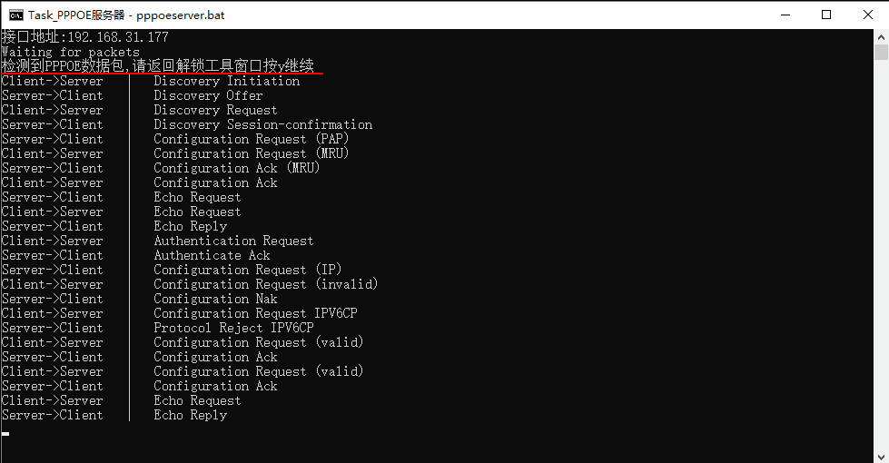
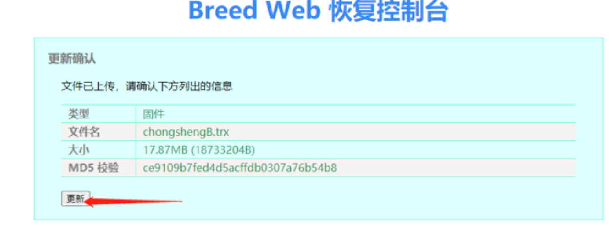

红米的 RM2100（或者小米 AC2100）最近挺火的，因为价钱便宜，配置给力，信号不错，主要是可以刷机。

咸鱼上斐讯 K2P 已经炒上天了，虽然信号各方面没得说，但是价钱嘛。还是小米的这两款给力，官方价格，来个优惠券，真香。反观斐讯 K2P 只有二手的，还有可能翻车。于是在官网下手了红米的 RM2100。

收到货之后，稍微用了一会，主要测试原固件。其实还挺好用的，要不是喜欢折腾还有第三方固件有插件的加持，我才不会刷机呢。

下面是刷机的过程。

## 环境准备

### 1、Windows 系统

本文用的是 Windows 10 环境，其他 Windows 系统差不多一样的设置操作。

### 2、开启 Telnet 客户端

- 打开 <u>控制面板</u>

- 找到 <u>程序</u>---><u>程序和功能</u>---><u>启用和关闭Windows功能</u>

- 勾选 <u>Telnet 客户端</u>


### 3、网卡配置

- 进入 `控制面板\网络和 Internet\网络和共享中心\网络连接（更改适配器设置）`

- 把所有不相关的网络接口都禁掉（WLAN和虚拟机网络接口），只留下本地网线接口
- 修改本地网线接口
  - IP地址：192.168.31.177
  - 子网掩码：255.255.255.0
  - 默认网关：192.168.31.1


3、关闭杀毒软件和防火墙

关闭所有杀毒软件，关闭防火墙（包括360，火戎等等）


## 开启 Telnet

### 1、连接方式

把路由器按照如下图方式连接电脑


### 2、拨号

浏览器进入路由器管理页面（192.168.31.1 或 miwifi.com），确保路由地址为192.168.31.1

- 上网方式：PPPoE

- 账号：123

- 密码：123


### 3、执行开启 Telnet 脚本

- 下载并解压刷机工具【RM2100完整版.zip】， 打开 `/rm2100` 文件夹，双击 npcap-0.9991.exe 安装文件进行安装
- 打开 `开启telnet命令.txt` 文件， 并提前复制好 `开启telnet命令.txt` 里面的命令
- 打开执行 `一键开启telnet.bat`（不用管理员运行），按照提示操作（按回车键）


- 开启 PPPOE 服务器，跳出 Task_PPPOE 服务器窗口，看 Task_PPPOE 服务器窗口是否有数据包（下图红线内容）



- 再回到一键解锁工具窗口，根据提示输入 y 回车，开启文件服务器


- 直到 <u>Task_反弹shell</u> 窗口显示如下内容，则电脑和路由器连接成功了

  > connect to [192.168.31.177] form (UNKNOWN) [192.168.31.1] ......


- 把提前复制好 `开启telnet命令.txt` 里面的命令（不用提前也可以），粘贴到 <u>Task_反弹sheel</u> 窗口（右键为粘贴），回车运行


- 窗口显示蓝线内容，则路由器的 Telnet 开启成功

::: tip 注意

1、卡 <u>Task_反弹shell</u> 等问题大概率是电脑系统、防火墙、杀毒软件造成的，如果开启 Telnet 你这一步没有成功，就彻底关掉电脑防火墙和杀毒软件，再从头走一遍。

2、路由器 Telnet 开启成功后记得把 WAN-LAN 之间的网线（上面接线图棕色线）拔掉，否则刷入 breed 后易造成网络风暴。

:::

## 刷入 Breed

### 1、Telnet 连接路由器

- 打开 cmd 命令行窗口，输入下面命令并回车

```shell
telnet 192.168.31.1		#telnet连接到路由器
```


### 2、下载 Breed 并烧录

依次输入以下三条命令。

出现下图篮框内容，表示 Breed 已经烧录好了，路由正在重启

```shell
cd /tmp
#进入/tmp路径，注意此时“Task_文件服务器”进程是否还在运行，没运行的再执行一下/rm2100中的httpserver.bat，之后再执行下面命令
wget  http://192.168.31.177:8081/breed-mt7621-xiaomi-r3g.bin&&nvram  set uart_en=1&&nvram set bootdelay=5&&nvram set  flag_try_sys1_failed=1&&nvram commit
#下载Breed.bin并设置环境参数
mtd -r write breed-mt7621-xiaomi-r3g.bin Bootloader
#烧写Breed到Bootloader分区
```


- 更改 PC 端 IP

将电脑有线网卡改为自动获取 IP，等待路由器重启（当电脑获取到 IP 或者路由只有一个蓝灯亮时，Breed 引导官方固件成功）。


## 进入 Breed

### 1、断电

建议等待 3 分钟后拔掉电源

### 2、进入 Breed

- 用牙签按住 reset 键不要松开，再通电
- 一直等到蓝灯闪烁再松开 reset 键
- 浏览器访问 192.168.1.1 即可进入 Breed Web 界面。
- 首次进入 Breed 记得先备份下编程器固件和 eeprom。

至此，成功进入路由器 Breed。


## 刷入第三方固件

在刷第三方固件之前，进入 Breed 控制台，固件备份，最好先一下备份编程器固件。

### 1、Padavan 固件

- 进入 Breed 控制台，选择固件更新---固件---选择文件，选择老毛子 Padavan 固件后，点上传


- 上传完成后，更新确认，确认没问题后点击更新



- 正在更新，等待更新完成


- 更新完成后，等待 3 分钟，然后浏览器输入 Padavan 的管理 IP 地址（不同大佬编译的固件，管理 IP 地址可能不同），输入账号密码进入路由后台
  - 账号：admin
  - 密码：admin


- 登陆成功，进入熟悉的老毛子后台界面，有你需要的插件

### 2、OpenWRT 固件

- 进 Breed 的环境变量编缉菜单，新增字段 xiaomi.r3g.bootfw 值为 2， 然后点保存。


- 刷入临时固件（刷入方法同上）


- 重启后会进入这个临时的 openwrt，我们打算用它来刷我们真正想刷的 openwrt 固件。这个临时 openwrt 的地址是 192.168.1.1，用户名是 root，没有密码。


- 然后找到 System -> Backup / Flash Firmware，点击 Flash image... 上传我们想刷的 openwrt 固件


- 然后浏览选择固件，点上传


- 不要勾选 Keep settings and retain the current configuration，最后点 Continue


- 等几分钟让路由器自己重启。进入新固件


### 3、GECOOS 固件

- 进入 Breed 控制台，选择固件更新---固件---选择文件，选择集客 AP 固件后，点上传，进入更新面点更新，等在更新完成（从2020051200版本开始支持 breed 升级）


- 更新完成后，等5分钟，在浏览器输入集客 AP 的管理后台IP（6.6.6.6 或者在路由后台找到对应的 IP）
  - 账号：admin
  - 密码：admin


- 进入熟悉的集客 AP 的后台，之后就是自己设置

## 刷回官方 bootloader 及固件

### 1、刷回官方 bootloader

- 首先进入 Breed，固件更新--->Bootloader---选择文件（选择官方 bootloader 文件）--->上传


- 确认更新界面，点更新，官 bootloader 只有 512KB 大小，所以很快就更新完成并返回 Breed 界面


- 此时，已经刷回官 bootloader 了

### 2、刷回官方固件

上面已经恢复官方 boot 引导，再用官方救砖工具一键刷回。

- 首先断开电源，用牙签按住重置键，再插上电源，持续大概10秒，直到出现**橙色灯闪烁。**
- 使用小米路由修复工具，刷回固件，打开其中的 MIWIFIRepairTool.x86


- 点击浏览，选择下载文件中的官方 **固件--->红米--->miwifi_rm2100_firmware_d517e_1.0.14.bin**，点击下一步


选择连接路由器 LAN口 的网卡，再点击下一步（开启本地服务器）


- 然后就会自动开始刷机了（把官方固件传到路由器上并烧录）


- 进度条跑满，看到如下提示时，并且路由器出现蓝色灯闪烁，即可重启路由器完成刷机


- 路由重启完成后，登陆路由器后台手机 APP（或浏览器 192.168.31.1），顺利进入路由器后台


- 刷回官方固件就完成了

## 相关文件

链接: <https://pan.baidu.com/s/1A5Z5DpOdlTVO-9lqS2crig>

提取码: 7kmn

## 本文参考

[Breed来自恩山ivybridgexeon的帖子](https://www.right.com.cn/forum/forum.php?mod=viewthread&tid=4023907&extra=page%3D1&page=1)

[Padavan来自恩山淮尚的帖子](https://www.right.com.cn/forum/forum.php?mod=viewthread&tid=4022682&extra=page%3D1%26filter%3Dtypeid%26typeid%3D43)

[OpenWrt来自恩山pnq的帖子](https://www.right.com.cn/forum/forum.php?mod=viewthread&tid=4025861&extra=page%3D1%26filter%3Dtypeid%26typeid%3D43)

[GECOOS来自恩山sgwyj的帖子](https://www.right.com.cn/forum/thread-4021056-1-1.html)

[小米路由官方救砖工具使用说明](https://www.xiaomi.cn/post/5289432)

[小米路由官方资源下载首页](http://miwifi.com/miwifi_download.html)

[红米AC2100刷回官方固件](https://www.smyz.net/pc/7793.html)

还有部分其他论坛帖子，有些忘记了，所以就不一一列出了。

