前几天在闲鱼上看到一款路由器瑞斯康达 SGM1500，网上查了一下相关配置，还不错，还可以刷机，于是搞了一台。

## 配置参数

- CPU：MT7621
- 接口：1WAN+4LAN，USB2.0（全千兆网口）
- 无线：2.4G/5G（7615DN）
- Flash：128M（NAND）
- 内存：256M

## 刷入 Breed

### 确定Breed

CPU 和无线芯片是和 K2P 一样的，内存和 Flash 方案和小米R3G、极路由4一样（nand flash）。
根据相关配置信息，到 hackpascal 大佬的恩山帖子查找，MT7621 的 nand flash 方案的 Breed 有极路由4，小米R3G（网件R6220内存只有128M排除掉）

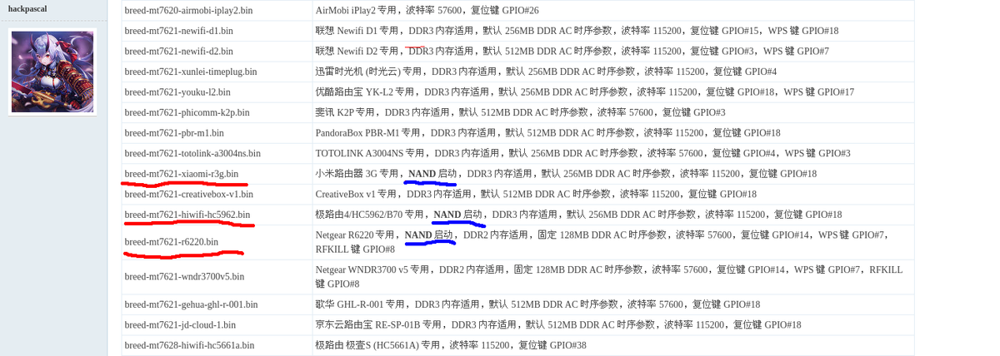


然后先把这 2 个 breed 先下载下来备用，放在 tftpd32.exe 所在目录（提前下载好 tftpd32 并解压好）

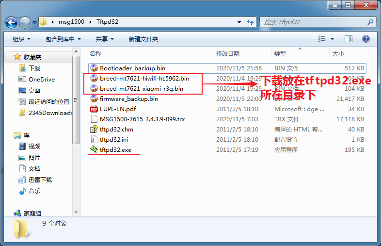

### Telnet 进入路由

路由器通电，用网线连接路由器的 LAN 口和电脑的网口

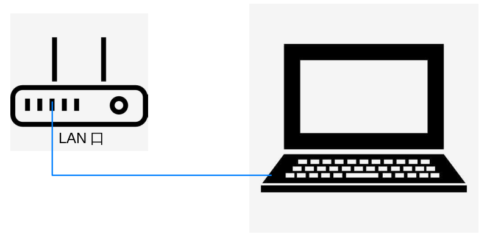

等待片刻打开 CMD 输入 ipconfig，查看有线网卡获取到IP地址（192.168.2.X）和网关（192.168.2.254）

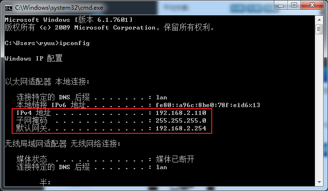

用 putty 工具 telnet 进入路由器

- host IP：192.168.2.254
- connection type：telnet
- 用户名：root
- 密码：root

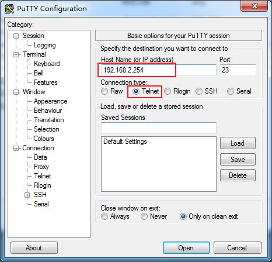

### 备份原固件和 Bootloader

1. 查看分区信息
    `cat /proc/mtd`

```sh
root@OpenWrt:~# cat /proc/mtd
dev:    size   erasesize  name
mtd0: 07f80000 00020000 "ALL"
mtd1: 00080000 00020000 "Bootloader"    #mtd1就是引导分区（Bootloader）
mtd2: 00080000 00020000 "Config"
mtd3: 00040000 00020000 "Factory"
mtd4: 01ec0000 00020000 "firmware"      #mtd4就是固件分区（firmware）
mtd5: 01b94faf 00020000 "rootfs"
mtd6: 05f80000 00020000 "rootfs_data"
root@OpenWrt:~#
```

2. 备份分区
    `dd if=源文件(input file) of=目的文件(of=output file )`
    备份启动分区和固件分区到 `/tmp` 目录下

```sh
root@OpenWrt:~# dd if=/dev/mtd4 of=/tmp/firmware_backup.bin
62976+0 records in
62976+0 records out
root@OpenWrt:~# dd if=/dev/mtd1 of=/tmp/Bootloader_backup.bin
1024+0 records in
1024+0 records out
root@OpenWrt:~#
```

3. 查看备份

```sh
root@OpenWrt:~# cd /tmp/
root@OpenWrt:/tmp# ls
Bootloader_backup.bin		#有此文件，说明上面的备份成功
firmware_backup.bin				#有此文件，说明上面的备份成功
root@OpenWrt:/tmp#
```

4. 导出备份

   见<u>**文件传输**</u>内容

### 开启 tftp

打开tftpd32.exe之前，先关闭系统防火墙和杀毒软件，否则 tftp 命令不能传输文件

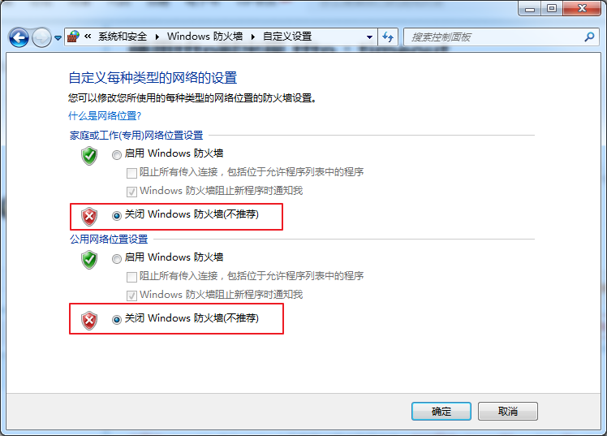

打开 tftpd32.exe，就会自动开启 tftp 服务器，Server interfaces 选择电脑网口的 IP，就是上面 CMD 获取的IP（192.168.2.X）

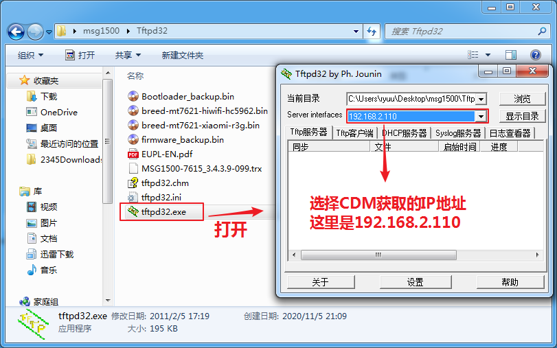

### 文件传输

1. 导出备份

下面两个命令是把备份固件导出到本地 tftpd32.exe 所在目录中

```ruby
root@OpenWrt:/tmp# tftp -pl Bootloader_backup.bin 192.168.2.192
root@OpenWrt:/tmp# tftp -pl firmware_backup.bin 192.168.2.192
```

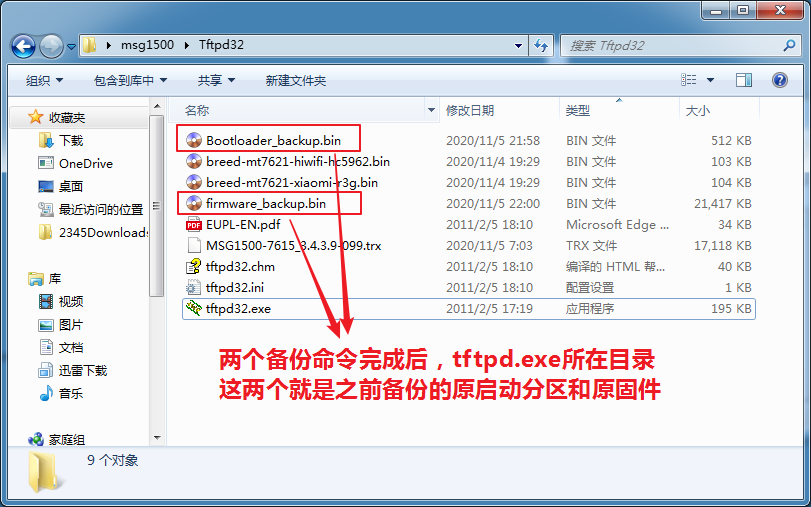


2. 上传 breed 文件到路由器

把下载的 Breed 放到本地 tftpd32.exe 所在的目录下，先测试极路由4 的 **breed-mt7621-hiwifi-hc5962.bin**（如果此 Breed不可用，再测试小米R3G的 Breed）

- 上传并确认 Breed 文件

```sh
root@OpenWrt:/tmp# tftp -gr breed-mt7621-hiwifi-hc5962.bin 192.168.2.192
#把本地tftpd32.exe所在目录中的breed-mt7621-hiwifi-hc5962.bin文件上传到路由的/tmp目录下
root@OpenWrt:/tmp# ls
breed-mt7621-hiwifi-hc5962.bin
```

- 刷入 Breed
   把 Breed 刷入到 Bootloader 分区
   
   `mtd write /tmp/breed-mt7621-hiwifi-hc5962.bin Bootloader`

```ruby
root@OpenWrt:/tmp#mtd write /tmp/breed-mt7621-hiwifi-hc5962 Bootloader
Unlocking Bootloader ...

Writing form /tmp/breed-mt7621-hiwifi-hc5962.bin to Bootloader ...
root@OpenWrt:/tmp#
```

以上，Breed 就刷入完成了，开机启动看看能否进入 Breed。

## 进入 Breed

- 路由器断电
- 按住路由 WPS 键并通电（WPS键继续按住8秒左右）
- 浏览器输入192.168.1.1

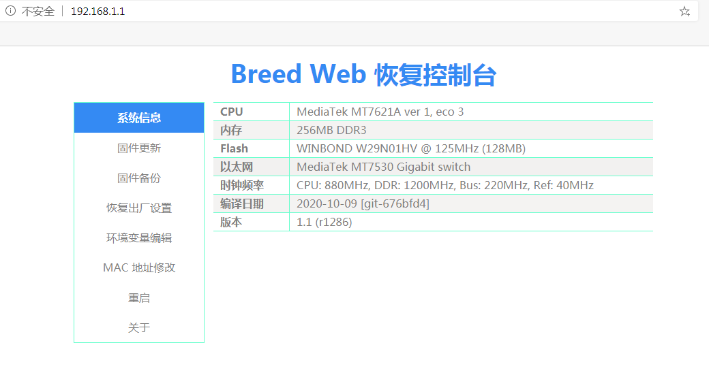

成功进入 Breed，以防万一，继续备份一下。


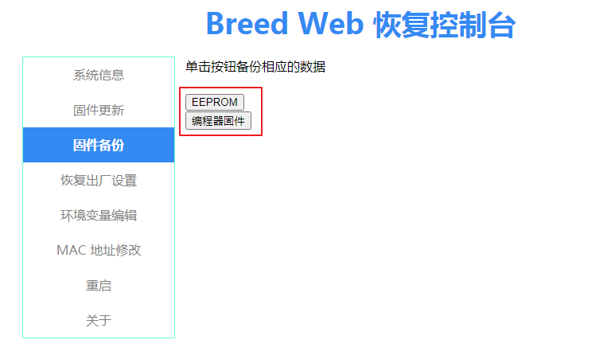

## 刷第三方固件

C 大的老毛子已增加此型号，编译一下即可，参考老毛子固件 Padavan 编译

- 如图选择文件，这里选择的是 C 大的老毛子固件

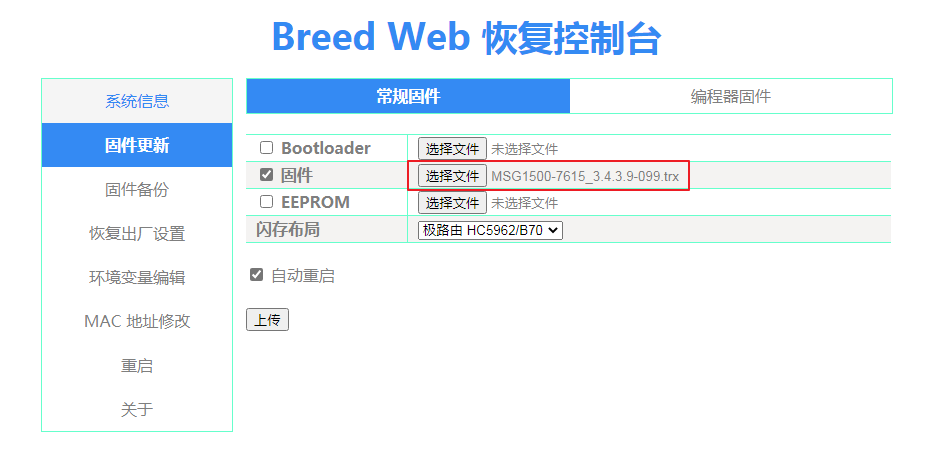

- 点击更新，开始刷机

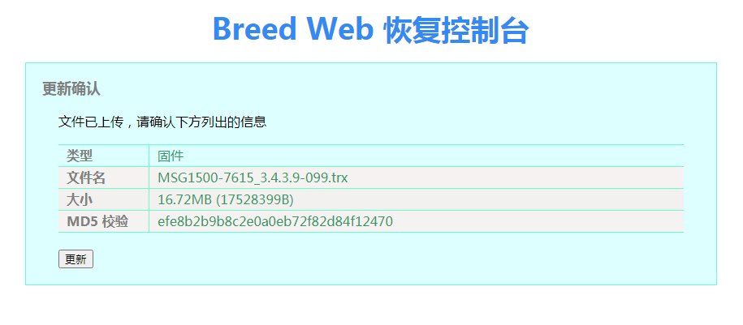

- 等到更新成功后重启路由器
  - 浏览器输入192.168.2.1
  - 用户名：admin
  - 密码：admin

成功进入路由器后台界面

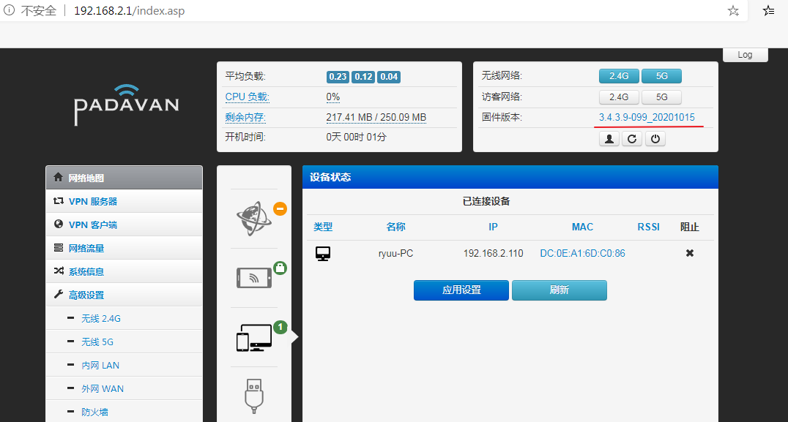


编译时加入了一些插件


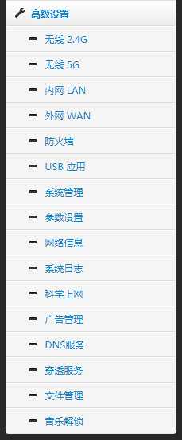

USB 接口测试可用

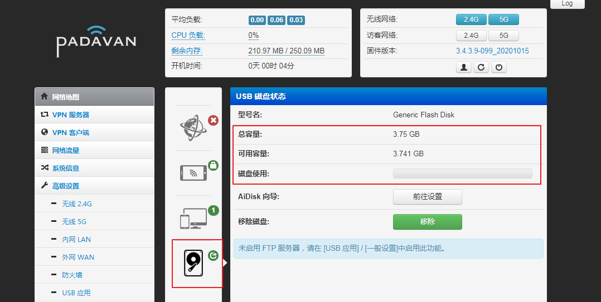

## 无线测试

测试了一下无线效果，并不是很好（非专业测试，只是在家里几个地方测试了一下，仅供参考）

| WiFi   | 2.4G Down | 2.4G Up | 5G Down | 5GUp |
| ------ | --------- | ------- | ------- | ---- |
| 贴脸   | 70.9      | 55.5    | 135     | 92   |
| 一堵墙 | 38.2      | 30.6    | 119     | 118  |
| 两堵墙 | 2.6       | 7.2     | 28.4    | 41.6 |

## 个人感受

无线并不是很强，不如红米 AC2100，更不如 K2P，看他们的 2.4GWIFI 芯片对比，虽然价格还算便宜，效果真的不咋地。如果不考虑无线的话，当个主路由、旁路由或交换机，干些其他等，还是很值的。

## 相关文件

待整理上传

## 本文参考

<https://www.right.com.cn/forum/thread-161906-1-1.html>

<https://post.smzdm.com/p/aoozem39/>

<https://github.com/chongshengB/Padavan-build>

