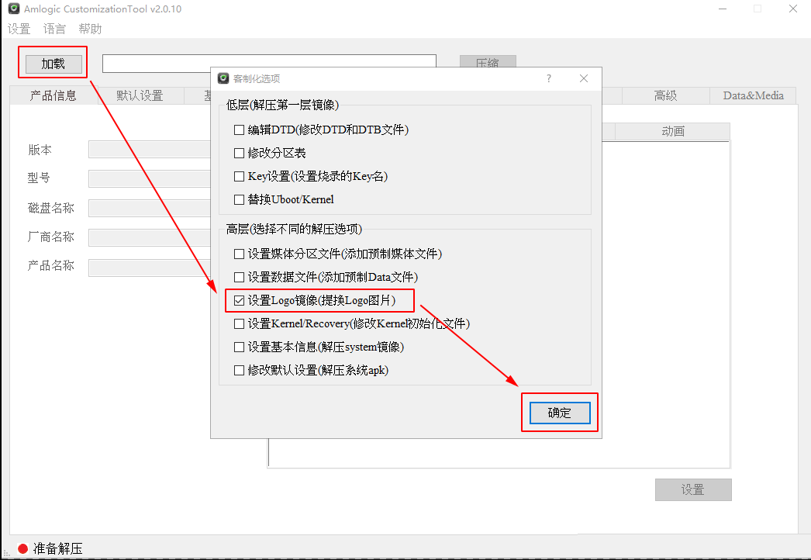
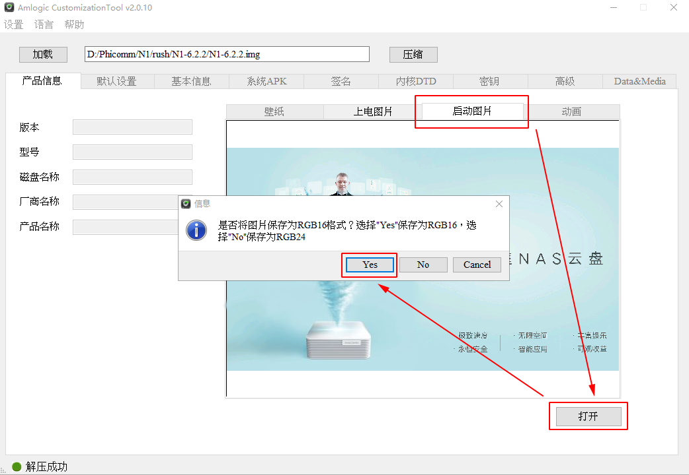

斐讯 N1 的刷机，网上的教程满天飞，随便找一个都可以。但是，刷完机之后，开启启动的第一屏 logo 我个人不是太喜欢。于是，就有了想替换的想法，在网上查询了半天，有两种方法：一个是用 Amlogic CustomizationTool 工具修改替换刷机包的 logo，这个需要重新刷机；另一个是直接命令行替换，无需刷机。

### 方法一

1. 首先到网上搜索 Amlogic CustomizationTool 工具并下载安装。

2. 打开工具，点击【加载】会跳出新的选项窗口，勾选【设置Logo镜像（提换Logo图片）】，然后确定。



 3. 选择你要加载的固件 img 文件，等待加载完成。

4. 然后点击【启动图片】，再点【打开】选择自己喜欢的图片，提示保存为 RGB16 格式选择【Yes】。



5. 最后，点击【压缩】，等待打包成新的镜像。（建议打包成新的镜像包名，不要和原镜像重名）

把上面新生成的镜像包重新刷机，N1的开机第一屏 Logo 就变成修改后的图片了。当然这个方法就是有点耗时麻烦，好在修改还是不需要什么技术，当然还可以更多的定制化，如开机动画的修改，添加 APK 软件等等。

### 方法二

此方法来自与恩山 Lilith 的帖子教程，很简单且不需要刷机。

1. 将 `logo.PARTITION` 置于设备存储中 /sdcrad（或其他位置，即参数 if 的位置）
2. 键盘连接 N1，打开终端模拟器（Terminel）输入以下命令（或远程工具连接到 N1)

```shell
dd if=/sdcard/logo.PARTITION of=/dev/block/logo
# 如果没权限执行的话，加上sudo执行
# dd 可从标准输入或文件中读取数据，根据指定的格式来转换数据，再输出到文件、设备或标准输出。
# if=文件名：输入文件名，默认为标准输入。即指定源文件。
# of=文件名：输出文件名，默认为标准输出。即指定目的文件。 
```

3. 重启设备生效

```shell
reboot
```

原贴：<https://www.right.com.cn/forum/thread-764098-1-1.html>

