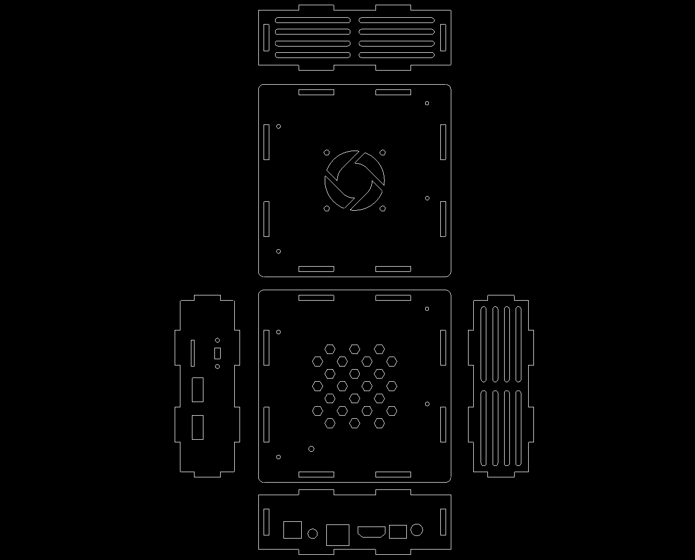
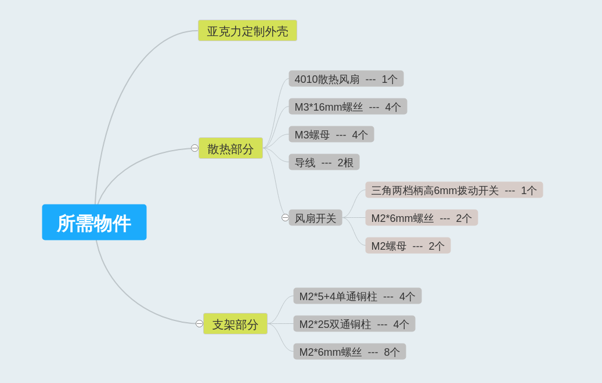
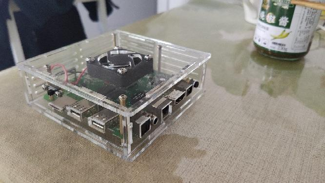
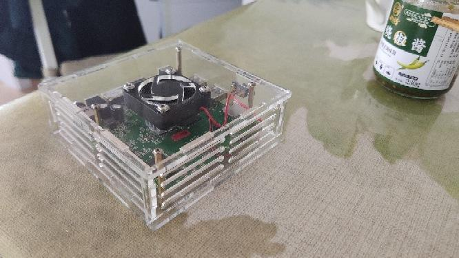
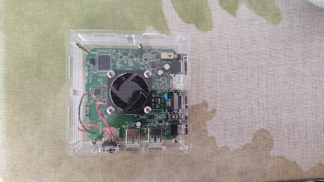
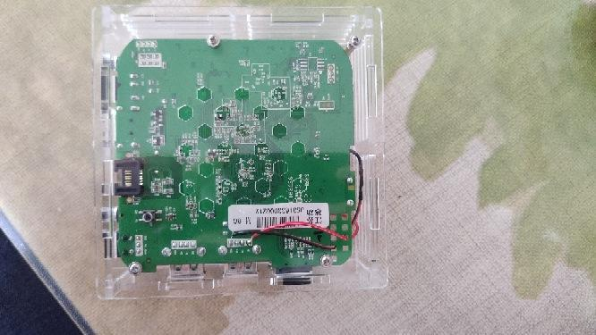
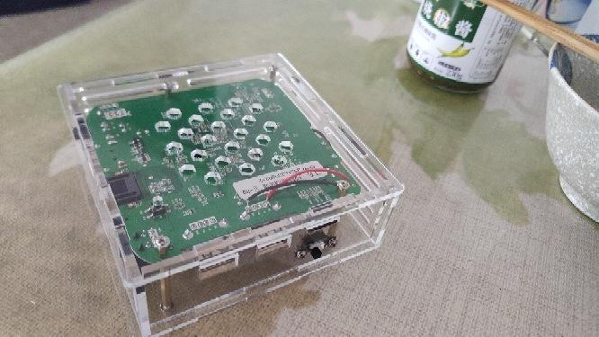
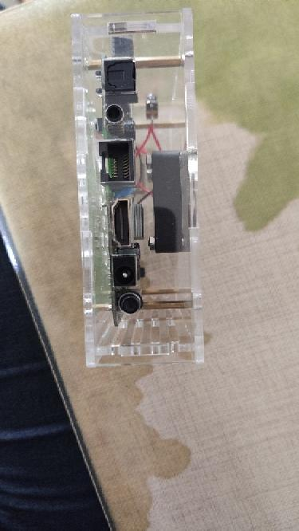
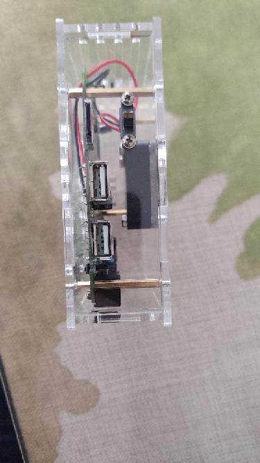

这次直接说说改造过程，首先是拆机测量，设计并画出图纸（比较浪费时间,各种修改），之后去马云家找个亚克力厂家定制外壳，直接把图纸发给客服，估价下单，一般也就十几块钱的样子。还有要买一些组装外壳需要的小零件，铜柱螺丝之类的。

魔百合 Q5（也叫数码视讯 Q5）在复古游戏圈曾是一代神器，刷上复古游戏系统（Sx05RE），可以模拟几千个游戏。当然也可以刷 armbian 系统，可作为家庭小型服务器，刷如破解的 Android TV 系统等。

## 配置参数

- 芯片：S905M 四核 1.5GHz

- 存储：1G+8G

- 接口：两个 USB，1 TF卡，1 百兆网口，1 HDMI

- 无线：有无线 WiFi，无蓝牙

## 图纸设计

首先是拆机测量，设计并画出图纸（比较浪费时间，各种修改），之后去马云家找个亚克力厂家定制外壳，直接把图纸发给客服，估价下单，一般也就十几块钱的样子。

我的是魔百和 Q5 江苏版的，其它版本通不通用不清楚，具体对照一下主板。

## 所需材料

::: center

:::

::: tip 补充

上图材料中再追加加一个 M2 螺母，用于连接一个<u>单通铜柱（M2\*5+4）</u> 和 <u>双通铜柱（M2\*25）</u>。

:::

以下安装教程全是水，安装时忘了拍照，所以流程如下：

1. 首先你得这样，然后再这样

2. 这样安装之后，再这样弄

3. 这样弄完了后，最后再这样

## 完成效果

::: center

:::

## 相关文件

链接: <https://pan.baidu.com/s/1kNk4wjLwczWU3ixMvXGedg>

提取码: 233t
