## 配置

- CPU：MT7621A
- 内存：512MB DDR3
- Flash：32MB
- WAN\*1 + LAN\*4（均为千兆）
- USB 3.0*1
- SATA\*1（支持 SATA3）
- DC：12V、1-2A
- <u>没有无线</u>

## 材料准备

::: center

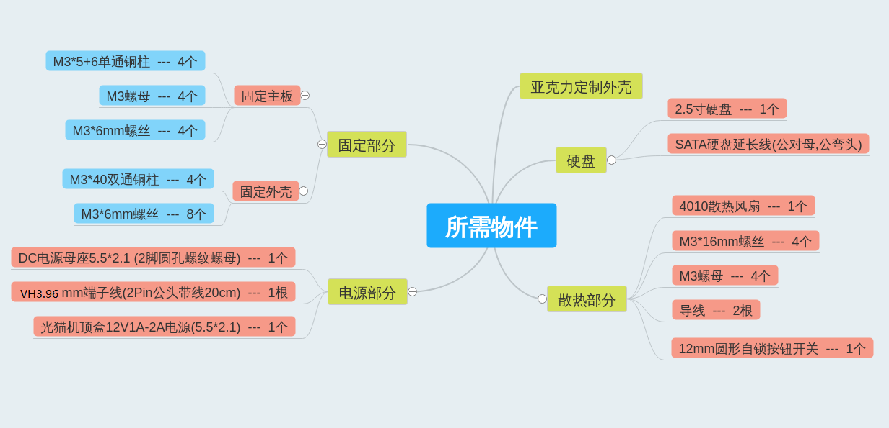

:::

图纸来自于矿渣社区，有好几个版本，看上去有点乱，于是参考图纸重新画了，如下图所示。

::: center

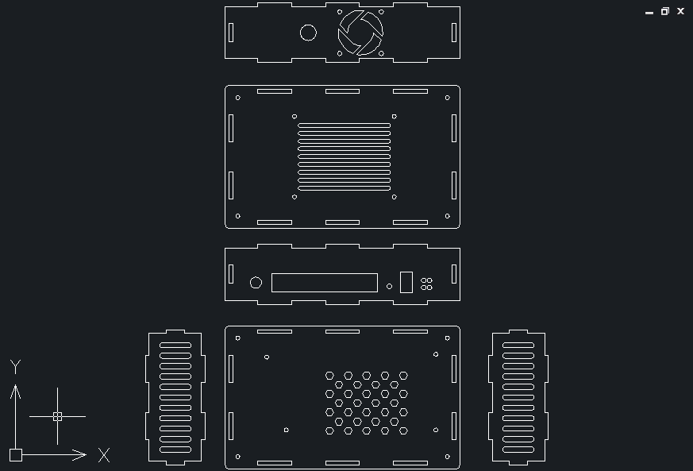

:::

以上物品，自行购买

*淘宝定制亚克力：<u>金亿有机玻璃制品厂</u>，个人推荐非广告，找了好多家，只有他家最便宜，定制过好多次，人也爽快，服务也好*

## 组装前准备

材料齐全之后，首先要对小娱的电路部分改装，主要分两块，一个是电源，一个是风扇，注意导线的长短适当。

### 电源部分

把导线焊接到 DC 电源母座，短脚为正接红线，长脚为负接黑线。（主板端暂时不接，导线的另一端链接主板的 12V 端口上，主板 12V 电源端口有4个，上面有标正负，两个正两个负，只要正负接对了就没问题）

::: center

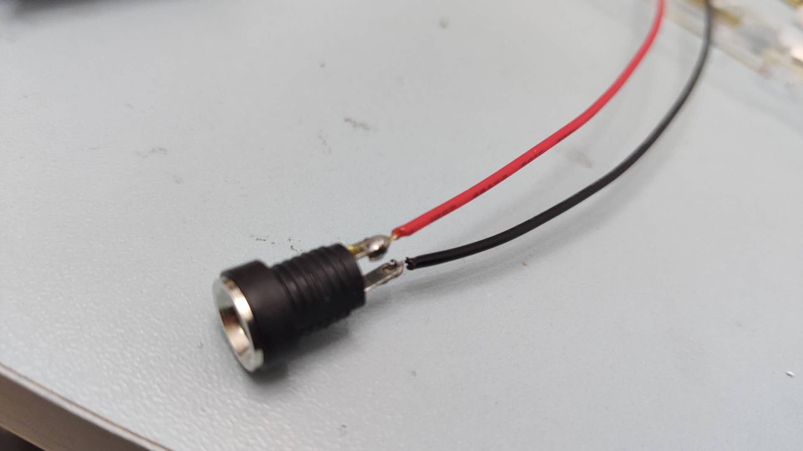

电源接口

:::

### 风扇部分

主板 USB3.0 接口处的背面，有一排 4 个脚针的最外端的两个脚针，如图分别是 5V 的正负极，如下图，把散热风扇的红线接正极，黑线接负极。

::: center

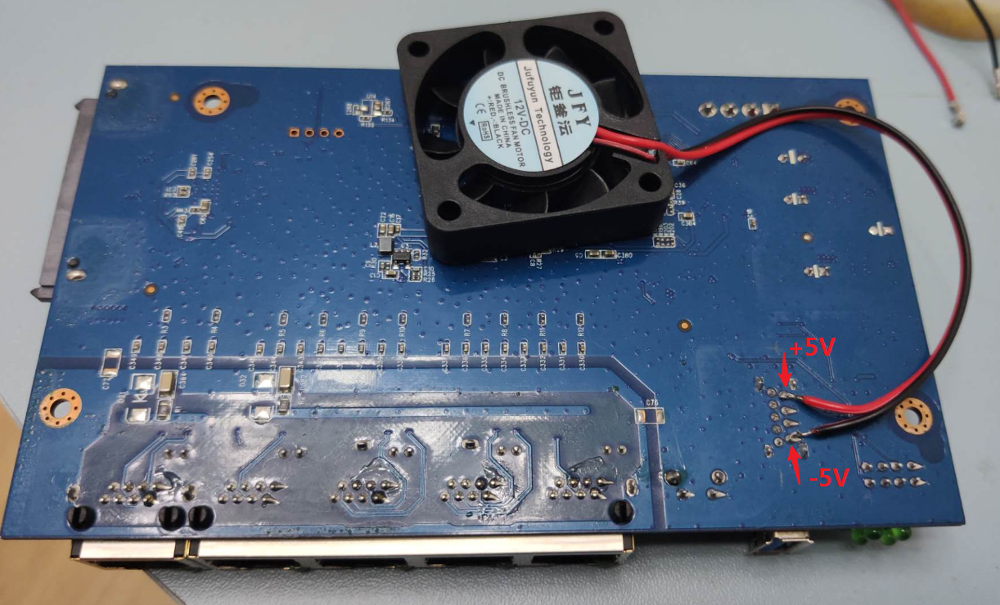

风扇连接

:::

## 开始组装

1. 把焊接好的 DC 电源口安装到带网口的面板上（注意正反面）
::: center
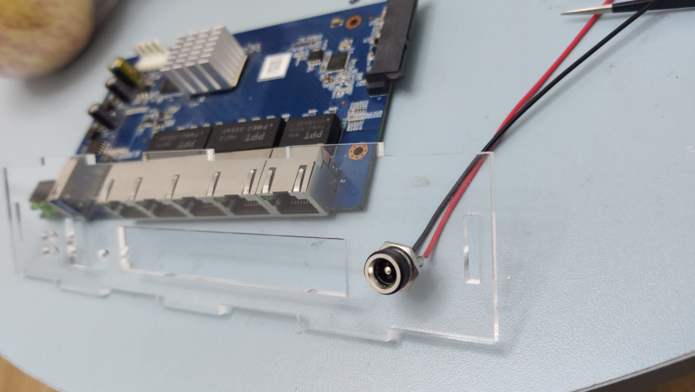
:::
2. 将 M3*5+4 单通铜柱固定在底板安装孔位置 （4 个）
::: center
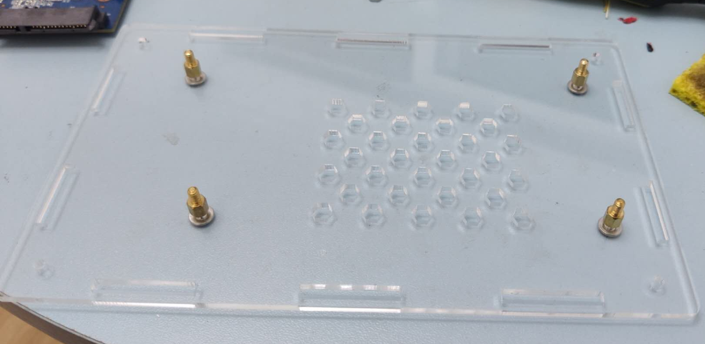
:::
3. 先卡好主板和网口面板，然后再把主板和底板固定好（固定前最好把所有导线理好），再固定风扇到风扇面板，将风扇面板卡到底板上（按装过程忘了拍这几步骤的照片）
::: center
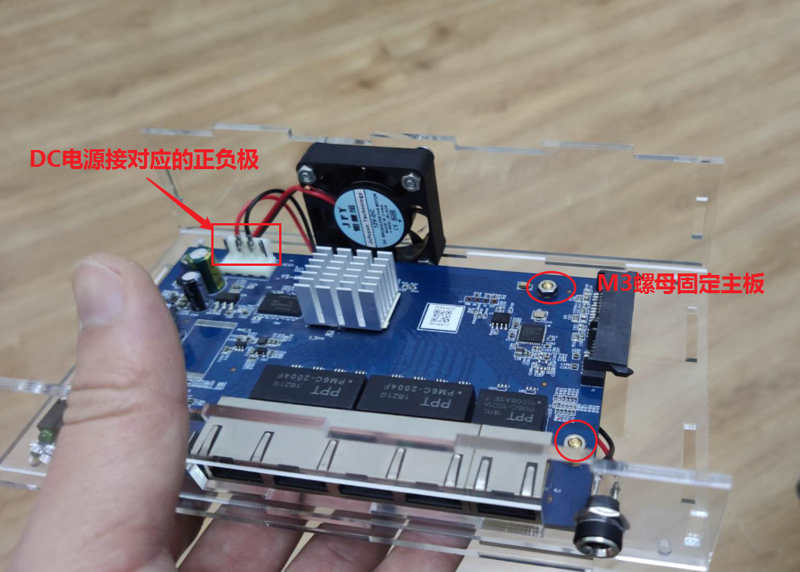
:::
4. SATA 延长线接到主板 SATA 口上 
::: center
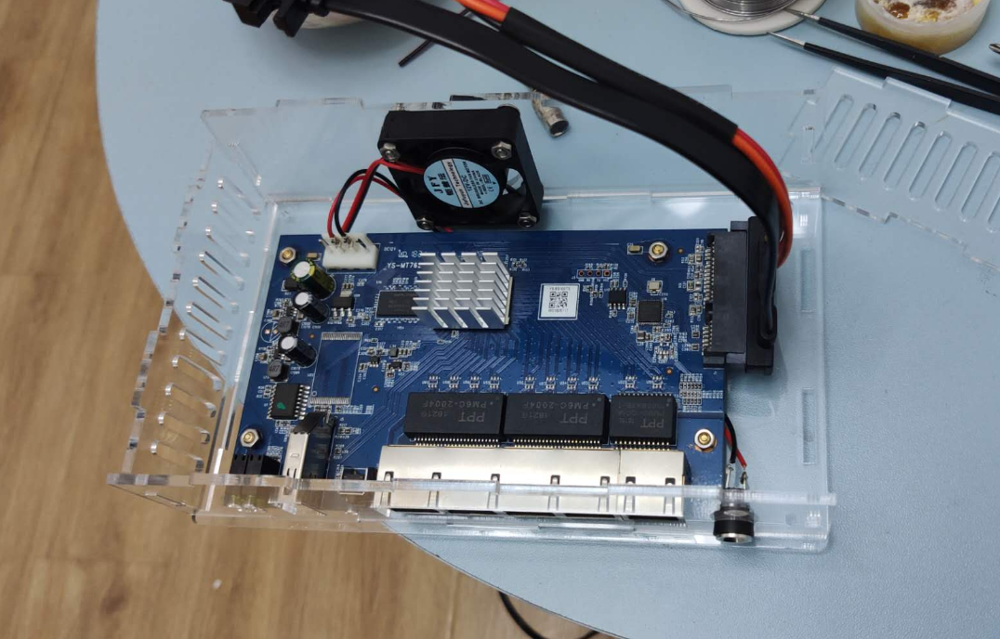
:::
5. 再将两个侧板卡上去
::: center
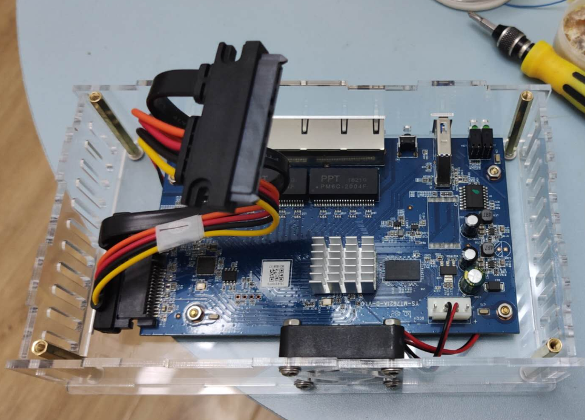
:::
6. 把 2.5 寸硬盘固定到顶板上，注意硬盘和板之间用一个 M3 尼龙垫片垫着，一是为了让 SATA 线能够接上，不会卡住，二是利于散热。
::: center
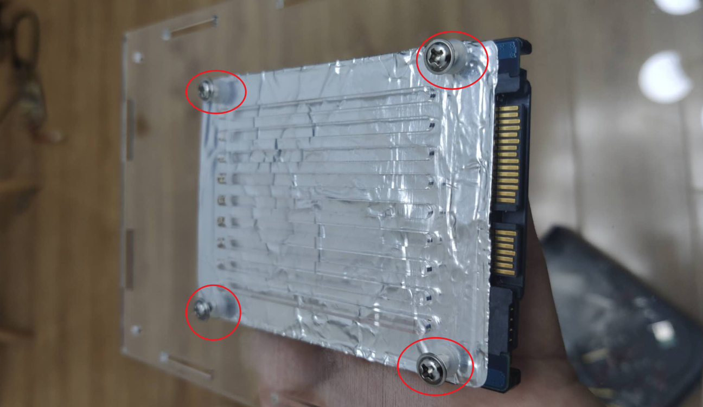
:::
7. SATA 延长线有点硬，先折好弯度，方便顶板的固定
::: center
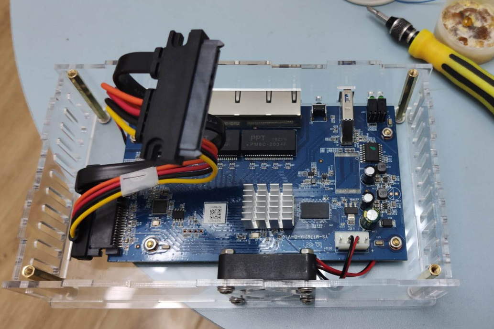
:::
8. 连接上 SATA 线和硬盘
::: center
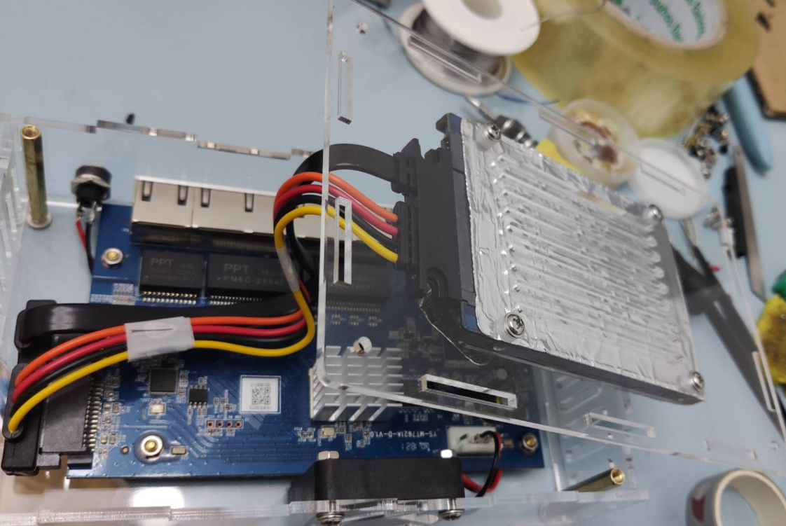
:::
9. 固定顶板，完工
::: center
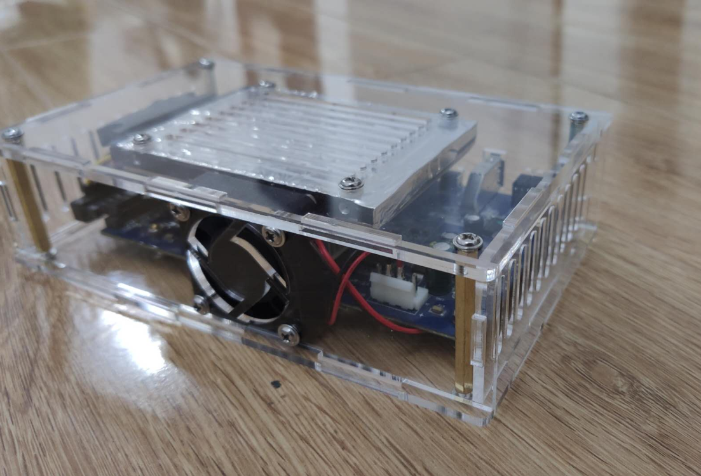
:::
下面几张是完工效果图
::: center
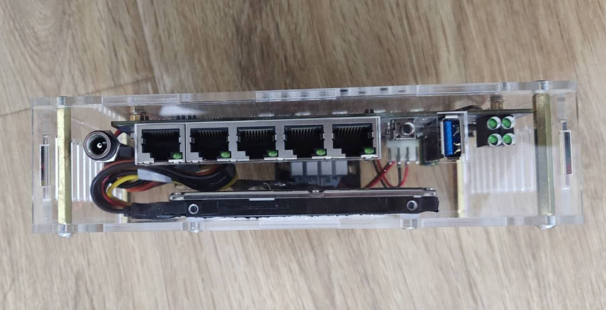

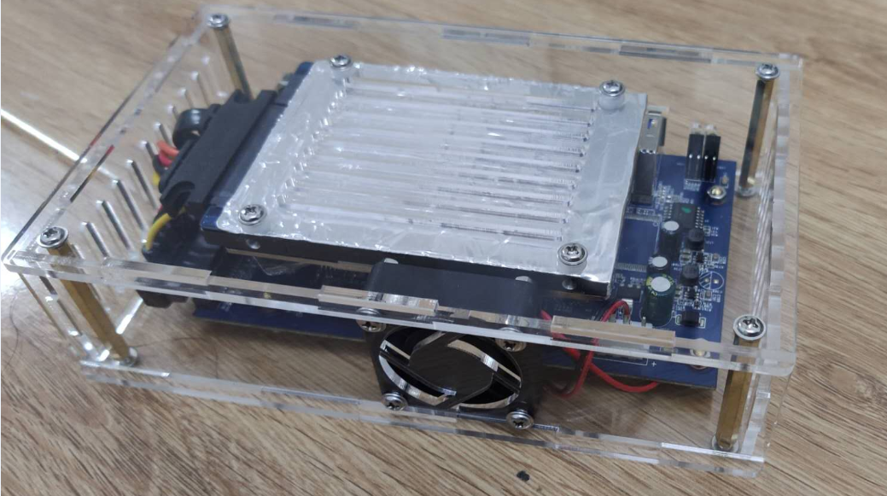

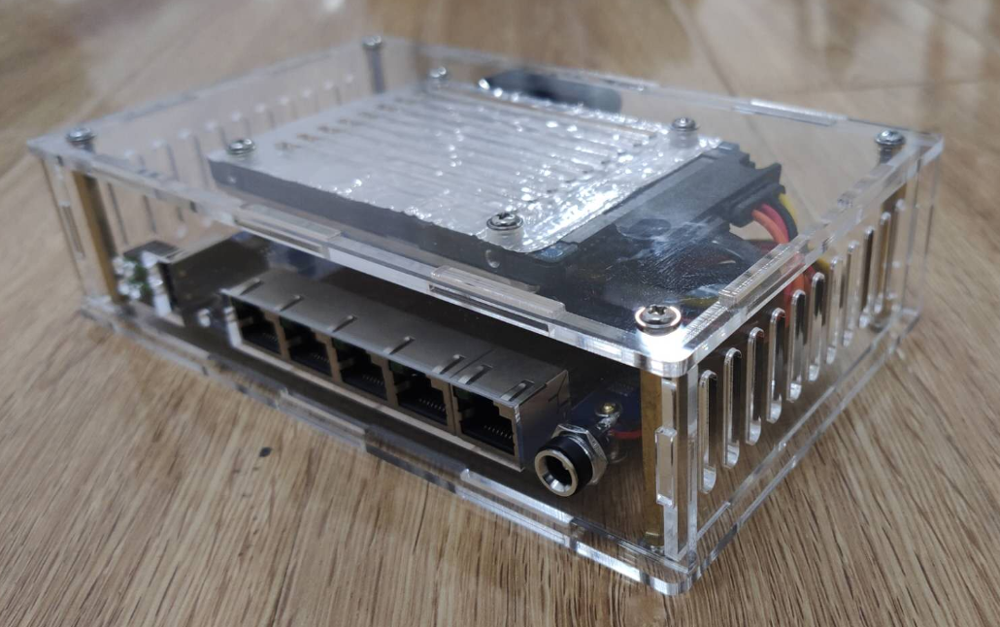
:::

至此，小娱 C1 亚克力外壳改装结束

## 相关文件

链接: <https://pan.baidu.com/s/1-esHAm9bmaPJpx-TTSa4WQ>

提取码: d7cc

## 本文参考

<https://post.smzdm.com/p/a07o89z9/>

<https://post.smzdm.com/p/alpo9wq0/>

<http://bbs.nas66.com/thread-588-1-4.html?_dsign=06917c02>

以及参考于恩山论坛，矿渣社区（不记得具体是哪个帖子）

