## 外观配置 

### 外观图片
::: center
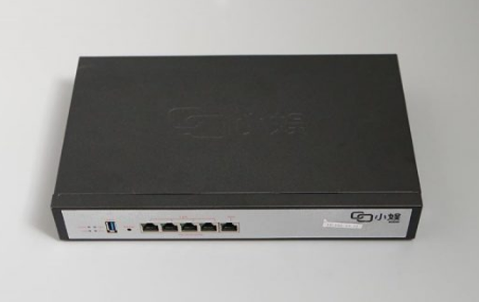

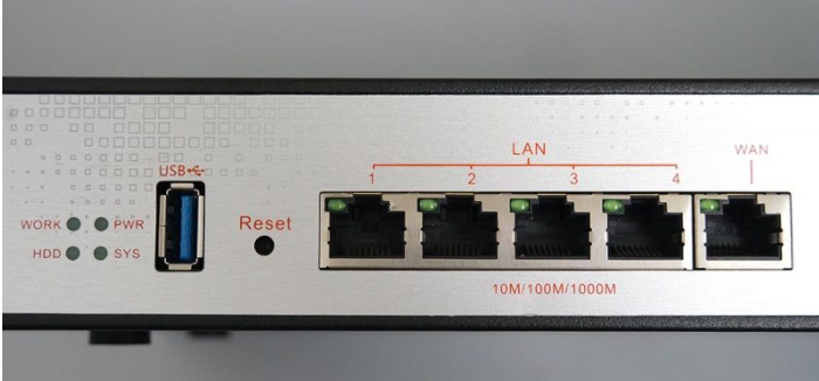

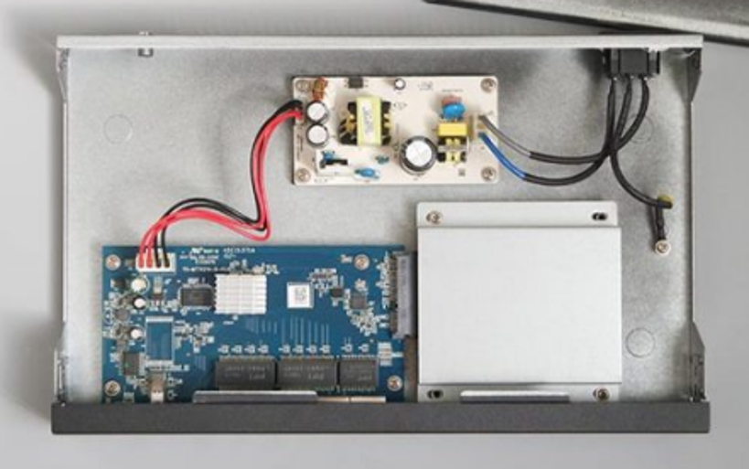

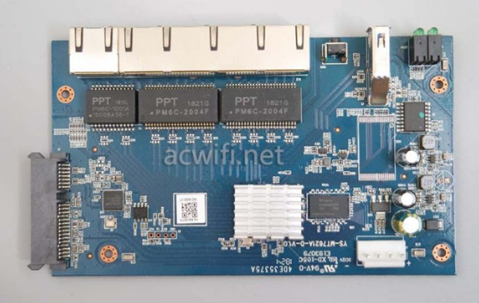

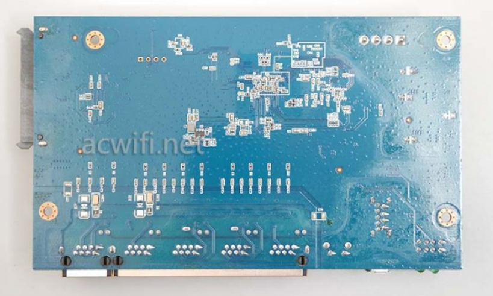
:::

### 配置参数

- CPU：MT7621A

- 网口：LAN \* 4 + WAN \* 1（全千兆）

- USB 3.0 \* 1

- 内置一个 SATA 接口（支持 SATA3）

- 电源 12V1A

- 内存：512MB

- Flash：32MB

## 刷机过程

### 刷入 breed

首先给小娱通电，网线连接小娱 LAN口 和电脑网口，确认电脑网络已经正常连接到小娱，可看电脑 IP 是否为192.168.188.X（X为0-255之间但不为1，不是的话需要手动更改）

下载大佬的一键刷入 breed 工具并解压
::: center
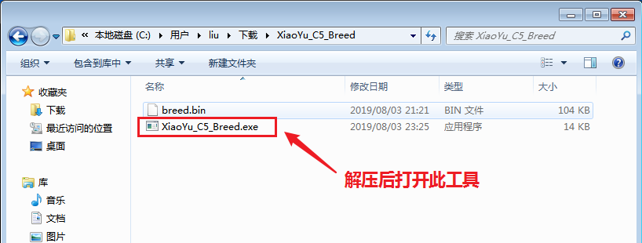
:::
打开 <u>XiaoYu_C5_breed.exe</u> 刷机工具，点击 <kbd>刷入breed</kbd> 按钮，等待刷机完成

- 小娱 IP 地址：192.168.188.1
- 小娱密码：admin
::: center
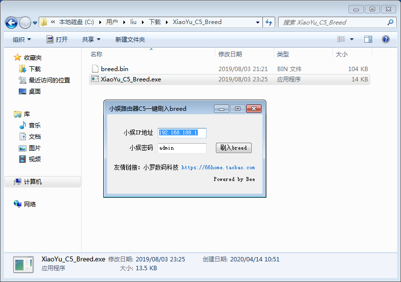
:::
跳出下图说明刷入成功
::: center
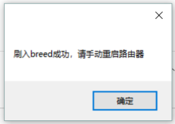
:::
### 进入 breed

刷第三方固件首先要进入 breed，进入 breed 顺序如下

1. 拔掉电源

2. 按住Reset键不放

3. 接通电源

4. 六秒左右松开 Reset 键

5. 浏览器访问：192.168.1.1 进入 <u>Breed Web 恢复控制台</u>
::: center
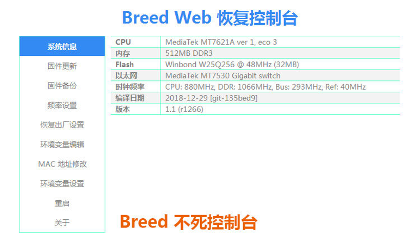
:::
### 刷第三方固件

进入 <u>Breed Web 恢复控制台</u>后，按下图顺序进行刷入第三方固件（以H大老毛子固件为例）

选择文件 <u>MT7621_7603_7612_512M_3.4.3.9-099.trx</u>

::: center
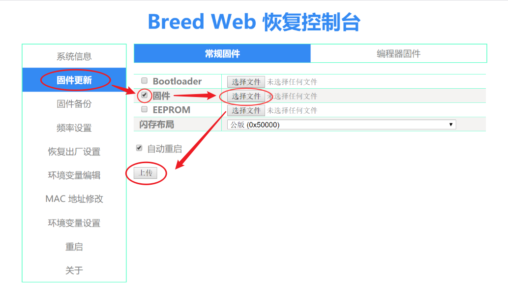
:::
点击上传后，提示正在更新，注意过程中不要断开电源，等待更新完成
::: center
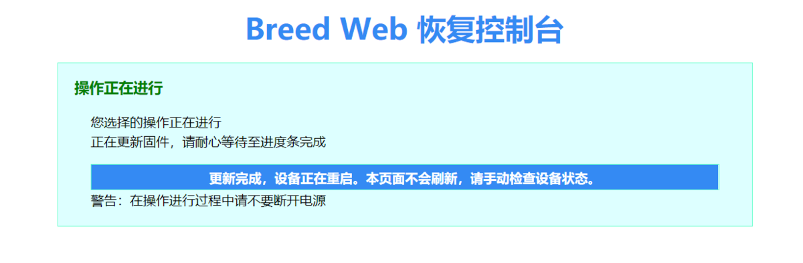
:::
更新成功后，等待两分钟左右，路由会重启完成，此时再浏览器访问老毛子管理后台

- 老毛子 IP：192.168.123.1

- 账号：admin

- 密码：admin

至此，小娱小娱路由器刷机完成。

## 补充

如果无法完成一键刷入 Breed

请参考 <http://www.myzaker.com/article/5e6e2febb15ec077a83269c4>

## 相关文件

链接: <https://pan.baidu.com/s/1-esHAm9bmaPJpx-TTSa4WQ>

提取码: d7cc

## 本文参考

<https://www.acwifi.net/9335.html>

<http://www.myzaker.com/article/5e6e2febb15ec077a83269c4>

<https://post.smzdm.com/p/a07o89z9/>

<https://post.smzdm.com/p/aoowedwn/>

以及恩山论坛，矿渣社区

部分图片没来得及拍，借用以上参考文章或帖子的图片，如有侵权请联系删除。

