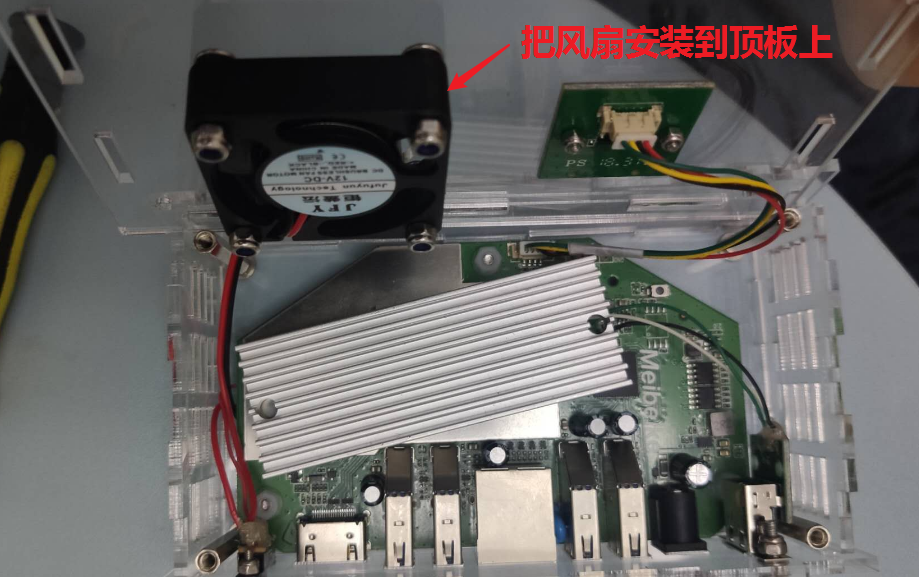

前段时间在网上看到了关于矿渣贝壳云的玩法，灯大的小钢炮固件以及亚克力外壳改造，心动了，手痒了。于是准备对它下手了。

## 配置

贝壳云是一款矿难机，配置如下：

- RK3328 四核 A53 1.5Ghz
- 1G DDR3
- 8G emmc
- USB3.0 x 4
- 千兆有线网口
- HDMI 高清接口

## 刷机

关于刷机，我就不多说了，网上好多教程

[刷机教程](https://www.jianshu.com/p/21d3954231dc)

[各种固件](http://www.wdmomo.fun:81/doc/web/#/5)

[灯大的小钢炮固件](http://rom.nanodm.net/beikeyun/)

小钢炮用这个包：rk3328-beikeyun-linux-hacklog-20190506-0242-freq-limited.7z

## 图纸

网上找到相关图纸，加入了自己的一些想法修改图纸，然后开始定制亚克力盒子，买各种工具小部件，M3 铜柱，螺丝螺母，USB 母口，拨动开关等等，后面会详细整理一下所需的材料。（安装需要有一定的动手能力，我焊接几个触点用了好长时间，手抖，哈哈！）

::: center

贝壳云盒子图纸

2.5 寸硬盘支架图纸

:::

## 材料

::: center

材料

根据图纸制作的亚克力板子

:::

::: tip 说明

安装盒子之前，先把贝壳云刷成第三方系统再安装，具体原因请看本文最后的关于刷机内容。

由于作文水平太低，只好用看图写话的方式描述安装过程。

:::

## 安装过程

### 接线

::: center

USB 母口接线

主板风扇接线

风扇接线电路图（灵魂画手）

:::

### 组装

接线完成后，就开始组装盒子了。

::: tip 说明

此顺序是我自己组装的顺序，建议大家按照图 3→ 4→ 5→ 1→ 2 顺序安装

:::

1. 安装USB母口

::: center

:::

2. 安装开关

::: center

:::

3. 对准接口

::: center

:::

4. 底板准备工作

::: center

:::

::: tip 注意

如果你的主板固定孔和底板对不齐的话，请把底板翻过来，它并不是对称的，要分正反左右的

:::

5. 固定主板

::: center

:::

6. 安装两侧板

::: center

:::

7. 安装前面板

::: center

:::

8. 把灯板安装到顶板上

::: center

:::

9. 把风扇安装到顶板上

::: center

:::

10. 固定顶板

::: center

:::

## 关于刷机

::: center

:::

经过上面的看图写话，相信大家应该已经了然于胸了。

之后会测试 2.5 寸硬盘和贝壳云合体的支架，支架已定制，期待它的到来，我将尝试一下效果怎么样。

---

## 追加

<u>更新于2020.3.21</u> 

贝壳云可合体 2.5寸 硬盘支架安装效果

::: center

:::

## 相关文件

最后给上相关文件链接

链接: <https://pan.baidu.com/s/17Vz-wVCsXUd6HK8S81RtFw>

提取码: m6ve
