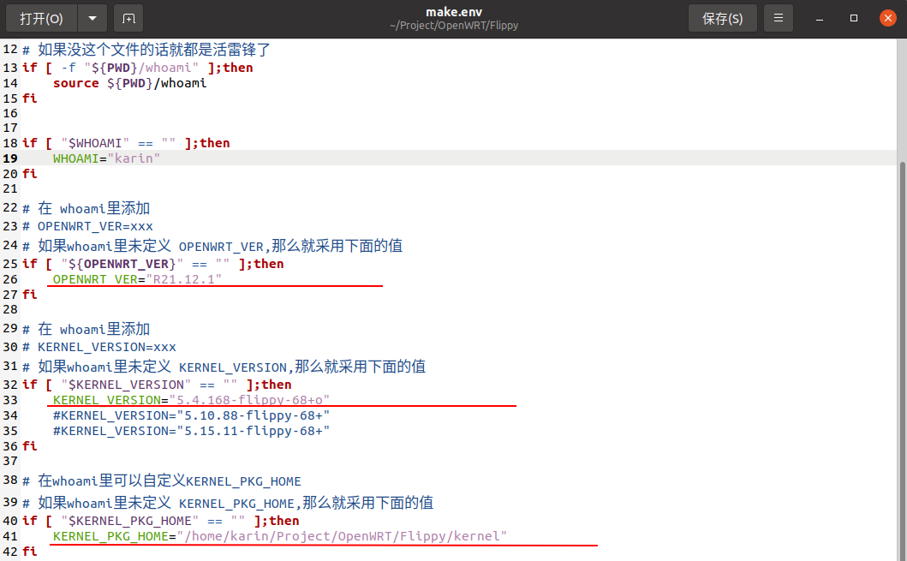

## 所需文件

- Flippy预编译好的 Arm64 内核（3个文件 boot、dtb、modules）

  下载地址：<https://pan.baidu.com/s/19KNVcCQL57mvpiboFc-5rA> 提取码：hk6x 

- 自己编译的 openwrt rootfs tar.gz 包
  - openwrt-armvirt-64-default-rootfs.tar.gz

## 准备环境

- linux 环境（这里以 Ubuntu 20.04 为工作环境）

- 预先安装软件包。

  losetup、lsblk(版本>=2.33)、blkid、uuidgen、fdisk、parted、mkfs.vfat、mkfs.ext4、mkfs.btrfs (列表不一定完整，打包过程中若发生错误，请自行检查输出结果并添加缺失的命令）


## OpenWRT 编译

关于编译，请参考此篇文章：<https://ryukarin.github.io/blog/operate/openwrt/>

**编译注意事项：**

```
Target System  ->  QEMU ARM Virtual Machine 
Subtarget ->  QEMU ARMv8 Virtual Machine (cortex-a53)
Target Profile  ->  Default
Target Images  ->   tar.gz
*** 必选软件包(基础依赖包，仅保证打出的包可以写入EMMC,可以在EMMC上在线升级，不包含具体的应用)： 
Languages -> Perl               
             ->  perl-http-date
             ->  perlbase-getopt
             ->  perlbase-time
             ->  perlbase-unicode                              
             ->  perlbase-utf8        
Utilities -> Disc -> blkid、fdisk、lsblk、parted            
          -> Filesystem -> attr、btrfs-progs(Build with zstd support)、chattr、dosfstools、
                           e2fsprogs、f2fs-tools、f2fsck、lsattr、mkf2fs、xfs-fsck、xfs-mkfs
          -> Compression -> bsdtar 或 p7zip(非官方源)、pigz
          -> Shells  ->  bash         
          -> gawk、getopt、losetup、tar、uuidgen

 * (可选)Wifi基础包：
 *     打出的包可支持博通SDIO无线模块,Firmware不用选，
 *     因为打包源码中已经包含了来自Armbian的firmware，
 *     会自动覆盖openwrt rootfs中已有的firmware
 Kernel modules  ->   Wireless Drivers -> kmod-brcmfmac(SDIO) 
                                       -> kmod-brcmutil
                                       -> kmod-cfg80211
                                       -> kmod-mac80211
 Network  ->  WirelessAPD -> hostpad-common
                          -> wpa-cli
                          -> wpad-basic
          ->  iw
```

**除上述必选项以外的软件包可以按需自主选择。**

- 编译完成后输出路径：`lede/bin/targets/armvirt/64/`

- 固件文件名：`openwrt-armvirt-64-default-rootfs.tar.gz`

## 编译 Phicomm_N1 固件

1. 新建工作目录

   ```shell
   $ mkdir openwrt_arm
   $ cd openwrt_arm
   ```

2. 放置内核文件

   ```shell
   $ mkdir kernel
   #在openwrt_arm下新建kernel目录，并放入Flippy预编译好的Arm64内核（3个相同版本号）
   # boot-5.4.159-flippy-67+o.tar.gz
   # dtb-amlogic-5.4.159-flippy-67+o.tar.gz
   # modules-5.4.159-flippy-67+o.tar.gz
   ```

3. git clone 项目

   ```shell
   $ git clone https://github.com/unifreq/openwrt_packit
   $ ls -l
   总用量 12
   drwxrwxr-x  2 karin karin 4096 11月 16 14:59 kernel
   drwxrwxr-x 19 karin karin 4096 11月 16 14:08 lede
   drwxrwxr-x  6 karin karin 4096 11月 16 14:54 openwrt_packit
   #把编译好的openwrt-armvirt-64-default-rootfs.tar.gz上传至openwrt_arm/openwrt_packit/目录中
   ```

4. 修改环境

   ```shell
   $ cd openwrt_packit
   $ gedit make.env
   #根据提示，修改WHOAMI，KERNEL_VERSION，KERNEL_PKG_HOME
   # WHOAMI是打包者的名字
   # KERNEL_VERSION是Flippy预编译好的Arm64内核的版本，选择对应的版本，其他注释，没有对应版本则修改
   # KERNEL_PKG_HOME是Flippy预编译好的Arm64内核文件所在目录
   #修改完成之后保存
   ```

   

5. 执行打包脚本

   ```shell
   $ sudo ./mk_s905d_n1.sh 
   # ./mk_xxx.sh
   # xxx指代你想要生成的固件对应的芯片型号或设备型号
   # 如下信息表示镜像固件已经生成
   镜像已生成! 存放在 /home/karin/openwrt_arm/openwrt_packit/output/ 下面!
   ========================== end ./mk_s905d_n1.sh ================================
   
   ```

   

参考：

<https://github.com/unifreq/openwrt_packit>

其他盒子固件的编译方法类似（如贝壳云等）
