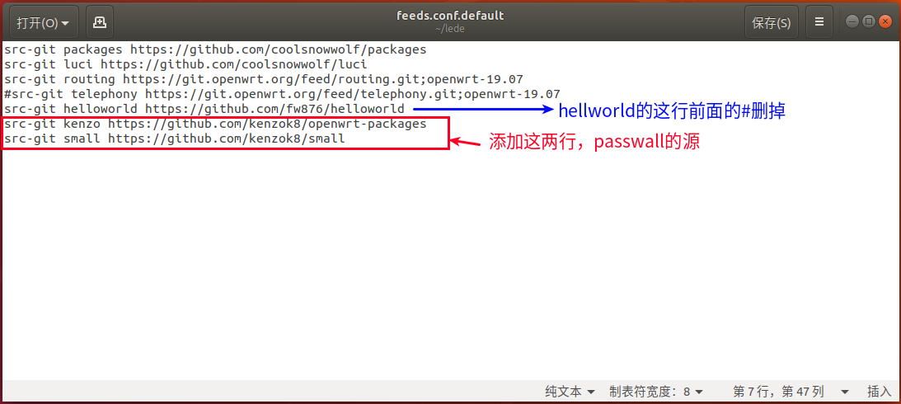
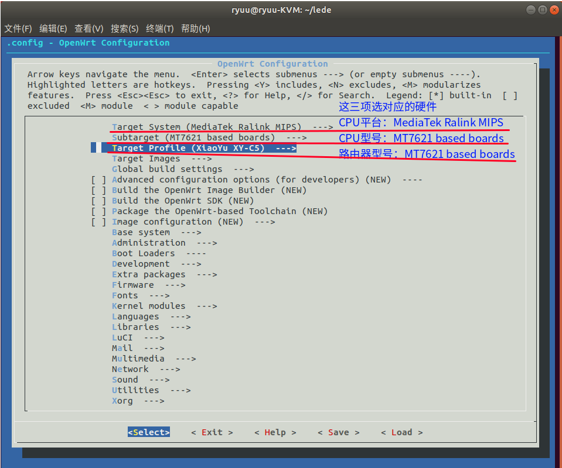
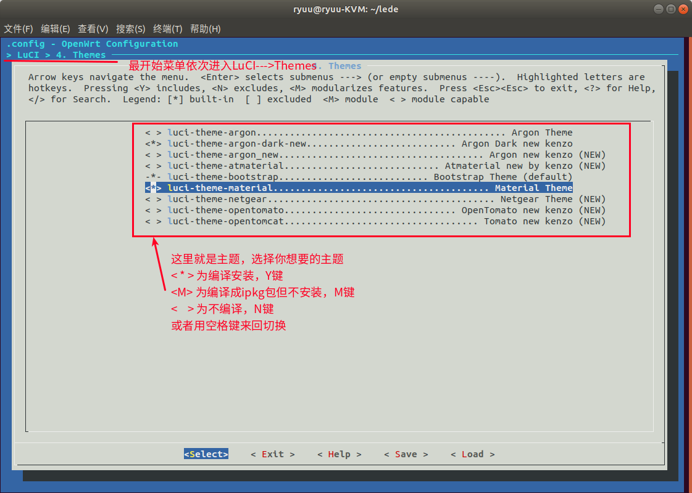
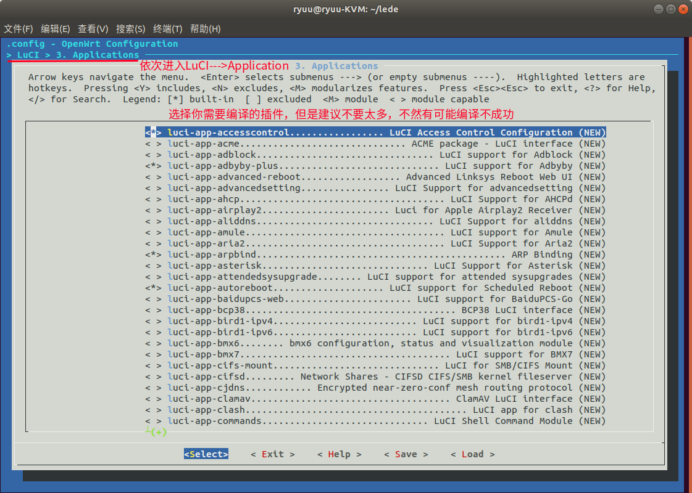
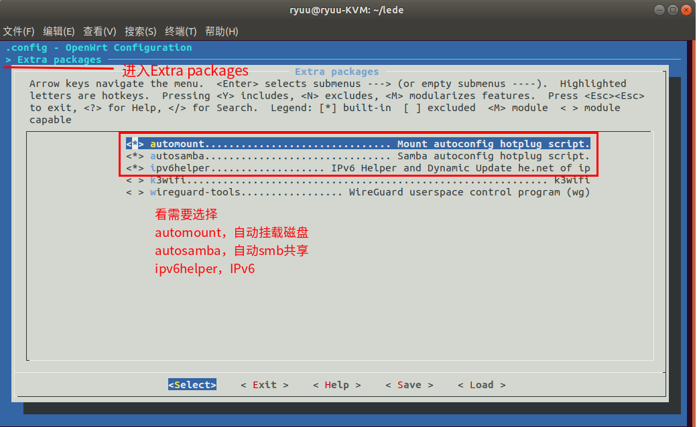

此文主要是以 Lean 的 Openwrt 源码编译：<https://github.com/coolsnowwolf/lede>

## 固件说明

- 默认登陆 IP：192.168.1.1

- 用户名/密码：root/password

- 插件可自行增加或删减

::: tip 说明

- **不要用 root 用户进行 `git` 和编译！！！**
- 国内用户编译前最好准备好梯子

:::

## 环境准备

### 1、Linux 系统

推荐 Ubuntu 18.04 LTS x64，当然其它也可以，本文是基于 Ubuntu 18.04 LTS。

### 2、环境搭建

```shell
$ sudo apt-get update
$ sudo apt-get -y install build-essential asciidoc binutils bzip2 gawk gettext git libncurses5-dev libz-dev patch python3.5 python2.7 unzip zlib1g-dev lib32gcc1 libc6-dev-i386 subversion flex uglifyjs git-core gcc-multilib p7zip p7zip-full msmtp libssl-dev texinfo libglib2.0-dev xmlto qemu-utils upx libelf-dev autoconf automake libtool autopoint device-tree-compiler g++-multilib antlr3 gperf
```

### 3、克隆项目

使用下面命令下载好源代码，然后进入 lede 目录

```shell
$ git clone https://github.com/coolsnowwolf/lede
$ cd lede
```

### 4、插件配置

如果你需要那个什么乳酸菌+，在 lede 路径下，编辑 `feeds.conf.default` 文件，将里面最后一行开头的注释#删除保存，如果还想要 p@55w@11 插件，在此文件末尾追加下面一行内容。如下图所示。

```shell
src-git kenzo https://github.com/kenzok8/openwrt-packages			#passwall
src-git small https://github.com/kenzok8/small			#passwall依赖
```



### 5、更新配置

更新 `feeds.conf.default` 文件

```shell
$ ./scripts/feeds update -a
$ ./scripts/feeds install -a
```

## 开始编译

### 1、编译配置

输入下面命令，跳出图形配置界面，根据自己的硬件以及需要的插件，进行配置，配置好选 save，会保存到在 lede 目录下，文件名默认为 `.config`。（以小娱C1 路由器为例，进行配置）

```shell
$ make menuconfig
```

### 2、硬件型号选择

CPU 型号可以参考这里的 [CSV文件](https://openwrt.org/supported_devices)，去选择相应的硬件平台型号（小娱C1和C5硬件配置一样）



### 3、主题选择

进入 LuCI ---> Themes ，选择你想要的主题



### 4、插件配置

进入 LuCI ---> Applications，选择你想要的插件




::: tip 注意

根据路由器硬件 Flash 的容量大小，插件不要选太多，保证编译出来的固件大小要小于 Flash 的容量，我一开始选了很多插件，编译就失败了，或者即使编译成功了，刷机的时候就会提示容量固件太大了，那么就在要编译的插件选 M，这样就可以让编译出来的固件没那么大了，之后刷机进入 openwrt 再手动安装编译成安装包的插件（当然，我编译小娱C1的 Flash 只有 32M，如果你的 Flash 有 128M，那就无所谓了）

**LuCI ---> Applications 添加常用插件及应用说明**

```shell
LuCI ---> Applications ---> luci-app-accesscontrol  #访问时间控制
LuCI ---> Applications ---> luci-app-adbyby-plus  #广告屏蔽大师Plus +
LuCI ---> Applications ---> luci-app-aria2 # Aria2下载工具
LuCI ---> Applications ---> luci-app-arpbind  #IP/MAC绑定
LuCI ---> Applications ---> luci-app-autoreboot  #支持计划重启
LuCI ---> Applications ---> luci-app-baidupcs-web  #百度网盘管理
LuCI ---> Applications ---> luci-app-ddns   #动态域名 DNS（集成阿里DDNS客户端）
LuCI ---> Applications ---> luci-app-diskman   #磁盘管理工具
    luci-app-diskman ---> Include btrfs-progs   #新型的写时复制 (COW)
    luci-app-diskman ---> Include lsblk   #lsblk命令 用于列出所有可用块设备的信息
    luci-app-diskman ---> Include mdadm   #mdadm命令 用于创建、管理、监控RAID设备的工具
LuCI ---> Applications ---> luci-app-dockerman  #Docker容器 
LuCI ---> Applications ---> luci-app-filetransfer  #文件传输（可web安装ipk包）
LuCI ---> Applications ---> luci-app-firewall   #添加防火墙
LuCI ---> Applications ---> luci-app-flowoffload  #Turbo ACC网络加速（集成FLOW,BBR,NAT,DNS...
LuCI ---> Applications ---> luci-app-frpc   #内网穿透Frp客户端
LuCI ---> Applications ---> luci-app-guest-wifi   #WiFi访客网络
LuCI ---> Applications ---> luci-app-hd-idle  #硬盘休眠
LuCI ---> Applications ---> luci-app-kodexplorer  #KOD可道云私人网盘
LuCI ---> Applications ---> luci-app-mwan3   #MWAN3负载均衡
LuCI ---> Applications ---> luci-app-mwan3helper   #MWAN3分流助手
LuCI ---> Applications ---> luci-app-netdata  #Netdata实时监控（图表）
LuCI ---> Applications ---> luci-app-nfs   #NFS网络共享
LuCI ---> Applications ---> luci-app-nlbwmon   #网络带宽监视器
LuCI ---> Applications ---> luci-app-nps   #内网穿透nps
LuCI ---> Applications ---> luci-app-ntpc   #NTP时间同步服务器
LuCI ---> Applications ---> luci-app-p910nd   #打印服务器模块
LuCI ---> Applications ---> luci-app-passwall  #不解释PassWall
LuCI ---> Applications ---> luci-app-qbittorrent  #BT下载工具（qBittorrent）
LuCI ---> Applications ---> luci-app-qos   #流量服务质量(QoS)流控
LuCI ---> Applications ---> luci-app-ramfree  #释放内存
LuCI ---> Applications ---> luci-app-samba   #网络共享（Samba）
LuCI ---> Applications ---> luci-app-sfe  #Turbo ACC网络加速（flowoffload二选一）
LuCI ---> Applications ---> luci-app-sqm  #流量智能队列管理（QOS）
LuCI ---> Applications ---> luci-app-乳酸菌饮料-plus   #乳酸菌饮料低调上网Plus+
    luci-app-乳酸菌饮料-plus ---> Include s-s v贰瑞 Plugin  #SS v贰瑞插件
    luci-app-乳酸菌饮料-plus ---> Include v贰瑞  #v贰瑞代理
    luci-app-乳酸菌饮料-plus ---> Include Trojan  #Trojan代理
    luci-app-乳酸菌饮料-plus ---> Include red---socks2  #red---socks2代理 
    luci-app-乳酸菌饮料-plus ---> Include Kcptun  #Kcptun加速
    luci-app-乳酸菌饮料-plus ---> Include 违禁软件 Server  #乳酸菌饮料服务器
LuCI ---> Applications ---> luci-app-statistics  #流量监控工具
LuCI ---> Applications ---> luci-app-syncdial  #多拨虚拟网卡（原macvlan）
LuCI ---> Applications ---> luci-app-transmission   #BT下载工具
LuCI ---> Applications ---> luci-app-ttyd   #网页终端命令行
LuCI ---> Applications ---> luci-app-unblockmusic  #解锁网易云灰色歌曲3合1新版本
    UnblockNeteaseMusic Golang Version  #Golang版本
    UnblockNeteaseMusic NodeJS Version  #NodeJS版本
LuCI ---> Applications ---> luci-app-upnp   #通用即插即用UPnP（端口自动转发）
LuCI ---> Applications ---> luci-app-usb-printer   #USB 打印服务器
LuCI ---> Applications ---> luci-app-verysync  #微力同步 
LuCI ---> Applications ---> luci-app-vlmcsd  #KMS服务器设置
LuCI ---> Applications ---> luci-app-vnstat   #vnStat网络监控（图表） 
LuCI ---> Applications ---> luci-app-vsftpd  #FTP服务器
LuCI ---> Applications ---> luci-app-watchcat  #断网检测功能与定时重启
LuCI ---> Applications ---> luci-app-webadmin  #Web管理页面设置
LuCI ---> Applications ---> luci-app-wifischedule  #WiFi 计划
LuCI ---> Applications ---> luci-app-wol   #WOL网络唤醒
LuCI ---> Applications ---> luci-app-wrtbwmon  #实时流量监测
LuCI ---> Applications ---> luci-app-xlnetacc  #迅雷快鸟
LuCI ---> Applications ---> luci-app-zerotier  #ZeroTier内网穿透

```

:::

### 5、下载 dl 库

下载dl库，国内请尽量全局科学上网

```shell
$ make -j8 download V=s
```

### 6、编译

输入编译命令，即可开始编译你要的固件了。

```shell
$ make -j1 V=s		#-j1 后面是线程数。第一次编译推荐用单线程
```

::: tip 说明

本套代码保证肯定可以编译成功。里面包括了 R20 所有源代码，包括 IPK 的。

:::

如果是二次编译

```shell
$ cd lede
$ git pull
$ ./scripts/feeds update -a && ./scripts/feeds install -a
$ make defconfig
$ make -j8 download
$make -j$(($(nproc)+1)) V=s
```

如果需要重新配置：

```shell
$ rm -rf ./tmp && rm -rf .config
$ make menuconfig
$ make -j$(($(nproc)+1)) V=s
```

### 7、查看结果

编译完成后输出路径：`/lede/bin/targets`

::: tip 说明
 如果 feeds update 出现一堆类似下面的警告：

> WARNING: Makefile 'package/lean/shadowsocksR-libev-full/Makefile' has a dependency on 'libpcre', which does not exist

解决办法就是删掉 feeds 整个文件夹，在 lede 或 openwrt 目录下执行 `rm -rf ./feeds`，然后再 update。

## USB/SATA 支持的 Kmod 及挂载

内核编译选项

```shell
make menuconfig
```

- <u>Base syste</u>

  - Block-mount ---Block device mounting and checking------支持设备挂载

- <u>Utilities</u>

  - mount-utils

- <u>Kernel modules > Block Devices</u>

  - kmod-ata-core ------Sata接口核心>>支持的芯片组及传输协议 ID（支持设备类型 IDE AHCI SCSI）

- <u>Kernel modules > Filesystems</u>

  - Kmod-fs-ext4/vfat/ntfs------支持文系统类型 EXT3/4 /FAT/NTFS

- <u>Extra packages</u>

  - automount------自动挂载磁盘

  - autosamba------自动smb共享

  - ipv6helper------支持IPv6



## 参考文档

<https://blog.51cto.com/tiexcn/1700034>

<https://imgki.com/archives/openwrt-lean.html>

<https://github.com/coolsnowwolf/lede>

<https://github.com/kenzok8/openwrt-packages>

<https://www.mianao.info/2020/05/05/%E7%BC%96%E8%AF%91%E6%9B%B4%E6%96%B0OpenWrt-PassWall%E5%92%8CSSR-plus%E6%8F%92%E4%BB%B6>

<https://www.right.com.cn/forum/thread-3682029-1-1.html>

以及恩山其它帖子
