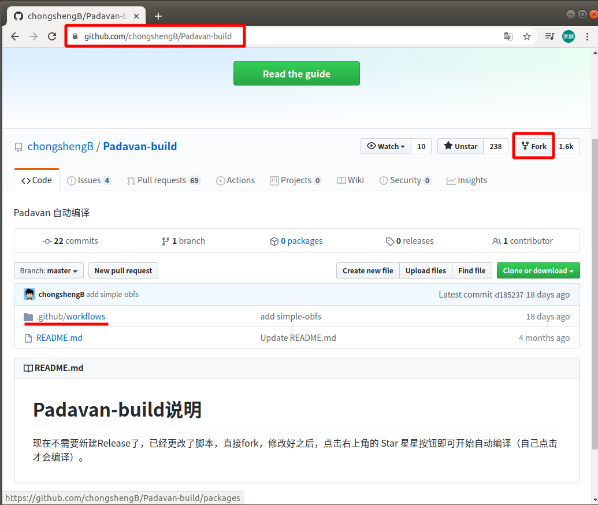

## 固件说明

- 默认登陆IP：192.168.2.1
- 默认用户名/密码：admin/admin
- 默认wifi密码：1234567890
- 集成/取消新增插件请修改此文件：`trunk/build_firmware_modify`
- 已适配除官方适配外的以下机型
  - MI-R3P(感谢群里emmmm适配,可能led控制有点问题,其它功能正常)
  - 京东云路由(文件来自Lintel) 编译代码: JDC-1
  - 歌华链(感谢群里Heaven适配与测试）编译代码: GHL
  - NEWIFI-D1
  - B70(感谢Untitled提供荒野无灯的适配文件)
  - JCG-AC856M(感谢群里的旅途中的我适配和测试,gpio值还未完全适配，但不影响使用)
  - JCG-AC836M(感谢群里的碧霄客修改和测试)
  - YK-L1(L1、L1C、L1W通刷)
  - PSG712
  - PSG1208
  - PSG1218
  - 5K-W20 (USB)
  - OYE-001 (USB)
  - NEWIFI-MINI (USB)
  - MI-MINI (USB)
  - MI-3 (USB)
  - MI-R3G (USB)
  - HC5661A
  - HC5761A (USB)
  - HC5861B
  - 360P2 (USB)
  - MI-NANO
  - MZ-R13
  - MZ-R13P
  - RT-AC1200GU (USB)
  - XY-C1 (USB)
  - WR1200JS (USB)
  - NEWIFI3 (USB)
  - B70 (USB)
  - A3004NS (USB)
  - K2P
  - K2P-USB (USB)
  - JCG-836PRO (USB)
  - JCG-AC860M (USB)
  - DIR-882 (USB)
  - DIR-878
  - MR2600 (USB)
  - WDR7300
  - RM2100
  - R2100

## 本地编译

### 1、安装依赖包

```shell
# Debian/Ubuntu
sudo apt update
sudo apt install unzip libtool-bin curl cmake gperf gawk flex bison nano xxd fakeroot cpio git python-docutils gettext automake autopoint texinfo build-essential help2man pkg-config zlib1g-dev libgmp3-dev libmpc-dev libmpfr-dev libncurses5-dev libltdl-dev wget

# CentOS 7
sudo yum update
sudo yum install ncurses-* flex byacc bison zlib-* texinfo gmp-* mpfr-* gettext libtool* libmpc-* gettext-* python-docutils nano help2man fakeroot
sudo yum groupinstall "Development Tools"

# CentOS 8
sudo yum update
sudo yum install ncurses-* flex byacc bison zlib-* gmp-* mpfr-* gettext libtool* libmpc-* gettext-* nano fakeroot
sudo yum groupinstall "Development Tools"
# CentOS 8不能直接通过yum安装texinfo，help2man，python-docutils。请去官网下载发行的安装包编译安装
# 以texinfo为例
# cd /usr/local/src
# sudo wget http://ftp.gnu.org/gnu/texinfo/texinfo-6.7.tar.gz
# sudo tar zxvf texinfo-6.7.tar.gz
# cd texinfo-6.7
# sudo ./configure
# sudo make
# sudo make install

# Archlinux/Manjaro
sudo pacman -Syu --needed git base-devel cmake gperf ncurses libmpc gmp python-docutils vim rpcsvc-proto fakeroot
```

### 2、克隆源码

```shell
sudo git clone --depth=1 https://github.com/chongshengB/rt-n56u.git /opt/rt-n56u
```

### 3、准备工具链

```shell
cd /opt/rt-n56u/toolchain-mipsel

# （推荐）使用脚本下载预编译的工具链：
sudo sh dl_toolchain.sh

# 或者，也可以从源码编译工具链，这需要一些时间：
# Manjaro/ArchLinux 用户请使用gcc-8
# sudo pacman -S gcc8
# sudo ln -sf /usr/bin/gcc-8 /usr/local/bin/gcc
# sudo ln -sf /usr/bin/g++-8 /usr/local/bin/g++

sudo ./clean_toolchain
sudo ./build_toolchain
```

### 4、自定义插件（可选）

```shell
cd /opt/rt-n56u/trunk
sudo nano build_firmware_modify		#用nano编辑build_firmware_modify文件
#将下图中的插件自定义修改y/n，y是编译，n是不编译，修改好之后，Ctrl+O保存，Ctrl+X退出
```


### 5、修改机型配置文件（可选）

```shell
# cd /opt/rt-n56u/trunk/configs/templates/  #进入此路径
# ls  #查看所有型号路由器的配置文件
nano /opt/rt-n56u/trunk/configs/templates/RM2100.config		#RM2100.config为红米AC2100路由器
# 根据自身情况。自行修改对应的配置文件（可选）
```

### 6、清理代码树并开始编译

```shell
cd /opt/rt-n56u/trunk
sudo ./clear_tree
sudo fakeroot ./build_firmware_modify RM2100		#RM2100就是对应型号路由器的配置文件名
# 脚本第一个参数为路由型号，在trunk/configs/templates/中
# 编译好的固件在trunk/images里
```

## 云编译

以 C 大的 padavan 自编译项目

地址：<https://github.com/chongshengB/Padavan-build>

::: tip 说明

现在不需要新建Release了，已经更改了脚本，直接fork，修改好之后，点击右上角的 Star 星星按钮即可开始自动编译（自己点击才会编译）。

:::

首先你得有个 github 账号（此处省略怎么注册）

### 1、进入项目地址

浏览器进入 <https://github.com/chongshengB/Padavan-build>

### 2、Fork 项目

点击右上的 Fork，就把这个项目 Fork 到自己的账号下了



### 3、进入已 Fork 的项目

然后会自动进入自己账号刚刚 Fork 的项目，点击 `.guthub/workflows`


### 4、找到 build-padavan.yml

进入到 `Padavan-build/.github/workflows/`，点击 `build-padavan.yml`


### 5、编辑 build-padavan.yml

可以看到 `build-padavan.yml` 文件的内容了，点击右上的 **笔** 图标，进入编辑状态


### 6、修改型号

根据第一行的提示内容，找到 `TNAME: K2P-5.0`，把 `K2P-5.0` 改成你要编译的型号（比如红米 AC2100 对应的是 `RM2100`）


::: tip 说明：怎么看不同机器的型号

- 找到 <u>git clone --depth=1 https://github.com/chongshengB/rt-n56u.git /opt/rt-n56u</u> 这一行
- 浏览器打开中间的网址（https://开头.git结尾）<u>https://github.com/chongshengB/rt-n56u.git</u>
- 依次进入 `rt-n56u/trunk/configs/templates`，这里面就是所支持编译的所有机器型号（例如 `360P2.config` 文件，对应的机器型号是 360路由器P2，红米AC2100 就是 RM2100.config，上面修改 TNAME 时，不需要 .config 后缀）


:::

### 7、自定义插件

自定义插件，具体看解释，很简单

```shell
 sed -i 's/CONFIG_FIRMWARE_INCLUDE_OPENSSL_EXE=n/CONFIG_FIRMWARE_INCLUDE_OPENSSL_EXE=y/g' .config
 ################################################################################################
 #因不同型号配置功能不一样，所以先把配置项删除，如果你自己要添加其他的，也要写上删除这一条，切记！！！
 ################################################################################################
 sed -i '/CONFIG_FIRMWARE_INCLUDE_MENTOHUST/d' .config #删除配置项MENTOHUST
 sed -i '/CONFIG_FIRMWARE_INCLUDE_SCUTCLIENT/d' .config #删除配置项SCUTCLIENT
 sed -i '/CONFIG_FIRMWARE_INCLUDE_SHADOWSOCKS/d' .config #删除配置项SS plus+
 sed -i '/CONFIG_FIRMWARE_INCLUDE_SSSERVER/d' .config #删除配置项SS server
 sed -i '/CONFIG_FIRMWARE_INCLUDE_DNSFORWARDER/d' .config #删除配置项DNSFORWARDER
 sed -i '/CONFIG_FIRMWARE_INCLUDE_ADBYBY/d' .config #删除配置项adbyby plus+
 sed -i '/CONFIG_FIRMWARE_INCLUDE_FRPC/d' .config #删除配置项内网穿透FRPC
 sed -i '/CONFIG_FIRMWARE_INCLUDE_FRPS/d' .config #删除配置项内网穿透FRPS
 sed -i '/CONFIG_FIRMWARE_INCLUDE_TUNSAFE/d' .config #删除配置项TUNSAFE
 sed -i '/CONFIG_FIRMWARE_INCLUDE_ALIDDNS/d' .config #删除配置项阿里DDNS
 sed -i '/CONFIG_FIRMWARE_INCLUDE_V2RAY/d' .config #删除配置项v2ray
 sed -i '/CONFIG_FIRMWARE_INCLUDE_TROJAN/d' .config #删除配置项trojan
 sed -i '/CONFIG_FIRMWARE_INCLUDE_WYYBIN/d' .config #删除配置项网易云解锁GO版本
 sed -i '/CONFIG_FIRMWARE_INCLUDE_ZEROTIER/d' .config #删除配置项zerotier
 sed -i '/CONFIG_FIRMWARE_INCLUDE_SMARTDNS/d' .config
 sed -i '/CONFIG_FIRMWARE_INCLUDE_SRELAY/d' .config
 sed -i 's/CONFIG_FIRMWARE_INCLUDE_OPENSSL_EXE=n/CONFIG_FIRMWARE_INCLUDE_OPENSSL_EXE=y/g' .config
 ######################################################################
 #以下选项是定义你需要的功能（y=集成,n=忽略），重新写入到.config文件
 ######################################################################
 echo "CONFIG_FIRMWARE_INCLUDE_MENTOHUST=n" >> .config #MENTOHUST
 echo "CONFIG_FIRMWARE_INCLUDE_SCUTCLIENT=n" >> .config #SCUTCLIENT
 echo "CONFIG_FIRMWARE_INCLUDE_SHADOWSOCKS=y" >> .config #SS plus+
 echo "CONFIG_FIRMWARE_INCLUDE_SSOBFS=n" >> .config # simple-obfs混淆插件
 echo "CONFIG_FIRMWARE_INCLUDE_SSSERVER=n" >> .config #SS server
 echo "CONFIG_FIRMWARE_INCLUDE_DNSFORWARDER=n" >> .config #DNSFORWARDER
 echo "CONFIG_FIRMWARE_INCLUDE_ADBYBY=y" >> .config #adbyby plus+
 echo "CONFIG_FIRMWARE_INCLUDE_FRPC=n" >> .config #内网穿透FRPC
 echo "CONFIG_FIRMWARE_INCLUDE_FRPS=n" >> .config #内网穿透FRPS
 echo "CONFIG_FIRMWARE_INCLUDE_TUNSAFE=n" >> .config #TUNSAFE
 echo "CONFIG_FIRMWARE_INCLUDE_ALIDDNS=y" >> .config #阿里DDNS
 echo "CONFIG_FIRMWARE_INCLUDE_SMARTDNS=y" >> .config #smartdns
 echo "CONFIG_FIRMWARE_INCLUDE_SMARTDNSBIN=y" >> .config #smartdns二进制文件
 echo "CONFIG_FIRMWARE_INCLUDE_V2RAY=y" >> .config #集成v2ray执行文件（3.8M左右)，如果不集成，会从网上下载下来执行，不影响正常使用
 echo "CONFIG_FIRMWARE_INCLUDE_TROJAN=y" >> .config #集成trojan执行文件(1.1M左右)，如果不集成，会从网上下载下来执行，不影响正常使用
 echo "CONFIG_FIRMWARE_INCLUDE_KOOLPROXY=y" >> .config #KP广告过滤
 echo "CONFIG_FIRMWARE_INCLUDE_CADDY=y" >> .config #在线文件管理服务
 echo "CONFIG_FIRMWARE_INCLUDE_CADDYBIN=n" >> .config #集成caddu执行文件（13M左右），如果不集成，会从网上下载下来执行，不影响正常使用
 echo "CONFIG_FIRMWARE_INCLUDE_ADGUARDHOME=y" >> .config
 echo "CONFIG_FIRMWARE_INCLUDE_SRELAY=n" >> .config #可以不集成
 echo "CONFIG_FIRMWARE_INCLUDE_WYY=y" >> .config #网易云解锁
 echo "CONFIG_FIRMWARE_INCLUDE_WYYBIN=y" >> .config #网易云解锁GO版本执行文件（4M多）注意固件超大小,不集成会自动下载
 echo "CONFIG_FIRMWARE_INCLUDE_ZEROTIER=y" >> .config #zerotier ~1.3M
 #########################################################################################
 #自定义添加其它功能请参考源码configs/templates/目录下的config文件。按照上面的格式添加即可
 #格式如下：
 #sed -i '/自定义项/d' .config
 #echo "自定义项=y" >> .config
 #########################################################################################
```

### 8、提交修改

修改完成之后，点击右上的 **Start commit**，跳出小窗口点击 **Commit changes**


### 9、点击 star

提交之后，再点击右上的 **Star**，然后在点击 **Action**


### 10、继续

第一次云编译需要点击 **I understand myworkflows , go ahead and enable them**


### 11、刷新确认

如果还没有编译，在次点击两次 **Star**，让五角星变成黑色填充（文字变成 **Unstar**），刷新网址，就可以看到在编译了


### 12、等待完成

大概等 20 分钟左右，就会编译完成，期间不用管，可以干点其他事情，完成之后（用时21分27秒），点击 **Build Padavan**


### 13、查看下载

点击 **Padavan-packages** 下载到本地，解压后得到的固件就是刚刚编译的，之后就是刷机了


## 参考文档

<https://github.com/chongshengB/Padavan-build>

<https://github.com/chongshengB/rt-n56u>

