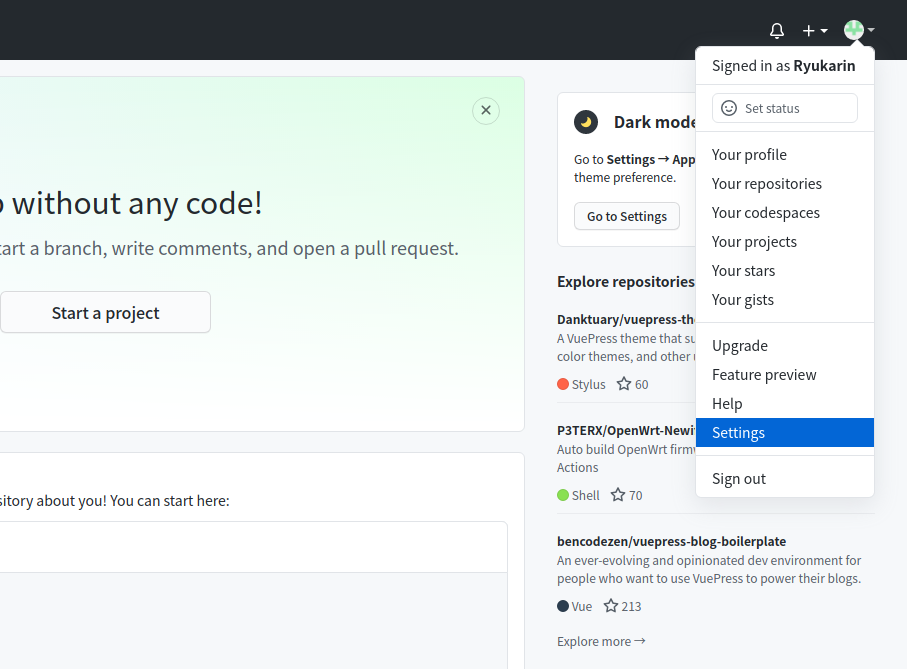
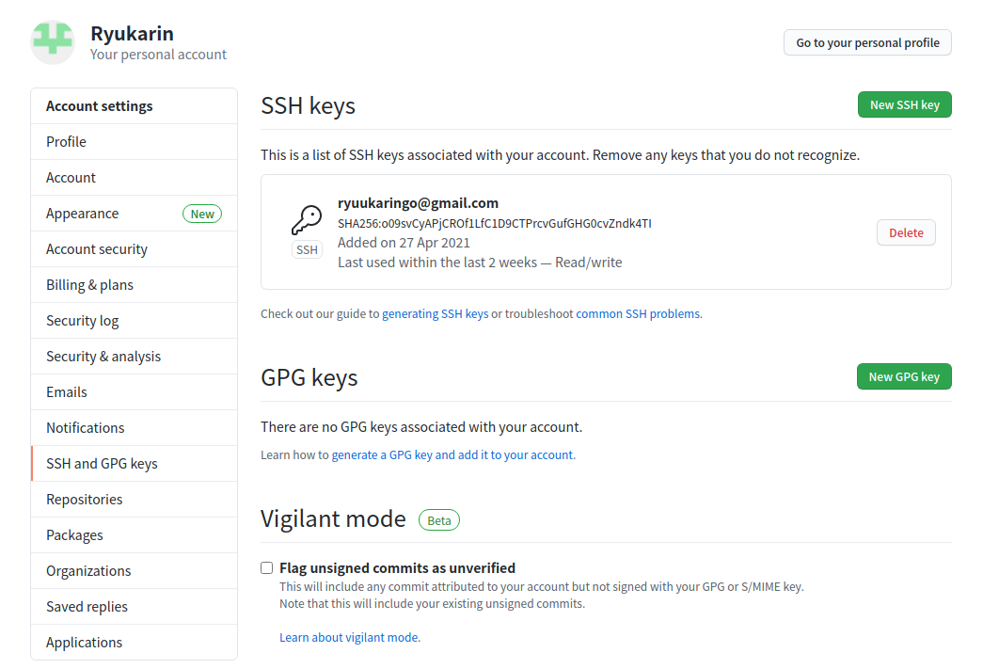
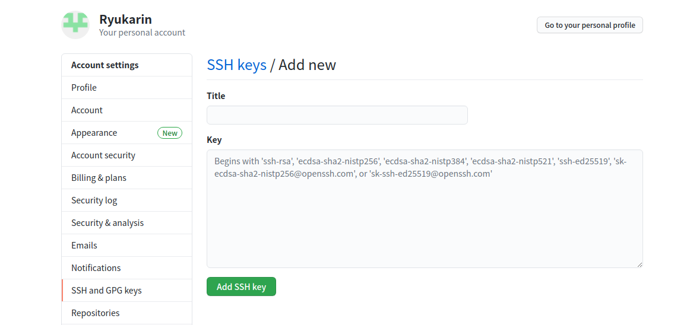
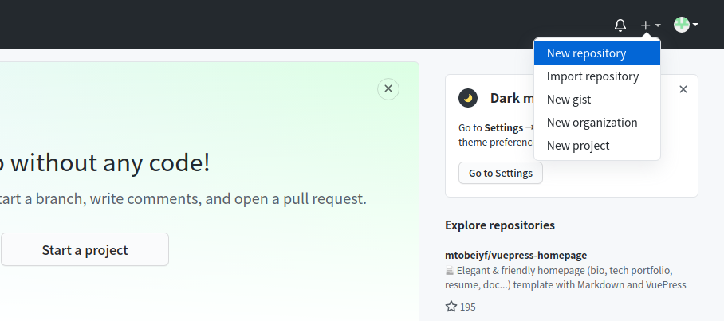
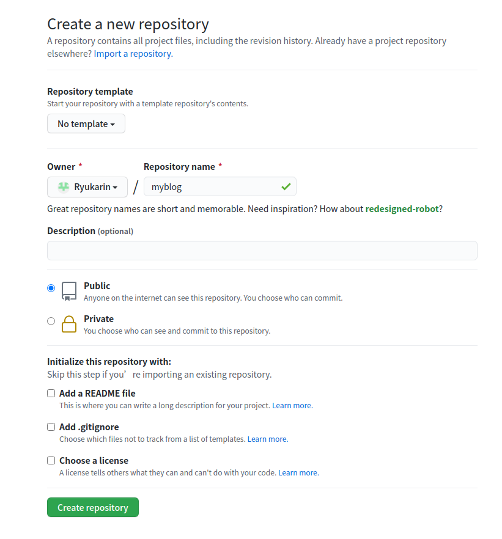
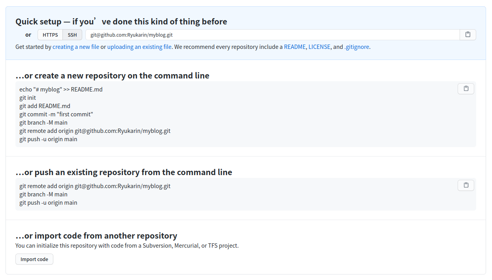
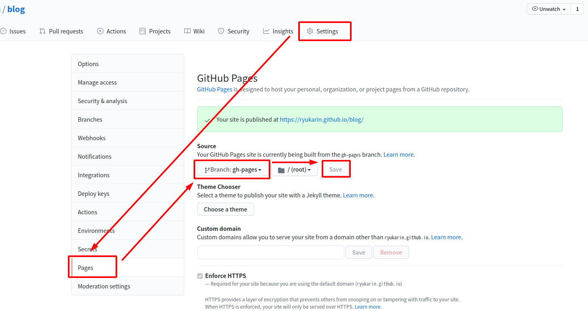

## 环境配置

你需要安装最新的 Node.js 和 Yarn。

在安装过程中，保持所有的默认设置，一路下一步即可。

### 安装 node.js

- 源码安装

```shell
[karin@karin-KVM]$ cd /usr/local/src/
#进入目录 /usr/local/src/
[karin@karin-KVM]$ wget https://nodejs.org/dist/v14.16.1/node-v14.16.1.tar.gz
#下载源码包
[karin@karin-KVM]$ tar -zxvf node-v14.16.1.tar.gz
#解压
[karin@karin-KVM]$ ./configure
#预编译
[karin@karin-KVM]$ make
#编译
[karin@karin-KVM]$ make install
#安装
```

- 验证安装结果

```shell
[karin@karin-KVM]$ node -v
#查看node版本
[karin@karin-KVM]$ npm -v
#查看npm版本
[karin@karin-KVM]$ npx -v
#查看npx版本
```

或者

```shell
[karin@karin-KVM]$ curl -fsSL https://deb.nodesource.com/setup_17.x | sudo -E bash -
[karin@karin-KVM]$ sudo apt install nodejs
#参考：https://github.com/nodesource/distributions
```

### 安装 yarn

```shell
[karin@karin-KVM]$ npm i -g yarn
#安装 yarn
[karin@karin-KVM]$ yarn config set registry https://registry.npm.taobao.org
#添加淘宝源
```

或者

```shell
[karin@karin-KVM]$ curl -sS https://dl.yarnpkg.com/debian/pubkey.gpg | sudo apt-key add -
[karin@karin-KVM]$ echo "deb https://dl.yarnpkg.com/debian/ stable main" | sudo tee /etc/apt/sources.list.d/yarn.list
[karin@karin-KVM]$ sudo apt update && sudo apt install yarn
```

## vuepress 搭建

### 创建模板

```shell
[karin@karin-KVM]$ cd ~
#进入家目录
[karin@karin-KVM]$ mkdir blog && cd blog
#创建本地工作目录并进入
[karin@karin-KVM]$ yarn create vuepress-theme-hope docs
#创建模板，hope的主题
```

创建过程中，需要填写一些信息，等到下载搭建完成

### 文件结构

```shell
├── dist → 构建输出目录
│
├── src
│ ├── .vuepress (可选的) → 用于存放全局的配置、组件、静态资源等
│ │ ├── components (可选的) → 该目录中的 Vue 组件将会被自动注册为全局组件
│ │ │
│ │ ├── theme (可选的) → 用于存放本地主题
│ │ │ │
│ │ │ ├── ... → 在主题部分查看更多详情
│ │ │ │
│ │ │ └── Layout.vue → 布局
│ │ │
│ │ ├── public (可选的) → 静态资源目录
│ │ │
│ │ ├── styles (可选的) → 用于存放样式相关的文件
│ │ │ ├── index.styl → 将会被自动应用的全局样式文件，会生成在最终的 CSS 文件结尾，具有比默认样式更高的优先级。
│ │ │ └── palette.styl → 用于重写默认颜色常量，或者设置新的 stylus 颜色常量
│ │ │
│ │ ├── templates (可选的, 谨慎配置) → 存储 HTML 模板文件
│ │ │ ├── dev.html → 用于开发环境的 HTML 模板文件
│ │ │ └── ssr.html → 构建时基于 Vue SSR 的 HTML 模板文件
│ │ │
│ │ ├── config.js (可选的) → 配置文件的入口文件
│ │ │
│ │ └── enhanceApp.js (可选的) → 客户端应用的增强
│ │
│ ├── readme.md → 主页
│ ├── vuepress
│ │ ├── ...
│ │ └── readme.md
│ ├── markdown
│ │ ├── ...
│ │ └── readme.md
│ │
│ └── en → English Folder → 英文语言文件夹
│ ├── readme.md → 主页
│ │
│ ├── vuepress
│ │ ├── ...
│ │ └── readme.md
│ │
│ └── markdown
│ ├── ...
│ └── readme.md
│
├─── readme.md → 项目中文说明
├─── readme.en-US.md → 项目英文说明
│
├── LICENSE → 许可证文件
│
├── package-lock.json → 项目实际使用的 package 结构
└── package.json → Nodejs 配置文件，也是项目的声明文件
```

### 配置文件

一个 VuePress 网站必要的配置文件是 `.vuepress/config.js`，它应该导出一个 JavaScript 对象：

[参考链接](https://vuepress.vuejs.org/zh/config/#%E5%9F%BA%E6%9C%AC%E9%85%8D%E7%BD%AE)

### 主题配置

一个 VuePress 主题应该负责整个网站的布局和交互细节。在 VuePress  中，目前自带了一个默认的主题，它是为技术文档而设计的。同时，默认主题提供了一些选项，让你可以去自定义导航栏（navbar）、 侧边栏（sidebar）和 首页（homepage） 等

### 开启测试

创建完成后，开启本地服务

```shell
[karin@karin-KVM]$ yarn run docs:dev
```

浏览器地址栏输入 `localhost:8080/` 就可以访问服务器了。看看搭建的网站效果。

如果要终止开发服务器，连续两次按下 `Ctrl + C`。

## 部署网站

### 本地创建 ssh keys

本地 git 项目与远程的 GitHub 建立联系 ------> 用 SSH keys

- 检查 SSH keys的设置

```shell
[karin@karin-KVM]$ cd ~/.ssh
#果提示：No such file or directory 说明你是第一次使用 git或没有ssh远程连接过其他机器
```

- 生成新的 SSH Key

```shell
[karin@karin-KVM]$ ssh-keygen -t rsa -C "邮件地址@youremail.com"					#你的github注册使用的邮箱
    Generating public/private rsa key pair.
    Enter file in which to save the key (/Users/your_user_directory/.ssh/id_rsa):  #<回车就好>
Enter passphrase (empty for no passphrase): 	#<输入加密串>
Enter same passphrase  again:					#<再次输入加密串>
Your identification has been saved in /Users/tianqixin/.ssh/id_rsa.
Your public key has been saved in /Users/tianqixin/.ssh/id_rsa.pub.
The key fingerprint is:
SHA256:MDKVidPTDXIQoJwoqUmI4LBAsg5XByBlrOEzkxrwARI 429240967@qq.com
The key's randomart image is:
+---[RSA 3072]----+
|E*+.+=**oo       |
|%Oo+oo=o. .      |
|%**.o.o.         |
|OO.  o o         |
|+o+     S        |
|.                |
|                 |
|                 |
|                 |
+----[SHA256]-----+
[karin@karin-KVM]$ ls ~/.ssh					#查看生成的密钥文件  id_rsa 、 id_rsa.pub
id_rsa    id_rsa.pub    known_hosts
```

### 添加 ssh key 到 github

- 打开本地 `id_rsa.pub` 文件，里面是刚才生成的秘钥。

```shell
[karin@karin-KVM]$ cat id_rsa.pub
    ssh-rsa AAAAB3NzaC1yc······mIdnXExvYlmLeLKRuh ryuukaringo@gmail.com
#复制id_rsa.pub文件里的内容备用
```

- 回到 github 上，进入 **Account => Settings**（账户配置）。

  

- 左边选择 **SSH and GPG keys**，然后点击 **New SSH key** 按钮。

  

-   title 设置标题，可以随便填，key 粘贴在你电脑上生成的 **key**（ 上面生成的`~/.ssh/id_rsa.pub`文件内容），最后点击 **Add SSH key** 按钮添加。

  

- 添加成功后界面如下所示

  

  

### 测试 ssh 到 github

输入下面的命令，看看设置是否成功，git@GitHub.com 的部分不要修改：

```shell
[karin@karin-KVM]$ ssh -T git@GitHub.com
#看到以下内容说明以上操作没毛病
......
Hi Ryukarin! You've successfully authenticated, but GitHub does not provide shell access.
```

### github 新建仓库

在 github上创建一个新的仓库

- 如果打算发布到 `https://<USERNAME>.github.io/<REPO>/`（也就是说你的仓库在 `https://github.com/<USERNAME>/<REPO>`），则将 base 设置为 `/<REPO>/`，例如设置为 /blog/ 。

- 如果打算发布到 `https://<USERNAME>.github.io/<USERNAME>/`（也就是说你的仓库在 `https://github.com/<USERNAME>/<USERNAME>`），则将 base 默认设置为 `/<USERNAME>/`，不用理会。

之后点击 **New repository** 如下图所示：



之后在在 **Repository name** 填入 myblog（远程仓库名） ，其他保持默认设置，点击**Create repository**按钮，就成功地创建了一个新的Git仓库：



创建成功后，显示如下信息：



以上信息告诉我们可以从这个仓库克隆出新的仓库，也可以把本地仓库的内容推送到 GitHub 仓库。

### 本地仓库配置

在项目根目录中（docs 同一目录），创建一个 deploy.sh 脚本文件，请自行修改github仓库地址

```shell
[karin@karin-KVM]$ git           
    Command 'git' not found, but can be installed with:
    sudo apt install git
#此命令如果出现上面内容，说明没有安装git
[karin@karin-KVM]$ sudo apt install git
#执行安装git命令
[karin@karin-KVM]$ touch deploy.sh
#新建脚本文件
```

脚本文件写入如下内容：

```shell
#!/usr/bin/env sh


set -e
# 确保脚本抛出遇到的错误

yarn run docs:build
# 生成静态文件

cd docs/.vuepress/dist
# 进入生成的文件夹

# 如果是发布到自定义域名
# echo 'www.example.com' > CNAME

git init
git add -A
git commit -m 'deploy'

# 如果发布到 https://<USERNAME>.github.io
git push -f git@github.com:Ryukarin/Ryuukarin.git master

# 如果发布到 https://<USERNAME>.github.io/<REPO>
# git push -f git@github.com:<USERNAME>/<REPO>.git master:gh-pages

cd -
```

### 运行脚本

```shell
[karin@karin-KVM]$ git config --global user.email "ryuukaringo@gmail.com"
[karin@karin-KVM]$ git config --global user.name "Ryuukarin"
#设置git自己的名字和电子邮件

[karin@karin-KVM]$ git config -l
#查看配置

[karin@karin-KVM]$ chmod u+x deploy.sh
#赋予执行权限

[karin@karin-KVM]$ ./deploy.sh
#执行脚本
```

### 开启 github pages 部署

在 GitHub 项目点击 Setting 按钮，找到 GitHub Pages - Source，选择 master 分支，点击 Save 按钮后，静静地等待它部署完成即可。



### 备份源文件

当然，编译好的 pages 源文件用脚本 `deploy.sh` 就可以上传部署了。那么我想把部署网页之前的文件备份上传到仓库要怎么作呢？当然，脚本修改以下，很简单。但是，这次我想手动推送到仓库。方便练习以下 Git 的用法。具体如下：

```shell
[karin@karin-KVM]$ ls -a ~/blog
.  ..  deploy.sh  dist  docs  .git  node_modules  package.json  package-lock.json
# ~/blog 是我搭建 vuepress 的目录，所有文件都在这里，.git 是仓库 pages 初始化生成的，所以在此目录下不好再次推送其他内容
[karin@karin-KVM]$ mkdir ~/blog_md
#新建一个目录
[karin@karin-KVM]$ cd ~/blog
#进入 ~/blog 目录
[karin@karin-KVM]$ cp -r docs/ deploy.sh package.json package-lock.json ~/blog_md/
#把 ~/blog/ 目录里的文件复制到 ~/blog_md/目录下
[karin@karin-KVM]$ cd ~/blog_md
#进入 ~/blog_md 目录
[karin@karin-KVM]$ git init
#初始化本地仓库，会在当前目录下生成一个 .git 目录
[karin@karin-KVM]$ git add -A
#把所有文件及其修改部分提交到本地暂存区，即上面复制的所有文件
[karin@karin-KVM]$ git commit -m '备注信息，随意写'
# git commit 命令将暂存区内容添加到本地仓库中，-m 是备注信息，后面随意写
[karin@karin-KVM]$ git push -f git@github.com:Ryukarin/blog.git main
#强制推送更新到你的仓库
#你的仓库：git@github.com:Ryukarin/blog.git
#你的仓库分支：main
```

好了，上面的操作就把你的本地的源文件推送到仓库的 main 分支了。gh-pages 分支用于 blog 的静态页面。当然，上面的操作你也可以改成脚本，执行一下，也很方便。

