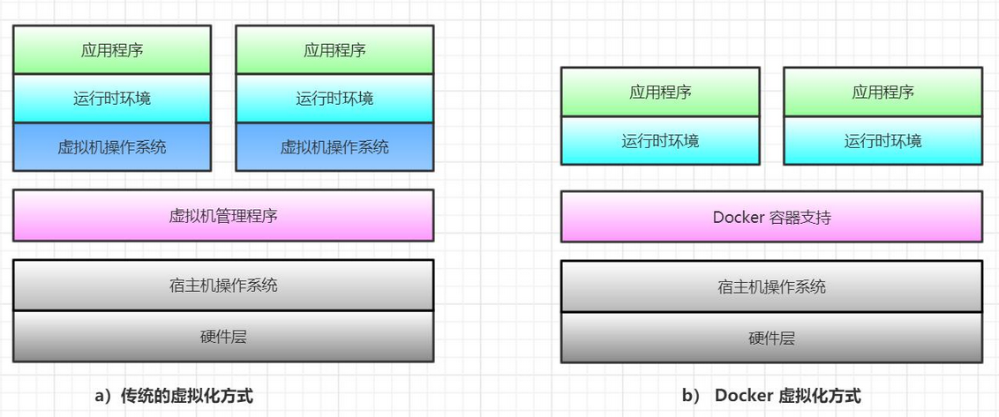

## 什么是 Docker

### 1、Docker 开源项目背景

Docker 是基于 Go 语言实现的开源容器项目。它诞生于 2013 年年初，最初发起者是 dotCloud 公司。Docker 自开源后受到业界广泛的关注和参与，目前已有 80 多个相关开源组件项目（包括 Containerd、Moby、Swarm 等），逐渐形成了围绕 Docker 容器的完整的生态体系。

Docker 的构想是要实现“Build，Ship and Run Any App，Anywhere”，即通过对应用的封装（Packaging）、分发（Distribution）、部署（Deployment）、运行（Runtime）生命周期进行管理，达到应用组件级别的“**一次封装，到处运行**”。这里的应用组件，既可以是一个 Web 应用、一个编译环境、也可以是一套数据库平台服务，甚至是一个操作系统或集群。

基于 Linux 平台上的多项开源技术，Docker 提供了高效、敏捷和轻量级的容器方案，并
支持部署到本地环境和多种主流云平台。可以说，Docker 首次为应用的开发、运行和部署提供了“一站式”的实用解决方案。

现在主流的操作系统包括 Linux 各大发行版、macOS、Windows 等都已经支持 Docker。

### 2、Linux 容器技术---巨人的肩膀

与大部分新兴技术的诞生一样，Docker 也并非“从石头缝里蹦出来的”，而是站
在前人的肩膀上。其中最重要的就是 Linux 容器（Linux Containers，LXC）技术。IBM 
DeveloperWorks 网站关于容器技术的描述十分准确：<u>“容器有效地将由单个操作系统管理的资源划分到孤立的组中，以更好地在孤立的组之间平衡有冰突的资源使用需求。与虚拟化相比，这样既不需要指令级模拟，也不需要即时编译。容器可以在核心 CPU 本地运行指令，而不需要任何专门的解释机制。此外，也避免了准虚拟化（para-virtualization）和系统调用替换中的复杂性。“</u>

当然，LXC 也经历了长期的演化。最早的容器技术可以追溯到 1982 年 Unix 系列操作
系统上的 chroot 工具（直到今天，主流的 Unix、Linux 操作系统仍然支持和带有该工具）。

在 LXC 之前，这些相关技术经过多年的演化已经十分成熟和稳定，但是由于种种原因，它们并没有被很好地集成到主流的 Linux 内核中，使用起来并不方便。

后来 LXC 项目借鉴了前人成熟的容器设计理念，并基于一系列新引入的内核特性，实现了更具扩展性的虚拟化容器方案。更加关键的是，LXC 终于被集成到到主流 Linux 内核中，进而成为 Linux 系统轻量级容器技术的事实标准。从技术层面来看，LXC 已经趟过了绝大部分的“坑”，完成了容器技术实用化的大半历程。

### 3、从 Linux 容器到 Docker

在 LXC 的基础上，Docker 进一步优化了容器的使用体验，让它进人寻常百姓家。首先，Docker 提供了各种容器管理工具（如分发、版本、移植等），让用户无须关注底层的操作，更加简单明了地管理和使用容器：其次，Docker 通过引入分层文件系统构建和高效的镜像机制，降低了迁移难度，极大地改善了用户体验。用户操作 Docker 容器就像操作应用自身一样简单。

简单地讲，可以将 Docker 容器理解为一种轻量级的沙盒（sandbox）。每个容器内运行着一个应用，不同的容器相互隔离、容器之间也可以通过网络互相通信。容器的创建和停止十分快速，几乎路创建和终止原生应用一致：另外，容器自身对系统资源的额外需求也十分有限，远远低于传统虚拟机。很多时候，甚至直接把容器当作应用本身也没有任何问题。

相信随着 Docker 技术的进一步成熟，它将成为更受欢迎的容器虚拟化技术实现，并在云计算和 DevOps 等领域得到更广泛的应用。

## 为什么要使用 Docker

### 1、Docker 容器虚拟化的好处

Docker 项目的发起人、Docker 公司 CTO Solomon Hykes 认为，Docker 在正确的地点、正确的时间顺应了正确的趋势---如何正确地构建应用。

在云时代，开发者创建的应用必须要能很方便地在网络上传播，也就是说应用必须脱离底层物理硬件的限制；同时必须是“任何时间任何地点”可获取的。因此，开发者们需要一种新型的创建分布式应用程序的方式，快速分发和部署，而这正是 Docker 所能够提供的最大优势。

举个简单的例子，假设用户试图基于最常见的 LAMP（Linux+Apache+MySQL+PHP）组合来构建网站。按照传统的做法，首先需要安装 Apache、MySQL 和 PHP 以及它们各自运行所依赖的环境；之后分别对它们进行配置（包括创建合适的用户、配置参数等）；经过大量的操作后，还需要进行功能测试，看是否工作正常；如果不正常，则进行调试追踪，意味着更多的时间代价和不可控的风险。可以想象，如果应用数目变多，事情会变得更加难以
处理。

更为可怕的是，一旦需要服务器迁移（例如从亚马逊云迁移到其他云），往往需要对每个应用都进行重新部署和调试。这些琐碎而无趣的“体力活”，极大地降低了用户的工作效率。究其根源，是这些应用直接运行在底层操作系统上，无法保证同一份应用在不同的环境中行为一致。

而 Docker 提供了一种更为聪明的方式，通过容器来打包应用、解耦应用和运行平台。这意昧着迁移的时候，只需要在新的服务器上启动需要的容器就可以了，无论新旧服务器是否是同一类型的平台。这无疑将帮助我们节约大量的宝贵时间，并降低部署过程出现问题的风险。

### 2、Docker 在开发和运维中的优势

对开发和运维（DevOps）人员来说，最梦寐以求的效果可能就是一次创建或配置，之后可以在任意地方、任意时间让应用正常运行，而 Docker 恰恰是可以实现这一终极目标的“瑞士军刀”。具体说来，在开发和运维过程中，Docker 具有如下几个方面的优势：

- **更快速的交付和部署**。使用 Docker，开发人员可以使用镜像来快速构建一套标准的开发环境：开发完成之后，测试和运维人员可以直接使用完全相同的环境来部署代码。只要是开发测试过的代码，就可以确保在生产环境无缝运行。Docker可以快速创建和删除容器，实现快速迭代，节约开发、测试、部署的大量时间。并且，整个过程全程可见，使团队更容易理解应用的创建和工作过程。

- **更高效的资源利用**。运行 Docker 容器不需要额外的虚拟化管理程序（Virtual Machine Manager，VMM，以及 Hypervisor）的支持，Docker 是内核级的虚拟化，可以实现更高的性能，同时对资源的频外需求很低。与传统虚拟机方式相比，Docker 的性能要提高 1-2 个数量级。

- **更轻松的迁移和扩展**。Docker 容器几乎可以在任意的平台上运行，包挠物理机、虚拟机、公有云、私有云、个人电脑、服务器等，同时支持主流的操作系统发行版本。这种兼容性让用户可以在不同平台之间轻松地迁移应用。

- **更简单的更新管理**。使用 Dockerfile，只需要小小的配置修政，就可以替代以往大量的更新工作。所有修改都以增量的方式被分发和更新，从而实现自动化并且高效的容器管理。

### 3、Docker 与虚拟机比较

作为一种轻量级的虚拟化方式，Docker 在运行应用上跟传统的虚拟机方式相比具有如下显著优势：

- **Docker 容器很快**，启动和停止可以在秒级实现，这相比传统的虚拟机方式（数分钟）要快得多；

- **Docker 容器对系统资源需求很少**，一台主机上可以同时运行数千个 Docker 容器（在 IBM 服务器上已经实现了同时运行 10K 量级的容器实例）；

- **Docker** 通过类似 Git 设计理念的操作来**方便用户获取、分发和更新应用镜像，存储复用，增量更新**；

- **Docker** 通过 Dockerfile **支持灵活的自动化创建和部署机制**，以提高工作效率，并标准化流程。

Docker 容器除了运行其中的应用外，基本不消耗额外的系统资源，在保证应用性能的同时，尽量减小系统开销。传统虚拟机方式运行 N 个不同的应用就要启用 N 个虚拟机（每个虚拟机需要单狡分配独占的内存、磁盘等资源），而 Docker 只需要启动 N 个隔离得“很薄的”容器，并将应用放进容器内即可。应用获得的是接近原生的运行性能。

当然，在隔离性方面，传统的虚拟机方式提供的是相对封闭的隔离。但这并不意味着 Docker 不安全。Docker 利用 Linux 系统上的多种防护技术实现了严格的隔离可靠性，并目可以整合众多安全工具。从 1.3.0 版本开始，Docker 重点改善了容器的安全控制和镜像的安全机制，极大地提高了使用 Docker 的安全性。在已知的大规模应用中，目前尚未出现值得担忧的安全隐患。

下表比较了使用 Docker 容器技术与传统虚拟机技术的各种特性，可见容器技术在很多应用场景下都具有巨大的优势。

<u>表 1-1</u>	Docker 容器技术与传统虚拟机技术的比较

| <u>特性</u>  | <u>容器</u>        | <u>虚拟机</u> |
| ------------ | ------------------ | ------------- |
| **启动速度** | 秒级               | 分钟级        |
| **性能**     | 接近原生           | 较弱          |
| **内存代价** | 很小               | 较多          |
| **硬盘使用** | 一般为 MB          | 一般为 GB     |
| **运行密度** | 单机支持上千个容器 | 一般几十个    |
| **隔离性**   | 安全隔离           | 完全隔离      |
| **迁移性**   | 优秀               | 一般          |

## Docker 与虚拟化

虚拟化（virtualization）技术是一个通用的概念，在不同领域有不同的理解。在计算领域，一般指的是计算虚拟化（computing virtualization），或通常说的服务器虚拟化。维基百科上的定义如下：

> “在计算机技术中，虚拟化是一种资源管理技术，是将计算机的各种实体资
> 源，如服务器、网络、内存及存储等，予以抽象、转换后呈现出来，打破实体结构间的不可切割的障碍，使用户可以用比原本的组态更好的方式来应用这些资源。“

可见，虚拟化的核心是对资源的抽象，目标往往是为了在同一个主机上同时运行多个系统或应用，从而提高系统资源的利用率，并丁带来降低成本、方便管理和容错容灾等好处。

从大类上分，虚拟化技术可分为基于**硬件的虚拟化**和基于**软件的虚拟化**。其中，真正意义上的基于硬件的虚拟化技术不多见，基于软件的虚拟化从对象所在的层次，又可以分为**应用虚拟化**和**平台虚拟化**（通常说的虚拟机技术即属于这个范畴）。前者一般指的是一些模拟设备或诸如 Wine 这样的软件，后者又可以细分为几个子类：

- **完全虚拟化**。虑拟机模拟完整的底层硬件环境和特权指令的执行过程，客户操作系统无须进行修改。例如 IBM p 和 z 系列的康拟化、VMware Workstation、VirtualBox、QEMU 等；

- **硬件辅助虚拟化**。利用硬件（主要是 CPU）辅助支持（目前 x86 体系结构上可用的硬件辅助虚拟化技术包括 Intel-VT 和 AMD-V）处理敏感指令来实现完全虚拟化的功能，客户操作系统无须修政，例如 VMware Workstation，Xen，KVM；

- **部分虚拟化**。只针对部分硬件资源进行虚拟化，客户操作系统需要进行修改。现在有些虚拟化技术的早期版本仅支持部分虚拟化；

- **超虚拟化（paravirtualization）**。部分硬件接口以软件的形式提供给客户机操作系统，客户操作系统需要进行修改，例如早期的 Xen；

- **操作系统级虚拟化**。内核通过创建多个虚拟的操作系统实例（内核和库）来隔离不同的进程。容器相关技术即在这个范畴。

可见，Docker 以及其他容器技术都属于操作系统虚拟化这个范畴，操作系统虚拟化最大的特点就是不需要额外的 supervisor 支持。Docker 虚拟化方式之所以有众多优势，跟操作系统虚拟化技术自身的设计和实现是分不开的。

下图比较了 Docker 和常见的虚拉机方式的不同之处。

::: center

<u>图 1-1</u>	Docker 和传统的虚拟化方式的不同之处

:::

传统方式是在硬件层面实现虚拟化，需要有额外的虎拟机管理应用和虚拟机操作系统层。Docker 容器是在操作系统层面上实现虚拟化，直接复用本地主机的操作系统，因此更加轻量级。

## 小结

介绍了容器虚拟化的基本概念、Docker 的诞生历史，以及容器在云时代应用分发场景下的巨大优势。

与传统的虚拟机方式相比，容器虚拟化方式在很多场景下都存在极为明显的优势。无论是系统管理员、应用开发人员、测试人员，还是运维管理人员，都应该尽快掌握 Docker，尽早享受其带来的巨大便利。
