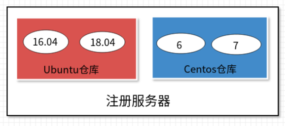
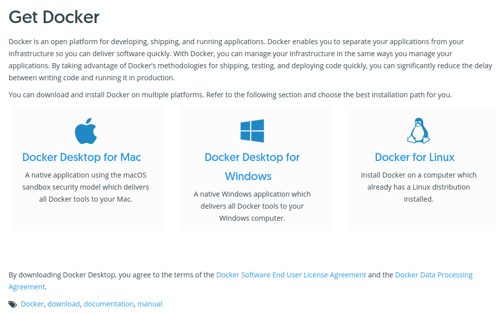

首先介绍 Docker 的三大核心概念：

- 镜像（Image）
- 口容器（Container）
- 口仓库（Reposit）

只有理解了这三个核心概念，才能顺利地理解 Docker 容器的整个生命周期 。
随后，将介绍如何在常见的操作系统平台上安装 Docker ，包括 Ubuntu、CentOS 、
MacOS 和 Windows 等主流操作系统 。

## 核心概念

Docker 大部分的操作都围绕着它的三大核心概念：**镜像**、**容器**和**仓库**。因此，准确把握这三大核心概念对于掌握 Docker 技术尤为重要。

### 1、Docker 镜像

Docker 镜像类似于虚拟机镜像，可以将它理解为一个只读的模板 。

例如，一个镜像可以包含一个基本的操作系统环境，里面仅安装了 Apache 应用程序（或用户需要的其他软件）。可以把它称为一个 Apache 镜像 。

镜像是创建 Docker 容器的基础 。

通过版本管理和增量的文件系统，Docker 提供了一套十分简单的机制来创建和更新现有
的镜像，用户甚至可以从网上下载一个已经做好的应用镜像，并直接使用 。

### 2、Docker 容器

Docker 容器类似于一个轻量级的沙箱， Docker 利用容器来运行和隔离应用 。

容器是从镜像创建的应用运行实例 。它可以启动、开始、停止、删除，而这些容器都是彼此相互隔离、互不可见的。

可以把容器看作一个简易版的 Linux 系统环境（包括 root 用户权限、进程空间、用户空间和网络空间等）以及运行在其中的应用程序打包而成的盒子。

::: tip 注意

镜像自身是只读的 。 容器从镜像启动的时候，会在镜像的最上层创建一个可写层 。

:::

### 3、Docker 仓库

Docker 仓库类似于代码仓库，是 Docker 集中存放镜像文件的场所。

有时候我们会将 Docker 仓库和仓库注册服务器（Registry）混为一谈，并不严格区分。实际上，仓库注册服务器是存放仓库的地方，其上往往存放着多个仓库。每个仓库集中存放某一类镜像，往往包括多个镜像文件，通过不同的标签（tag）来进行区分。例如存放 Ubuntu 操作系统镜像的仓库，被称为 Ubuntu 仓库，其中可能包括 16.04、18.04 等不同版本的镜像。仓库注册服务器的示例如下图所示。

::: center



<u>图 2-1</u>	注册服务器与仓库

:::

根据所存储的镜像公开分享与否， Docker 仓库可以分为**公开仓库**（Public）和**私有仓库**（Private）两种形式 。

目前，最大的公开仓库是官方提供的 Docker Hub，其中存放着数量庞大的镜像供用户下载。国内不少云服务提供商（如腾讯云、阿里云等）也提供了仓库的本地源，可以提供稳定的国内访问 。

当然，用户如果不希望公开分享自己的镜像文件，Docker 也支持用户在本地网络内创建一个只能自己访问的私有仓库。

当用户创建了自己的镜像之后就可以使用 push 命令将它上传到指定的公有或者私有仓库。这样用户下次在另外一台机器上使用该镜像时，只需要将其从仓库上 pull 下来就可以了。

::: tip 注意

可以看出，Docker 利用仓库管理镜像的设计理念与 Git 代码仓库的概念非常相似，实际上 Docker 设计上借鉴了 Git 的很多优秀思想。

:::

## 安装 Docker 引擎

Docker 引擎是使用 Docker 容器的核心组件，可以在主流的操作系统和云平台上使用，包括 Linux 操作系统（如 Ubuntu、Debian、CentOS、Redhat 等)，macOS 和 Windows 操作系统，以及 IBM、亚马逊、微软等知名云平台。

用户可以访问 Docker 官网的 [Get Docker](https://www.docker.com/get-docker) 页面，查看获取 Docker 的方式，以及 Docker 支持的平台类型，如下图所示。

::: center



<u>图 2-2</u>	获取 Docker

:::

目前 Docker 支持 Docker 引擎、Docker Hub、Docker Cloud 等多种服务 。

- Docker 引擎：包括支持在桌面系统或云平台安装 Docker，以及为企业提供简单安全弹性的容器集群编排和管理；
  
- Docker Hub：官方提供的云托管服务，可以提供公有或私有的镜像仓库；

- Docker Cloud：官方提供的容器云服务，可以完成容器的部署与管理，可以完整地支持容器化项目，还有 CI、CD 功能。

Docker 引擎目前分为两个版本：社区版本（Community Edition，CE）和企业版本（Enterprise Edition，EE）。社区版本包括大部分的核心功能，企业版本则通过付费形式提供认证支持、镜像管理、容器托管、安全扫描等高级服务。通常情况下，用户使用社区版本可以满足大部分需求；若有更苛刻的需求，可以购买企业版本服务。社区版本每个月会发布一次尝鲜（Edge）版本，每个季度（ 3、6、9、12 月）会发行一次稳定（Stable）版本。版本号命名格式为“年份.月份”，如 2018 年 6 月发布的版本号为 vl8.06 。

我们首选在 Linux 环境中使用 Docker 社区稳定版本，以获取最佳的原生支持体验。

### 1、Ubuntu 环境下安装 Dokeer

- 系统要求

Ubuntu 操作系统对 Docker 的支持十分成熟，可以支持包括 x86_64、armhf、s390x（IBM Z)、ppc64le 等系统架构，只要是 64 位即可。

Docker 目前支持的最低 Ubuntu 版本为 14.04 LTS，但实际上从稳定性上考虑，推荐使用 16.04 LTS 或 18.0.4 LTS 版本，并且系统内核越新越好，以支持 Docker 最新的特性 。

用户可以通过如下命令检查自己的内核版本详细信息：

```shell
$ uname -a
Linux localhost 4.9.36-x86_64-generic
#或者 :
$ cat /proc/version
Linux version 4.9.36-x86_64-generic (maker@linux.com) (gcc version 4.9.2 (Debian 4.9.2-10))
```

如果使用 Ubuntu 16.04 LTS 版本，为了让 Docker 使用 aufs 存储，推荐安装如下两个软件包：

```shell
$ sudo apt-get update
$ sudo apt-get install -y linux-image-extra-$(uname -r) linux image-extra-virtual
```

::: tip 注意

Ubuntu 发行版中，LTS（Long-Term- Support）意味着更稳定的功能和更长期（目前为 5 年）的升级支持，生产环境中推荐尽量使用 LTS 版本。

:::

- 添加镜像源

首先需要安装 `apt-transport-https` 等软件包支持 https 协议的源：

```shell
$ sudo apt-get update
$ sudo apt-get install apt-transport-https ca-certificates curl software-properties-common
```

添加源的 gpg 密钥：

```shell
$ curl -fsSL https://download.docker.com/linux/ubuntu/gpg | sudo apt-key add -
OK
```

确认导入指纹为“<u>9DC8 5822 9FC7 DD38 854A  E2D8 8D81 803C 0EBF CD88</u>”的 GPG公钥：

```shell
$ sudo apt-key fingerprint 0EBFCD88
pub   rsa4096 2017-02-22 [SCEA]
      9DC8 5822 9FC7 DD38 854A  E2D8 8D81 803C 0EBF CD88
uid           [ 未知 ] Docker Release (CE deb) <docker@docker.com>
sub   rsa4096 2017-02-22 [S]
```

获取当前操作系统的代号 :

```shell
$ lsb_release -cs
bionic
```

一般情况下，Ubuntu 16.04 LTS 代号为 xenial，Ubuntu 18.04 LTS 代号为 bionic 。

接下来通过如下命令添加 Docker 稳定版的官方软件源，非 bionic 版本的系统注意修改为自己对应的代号：

```shell
$ sudo add-apt-repository "deb [arch=amd64] https://download.docker.com/linux/ubuntu bionic stable"
```

添加成功后，再次更新 apt 软件包缓存：

```shell
$ sudo apt-get update
```

- 开始安装 Docker

在成功添加源之后，就可以安装最新版本的 Docker 了，软件包名称为 docker-ce，代表是社区版本：

```shell
$ sudo apt-get install -y docker-ce
```

如果系统中存在较旧版本的 Docker，会提示是否先删除，选择是即可。

除了基于手动添加软件源的方式之外，也可以使用官方提供的脚本来自动化安装 Docker：

```shell
$ sudo curl - sSL https://get.docker.com/ | sh
```

安装成功后，会自动启动 Docker 服务 。

用户也可以指定安装软件源中其他版本的 Docker：

```shell
$ sudo apt-cache madison docker-ce
 docker-ce | 5:20.10.8~3-0~ubuntu-bionic | https://download.docker.com/linux/ubuntu bionic/stable amd64 Packages
 docker-ce | 5:20.10.7~3-0~ubuntu-bionic | https://download.docker.com/linux/ubuntu bionic/stable amd64 Packages
...
 docker-ce | 18.06.0~ce~3-0~ubuntu | https://download.docker.com/linux/ubuntu bionic/stable amd64 Packages
 docker-ce | 18.03.1~ce~3-0~ubuntu | https://download.docker.com/linux/ubuntu bionic/stable amd64 Packages
$ sudo apt-get install 18.03.1~ce~3-0~ubuntu
```

### 2、CentOS 环境下安装 Docker

Docker 目前支持 CentOS 7 及以后的版本。系统的要求跟 Ubuntu 情况类似，64 位操作系统，内核版本至少为 3.10 。

首先，为了方便添加软件源，以及支持 devicemapper 存储类型，安装如下软件包：

```shell
$ sudo yum update
$ sudo yum install -y yum-utils device-mapper-persistent-data lvm2
```

添加 Docker 稳定版本的 yum 软件源：

```shell
$ sudo yum-config-manager --add-repo https://download.docker.corn/linux/centos/docker-ce.repo
```

之后更新 yum 软件源缓存，并安装 Docker：

```shell
$ sudo yum update
$ sudo yum install -y docker-ce
```

最后，确认 Docker 服务启动正常 :

```shell
$ sudo systernctl start docker
```

### 3、通过脚本安装

用户还可以使用官方提供的 shell 脚本来在 Linux 系统（目前支持 Ubuntu、Debian、Oracleserver、Fedora、Centos、OpenSuse、Gentoo 等常见发行版）上安装 Docker 的最新正式版本，该脚本会自动检测系统信息并进行相应配置：

```shell
$ curl -fsSL https://get.docker.com/ | sh
或者：
$ wget -qO- https://get.docker.com/ | sh
```

如果想尝鲜最新功能，可以使用下面的脚本来安装最新的“尝鲜”版本。但要注意，非稳定版本往往意味着功能还不够稳定，不要在生产环境中使用：

```shell
$ curl -fsSL https://test.docker.com/ | sh
```

另外，也可以从 store.docker.com/search?offering=community&q=&type=edition 找到各个平台上的 Docker 安装包，自行下载使用。

::: tip 说明

关于 macOS 和 Windows 系统的 Docker 安装方法，此处省略，不进行说明。

:::

## 配置 Docker 服务

为了避免每次使用 Docker 命令时都需要切换到特权身份，可以将当前用户加入安装中自动创建的 docker 用户组，代码如下：

```shell
$ sudo usermod -aG docker USER_NAME
#USER_NAME是你使用的用户名，可以 echo $USER 命令查看
#或者直接用下面命令，将当前用户加入到docker组
$ sudo usermod -aG docker $USER
```

用户更新组信息，退出并重新登录后即可生效。

Docker 服务启动时实际上是调用了 `dockerd` 命令，支持多种启动参数。因此，用户可以直接通过执行 `dockerd` 命令来启动 Docker 服务，如下面的命令启动 Docker 服务，开启 Debug 模式，并监听在本地的 2376 端口：

```shell
$ dockerd -D -H tcp://127.0.0.1:2376
```

这些选项可以写入 `/etc/docker/` 路径下的 `daemon.json` 文件中，由 dockerd 服务启动时读取：

```json
{
		"debug" : true,
		"hosts" : ["tcp://127.0.0.1:2376"]
}
```

当然，操作系统也对 Docker 服务进行了封装，以使用 Upstart 来管理启动服务的
Ubuntu 系统为例，Docker 服务的默认配置文件为 `/etc/default/docker` ，可以通过修改其中的 DOCKER_OPTS 来修改服务启动的参数，例如让 Docker 服务开启网络 2375 端口的监昕：

```shell
DOCKER_OPTS="$DOCKER_OPTS -H tcp://0.0.0.0:2375 -H unix:///var/run/docker.sock"
```

修改之后，通过 `service` 命令来重启 Docker 服务：

```shell
$ sudo service docker restart
```

对于 CentOS、RedHat 等系统，服务通过 systemd 来管理，配置文件路径为 `/etc/systemd/system/docker.service.d/docker.conf`。更新配置后需要通过 `systemctl` 命令来管理 Docker 服务：

```shell
$ sudo systemctl daemon-reload
$ sudo systemctl start docker.service
```

此外，如果服务工作不正常，可以通过查看 Docker 服务的日志信息来确定问题，例如在 RedHat 系统上日志文件可能为 `/var/log/messages`，在 Ubuntu 或 CentOS 系统上可以执行命令 `journalctl -u docker.service`。

每次重启 Docker 服务后，可以通过查看 Docker 信息（docker info 命令），确保服务已经正常运行 。

## 推荐实践环境

从稳定性上考虑，推荐实践环境的操作系统是 Ubuntu 18.04 LTS 系统或 Debian 稳
定版本系统，使用 Linux 4.0 以上内核 。 Docker 不同版本的 API 会略有差异，推荐根据需求选择较新的稳定版本 。

如无特殊说明，默认数据网段地址范围为 10.0.0.0/24，管理网段地址范围为 192.168.0.0/24 。

另外，执行命令代码中以 **$** 开头的，表明为普通用户；以 **#** 开头的，表明为特权用户（root）。如果用户已经添加到了 docker 用户组，大部分时候都无须管理员权限，否则需要在命令前使用 sudo 来临时提升权限。

部分命令执行结果输出内容较长的，只给出关键部分输出。

## 小结

介绍了 Docker 的三大核心概念：镜像、容器和仓库，以及如何安装和配置 Docker 引擎服务。

在后面的实践中，你会感受到，基于三大核心概念所构建的高效工作流程，正是 Docker 从众多容器虚拟化方案中脱颖而出的重要原因。实际上，Docker 和 Docker Hub 的工作流也并非凭空创造的，很大程度上参考了 Git 和 Github 的设计理念，从而为应用分发和团队合作都带来了众多优势。
