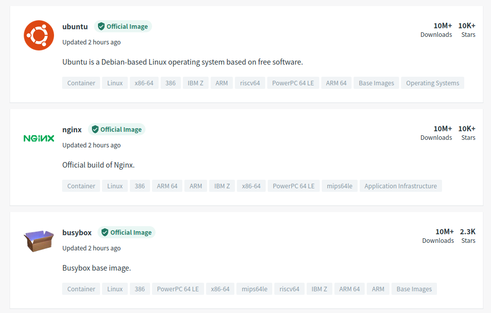
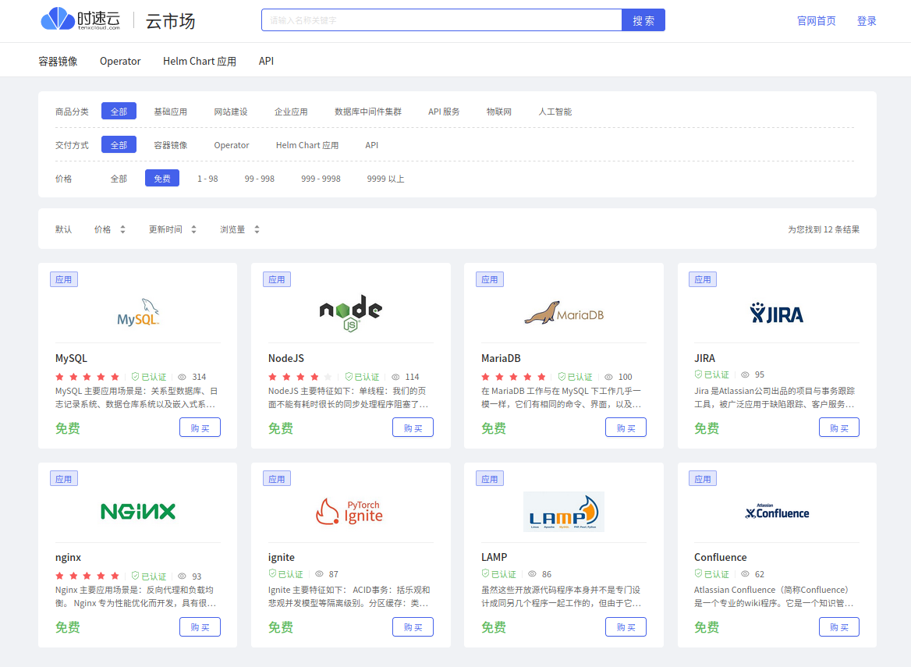
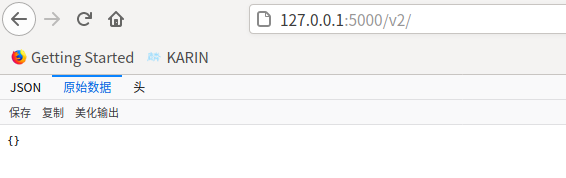
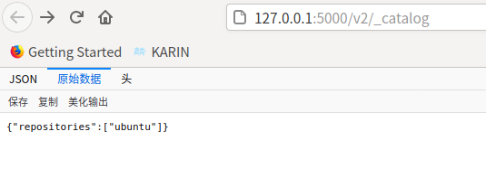

仓库（Repository）是集中存放镜像的地方，又分公共仓库和私有仓库。

有时候容易把仓库与注册服务器（Registry）混淆。实际上注册服务器是存放仓库的具体服务器，一个注册服务器上可以有多个仓库，而每个仓库下面可以有多个镜像。从这方面来说，仓库可以被认为是一个具体的项目或目录。例如对于仓库地址 private-docker.com/ubuntu 来说，private-docker.com 是注册服务器地址，ubuntu 是仓库名。

接下来，将分别介绍使用 Docker Hub 官方仓库进行登录、载等基本操作，以及使用国内社区提供的仓库下载镜像；最后还将介绍创建和使用私有仓库的基本操作。

## Docker Hub 公共镜像市场

Docker Hub 是 Docker 官方提供的最大的公共镜像仓库，目前包括了超过 100000 的镜像，地址为 <https://hub.docker.com>。大部分对镜像的需求，都可以通过在 Docker Hub 中直接下载镜像来实现，如图 5-1 所示。

### 1、登录

可以通过命令行执行 `docker login` 命令来输入用户名、密码和邮箱来完成注册和登录。注册成功后，本地用户目录下会自动创建 `.docker/config.json` 文件，保存用户的认证信息。

登录成功的用户可以上传个人制作的镜像到 Docker Hub。

### 2、基本操作

用户无须登录即可通过 `docker search` 命令来查找官方仓库中的镜像，并利用 `docker [image] pull` 命令来将它下载到本地。

::: center



<u>图 5-1</u>	Docker Hub 是最大的公共镜像仓库

:::

前面已经具体介绍了如何使用 `docker [image] pull` 命令来搜寻镜像。例如以 centos 为关键词进行搜索：

```shell
$ docker search centos
NAME                              DESCRIPTION                                     STARS     OFFICIAL   AUTOMATED
centos                            The official build of CentOS.                   6736      [OK]       
ansible/centos7-ansible           Ansible on Centos7                              134                  [OK]
consol/centos-xfce-vnc            Centos container with "headless" VNC session…  130                  [OK]
jdeathe/centos-ssh                OpenSSH / Supervisor / EPEL/IUS/SCL Repos - …  120                  [OK]
centos/systemd                    systemd enabled base container.                 101                  [OK]
......
```

根据是否为官方提供，可将这些镜像资源分为两类：

- 一种是类似于 centos 这样的基础镜像，也称为根镜像。这些镜像是由 Docker 公司创建、验证、支持、提供，这样的镜像往往使用单个单词作为名字；

- 另一种类型的镜像，比如 ansible/centos7-ansible 镜像，是由 Docker 用户 ansible 创建并维护的，带有用户名称为前缀，表明是某用户下的某仓库。可以通过用户名称前缀“user_name/镜像名”来指定使用某个用户提供的镜像。

下载官方 centos 镜像到本地，代码如下所示：

```shell
$ docker pull centos
Using default tag: latest
latest: Pulling from library/centos
7a0437f04f83: Pull complete 
Digest: sha256:5528e8b1b1719d34604c87e11dcd1c0a20bedf46e83b5632cdeac91b8c04efc1
Status: Downloaded newer image for centos:latest
docker.io/library/centos:latest
```

用户也可以在登录后通过 `docker push` 命令来将本地镜像推送到 Docker Hub。

### 3、自动创建

自动创建（Automated Builds）是 Docker Hub 提供的自动化服务，这一功能可以自动跟随项目代码的变更而重新构建镜像。

例如，用户构建了某应用镜像，如果应用发布新版本，用户需要手动更新镜像。而自动创建则允许用户通过 Docker Hub 指定跟踪一个目标网站（目前支持 GitHub 或 BitBucket）上的项目，一旦项目发生新的提交，则自动执行创建。

要配置自动创建，包括如下的步骤：

1) 创建并登录 Docker Hub，以及目标网站如 Github；
2) 在目标网站中允许 Docker Hub 访问服务；
3) 在 Docker Hub 中配置一个“自动创建”类型的项目；
4) 选取一个目标网站中的项目（需要含 Dockerfile）和分支；
5) 指定 Dockerfile 的位置，并提交创建。

之后，可以在 Docker Hub 的“自动创建”页面中跟踪每次创建的状态。

## 第三方镜像市场

国内不少云服务商都提供了 Docker 镜像市场，包括腾讯云、网易云、阿里云等。下面以[时速云](https://hub.tenxcloud.com/)为例，介绍如何使用这些市场，如图 5-2 所示。

::: center



<u>图 5-2</u>	时速云镜像市场

:::

### 1、查看镜像

访问 <https://hub.tenxcloud.com> ，即可看到己存在的仓库和存储的镜像，包括 Ubuntu、Java、Mongo、MySQL、Nginx 等热门仓库和镜像。时速云官方仓库中的镜像会保持与Docker Hub 中官方镜像的同步。

以 MongoDB 仓库为例，其中包括了 2.6、3.0 和 3.2 等镜像。

### 2、下载镜像

下载镜像也是使用 `docker pull` 命令，但是要在镜像名称前添加注册服务器的具体地址。格式为 index.tenxcloud.com/\<namespace>/\<reposito ry>:\<tag >。

例如，要下载 Docker 官方仓库中的 node:latest 镜像，可以使用如下命令：

```shell
$ docker pull hub.c.163.com/public/centos:6.5
6.5: Pulling from public/centos
96057de2d572: Pull complete 
a3ed95caeb02: Pull complete 
8a1dcc3f76c2: Pull complete 
8fe56c90e86a: Pull complete 
43fc3558431f: Pull complete 
5881bc109689: Pull complete 
Digest: sha256:92fd18cda0cbf63bb4b5ffd0c073a9d689d5b202e3b491cbc74488fff1c37d11
Status: Downloaded newer image for hub.c.163.com/public/centos:6.5
hub.c.163.com/public/centos:6.5

```

正常情况下，镜像下载会比直接从 Docker Hub 下载快得多。通过 `docker images` 命令来查看下载到本地的镜像：

```shell
$ docker images
REPOSITORY                    TAG       IMAGE ID       CREATED        SIZE
test/ubuntu                   v1.0      00cf452ac39b   23 hours ago   72.8MB
ubuntu                        latest    fb52e22af1b0   7 days ago     72.8MB
ubuntu                        18.04     54919e10a95d   7 days ago     63.1MB
centos                        latest    300e315adb2f   9 months ago   209MB
hub.c.163.com/public/centos   6.5       997f0ed97903   5 years ago    442MB
```

下载后，可以更新镜像的标签，与官方标签保持一致，方便使用：

```shell
$ docker tag hub.c.163.com/public/centos:6.5  centos:6.5
kei@kei-KVM:/etc/docker$ docker images
REPOSITORY                    TAG       IMAGE ID       CREATED        SIZE
test/ubuntu                   v1.0      00cf452ac39b   23 hours ago   72.8MB
ubuntu                        latest    fb52e22af1b0   7 days ago     72.8MB
ubuntu                        18.04     54919e10a95d   7 days ago     63.1MB
centos                        latest    300e315adb2f   9 months ago   209MB
centos                        6.5       997f0ed97903   5 years ago    442MB
hub.c.163.com/public/centos   6.5       997f0ed97903   5 years ago    442MB
```

除了使用这些公共镜像服务外，还可以搭建本地的私有仓库服务器。

## 搭建本地私有仓库

### 1、创建私有仓库

安装 Docker 后，可以通过官方提供的 registry 镜像来简单搭建一套本地私有仓库环境：

```shell
$ docker pull registry:2
2: Pulling from library/registry
6a428f9f83b0: Pull complete 
90cad49de35d: Pull complete 
b215d0b40846: Pull complete 
429305b6c15c: Pull complete 
6f7e10a4e907: Pull complete 
Digest: sha256:265d4a5ed8bf0df27d1107edb00b70e658ee9aa5acb3f37336c5a17db634481e
Status: Downloaded newer image for registry:2
docker.io/library/registry:2
```

这将自动下载井启动一个 registry 容器，创建本地的私有仓库服务。默认情况下，仓库会被创建在容器的 `/var/lib/registry` 目录下。可以通过 -v 参数来将镜像文件存放在本地的指定路径。例如下面的例子将上传的镜像放到 `/opt/data/registry` 目录：

```shell
$ docker run -d -v /opt/registry:/var/lib/registry -p 5000:5000 --name myregistry registry:2
933e961801d6fb8292f97f1d1eeeeb2457ac40333a562d82907f1b9bea08924c
```

此时，在本地将启动一个私有仓库服务，监听端口为 5000。

浏览器访问 http://127.0.0.1:5000/v2，出现下面情况说明 registry 运行正常。

::: center



<u>图 5-3</u>	registry 运行情况

:::

### 2、管理私有仓库

首先在你的系统上搭建私有仓库，查看其地址为 127.0.0.1:5000，然后测试上传和下载镜像 ubuntu:18.04。

```shell
$ docker images
REPOSITORY   TAG       IMAGE ID       CREATED        SIZE
registry     2         b2cb11db9d3d   6 days ago     26.2MB
ubuntu       18.04     54919e10a95d   7 days ago     63.1MB
centos       latest    300e315adb2f   9 months ago   209MB
```

使用 `docker tag` 命令将这个镜像标记为 localhost:5000/ubuntu:18.04（格式为 docker tag [IMAGE[:TAG]] [REGISTRYHOST/] [USERNAME/] NAME [:TAG ]）。

```shell
$ docker tag ubuntu:18.04 localhost:5000/ubuntu:18.04
$ docker images
REPOSITORY              TAG       IMAGE ID       CREATED        SIZE
registry                2         b2cb11db9d3d   6 days ago     26.2MB
localhost:5000/ubuntu   18.04     54919e10a95d   7 days ago     63.1MB
ubuntu                  18.04     54919e10a95d   7 days ago     63.1MB
centos                  latest    300e315adb2f   9 months ago   209MB
```

使用 `docker push` 上传标记的镜像：

```shell
$ docker push localhost:5000/ubuntu:18.04 
The push refers to repository [localhost:5000/ubuntu]
6babb56be259: Pushed 
18.04: digest: sha256:b9caadbf898c50ce67da0ab5bafc4680997b010c3e17d2bb73d2ae5fe056e52b size: 529
```

访问 http://127.0.0.1:5000/v2/_catalog 查看私有仓库目录，可以看到刚上传的镜像了：

::: center



<u>图 5-4</u>	私有仓库目录

:::

下载私有仓库的镜像：

```shell
$ docker images
REPOSITORY   TAG       IMAGE ID       CREATED        SIZE
registry     2         b2cb11db9d3d   6 days ago     26.2MB
ubuntu       18.04     54919e10a95d   7 days ago     63.1MB
centos       latest    300e315adb2f   9 months ago   209MB
$ docker pull localhost:5000/ubuntu:18.04
18.04: Pulling from ubuntu
Digest: sha256:b9caadbf898c50ce67da0ab5bafc4680997b010c3e17d2bb73d2ae5fe056e52b
Status: Downloaded newer image for localhost:5000/ubuntu:18.04
localhost:5000/ubuntu:18.04
$ docker images
REPOSITORY              TAG       IMAGE ID       CREATED        SIZE
registry                2         b2cb11db9d3d   6 days ago     26.2MB
ubuntu                  18.04     54919e10a95d   7 days ago     63.1MB
localhost:5000/ubuntu   18.04     54919e10a95d   7 days ago     63.1MB
centos                  latest    300e315adb2f   9 months ago   209MB
```

下载后，还可以添加 一个更通用的标签 ubuntu:04，方便后续使用：

```shell
$ docker tag localhost:5000/ubuntu:18.04 test_ubuntu:18.04 
```

::: tip 说明

如果要使用安全证书，用户也可以从较知名的 CA 服务商（如 verisign）申请公开的
SSL/TLS 证书，或者使用 OpenSSL 等软件来自行生成。

:::

## 小结

仓库是集中维护容器镜像的地方，为 Docker 镜像文件的分发和管理提供了便捷的途径。这里介绍的 Docker Hub 和时速云镜像市场两个公共仓库服务，可以方便个人用户进行镜像的下载和使用等操作。

在企业的生产环境中，往往需要使用私有仓库来维护内部镜像，这里也介绍了基本的搭建操作，在后续部分中，将介绍私有仓库的更多配置选项。

除了官方的 registry 项目外，用户还可以使用其他的开源方案（例如 nexus）来搭建私有化的容器镜像仓库。

