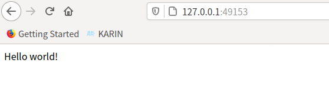

通过前面的学习，相信你已经掌握了单个容器的管理操作。在实践中，经常会碰到需要多个服务组件容器共同协作的情况，这往往需要多个容器之间能够互相访问到对方的服务。

Docker 除了通过网络访间外，还提供了两个很方便的功能来满足服务访问的基本需求：一个是允许映射容器内应用的服务端口到本地宿主主机；另一个是互联机制实现多个容器间通过容器名来快速访问。下面将分别讲解这两个很实用的功能。

## 端口映射实现容器访问

### 1、从外部访问容器应用

在启动容器的时候，如果不指定对应参数，在容器外部是无法通过网络来访问容器内的网络应用和服务的。

当容器中运行一些网络应用，要让外部访问这些应用时，可以通过 -P 或 -p 参数来指定端口映射。当使用 -P（大写的）标记时，Docker 会随机映射一个 49000～49900 的端口到内部容器开放的网络端口：

```shell
$ docker run -d -P training/webapp python app.py
Unable to find image 'training/webapp:latest' locally
latest: Pulling from training/webapp
Image docker.io/training/webapp:latest uses outdated schema1 manifest format. Please upgrade to a schema2 image for better future compatibility. More information at https://docs.docker.com/registry/spec/deprecated-schema-v1/
e190868d63f8: Pull complete 
909cd34c6fd7: Pull complete 
0b9bfabab7c1: Pull complete 
a3ed95caeb02: Pull complete 
10bbbc0fc0ff: Pull complete 
fca59b508e9f: Pull complete 
e7ae2541b15b: Pull complete 
9dd97ef58ce9: Pull complete 
a4c1b0cb7af7: Pull complete 
Digest: sha256:06e9c1983bd6d5db5fba376ccd63bfa529e8d02f23d5079b8f74a616308fb11d
Status: Downloaded newer image for training/webapp:latest
1d3cb3e3c02c0d02fba3f997c31d56755658f177d6776e72994aa435dca6cca4
$ docker ps -l
CONTAINER ID   IMAGE             COMMAND           CREATED         STATUS         PORTS                                         NAMES
1d3cb3e3c02c   training/webapp   "python app.py"   4 minutes ago   Up 4 minutes   0.0.0.0:49153->5000/tcp，:::49153->5000/tcp   trusting_chaum
```

此时，可以使用 `docker ps` 看到，本地主机的 49153 被映射到了容器的 5000 端口。

访间宿主主机的 49153 端口即可访问容器内 web 应用提供的界面。

::: center



<u>图 7-1</u>	浏览器访问本机的 49153 端口

:::

同样，可以通过 `docker logs` 命令来查看应用的信息：

```shell
$ docker logs -f trusting_chaum 
 * Running on http://0.0.0.0:5000/ (Press CTRL+C to quit)
172.17.0.1 - - [08/Sep/2021 07:43:47] "GET / HTTP/1.1" 200 -
172.17.0.1 - - [08/Sep/2021 07:43:48] "GET /favicon.ico HTTP/1.1" 404 -
```

-p（小写的）则可以指定要映射的端口，并且，在一个指定端口上只可以绑定一个容器。支持的格式有 `IP:HostPort:ContainerPort | IP:: ContainerPort | HostPort:ContainerPort`。

### 2、映射所有接口地址

使用 HostPort:ContainerPort 格式把本地的 5000 端口映射到容器的 5000 端口，可以执行如下命令：

```shell
$ docker run -d -p 5000:5000 training/webapp python app.py
739716a4c97b68979f205c412ca0e0ddd1722badca142409ff1b6c05095112e2
$ docker ps
CONTAINER ID   IMAGE             COMMAND           CREATED          STATUS          PORTS                                       NAMES
739716a4c97b   training/webapp   "python app.py"   4 seconds ago    Up 2 seconds    0.0.0.0:5000->5000/tcp, :::5000->5000/tcp   gifted_hoover
57f6feb67848   ubuntu:18.04      "/bin/bash"       42 minutes ago   Up 42 minutes                                               interesting_bardeen
```

此时默认会绑定本地所有接口上的所有地址。多次使用 -p 标记可以绑定多个端口。例如：

```shell
$ docker run -d -p 5000:5000 -p 3000:80 training/webapp python app.py
a8693f3c75a12c4a51be104a587307d254862b2d98d8242dc18cc4f91a487a4d
$ docker ps
CONTAINER ID   IMAGE             COMMAND           CREATED          STATUS          PORTS                                                                              NAMES
a8693f3c75a1   training/webapp   "python app.py"   4 seconds ago    Up 3 seconds    0.0.0.0:5000->5000/tcp, :::5000->5000/tcp, 0.0.0.0:3000->80/tcp, :::3000->80/tcp   wizardly_torvalds
```

### 3、映射到指定地址的指定端口

可以使用 `IP:HostPort:ContainerPort` 格式指定映射使用一个特定地址，比如地址 127.0.2.1:5000：

```shell
$ docker run -d -p 127.0.0.1:5000:5000 training/webapp python app.py
16df89a9037cc439fd0dcf5905b21679ec729188158427080bcbd4a3c7b14de7
$ docker ps
CONTAINER ID   IMAGE             COMMAND           CREATED          STATUS          PORTS                      NAMES
16df89a9037c   training/webapp   "python app.py"   4 seconds ago    Up 2 seconds    127.0.2.1:5000->5000/tcp   serene_williamson
```

### 4、映射到指定地址的任意端口

使用 IP::ContainerPort 绑定 localhost 的任意端口到容器的 5000 端口，本地主机会自动分配一个端口：

```shell
$ docker run -d -p 127.0.0.1::5000 training/webapp python app.py
ad5320b5cbc11774a0677a973d49a3696769d09a5fc2360b46dc4475d34b4132
$ docker ps
CONTAINER ID   IMAGE             COMMAND           CREATED          STATUS          PORTS                       NAMES
ad5320b5cbc1   training/webapp   "python app.py"   5 seconds ago    Up 4 seconds    127.0.0.1:49153->5000/tcp   gifted_bell
```

还可以使用 udp 标记来指定 udp 端口：

```shell
$ docker run -d -p 127.0.0.1:5000:5000/udp training/webapp python app.py
4da22d44f5575a180d8e494e65440b3b45a59f5d489e8d4aaa350d95ea1c2c14
$ docker ps
CONTAINER ID   IMAGE             COMMAND           CREATED          STATUS          PORTS                                NAMES
4da22d44f557   training/webapp   "python app.py"   4 seconds ago    Up 2 seconds    5000/tcp, 127.0.0.1:5000->5000/udp   determined_turing
```

### 5、查看映射端口配置

使用 `docker port` 来查看当前映射的端口配置，也可以查看到绑定的地址：

```shell
$ docker run -d -p 127.0.0.1::5000 training/webapp python app.py
ac00973485fb8aa90443fd6a1fc7203d80b577d99757d5d5181f931b37b8bfc3
$ docker port compassionate_brattain 
5000/tcp -> 127.0.0.1:49154
```

::: tip 注意

容器有自己的内部网络和 IP 地址，使用 `docker [container] inspect 容器ID` 可以获取容器的具体信息。

:::

## 互联机制实现便捷互访

容器的互联（Iinking）是一种让多个容器中的应用进行快速交互的方式。它会在源和接收容器之间创建连接关系，接收容器可以通过容器名快速访问到源容器，而不用指定具体的 IP 地址。

### 1、自定义容器命名

连接系统依据容器的名称来执行。因此，首先需要自定义一个好记的容器命名。虽然当创建容器的时候，系统默认会分配一个名字，但自定义命名容器有两个好处：

- 自定义的命名，比较好记，比如一个 Web 应用容器我们可以给它起名叫 web，一目了然；
- 当要连接其他容器时候（即便重启），也可以使用容器名而不用改变，比如连接 web 容器到 db 容器。

使用 --name 标记可以为容器自定义命名：

```shell
$ docker run -d -P --name web training/webapp python app.py
34c73b3f41309246047c1eff9e49888b71a6a7191c1ddb57cec2115d4fb54d3c
$ docker ps
CONTAINER ID   IMAGE             COMMAND           CREATED             STATUS             PORTS                                         NAMES
34c73b3f4130   training/webapp   "python app.py"   3 seconds ago       Up 2 seconds       0.0.0.0:49154->5000/tcp, :::49154->5000/tcp   web
#使用 docker ps 来验证设定的命名
```

也可以使用 `docker [container) inspect` 来查看容器的名字：

```shell
$ docker inspect -f "{{.Name}}" 34c73b3f4130
/web
```

::: tip 注意

容器的名称是唯一的。如果巳经命名了一个叫 web 的容器，当你要再次使用 web 这个名称的时候，需要先用 `docker rm` 命令删除之前创建的同名容器。

:::

在执行 `docker [container] run` 的时候如果添加 --rm 标记，则容器在终止后会立刻删除。注意，--rm 和 -d 参数不能同时使用。

### 2、容器互联

使用 --link 参数可以让容器之间安全地进行交互。

下面先创建一个新的数据库容器：

```shell
$ docker run -d --name db training/postgres
Unable to find image 'training/postgres:latest' locally
latest: Pulling from training/postgres
Image docker.io/training/postgres:latest uses outdated schema1 manifest format. Please upgrade to a schema2 image for better future compatibility. More information at https://docs.docker.com/registry/spec/deprecated-schema-v1/
a3ed95caeb02: Pull complete 
6e71c809542e: Downloading 
2978d9af87ba: Download complete 
e1bca35b062f: Download complete 
500b6decf741: Download complete 
74b14ef2151f: Download complete 
7afd5ed3826e: Download complete 
3c69bb244f5e: Download complete 
d86f9ec5aedf: Download complete 
010fabf20157: Download complete 
latest: Pulling from training/postgres
Image docker.io/training/postgres:latest uses outdated schema1 manifest format. Please upgrade to a schema2 image for better future compatibility. More information at https://docs.docker.com/registry/spec/deprecated-schema-v1/
a3ed95caeb02: Pull complete 
6e71c809542e: Pull complete 
2978d9af87ba: Pull complete 
e1bca35b062f: Pull complete 
500b6decf741: Pull complete 
74b14ef2151f: Pull complete 
7afd5ed3826e: Pull complete 
3c69bb244f5e: Pull complete 
d86f9ec5aedf: Pull complete 
010fabf20157: Pull complete 
Digest: sha256:a945dc6dcfbc8d009c3d972931608344b76c2870ce796da00a827bd50791907e
Status: Downloaded newer image for training/postgres:latest
dd2bf319cac08333c221abd08748a8f06b5ae75f4bab9c45e74785e0d56932e0
```

删除之前创建的 web 容器：

```shell
$ docker rm -f web
```

然后创建 一 个新的 web 容器，并将它连接到 db 容器：

```shell
$ docker run -d -P --name web --link db:db training/webapp python app.py
b726365f50d7a4a4b31570bcd8a9ccbe77e6b63fd8f1438182398b5e1426ed21
```

此时，db 容器和 web 容器建立互联关系。

--link 参数的格式为 --link name:alias，其中 name 是要链接的容器的名称，alias 是别名。

使用 `docker inspect web` 来查看 web 容器的详情（Links）：

```shell
$ docker inspect web 
[
    {
        "Id": "68f6051bd5be4c13b1d97fdfee1b468c1ecbb0ecc203b26ce3673b3744d74b69",
        "Created": "2021-09-09T00:59:29.018886397Z",
        "Path": "python",
        "Args": [
            "app.py"
        ],
        "State": {
            "Status": "running",
......
"Links": [
                "/db:/web/db"
            ],
......
    }
]
```

Docker 相当于在两个互联的容器之间创建了一个虚机通道，而且不用映射它们的端口到宿主主机上。在启动 db 容器的时候并没有使用 -p 和 -P 标记，从而避免了暴露数据库服务端口到外部网络上。

Docker 通过两种方式为容器公开连接信息：

- 更新环境变量;
- 更新 `/etc/hosts` 文件。

使用 `env` 命令来查看 web 容器的环境变量：

```shell
$ docker run --rm --name web2 --link db:db training/webapp env
PATH=/usr/local/sbin:/usr/local/bin:/usr/sbin:/usr/bin:/sbin:/bin
HOSTNAME=4acbb47609c1
DB_PORT=tcp://172.17.0.2:5432
DB_PORT_5432_TCP=tcp://172.17.0.2:5432
DB_PORT_5432_TCP_ADDR=172.17.0.2
DB_PORT_5432_TCP_PORT=5432
DB_PORT_5432_TCP_PROTO=tcp
DB_NAME=/web2/db
DB_ENV_PG_VERSION=9.3
HOME=/root
```

其中 DB_ 开头的环境变量是供 web 容器连接 db 容器使用，前缀采用大写的连接别名。

除了环境变量，Docker 还添加 host 信息到父容器的 /etc/hosts 的文件。下面是父容器 web 的 hosts 文件：

```shell
$ docker run -it --rm --link db:db training/webapp /bin/bash
root@4581c58ad217:/opt/webapp# cat /etc/hosts 
127.0.0.1	localhost
::1	localhost ip6-localhost ip6-loopback
fe00::0	ip6-localnet
ff00::0	ip6-mcastprefix
ff02::1	ip6-allnodes
ff02::2	ip6-allrouters
172.17.0.2	db 7d1b09695298
172.17.0.4	4581c58ad217
root@4581c58ad217:/opt/webapp# 
```

这里有 2 个 hosts 信息，第一个是 web 容器，web 容器用自己的 id 作为默认主机名，第二个是 db 容器的 IP 和主机名。

可以在 web 容器中安装 `ping` 命令来测试跟 db 容器的连通：

```shell
root@17d65c4c4712:/opt/webapp# apt install -yqq inetutils-ping
The following packages will be REMOVED:
  iputils-ping ubuntu-minimal
The following NEW packages will be installed:
  inetutils-ping
0 upgraded, 1 newly installed, 2 to remove and 3 not upgraded.
Need to get 55.6 kB of archives.
After this operation, 131 kB of additional disk space will be used.
(Reading database ... 18233 files and directories currently installed.)
Removing ubuntu-minimal (1.325) ...
Removing iputils-ping (3:20121221-4ubuntu1.1) ...
Selecting previously unselected package inetutils-ping.
(Reading database ... 18221 files and directories currently installed.)
Preparing to unpack .../inetutils-ping_2%3a1.9.2-1_amd64.deb ...
Unpacking inetutils-ping (2:1.9.2-1) ...
Setting up inetutils-ping (2:1.9.2-1) ...
root@17d65c4c4712:/opt/webapp# ping db
PING db (172.17.0.2): 56 data bytes
64 bytes from 172.17.0.2: icmp_seq=0 ttl=64 time=0.933 ms
64 bytes from 172.17.0.2: icmp_seq=1 ttl=64 time=0.278 ms
64 bytes from 172.17.0.2: icmp_seq=2 ttl=64 time=0.172 ms
64 bytes from 172.17.0.2: icmp_seq=3 ttl=64 time=0.150 ms
^C--- db ping statistics ---
6 packets transmitted, 6 packets received, 0% packet loss
round-trip min/avg/max/stddev = 0.089/0.290/0.933/0.293 ms
root@17d65c4c4712:/opt/webapp# 
```

用 ping 来测试 db 容器，它会解析成 172.17.0.2。

用户可以链接多个子容器到父容器，比如可以链接多个 web 到同一个 db 容器上。

## 小结

毫无疑问，容器服务的访间是很关键的一个用途。通过具体案例讲解了 Docker 容器服务访问的两大基本操作，包括基础的容器端口映射机制和容器互联机制。同时，Docker 目前可以成熟支持 Linux 系统自带的网络服务和功能，这既可以利用现有成熟的技术提供稳定支持，又可以实现快速的高性能转发。

在生产环境中，网络方面的需求更加复杂和多变，包括跨主机甚至跨数据中心的通信，这时候往往就需要引入额外的机制，例如 SDN（软件定义网络）或 NFV （网络功能虚拟化）
的相关技术。

