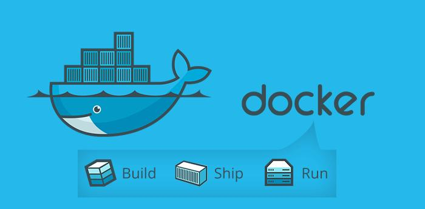
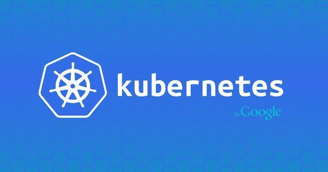

## 虚拟化

如果说主机时代比拼的是单个服务器物理性能（如 CPU 主频和内存）的强弱，那么在云时代，最为看重的则是凭借虚拟化技术所构建的集群处理能力 。

伴随着信息技术的飞速发展，虚拟化的概念早已经广泛应用到各种关键场景中 。 从 20 世纪 60 年代 IBM 推出的大型主机虚拟化，到后来以 Xen 、KVM 为代表的虚拟机虚拟化，再到现在以 Docker 为代表的容器技术，虚拟化技术自身也在不断进行创新和突破。

传统来看，虚拟化既可以通过硬件模拟来实现，也可以通过操作系统软件来实现 。 而容器技术则更为优雅，它充分利用了操作系统本身已有的机制和特性，可以实现远超传统虚拟机的轻量级虚拟化 。 因此，有人甚至把它称为“新一代的虚拟化”技术，并将基于容器打造的云平台亲切地称为“容器云” 。

毫无疑问， Docker 正是众多容器技术中的佼佼者，是容器技术发展过程中耀眼的一抹亮色 。

## Docker

Docker 是一个开源的引擎，可以轻松的为任何应用创建一个轻量级的、可移植的、自给自足的容器。

Docker 主要解决环境配置问题，它是一种虚拟化技术，对进程进行隔离，被隔离的进程独立于宿主操作系统和其它隔离的进程。使用 Docker 可以不修改应用程序代码，不需要开发人员学习特定环境下的技术，就能够将现有的应用程序部署在其它机器上。

就在 Docker 容器技术被炒得热火朝天之时，大家发现，如果想要将 Docker 应用于具体的业务实现，是存在困难的——编排、管理和调度等各个方面，都不容易。于是，人们迫切需要一套管理系统，对 Docker 及容器进行更高级更灵活的管理。就在这个时候，K8S 出现了。

::: tip 说明

K8S，就是基于容器的集群管理平台，它的全称是 kubernetes（k8s 这个缩写是因为 k 和 s 之间有八个字符的关系）。

:::

## Kubernetes

Kubernetes 是 Google 团队发起并维护的开源容器集群管理系统, 底层基于 Docker、rkt 等容器技术，提供强大的应用管理和资源调度能力。 Kubernetes 已经成为目前容器云领域影响力最大的开源平台，使用 Kubernetes，用户可以轻松搭建和管理 一 个可扩展的生产级别容器云。

容器是打包和运行应用程序的好方式。在生产环境中，你需要管理运行应用程序的容器，并确保不会停机。 例如，如果一个容器发生故障，则需要启动另一个容器。如果系统处理此行为，会不会更容易？

这就是 Kubernetes 来解决这些问题的方法！ Kubernetes 为你提供了一个可弹性运行分布式系统的框架。 Kubernetes 会满足你的扩展要求、故障转移、部署模式等。

