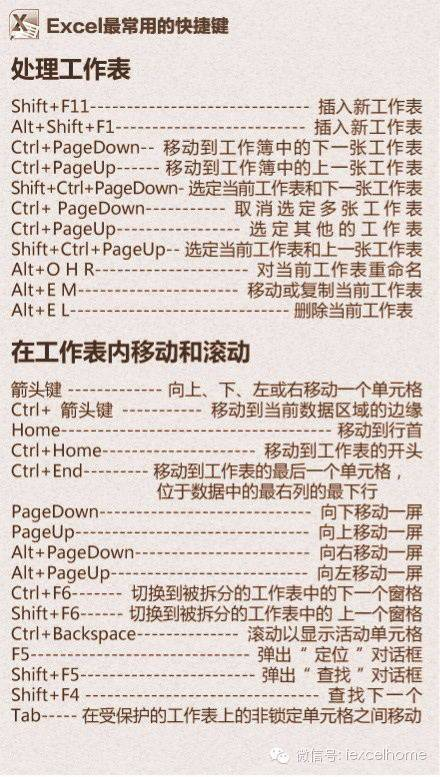
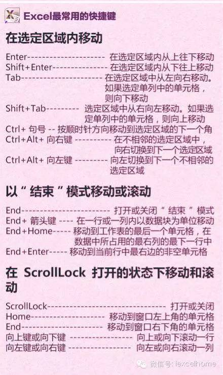
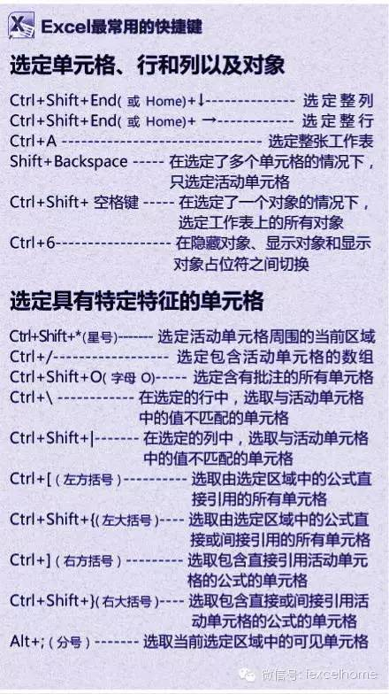
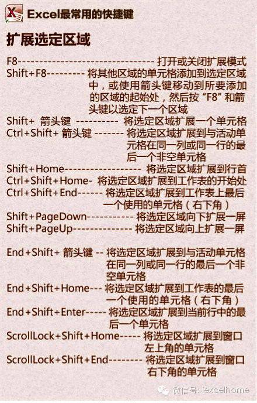
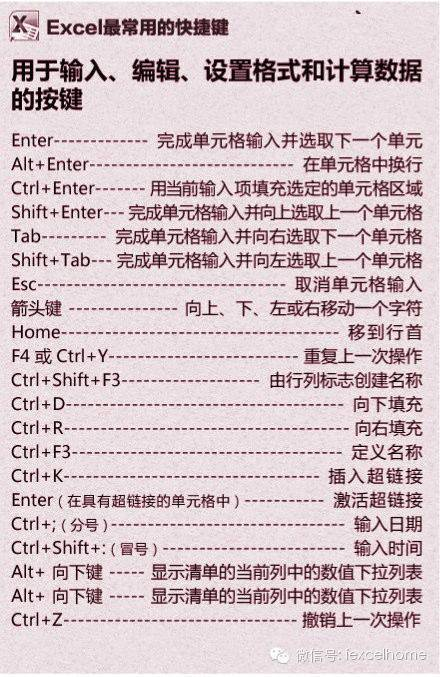
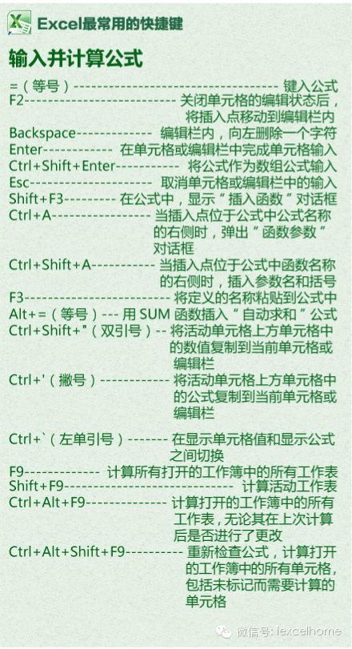
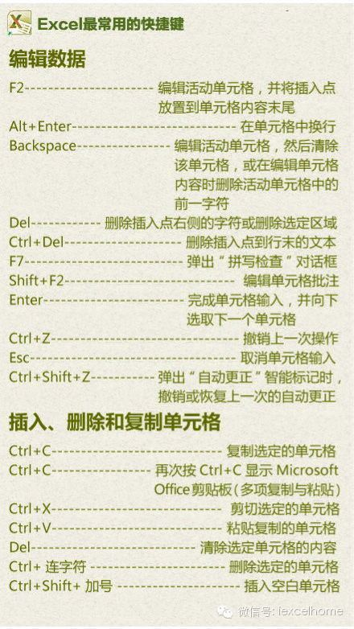
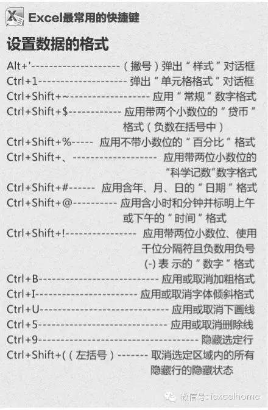
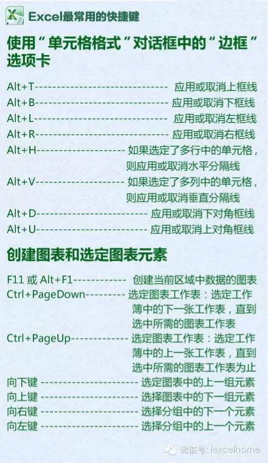

只会用<kbd>Ctrl</kbd>+<kbd>C</kbd>和<kbd>Ctrl</kbd>+<kbd>V</kbd>怎么面对职场挑战！

当然 这些快捷键不需要全部记住，咱们只要收藏一下，**记住几个常用的快捷键**就可以了，对于提高效率和逼格，作用都是不错的。

::: center

:::

::: tip 注

以上图片来自于 [ExcelHome](https://www.excelhome.net/436.html)

:::

