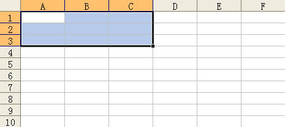
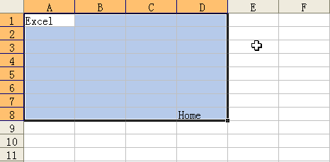
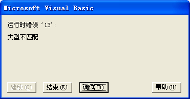
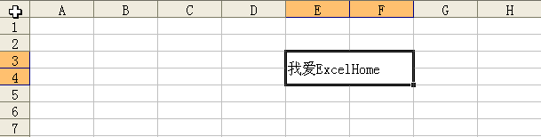

Range 对象是 Excel 应用程序中最常用的对象，一个 Range 对象代表一个单元格、一行、一列、包含一个或者更多单元格区域（可以是连续的单元格，也可以是不连续的单元格）中选定的单元格，甚至是多个工作表上的一组单元格，在操作 Excel 内的任何区域之前都需要将其表示为一个 Range 对象，然后使用该 Range 对象的方法和属性。

## 1、单元格的引用方法

在 VBA 中经常需要引用单元格或单元格区域区域，主要有以下几种方法。

### 1）使用 Range 属性

VBA 中可以使用 Range 属性返回单元格或单元格区域，如下面的代码所示。

```vb
Sub RngSelect() 
	Sheet1.Range("A3:F6, B1:C5").Select
End Sub
```

代码解析：

RngSelect 过程使用 Select 方法选中 `A3:F6, B1:C5` 单元格区域。

Range 属性返回一个 Range 对象，该对象代表一个单元格或单元格区域，语法如下：

```vb
Range(Cell1, Cell2)

参数Cell1是必需的，必须为 A1 样式引用的宏语言，可包括区域操作符（冒号）、相交区域操作符（空格）或合并区域操作符（逗号）。也可包括美元符号（即绝对地址，如“$A$1”）。
参数Cell2是可选的，区域左上角和右下角的单元格。
```

运行 Sub RngSelect 过程，选中 `A3:F6, B1:C5` 单元格区域，如图 1-1 所示。

::: center


<u>图 1-1</u>	使用 Range 属性引用单元格区域

:::

### 2）使用 Cells 属性

使用 Cells 属性返回一个 Range 对象，如下面的代码所示。

```vb
Sub Cell()
	Dim icell As Integer
	For icell = 1 To 100
		Sheet2.Cells(icell, 1).Value = icell
	Next
End Sub
```

代码解析：

Cell 过程使用 For...Next 语句为工作表中的 `A1:A100` 单元格区域填入序号。

Cells 属性指定单元格区域中的单元格，语法如下：

```vb
Cells(RowIndex, ColumnIndex)

参数RowIndex是可选的，表示引用区域中的行序号。
参数ColumnIndex是可选的，表示引用区域中的列序号。当然也可以用列的名称，如Cells(2,"B")代表B2单元格
如果缺省参数，Cells属性返回引用对象的所有单元格。

Cells属性的参数可以使用变量，因此经常应用于在单元格区域中循环。
```

### 3）使用快捷记号

在 VBA 中可以将 `A1` 引用样式或命名区域名称使用方括号括起来，作为 Range 属性的快捷方式，这样就不必键入单词“Range”或使用引号，如下面的代码所示。

```vb
Sub Fastmark()
	[A1：A5] = 2
	[C8] = 4
End Sub
```

代码解析：

Fastmark 过程使用快捷记号为单元格区域赋值。

第 2 行代码使用快捷记号将活动工作表中的 `A1:A5` 单元格赋值为 2。

第 3 行代码使用快捷记号将活动工作表中的 `C8` 单元格赋值为 4。

### 4）使用 Offset 属性

可以使用 Range 对象的 Offset 属性返回一个基于引用的 Range 对象的单元格区域，如下面的代码所示。

```vb
Sub Offset()
	Sheet3.Range("A1:C3").Offset(3, 3).Select
End Sub
```

代码解析：

Offset 过程使用 Range 对象的 Offset 属性选中 `A1:A3` 单元格偏移三行三列后的区域。

应用于 Range 对象的 Offset 属性的语法如下：

```vb
expression.Offset(RowOffset, ColumnOffset)

参数expression是必需的，该表达式返回一个Range对象。
参数RowOffset是可选的，区域偏移的行数（正值、负值或 0（零））。正值表示向下偏移，负值表示向上偏移，默认值为 0。
参数ColumnOffset是可选的，区域偏移的列数（正值、负值或 0（零））。正值表示向右偏移，负值表示向左偏移，默认值为 0。
```

运行 Offset 过程，选中 `A1:A3` 单元格偏称三行三列后的区域，如图 1-2 所示。

::: center


<u>图 1-2</u>	使用 Range 对象的 Offset 属性

:::

### 5）使用 Resize 属性

用 Range 对象的 Resize 属性调整指定区域的大小，并返回调整大小后的单元格区域，如下面的代码所示。

```vb
Sub Resize()
	Sheet4.Range("A1").Resize(3, 3).Select
End Sub
```

代码解析：

Resize 过程使用 Range 对象的 Resize 属性选中 `A1` 单元格扩展为三行三列后的区域。

Resize 属性的语法如下：

```vb
expression.Resize(RowSize, ColumnSize)

参数expression是必需的，返回要调整大小的Range 对象
参数RowSize是可选的，新区域中的行数。如果省略该参数，则该区域中的行数保持不变。
参数ColumnSize是可选的，新区域中的列数。如果省略该参数。则该区域中的列数保持不变。
```

运行 Resize 过程，选中 `A1` 单元格扩展为三行三列后的区域，如图 1-3 所示。

::: center



<u>图 1-3</u>	使用 Resize 属性调整区域大小

:::

### 6）使用 Union 方法

使用 Union 方法可以将多个非连续区域连接起来成为一个区域，从而可以实现对多个非连续区域一起进行操作，如下面的代码所示。

```vb
Sub UnSelect()
	Union(Sheet5.Range("A1:D4"), Sheet5.Range("E5:H8")).Select
End Sub
```

代码解析：

UnSelect 过程选择单元格 `A1:D4` 和 `E5:H8` 所组成的区域。Union 方法返回两个或多个区域的合并区域，语法如下：

```vb
expression.Union(Arg1, Arg2, ...)
    
其中参数expression是可选的，返回一个Application对象。
参数Arg1, Arg2, ...是必需的，至少指定两个Range对象。
```

运行 UnSelect 过程，选中单元格 `A1:D4` 和 `E5:H8` 所组成的区域，如图 1-4 所示。

::: center


<u>图 1-4</u>	使用 Union 方法将多个非连续区域连接成一个区域

:::

### 7）使用 UsedRange 属性

使用 UsedRange 属性返回指定工作表上已使用单元格组成的区域，如下面的代码所示。

```vb
Sub UseSelect()
	Sheet6.UsedRange.Select
End Su
```

代码解析：

UseSelect 过程使用 UsedRange 属性选择工作表上已使用单元格组成的区域，包括空单元格。如工作表中已使用 `A1` 单元格和 `D8` 单元格，运行 UseSelect过程将选择 `A1` 到 `D8` 单元格区域，如图 1-5 所示。

::: center



<u>图 1-5</u>	使用 UsedRange 属性选择已使用区域

:::

### 8）使用 CurrentRegion 属性

使用 CurrentRegion 属性返回指定工作表上当前的区域，如下面的代码所示。

```vb
Sub CurrentSelect()
	Sheet7.Range("A5").CurrentRegion.Select
End Sub
```

代码解析：

CurrentSelect 过程使用 CurrentRegion 属性选择工作表上 `A5` 单元格当前的区域，当前区域是一个边缘是任意空行和空列组合成的范围。

运行 CurrentSelect 过程将选择 `A5` 到 `B6` 单元格区域，如图 1-6 所示。

::: center


<u>图 1-6</u>	CurrentRegion 属性选择当前的区域

:::

## 2、选定单元格区域的方法

### 1）使用 Select 方法

在 VBA 中一般使用 Select 方法选定单元格或单元格区域，如下面的代码所示。

```vb
Sub RngSelect()
	Sheet3.Activate
	Sheet3.Range("A1：B10").Select
End Sub
```

代码解析：

RngSelect 过程使用 Select 方法选定 Sheet3 中的 `A1:B10` 单元格区域，Select 方法应用于 Range 对象时语法如下：

```vb
expression.Select(Replace)

参数expression是必需的，一个有效的对象。
参数Replace是可选的，要替换的对象。
使用Select方法选定单元格时，单元格所在的工作表必需为活动工作表
```

所以在第 2 行代码中先使用 Activate 方法使 Sheet3 成为活动工作表，否则 Select 方法有可能出错，显示如图 2-1 所示的错误提示。

::: center


<u>图 2-1</u>	Select 方法无效提示

:::

### 2）使用 Activate 方法

还可以使用 Activate 方法选定单元格或单元格区域，如下面的代码所示。

```vb
Sub RngActivate()
	Sheet3.Activate
	Sheet3.Range("A1:B10").Activate
End Sub
```

代码解析：

RngActivate 过程使用 Activate 方法选定 Sheet3 中的 `A1:B10` 单元格区域，Activate 方法应用于 Range 对象时语法如下：

```vb
expression.Activate
```

使用 Activate 方法选定单元格时，单元格所在的工作表也必需为活动工作表，否则 Activate 方法有可能出错

::: center


<u>图 2-2</u>	Activate 方法无效提示

:::

### 3）使用 Goto 方法

使用 Goto 方法无需使单元格所在的工作表成为活动工作表，如下面的代码所示。

```vb
Sub RngGoto()
	Application.Goto Reference:=Sheet3.Range("A1:B10"), scroll:=True
End Sub
```

代码解析：

RngGoto 过程使用 Goto 方法选定 Sheet3 中的 `A1:B10` 单元格区域，并滚动工作表以显示该单元格。

Goto 方法选定任意工作簿中的任意区域或任意 Visual Basic 过程，并且如果该工作簿未处于活动状态，就激活该工作簿，语法如下：

```vb
expression.Goto(Reference, Scroll)

参数expression是必需的，返回一个Application对象。
参数Reference是可选的，Variant类型，指定目标。可以是Range对象、包含R1C1样式记号的单元格引用的字符串或包含Visual Basic过程名的字符串。如果省略本参数，目标将是最近一次用Goto方法选定的区域。
参数Scroll是可选的，Variant类型，如果该值为True，则滚动窗口直至目标区域的左上角单元格出现在窗口的左上角。如果该值为False，则不滚动窗口。默认值为False。
```

## 3、获得行、列中的最后一个非空单元格

使用 VBA 对工作表进行操作时，经常需要定位到指定行或列中最后一个非空单元格，此时可以使用 Range 对象的 End 属性，在取得单元格对象后便能获得该单元格的相关属性，如单元格地址、行列号、数值等，如下面的代码所示。

```vb
Sub LastRow()
	Dim rng As Range
	Set rng = Sheet1.Range("A65536").End(xlUp)
	MsgBox "A列中最后一个非空单元格是" & rng.Address(0, 0) & ",行号" & rng.Row & ",数值" & rng.Value
	Set rng = Nothing
End Sub
```

代码解析：

LastRow 过程使用消息框显示工作表中 A 列最后非空单元格的地址、行号和数值。

End 属性返回一个 Range 对象，该对象代表包含源区域的区域尾端的单元格。等同于按键 <kbd>End</kbd>+<kbd>↑</kbd> 、 <kbd>End</kbd>+<kbd>↓</kbd> 、 <kbd>End</kbd>+<kbd>←</kbd> 或 <kbd>End</kbd>+<kbd>→</kbd>，语法如下：

```vb
expression.End(Direction)

参数expression是必需的，一个有效的对象。
参数Direction是可选的，所要移动的方向，可以为表格3-1所示的XlDirection常量之一。
```

<u>表格 3-1</u>	XlDirection 常量

| 常量      | 值（非官方数值） | 描述 |
| --------- | ---------------- | ---- |
| xlToLeft  | -4159（1）       | 向左 |
| xlToRight | -4161（2）       | 向右 |
| xlUp      | -4162（3）       | 向上 |
| xlDown    | -4121（4）       | 向下 |

Range 对象的 End 属性返回的是一个 Range 对象，因此可以直接使用该对象的属性和方法。

运行 LastRow 过程结果如图 3-1 所示。

::: center


<u>图 3-1</u>	获得 A 列最后一个非空单元格

:::

## 4、定位单元格

在 Excel 中使用定位对话框可以选中工作表中特定的单元格区域，而在 VBA 中则使用 SpecialCells 方法，如下面的代码所示。

```vb
Sub SpecialAddress()
	Dim rng As Range
	Set rng = Sheet1.UsedRange.SpecialCells(xlCellTypeFormulas)
	rng.Select
	MsgBox "工作表中有公式的单元格为： " & rng.Address
	Set rng = Nothing
End Sub
```

代码解析：

SpecialAddress 过程使用 SpecialCells 方法选中工作表中有公式的单元格，并用消息框显示其地址。

SpecialCells 方法返回一个 Range 对象，该对象代表与指定类型及值相匹配的所有单元格，语法如下：

```vb
expression.SpecialCells(Type, Value)

参数expression是必需的，返回一个有效的对象。
参数Type是必需的，要包含的单元格，可为表格4-1所列的XlCellType常量之一。
```

 <u>表格 4-1</u>	XlCellType 常量

| 常量                           | 值    | 描述                     |
| ------------------------------ | ----- | ------------------------ |
| xlCellTypeAllFormatConditions  | -4172 | 任意格式单元格           |
| xlCellTypeAllValidation        | -4174 | 含有验证条件的单元格     |
| xlCellTypeBlanks               | 4     | 空单元格                 |
| xlCellTypeComments             | -4144 | 含有注释的单元格         |
| xlCellTypeConstants            | 2     | 含有常量的单元格         |
| xlCellTypeFormulas             | -4123 | 含有公式的单元格         |
| xlCellTypeLastCell             | 11    | 使用区域中最后的单元格   |
| xlCellTypeSameFormatConditions | -4173 | 含有相同格式的单元格     |
| xlCellTypeSameValidation       | -4175 | 含有相同验证条件的单元格 |
| xlCellTypeVisible              | 12    | 所有可见单元格           |

第 3 行代码将 SpecialCells 方法的 Type 参数设置为 xlCellTypeFormulas，返回的是含有公式的单元格，通过修改相应的参数可以返回不同的单元格。

参数 Value 是可选的，如果 Type 参数为 xlCellTypeConstants 或 xlCellTypeFormulas， 此参数可用于确定结果中应包含哪几类单元格。将某几个值相加可使此方法返回多种类型的单元格。如果省略将选定所有常量或公式，可为表格 4-2 所列的 XlSpecialCellsValue 常量之一。

<u>表格 4-2</u> XlSpecialCellsValue 常量

| 常量         | 值   | 描述   |
| ------------ | ---- | ------ |
| xlErrors     | 16   | 错误   |
| xlLogical    | 4    | 逻辑值 |
| xlNumbers    | 1    | 数字   |
| xlTextValues | 2    | 文本   |

第 5 行代码使用消息框显示工作表中含有公式单元格的地址。SpecialCells 方法返回的是 Range 对象，因此可以直接使用该对象的属性和方法。

运行 SpecialAddress 过程结果如图 4-1 所示。

::: center


<u>图 4-1</u>	SpecialCells 方法

:::

## 5、查找单元格

### 1）使用 Find 方法

在 Excel 中使用查找对话框可以查找工作表中特定内容的单元格，而在 VBA 中则使用 Find 方法，如下面的代码所示。

```vb
Sub RngFind()
	Dim StrFind As String
	Dim Rng As Range
	StrFind = InputBox("请输入要查找的值:")
	If Trim(StrFind) <> "" Then
		With Sheet1.Range("A:A")
			Set Rng = .Find(What:=StrFind, _
			After:=.Cells(.Cells.Count), _
			LookIn:=xlValues, _
			LookAt:=xlWhole, _
			SearchOrder:=xlByRows, _
			SearchDirection:=xlNext, _
			MatchCase:=False)
			If Not Rng Is Nothing Then
				Application.Goto Rng, True
			Else
				MsgBox "没有找到该单元格!"
			End If
		End With
	End If
End Sub
```

代码解析：

RngFind 过程使用 Find 方法在工作表 Sheet1 的 A 列中查找 InputBox 函数对话框中所输入的值，并查找该值所在的第一个单元格。

第 6 到第 13 行代码在工作表 Sheet1 的 A 列中查找 InputBox 函数对话框中所输入的值。应用于 Range 对象的 Find 方法在区域中查找特定信息，并返回 Range 对象，该对象代表用于查找信息的第一个单元格。如果未发现匹配单元格，就返回 Nothing，语法如下：

```vb
expression.Find(What, After, LookIn, LookAt, SearchOrder, SearchDirection, MatchCase, MatchByte, SerchFormat)

参数expression是必需的，该表达式返回一个Range对象。
参数What是必需的，要搜索的数据，可为字符串或任意数据类型。
参数After是可选的，表示搜索过程将从其之后开始进行的单元格，必须是区域中的单个单元格。查找时是从该单元格之后开始的，直到本方法绕回到指定的单元格时，才对其进行搜索。如果未指定本参数，搜索将从区域的左上角单元格之后开始。
参数LookIn是可选的，信息类型。
参数LookAt是可选的，可为XlLookAt常量的xlWhole或xlPart之一。
参数SearchOrder是可选的，可为XlSearchOrder常量的xlByRows或lByColumns之一。
参数SearchDirection是可选的，搜索的方向，可为XlSearchDirection常量的xlNext或 xlPrevious之一。
参数MatchCase是可选的，若为True，则进行区分大小写的查找。默认值为False。
参数MatchByte是可选的，仅在选择或安装了双字节语言支持时使用。若为True，则双字节字符仅匹配双字节字符。若为False，则双字节字符可匹配其等价的单字节字符。
参数SerchFormat是可选的，搜索的格式。
```

在本例中将 After 参数设置为 A 列的最后一个单元格，所以查找时从 A1 单元格开始搜索。

每次使用 Find 方法后，参数 LookIn、LookAt、SearchOrder 和 MatchByte 的设置将保存。如果下次调用 Find 方法时不指定这些参数的值，就使用保存的值。因此每次使用该方法时请明确设置这些参数。

如果工作表的 A 列中存在重复的数值，那么需要使用 FindNext 方法或 FindPrevious 方法进行重复搜索，如下面的代码所示。

```vb
Sub RngFindNext()
	Dim StrFind As String
	Dim Rng As Range
	Dim FindAddress As String
	StrFind = InputBox("请输入要查找的值:")
	If Trim(StrFind) <> "" Then
		With Sheet1.Range("A:A")
			Set Rng = .Find(What:=StrFind, _
				After:=.Cells(.Cells.Count), _
				LookIn:=xlValues, _
				LookAt:=xlWhole, _
				SearchOrder:=xlByRows, _
				SearchDirection:=xlNext, _
				MatchCase:=False)
			If Not Rng Is Nothing Then
				FindAddress = Rng.Address
				Do
					Rng.Interior.ColorIndex = 6
					Set Rng = .FindNext(Rng)
				Loop While Not Rng Is Nothing And Rng.Address <> FindAddress
			End If
		End With
	End If
End Sub
```

代码解析：

RngFindNext 过程在工作表 Sheet1 的 A 列中查找 InputBox 函数对话框中所输入的值，并将查到单元格底色设置成黄色。

第 8 行到第 17 行代码使用 Find 方法在工作表 Sheet1 的 A 列中查找。

第 16 行代码将查找到的第一个单元格地址赋给字符串变量 FindAddress。

第 18 行代码将查找到的单元格底色设置成黄色。

第 19 行代码使用 FindNext 方法进行重复搜索。FindNext 方法继续执行用 Find 方法启动的搜索。查找下一个匹配相同条件的单元格并返回代表单元格的 Range 对象，语法如下：

```vb
expression.FindNext(After)

参数expression是必需的，返回一个Range对象。
参数After是可选的，指定一个单元格，查找将从该单元格之后开始。
```

第 20 行代码如果查找到的单元格地址等于字符串变量 FindAddress 所记录的地址，说明 A 列已搜索完毕，结束查找过程。

运行 RngFindNext 过程，在 InputBox 函数输入框中输入“196.01”后结果如图 5-1 所示。

::: center


<u>图 5-1</u>	使用 FindNext 方法重复搜索

:::

还可以使用 FindPrevious 方法进行重复搜索，FindPrevious 方法的语法如下：

```vb
expression.FindPrevious(After)
```

FindPrevious 方法和 FindNext 方法唯一的区别是 FindPrevious 方法查找匹配相同条件的前一个单元格而 FindNext 方法是查找匹配相同条件的下一个单元格。

### 2）使用 Like 运算符

使用 Like 运算符可以进行更为复杂的模式匹配查找，如下面的代码所示。

```vb
Sub RngLike()
	Dim rng As Range
	Dim a As Integer
	a = 1
	With Sheet2
		.Range("A:A").ClearContents
		For Each rng In .Range("B1:E1000")
			If rng.Text Like "*a*" Then
				.Range("A" & a) = rng.Text
				a = a + 1
			End If
		Next
	End With
End Sub
```

代码解析：

RngLike 过程使用 For Each...Next 语句和 Like 运算符在单元格区域 `B1:E10000` 中搜索含有“a”字符的单元格，找到匹配单元格以后将单元格的值写入到 A 列中。

第 6 行代码使用 ClearContents 方法清除 A 列区域的数据。

第 7 行代码使用 For Each...Next 语句在单元格区域 `B1:E10000` 中循环。

第 8 行代码使用 Like 运算符在单元格区域 `B1:E10000` 中搜索含有“a”字符的单元格。

Like 运算符用来比较两个字符串，语法如下：

```vb
result = string Like pattern

参数string是必需的，字符串表达式。
参数pattern是必需的，字符串表达式。
```

如果 string 与 pattern 匹配，则 result 为 True；如果不匹配，则 result 为 False。但是如果 string 或 pattern 中有一个为 Null，则 result 为 Null。

参数 pattern 可以使用通配符、字符串列表或字符区间的任何组合来匹配字符串。表格 5-1 列出 pattern 中允许的字符以及它们与什么进行匹配。

<u>表格 5-1</u>	pattern 中的匹配字符串

| pattern中的字符 | 符合string中的字符           |
| --------------- | ---------------------------- |
| ?               | 任何单一字符                 |
| *               | 零个或多个字符               |
| #               | 任何一个数字 (0–9)           |
| [charlist]      | charlist中的任何单一字符     |
| [!charlist]     | 不在charlist中的任何单一字符 |

第 9 行代码将找到的匹配单元格的值写入到 A 列中。

运行 RngLike 过程结果如图 5-2 所示。

::: center


<u>图 5-2</u>	使用 Like 运算符进行模式匹配查找

:::

## 6、替换单元格内字符串

如果需要替换单元格内指定的字符串，那么使用 Range 对象的 Replace 方法，如下面的代码所示。

```vb
Sub RngReplace()
	Range("A1:A5").Replace "通州", "南通"
End Sub
```

代码解析：

RngReplace 过程将工作表 `A1:A5` 单元格中的“通州”字符串替换成“南通”字符串。

应用于 Range 对象的 Replace 方法替换指定区域内单元格中的字符，语法如下：

```vb
expression.Replace(What, Replacement, LookAt, SearchOrder, MatchCase, MatchByte, SearchFormat, ReplaceFormat)

参数expression是必需的，返回一个Range对象。
参数What是必需的，要搜索的字符串。
参数Replacement是必需的，替换的字符串。
```

运行 RngReplace 过程前工作表如图 6-1 所示，运行 RngReplace 过程后结果如图 6-2 所示。

::: center


<u>图 6-1</u>	替换前单元格


<u>图 6-2</u>	替换后单元格

:::

## 7、复制单元格区域

在实际操作中，经常需要复制指定的单元格区域到另外一个单元格区域。要复制指定单元格区域到其他位置，使用 Range 对象的 Copy 方法，如下面的代码所示。

```vb
Sub RangeCopy()
	Application.DisplayAlerts = False
	Sheet1.Range("A1").CurrentRegion.Copy Sheet2.Range("A1")
	Application.DisplayAlerts = True
End Sub
```

代码解析：

RangeCopy 过程将如图 7-1 所示的 Sheet1 工作表中 `A1` 单元格的当前区域复制到 Sheet2 工作表中以 `A1` 单元格为左上角单元格的区域，如图 7-2 所示。

::: center

	

<u>图 7-1</u>	需复制的数据表


<u>图 7-2</u>	复制结果

:::

Range 对象的 Copy 方法的语法如下：

```vb
Copy(Destination)

参数Destination表示复制单元格区域的目标区域，如果省略该参数，Excel将把该区域复制到剪贴板中。
```

使用 Copy 方法复制单元格区域时，也复制了该单元格区域的格式，如图 7-2 所示。

复制单元格区域时，如果目标区域为非空单元格区域，Excel 将显示如图 7-3 所示的消息框提示是否替换单元格内容，可以设置 Application.DisplayAlerts 属性值为 False，使复制时不出现该消息框。

::: center


<u>图 7-3</u>	替换对话框

:::

第 2 行代码通常复制单元格区域的操作不会将单元格区域的列宽大小同时复制，如图 7-2 所示。如果希望在复制单元格区域的同时，也复制源区域的列宽大小，可以使用下面的代码。

```vb
Sub CopyWithSameColumnWidths()
	Sheet1.Range("A1").CurrentRegion.Copy
	With Sheet3.Range("A1")
		.PasteSpecial xlPasteColumnWidths
		.PasteSpecial xlPasteAll
	End With
	Application.CutCopyMode = False
End Sub
```

代码解析：

第 4 行代码使用 Range 对象的 PasteSpecial 方法选择性粘贴剪贴板中的 Range 对象的列宽。

第 5 行代码粘贴剪贴板中的 Range 对象全部内容。

第 7 行代码取消应用程序复制模式。

应用于 Range 对象的 PasteSpecial 方法将剪贴板中的 Range 对象粘贴到指定区域，在粘贴时可以有选择的粘贴对象的部分属性。其语法如下：

```vb
PasteSpecial(Paste, Operation, SkipBlanks, Transpose)
    
参数Paste指定要粘贴的区域部分，可为表格7-1所列的XlPasteType常量之一。
参数Operation指定粘贴操作。可为表格7-2所列的XlPasteSpecialOperation常量之一。
参数SkipBlanks指示是否跳过空单元格，若参数值为True，则不将剪贴板上区域中的空白单元格粘贴到目标区域中。默认值为False。
参数Transpose指示是否进行转置，若参数值为True，则粘贴区域时转置行和列。默认值为False。
```

<u>表格 7-1</u>	XlPasteType 常量

| 常量                            | 值    | 描述           |
| ------------------------------- | ----- | -------------- |
| xlPasteAll                      | -4104 | 全部（默认值） |
| xlPasteAllExceptBorders         | 7     | 边框除外       |
| xlPasteColumnWidths             | 8     | 列宽           |
| xlPasteComments                 | -4144 | 批注           |
| xlPasteFormats                  | -4122 | 格式           |
| xlPasteFormulas                 | -4123 | 公式           |
| xlPasteFormulasAndNumberFormats | 11    | 公式和数字格式 |
| xlPasteValidation               | 6     | 有效性验证     |
| xlPasteValues                   | -4163 | 数值           |
| xlPasteValuesAndNumberFormats   | 12    | 值和数字格式   |

<u>表格 7-2</u>	XlPasteSpecialOperation 常量

| 常量                            | 值    | 描述         |
| ------------------------------- | ----- | ------------ |
| xlPasteSpecialOperationNone     | -4142 | 无（默认值） |
| xlPasteSpecialOperationAdd      | 2     | 加           |
| xlPasteSpecialOperationSubtract | 3     | 减           |
| xlPasteSpecialOperationMultiply | 4     | 乘           |
| xlPasteSpecialOperationDivide   | 5     | 除           |

运行 CopyWithSameColumnWidths 过程后，Sheet3 工作表如图 7-4 所示，目标区域的各列列宽与源区域一致。

::: center


<u>图 7-4</u>	粘贴列宽后的复制结果

:::

::: tip 注意

使用 PasteSpecial 方法时指定 xlPasteAll （粘贴全部），不会粘贴列宽。

:::

## 8、仅复制数值到另一区域

如果在复制单元格区域时，仅希望复制单元格区域的数值，有下面几种方法。

### 1）使用选择性粘贴

使用选择性粘贴功能并指定粘贴数值，如下面的代码所示。

```vb
Sub CopyPasteSpecial()
	Sheet1.Range("A1").CurrentRegion.Copy
	Sheet2.Range("A1").PasteSpecial Paste:=xlPasteValues
	Application.CutCopyMode = False
End Sub
```

代码解析：

CopyPasteSpecial 过程复制工作表 Sheet1 中 `A1` 单元格的当前区域的数值到工作表 Sheet2 的 `A1` 单元格所在区域中。

第 2 行代码将如图 8-1 所示的 Sheet1 中 `A1` 单元格的当前区域进行复制。

::: center


<u>图 8-1</u>	需复制的数据表

:::

第 3 行代码使用选择性粘贴功能并指定粘贴数值，选择性粘贴数值仅复制了单元格区域的数值，单元格区域的格式（背景颜色、字体对齐格式和边框等）不会被复制，复制结果如图 8-2 所示。

::: center


<u>图 8-2</u>	复制单元格区域数值

:::

### 2）直接赋值的方法

除了使用 Copy 方法外，还可以使用直接赋值的方法，如下面的代码所示。

```vb
Sub GetValueResize()
	With Sheet1.Range("A1").CurrentRegion
		Sheet3.Range("A1").Resize(.Rows.Count, .Columns.Count).Value = .Value
	End With
End Sub
```

代码解析：

GetValueResize 过程将工作表 Sheet1 中的 `A1` 单元格的当前区域的数值赋予工作表 Sheet3 的 `A1` 单元格所在的单元格区域。

在对单元格区域直接赋值时，应保证源区域大小与目标区域的大小一致，如果源区域为动态的单元格区域，可使用 Resize 方法确定目标区域。

运行 GetValueResize 过程，赋值结果如图 8-2 所示。

## 9、单元格自动进入编辑状态

当光标选择单元格时无需双击，自动进入编辑状态，如下面的代码所示。

```vb
Private Sub Worksheet_SelectionChange(ByVal Target As Range)
	If Target.Column = 3 And Target.Count = 1 Then
		If Target <> "" Then
			Application.SendKeys "{F2}"
		End If
	End If
End Sub
```

代码解析：

工作表的 SelectionChange 事件过程，当选择工作表 C 列有数据单元格时自动进入编辑状态。

第 2、3 行代码设置 SelectionChange 事件的触发条件，利用 Target 参数的 Column 属性和 Count 属性将事件的触发条件限制在 C 列并且只有在选择一个单元格时才发生。

第 4 行代码使用 SendKeys 方法发送一个 F2 键到应用程序，等同于选择单元格后按 <kbd>F2</kbd> 键，使单元格进入编辑状态。关于 SendKeys 方法请参阅 12-4。

## 10、禁用单元格拖放功能

在工作表中可以拖放单元格右下角的小十字对单元格内容进行复制等操作，如果不希望用户进行此操作可以禁用单元格拖放功能，如下面的代码所示。

```vb
Private Sub Worksheet_SelectionChange(ByVal Target As Range)
	If Not Application.Intersect(Target, Range("A1:A15")) Is Nothing Then
		Application.CellDragAndDrop = False
	Else
		Application.CellDragAndDrop = True
	End If
End Sub
```

代码解析：

工作表的 SelectionChange 事件过程，在指定的单元格区域禁用单元格的拖放功能。

CellDragAndDrop 属性设置单元格的拖放功能，如果允许使用单元格拖放功能，则该值为 True。

为了不影响其他工作表，应在工作表的 Deactivate 事件中恢复单元格的拖放功能，如下面的代码所示。

```vb
Private Sub Worksheet_Deactivate()
	Application.CellDragAndDrop = True
End Sub
```

代码解析：

工作表的 Deactivate 事件过程，恢复单元格的拖放功能。

工作表的 Deactivate 事件当工作表从活动状态转为非活动状态时产生，语法如下：

```vb
Private Sub object_Deactivate()
    
参数object代表Worksheet对象。
```

当选择工作表“Sheet1”的 `A1:A15` 单元格时将禁用单元格的拖放功能，如图 10-1 所示。

::: center


<u>图 10-1</u>	复制单元格区域数值

:::

## 11、单元格格式操作

### 1）单元格字体格式设置

在 VBA 中可以对单元格的字体格式进行各种设置，如下面的代码所示。

```vb
Public Sub RngFont()
	With Range("A1").Font
		.Name = "华文彩云"
		.FontStyle = "Bold"
		.Size = 18
		.ColorIndex = 3
		.Underline = 2
	End With
End Sub
```

代码解析：

RngFont 过程对单元格 `A1` 的字体格式进行设置。

其中第 3 行代码设置字体为“华文彩云”，应用于 Font 对象的 Name 属性返回或设置对象的名称。

第 4 行代码设置字体为加粗，FontStyle 属性返回或设置字体样式。设置为“Bold” 加粗字体，设置为“Italic”倾斜字体，也可以设置成“Bold Italic”。

第 5 行代码设置字体的大小为 18 磅，Size 属性返回或设置字体大小。

第 6 行代码设置字体的颜色为红色，应用于 Font 对象的 ColorIndex 属性返回或设置字体的颜色，该颜色可指定为当前调色板中颜色的编号，如图 11-1 所示。

::: center


<u>图 11-1</u>	调色板中颜色的编号

:::

第 7 行代码设置字体为单下划线类型，Underline 属性返回或设置应用于字体的下划线类型，可为表格 11-1 所列的 XlUnderlineStyle 常量之一。

<u>表格 11-1</u>	XlUnderlineStyle 常量

| 常量                             | 值    | 描述           |
| -------------------------------- | ----- | -------------- |
| xlUnderlineStyleNone             | -4142 | 无             |
| xlUnderlineStyleSingle           | 2     | 单下划线       |
| xlUnderlineStyleDouble           | -4119 | 双下划线       |
| xlUnderlineStyleSingleAccounting | 4     | 会计用单下划线 |
| xlUnderlineStyleDoubleAccounting | 5     | 会计用双下划线 |

运行 RngFont 过程结果如图 11-2 所示。

::: center


<u>图 11-2</u>	单元格字体设置

:::

### 2）设置单元格内部格式

设置单元格的 Interior 属性可以对单元格的内部格式进行设置，如下面的代码所示。

```vb
Sub RngInterior()
	With Range("A1").Interior
		.ColorIndex = 3
		.Pattern = xlPatternCrissCross
		.PatternColorIndex = 6
	End With
End Sub
```

代码解析：

RngInterior 过程对 `A1` 单元格的内部格式进行设置。

第 2 行代码使用 Interior 属性返回单元格对象的内部。

第 3 行代码设置单元格边框内部的颜色为红色。应用于 Interior 对象的 ColorIndex 属性返回或设置边框内部的颜色，可指定为如图 11-1 所示的当前调色板中颜色的编号或为 XlColorIndex 常量之一：xlColorIndexAutomatic （自动填充）、xlColorIndexNone （无内部填充）。

第 4 行代码设置单元格设置内部图案为十字图案。应用于 Interior 对象的 Pattern 属性返回或者设置内部图案。

第 5 行代码设置单元格设置内部图案的颜色为黄色。应用于 Interior 对象的 PatternColorIndex 属性返回或设置内部图案的颜色，可指定为如图 11-1 所示的当前调色板中颜色的编号 XlColorIndex 常量之一：xlColorIndexAutomatic （自动填充）、xlColorIndexNone （无内部填充）。

运行 RngInterior 过程结果如图 11-3 所示。

::: center


<u>图 11-3</u>	设置单元格内部格式

:::

### 3）为单元格区域添加边框

我们为单元格区域添加边框时往往通过录制宏获取代码，但宏录制器生成的代码分别设置单元格区域的每个边框，因此代码多且效率低。使用 Range 对象的 Borders 集合可以快速的对单元格区域的每个边框应用相同的格式，而 Range 对象的 BorderAround 方法则可以快速地为单元格区域添加一个外边框，如下面的代码所示。

```vb
Sub AddBorders()
	 Dim rng As Range
	 Set rng = Range("B4:G10")
	 With rng.Borders
		 .LineStyle = xlContinuous
		 .Weight = xlThin
		 .ColorIndex = 5
	 End With
	 rng.BorderAround xlContinuous, xlMedium, 5
	 Set rng = Nothing
End Sub
```

代码解析：

AddBorders 过程为单元格区域 `B4:G10` 设置内部统一边框并添加一个加粗外边框。

第 4 行到第 8 行代码使用 Borders 属性引用单元格区域的 Borders 集合，其中第 5 行代码设置其边框样式线条的样式，第 6 行代码设置边框线条的粗细，第 7 行代码设置边框的颜色。

应用于 Range 对象的 Borders 集合代表 Range 对象的 4 个边框（左边框、右边框、顶部边框和底部边框）的 4 个 Border 对象组成的集合，这 4 个边框既可单独返回，也可作为一个组同时返回。

第 9 行代码使用 BorderAround 方法为单元格区域添加一个加粗外边框。

应用于 Range 对象的 BorderAround 方法向单元格区域添加整个区域的外边框，并设置该边框的相关属性，其语法如下：

```vb
BorderAround(LineStyle, Weight, ColorIndex, Color)

LineStyle参数设置边框线条的样式
Weight参数设置边框线条的粗细
ColorIndex设置边框颜色
Color参数以RGB值指定边框的颜色
```


::: tip 注意

指定 Color 参数可以设置颜色为当前调色板之处的其它颜色，不能同时指定 ColorIndex 参数和 Color 参数。

:::

运行 AddBorders 过程，效果如图 11-4 所示。

::: center


<u>图 11-4</u>	设置单元格区域边框

:::

如果需要在单元格区域中应用多种边框格式，则需分别设置各边框格式，如下面的代码所示。

```vb
Sub BordersDemo()
	 Dim rng As Range
	 Set rng = Sheet2.Range("B4:G10")
	 With rng.Borders(xlInsideHorizontal)
		 .LineStyle = xlDot
		 .Weight = xlThin
		 .ColorIndex = 5
	 End With
	 With rng.Borders(xlInsideVertical)
		 .LineStyle = xlContinuous
		 .Weight = xlThin
		 .ColorIndex = 5
	 End With
	 rng.BorderAround xlContinuous, xlMedium, 5
	 Set rng = Nothing
End Sub
```

代码解析：

BordersDemo 过程代码为单元格区域内部边框在水平和垂直方向上应用不同格式，并为区域添加一个加粗外边框。

Borders(index) 属性返回单个 Border 对象，其 Index 参数取值可为表格 11-2 所列的 XlBordersIndex 常量之一。

<u>表格 11-2</u>	XlBordersIndex 常量

| 常量               | 值   | 描述     |
| ------------------ | ---- | -------- |
| xlDiagonalDown     | 5    | 斜下边框 |
| xlDiagonalUp       | 6    | 斜上边框 |
| xlEdgeBottom       | 9    | 底部边框 |
| xlEdgeLeft         | 7    | 左边框   |
| xlEdgeRight        | 10   | 右边框   |
| xlEdgeTop          | 8    | 顶部边框 |
| xlInsideHorizontal | 12   | 内部水平 |
| xlInsideVertical   | 11   | 内部垂直 |

运行 BordersDemo 过程效果如图 11-5 所示。

::: center


<u>图 11-5</u>	应用不同格式内部边框

:::

### 4）灵活设置单元格的行高列宽

一般情况下单元格的行高列宽都是以磅为单位进行设置的，也可以使用英寸和厘米计量单位设置单元格的行高列宽，如下面的代码所示。

```vb
Sub RngToPoints()
	With Range("A1")
		.RowHeight = Application.CentimetersToPoints(2)
		.ColumnWidth = Application.CentimetersToPoints(1.5)
	End With
	With Range("A2")
		.RowHeight = Application.InchesToPoints(1.2)
		.ColumnWidth = Application.InchesToPoints(0.3)
	End With
End Sub
```

代码解析：

RngToPoints 过程以英寸和厘米计量单位设置单元格的行高列宽。

第 3、4 行代码使用 CentimetersToPoints 方法以厘米为计量单位设置 `A1` 单元格的行高列宽。CentimetersToPoints 方法将计量单位从厘米转换为磅（一磅等于 0.035 厘米），语法如下：

```vb
expression.CentimetersToPoints(Centimeters)

参数expression是必需的，返回一个Application对象。
参数Centimeters是必需的，指定要转换为磅值的厘米值。
```

第 5、6 行代码使用 InchesToPoints 方法以英寸为计量单位设置 `A2` 单元格的行高列宽。InchesToPoints 方法将计量单位从英寸转换为磅，语法如下：	

```vb
expression.InchesToPoints(Inches)

参数expression是必需的，返回一个Application对象。
参数Inches是必需的，指定要转换为磅值的英寸值。
```

运行 RngToPoints 过程结果如图 11-6 所示。

::: center


<u>图 11-6</u>	灵活设置单元格的行高列宽

:::

## 12、单元格中的数据有效性

### 1）在单元格中建立数据有效性

在单元格中建立数据有效性可以使用 Add 方法，如下面的代码所示。

```vb
Sub Validation()
	With Range("A1:A10").Validation
	 .Delete
		.Add Type:=xlValidateList, _
			AlertStyle:=xlValidAlertStop, _
			Operator:=xlBetween, _
			Formula1:="1,2,3,4,5,6,7,8"
	End With
End Sub
```

代码解析：

使用 Add 方法在 `A1:A10` 单元格中建立数据有效性。

第 3 行代码删除已建立的数据有效性，防止代码运行出错。

第 4 行到第 7 行代码使用 Add 方法建立数据有效性。应用于 Validation 对象的 Add 方法的语法如下：

```vb
expression.Add(Type, AlertStyle, Operator, Formula1, Formula2)

参数expression是必需的，返回一个Validation对象。
参数Type是必需的，数据有效性类型。
参数AlertStyl是可选的，有效性检验警告样式。
参数Operator是可选的，数据有效性运算符。
参数Formula1是可选的，数据有效性公式的第一部分。
参数Formula2是可选的，当Operator为xlBetween或xlNotBetween时，数据有效性公式的第二部分（其他情况下，此参数被忽略）。
```

Add 方法所要求的参数依有效性检验的类型而定，如表格 12-1 所示。

<u>表格 12-1</u>	数据有效性类型

| 数据有效性类型                                               | 参数                                                         |
| ------------------------------------------------------------ | ------------------------------------------------------------ |
| xlValidateCustom                                             | Formula1 必需，忽略 Formula2。Formula1 必须包含一个表达式，数据项有效时该表达式取值为 True，而数据项无效时取值为 False。 |
| xlInputOnly                                                  | 能使用 AlertStyle、Formula1 或 Formula2 参数。               |
| xlValidateList                                               | Formula1 必需，忽略 Formula2。Formula1 必须包含以逗号分隔的取值列表，或引用此列表的工作表。 |
| xlValidateWholeNumber、xlValidateDate、xlValidateDecimal、xlValidateTextLength 或 xlValidateTime | 必须指定 Formula1 或 Formula2 之一，或两者均指定。           |

### 2）判断单元格是否存在数据有效性

在 VBA 中没有专门的属性判断单元格是否存在数据有效性设置，可以使用 Validation 对象的有效性类型和错误陷阱来判断，如下面的代码所示。

```vb
Sub Validation()
	On Error GoTo Line
	If Range("A2").Validation.Type >= 0 Then
		MsgBox "单元格有数据有效性!"
		Exit Sub
	End If
Line:
	MsgBox "单元格没有数据有效性!"
End Sub
```

代码解析：

Validation 过程使用 Validation 对象的有效性类型和错误陷阱来判断 `A2` 单元格中是否存在数据有效性。

第 6 行代码，如果 `A2` 单元格中存在数据有效性，Type 参数值就会大于等于 0，否则就会发生错误，使用 On Error GoTo 捕捉到错误后转移到第 8 行代码，显示一个消息框。

### 3）动态的数据有效性

利用 VBA 可以在单元格中建立动态的数据有效性，如下面的代码所示。

```vb
Private Sub Worksheet_SelectionChange(ByVal Target As Range)
	If Target.Column = 1 And Target.Count = 1 And Target.Row > 1 Then
		With Target.Validation
			.Delete
			.Add Type:=xlValidateList, _
				AlertStyle:=xlValidAlertStop, _
				Operator:=xlBetween, _
				Formula1:="主机,显示器"
		End With
	End If
End Sub
Private Sub Worksheet_Change(ByVal Target As Range)
	If Target.Column = 1 And Target.Row > 1 And Target.Count = 1 Then
		With Target.Offset(0, 1).Validation
			.Delete
			Select Case Target
				Case "主机"
					.Add Type:=xlValidateList, _
						AlertStyle:=xlValidAlertStop, _
						Operator:=xlBetween, _
						Formula1:="Z286,Z386,Z486,Z586"
				Case "显示器"
					.Add Type:=xlValidateList, _
						AlertStyle:=xlValidAlertStop, _
						Operator:=xlBetween, _
						Formula1:="三星17,飞利浦15,三星15,飞利浦17"
			End Select
		End With
	End If
End Sub
```

代码解析：

第 1 行到第 11 行代码，工作表的 SelectionChange 事件，当选择工作表的 A 列单元格时，在 `A2` 以下的单元格中建立动态的数据有效性。

其中第 2 行代码，利用 SelectionChange 事件的 Target 参数来限制事件的触发条件。

第 3 行到第 9 行代码使用 Add 方法在 A 列单元格中建立数据有效性。应用于 Validation 对象的 Add 方法请参阅 12-1。

第 12 行到第 30 行代码，工作表的 Change 事件，当工作表 A 列单元格内容改变时，在 B 列单元格中建立动态的数据有效性。

其中第 16 行到第 27 行代码，根据A列单元格的内容在 B 列对应的单元格中建立数据有效性，其 Formula1 参数的值根据A列单元格的内容而变化，使之达到动态数据有效性的效果，如图 12-1、图 12-2 所示。

::: center


<u>图 12-1</u>	动态数据有效性1


<u>图 12-2</u>	动态数据有效性2

:::

### 4）自动展开数据有效性下拉列表

选择工作表单元格时自动展开数据有效性的下拉列表，如下面的代码所示。

```vb
Private Sub Worksheet_SelectionChange(ByVal Target As Range)
	If Target.Column = 5 Then Application.SendKeys "%{down}"
End Sub
```

代码解析：

当选择工作表的 E 列中有数据有效性的单元格时使用 SendKeys 方法发送 <kbd>Alt</kbd> + <kbd>↓</kbd>，打开数据有效性的下拉列表。

应用于 Application 对象的 SendKeys 方法将击键发送给活动应用程序，语法如下：

```vb
expression.SendKeys(Keys, Wait)

参数expression是可选的，该表达式返回一个Application对象。
参数Keys是必需的，要发送的键或者组合键，以文本方式表示。
```

Keys 参数可以指定任何单个键或与 <kbd>Alt</kbd>、<kbd>Ctrl</kbd> 或 <kbd>Shift</kbd> 的组合键（或者这些键的组合）。每个键可用一个或多个字符表示。例如，"a" 表示字符 a，或者 "{ENTER}" 表示 <kbd>Enter</kbd>。

若要指定在按相应键时不会显示的字符（例如，<kbd>Enter</kbd> 或 <kbd>Tab</kbd>），请使用如表格 12-2 所列的代码来表示相应的键，表中的每个代码表示键盘上的一个键。

<u>表格 12-2</u>	按键代码

| 键                  | 代码                |
| ------------------- | ------------------- |
| Backspace           | {BACKSPACE} 或 {BS} |
| Break               | {BREAK}             |
| Caps Lock           | {CAPSLOCK}          |
| Clear               | {CLEAR}             |
| Delete 或 Del       | {DELETE} 或 {DEL}   |
| End                 | {END}               |
| Enter               | ~（波形符）         |
| Enter（数字小键盘） | {ENTER}             |
| Esc                 | {ESCAPE} 或 {ESC}   |
| F1 到 F15           | {F1} 到 {F15}       |
| Help                | {HELP}              |
| Home                | {HOME}              |
| Ins                 | {INSERT}            |
| Num Lock            | {NUMLOCK}           |
| Page Down           | {PGDN}              |
| Page Up             | {PGUP}              |
| Return              | {RETURN}            |
| Scroll Lock         | {SCROLLLOCK}        |
| Tab                 | {TAB}               |
| 向上键              | {UP}                |
| 向下键              | {DOWN}              |
| 向右键              | {RIGHT}             |
| 向左键              | {LEFT}              |

## 13、单元格中的公式

### 1）在单元格中写入公式

使用 Range 对象的 Formula 属性可以在单元格区域中写入公式，如下面的代码所示。

```vb
Sub rngFormula()
	Sheet1.Range("C1:C10").Formula = "=SUM(A1+B1)"
End Sub
```

代码解析：

应用于 Range 对象的 Formula 属性返回或设置 A1 样式表示的 Range 对象的公式，语法如下：

```vb
expression.Formula

参数expression是必需的，返回一个Range对象。
```

还可以使用 FormulaR1C1 属性返回或设置以 R1C1 样式符号表示的公式，如下面的代码所示。

```vb
Sub rngFormulaRC()
	Sheet2.Range("C1:C10").FormulaR1C1 = "=SUM(RC[-2]+RC[-1])"
End Sub
```

如果需要在单元格中写入数组公式则使用 Range 对象的 FormulaArray 属性。如下面的代码所示。

```vb
Sub RngFormulaArray()
	Sheet3.Range("C1").FormulaArray = "=A1:A2*B1:B2"
End Sub
```

Range 对象的 FormulaArray 属性返回或设置单元格区域的数组公式。

::: tip 关于 R1C1 样式单元格表示方法

R1C1单元格引用样式，即【R+行号+C+列号】的表示方式，字母 R 表示行，字母 C 表示列。比如 R1C2 表示第 1 行第 2 列，即 `B1` 单元格。

RC[-2] 表示当前单元格往前两列的单元格。

:::

### 2）检查单元格是否含有公式

使用单元格的 HasFormula 属性检查单元格是否含有公式,如下面的代码所示。

```vb
Private Sub CommandButton1_Click()
	Select Case Selection.HasFormula
		Case True
			MsgBox "公式单元格!"
		Case False
			MsgBox "非公式单元格!"
		Case Else
		MsgBox "公式区域：" & Selection.SpecialCells(xlCellTypeFormulas, 23).Address(0, 0)
	End Select
End Sub
```

代码解析：

工作表中按钮的单击过程，检查所选择的单元格区域是否含有公式。

第 2 行代码返回所选择单元格区域的 HasFormula 属性值。如果区域中所有单元格均包含公式，则该值为 True；如果所有单元格均不包含公式，则该值为 False。

第 3、4 行代码，如果返回 True，说明区域中所有单元格均包含公式。

第 5、6 行代码，如果返回 False，说明区域中所有单元格均不包含公式。

第 7、8 行代码，如果是混合区域，则显示包含公式的单元格地址，如图 13-1 所示。

::: center


<u>图 13-1</u>	显示包含公式的单元格地址

:::

### 3）判断单元格公式是否存在错误

当需要获取的单元格的值由公式返回时，公式返回的结果可能是一个错误文本，包含 #NULL! 、#DIV/0! 、#VALUE! 、#REF! 、#NAME? 、#NUM! 、#N/A 等。此时，当单元格公式返回结果为错误文本时，如果试图通过 Value 属性来获得公式的返回结果，将得到类型不匹配的错误信息，如图 13-2 所示。

::: center



<u>图 13-2</u>	公式错误导致的消息

:::

通过 Range 对象的 Value 属性的返回结果是否为错误类型，来判断公式是否存在错误，如下面的代码所示。

```vb
Sub FormulaIsError()
	If VBA.IsError(Range("A1").Value) = True Then
		MsgBox "A1单元格错误类型为:" & Range("A1").Text
	Else
		MsgBox "A1单元格公式结果为" & Range("A1").Value
	End If
End Sub
```

代码解析：

FormulaIsError 过程代码判断单元格 `A1` 中公式结果是否为错误，如果为错误则显示该错误类型，否则显示公式的结果，如图 13-3 所示。

第 2 行代码使用 IsError 函数返回 Boolean 值，指出表达式是否为一个错误值，如果表达式表示一个错误，则 IsError 函数返回 True，否则返回 False。

::: center


<u>图 13-3</u>	显示公式错误结果

:::

### 4）取得单元格中公式的引用单元格

如果需要取得单元格中公式的引用单元格对象，可以使用 Range 对象的 Precedents 属性，如下面的代码所示。

```vb
Sub RngPrecedent()
	Dim rng As Range
	Set rng = Sheet1.Range("C1").Precedents
	MsgBox "公式所引用的单元格有：" & rng.Address
	Set rng = Nothing
End Sub
```

代码解析：

在工作表的 `C1` 单元格中写有公式“SUM(“A1:B1”)”，RngPrecedent 过程使用 Range 对象的Precedents 属性取得其引用的单元格 `A1:B1`。

Precedents 属性返回一个 Range 对象，该对象代表单元格的所有引用单元格。如果有若干引用单元格，那么该区域可能是多个的选定区域（Range 对象的联合）。

运行 RngPrecedent 过程结果如图 13-4 所示。

::: center


<u>图 13-4</u>	取得引用单元格

:::

### 5）将单元格中的公式转换为数值

工作表中如果存在过多的公式将影响操作速度，将单元格中的函数与公式的结果转换为数值，可以提高工作表运算效率，有下面几种方法可以实现。

使用选择性粘贴的方法可以将函数与公式的结果转换为数值，如下面的代码所示。

```vb
Sub SpecialPaste()
	With Range("A1:A10")
		.Copy
		.PasteSpecial Paste:=xlPasteValues
	End With
	Application.CutCopyMode = False
End Sub
```

代码解析：

SpecialPaste 过程使用选择性粘贴方法将单元格区域的公式转换为数值。

第3行代码将单元格区域复制到剪贴板中。

应用于 Range 对象的 Copy 方法将单元格区域复制到指定的区域或剪贴板中，语法如下：

```vb
expression.Copy(Destination)

参数expression是必需的，该表达式返回一个Range对象。
参数Destination是可选的，指定区域要复制到的目标区域。如果省略该参数，Microsoft Excel将把该区域复制到剪贴板中。
```

第 4 行代码将剪贴板中的 Range 对象仅复制值到单元格区域中。

应用于 Range 对象的 PasteSpecial 方法将剪贴板中的 Range 对象粘贴到指定区域中，语法如下：

```vb
expression.PasteSpecial(Paste, Operation, SkipBlanks, Transpose)

参数expression是必需的，该表达式返回一个Range对象。
参数Paste是可选的，指定要粘贴的区域部分。在本例中设置为xlPasteValues，仅复制值到单元格区域中。
```

使用 Value 属性可以将函数与公式的结果转换为数值，如下面的代码所示。

```vb
Sub UseValue()
	Range("A1:A10").Value = Range("A1:A10").Value
End Sub
```

代码解析：

UseValue 过程使用 Value 属性将函数与公式的结果转换为数值。

使用 Formula 属性可以将函数与公式的结果转换为数值，如下面的代码所示。

```vb
Sub UseFormula()
	Range("A1").Formula = Range("A1").Value
End Sub
```

代码解析：

UseFormula 过程 Formula 属性将函数与公式的结果转换为数值。当 Formula 属性值为非公式时，返回的结果与 Value 属性一致。

## 14、单元格中的批注

### 1）判断单元格是否存在批注

在 VBA 中，可以利用 Range 对象的 Comment 属性判断单元格是否存在批注，如下面的代码所示。

```vb
Sub HasComment()
	If Range("A1").Comment Is Nothing Then
		MsgBox "A1单元格中没有批注!"
	Else
		MsgBox "A1单元格中批注内容为：" & Chr(13) & Range("A1").Comment.Text
	End If
End Sub
```

代码解析：

HasComment 过程判断 `A1` 单元格是否存在批注，并用消息框显示批注信息。

Range 对象的 Comment 属性返回一个批注对象，如果指定的单元格不存在批注，该属性返回 Nothing。

运行 HasComment 过程结果如图 14-1 所示。

::: center


<u>图 14-1</u>	显示批注内容

:::

### 2）为单元格添加批注

如果希望为单元格添加批注，那么可以使用 AddComment 方法，如下面的代码所示。

```vb
Sub Comment_Add()
	With Range("A1")
		If .Comment Is Nothing Then
			.AddComment Text:=.Value
			.Comment.Visible = True
		End If
	End With
End Sub
```

代码解析：

Comment_Add 判断单元格 `A1` 中是否存在批注，如果没有批注则为单元格 `A1` 添加批注并将单元格数值作为批注文本，同时显示批注对象。

第 4 行代码使用 Range 对象的 AddComment 方法为单元格添加批注。该方法只有一个参数 Text，代表批注文本。如果单元格已经存在批注，则该方法返回一个错误。

第 5 行代码显示批注对象，Visible 属性确定对象是否可视。

当单元格 `A1` 中不存在批注时，运行代码后的结果如图 14-2 所示。

::: center


<u>图 14-2</u>	添加批注

:::

### 3）删除单元格中的批注

如果需要删除单元格中的批注，那么可以使用 ClearComments 方法、ClearNotes 方法或者 Delete 方法，如下面的代码所示。

```vb
Sub Commentdel()
	On Error Resume Next
	Range("A1").ClearComments
	Range("A2").ClearNotes
	Range("A3").Comment.Delete
End Sub
```

代码解析：

Notesdel 过程删除单元格中的批注。

第 2 行代码错误处理语句，如果单元格中没有批注，那么运行第 5 行代码时会发生错误，所以使用 On Error 语句来忽略错误

第 3 行代码使用 ClearComments 方法删除单元格 `A1` 中的批注。ClearComments 方法清除指定区域的所有单元格批注，语法如下：

```vb
expression.ClearComments
```

第 4 行代码使用 ClearNotes 方法删除 `A2` 单元格中的批注。ClearNotes 方法清除指定区域中所有单元格的附注和语音批注，语法如下：

```vb
expression.ClearNotes
```

第 5 行代码使用 Delete 方法删除删除 `A3` 单元格中的批注。Range 对象的 Comment 属性返回一个 Comment 对象，该对象代表与该区域左上角单元格相关联的批注。

## 15、合并单元格操作

### 1）判断单元格区域是否存在合并单元格

Range 对象的 MergeCells 属性可以确定单元格区域是否包含合并单元格，如果该属性返回值为 True，则表示区域包含合并单元格。

下面的代码判断单元格 `A1` 是否包含合并单元格，并显示相应的提示信息。

```vb
Sub IsMergeCell()
	If Range("A1").MergeCells = True Then
		MsgBox "包含合并单元格"
	Else
		MsgBox "没有包含合并单元格"
	End If
End Sub
```

如果在指定区域中存在部分合并的单元格，如图 15-1 所示，区域 `E8:I17` 中包含合并单元格区域 `F8:G9`，`H12:I13`。判断这样一个单元格区域中是否包含合并单元格，可以使用下面的代码快速判断单元格区域中是否包含部分合并单元格，而不需要遍历单元格。

::: center


<u>图 15-1</u>	包含部分合并单元格的区域

:::

```vb
Sub IsMerge()
	If IsNull(Range("E8:I17").MergeCells) Then
		MsgBox "包含合并单元格"
	Else
		MsgBox "没有包含合并单元格"
	End If
End Sub
```

代码解析：

当单元格区域中同时包含合并单元格和非合并单元格时，MergeCells 属性将返回 Null，因此第 2 行代码通过该返回结果作为判断条件。

运行 IsMerge 过程结果如图 15-2 所示。

::: center


<u>图 15-2</u>	提示信息

:::

### 2）合并单元格时连接每个单元格的文本

使用 Excel 的“合并及居中”按钮合并多个单元格区域时，Excel 仅保留区域左上角单元格的内容，如果用户希望在合并如图 15-3 所示单元格区域时，将各个单元格的内容连接起来保存在合并后的单元格区域中，则可以使用下面的代码。

::: center


<u>图 15-3</u>	合并前单元格区域

:::

```vb
Sub Mergerng()
	Dim StrMerge As String
	Dim rng As Range
	If TypeName(Selection) = "Range" Then
		For Each rng In Selection
			StrMerge = StrMerge & rng.Value
		Next
		Application.DisplayAlerts = False
		Selection.Merge
		Selection.Value = StrMerge
		Application.DisplayAlerts = True
	End If
End Sub
```

代码解析：

Mergerng 过程将所选各个单元格的内容连接起来保存在合并后的单元格区域中。

第 4 行代码使用 TypeName 函数判断当前选定对象是否为 Range 对象，若是则继续执行代码。

第 5 行到第 7 行代码将当前选中区域的内容连接起来保存在字符串变量 StrMerge 中。

第 8 行代码将 DisplayAlerts 属性设置为 False，禁止在合并多重数值区域时，Excel 显示的警告信息，如图 15-4 所示，以避免中断代码的运行。

::: center


<u>图 15-4</u>	合并多重数值区域时警告信息

:::

第 9 行代码使用 Merge 方法合并当前选定区域。应用于 Range 对象的 Merge 方法通过指定 Range 对象创建合并单元格，语法如下：

```vb
expression.Merge(Across)

参数expression是必需的，返回一个Range对象。
参数Across是可选的，如果该值为True，则将指定区域内的每一行合并为一个合并单元格。默认值为False。
```

第 9 行也可以使用下面的代码：

```vb
Selection.MergeCells = True
```

第 10 行代码将变量 StrMerge 的值赋给合并后的单元格。

运行 Mergerng 过程结果如图 15-5 所示。

::: center



<u>图 15-5</u>	合并单元格结果

:::

### 3）合并内容相同的连续单元格

如果需要合并如图 15-6 所示的工作表中 B 列中部门相同的连续单元格，可以使用下面的代码。

::: center


<u>图 15-6</u>	需合并的工作表

:::

```vb
Sub Mergerng()
	Dim IntRow As Integer
	Dim i As Integer
	Application.DisplayAlerts = False
	With Sheet1
		IntRow = .Range("A65536").End(xlUp).Row
		For i = IntRow To 2 Step -1
			If .Cells(i, 2).Value = .Cells(i - 1, 2).Value Then
				.Range(.Cells(i - 1, 2), .Cells(i, 2)).Merge
			End If
		Next
	End With
	Application.DisplayAlerts = True
End Sub
```

代码解析：

第7行到第 11 行代码，从最后一行开始，向上逐个单元格判断连续两个单元格的内容是否相同，如果相同则合并。

运行 Mergerng 过程后，结果如图 15-7 所示。

::: center


<u>图 15-7</u>	合并内容相同的连续单元格

:::

### 4）取消合并单元格时在每个单元格中保留内容

如果需要取消如图 15-7 所示的工作表中 B 列“部门”的合并单元格，并且各个单元格均保留原合并单元格的内容，可以使用下面的代码。

```vb
Sub UnMerge()
	Dim StrMer As String
	Dim IntCot As Integer
	Dim i As Integer
	With Sheet1
		For i = 2 To .Range("B65536").End(xlUp).Row
			StrMer = .Cells(i, 2).Value
			IntCot = .Cells(i, 2).MergeArea.Count
			.Cells(i, 2).UnMerge
			.Range(.Cells(i, 2), .Cells(i + IntCot - 1, 2)).Value = StrMer
			i = i + IntCot - 1
		Next
	End With
End Sub
```

代码解析：

UnMerge 过程取消工作表中 B 列中的合并单元格，并且各个单元格均保留原合并单元格的内容。

第 7 行代码取得 B 列每个合并单元格的内容。

第 8 行代码取得合并区域的单元格数量。

第 9 行代码使用 UnMerge 方法取消合并单元格。UnMerge 方法将合并区域分解为独立的单元格，语法如下：

```vb
expression.UnMerge
```

第 10 行代码将原合并单元格的内容赋值给取消合并单元格后的区域。

第 11 行代码调整循环变量 i 的值，使下一次循环从下一个单元格区域开始。

运行 UnMerge 过程结果如图 15-6 所示。

## 16、高亮显示单元格区域

如果希望以某种方式突出显示活动单元格或者指定的单元格区域，从而一目了然地获得某些信息，那么可以高亮显示活动单元格区域，如下面的代码所示。

```vb
Private Sub Worksheet_SelectionChange(ByVal Target As Range)
	Cells.Interior.ColorIndex = xlColorIndexNone
	Target.Interior.ColorIndex = 8
End Sub
```

代码解析：

设置工作表当前选定区域单元格的内部填充颜色，以高亮显示选定区域，如图 16-1 所示。

::: center


<u>图 16-1</u>	高亮显示选定区域

:::

第 2 行代码将工作表中所有的单元格的内部填充颜色设置为 xlColorIndexNone，即取消单元格的内部填充颜色。

第 3 行代码将工作表中选定单元格的内部填充颜色设置为 8。

应用于 Interior 对象的 ColorIndex 属性返回或设置边框内部的颜色。该颜色可指定为当前调色板中颜色的编号（请参阅 11-1 中的图 11-1）或为 XlColorIndex 常量之一：xlColorIndexAutomatic（指定对图形对象自动填充）、xlColorIndexNone（用于指定无内部填充）。

还可以高亮显示指定区域内的行列，如下面的代码所示。

```vb
Private Sub Worksheet_SelectionChange(ByVal Target As Range)
	Dim rng As Range
	Cells.Interior.ColorIndex = xlNone
	Set rng = Application.Union(Target.EntireColumn, Target.EntireRow)
	rng.Interior.ColorIndex = 24
End Sub
```

代码解析：

设置工作表当前选定区域单元格内部填充颜色，高亮显示活动单元格所在的行列，如图 16-2 所示。

第 4 行代码使用 Union 方法将所选单元格所在的行、列连接起来成为一个区域，关于 Union 方法请参阅 1-6。

::: center


<u>图 16-2</u>	高亮显示活动单元格所在的行列

:::

::: tip 注意

使用此方法时，工作表中所有设置的单元格内部填充颜色将会被清除。（不包括通过条件格式设置的单元格内部填充颜色），同时无法在工作表中实现复制粘贴功能。

:::

## 17、双击被保护单元格时不显示提示消息框

当用户使用鼠标左键双击被保护工作表中锁定的单元格区域时，系统将显示如图 17-1 所示的消息框。

::: center


<u>图 17-1</u>	系统提示消息框

:::

如果不希望显示该消息框，可以在工作表 Worksheet_BeforeDoubleClick 事件中进行设置，如下面的代码所示。

```vb
Private Sub Worksheet_BeforeDoubleClick(ByVal Target As Range, Cancel As Boolean)
	If Target.Locked = True Then
		MsgBox "此单元格已保护，不能编辑!"
		Cancel = True
	End If
End Sub
```

代码解析：

当用户使用鼠标左键双击工作表单元格时，触发 Worksheet_BeforeDoubleClick 事件。该事件中的 Target 参数代表用户双击鼠标左键的单元格区域。

参数 Cancel 设置是否取消该操作。如果将参数 Cancel 设置为 True，将不进行默认的双击操作。

第 2 行代码中判断用户双击鼠标左键的单元格区域是否已锁定（Range 对象的 Locked 属性返回或设置 Range 对象是否锁定），如果单元格区域已锁定，则设置参数 Cancel 设置为 True，不进行默认的双击操作，因而不再显示图 17-1 所示的消息框，只显示一个自定义的提示信息，如图 17-2 所示。

::: center


<u>图 17-2</u>	自定义提示信息

:::

## 18、重新计算工作表指定区域

如果在工作表中含有大量公式，那么在对工作表执行重新计算操作时，可能需要较长的时间。在实际工作中，有时希望仅对指定的区域进行重新计算，以提高计算效率，那么可以使用下面的代码。

```vb
Sub CalculationSpecialRange()
	Dim OldCalculation As XlCalculation
	OldCalculation = Application.Calculation
	Application.Calculation = xlCalculationManual
	ActiveSheet.Range("A1:D10").Calculate
	Application.Calculation = OldCalculation
End Sub
```

代码解析：

CalculationSpecialRange 过程对单元格 `A1` 到 `B10` 区域进行重新计算。

第 3 行代码保存当前应用程序的 Calculation 属性设置。应用于 Application 对象的 Calculation 属性返回或设置当前应用程序的计算模式，可为表格 18-1 所示的 XlCalculation 常量之一。

<u>表格 18-1</u>	XlCalculation 常量

| 常量                       | 值    | 含义                   |
| -------------------------- | ----- | :--------------------- |
| xlCalculationAutomatic     | -4105 | 自动计算               |
| xlCalculationManual        | -4135 | 手动计算               |
| xlCalculationSemiautomatic | 2     | 除模拟运算表外自动计算 |

第 4 行代码将计算模式设置为手动重算。

第 5 行代码重新计算活动工作表指定的单元格区域 `B3:D7`。（指定区域之外的公式将不重新计算，但包含易失性函数的公式除外）

第 6 行代码恢复当前应用程序的 Calculation 属性设置。

## 19、录入数据后单元格自动保护

下面的代码可以使用户在单元格录入数据后自动对已录入数据单元格进行保护，防止修改数据。

```vb
Private Sub Worksheet_SelectionChange(ByVal Target As Range)
	On Error Resume Next
	Sheet1.Unprotect Password:="12345"
	If Target.Value <> "" Then
		Target.Locked = True
		Sheet1.Protect Password:="12345"
	End If
End Sub
```

代码解析：

工作表的 SelectionChange 事件，在单元格录入数据后自动对已录入数据单元格进行保护。

第 3 行代码使用 Unprotect 方法取消工作表的保护。应用于 Worksheet 对象的 Unprotect 方法取消工作表的保护，如果工作表不是受保护的，则此方法不起作用，语法如下：

```vb
expression.Unprotect(Password)

参数expression是必需的，该表达式返回一个Worksheet 对象。
参数Password是可选的，指定用于解除工作表的保护的密码，此密码是区分大小写的。
```

第 4、5 行代码单元格录入数据后将 Locked 属性设置为 True。Locked 属性应用于 Range 对象时，如果 Range 对象被锁定，则该值为 True，当工作表有保护时 Range 对象不可被修改。

第 6 行代码使用 Protect 方法保护工作表。应用于 Worksheet 对象的 Protect 方法保护工作表使其不至被修改，语法如下：

```vb
expression.Protect(Password, DrawingObjects, Contents, Scenarios, UserInterfaceOnly, AllowFormattingCells, AllowFormattingColumns, AllowFormattingRows, AllowInsertingColumns, AllowInsertingRows, AllowInsertingHyperlinks, AllowDeletingColumns, AllowDeletingRows, AllowSorting, AllowFiltering, AllowUsingPivotTables) 

参数expression是必需的，该表达式返回一个Worksheet对象。
参数Password是可选的，为一个字符串，该字符串为工作表指定区分大小写的密码。
```

其他参数都是可选参数，其功能等同于如图 19-1 所示的工作表保护对话框中的各项选项，具体请参阅 VBA 帮助。

::: center


<u>图 19-1</u>	工作表保护对话框

:::

## 20、工作表事件 Target 参数的使用方法

在工作表的 SelectionChange 事件中，参数 Target 代表新选定的区域，在工作表的 Change 事件中参数 Target 代表更改的区域。在实际应用中可以使用 Target参 数将触发工作表事件的区域限制在一定的范围内，有以下几种方法：

### 1）使用单元格的 Address 属性

使用单元格的 Address 属性可以将触发条件限制在某一个单元格中，如下面的代码所示。

```vb
Private Sub Worksheet_SelectionChange(ByVal Target As Range)
	If Target.Address(0, 0) = "A1" Then
		MsgBox "你选择了A1单元格"
	End If
End Sub
```

代码解析：

当选择工作表 `A1` 单元格时显示一个消息框。

第 2 行代码使用 Address 属性返回所选单元格的区域引用，当返回的区域引用是“A1”时触发 SelectionChange 事件，显示一个消息框。

此方法只适用于单个单元格或者加上 OR 运算符可以适用于几个单元格，多则不方便。

### 2）使用 Column 属性和 Row 属性

使用单元格的 Column 属性和 Row 属性可以将触发条件限制在某一区域内，如下面的代码所示。

```vb
Private Sub Worksheet_Change(ByVal Target As Range)
	If Target.Column = 1 And Target.Row < 11 Then
		Target.Offset(, 1) = Val(Target) * 3
	End If
End Sub
```

代码解析：

当改变工作表的 `A1` 到 `A10` 单元格时，如果输入的是数值则将在对应的 B 列单元格写入乘以 3 的数值。

第 2 行代码使用 Column 属性将触发条件限制在第 1 列，使用 Row 属性将触发条件限制在第 10 行以内，也就是 `A1` 到 `A10` 的区域范围内。

### 3）使用 Intersect 方法

使用 Intersect 方法可以很方便的指定一个或多个区域范围，如下面的代码所示。

```vb
Private Sub Worksheet_SelectionChange(ByVal Target As Range)
	If Not Application.Intersect(Target, Union(Range("A1:A10"), Range("C1:C10"))) Is Nothing Then
		MsgBox "你选择了" & Target.Address(0, 0) & "单元格"
	End If
End Sub
```

代码解析：

当选择工作表 `A1:A10`，`C1:C10` 单元格时将所选的单元格地址显示在消息框中。

第 2 行代码使用 Intersect 方法判断所选单元格是否与 `A1:A10`，`C1:C10` 单元格重叠，如果重叠说明所选单元格在 `A1:A10`，`C1:C10` 单元格区域内。Intersect 方法返回一个 Range 对象，此对象代表两个或多个范围重叠的矩形区域，语法如下：

```vb
expression.Intersect(Arg1, Arg2, ...)

参数expression是可选的，返回一个Application对象。
参数Arg1, Arg2, ...是必需的，重叠的区域。必须指定至少两个 Range对象。
```

