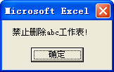
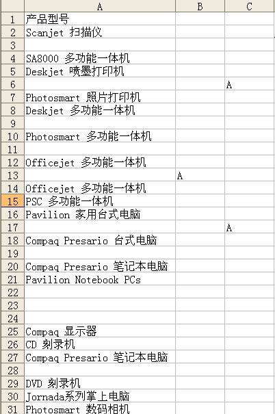
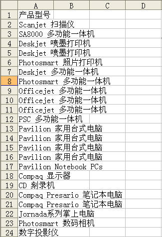

## 21、引用工作表的方式

VBA 中，在不同的工作表之间转换或者对不同工作表中的单元格区域进行操作时，需要指定引用的工作表，通常有下面几种方法：

### 1）使用工作表的名称

工作表名称是指显示在工作表标签中的文本，工作表名称可以使用 WorkSheets 集合和 Sheets 集合两种引用方式，如下面的代码所示。

```vb
Sub ShActivate()
	Worksheets("sheet1").Activate
	Sheets("sheet1").Activate
End Sub
```

第 2、3 行代码都激活工作簿中名称为“sheet1”的工作表，激活后的“sheet1”工作表将成为活动工作表。

WorkSheets 集合包含所有的工作表，而 Sheets 集合不仅包含工作表集合 WorkSheets，还包含图表集合 Charts、宏表集合 Excel4MacroSheets 与 MS Excel 5.0 对话框集合 DialogSheets 等。

任何时刻工作簿中只有一个工作表是活动工作表。

### 2）使用工作表的索引号

工作表索引号是指工作表在工作簿中的位置，Excel 根据工作表在工作表标签中的位置以 1 开始从左向右进行编号。下面的代码选中并激活当前工作簿中第 1 个工作表：

```vb
Sub ShIndex()
	Worksheets(1).Select
End Sub
```

单个 WorkSheet 对象的 Select 方法与 Activate 方法的主要区别在于 Select 方法要求工作表可视。

::: tip 注意

当工作簿包括工作表、宏表、图表等时，使用索引号引用工作表如 Sheets(1) 与 WorkSheets(1) 引用的可能不是同一个表。

:::

使用 Worksheet 对象的 Index 属性可以返回工作表的索引号，如下面的代码所示。

```vb
Sub ShInde()
	MsgBox Worksheets("sheet1").Index
End Sub
```

### 3）使用工作表的代码名称

使用 Worksheet 对象的 CodeName 属性可以返回工作表的代码名称，如下面的代码所示。

```vb
Sub ShCodeName()
	MsgBox Sheets(1).CodeName
End Sub
```

工作表的代码名称显示在 VBE 工程资源管理器窗口中，在属性窗口中能够修改工作表代码名称，如图 21-1 所示。在 VBA 中能够直接使用工作表的代码名称引用工作表，即使工作表的名称被修改，代码仍然能够正常运行。

::: center


<u>图 21-1</u>	工作表的代码名称

:::

### 4）使用 ActiveSheet 属性引用活动工作表

使用 ActiveSheet 属性可以返回活动工作表，如下面的代码所示。

```vb
Sub ShActive()
	MsgBox ActiveSheet.Name
End Sub
```

ActiveSheet 属性应用于 AppActivate 对象、Window 对象和 Workbook 对象时，如果未给出对象识别符，返回活动工作簿中的活动工作表。

## 22、选择工作表的方法

在 VBA 中需要激活或者选择某个工作表时使用 Select 方法或 Activate 方法，如下面的代码所示。

```vb
Sub SelectSh()
	Worksheets("Sheet2").Select
End Sub
Sub ActivateSh()
	Worksheets("Sheet2").Activate
End Sub
```

代码解析：

SelectSh 过程使用 Select 方法选择“Sheet2”工作表，而 ActivateSh 过程则使用 Activate 方法选择“Sheet2”工作表，从表面看两者的作用是相同的，但是如果“Sheet2”工作表是隐藏的，Activate 方法可以正常运行，而 Select 方法将会出现错误，如图 22-1 所示。

::: center


<u>图 22-1</u>	Select 方法无效提示

:::

如果需要同时选中工作簿中的所有工作表，则只能使用 Select 方法而不能使用 Activate 方法，如下面的代码所示。

```vb
Sub SelectShs()
	Dim Shs As Worksheet
	For Each Shs In Worksheets
		Shs.Select False
	Next
End Sub
Sub SelectSheets()
	Worksheets.Select
End Sub
Sub ArraySheets()
	Worksheets(Array(1, 2, 3)).Select
End Sub
```

代码解析：

SelectShs 过程遍历工作表并使用带参数的 Select 方法选中所有工作表。应用于 Worksheet 对象的 Select 方法的语法如下：

```vb
Select(Replace)

参数Replace是可选的。
如果该值为True，则用指定对象替代当前选定对象。
如果该值为False，则延伸当前选定对象以包括任何以前选定的对象。
```

SelectSheets 过程使用 Worksheets 集合的 Select 方法选中集合中所有的对象。

ArraySheets 过程使用 Array 函数返回工作簿中的前三张工作表并使用 Worksheets 集合的 Select 方法选中前三张工作表。

## 23、遍历工作表的方法

在 Excel 应用中经常需要遍历工作簿中所有的工作表，有以下两种方法可以实现。

### 1）使用 For...Next 语句

使用 For...Next 语句遍历工作簿中所有的工作表，如下面的代码所示。

```vb
Sub ShCount1()
	Dim c As Integer
	Dim i As Integer
	Dim s As String
	c = Worksheets.Count
	For i = 1 To c
		s = s & Worksheets(i).Name & Chr(13)
	Next
	MsgBox "工作簿中含有以下工作表:" & Chr(13) & s
End Sub
```

代码解析：

ShCount1 过程使用 For...Next 语句遍历工作簿中所有的工作表，并用消息框显示所有的工作表名称。
第 5 行代码根据 Worksheets 对象的 Count 属性返回工作簿中工作表的数量赋给变量 c。应用于Worksheets 对象的 Count 属性返回 Worksheets 集合中工作表的数量，语法如下：

```vb
expression.Count
```

第 6 行代码开始 For...Next 语句循环。For...Next 语句以指定次数来重复执行一组语句，语法如下：

```vb
For counter = start To end [Step step]
	[statements]
	[Exit For]
	[statements]
Next [counter]

参数counter是必需的，用做循环计数器的数值变量。
参数start是必需的，循环计数器的初值。
参数end是必需的，循环计数器的终值。
参数step是可选的，环计数器的步长，缺省值为1。
参数statements是可选的，放在For和Next之间的一条或多条语句，它们将被执行指定的次数。
```


第 7 行代码在 For...Next 循环中根据工作表的索引号取得所有工作表的名称赋给字符串变量 s。

运行 ShCount 过程结果如图 23-1 所示。

::: center


<u>图 23-1</u>	取得所有工作表名称

:::

### 2）使用 For Each...Next 语句

使用 For Each...Next 语句遍历工作簿中所有的工作表，如下面的代码所示。

```vb
Sub ShCount2()
	Dim Sh As Worksheet
	Dim s As String
	For Each Sh In Worksheets
		s = s & Sh.Name & Chr(13)
	Next
	MsgBox "工作簿中含有以下工作表:" & Chr(13) & s
End Sub
```

代码解析：

ShCount2 过程使用 For Each...Next 语句遍历工作簿中所有的工作表，并用消息框显示所有工作表名称。

第 4 行代码使用 For Each...Next 语句遍历 Worksheets 集合中所有元素。For Each...Next 语句针对一个数组或集合中的每个元素，重复执行一组语句，语法如下：

```vb
For Each element In Group
	[statements]
	[Exit For]
	[statements]
Next [element]

参数element是必需的，用来遍历集合或数组中所有元素的变量。
参数group是必需的，对象集合或数组的名称。
参数statements是可选的，针对对象集合或数组中的每一项执行的一条或多条语句。
```

第 5 行代码将返回的工作表的名称赋给字符串变量s。

运行 ShCount2 过程结果如图 23-1 所示。

## 24、在工作表中上下翻页

如果需要在工作簿的工作表中进行上下翻页，可以使用下面的代码。

```vb
Sub DownSheet()
	Dim i As Integer
	i = Worksheets.Count
	If ActiveSheet.Index < i Then
		Worksheets(ActiveSheet.Index + 1).Activate
	Else
		Worksheets(1).Activate
	End If
End Sub
Sub UpSheet()
	Dim i As Integer
	i = Worksheets.Count
	If ActiveSheet.Index > 1 Then
		Worksheets(ActiveSheet.Index - 1).Activate
	Else
		Worksheets(i).Activate
	End If
End Sub
```

代码解析：

DownSheet 过程向下翻页，第 3、12 行代码使用 Worksheets 对象的 Count 属性取得工作表的数目，第 4 行到第 7 行代码根据 Index 属性判断活动工作表是否是工作簿中的最后一张工作表。如果活动工作表不是最后一张工作表则激活活动工作表的下一张工作表，否则激活第一张工作表。

UpSheet 过程向上翻页，第 13 行到第 16 行代码根据 Index 属性判断活动工作表是否是工作簿中的第一张工作表。如果活动工作表不是第一张工作表则激活活动工作表的上一张工作表，否则激活最后一张工作表。

## 25、工作表的添加与删除

在工作簿中添加工作表使用 Add 方法，如下面的代码所示。

```vb
Sub Addsh()
	Dim Sh As Worksheet
	With Worksheets
		Set Sh = .Add(after:=Worksheets(.Count))
		Sh.Name = "数据"
	End With
End Sub
```

代码解析：

Addsh 过程使用 Add 方法在工作簿中新建“数据”工作表。

第 2 行代码声明变量 Sh 为工作表对象。

第 4 行代码使用 Add 方法在工作簿的最后新建“数据”工作表。

Add 方法应用于 Sheets 和 Worksheets 对象时新建工作表、图表或宏表，语法如下：

```vb
expression.Add(Before, After, Count, Type)

参数Before是可选的，指定工作表对象，新建的工作表将置于此工作表之前。
参数After是可选的，指定工作表对象，新建的工作表将置于此工作表之后。
如果Before和After两者均省略，则新建的工作表将插入到活动工作表之前。
参数Count可选，要新建的工作表的数目。默认值为1。
参数Type可选，指定新建的工作表类型。
```

第 5 行代码将添加的工作表重命名为“数据”。

如果需要在工作簿中批量添加工作表，可以使用下面的代码。

```vb
Sub Addsh_2()
	Dim i As Integer
	Dim sh As Worksheet
	For i = 1 To 10
		Set sh = Sheets.Add(after:=Sheets(Sheets.Count))
		sh.Name = i
	Next
End Sub
```

代码解析：

Addsh_2 过程使用 For...Next 语句和 Add 方法在工作簿中添加 10 张工作表并将添加的工作表依次重命名。

在使用以上代码往工作簿中添加工作表时，如果工作簿中已存在相同名称的工作表，运行时会发生错误，代码中断，如图 25-1 所示。

::: center


<u>图 25-1</u>	运行错误提示

:::

为了避免此错误的发生，可以在添加前先删除所有的工作表，如下面的代码所示。

```vb
Sub Delsh()
	Dim sh As Worksheet
	For Each sh In ThisWorkbook.Sheets
		If sh.Name <> "工作表的添加与删除" Then
			Application.DisplayAlerts = False
			sh.Delete
			Application.DisplayAlerts = True
		End If
	Next
End Sub
```

代码解析：

Delsh 过程使用 Delete 方法删除工作簿中除了“工作表的添加与删除”工作表以外所有的工作表。

第 3 行代码使用 For Each...Next 语句遍历代码所在工作簿中所有的工作表。

第 4 行到第 7 行代码判断工作表名称是否为“工作表的添加与删除”，如果不是则使用 Delete 方法删除。其中第 5 行代码将 Application 对象的 DisplayAlerts 属性设置为 False，使删除时不显示如图 25-2 所示系统警告对话框。

::: center


<u>图 25-2</u>	系统警告对话框

:::

第 6 行代码使用 Delete 方法删除工作表，应用于工作表对象的 Delete 方法删除指定的对象，语法如下：

```vb
expression.Delete

参数expression是必需的，该表达式返回“应用于”列表中的对象之一。
```

在运行添加工作表代码前先删除工作簿中的工作表虽然可以避免同名错误，但也可能误删除有用的工作表，因此更为严谨的方法是在添加前先判断工作簿中是否存在相同名称的工作表，然后再进行下一步的操作。

对于单张工作表可以使用下面的代码。

```vb
Sub Addsh_3()
	Dim Sh As Worksheet
	For Each Sh In Worksheets
		If Sh.Name = "数据" Then
			MsgBox "工作簿中已有""数据""工作表,不能重复添加!"
			Exit Sub
		End If
	Next
	With Worksheets
		Set Sh = .Add(after:=Worksheets(.Count))
		Sh.Name = "数据"
	End With
End Sub
```

代码解析：

Addsh_3 过程在使用 Add 方法在工作簿中新建“数据”工作表时首先判断工作簿中是否存在“数据”工作表，如果已存在“数据”工作表则不运行添加工作表的代码而只显示一个消息框进行提示，如图 25-3 所示。

::: center


<u>图 25-3</u>	工作表同名提示

:::

还可以使用错误处理语句来绕过错误，如下面的代码所示。

```vb
Sub Addsh_4()
	Dim sh As Worksheet
	On Error GoTo line
	With Worksheets
		Set sh = .Add(after:=Worksheets(.Count))
		sh.Name = "数据"
	End With
	Exit Sub
line:
	MsgBox "工作簿中已有""数据""工作表,不能重复添加!"
	Application.DisplayAlerts = False
	Worksheets(Worksheets.Count).Delete
	Application.DisplayAlerts = True
End Sub
```

代码解析：

Addsh_4 过程是先使用 Add 方法在工作簿中新建“数据”工作表，如果工作簿中已存在同名的工作表则使用 GoTo 语句转移到指定的 line 行处进行提示并删除已添加还没有重命名的工作表，也就是工作簿中最后一张工作表。

如果是批量添加工作表，使用上述方法时，添加工作表和已有工作表重名时，后面即使没有重名的工作表也不能添加，所以应先使用错误处理语句忽略错误，待全部添加好以后再删除多余的工作表，如下面的代码所示。

```vb
Sub Addsh_5()
	Dim i As Integer, arr
	Dim sh As Worksheet
	On Error Resume Next
	arr = Array(1, 2, 3, 4, 5, 6, 7, 8, 9, 10)
	For i = 0 To UBound(arr)
		With Worksheets
			Set sh = .Add(after:=Sheets(.Count))
			sh.Name = arr(i)
		End With
	Next
	Application.DisplayAlerts = False
	For Each sh In Worksheets
		If sh.Name Like "Sheet*" Then sh.Delete
	Next
	Application.DisplayAlerts = True
End Sub
```

代码解析：

Addsh_5 过程使用 Add 方法在工作簿中添加 10 张工作表并重新命名为 1 到 10，如果工作簿中已有相同名称的工作表则不添加。

第 4 行代码错误处理语句，当发生重名错误时忽略错误，继续添加工作表。

第 5 行到第 11 行代码在工作簿中添加 10 张工作表并重新命名为 1 到 10，如果工作簿中已有相同名称的工作表则忽略错误重命名时发生的错误，此时工作簿中添加的工作表会以系统赋与的名称命名，如“Sheet1”。

第 12 行到第 15 行代码使用 For Each...Next 语句遍历工作簿中所有的工作表，将工作簿中凡是以“Sheet”开头的工作表删除。

## 26、禁止删除指定工作表

在工作表事件中是没有工作表删除事件的，为了防止用户误删除重要的工作表，除了使用保护工作簿方法外，还可以使用下面的代码。

```vb
Public Ctl As CommandBarControl
Sub DelSht()
	Set Ctl = Application.CommandBars.FindControl(ID:=847)
	Ctl.OnAction = "MyDelSht"
End Sub
Sub ResSht()
	Set Ctl = Application.CommandBars.FindControl(ID:=847)
	Ctl.OnAction = ""
End Sub
Sub MyDelSht()
	If VBA.UCase$(ActiveSheet.CodeName) = "SHEET2" Then
		MsgBox "禁止删除" & ActiveSheet.Name & "工作表!"
	Else
		ActiveSheet.Delete
	End If
End Sub
```

代码解析：

DelSht 过程将工作表标签右键菜单中的“删除工作表”菜单的 OnAction 属性设置为“MyDelSht”。

第 3 行代码使用 Set 语句将工作表标签右键菜单中的“删除工作表”菜单赋给变量 Ctl，并将其 OnAction 属性设置为 MyDelSht 过程，该菜单被单击时将运行“MyDelSht”过程而不是系统默认的设置。OnAction 属性返回或设置一个 VBA 的过程名，该过程在用户单击或更改某命令栏控件的值时运行。

ResSht 过程将工作表标签右键菜单中的“删除工作表”菜单的 OnAction 属性恢复为默认设置。

MyDelSht 过程判断所要删除的工作表的代码名称是否是“SHEET2”，如果是则禁止删除该表而只显示一个提示消息框。

为了不影响其他工作簿的使用，在 VBE 中双击 ThisWorkbook 写入下面的代码。

```vb
Private Sub Workbook_Activate()
	Call DelSht
End Sub
Private Sub Workbook_Deactivate()
	Call ResSht
End Sub
```

代码解析：

工作簿的 Activate 事件和 Deactivate 事件代码，在工作簿激活时运行 DelSht 过程，在关闭或打开其他工作簿时运行 ResSht 过程，这样只禁止删除本工作簿中“SHEET2”工作表，并不影响其他工作簿。

当删除本工作簿中的“SHEET2”工作表时，并不会显示如图 26-1 所示的消息框，而只会显示如图 26-2 所示的禁止删除工作表的消息框。

::: center


<u>图 26-1</u>	工作表同名提示



<u>图 26-2</u>	禁止删除工作表

:::

## 27、自动建立工作表目录

如果在工作簿中有许多工作表，使用时往往会建立一张目录表并插入超链接以方便选择工作表。但是如果工作簿中的工作表经常添加和删除，使用手工建立目录很不方便，此时可以使用工作表的 Activate 事件自动建立工作表的目录，如下面的代码所示。

```vb
Private Sub Worksheet_Activate()
	Dim sh As Worksheet
	Dim a As Integer
	Dim R As Integer
	R = Sheet1.[A65536].End(xlUp).Row
	a = 2
	If Sheet1.Cells(2, 1) <> "" Then
		Sheet1.Range("A2:A" & R).ClearContents
	End If
	For Each sh In Worksheets
		If sh.CodeName <> "Sheet1" Then
			Sheet1.Cells(a, 1).Value = sh.Name
			a = a + 1
		End If
	Next
End Sub
```

代码解析：

工作表的 Activate 事件，在“目录”工作表激活时自动建立工作簿中除“目录”工作表外所有工作表的目录。

第 2、3、4 行代码声明变量类型。

第 5 行代码取得A列最后非空单元格的行号。

第 6 行代码设置变量 a 的初始值为 2，从 `A2` 单元格开始建立工作表目录。

第 7 行到第 9 行代码判断是否存在工作表目录，如果存在先清空原来的目录，以便更新目录。

第 10 行到第 15 代码遍历工作簿的所有工作表，将除“目录”工作表外所有工作表的名称写入到 A 列单元格中。

为了建立到各工作表的链接，使用工作表的 SelectionChange 事件，如下面的代码所示。

```vb
Private Sub Worksheet_SelectionChange(ByVal Target As Range)
	Dim R As Integer
	R = Sheet1.[A65500].End(xlUp).Row
	On Error Resume Next
	If Target.Count = 1 Then
		If Target.Column = 1 Then
			If Target.Row > 1 And Target.Row <= R Then
				Sheets(Target.Value).Select
			End If
		End If
	End If
End Sub
```

代码解析：

工作表的 SelectionChange 事件，当选择 A 列工作表目录中工作表名称时自动选择该单元格所对应的工作表。

第 5、6、7 行代码限制该事件触发的条件。

第 8 行代码选择单元格所对应的工作表。

“目录”工作表激活后自动在 A 列建立工作簿中除“目录”工作表以外所有表的目录，如图 27-1 所示。

::: center


<u>图 27-1</u>	自动建立工作表目录

:::

## 28、工作表的深度隐藏

在使用 VBA 开发的工作簿文件完成交与用户使用后，我们往往希望用户在打开工作簿时启用宏，此时除了使用“禁用宏则关闭工作簿”的功能外，还可以隐藏所有有数据的工作表，如果用户在打开工作簿时禁用宏则只显示一张空白的工作表，达到强制启用宏的效果，代码如下：

```vb
Dim sh As Worksheet
Private Sub Workbook_BeforeClose(Cancel As Boolean)
	Sheet1.Visible = True
	For Each sh In ThisWorkbook.Sheets
		If sh.Name <> "空白" Then
			sh.Visible = xlSheetVeryHidden
		End If
	Next
	ActiveWorkbook.Save
End Sub
Private Sub Workbook_Open()
	For Each sh In ThisWorkbook.Sheets
		If sh.Name <> "空白" Then
			sh.Visible = xlSheetVisible
		End If
	Next
	Sheet1.Visible = xlSheetVeryHidden
End Sub
```

代码解析：

第 2 行到第 10 行代码是工作簿的 BeforeClose 事件过程，在工作簿关闭前隐藏除“空白”表以外的所有的工作表。

第 3 行代码将“空白”表的 Visible 属性设置为 True，使其可见。

应用于 Charts 和 Worksheets 对象的 Visible 属性决定对象是否可见，语法如下：

```vb
expression.Visible

参数expression是必需的，该表达式返回上面的对象之一。
```

Visible 属性可以设置为表格 28-1 所示的 XlSheetVisibility 常量之一。

<u>表格 28-1</u>	XlSheetVisibility 常量

| 常量              |      | 描述                                                         |
| ----------------- | ---- | ------------------------------------------------------------ |
| xlSheetHidden     | 0    | 隐藏对象，可以通过“格式”→“工作表”→“取消隐藏”菜单使对象重新可见，等同于设置为False。 |
| xlSheetVisible    | -1   | 使对象重新可见，等同于设置为True。                           |
| xlSheetVeryHidden | 2    | 隐藏对象，使该对象重新可见的唯一方法是将此属性设置为True或xlSheetVisible。 |

第 4 行到第 8 行代码使用 For Each...Next 语句遍历工作簿中所有的工作表，将除“空白”表以外的所有工作表的 Visible 属性设置为 xlSheetVeryHidden，使之隐藏。

Visible 属性设置为 xlSheetVeryHidden 后工作表不能通过“格式”→“工作表”→“取消隐藏”菜单来显示隐藏的工作表。

第 9 行代码使用 Save 方法保存代码所在工作簿的更改，在关闭工作簿时不显示如图 28-1 所示的消息框。

::: center


<u>图 28-1</u>	工作簿保存提示

:::

第 10 行到第 18 行代码是工作簿的 Open 事件过程，在打开工作簿时将除“空白”表以外的所有工作表的 Visible 属性设置为 xlSheetVisible，取消隐藏。如果打开工作簿时禁用宏，则工作簿中除了“空白”表以外，其他的工作表还处于深度隐藏的状态，如图 28-2 所示，这样就达到强制用户启用宏的效果，当然这还需要 VBA 工程保护的配合。

::: center


<u>图 28-2</u>	工作簿保存提示

:::

## 29、防止更改工作表的名称

工作表的名称显示在工作表标签上，除了在相应的功能菜单中可以对其进行重命名操作外，在工作表标签上双击鼠标也能修改工作表名称。一旦修改了工作表名称，可能就会产生一连串的问题，例如在其他工作簿中对该工作表的引用将会失效，通过工作表名称引用工作表的代码也将出错。

Excel 没有提供修改工作表名称的相关事件，要禁止用户修改工作表名称，需采取其他一些技巧。比如在工作表 BeforeClose 事件中检验工作表名称，如果工作表名称不是指定的字符串，则将其修改为指定字符串，即保持工作表名称不变，代码如下。

```vb
Private Sub Workbook_BeforeClose(Cancel As Boolean)
	If Sheet1.Name <> "Excel Home" Then Sheet1.Name = "Excel Home"
	ThisWorkbook.Save
End Sub
```

代码解析：

工作簿的 BeforeClose 事件过程，在关闭当前工作簿时判断 Sheet1 工作表名称，如果不是指定的字符串“Excel Home”，则将其恢复为“Excel Home”后保存工作簿，从而避免更改 Sheet1 工作表名称。

## 30、工作表中一次插入多行

在工作表的中插入多行空行，需要使用 Insert 方法，如下面的代码所示。

```vb
Sub InSertRows_1()
	Dim i As Integer
	For i = 1 To 3
		Sheet1.Rows(3).Insert
	Next
End Sub
```

代码解析：

InSertRows_1 过程使用 Insert 方法在如图 30-1 所示的数据区域的第 2 行和第 3 行之间插入三行空行。

::: center


<u>图 30-1</u>	数据区域

:::

Insert 方法应用于 Range 对象时在工作表或宏表中插入一个单元格或单元格区域，其他单元格作相应移位以腾出空间，语法如下：

```vb
expression.Insert(Shift, CopyOrigin)

参数expression是必需的，该表达式返回一个Range对象。
参数Shift是可选的，指定单元格的移动方向。可为以下XlInsertShiftDirection常量之一：xlShiftToRight或xlShiftDown。如果省略本参数，Microsoft Excel将依据该区域的形状决定移动方向。
参数CopyOrigin是可选的，复制的起点。
```

还可以使用引用多行的方法，如下面的代码所示。

```vb
Sub InSertRows_2()
	Sheet2.Range("A3").EntireRow.Resize(3).Insert
End Sub
```

代码解析：

InSertRows_2 过程通过引用多行区域的方法实现一次插入多行。

第 2 行代码中的 Range(“A3”).EntireRow 属性返回 Range(“A3”) 单元格所在的一整行，然后使用 Resize 属性调整行数后插入三行空行。

也可以直接指定相应行再调整行数后插入空行，如下面的示例代码：

```vb
Sub InSertRows_3()
	Sheet3.Rows(3).Resize(3).Insert
End Sub
```

运行以上过程，工作表中如图 30-2 所示。

::: center


<u>图 30-2</u>	插入三行空行

:::

## 31、删除工作表中的空行

如果需要删除如图 31-1 所示的工作表中所有的空行，可以使用下面的代码。

::: center



<u>图 31-1</u>	需删除空行的工作表区域

:::

```vb
Sub DelBlankRow()
	Dim rRow As Long
	Dim LRow As Long
	Dim i As Long
	rRow = Sheet1.UsedRange.Row
	LRow = rRow + Sheet1.UsedRange.Rows.Count - 1
	For i = LRow To rRow Step -1
		If Application.WorksheetFunction.CountA(Rows(i)) = 0 Then
			Rows(i).Delete
		End If
	Next
End Sub
```

代码解析：

DelBlankRow 过程删除工作表中已使用的区域的所有空行。

第 5 行代码获得工作表中已使用区域的首行行号，其中使用 UsedRange 属性返回工作表中已使用的区域。

第 6 行代码获得工作表中已使用区域的最后一行行号。

第 7 行到第 11 行代码从最大行数至最小行数循环判断指定行是否为空行，若为空行则删除该行。

::: tip 注意

此处一定要从最大行数至最小行数开始循环判断，因为如果工作表中存在两行及两行以上的相邻空行，从最小行数开始循环删除的话，当第一行空行被删除后，被删除行下面的一行会往上移位，而此时 For...Next 循环的计数器已经加 1，所以会出现漏删除的现象。

:::

其中第 8、9 行代码使用工作表 CountA 函数判断当前行已使用单元格的数量，如果为零说明此行是空行则使用 Delete 删除。

应用于 Range 对象的 Delete 方法删除对象，语法如下：

```vb
expression.Delete(Shift)

参数expression是必需的，返回一个Range对象。
参数Shift是可选的，指定删除单元格时替补单元格的移位方式。可为以下 XlDeleteShiftDirection常量之一：xlShiftToLeft或xlShiftUp。如果省略该参数，则Microsoft Excel将根据区域的图形决定移位方式。
```

运行 DelBlankRow 过程工作表区域如图 31-2 所示。

::: center


<u>图 31-2</u>	删除空行的工作表区域

:::

## 32、删除工作表的重复行

在实际应用中，可能需要删除如图 32-1 所示的工作表中 A 列的重复内容而只保留一行，那么可以借助工作表 CountIf 函数来完成，如下面的代码所示。

::: center



<u>图 32-1</u>	需删除重复行的工作表区域

:::

```vb
Sub DeleteRow()
	Dim R As Integer
	Dim i As Integer
	With Sheet1
		R = .[a65536].End(xlUp).Row
		For i = R To 1 Step -1
			If WorksheetFunction.CountIf(.Columns(1), .Cells(i, 1)) > 1 Then
				.Rows(i).Delete
			End If
		Next
	End With
End Sub
```

代码解析：

DeleteRow 过程删除工作表 A 列重复单元格所在的整行内容，只保留一行。

第 5 行代码取得工作表中 A 列的最后一个非空单元格的行号。

第 6 行到第 10 行代码从最大行数至最小行数循环判断A列单元格内容是否重复并删除重复单元格所在的整行。此处 For...Next 循环也要从最大行数至最小行数开始循环判断，否则可能会删除不净。其中第 7、8 行代码使用工作表 CountIf 函数判断单元格内容是否重复，如果重复则删除该单元格所在的行。

运行 DeleteRow 过程工作表区域如图 32-2 所示。

::: center


<u>图 32-2</u>	删除重复行的工作表区域

:::

## 33、定位删除特定内容所在的行

如果需要删除如图 33-1 所示的工作表区域中特定内容所在的行，可以使用定位的方法快速删除，无需使用 For...Next 循环对单元格逐个进行判断。

::: center


<u>图 33-1</u>	需删除的工作表区域

:::

示例代码如下：

```vb
Sub SpecialDelete()
	Dim R As Integer
	With Sheet1
		R = .Range("a65536").End(xlUp).Row
		.Range("a2:a" & R).Replace "Excel", "", 2
		.Columns(1).SpecialCells(4).EntireRow.Delete
	End With
End Sub
```

代码解析：

SpecialDelete 过程删除工作表A列单元格中显示为“Excel”的行。

第 5 行代码使用 Replace 方法将工作表A列中显示为“Excel”的单元格内容替换成空白。

第 6 行代码使用 SpecialCells 方法定位到工作表 A 列中所有的空单元格，使用 Range 对象的 EntireRow 属性返回其所在的整个行一次性删除。

运行 SpecialDelete 过程工作表区域如图 33-2 所示。

::: center


<u>图 33-2</u>	删除后的工作表区域

:::

## 34、判断是否选中整行

通过当前选择的单元格区域的单元格数目与行数或列数相比较，判断用户是否选中了整行或整列，如下面的代码所示。

```vb
Private Sub Worksheet_SelectionChange(ByVal Target As Range)
	If Target.Rows.Count = 1 Then
		If Target.Columns.Count = 256 Then
			MsgBox "您选中了整行,当前行号" & Target.Row
		End If
	End If
End Sub
```

代码解析：

工作表的 SelectionChange 事件，判断用户是否选中了工作表中一整行单元格区域。

第 2 行代码中的 Target.Rows.Count 返回目标区域的行数，确定用户当前选择区域的总行数是否为 1。

第 3 行代码中的 Target.Columns.Count 返回目标区域的列数，确定用户当前选择区域总列数是否为 256。

第 4 行代码当用户选中一整行时显示一个消息框，提示用户当前选择的行号，如图 34-1 所示。

::: center


<u>图 34-1</u>	判断用户是否选中整行

:::

如果需要判断是否选中了整列，只需将上面代码中的总行数修改为 65536，总列数修改为 1。

## 35、限制工作表的滚动区域

如果希望限制工作表中滚动的区域，可以通过设置 WorkSheet 对象的 ScrollArea 属性来实现。 ScrollArea 属性使用以A1样式的区域引用形式（字符串类型）返回或设置工作表允许滚动的区域。当设置了工作表滚动区域之后，用户不能选定滚动区域之外的单元格，但仍然可以选定区域之外的其他对象（例如图形、按钮等），同时工作表的一些相应功能可能被禁止（例如工作表全选、选中整行或整列等）。

在 VBE 中的工程管理窗口选择相应工作表对象，然后在其属性窗口中设置 ScrollArea 属性，即可限制工作表中滚动的区域，如图 35-1 所示。

::: center


<u>图 35-1</u>	设置 ScrollArea 属性

:::

但是 Excel 不会记忆该项设置，当再次打开该工作簿时，ScrollArea 属性将被重置，用户必须重新设置 ScrollArea 属性才能限制工作表中的滚动区域，解决方法是使用代码在工作簿打开时对 ScrollArea 属性进行设置，如下面的代码所示。

```vb
Private Sub Workbook_Open()
	Sheet1.ScrollArea = "B4:H12"
End Sub
```

代码解析：

工作簿的 Open 事件，在打开该工作簿时设置 Sheet1 工作表的滚动区域为“B4:H12”单元格区域。

如果需要取消滚动区域的限制，可以将 ScrollArea 属性值设置为空，如下面的代码所示。

```vb
Sheet1.ScrollArea = ""
```

## 36、复制自动筛选后的数据区域

用户在对如图 36-1 所示的数据列表进行自动筛选后，往往希望将自动筛选的结果复制到其它地方。

::: center


<u>图 36-1</u>	筛选结果

:::

这时可以通过获取该列表区域中可见单元格的方法得到筛选结果的单元格区域，并复制到工作表 Sheet2 中，如下面的代码所示。

```vb
Sub CopyFilter()
	Sheet2.Cells.Clear
	With Sheet1
		If .FilterMode Then
			.AutoFilter.Range.SpecialCells(12).Copy Sheet2.Cells(1, 1)
		End If
	End With
End Sub
```

代码解析：

CopyFilter 过程将 Sheet1 表中的筛选结果复制到工作表 Sheet2 中。

第 2 行代码清除 Sheet2 表中数据。

第 4 行代码判断 Sheet1 表是否处于自动筛选状态。FilterMode 属性返回工作表是否处于筛选模式，如果指定工作表中包含已筛选序列且该序列中含有隐藏行，则该值为 True。

第 5 行代码通过 AutoFilter 对象的 Range 属性返回工作表的自动筛选列表区域，再使用 SpecialCells 方法获取该列表区域中可见单元格，得到筛选结果的单元格区域，然后使用 Copy 方法将结果区域复制到工作表 Sheet2 中，应用于 Range 对象的 Copy 方法将单元格区域复制到指定的区域或剪贴板中，语法如下：

```vb
expression.Copy(Destination)

参数expression是必需的，该表达式返回一个Range对象。
参数Destination是可选的，指定区域要复制到的目标区域。如果省略该参数，则将该区域复制到剪贴板中。
```

运行 CopyFilter 过程工作表 Sheet2 如图 36-2 所示。

::: center


<u>图 36-2</u>	复制筛选区域

:::

## 37、使用高级筛选获得不重复记录

在如图 37-1 所示的数据列表中，如果要将其中不重复的记录复制到另一工作表中，则可以通过高级筛选功能实现。

::: center


<u>图 37-1</u>	数据列表

:::

示例代码如下：

```vb
Sub Filter()
	Sheet1.Range("A1").CurrentRegion.AdvancedFilter _
		Action:=xlFilterCopy, Unique:=True, _
		CopyToRange:=Sheet2.Range("A1")
End Sub
```

代码解析：

Filter 过程使用 AdvancedFilter 方法对单元格 `A1` 的当前区域筛选不重复的记录，并将筛选结果复制到工作表 Sheet2 中。应用于 Range 集合的 AdvancedFilter 方法语法如下：

```vb
AdvancedFilter(Action, CriteriaRange, CopyToRange, Unique)

参数Action是必需的，可以为表格37-1所列的XlFilterAction常量之一。
参数CriteriaRange指定高级筛选操作的条件区域，缺省时表示没有条件限制。
参数CopyToRange表示指定被复制行的目标区域，仅当Action为xlFilterCopy时有效，否则忽略本参数。
参数Unique指示是否选择不重复的记录，如果其值为True，则重复出现的记录仅保留一条；如果其值为False（默认值），则筛选出所有符合条件的记录。
```

表格 37-1	XlFilterAction 常量

| XlFilterAction 常量 | 值   | 描述                     |
| ------------------- | ---- | ------------------------ |
| xlFilterCopy        | 2    | 将筛选结果复制到其他位置 |
| xlFilterInPlace     | 1    | 在原有区域显示筛选结果   |

运行 FilterUnique 过程，结果如图 37-2 所示。

::: center


<u>图 37-2</u>	得到不重复记录结果

:::

## 38、工作表的保护与解除保护

在实际应用中，Excel 编制的报表、表格、程序等，往往在单元格中设置了公式、函数、自定义格式等，为了防止在使用过程中修改或无意中修改这些设置，一般使用 Excel 的工作表保护功能来保护这些设置。

但是程序中可能会使用代码对受保护的工作表进行操作，此时如果没有解除工作表保护，运行出现错误，如图 38-1 所示。

::: center


<u>图 38-1</u>	运行错误提示

:::

解决方法是在运行操作工作表的代码前先使用代码解除工作表保护，待操作完毕后再保护工作表，如下面的代码所示。

```vb
Sub ShProtect()
	With Sheet1
		.Unprotect Password:="12345"
		.Cells(1, 1) = 100
		.Protect Password:="12345"
	End With
End Sub
```

代码解析：

ShProtect 过程在受保护的工作表中对单元格进行操作，其中第 3 行代码使用 Unprotect 方法解除工作表的保护。应用于 Worksheet 对象的 Unprotect 方法解除工作表的保护，如果工作表不是受保护的，则此方法不起作用，所以在解除之前无需判断工作表是否受保护，其语法如下：

```vb
expression.Unprotect(Password)

参数expression是必需的，该表达式返回一个Worksheet 对象。
参数Password是可选的，指定用于解除工作表的保护的密码，此密码是区分大小写的。
```

第 4、5 行代码在单元格录入数据后使用 Protect 方法重新保护工作表。应用于 Worksheet 对象的 Protect 方法保护工作表使其不至被修改，语法如下：

```vb
expression.Protect(Password, DrawingObjects, Contents, Scenarios, UserInterfaceOnly, AllowFormattingCells, AllowFormattingColumns, AllowFormattingRows, AllowInsertingColumns, AllowInsertingRows, AllowInsertingHyperlinks, AllowDeletingColumns, AllowDeletingRows, AllowSorting, AllowFiltering, AllowUsingPivotTables) 

参数expression是必需的，该表达式返回一个Worksheet对象。
参数Password是可选的，为一个字符串，该字符串为工作表指定区分大小写的密码。
其他参数都是可选参数，其功能等同于如图38-2所示的工作表保护对话框中的各项选项，具体请参阅VBA帮助。
```

::: center


<u>图 38-2</u>	工作表保护选项

:::

如果一个 Excel 文件使用时间过长，忘记了工作表保护时设置的密码，那么也可以使用 VBA 解除工作表的保护，代码如下：

```vb
Sub RemoveShProtect()
	Dim i1 As Integer, i2 As Integer, i3 As Integer
	Dim i4 As Integer, i5 As Integer, i6 As Integer
	Dim i7 As Integer, i8 As Integer, i9 As Integer
	Dim i10 As Integer, i11 As Integer, i12 As Integer
	On Error Resume Next
	If ActiveSheet.ProtectContents = False Then
		MsgBox "该工作表没有保护密码！"
		Exit Sub
	End If
	For i1 = 65 To 66: For i2 = 65 To 66: For i3 = 65 To 66
	For i4 = 65 To 66: For i5 = 65 To 66: For i6 = 65 To 66
	For i7 = 65 To 66: For i8 = 65 To 66: For i9 = 65 To 66
	For i10 = 65 To 66: For i11 = 65 To 66: For i12 = 32 To 126
		ActiveSheet.Unprotect Chr(i1) & Chr(i2) & Chr(i3) & Chr(i4) & Chr(i5) _
		& Chr(i6) & Chr(i7) & Chr(i8) & Chr(i9) & Chr(i10) & Chr(i11) & Chr(i12)
		If ActiveSheet.ProtectContents = False Then
			MsgBox "已经解除了工作表保护！"
			Exit Sub
		End If
	Next: Next: Next: Next: Next: Next
	Next: Next: Next: Next: Next: Next
End Sub
```

代码解析：

RemoveShProtect 过程解除工作表的保护。

其中第 7 行到第 10 行代码判断工作表是否受保护，ProtectContents 属性返回工作表的保护状态，如果工作表的内容处于保护状态，则该值为 True。

第 11 行到第 22 行代码使用 For...Next 语句和 Chr 函数来返回指定字符码所代表的字符串组合不断地尝试解除工作表保护，一旦工作表的 ProtectContents 属性返回 False 说明已经解除工作表保护。

## 39、奇偶页打印

在 Excel 中却没有提供打印奇数页和偶数页的功能，用户可以使用 VBA 在 Excel 中实现该功能，如下面的代码所示。

```vb
Sub PrintOddPage()
	Dim TotalPg As Integer
	TotalPg = ExecuteExcel4Macro("GET.DOCUMENT(50)")
	For i = 1 To TotalPg Step 2
		ActiveSheet.PrintOut From:=i, To:=i
	Next
End Sub
```

代码解析：

第 3 行代码使用 Excel 4.0 宏表函数获取总页数，通过该函数获取总页数而无需判断分页符。

第 4 行到第 6 行代码逐页打印所有奇数页，其中第 5 行代码中的参数 From 和 To 指定打印的开始页数和结束页数。

将第 4 行代码中的数值改为 2，则实现偶数页的打印。

