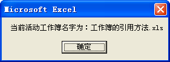

## 40、工作簿的引用方法

VBA 中，在不同的工作簿之间转换需要指定引用的工作簿，通常有下面几种方法。

### 1）使用工作簿的名称

工作簿名称是指 Excel 文件的文件名，可以使用 Workbooks 集合引用方式来引用工作簿，如下面的代码所示。

```vb
Sub WbPath ()
	MsgBox "名称为：" & Workbooks("工作簿的引用方法.xls").Path
End Sub
```

代码解析：

WbPath 过程显示工作簿“工作簿的引用方法”的路径。应用于 Workbook 对象的 Path 属性将完整路径返回给应用程序，语法如下：

```vb
expression.Path

参数expression是必需的，一个有效的对象。
```

运行 WbPath 过程结果如图 40-1 所示。

::: center


<u>图 40-1</u>	返回工作簿完整路径

:::

### 2）使用工作簿的索引号

工作簿索引号是指工作簿打开的顺序，Excel根据工作簿打开的顺序以1开始进行编号。下面的代码显示应用程序打开的第一个工作簿的名称。

```vb
Sub WbName()
	MsgBox "第一个打开的工作簿名字为：" & Workbooks(1).Name
End Sub
```

代码解析：

WbName 过程显示应用程序打开的第一个工作簿的名称。应用于 Workbook 对象的 Name 属性返回对象的名称，语法如下：

```vb
expression.Name

参数expression是必需的，一个有效的对象。
```

运行 WbName 过程结果如图 40-2 所示。

::: center


<u>图 40-2</u>	返回工作簿名称

:::

如果需要返回包含完整路径的工作簿名称则使用 Workbook 对象的 FullName 属性，如下面的代码所示。

```vb
Sub WbFullName()
	MsgBox "包括完整路径的工作簿名称为：" & Workbooks(1).FullName
End Sub
```

WbFullName 过程显示应用程序打开的第一个工作簿的完整路径和名称。FullName 属性返回对象的名称，包括其磁盘路径的字符串，此属性等价于在 Path 属性后加上当前文件系统的分隔符，然后加上 Name 属性。

运行 WbFullName 过程结果如图 40-3 所示。

::: center


<u>图 40-3</u>	返回包含完整路径的工作簿名称

:::

### 3）使用 ThisWorkbook

使用 ThisWorkbook 代表当前宏代码运行的工作簿，如下面的代码所示。

```vb
Sub WbClose()
	ThisWorkbook.Close SaveChanges:=False
End Sub
```

代码解析：

WbThis 过程使用 Close 方法关闭当前宏代码运行的工作簿，不保存对工作簿的任何更改。关于应用于 Workbook 对象的 Close 方法请参阅 45-1。

::: tip 注意

本属性仅可在 Microsoft Excel 内使用。不能使用此属性访问任何其他应用程序的工作簿。

:::

### 4）使用 ActiveWorkbook

使用 ActiveWorkbook 代表活动窗口（最上面的窗口）的工作簿，如下面的代码所示。

```vb
Sub WbActive()
	MsgBox "当前活动工作簿名字为：" & ActiveWorkbook.Name
End Sub
```

代码解析：

WbActive 过程显示活动工作簿的名称，ActiveWorkbook 属性返回一个 Workbook 对象，该对象代表活动窗口（最上面的窗口）的工作簿。如果没有打开任何窗口或者活动窗口为信息窗口或剪贴板窗口，则返回 Nothing。

运行 WbActive 过程结果如图 40-4 所示。

::: center



<u>图 40-4</u>	返回活动工作簿名称

:::

## 41、新建工作簿文件

在 VBA 中使用 Add 方法新建工作簿，如下面的代码所示。

```vb
Sub AddNowbook()
	Dim Nowbook As Workbook
	Dim ShName As Variant
	Dim Arr As Variant
	Dim i As Integer
	Dim myNewWorkbook As Integer
	myNewWorkbook = Application.SheetsInNewWorkbook
	ShName = Array("余额", "单价", "数量", "金额")
	Arr = Array("01月", "02月", "03月", "04月", "05月", "06月", "07月", "08月", "09月", "10月", "11月", "12月")
	Application.SheetsInNewWorkbook = 4
	Set Nowbook = Workbooks.Add
	With Nowbook
		For i = 1 To 4
			With .Sheets(i)
				.Name = ShName(i - 1)
				.Range("B1").Resize(1, UBound(Arr) + 1) = Arr
				.Range("A2") = "品名"
			End With
		Next
		.SaveAs Filename:=ThisWorkbook.Path & "\" & "存货明细.xls"
		.Close Savechanges:=True
	End With
	Set Nowbook = Nothing
	Application.SheetsInNewWorkbook = myNewWorkbook
End Sub
```

代码解析：

AddNowbook 过程使用 Add 方法建立新的工作簿并对新建工作簿进行操作。

第 2 行到第 6 行代码声明变量类型。

第 7 行代码保存 Excel 自动插入到新工作簿中的工作表数目。

第 8、9 行代码将数组元素赋值给变量。

第 10 行代码将 Application 对象的 SheetsInNewWorkbook 属性设置为 4，在新建工作簿时插入 4 张工作表。

第 11 行代码使用 Add 方法建立新的工作簿，应用于 Workbooks 对象的 Add 方法新建工作簿，新建的工作簿将成为活动工作簿。

第 12 行到第 22 行代码操作新建工作簿。其中第 15 行到第 17 行代码将新建工作簿的工作表进行重命名并给单元格赋值。第 20 行代码使用 SaveAs 方法将新建工作簿重命名为“存货明细.xls”保存在同一目录中。关于 SaveAs 方法请参阅 47-2。第 21 行代码使用 Close 方法关闭工作簿。关于 Close 方法请参阅 45-1。

第 24 行代码恢复工作簿的默认设置。

运行 AddNowbook 过程将在工作簿同一目录中新建“存货明细.xls”工作簿，新建工作簿格式如图 41-1 所示。

::: center


<u>图 41-1</u>	新建“存货明细.xls”工作簿格式

:::

::: tip 注意

本例中没有考虑工作簿同名因素，如果目录中已有“存货明细.xls”工作簿，运行时会显示如图 41-2 所示的对话框，选择“是”即可，否则将会出错。

:::

::: center


<u>图 41-2</u>	同名提示

:::

## 42、打开指定的工作簿

VBA 中使用 Open 方法打开一个工作簿，如下面的代码所示。

```vb
Sub Openfile()
	Dim x As Integer
	For x = 1 To Workbooks.Count
		If Workbooks(x).Name = "123.xls" Then
			MsgBox """123""工作簿已经打开!"
			Exit Sub
		End If
	Next
	Workbooks.Open ThisWorkbook.Path & "\123.xls"
End Sub
```

代码解析：

Openfile 过程打开同一目录中的“123”工作簿。

第 3 行代码利用 Workbook 对象的 Count 属性取得打开工作簿的数目，使用 For...Next 语句遍历所有打开的工作簿。遍历工作簿除了使用 For...Next 语句外还可以使用 For...Each...Next 语句来遍历 Workbook 对象集合中的所有元素。

第 4 行到第 8 行代码遍历所有打开的工作簿，如果 Workbook 对象集合中存在“123”工作簿，说明“123”工作簿已打开，则显示一条如图 42-1 所示的提示信息。

::: center


<u>图 42-1</u>	工作簿已打开提示

:::

Open 方法应用于 Workbooks 对象时打开一个工作簿，语法如下：

```vb
expression.Open(FileName, UpdateLinks, ReadOnly, Format, Password, WriteResPassword, IgnoreReadOnlyRecommended, Origin, Delimiter, Editable, Notify, Converter, AddToMru, Local, CorruptLoad)

参数expression是必需的，返回一个Workbooks对象
参数FileName是必需的，要打开的工作簿的文件名。
参数UpdateLinks是可选的，指定文件中链接的更新方式。如果省略本参数，则提示用户选择链接的更新方式。否则，该参数的取值应为表格42-1中的某个值。
参数ReadOnly是可选的，如果该值为True，则以只读模式打开工作簿。
参数Format是可选的，如果Microsoft Excel正在打开一个文本文件，则该参数用于指定分隔字符，如表格42-2所示。如果省略本参数，则使用当前的分隔符。
参数Password是可选的，该字符串指定打开一个受保护工作簿的密码。如果省略该参数并且指定工作簿已设置密码，则提示用户输入密码。
参数WriteResPassword是可选的，该字符串为一个写保护工作簿的写入权密码。如果省略该参数并且指定工作簿已设置密码，则提示用户输入密码。
参数IgnoreReadOnlyRecommended是可选的，如果该值为True，则设置Microsoft Excel不显示建议只读消息（如果该工作簿以“建议只读”选项保存）。
参数Origin是可选的，如果文件为文本文件，则该参数用于指示该文件来源于何种操作系统。
参数Delimiter是可选的，如果该文件为文本文件并且Format参数为 6，则此参数用于指定用作分隔符的字符。
参数Editable是可选的，如果该文件为Microsoft Excel 4.0加载宏，则该参数的值为True时可打开该加载宏以便在窗口中看到。如果该参数的值为False或者省略该参数，则该加载宏以隐藏方式打开，并且无法设为可见。
参数Notify是可选的，当该文件不能以可读写模式打开时，如果该参数的值为True，则可将该文件添加到文件通知列表。
参数Converter是可选的，打开文件时试用的第一个文件转换器的索引号。
参数AddToMru是可选的，如果该值为True，则将该工作簿添加到最近使用的文件列表中。默认值为False。
参数Local是可选的，如果该值为True，则以Microsoft Excel（包括控制面版设置）的语言保存文件。如果该值为False（默认值），则以 Visual Basic for Applications (VBA)的语言保存文件，其中Visual Basic for Applications (VBA)为典型安装的美国英语版本，除非VBA项目的Workbooks.Open来自旧的国际化的XL5/95 VBA项目。
参数CorruptLoad是可选的，可为以下常量之一：xlNormalLoad、xlRepairFile 和 xlExtractData。如果未指定任何值，则默认值通常为普通状态。
```

<u>表格 42-1</u>	UpdateLinks 参数值

| 值   | 描述                           |
| ---- | ------------------------------ |
| 0    | 不更新任何引用                 |
| 1    | 更新外部引用，但不更新远程引用 |
| 2    | 更新远程引用，但不更新外部引用 |
| 3    | 同时更新远程引用和外部引用     |

<u>表格 42-2</u>	Format 参数值

| 值   | 分隔符                            |
| ---- | --------------------------------- |
| 1    | 制表符                            |
| 2    | 逗号                              |
| 3    | 空格                              |
| 4    | 分号                              |
| 5    | 没有分隔符                        |
| 6    | 自定义字符(请参阅 Delimiter 参数) |

## 43、判断指定工作簿是否打开

### 1）遍历 Workbooks 集合方法

通过遍历当前应用程序所有已打开的工作簿文件（Workbooks 集合），判断指定名称的工作簿是否打开，如下面的代码所示。

```vb
Sub WorkbookIsOpen_1()
	Dim Wb As Workbook
	Dim myWb As String
	myWb = "Excel Home.xls"
	For Each Wb In Workbooks
		If Wb.Name = myWb Then
			MsgBox "工作簿" & myWb & "已经被打开!"
			Exit Sub
		End If
	Next
	MsgBox "工作簿" & myWb & "没有被打开!"
End Sub
```

代码解析：

WorkbookIsOpen_1 过程通过遍历当前应用程序中所有已打开的工作簿文件（Workbooks 集合），判断“Excel Home”工作簿是否打开。

第 5 行代码使用 For...Each...Next 语句来遍历 Workbook 对象集合中的所有元素。

第 6 行到第 8 行代码如果 Workbook 对象集合包含“Excel Home.xls”工作簿名称，说明文件已打开，使用 Exit Sub 语句结束代码的运行。

第 11 行代码如果运行到此行代码说明“Excel Home.xls”工作簿没有被打开。

### 2）错误处理方法

使用错误处理程序判断指定名称的工作簿是否打开，如下面的代码所示。

```vb
Sub WorkbookIsOpen_2()
	Dim Wb As Workbook
	Dim myWb As String
	myWb = "Excel Home.xls"
	Err.Clear
	On Error GoTo line
	Set Wb = Application.Workbooks(myWb)
	MsgBox "工作簿" & myWb & "已经被打开!"
	Set Wb = Nothing
	Exit Sub
line:
	MsgBox "工作簿" & myWb & "没有被打开!"
	Set Wb = Nothing
End Sub
```

代码解析：

WorkbookIsOpen_2 过程使用错误处理程序判断“Excel Home”工作簿是否打开。

第 5 行代码使用 Clear 方法清除 Err 对象的所有属性设置。

第 6 行代启动错误处理程序，如果第7行代码发生错误则执行 line 行后面的代码。

第 7 行代码使用 Set 语句将 Workbook 对象引用赋给变量 Wb，如果 “Excel Home.xls”工作簿没有被打开将发生下标越界错误，此时执行第 12、13 行代码，否则执行第 8、9 行代码。

## 44、禁用宏则关闭工作簿

通常情况下，当应用程序的宏安全性的安全级别设置为“中”时，打开包含 Microsoft Excel 4.0 版的宏的工作簿，将显示如图 44-1 所示的“安全警告”对话框。

::: center


<u>图 44-1</u>	安全警告对话框

:::

如果用户选择“禁用宏”按钮，则会显示如图 44-2 所示的警告消息框，当用户选择“否”时，不能打开该工作簿；用户选择“是”时，打开该工作簿，但 VBA 宏被禁止，而 Microsoft Excel 4.0 版的宏未被禁止。

::: center


<u>图 44-2</u>	Microsoft Excel 4.0 宏警告对话框

:::

我们可以利用禁用 VBA 宏不能禁止 Microsoft Excel 4.0 版的宏这个特点，使用 Microsoft Excel 4.0 版的宏来实现禁用宏则关闭工作簿的功能。

- 步骤 1	新建或打开需要添加此项功能的工作簿文件。

- 步骤 2	按 <Ctrl+F11> 组合键为工作簿添加一个宏表，添加的宏表名称默认为“Macro1”。

- 步骤 3	在宏表“Macro1”的 A1 至 A7 单元格中输入下面的内容。

完成后的宏表如图 44-3 所示。

::: center


<u>图 44-3</u>	完成输入后的宏表

:::

代码解析：

Microsoft Excel 4.0 宏函数以等号（=）开始，其他不是由等号开始的内容将被视作注释。通常用作定义的宏名称或者作为宏函数实现功能的注释内容设置为斜体字样以示区别，如图 44-3 中单元格 A1 所示。

第 2 行代码关闭错误检查功能。如果关闭错误检查，那么当宏执行遇到错误时，Microsoft Excel  将不予理会而继续执行。

第 3 行到第 6 行代码使用If函数与 End.If 函数构成条件判断语句。其中，第 3 行中的语句通过检查宏函数 RUN("TestMacro") 的返回错误类型是否为 4（禁用宏时的返回结果），判断工作簿是否禁用了宏功能。如果第 3 行的结果为 True，则执行下面的语句。

在第 4、5 行代码，插入几个空格来表示相关代码之间的层次结构。第 4 行中的代码显示一个消息框。第 5 行中的代码关闭当前活动工作簿，设置参数值为 Fasle 表示关闭时工作簿时不保存对其所作的更改。

第 7 行代码终止当前代码的执行。Microsoft Excel 4.0 宏要求每个宏必须使用 RETURN 或 HALT 函数结束。

- 步骤 4	为每个表添加工作表级别的名称“Auto_Activate”，并将引用都指向宏表“Macro1”的 A2 单元格。“Auto_Activate”是一个自动宏，表被激活时自动执行。

添加工作表级别的名称的方法如下：选择一张工作表，假设为表“Sheet1”，单击菜单“插入”→“名称”→“定义名称”。在“定义名称”对话框中添加名称，如图 44-4 所示。

::: center


<u>图 44-4</u>	定义工作表级别的名称

:::

输入完成后单击“确定”按钮，完成一张工作表的“Auto_Activate”的定义。完成定义后的名称将在“定义名称”对话框中显示，如图 44-5 所示。依次为每个表添加“Auto_Activate”名称。

::: center


<u>图 44-5</u>	名称对话框中的工作表级名称

:::

此外，使用 VBA 也可以实现同样的操作，并且使用 VBA 的好处是能够隐藏名称，以避免名称被删除或修改。代码如下：

```vb
Sub AddPrivateNames()
	Dim sht As Object
	For Each sht In Sheets
		ThisWorkbook.Names.Add sht.Name & "!Auto_Activate", _
"=Macro1!$A$2", False
	Next
End Sub
```

- 步骤 5	运行下面的代码，隐藏宏表工作表：

```vb
Sub HideMacroSheet()
	ThisWorkbook.Excel4MacroSheets(1).Visible = xlSheetHidden
End Sub
```

- 步骤 6	保存工作簿。

当应用程序的宏安全性的安全级设置为“中”时，如果用户打开该工作簿文件并选择“禁用宏”，将显示如图 44-2 所示的警告消息框。当用户选择“是”时，活动工作表上的自动宏“Auto_Activate”将被执行，执行结果显示如图 44-6 所示的消息框，当用户选择“确定”按钮后，将强制关闭该工作簿文件。

::: center


<u>图 44-6</u>	警告消息框

:::

## 45、关闭工作簿不显示保存对话框

当用户更改工作簿后，没有进行保存操作而直接关闭工作簿时，将显示如图 45-1 所示的消息框，提示用户是否保存对工作簿的更改，如果希望不显示该消息框而直接关闭关闭工作簿，可以在关闭时进行相应的设置。

::: center


<u>图 45-1</u>	提示保存对话框

:::

### 1）使用 Close 方法关闭工作簿

使用 Close 方法关闭工作簿的，可以在 Close 方法中指定相应的参数，如下面的代码所示。

```vb
Sub wbClose_1()
	ThisWorkbook.Close SaveChanges:=False
End Sub
```

代码解析：

wbClose_1 过程使用 Close 方法关闭工作簿，并放弃所有对工作簿的更改。

应用于 Workbook 对象的 Close 方法关闭对象，语法如下：

```vb
expression.Close(SaveChanges, Filename, RouteWorkbook)

其中SaveChanges参数是可选的，如果工作簿没有改变则忽略此参数；如果工作簿发生了改变并且在另外的窗口中也打开了该工作簿，则仍然忽略此参数；如果工作簿发生了改变并且没有在另外的窗口中打开，则此参数将指定是否在工作簿中保存所发生的更改。取值与操作如表格 451所示：
```

<u>表格 45-1</u>	SaveChanges 参数值的作用

| 值    | 作用                                                         |
| ----- | ------------------------------------------------------------ |
| True  | 将改变保存到工作簿。如果该工作簿尚未命名，则使用 FileName 指定的名称。如果省略 FileName 参数，则要求用户输入文件名。 |
| False | 不将改变保存到此文件。                                       |
| 省略  | 显示一个对话框，要求用户决定是否保存所做的更改。             |

如果希望在关闭工作簿时自动保存更改，将 SaveChanges 参数值设置为 True 即可。

还可以在使用 Close 方法关闭工作簿时设置 Workbook 对象的 Saved 属性，如下面的代码所示。

```vb
Sub wbClose_2()
	ThisWorkbook.Saved = True
	ThisWorkbook.Close 
End Sub
```

代码解析：

wbClose_2 过程使用 Close 方法关闭工作簿，并放弃所有对工作簿的更改。

Workbook 对象的 Saved 属性指示工作簿从上次保存至今是否发生过更改，如果工作簿进行了更改，则该属性值为 False，否则为 True。应用程序在关闭工作簿之前判断该属性的值，如果其值为 False，则显示提示是否保存的消息框，询问用户是否保存对工作簿所做的更改。

第 2 行代码将该属性的值设置为 True，使Excel认为已经保存了对工作簿所作的更改（实际上没有保存更改），从而不再显示提示是否保存的消息框。

如果需要保存对工作簿所作的更改，那么应该在 Close 方法之前使用 Save 方法保存工作簿，代码如下：

```vb
Sub wbClose_3()
	ThisWorkbook.Save
	ThisWorkbook.Close 
End Sub
```

代码解析：

wbClose_3 过程使用 Save 方法保存工作簿所做的更改，然后使用 Close 方法关闭工作簿。

### 2）单击工作簿关闭按钮关闭工作簿

如果是通过单击工作簿的关闭按钮等操作关闭工作簿的，则使用 BeforeClose 事件过程来控制，如下面的代码所示。

```vb
Private Sub Workbook_BeforeClose(Cancel As Boolean)
	Me.Saved = True
End Sub
```

代码解析：

工作簿的 Workbook_BeforeClose 事件，将工作簿的 Saved 属性设置为 True，不保存更改而直接关闭工作簿，且不显示提示保存的消息框。

如果希望保存对工作簿的更改，则在 Workbook_BeforeClose 事件中使用 Save 方法保存工作簿，如下面的代码所示。

```vb
Private Sub Workbook_BeforeClose(Cancel As Boolean)
	Me.Save
End Sub
```

## 46、禁用工作簿的关闭按钮

一般情况下，用户可以通过菜单“文件”→“关闭”、工作簿窗口右上角的“关闭窗口”按钮或者任务栏中图标右键菜单中的“关闭”菜单项关闭工作簿。如果希望禁用上述关闭工作簿的功能，而只能通过代码关闭工作簿，则可以在相应的工作簿事件中实现，如下面的代码所示。

```vb
Dim BClose As Boolean
Private Sub Workbook_BeforeClose(Cancel As Boolean)
	If BClose = False Then
		Cancel = True
		MsgBox "此功能已经被禁止，请使用""关闭""按钮关闭工作簿!", vbExclamation, "提示"
	End If
End Sub
Public Sub CloseWorkbook()
	BClose = True
	Me.Close
End Sub
```

代码解析：

第 1 行代码在模块顶部声明变量 BClose 为 Boolean 类型，默认初始值为 False。

第 2 行到第 7 行代码工作簿的 BeforeClose 事件过程，通过变量 BClose 的当前值决定是否能够关闭工作簿，只有当 BClose 的值为 True 时，才允许关闭工作簿。如果变量 BClose 的值为 False 时将参数 Cancel 的值设置为 True，以禁止关闭操作。

第 8 行到第 11 行代码 CloseWorkbook 过程，将变量 BClose 的当前值设置为 True 后使用 Close 方法关闭工作簿。关于 Close 方法请参阅 45-1。

在添加以上代码后，用户只能通过调用 CloseWorkbook 过程关闭工作簿。如果通过菜单“文件”→“关闭”或者单击工作簿窗口右上角的“关闭窗口”按钮关闭工作簿，将显示如图 46-1 所示的消息框。

::: center


<u>图 46-1</u>	禁用关闭按钮

:::

## 47、保存工作簿的方法

### 1）使用 Save 方法

使用 Workbook 对象的 Save 方法保存工作簿的更改，如下面的代码所示。

```vb
Sub SaveWork()
	ThisWorkbook.Save
End Sub
```

代码解析：

SaveWork 过程保存代码所在的工作簿的修改。

Save 方法保存指定工作簿所做的更改，语法如下：

```vb
expression.Save

参数expression是必需的，该表达式返回一个Workbook对象。
```

如果是第一次保存工作簿，请使用 SaveAs 方法为该文件指定文件名，请参阅 47-2。

### 2）直接保存为另一文件名

如果需要将工作簿另存为另一个文件名，可以使用Workbook对象的 SaveAs 方法，如下面的代码所示。

```vb
Sub SaveAsWork()
	ThisWorkbook.SaveAs Filename:=ThisWorkbook.Path & "\123.xls"
End Sub
```

代码解析：

SaveAsWork 过程将代码所在的工作簿保存为“123”工作簿文件。

Workbook 对象的 SaveAs 方法使用另外一个不同的文件名保存对工作簿所做的更改，语法如下：

```vb
SaveAs(FileName,FileFormat,Password,WriteResPassword,ReadOnlyRecommended,CreateBackup,AccessMode,ConflictResolution,AddToMru,TextCodepage,TextVisualLayout,Local)

其中，参数Filename可选，表示要保存文件的文件名的字符串。可包含完整路径，如果不指定路径，将文件保存到当前文件夹中。
```

使用 SaveAs 方法将工作簿另存为新文件后，将关闭原工作簿文件。

### 3）保存工作簿副本

如果用户希望工作簿在保存为另一文件名后，能继续编辑原工作簿，那么可以使用 SaveCopyAs 方法，如下面的代码所示。

```vb
Sub SaveCopyWork()
	ThisWorkbook.SaveCopyAs ThisWorkbook.Path & "\123.xls"
End Sub
```

代码解析：

SaveCopyWork 过程使用 SaveCopyAs 方法保存代码所在的工作簿副本，并指定其名称。

SaveCopyAs 方法将指定工作簿的副本保存到文件，但不修改内存中的打开工作簿，语法如下：

```vb
SaveCopyAs(Filename)

参数Filename是必需的，用于指定工作簿副本的文件名。
```

## 48、保存指定工作表为工作簿文件

如果需要将工作簿中的工作表单独保存为一个工作簿文件，可以使用 Worksheet 对象的 Copy 方法，将指定的工作表复制到一个新建的工作簿，如下面的代码所示。

```vb
Sub SheetCopy()
	On Error GoTo line
	ActiveSheet.Copy
	ActiveWorkbook.Close SaveChanges:=True, Filename:=ThisWorkbook.Path & "\SheetCopy.xls"
	Exit Sub
line:
	ActiveWorkbook.Close False
End Sub
```

代码解析：

SheetCopy 过程将活动工作表单独保存为一个工作簿文件。

第 2 行代码错误处理语句。备份过程中，如果已存在同名工作簿，会出现如所示的提示，如果选择了“否”或“取消”，此时新工作簿已经建立，在执行 4 行代码时发生错误，使程序中断，所以使用 GoTo 语句执行第 7 行代码，关闭新建立的工作簿并且不保存。

::: center


<u>图 48-1</u>	同名工作簿提示

:::

第 3 行代码使用 Copy 方法新建一个工作簿，新工作簿中包含复制的工作表。应用于 Worksheet 对象的 Copy 方法将指定工作表复制到工作簿的另一位置，语法如下：

```vb
Copy (Before, After)

其中，参数Before是可选的，用来指定工作表，复制的工作表将置于此工作表之前。参数After是可选的，用来指定工作表，复制的工作表将置于此工作表之后。
```

不能同时指定 Before 参数和 After 参数。当 Copy 方法省略参数时，应用程序将新建一个空工作簿（新建工作簿将成为活动窗口），并将 Copy 方法引用的工作表复制到该空工作簿中。

第 4 行代码使用 Workbook 对象的 Close 方法关闭新建的工作簿。应用于 Workbooks 集合和 Workbook 对象的 Close 方法请参阅 45-1。

如果需要将工作簿中的几个工作表单独保存为一个工作簿文件时，可以以数组的形式指定要复制的工作表，如下面的代码所示。

```vb
Sub ArrSheetCopy()
	On Error GoTo line
	Worksheets(Array("Sheet1", "Sheet2")).Copy
	ActiveWorkbook.SaveAs Filename:=ThisWorkbook.Path & "\ArrSheetCopy.xls"
	ActiveWorkbook.Close SaveChanges:=True
	Exit Sub
line:
	ActiveWorkbook.Close False
End Sub
```

代码解析：

ArrSheetCopy 过程将“Sheet1”和“Sheet2”工作表单独保存为一个工作簿文件。

第 4 行代码使用 SaveAs 方法保存活动工作簿，关于 SaveAs 方法请参阅 47-2。

## 49、打印预览时不触发事件

在工作表打印之前或进行打印预览时，会触发工作簿的 BeforePrint 事件。在某些情况下希望在打印预览时能禁止触发该事件，例如如图 49-1 所示的工作表中，用户在打印时使用下面的代码将流水号的数值自动加 1。

```vb
Private Sub Workbook_BeforePrint(Cancel As Boolean)
	Sheet1.Range("J1") = Sheet1.Range("J1") + 1
End Sub
```

::: center


<u>图 49-1</u>	自动增加流水号

:::

但是在打印预览时并不希望流水号的数值自动加 1，此时，需要修改系统的打印预览功能，如下面的代码所示。

```vb
Private Sub Workbook_Open()
	Dim CmdCtrls As CommandBarControls
	Dim Cmd As CommandBarControl
	Set CmdCtrls = Application.CommandBars.FindControls(ID:=109)
	For Each Cmd In CmdCtrls
		Cmd.OnAction = "ThisWorkbook.MyPrint"
	Next
End Sub
```

代码解析：

工作簿的 Open 事件过程，在打开工作簿时，修改系统中所有打印预览命令按钮和菜单项的动作，指定其 OnAction 属性为 ThisWorkbook 代码窗口中的公用过程 MyPrint。

第 4 行代码使用 FindControls 方法将所有打印预览命令按钮和菜单项赋给变量 CmdCtrls，FindControls 方法返回符合指定条件的 CommandBarControls 集合，语法如下：

```vb
expression.FindControls(Type, Id, Tag, Visible)

其中参数expression是必需的，该表达式返回一个CommandBars集合。
参数Id是可选的，要查找控件的标识符。打印预览命令控件的标识符为109。
```

第 5 行到第 7 行代码遍历所有打印预览命令控件，指定其 OnAction 属性为 ThisWorkbook 代码窗口中的公用过程 MyPrint。OnAction 属性返回或设置一个 Visual Basic 的过程名，该过程在用户单击或更改某命令栏控件的值时运行。

MyPrint 过程代码如下：

```vb
Public Sub MyPrint()
	With Application
		.EnableEvents = False
		.ActiveSheet.PrintPreview EnableChanges:=False
		.EnableEvents = True
	End With
End Sub
```

代码解析：

MyPrint 过程通过禁止对象事件，使工作表打印预览时不触发工作簿的 BeforePrint 事件。

第 3 行代码将 Application 对象的 EnableEvents 属性设置为 False，禁用事件，使事件不能触发。

第 4 行代码使用 PrintPreview 方法对工作表执行打印预览。PrintPreview 方法以打印效果显示指定的对象，该方法只有一个参数 EnableChanges，用来指定是否可以修改页面设置，当其值为 False 时，禁止在打印预览时修改页面设置，默认值为 True。

第 5 行代码将 Application 对象的 EnableEvents 属性设置为 True，启用事件。

为了在工作簿时恢复默认的打印预览设置，在 ThisWorkbook 代码窗口写入以下代码：

```vb
Private Sub Workbook_BeforeClose(Cancel As Boolean)
	Dim CmdCtrls As CommandBarControls
	Dim Cmd As CommandBarControl
	Set CmdCtrls = Application.CommandBars.FindControls(ID:=109)
	For Each Cmd In CmdCtrls
		Cmd.OnAction = ""
	Next
End Sub
```

代码解析：

工作簿的 BeforeClose 事件过程，关闭工作簿时将所有打印预览命令按钮和菜单项的 OnAction 属性恢复为默认的动作。

经过以上设置，工作表只有在进行打印时“流水号”数值才自动加 1。

## 50、设置工作簿文档属性信息

使用 DocumentProperties 集合对象的 BuiltinDocumentProperties 属性可以设置文档的属性信息，如下面的代码所示。

```vb
Sub WbBuiltin()
	With ThisWorkbook
		.BuiltinDocumentProperties("Title") = "Wordbook（工作簿）对象"
		.BuiltinDocumentProperties("Subject") = "设置工作簿的文档属性信息"
		.BuiltinDocumentProperties("Author") = "yuanzhuping"
		.BuiltinDocumentProperties("Company") = "tzzls"
		.BuiltinDocumentProperties("Comments") = "工作簿文档属性信息"
		.BuiltinDocumentProperties("Keywords") = "Excel VBA"
	End With
	MsgBox "工作簿文档属性信息设置完毕！"
End Sub
```

代码解析：

WbBuiltin 过程设置代码所在工作簿的属性信息，应用于 Workbook 对象的BuiltinDocumentProperties 属性返回一个 DocumentProperties 集合，该集合代表指定工作簿的所有内置文档属性，本属性返回的是内置文档属性的整个集合。通过指定属性的名称或集合中的索引号返回集合中的单个成员（一个 DocumentProperty 对象）。

第 3 行代码设置标题，第 4 行代码设置主题，第 5 行代码设置作者，第 6 行代码设置公司，第 7 行代码设置备注，第 8 行代码设置关键字。

工作簿文档属性信息设置如图 50-1 所示。

::: center


<u>图 50-1</u>	工作簿文档属性信息

:::

## 51、不打开工作簿取得其他工作簿数据

在 Excel 的使用过程中，经常需要引用其他工作簿的数据，而用户往往希望能在不打开工作簿或看似不打开工作簿的情况下取得其他工作簿中的数据，有以下几种方法可以实现。

### 1）使用公式

如果需要引用的数据不是太多，可以使用公式取得引用工作簿中的工作表数据，如下面的代码所示。

```vb
Sub CopyData_1()
	Dim Temp As String
	Temp = "'" & ThisWorkbook.Path & "\[数据表.xls]Sheet1'!"
	With Sheet1.Range("A1:F22")
		.FormulaR1C1 = "=" & Temp & "RC"
		.Value = .Value
	End With
End Sub
```

代码解析：

CopyData_1 过程在工作表中写入公式引用“数据表”中同一位置单元格中的数据。

第 3 行代码将引用工作簿的路径赋给变量 Temp。

第 5 行代码在作表中写入公式引用数据。

第 6 行代码将公式转换为数值。

### 2）使用 GetObject 函数

使用 GetObject 函数来获取对指定的 Excel 工作表的引用，如下面的代码所示。

```vb
Sub CopyData_2()
	Dim Wb As Workbook
	Dim Temp As String
	Application.ScreenUpdating = False
	Temp = ThisWorkbook.Path & "\数据表.xls"
	Set Wb = GetObject(Temp)
		With Wb.Sheets(1).Range("A1").CurrentRegion
			Range("A1").Resize(.Rows.Count, .Columns.Count) = .Value
			Wb.Close False
		End With
	Set Wb = Nothing
	Application.ScreenUpdating = True
End Sub
```

代码解析：

CopyData_2 过程使用 GetObject 函数来获取“数据表”工作簿中的数据。

第 4 行代码关闭屏幕更新加快运行速度。

第 5 行代码将引用工作簿的路径赋给变量 Temp。

第 6 行代码使用 Set 语句将 GetObject 函数返回的对象赋给对象变量 Wb。

GetObject 函数返回文件中的 ActiveX 对象的引用，语法如下：

```vb
GetObject([pathname] [, class])

参数pathname是可选的，包含待检索对象的文件的全路径和名称。如果省略，则class参数是必需的。
参数class是可选的，代表该对象的类的字符串。
Class参数的格式为appname.objecttype，语法的各个部分如表格 511所示。
```

<u>表格 51-1</u>	Class 参数语法的各个部分

| 部分       | 描述                               |
| ---------- | ---------------------------------- |
| appname    | 必需的，提供该对象的应用程序名称。 |
| objecttype | 必需的，待创建对象的类型或类。     |

第 7 行到第 10 行代码，当 GetObject 函数指定的对象被激活之后，就可以在代码中使用对象变量 Wb 来访问这个对象的属性和方法。

其中第 7、8 行代码将“数据表”工作簿中的第 1 张工作表已使用区域的数据赋给本工作表的单元格，第 9 行代码关闭“数据表”工作簿，使用 GetObject 函数返回对象的引用时，虽然在窗口中看不到对象的实例，但实际上是打开的，所以需用 Close 语句将其关闭。

第 12 行代码开启屏幕更新。

### 3）隐藏 Application 对象

通过隐藏 Application 对象来模拟不打开工作簿取数，如下面的代码所示。

```vb
Sub CopyData_3()
	Dim myApp As New Application
	Dim Sh As Worksheet
	Dim Temp As String
	Temp = ThisWorkbook.Path & "\数据表.xls"
	myApp.Visible = False
	Set Sh = myApp.Workbooks.Open(Temp).Sheets(1)
	With Sh.Range("A1").CurrentRegion
		Range("A1").Resize(.Rows.Count, .Columns.Count) = .Value
	End With
	myApp.Quit
	Set Sh = Nothing
	Set myApp = Nothing
End Sub
```

代码解析：

CopyData_3 过程隐藏 Application 对象来模拟不打开工作簿取数。

第 2 行代码使用 New 关键字隐式地创建一个 Application 对象。

第 6 行代码将新创建的 Application 对象的 Visible 属性设置为 False，使之隐藏。

第 7 行代码使用 Open 方法打开“数据表”工作簿（关于 Open 方法请参阅 42 ，因为工作簿是使用新创建的、隐藏的 Application 对象打开的，所以在窗口中是不可视的。

第 8 行到第 10 行代码将“数据表”工作簿中的第 1 张工作表已使用区域的数据赋给本工作表的单元格。

第 11 行代码使用 Quit 方法退出新打开的 Excel 程序。

### 4）使用 ExecuteExcel4Macro 方法

使用 ExecuteExcel4Macro 方法可以做到不打开工作簿的情况下获取其他工作薄中指定工作表的数据，如下面的代码所示。

```vb
Sub CopyData_4()
	Dim RCount As Long
	Dim CCount As Long
	Dim Temp As String
	Dim Temp1 As String
	Dim Temp2 As String
	Dim Temp3 As String
	Dim R As Long
	Dim C As Long
	Dim arr() As Variant
	Temp = "'" & ThisWorkbook.Path & "\[数据表.xls]Sheet1'!"
	Temp1 = Temp & Rows(1).Address(, , xlR1C1)
	Temp1 = "Counta(" & Temp1 & ")"
	CCount = Application.ExecuteExcel4Macro(Temp1)
	Temp2 = Temp & Columns("A").Address(, , xlR1C1)
	Temp2 = "Counta(" & Temp2 & ")"
	RCount = Application.ExecuteExcel4Macro(Temp2)
	ReDim arr(1 To RCount, 1 To CCount)
	For R = 1 To RCount
		For C = 1 To CCount
			Temp3 = Temp & Cells(R, C).Address(, , xlR1C1)
			arr(R, C) = Application.ExecuteExcel4Macro(Temp3)
		Next
	Next
	Range("A1").Resize(RCount, CCount).Value = arr
End Sub
```

代码解析：

CopyData_4 过程使用 ExecuteExcel4Macro 方法获取“数据表”工作薄中指定工作表的数据。

第 14、16 行代码使用 ExecuteExcel4Macro 方法执行 Counta 函数取得“数据表”工作薄中指定工作表的行数和列数合计。

ExecuteExcel4Macro 方法执行一个 Microsoft Excel 4.0 宏函数，然后返回此函数的结果，语法如下：

```vb
expression.ExecuteExcel4Macro(String)

参数expression是可选的，返回一个Application对象。
参数String是必需的，一个不带等号的Microsoft Excel 4.0宏语言函数，所有引用必须是像R1C1这样的字符串。
```

因为 Microsoft Excel 4.0 宏不在当前工作簿或工作表的环境中求值，所有的引用都是外部引用，所以无需打开引用工作簿但是需要明确指定工作簿名称。

第 18 行代码使用 ReDim 语句为动态数组 arr 重新分配存储空间。

第 19 行到第 24 行代码循环取值，将“数据表”工作薄中指定工作表的数据赋给动态数组 arr。

第 25 行代码将动态数组 arr 的值赋给工作表的单元格。

### 5）使用 SQL 连接

使用 SQL 建立与工作簿的连接，查询数据记录后复制到当前工作表中，如下面的代码所示。

```vb
Sub CopyData_5()
	Dim Sql As String
	Dim j As Integer
	Dim R As Integer
	Dim Cnn As ADODB.Connection
	Dim rs As ADODB.Recordset
	With Sheet5
		.Cells.Clear
		Set Cnn = New ADODB.Connection
		With Cnn
			.Provider = "microsoft.jet.oledb.4.0"
			.ConnectionString = "Extended Properties=Excel 8.0;" _
				& "Data Source=" & ThisWorkbook.Path & "\数据表"
			.Open
		End With
		Set rs = New ADODB.Recordset
		Sql = "select * from [Sheet1$]"
		rs.Open Sql, Cnn, adOpenKeyset, adLockOptimistic
			For j = 0 To rs.Fields.Count - 1
				.Cells(1, j + 1) = rs.Fields(j).Name
			Next
		R = .Range("A65536").End(xlUp).Row
		.Range("A" & R + 1).CopyFromRecordset rs
	End With
	rs.Close
	Cnn.Close
	Set rs = Nothing
	Set Cnn = Nothing
End Sub
```

代码解析：

CopyData_5 过程使建立与“数据表”工作簿的连接，查询数据记录后复制到当前工作表中。

第 8 行代码删除当前工作表的所有数据。

第 9 行到第 15 行代码建立与“数据表”工作簿的连接。

第 16 行到第 24 行代码查询“数据表”工作簿的全部数据，并复制到工作表中。其中第 20 行代码将字段名称（标题行）复制到工作表中，第 23 行代码将查询到的数据记录复制到工作表。

## 52、返回窗口的可视区域地址

VBA 中使用 VisibleRange 属性返回当前窗口的可视区域，如下面的代码所示。

```vb
Sub VbRange()
	Dim s As String
	s = ActiveWindow.VisibleRange.Address(0, 0)
	MsgBox "窗口的可视区域为：" & s
End Sub
```

代码解析：

VbRange 过程使用消息框显示当前窗口的可视区域的地址。

应用于当前 Window 对象的 VisibleRange 属性返回一个 Range 对象，代表当前窗口的可视区域。窗口的可视区域就是用户可以在窗口或窗格中看到的单元格区域，如果行或列部分可见，该行或列也包括在可视区域中。

因为 VisibleRange 属性返回的是一个 Range 对象，因此可以直接使用该对象的属性和方法。

当窗口的大小发生变化时，返回的可视区域的地址也会不同，如图 52-1、图 52-2 所示。

::: center


<u>图 52-1</u>	自定义大小的窗口


<u>图 52-2</u>	最大化时的窗口

:::

