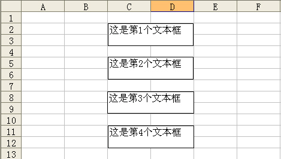

## 53、在工作表中添加图形

如果需要在工作表中添加图形对象，可以使用 AddShape 方法，如下面的代码所示。

```vb
Sub AddShape()
	Dim myShape As Shape
	On Error Resume Next
	Sheet1.Shapes("myShape").Delete
	Set myShape = Sheet1.Shapes.AddShape(msoShapeRectangle, 40, 120, 280, 30)
	With myShape
		.Name = "myShape"
		With .TextFrame.Characters
			.Text = "单击将选择Sheet2!"
			With .Font
				.Name = "华文行楷"
				.FontStyle = "常规"
				.Size = 22
				.ColorIndex = 7
			End With
		End With
		With .TextFrame	
			.HorizontalAlignment = -4108
			.VerticalAlignment = -4108
		End With
		.Placement = 3
	End With
	myShape.Select
	With Selection.ShapeRange
		With .Line
			.Weight = 1
			.DashStyle = msoLineSolid
			.Style = msoLineSingle
			.Transparency = 0
			.Visible = msoTrue
			.ForeColor.SchemeColor = 40
			.BackColor.RGB = RGB(255, 255, 255)
		End With
		With .Fill
			.Transparency = 0
			.Visible = msoTrue
			.ForeColor.SchemeColor = 41
			.OneColorGradient 1, 4, 0.23
		End With
	End With
	Sheet1.Range("A1").Select
	Sheet1.Hyperlinks.Add Anchor:=myShape, Address:="", _
		SubAddress:="Sheet2!A1", ScreenTip:="选择Sheet2!"
	Set myShape = Nothing
End Sub
```

代码解析：

AddShape 过程在工作表中添加一个矩形并设置其外观等属性。

第 2 行代码声明变量 myShape 的对象类型。

第 3、4 行代码删除可能存在的名称为“myShape”的图形对象。

第 5 行代码使用 AddShape 方法在工作表中添加一个矩形。当该方法应用于 Shapes 对象时，返回一个 Shape 对象，该对象代表工作表中的新自选图形，语法如下：

```vb
expression.AddShape(Type, Left, Top, Width, Height)

参数expression是必需的，返回一个Shapes对象。
参数Type是必需的，指定要创建的自选图形的类型。
参数Left和Top是必需的，以磅为单位给出自选图形边框左上角的位置。
参数Width和Height是必需的，以磅为单位给出自选图形边框的宽度和高度。
```

第 7 行代码将新建图形命名为“myShape”，向 Shapes 集合添加新的图形时，将对新添加的图形赋以默认的名称，若要为图形指定更有意义的名称，可指定其 Name 属性。

第 8 行到第 16 行代码为矩形添加文字，并设定其格式。

其中第 8 行代码使用 TextFrame 属性和 Characters 方法返回该矩形的字符区域。应用于 Shape 对象的 TextFrame 属性返回一个 TextFrame 对象，该对象包含指定图形对象的对齐和定位属性；Characters 方法返回一个 Characters 对象，该对象代表某个图形的文本框中的字符区域，语法如下：

```vb
expression.Characters(Start, Length)

参数expression是必需的，返回一个指定文本框内Characters对象的表达式。
参数Start是可选的，表示将要返回的第一个字符，如果此参数设置为 1 或被忽略，则Characters方法会返回以第一个字符为起始字符的字符区域。
参数Length是可选的，表示要返回的字符个数。如果此参数被忽略，则Characters方法会返回该字符串的剩余部分（由Start参数指定的字符以后的所有字符）。
```

第 9 行代码为矩形添加文字，应用于 Characters 对象的 Text 属性返回或设置对象的文本，为可读写的 String 类型。

第 10 行到第 15 行代码设置矩形中文字的属性，应用于 Characters 对象 Font 属性返回一个 Font 对象，该对象代表指定对象的字体属性（字体名称、字体大小、字体颜色等），第 11 行代码设置字体名称，第 12 行代码设置字体样式，第 13 行代码设置字体大小，第 14 行代码颜色。

第 17 行到第 20 行代码设定矩形中文字的对齐方式。应用于 TextFrame 对象的 HorizontalAlignment 属性返回或设置指定对象的水平对齐方式，可为表格 53-1 所示的 XlHAlign常量之一。

<u>表格 53-1</u>	HorizontalAlignment 属性的 XlHAlign 常量

| 常量                          | 值    | 描述     |
| ----------------------------- | ----- | -------- |
| xlHAlignCenter                | -4108 | 居中     |
| xlHAlignCenterAcrossSelection | 7     | 靠左     |
| xlHAlignDistributed           | -4117 | 分散对齐 |
| xlHAlignFill                  | 5     | 分散对齐 |
| xlHAlignGeneral               | 1     | 靠左     |
| xlHAlignJustify               | -4130 | 两端对齐 |
| xlHAlignLeft                  | -4131 | 靠左     |
| xlHAlignRight                 | -4152 | 靠右     |

应用于 TextFrame 对象的 VerticalAlignment 属性返回或设置指定对象的垂直对齐方式，可为表格 53-2 所示的 XlHAlign 常量之一。

<u>表格 53-2</u>	VerticalAlignment 属性的 XlHAlign 常量

| 常量                | 值    | 描述     |
| ------------------- | ----- | -------- |
| xlVAlignCenter      | -4108 | 居中     |
| xlVAlignJustify     | -4130 | 两端对齐 |
| xlVAlignBottom      | -4107 | 靠下     |
| xlVAlignDistributed | -4117 | 分散对齐 |
| xlVAlignTop         | -4160 | 靠上     |

第 21 行代码设置矩形大小和位置不随单元格而变，应用于 Shape 对象的 Placement 属性返回或设置对象与所在的单元格之间的附属关系，可为表格 53-3 所示的 XlPlacement 常量之一。

<u>表格 53-3</u>	XlPlacement 常量

| 常量           | 值   | 描述                       |
| -------------- | ---- | -------------------------- |
| xlFreeFloating | 3    | 大小、位置均固定           |
| xlMove         | 2    | 大小固定、位置随单元格而变 |
| xlMoveAndSize  | 1    | 大小、位置随单元格而变     |

第 24 行到第 32 行代码设置矩形的边框线条格式，应用于 ShapeRange 集合的 Line 属性返回一个 LineFormat 对象，该对象包含指定图形的线条格式属性。

其中第 26 行代码设置矩形线条粗细，第 27 行代码设置矩形线条的虚线样式，第 28 行代码设置矩形填充的透明度，第 29 行代码设置矩形为可见，第 30 行代码设置矩形的前景色，第 31 行代码设置矩形填充背景的颜色。

第 33 行到第 38 行代码设置矩形的内部填充格式，应用于 ShapeRange 集合的 Fill 属性返回 FillFormat 对象，该对象包含指定的图表或图形的填充格式属性。

其中第 35 行代码设置矩形内部的透明度，第 36 行代码设置矩形内部为可见，第 37 行代码设置矩形内部的前景色，第 38 行代码将矩形内部指定填充设为单色渐变，应用于 FillFormat 对象的 OneColorGradient 方法将指定填充设为单色渐变，语法如下：

```vb
expression.OneColorGradient(Style, Variant, Degree)

其中参数Style是必需的，底纹样式，可为表格 54-1所示的MsoGradientStyle常量之一。
参数Variant是必需的，渐变变量。取值范围为 1 到 4 之间，分别与“填充效果”对话框中“渐变”选项卡的四个渐变变量相对应。如果GradientStyle 设为 msoGradientFromCenter，则Variant参数只能设为 1 或 2。
参数Degree是必需的，灰度。取值范围为 0.0（表示最深）到 1.0（表示最浅）之间。
```

<u>表格 53-4</u>	MsoGradientStyle 常量

| 常量                    | 值   | 描述     |
| ----------------------- | ---- | -------- |
| msoGradientDiagonalDown | 4    | 斜下     |
| msoGradientDiagonalUp   | 3    | 斜上     |
| msoGradientFromCenter   | 7    | 无       |
| msoGradientFromCorner   | 5    | 角部幅射 |
| msoGradientFromTitle    | 6    | 中心幅射 |
| msoGradientHorizontal   | 1    | 水平     |
| msoGradientMixed        | -2   | 无       |
| msoGradientVertical     | 2    | 垂直     |

第 42、43 行代码为矩形对象添加超链接，应用于 Hyperlinks 对象的 Add 方法向指定的区域或图形添加超链接，语法如下：

```vb
expression.Add(Anchor, Address, SubAddress, ScreenTip, TextToDisplay)

参数expression是必需的，返回一个Hyperlinks对象。
参数Anchor是必需的，超链接的位置。可为Range对象或Shape对象。
参数Address是必需的，超链接的地址。
参数SubAddress是必需的，超链接的子地址。
参数ScreenTip是可选的，当鼠标指针停留在超链接上时所显示的屏幕提示。
参数TextToDisplay是可选的，要显示的超链接的文本。
```

运行 AddShape 过程结果如图 53-1 所示。

::: center


<u>图 53-1</u>	在工作表中添加图形

:::

## 54、导出工作表中的图片

有时需要将工作表中的图形对象保存为单独的图像文件，可以使用 Export 方法将工作表中的图片以文件形式导出，如下面的代码所示。

```vb
Sub ExportShp()
	Dim Shp As Shape
	Dim FileName As String
	For Each Shp In Sheet1.Shapes
		If Shp.Type = msoPicture Then
			FileName = ThisWorkbook.Path & "\" & Shp.Name & ".gif"
			Shp.Copy
			With Sheet1.ChartObjects.Add(0, 0, Shp.Width + 28, Shp.Height + 30).Chart
				.Paste
				.Export FileName, "gif"
				.Parent.Delete
			End With
		End If
	Next
End Sub
```

代码解析：

ExportShp 过程将 Sheet1 工作表的所有图片以文件形式导出到同一目录中。

第 4 行代码使用 For Each...Next 语句遍历 Sheet1 工作表中的所有图形。

第 5 行代码判断图形的类型是否为图片，应用于 Shape 对象的 Type 属性返回或设置图形类型，可以为表格 54-1 所示的 MsoShapeType 常量之一。

<u>表格 54-1</u>	MsoShapeType 常量

| 常量                | 值   | 说明                 |
| ------------------- | ---- | -------------------- |
| msoShapeTypeMixed   | -2   | 混合型图形           |
| msoAutoShape        | 1    | 自选图形             |
| msoCallout          | 2    | 没有边框线的标注     |
| msoChart            | 3    | 图表                 |
| msoComment          | 4    | 批注                 |
| msoFreeform         | 5    | 任意多边形           |
| msoGroup            | 6    | 图形组合             |
| msoFormControl      | 8    | 窗体控件             |
| msoLine             | 9    | 线条                 |
| msoLinkedOLEObject  | 10   | 链接式或内嵌OLE对象  |
| msoLinkedPicture    | 11   | 剪贴画或图片         |
| msoOLEControlObject | 12   | ActiveX 控件         |
| msoPicture          | 13   | 图片                 |
| msoTextEffect       | 15   | 艺术字               |
| msoTextBox          | 17   | 文本框               |
| msoDiagram          | 21   | 组织结构图或其他图示 |

第 6 行代码使用字符串变量 FileName 记录需导出图形的路径和名称。

第 7 行代码复制图形，应用于 Shape 对象的 Copy 方法将对象复制到剪贴板。

第 8 行代码使用 Add 方法在工作表中添加一个图表，应用于 ChartObjects 对象的 Add 方法创建新的嵌入图表，语法如下：

```vb
expression.Add(Left, Top, Width, Height)

参数expression是必需的，返回一个ChartObjects对象。
参数Left、参数Top是必需的，以磅为单位给出新对象的初始坐标，该坐标是相对于工作表上单元格A1的左上角或图表的左上角的坐标。
参数Width、参数Height是必需的，以磅为单位给出新对象的初始大小。
```

第 9 行代码使用 Paste 方法将图形粘贴到新的嵌入图表中，应用于 Chart 对象的 Paste 方法将剪贴板中的图表数据粘贴到指定的图表中，语法如下：

```vb
expression.Paste(Type)

参数expression是必需的，返回一个Chart对象。
参数Type是可选的的，如果剪贴板中有图表，本参数指定要粘贴的图表信息。可为以下XlPasteType常量之一：xlFormats、xlFormulas或xlAll。默认值为xlAll，如果剪贴板中是数据不是图表，则不能使用本参数。
```

第 10 行代码使用 Export 方法将图表导出到同一目录中，应用于 Chart 对象的 Export 方法以图形格式导出图表，语法如下：

```vb
expression.Export(Filename, FilterName, Interactive)

其中参数Filename是必需的，被导出的文件的名称。
```

第 10 行代码删除新建的图表。因为 Chart 对象是不能使用 Delete 方法直接删除的，应先使用 Parent 属性返回指定对象的父对象，然后使用 Delete 方法删除。

## 55、在工作表中添加艺术字

在工作表中插入艺术字，可以使用 AddTextEffect 方法，如下面的代码所示。

```vb
Sub TextEffect()
	Dim myShape As Shape
	On Error Resume Next
	Sheet1.Shapes("myShape").Delete
	Set myShape = Sheet1.Shapes.AddTextEffect _
			(PresetTextEffect:=msoTextEffect15, _
			Text:="我爱 Excel Home", FontName:="宋体", FontSize:=36, _
			FontBold:=msoFalse, FontItalic:=msoFalse, _
			Left:=100, Top:=100)
	With myShape
		.Name = "myShape"
		With .Fill
			.Solid
			.ForeColor.SchemeColor = 55
			.Transparency = 0
		End With
		With .Line
			.Weight = 1.5
			.DashStyle = msoLineSolid
			.Style = msoLineSingle
			.Transparency = 0
			.ForeColor.SchemeColor = 12
			.BackColor.RGB = RGB(255, 255, 255)
		End With
	End With
	Set myShape = Nothing
End Sub
```

代码解析：

TextEffect 过程在工作表中插入艺术字并设置其格式。

第 3、4 行代码删除工作表中可能存在的艺术字，以免重复添加。

第 5 行到第 9 行代码使用 AddTextEffect 方法在工作表中插入艺术字，AddTextEffect 方法创建艺术字对象。返回一个 Shape 对象，该对象代表新建的艺术字对象，语法如下：

```vb
expression.AddTextEffect(PresetTextEffect, Text, FontName, FontSize, FontBold, FontItalic, Left, Top)

参数expression是必需的，返回一个Shapes对象。
参数PresetTextEffect是必需的，艺术字预置文本效果，可为MsoPresetTextEffect 常量之一，等同于在工作表中插入艺术字时的样式选项卡，如图55-1所示。
参数Text是必需的，艺术字对象中的文字。
参数FontName是必需的，艺术字对象中所用的字体名称。
参数FontSize是必需的，以磅为单位给出艺术字对象中所用的字体大小。
参数FontBold是必需的，在艺术字中要加粗的字体。
参数FontItalic是必需的，在艺术字中要倾斜的字体。
参数Left和参数Top是必需的，相对于文档的左上角、顶部，以磅为单位给出艺术字对象边框左上角的位置。
```

::: center


<u>图 55-1</u>	艺术字样式

:::

第 11 行代码将艺术字对象重命名为“myShape”。

第 12 行到第 16 行代码设置艺术字对象的填充格式。其中第 13 行代码将填充格式设置为均一的颜色，应用于 FillFormat 对象的 Solid 方法将指定的填充格式设置为均一的颜色，可用本方法将带有渐进色、纹理、图案或背景的填充格式转换为单色的填充格式。第 14 行代码设置填充的颜色。第 15 行代码设置填充的透明度。

第 17 行到第 24 行代码设置艺术字对象的线条格式属性。其中第 18 行代码设置线条粗细，第 19 行代码设置线条虚线样式，第 20 行代码设置线条区域的样式，第 21 行代码设置线条的透明度，第 22 行代码设置前景色，第 23 行代码设置填充背景的颜色。

运行 TextEffect 过程工作表中如图 55-2 所示。

::: center


<u>图 55-2</u>	工作表中插入艺术字

:::

## 56、遍历工作表中的图形

工作表中的多个图形，如果使用系统缺省名称，如“文本框1”、“文本框2”这样前面是固定的字符串，后面是序号的，可以使用 For...Next 语句遍历图形，如下面的代码所示。

```vb
Sub ErgShapes_1()
	Dim i As Integer
	For i = 1 To 4
		Sheet1.Shapes("文本框 " & i).TextFrame.Characters.Text = ""
	Next
End Sub
```

代码解析：

ErgShapes_1 过程清除工作表中四个图形文本框中的文字。

第 3 行到第 5 行代码，使用 Shapes 属性在工作表上的三个图形文本框中循环。

Shapes 属性返回 Shapes 对象，代表工作表或图形工作表上的所有图形，可以使用Shapes（index）返回单个的 Shape 对象，其中index是图形的名称或索引号。

返回单个的 Shape 对象后使用 TextFrame 属性和 Characters 方法清除文本框中的字符，关于 Shape 对象的 TextFrame 属性和 Characters 方法请参阅 53 。

如果图形的名称没有规律，可以使用 For Each...Next 语句循环遍历所有图形，根据 Type 属性返回的图形类型进行相应的操作，如下面的代码所示。

```vb
Sub ErgShapes_2()
	Dim myShape As Shape
	Dim i As Integer
	i = 1
	For Each myShape In Sheet1.Shapes
		If myShape.Type = msoTextBox Then
			myShape.TextFrame.Characters.Text = "这是第" & i & "个文本框"
			i = i + 1
		End If
	Next
End Sub
```

代码解析：

ErgShapes_2 过程在工作表中的所有图形文本框中写入文本。

第 5 行代码使用 For Each...Next 语句循环遍历工作表中所有的图形对象。

第 6 行到第 9 行代码如果图形对象是文本框则在文本框中写入文本。其中第 6 行代码根据 Type 属性判断图形对象是否为文本框，应用于 Shape 对象的 Type 属性返回或设置图形类型， MsoShapeType 类型，请参阅表格 54-1 。

第 7 行代码根据返回的 Type 属性值在所有的文本框内写入相应的文本，如图 56-1 所示。

::: center



<u>图 56-1</u>	遍历所有的文本框

:::

## 57、移动、旋转图片

工作表中的图片可以移动、旋转，如下面的代码所示。

```vb
Sub MoveShape()
	Dim i As Long
	Dim j As Long
	With Sheet1.Shapes(1)
		For i = 1 To 3000 Step 5
		 .Top = Sin(i * (3.1416 / 180)) * 100 + 100
		 .Left = Cos(i * (3.1416 / 180)) * 100 + 100
		 .Fill.ForeColor.RGB = i * 100
			For j = 1 To 10
				.IncrementRotation -2
				DoEvents
			Next
		Next
	End With
End Sub
```

代码解析：

MoveShape 过程移动、旋转工作表中的图片并不断改变其填充的前景色。

第 6 行代码设置图片的 Top 属性值，应用于 Shape 对象的 Top 属性设置图形的顶端到工作表顶端的距离。在循环的过程中使用 Sin 函数将 Top 属性值设置为一个圆形的弧度值。Sin 函数返回指定参数的正弦值，语法如下：

```vb
Sin(number)

参数number表示一个以弧度为单位的角。
```

Sin 函数取一角度为参数值，并返回角的对边长度除以斜边长度的比值，将角度除以 180 后即能角度转换为弧度。

第 7 行代码设置图片的 Left 属性值，应用于 Shape 对象的 Left 属性设置图形从左边界至 A 列左边界（在工作表中）或图表区左边界（在图表工作表中）的距离。在循环的过程中使用 Cos 函数将 Left 属性值设置为一个圆形的弧度值。Cos 函数返回指定一个角的余弦值，语法如下：

```vb
Cos(number)

参数number表示一个以弧度为单位的角。
```

Cos 函数的 number 参数为一个角，并返回直角三角形两边的比值，该比值为角的邻边长度除以斜边长度之商，将角度除以 180 后即能角度转换为弧度。

第 8 行代码设置图片填充的前景色随着循环的过程不断的变化。使用Fill属性返回一个 FillFormat 对象，FillFormat 对象代表图形的填充格式，其 ForeColor 属性设置对象填充的前景色。

第 9 行到第 11 行代码在图形移动的过程中使用 IncrementRotation 方法设置图形绕 z 轴的转角，IncrementRotation 方法以指定的度数为增量，更改指定的图形绕 z 轴的转角，语法如下：

```vb
expression.IncrementRotation(Increment)

参数expression是必需的，返回一个Shape对象。
参数Increment是必需的，以度为单位指定图形在水平方向的旋转量，正值使图形按顺时针方向旋转，负值使图形按逆时针方向旋转。
```

其中第 11 行是关键的代码，使用 DoEvents 函数转让控制权，否则达不到预计的视觉效果。

运行 MoveShape 过程，工作表的图形在自身进行逆时针方向旋转的同时沿着一个圆形的弧度进行移动，并不断改变其填充的颜色。

## 58、工作表中自动插入图片

在日常工作中经常需要在工作表中插入大量图片，比如在如图 58-1 所示的工作表中需要根据 A 列的名称在 C 列插入保存在同一目录中的相应的图片，如果使用手工插入不仅非常繁琐且极易出错，而使用 VBA 代码可以很好的完成操作。

::: center


<u>图 58-1</u>	需插入图片的工作表

:::

示例代码如下：

```vb
Sub insertPic()
	Dim i As Integer
	Dim FilPath As String
	Dim rng As Range
	Dim s As String
	With Sheet1
		For i = 3 To .Range("a65536").End(xlUp).Row
			FilPath = ThisWorkbook.Path & "\" & .Cells(i, 1).Text & ".jpg"
			If Dir(FilPath) <> "" Then
				.Pictures.Insert(FilPath).Select
				Set rng = .Cells(i, 3)
				With Selection
					.Top = rng.Top + 1
					.Left = rng.Left + 1
					.Width = rng.Width - 1
					.Height = rng.Height - 1
				End With
			Else
				s = s & Chr(10) & .Cells(i, 1).Text
			End If
		Next
		.Cells(3, 1).Select
	End With
	If s <> "" Then
		MsgBox s & Chr(10) & "没有照片!"
	End If
End Sub
```

代码解析：

insertPic 过程使用 Insert 方法在工作表中插入图片。

第 7 行代码开始 For...Next 循环，循环的终值由工作表中 A 列单元格的行数所决定。

第 8 行代码字符串变量FilPath保存A列名称单元格所对应的图片文件的路径和文件名，本例中图片文件的文件名应和A列中的名称一致。

第 9 行到第 11 行代码使用 Dir 函数在同一文件夹中查找与 A 列单元格中的名称相对应的图片文件，如果对应的图片文件存在则使用 Insert 方法将图片插入到工作表中，并将 C 列的单元格赋给变量 rng。

Dir 函数返回一个 String，用以表示一个文件名、目录名或文件夹名称，它必须与指定的模式或文件属性、或磁盘卷标相匹配。如果已没有合乎条件的文件，则 Dir 函数会返回一个零长度字符串 （""）。

第 12 行到第 17 行代码，当图片片插入到工作表时其实是插入到活动单元格的，此时需设置图片的 Top 属性和 Left 属性将图片移动到 C 列所对应的单元格中，并设置其 Width 属性和 Height 属性使其适应所在单元格的大小。

第 18、19 行代码如果在同一文件夹中没有与 A 列单元格对应的图片文件，则使用字符串变量 s 保存没有图片文件的名称。

第 24 行到第 26 行代码如果字符串变量s不等于空白说明文件夹中缺少图片文件，使用消息框提示。

运行 insertPic 过程工作表如图 58-2 所示。

::: center


<u>图 58-2</u>	插入图片后的工作表

:::

如果文件夹中缺少对应的图片文件，则会进行提示，如图 58-3 所示。

::: center


<u>图 58-3</u>	缺少图片文件提示

:::

## 59、固定工作表中图形的位置

工作表中插入的图片，一般都是固定的尺寸和固定的单元格区域中的，但在实际使用中可能因一些人为的因素导致图片位置偏移或尺寸变化，此时可以使用 VBA 代码进行调整，如下面的代码所示。

```vb
Sub ShapeAddress()
	Dim rng As Range
	Set rng = Sheet1.Range("B4:E22")
	With Sheet1.Shapes("Picture 1")
		.Rotation = 0
		.Select
		With Selection
			.Top = rng(1).Top + 1
			.Left = rng(1).Left + 1
			.Width = rng.Width - 0.5
			.Height = rng.Height - 0.5
		End With
	End With
	Range("A1").Select
End Sub
```

代码解析：

ShapeAddress 过程调整指定图形在工作表中的位置。

第 3 行代码变量 rng 保存工作表中插入图片的单元格区域。。

第 5 行代码设置图片的转角，应用于 Shape 对象 Rotation 属性以度为单位返回或设置图形的转角，设置为正值向右偏转，设置为负值向左偏转，设置为零图片则保持 90 度垂直。

第 7 行到第 12 行代码设置图片的 Top 属性和 Left 属性将图片移动到变量 rng 所保存的单元格区域中，并设置其 Width 属性和 Height 属性使其适应所在单元格区域的大小。

第 14 行代码选择 `A1` 单元格，不然图片会处于选中状态。

经过以上设置，工作表中的图片“Picture 1”不管处于什么状态都可以一键恢复其原来的大小、位置。

## 60、使用 VBA 自动生成图表

在实际工作中我们常用图表来表现数据间的某种相对关系，一般采用手工插入的方式，而使用 VBA 代码可以在工作表中自动生成图表，如下面的示例代码。

```vb
Sub ChartAdd()
	Dim myRange As Range
	Dim myChart As ChartObject
	Dim R As Integer
	With Sheet1
		.ChartObjects.Delete
		R = .Range("A65536").End(xlUp).Row
		Set myRange = .Range("A" & 1 & ":B" & R)
		Set myChart = .ChartObjects.Add(120, 40, 400, 250)
		With myChart.Chart
			.ChartType = xlColumnClustered
			.SetSourceData Source:=myRange, PlotBy:=xlColumns
			.ApplyDataLabels ShowValue:=True
			.HasTitle = True
			.ChartTitle.Text = "图表制作示例"
			With .ChartTitle.Font
				.Size = 20
				.ColorIndex = 3
				.Name = "华文新魏"
			End With
			With .ChartArea.Interior
				.ColorIndex = 8
				.PatternColorIndex = 1
				.Pattern = xlSolid
			End With
			With .PlotArea.Interior
				.ColorIndex = 35
				.PatternColorIndex = 1
				.Pattern = xlSolid
			End With
			.SeriesCollection(1).DataLabels.Delete
			With .SeriesCollection(2).DataLabels.Font
				.Size = 10
				.ColorIndex = 5
			End With
		End With
	End With
	Set myRange = Nothing
	Set myChart = Nothing
End Sub
```

代码解析：

ChartAdd 过程在工作表中自动生成图表，图表类型为簇状柱形图。

第 6 行代码使用 Delete 方法删除工作表中已经存在的图表，而 ChartObjects 方法返回代表工作表中单个嵌入图表（ChartObject 对象）或所有嵌入图表的集合（ChartObjects 对象）的对象，语法如下：

```vb
expression.ChartObjects(Index)

其中参数Index是可选的，指定图表的名称或号码。该参数可以是数组，用于指定多个图表，因为示例中只有一个图表，所以无需指定其Index参数。
```

第 8 行代码指定图表的数据源。

第 9 行代码使用 Add 方法创建一个新图表，应用于 ChartObjects 对象的 Add 方法创建新的嵌入图表，语法如下：

```vb
expression.Add(Left, Top, Width, Height)

参数Left、Top是必需的，以磅为单位给出新对象的初始坐标，该坐标是相对于工作表上单元格A1的左上角或图表的左上角的坐标。
参数Width、Height是必需，以磅为单位给出新对象的初始大小。
```

第 10 行代码使用 Chart 属性返回新创建的图表，应用于 ChartObject 对象的 Chart 属性返回一个 Chart 对象，该对象代表指定对象所包含的图表。

第 11 行代码指定新创建图表的图表类型，应用于 Chart 对象的 ChartType 属性返回或设置图表的类型，可以为 XlChartType 常量之一，具体请参阅 VBA 帮助。本例中设置为 xlColumnClustered 即图表类型为簇状柱形图。

第 12 行代码指定图表的数据源和绘图方式，应用于 Chart 对象的 SetSourceData 方法为指定图表设置源数据区域，语法如下：

```vb
expression.SetSourceData(Source, PlotBy)

参数expression是必需的，该表达式返回一个Chart对象。
参数Source是可选的，源数据的区域。
参数PlotBy是可选的，指定数据绘制方式，可为xlColumns（系列产生在列）或xlRows（系列产生在行）。
```

第 13 行代码使用 ApplyDataLabels 方法使图表显示数据标签和数据点的值，应用于 Chart 对象的 ApplyDataLabels 方法将数据标签应用于图表中的某一数据点、某一数据系列或所有数据系列，语法如下：

```vb
expression.ApplyDataLabels(Type, LegendKey, AutoText, HasLeaderLines, ShowSeriesName, ShowCategoryName, ShowValue, ShowPercentage, ShowBubbleSize, Separator)

参数expression是必需的，该表达式返回一个Chart对象。
参数Type是可选的，要应用的数据标签的类型，可为表格 60-1所列的XlDataLabelsType 常量之一。
参数LegendKey是可选的，如果该值为True，则显示数据点旁的图例项标示。默认值为False。
参数AutoText是可选的，如果对象根据内容自动生成正确的文字，则该值为True。
参数HasLeaderLines是可选的，如果数据系列具有引导线，则该值为True。
参数ShowSeriesName是可选的，数据标签的系列名称。
参数ShowCategoryName是可选的，数据标签的分类名称。
参数ShowValue是可选的，数据标签的值。
参数ShowPercentage是可选的，数据标签的百分比。
参数ShowBubbleSize是可选的，数据标签的气泡尺寸。
参数Separator是可选的，数据标签的分隔符。
```

<u>表格 60-1</u>	XlDataLabelsType 常量

| 常量                            | 值    | 描述                                                   |
| ------------------------------- | ----- | ------------------------------------------------------ |
| xlDataLabelsShowBubbleSizes     | 6     | 无                                                     |
| xlDataLabelsShowLabelAndPercent | 5     | 占总数的百分比及数据点所属的分类。仅用于饼图或圆环图。 |
| xlDataLabelsShowPercent         | 3     | 占总数的百分比。仅用于饼图或圆环图。                   |
| xlDataLabelsShowLabel           | 4     | 数据点所属的分类。                                     |
| xlDataLabelsShowNone            | -4142 | 无数据标签。                                           |
| xlDataLabelsShowValue           | 2     | 数据点的值，若未指定本参数，默认使用此设置。           |

第 14、15 行代码设置新创建的图表有可见的标题并设置图表标题的文字。应用于 Chart 对象的 HasTitle 属性，如果坐标轴或图表有可见标题，则该值为 True，而 ChartTitle 属性返回一个 ChartTitle 对象，代表指定图表的标题。

第 16 行到第 20 行代码设置图表标题文字的格式。

第 21 行到第 25 行代码设置图表区的颜色。

第 26 行到第 30 行代码设置绘图区的颜色。

第 31 行代码删除图表上第一个数据系列中的数据标签。SeriesCollection 方法返回图表或图表组中单个数据系列（Series 对象)或所有数据系列的集合（SeriesCollection 集合)的对象，语法如下：

```vb
expression.SeriesCollection(Index)

可选的Index参数指定数据系列的名称或编号。
```

而 DataLabels 方法则返回代表数据系列中的单个数据标签（DataLabel 对象）或所有数据标签的集合（DataLabels 集合）的对象，语法如下：

```vb
expression.DataLabels(Index)

可选的Index参数指定数据系列中的数据标签的编号。
```

第 32 行到第 36 行代码设置图表上第二个数据系列中的数据标签的字体格式。

运行 ChartAdd 过程，在工作表中创建簇状柱形图，如图 60-1 所示。

::: center


<u>图 60-1</u>	创建簇状柱形图

:::

## 61、使用独立窗口显示图表

如果需要将工作表中嵌入的图表显示在独立的窗口中，可以使用下面的代码。

```vb
Sub ChartShow()
	With Sheet1.ChartObjects(1)
		.Activate
		.Chart.ShowWindow = True
	End With
	With ActiveWindow
		.Top = 50
		.Left = 50
		.Width = 400
		.Height = 280
		.Caption = ThisWorkbook.Name
	End With
End Sub
```

代码解析：

ChartShow 过程，将工作表中嵌入的图表显示在独立的窗口中。

第 2 行到第 5 行代码将工作表中指定图表的 ShowWindow 属性设置为 True，使用独立的窗口显示该图表。

第 7、8 行代码指定活动窗口显示的位置。

第 9、10 行代码调整活动窗口的大小使之适应图表的大小。

第 11 行代码指定活动窗口标题栏中显示的标题。

运行 ChartShow 过程结果如图 61-1 所示。

::: center


<u>图 61-1</u>	使用独立窗口显示图表

:::

## 62、导出工作表中的图表

如果需要将工作表中的图表保存为单独的图像文件，可以使用 Export 方法以图形文件格式导出图表，示例代码如下。

```vb
Sub ExportChart()
	Dim myChart As Chart
	Dim myFileName As String
	Set myChart = Sheet1.ChartObjects(1).Chart
	myFileName = "myChart.jpg"
	On Error Resume Next
	Kill ThisWorkbook.Path & "\" & myFileName
	myChart.Export Filename:=ThisWorkbook.Path _
		& "\" & myFileName, Filtername:="JPG"
	MsgBox "图表已保存在[" & ThisWorkbook.Path & "]文件夹中!"
	Set myChart = Nothing
End Sub
```

代码解析：

ExportChart 过程使用 Export 方法将工作表中的图表以图形文件的形式导出。

第 4 行代码指定工作表中的图表对象。

第 5 行代码指定图形文件保存的文件名。

第 6、7 行代码使用 Kill 语句删除文件夹中原有的图形文件。当文件夹中指定删除的文件不存在时 Kill 语句会出错所以需要使用 On Error 语句忽略错误。

第 8、9 行代码使用 Export 方法将图表导出到同一目录中，应用于 Chart 对象的 Export 方法以图形文件格式导出图表，语法如下：

```vb
expression.Export(Filename, FilterName, Interactive)

其中参数Filename是必需的，被导出的文件的名称，示例中加上了文件保存的路径。
参数FilterName是可选的，被导出的文件的图形格式，示例中文件以JPG文件格式保存。
```

## 63、多图表制作

如果需要，我们可以为工作表中的每一个数据区域创建一张图表，在如图 63-1 所示的工作表区域中，需要为每一个员工的全年数据创建一张图表。

::: center


<u>图 63-1</u>	数据区域

:::

示例代码如下：

```vb
Sub ChartsAdd()
	Dim myChart As ChartObject
	Dim i As Integer
	Dim R As Integer
	Dim m As Integer
	R = Sheet1.Range("A65536").End(xlUp).Row - 1
	m = Abs(Int(-(R / 4)))
	Sheet2.ChartObjects.Delete
	For i = 1 To R
		Set myChart = Sheet2.ChartObjects.Add _
			(Left:=(((i - 1) Mod m) + 1) * 350 - 320, _
			Top:=((i - 1) \ m + 1) * 220 - 210, _
			Width:=330, Height:=210)
		With myChart.Chart
			.ChartType = xlColumnClustered
			.SetSourceData Source:=Sheet1.Range("B2:M2").Offset(i - 1), _
			PlotBy:=xlRows
			With .SeriesCollection(1)
				.XValues = Sheet1.Range("B1:M1")
				.Name = Sheet1.Range("A2").Offset(i - 1)
				.ApplyDataLabels AutoText:=True, ShowValue:=True
				.DataLabels.Font.Size = 10
			End With
			.HasLegend = False
			With .ChartTitle
				.Left = 5
				.Top = 1
				.Font.Size = 14
				.Font.Name = "华文行楷"
			End With
			With .PlotArea.Interior
				.ColorIndex = 2
				.PatternColorIndex = 1
				.Pattern = xlSolid
			End With
			.Axes(xlCategory).TickLabels.Font.Size = 10
			.Axes(xlValue).TickLabels.Font.Size = 10
		End With
	Next
	Sheet2.Select
	Set myChart = Nothing
End Sub
```

代码解析：

ChartsAdd 过程根据数据工作表 A 列的人数在图表工作表中创建图表并分 4 行排列整齐。

第 6 行代码取得数据工作表中需要创建图表的人数。

第 7 行代码计算图表工作表每行需要排列的图表数目，共分 4 行排列。使用 Int 函数返回图表数目除 4 行后的整数部分，使用负值是为了向上取整数，最后使用 Abs 函数返回绝对值，将负值转化为正值。

第 8 行代码使用 Delete 方法删除图表工作表中存在的所有图表。

第 9 行代码开始 For...Next 循环，循环的终值由需要创建的图表数目决定。

第 10 行到第 13 行代码使用 Add 方法在图表工作表中创建嵌入的图表，关于应用于 ChartObjects 对象的 Add 方法请参阅 60 。其中第 11、12 行代码根据循环计数器的数值设置新创建图表的 Left 和 To p属性使之依次排列。第 13 行代码设置图表的大小。

第 15 行代码设置新创建图表的类型。

第 16、17 行代码根据循环计数器的数值分别设置新创建图表的数据源。

第 18 行到第 23 行代码设置图表第一个数据系列的名称、数据标签和字体格式。

第 24 行代码删除图表中的图例。

第 25 行到第 30 行代码设置图表的标题。

第 31 行到第 35 行代码设置图表的绘图区。

第 36、37 行代码设置图表坐标轴的字体大小。

关于图表的设置请参阅 60 。

运行 ChartsAdd 过程如图 63-2 所示。

::: center


<u>图 63-2</u>	图表工作表

:::

