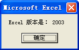
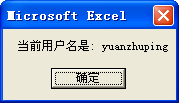
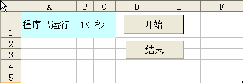
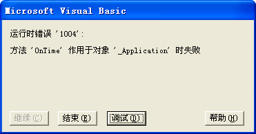
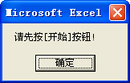
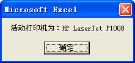
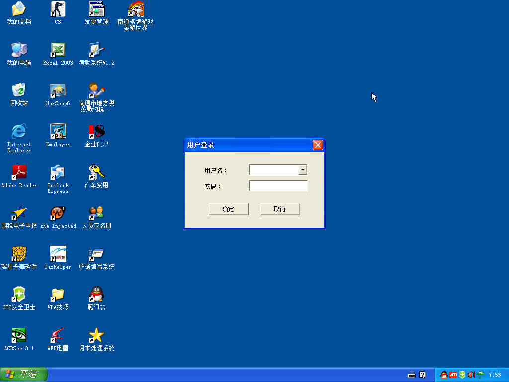
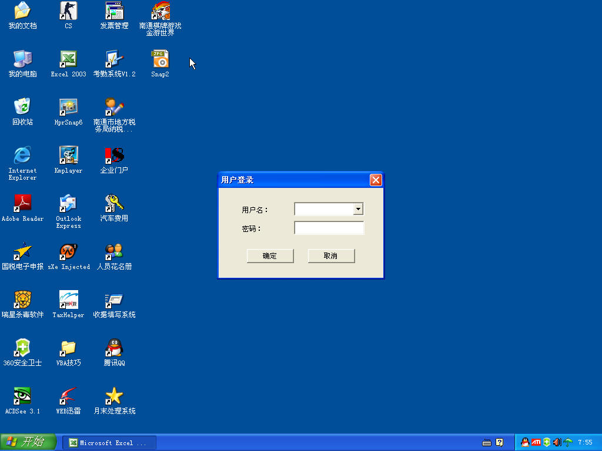
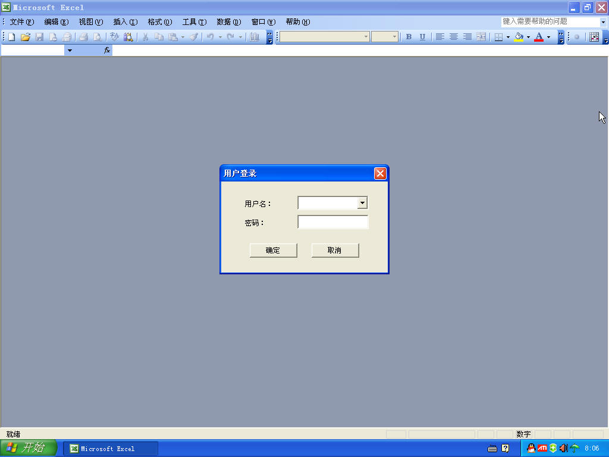

## 64、取得 Excel 版本信息

Application 对象的 Version 属性可以返回 Excel 的版本号，如下面的代码所示。

```vb
Sub AppVersion()
  Dim myVersion As String
  Select Case Application.Version
	  Case "8.0"
		  myVersion = "97"
	  Case "9.0"
		  myVersion = "2000"
	  Case "10.0"
		  myVersion = "2002"
	  Case "11.0"
		  myVersion = "2003"
	  Case Else
		  myVersion = "版本未知"
  End Select
  MsgBox "Excel 版本是： " & myVersion
End Sub
```

代码解析：

AppVersion 过程返回 Application 对象的 Version 属性值来取得 Excel 版本号。

应用于 Application 对象的 Version 属性返回 Excel 版本号，语法如下：

```vb
expression.Version

参数expression是必需的，Application对象。
```

运行 AppVersion 过程结果如图 64-1 所示。

::: center



<u>图 64-1</u>	取得 Excel 版本号

:::

## 65、取得当前用户名称

使用 Application 对象的 UserName 属性可以取得当前用户名称，如下面的代码所示。

```vb
Sub UserName()
	MsgBox "当前用户名是: " & Application.UserName
End Sub
```

代码解析：

UserName 过程使用消息框显示当前用户名称。

Application 对象的 UserName 属性返回或设置当前用户的名称。

运行 UserName 过程效果如图 65-1 所示。

::: center



<u>图 65-1</u>	显示当前用户名称

:::

## 66、Excel 中的“定时器“

Excel VBA 并没有提供定时器控件，但是用户可以通过 Application 对象的 OnTime 方法实现简单的定时器功能，如下面的代码所示。

```vb
Sub StartTimer()
	Sheet1.Cells(1, 2) = Sheet1.Cells(1, 2) + 1
	Application.OnTime Now + TimeValue("00:00:01"), "StartTimer"
End Sub
```

代码解析：

StartTimer 过程，使用 Application 对象的 OnTime 方法循环调用 StartTimer 过程实现每隔一秒钟运行一次 StartTimer 过程，从而在B1单元格中不断地显示程序累计运行时间，如图 66-1 所示。

::: center



<u>图 66-1</u>	简单的定时器

:::

第 2 行代码将 `B1` 单元格的值在原有的数字上加 1。

第 3 行代码使用 OnTime 方法在 1 秒后重新调用 StartTimer 过程，使 `B1` 单元格的值不断的加 1，从而显示程序累计运行时间。

应用于 Application 对象的 OnTime 方法能够安排一个过程在将来的特定时间运行，语法如下： 

```vb
expression.OnTime(EarliestTime, Procedure, LatestTime, Schedule)

参数expression是必需的，返回一个Application对象。
参数EarliestTime是必需的，设置指定的过程开始运行的时间。使用Now + TimeValue(time)可以安排从现在开始经过一段时间之后运行某个过程，使用TimeValue(time)可以安排在指定的时间运行某个过程。
参数Procedure是必需的，设置要运行的过程名称。
参数LatestTime是可选的，设置过程开始运行的最晚时间。例如将参数LatestTime设置为EarliestTime+10，当时间到了EarliestTime时如果Excel不处于空闲状态，那么Excel将等待10秒，如果在10秒内Excel不能回到空闲状态，则不运行该过程。如果省略该参数，Excel将一直等待到可以运行该过程为止。
参数Schedule是可选的，如果其值为True（默认值），则安排一个新的OnTime过程，如果其值为False，则清除先前设置的过程。
```

取消定时的代码如下：

```vb
Sub EndTimer()
	On Error GoTo Line
	Application.OnTime Now + TimeValue("00:00:01"), "StartTimer", , False
	Sheet1.Cells(1, 2) = 0
	Exit Sub
Line:
	MsgBox "请先按[开始]按钮!"
End Sub
```

代码解析：

EndTimer 过程取消 StartTimer 过程的定时。

第 2 行代码错误处理语句，因为如果还没有运行 StartTimer 过程而先运行 EndTimer 过程取消定时，程序会提示错误，如图 66-2 所示，因此使用 On Error GoTo Line 语句在错误发生时执行第 7 行代码显示一个如图 66-3 所示的提示消息框。

::: center



<u>图 66-2</u>	运行错误



<u>图 66-3</u>	提示消息框

:::

第 3 行代码将 StartTimer 过程的 Schedule 参数设置为 False，取消定时设置。

## 67、设置活动打印机的名称

使用 Application 对象的 ActivePrinter 属性可以设置活动打印机的名称，如下面的代码所示。

```vb
Sub myPrinter()
	Dim myPrinter As String
	myPrinter = "HP LaserJet P1008 在 Ne04:"
	Application.ActivePrinter = myPrinter
	MsgBox "活动打印机为：" & Left(myPrinter, InStr(myPrinter, "在") - 1)
End Sub
```

代码解析：

myPrinter 过程将活动打印机设置为“HP LaserJet P1008”。

第 3 行代码指定需要设置为活动打印机的名称，第 4 行代码通过设置 Application 对象的ActivePrinter 属性将活动打印机设置为“HP LaserJet P1008”。

第 5 行代码使用消息框显示活动打印机的名称及型号。

运行 myPrinter 过程结果如图 67-1 所示。

::: center



<u>图 67-1</u>	设置活动打印机

:::

## 68、屏蔽、改变组合键的功能

使用 Application 对象的 OnKey 方法可以屏蔽或改变组合键的默认操作，如下面的代码所示。

```vb
Private Sub Workbook_Open()
	Application.OnKey "^{c}", "myOnKey"
End Sub
Sub myOnKey()
	MsgBox "本工作表禁止复制数据!"
End Sub
```

代码解析：

第 1 行到第 3 行代码工作簿的 Open 事件，在工作簿打开时使用 OnKey 方法改变 <Ctrl +C> 组合键的功能。

应用于 Application 对象的 OnKey 方法指定特定键或特定的组合键运行的过程，语法如下：

```vb
expression.OnKey(Key, Procedure)

参数expression是必需的，该表达式返回一个Application 对象。
参数Key是必需的，用于表示要按的键的字符串，具体请参阅VBA中的帮助。
参数Procedure是可选的，表示要运行的过程名称的字符串。
```

本示例中将过程名称指定为第 4 行到第 6 行代码的“myOnKey”过程，当按下 <Ctrl +C> 组合键时并不会执行复制操作而只显示一个消息框。如果将 Procedure 参数指定为空文本（""），则按 <Ctrl +C> 组合键时不发生任何操作，达到屏蔽组合键的效果。

如果省略 Procedure 参数，则按下 <Ctrl +C> 组合键时产生 Microsoft Excel 中的正常结果，同时清除先前使用 OnKey 方法所做的特殊击键设置，所以恢复 <Ctrl +C> 组合键的代码如下：

```
Application.OnKey "^{c}"
```

为了不影响其他工作簿的功能，恢复代码就放在工作簿的 Deactivate 事件中，如下面的代码所示：

```vb
Private Sub Workbook_Deactivate()
	Application.OnKey "^{c}"
End Sub
```

代码解析：

当工作簿从活动状态转为非活动状态时恢复 <Ctrl +C> 组合键的正常功能。

## 69、设置 Excel 窗口标题栏

Excel 主窗口标题栏默认的名称是“Microsoft Excel”，通过设置 Application 对象的 Caption 属性可以改变 Excel 主窗口的标题栏，如下面的代码所示。

```vb
Sub AppCaption()
	Application.Caption = "修改标题栏名称"
	MsgBox "下面将恢复默认的标题栏名称!"
	Application.Caption = Empty
End Sub
```

代码解析：

第 2 行代码将 Excel 窗口标题设置为“修改标题栏名称”，如图 69-1 所示。

::: center


<u>图 69-1</u>	设置 Excel 窗口标题

:::

应用于 Application 对象的 Caption 属性设置显示在 Microsoft Excel 主窗口标题栏中的名称，语法如下：

```vb
expression.Caption
```

第 3 行代码恢复 Microsoft Excel 主窗口标题栏中的名称。如果未设置 Caption 属性（""）或将其设置为 Empty（表示未初始化的变量值），则本属性返回默认的“Microsoft Excel”。

将 Caption 属性设置为常数 vbNullChar（表示值为 0 的字符）可以删除标题栏中的名称，如下面的代码所示。

```vb
Sub DleCaption()
	Application.Caption = vbNullChar
	MsgBox "下面将恢复默认的标题栏名称!"
	Application.Caption =Empty
End Sub
```

代码解析：

第 2 行代码删除 Excel 主窗口标题栏，结果如图 69-2 所示。

::: center


<u>图 69-2</u>	删除 Excel 窗口标题栏的名称

:::

## 70、自定义 Excel 状态栏

Excel 状态栏显示应用程序的当前状态（例如就绪、输入等）或上下文提示信息，通过设置 Application 对象的 Statusbar 属性可以修改状态栏，以显示用户自定义的信息，代码如下：

```vb
Sub myStatusBar()
	Dim rng As Range
	For Each rng In Sheet1.Range("A1:D10000")
		Application.StatusBar = "正在计算单元格 " & rng.Address(0, 0) & " 的数据..."
		rng = 100
	Next
	Application.StatusBar = False
End Sub
```

代码解析：

myStatusBar 过程在给选定单元格区域赋值的同时，将 Excel 状态栏中的文字设置为正在赋值的单元格地址。

应用于 Application 对象的 StatusBar 属性返回或设置状态栏中的文字，如果需要恢复默认的状态栏文字，将本属性设为 False 即可。

运行 myStatusBar 过程 Excel 状态栏如图 70-1 所示。

::: center


<u>图 70-1</u>	自定义 Excel 状态栏

:::

## 71、灵活退出 Excel

在使用 Close 方法关闭工作簿时，既使当前只有一个打开的工作簿，也只能关闭工作簿而不能关闭 Excel 程序，而使用 Application 对象的 Quit 方法则会关闭所有打开的工作簿，下面的代码可以做到两者兼顾。

```vb
Sub myQuit()
	If Workbooks.Count > 1 Then
		ThisWorkbook.Close
	Else
		Application.Quit
	End If
End Sub
```

代码解析：

myQuit 过程在关闭 Excel 程序时根据当前打开的工作簿数量决定采用何种方法关闭工作簿。

第 2 行代码使用 Workbook 集合的 Count 属性判断当前打开的工作簿文件数量。

第 3 行代码如当前打开两个或两个以上工作簿，使用 Close 方法关闭代码所在的工作簿。关于 Close 方法请参阅 45-1。

第 5 行代码如果当前只有一个打开的工作簿文件则使用 Quit 方法关闭 Excel 程序。应用于 Application 对象的 Quit 方法退出 Excel 程序，语法如下：

```vb
expression.Quit

参数expression是必需的，返回一个Application对象。
```

使用 Quit 方法关闭 Excel 程序时，如果有未保存的工作簿处于打开状态，则将弹出一个询问是否要保存所作更改的对话框，为避免对话框出现，可在使用 Quit 方法前保存所有的工作簿，或者将 Application 对象的 DisplayAlerts 属性设置为 False，在退出 Excel 程序时，即使有未保存的工作簿，也不会显示对话框，而且不保存就退出。

如果一个工作簿的 Saved 属性值为 True，但是并没有将工作簿保存到磁盘上，则 Excel 程序在退出时不会提示保存该工作簿。

## 72、隐藏 Excel 主窗口

如果希望在程序启动时或运行过程中隐藏 Excel 主窗口，有以下几种实现方法。

### 1）设置 Application 对象的 Visible 属性

当 Application 对象的 Visible 属性设置为 False 时，Application 对象不可见，即能隐藏 Excel 主窗口，如下面的代码所示。

```vb
Private Sub Workbook_Open()
	Application.Visible = False
	UserForm1.Show
End Sub
```

代码解析：

代码工作簿的 Open 事件，在工作簿打开时将 Application 对象的 Visible 属性设置为 False 隐藏 Excel 主窗口。

显示 Excel 主窗口的方法是将 Application 对象的 Visible 属性重新设置为 True。

当工作簿文件打开时，隐藏 Excel 主窗口，只显示用户登录窗体，如图 72-1 所示。

::: center



<u>图 72-1</u>	隐藏 Excel 主窗口

:::

### 2）将窗口移出屏幕

设置 Application 对象的 Left 属性（从屏幕左边界至 Microsoft Excel 主窗口左边界的距离）和 Top 属性（从屏幕顶端到 Microsoft Excel 主窗口顶端的距离）将 Application 对象移出屏幕外，实现隐藏 Excel 主窗口，如下面的代码所示。

```vb
Private Sub Workbook_Open()
	Application.WindowState = xlNormal
	Application.Left = 10000
	UserForm1.StartUpPosition = 2
	UserForm1.Show
End Sub
```

代码解析：

工作簿的 Open 事件过程，设置 Application 对象的 Left 属性为一个大的数值，从而将应用程序窗口移出屏幕。

第 2 行代码将应用程序窗口设置为正常状态，只有当应用程序窗口正常显示时才能够设置 Application 对象的 Left 属性。

第 2 行代码将 Application 对象的 Left 属性设置为一个大的数值，从而隐藏 Excel 主窗口。

第 4 行代码设置用户窗体的 StartUpPosition 属性值为 2，使窗体显示在屏幕的中央。StartUpPosition 属性返回或设置一个值，用来指定用户窗体第一次出现时的位置，请参阅 142 。

重新显示 Excel 主窗口的方法是将应用程序窗口设置为最大化状态代码如下：

```vb
Application.WindowState = xlMaximized
```

当工作簿文件打开时，隐藏 Excel 主窗口，只显示用户登录窗体，如图 72-2 所示，与通过设置 Visible 属性实现的效果不同，设置 Left 属性在任务栏中仍然会显示应用程序窗口按钮。

::: center



<u>图 72-2</u>	隐藏 Excel 主窗口

:::

### 3）设置工作簿作为加载宏运行

利用加载宏不显示工作簿窗口的特点，设置工作簿作为加载宏运行来隐藏工作簿窗口，如下面的代码所示。

```vb
Private Sub Workbook_Open()
	ThisWorkbook.IsAddin = True
	UserForm1.Show
End Sub
```

代码解析：

工作簿的 Open 事件，在工作簿打开时设置其 IsAddin 属性值为 True，指定工作簿作为加载宏运行。

当工作簿作为加载宏运行时，将有工作薄窗口不可见的特征，从而实现隐藏工作簿窗口的目的，如图 72-3 所示。

::: center



<u>图 72-3</u>	隐藏工作簿窗口

:::

重新显示 Excel 主窗口的方法是将工作簿的 IsAddin 属性值设置为 False，以显示工作簿窗口。

