## 73、使用 Msgbox 函数

### 1）显示简单的提示信息

在使用Excel的过程中，如果需要向用户显示简单的提示信息，可以使用MsgBox函数显示一个消息框，如下面的代码所示。

```vb
Sub mymsgbox()
	MsgBox "欢迎光临Excel Home!"
End Sub
```

代码解析：

Mymsgbox 过程使用 MsgBox 函数显示一个消息框。MsgBox 函数用于显示提示信息，语法如下：

```vb
MsgBox(prompt[, buttons] [, title] [, helpfile, context])

参数prompt是必需的，代表在消息框中作为信息显示的字符或字符串，最多只能接受约1024个字符，取决于所使用字符的宽度。
参数buttons是可选的，用于指定消息框中显示按钮的数目及类型、使用的图标样式、缺省按钮以及消息框的强制回应等。如果省略，则buttons参数的缺省值为0，消息框只显示“确定”按钮。
参数title是可选的，代表在消息框标题栏中作为标题的字符或字符串。如果省略，则在标题栏中显示“Microsoft Excel”。
参数helpfile和参数context是可选的，用来为消息框提供上下文相关帮助的帮助文件和帮助主题。如果提供了其中一个参数，则必须提供另一个参数，两者缺一不可。
```

运行 Mymsgbox 过程，显示如图 73-1 所示的消息框。

::: center

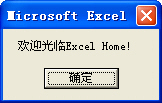

<u>图 73-1</u>	简单的信息提示

:::

### 2）定制个性化的消息框

如果希望 MsgBox 函数显示的消息框具有特定的按钮、图标和标题栏，那么可以使用 MsgBox 函数的 buttons 参数和 title 参数，如下面的代码所示。

```vb
Sub Specialmsbox()
	MsgBox Prompt:="欢迎光临 Excel Home!", _
	Buttons:=vbOKCancel + vbInformation, _
	Title:="Excel Home"
End Sub
```

代码解析：

Specialmsbox 过程使用 MsgBox 函数显示一个具有特定的按钮、图标和标题栏的消息框。

第 3 行代码设置消息框的 Buttons 参数，使消息框显示时具有“确定”、“取消”按钮和信息消息图标。MsgBox 函数的 buttons 参数设置值如表格 73-1 所示。

<u>表格 73-1</u>	MsgBox 函数的 buttons 参数值

<table border="1">
<tr>
  <th>参数组</th>
  <th>常数</th>
  <th>值</th>
  <th>描述</th>
</tr>
<tr>
  <td rowspan="6">第一组设置消息框按钮数目和类型</td>
  <td>vbOKOnly</td>
  <td>0</td>
  <td>只显示“确定”按钮（默认设置）</td>
</tr>
<tr>
  <td>VbOKCancel</td>
  <td>1</td>
  <td>显示“确定”和“取消”按钮</td>
</tr>
<tr>
  <td>VbAbortRetryIgnore</td>
  <td>2</td>
  <td>显示“放弃”、“重试”、和“忽略”按钮</td>
</tr>
<tr>
  <td>VbYesNoCancel</td>
  <td>3</td>
  <td>显示“是”、“否”和“取消”按钮</td>
</tr>
<tr>
  <td>VbYesNo</td>
  <td>4</td>
  <td>显示“是”和“否”按钮</td>
</tr>
<tr>
  <td>VbRetryCancel</td>
  <td>5</td>
  <td>显示“重试”和“取消”按钮</td>
</tr>
<tr>
  <td rowspan="4">第二组设置图标的风格</td>
  <td>VbCritical</td>
  <td>16</td>
  <td>显示危险消息图标</td>
</tr>
<tr>
  <td>VbQuestion</td>
  <td>32</td>
  <td>显示警告询问图标</td>
</tr>
<tr>
  <td>VbExclamation</td>
  <td>48</td>
  <td>显示警告消息图标</td>
</tr>
<tr>
  <td>VbInformation</td>
  <td>64</td>
  <td>显示信息消息图标</td>
</tr>
<tr>
  <td rowspan="4">第三组设置默认按钮</td>
  <td>vbDefaultButton1</td>
  <td>0</td>
  <td>第一个按钮为默认按钮</td>
</tr>
<tr>
  <td>vbDefaultButton2</td>
  <td>256</td>
  <td>第二个按钮为默认按钮</td>
</tr>
<tr>
  <td>vbDefaultButton3</td>
  <td>512</td>
  <td>第三个按钮为默认按钮</td>
</tr>
<tr>
  <td>vbDefaultButton4</td>
  <td>768</td>
  <td>第四个按钮为默认按钮</td>
</tr>
<tr>
  <td rowspan="2">第四组设置消息框特征</td>
  <td>vbApplicationModal</td>
  <td>0</td>
  <td>应用程序模式：用户必须对消息框作出响应才能继续使用当前的应用程序</td>
</tr>
<tr>
  <td>vbSystemModal</td>
  <td>4096</td>
  <td>系统模式：应用程序都被挂起直至用户对消息框作出响应</td>
</tr>
<tr>
  <td rowspan="4">第五组附加选项</td>
  <td>vbMsgBoxHelpButton</td>
  <td>16384</td>
  <td>在消息框上添加“帮助”按钮</td>
</tr>
<tr>
  <td>VbMsgBoxSetForeground</td>
  <td>65536</td>
  <td>将消息框设置为前景窗口</td>
</tr>
<tr>
  <td>vbMsgBoxRight</td>
  <td>524288</td>
  <td>显示右对齐的消息框</td>
</tr>
<tr>
  <td>vbMsgBoxRtlReading</td>
  <td>1048576</td>
  <td>指定在希伯来和阿拉伯语系统中显示的文本应当从右到左阅读</td>
</tr>
</table>

在设定 buttons 参数值时，这些值可以相加使用，但每一组中只能选择一个值。在程序代码中也可以使用 buttons 参数的常数名称，而不必使用实际数值。

第 4 行代码将消息框的 Title 参数设置为“Excel Home”，使消息框的标题栏显示“Excel Home”。

运行 Specialmsbox 过程后，显示一个如图 73-2 所示的消息框，该消息框具有“Excel Home”标题、信息消息图标和“确定”、“取消”按钮并以“确定”按钮作为默认按钮。

::: center


<u>图 73-2</u>	具有特定按钮、图标和标题栏的消息框

:::

### 3）获得消息框的返回值

如果希望能根据用户对于消息框的不同选择，进行相应的操作，可以对消息框的返回值进行判断，如下面的代码所示。

```vb
Private Sub Workbook_BeforeClose(Cancel As Boolean)
	Dim iMsg As Integer
	iMsg = MsgBox("文件即将关闭,是否保存?", 3 + 32)
	Select Case iMsg
		Case 6
			Me.Save
		Case 7
			Me.Saved = True
		Case 2
			Cancel = True
	End Select
End Sub
```

代码解析：

工作簿的 BeforeClose 过程，在关闭工作簿前使用 MsgBox 函数显示一个消息框，并根据用户的回应用进行相应的操作。

第 3 行代码，使用 MsgBox 函数显示一个具有“是”、“否”和“否”按钮的消息框，并把用户的回应，即消息框的返回值赋给变量 iMsg。MsgBox 是一个函数，这意味着它将返回一个值，如果希望获得返回值，可使用和第 3 行相似的代码，此时如果不使用括号将参数封闭起来，则会提示编译错误，如图 73-3 所示。

::: center

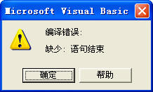

<u>图 73-3</u>	提示编译错误

:::

第 4 行到第 11 行代码，Select Case 结构语句，根据变量 iMsg 的值判断用户的回应，如果变量 iMsg 的值为 6，说明用户选择了“是”按钮，则使用 Save 方法保存工作簿；如果变量 iMsg 的值为 7，说明用户选择了“否”按钮，则将工作簿的 Saved 属性设置为 True，不保存更改而直接关闭工作簿。关于 Save 方法和 Saved 属性请参阅 45-2。如果变量 iMsg 的值为 2，说明用户选择了“取消”按钮，是将 BeforeClose 过程的 Cancel 参数设置为 True，取消关闭工作簿操作。

MsgBox 函数的返回值如表格 73-2 所示，在程序代码中也可以使用常数名称，而不必使用实际数值。

<u>表格 73-2</u>	MsgBox 函数的返回值

| 常数     | 值   | 描述 |
| -------- | ---- | ---- |
| vbOK     | 1    | 确定 |
| vbCancel | 2    | 取消 |
| vbAbort  | 3    | 放弃 |
| vbRetry  | 4    | 重试 |
| vbIgnore | 5    | 忽略 |
| vbYes    | 6    | 是   |
| vbNo     | 7    | 否   |

在关闭本工作簿时将显示一个如图 73-4 所示的消息框，询问用户是否保存，并根据用户的回应用进行相应的操作。

::: center


<u>图 73-4</u>	询问消息框

:::

### 4）在消息框中排版

如果在消息框中显示的字符串很长，比如是一段多行的文字内容，为了达到美观的效果，需要首字缩进，并将各行分隔开来，如下面代码所示。

```vb
Sub Newlinemsbox()
	MsgBox Space(4) & "欢迎来到 ExcelHome 技术论坛，全球最领先的 Excel 技术论坛之一。" & Chr(10) _
		& Space(4) & "在这里，我们讨论 Microsoft	Office 系列产品的应用技术，重点讨论" & Chr(10) _
		& "Microsoft Excel。" & Chr(10) _
		& Space(4) & "本论坛从属于 Excel Home 这一全球最大的华语 Excel 技术门户，目前" & Chr(10) _
		& "是个人、非营利性质的网站学习平台。" & Chr(10) _
		& Space(4) & "Let’s do it better! 这是 Excel Home 的口号，我们的宗旨是帮助大" & Chr(10) _
		& "家解决在使用Office软件中的问题，提升自己的应用技能。"
End Sub
```

代码解析：

Newlinemsbox 过程使用消息框显示一段经过排版后的文本内容。

代码中使用 Space 函数在每段的首字前插入 4 个空格，使首字缩进，在需要换行的地方插入换行符 < Chr(10) > 将各行分隔开来。也可以使用回车符 < Chr(13) >、或是回车与换行符的组合 < Chr(13) & Chr(10) > 换行。

在程序代码中也可以使用 vbCrLf、vbNewLine 等常数，而不必使用 Chr 函数，如表格 73-3 所示。

<u>表格 73-3</u>	回车符与换行符

| 常数      | 等于                                            | 描述               |
| --------- | ----------------------------------------------- | ------------------ |
| vbCrLf    | Chr(13) + Chr(10)                               | 回车符与换行符结合 |
| vbCr      | Chr(13)                                         | 回车符             |
| vbLf      | Chr(10)                                         | 换行符             |
| vbNewLine | Chr(13) + Chr(10) or, on the Macintosh, Chr(13) | 平台指定的新行字符 |

运行 Newlinemsbox 过程，用消息框显示一段经过排版后的文本内容，效果如图 73-5 所示。

::: center

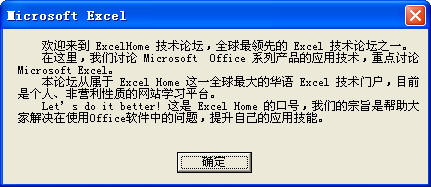

<u>图 73-5</u>	在消息框中排版

:::

### 5）对齐消息框中显示的信息

在用消息框显示如图 73-6 所示的工作表中多行多列的单元格区域时，如果只用换行符 < Chr(10) >等进行换行，而数据列没有对齐，会使显示的信息显得杂乱无章，缺乏可读性，如图 73-7 所示。

::: center

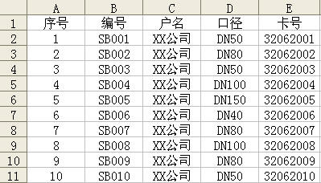

<u>图 73-6</u>	工作表单元格区域

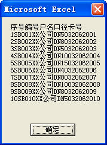

<u>图 73-7</u>	没有对列进行分隔的消息框

:::

为了达到消息框中显示信息各列对齐的效果，在使用换行符 < Chr(10) > 等进行换行的基础上，还需要使用制表符 < Chr(9) > 或常数 vbTab，对数据列进行分隔，使之排列整齐，如下面代码所示。

```vb
Sub Outmsbox()
	Dim sMsg As String
	Dim iRow As Integer
	Dim iCom As Integer
	For iRow = 1 To 11
		For iCom = 1 To 5
			sMsg = sMsg & Cells(iRow, iCom) & Chr(9)
		Next
		sMsg = sMsg & Chr(10)
	Next
	MsgBox sMsg
End Sub
```

代码解析：

Outmsbox 过程使用两层循环读取当前工作表中 `A1:E11` 单元格的内容，并用消息框显示出来。

第 7 行代码，iCom 循环中在把逐列读取的单元格内容赋给变量 myMsg 时插入一个制表符 < Chr(9) >，对列进行分隔。

第 9 行代码，iRow 循环中在读取下一行单元格内容赋给变量 myMsg 时插入一个换行符 < Chr(10) >，对行进行换行。

运行 Outmsbox 过程将用消息框显示当前工作表中 `A1:E11` 单元格区域中的内容，并排列整齐，如图 73-8 所示。

::: center

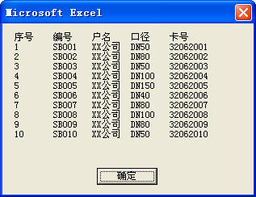

<u>图 73-8</u>	分列显示数据的消息框

:::

## 74、自动关闭的消息框

在程序执行完毕后给用户一个提示信息，但用 MsgBox 函数显示的消息框将一直保持，需要用户单击“确定”或“关闭”按钮才会关闭。如果希望显示的消息框自动关闭，那么可以使用以下方法显示消息框。

### 1）使用 WshShell.Popup 方法显示消息框

```vb
Sub WshShell()
	Dim WshShell As Object
	Set WshShell = CreateObject("Wscript.Shell")
	WshShell.popup "执行完毕!", 2, "提示", 64
	Set WshShell = Nothing
End Sub
```

代码解析：

WshShell 过程使用 WshShell.Popup 方法显示消息框，2 秒后自动关闭。

WshShell.Popup 方法的语法如下：

```vb
WshShell.Popup(strText, [natSecondsToWait], [strTitle], [natType]) = intButton

参数strText是必需的，与Msgbox的Prompt参数类似，代表在消息框中作为信息显示的字符或字符串。如果显示的内容超过一行，可以在每一行之间用换行符（Chr(10)）等将各行分隔开来。
参数natSecondsToWait是可选的，其时间单位为妙。如果提供natSecondsToWait参数且其值大于零，则消息框在natSecondsToWait 参数指定的秒数后关闭。
参数strTitle是可选的，代表在消息框标题栏中作为标题的字符或字符串，若省略，则窗口标题为“Windows 脚本宿主”。
参数natType是可选的，指定消息框中显示按钮的数目及类型、使用的图标样式、缺省按钮以及消息框的强制回应等，与MsgBox函数buttons参数相同，请参阅技巧73-2中的表格73-1。
参数intButton指示用户所单击的按扭编号，与MsgBox函数的返回值相同，请参阅73-3中的表格73-2。若用户在natSecondsToWait 秒之前不单击按扭，则返回值为-1 。
```

运行 WshShell 过程显示一个如图 74-1 所示消息框，无需点击“确定”按纽，2 秒后自动关闭。

::: center


<u>图 74-1</u>	自动关闭的消息框

:::

### 2）使用 API 函数显示消息框

使用 API 函数也可以达到这一效果，如下面的代码所示。

```vb
Public Declare Function SetTimer Lib "user32" ( _
	ByVal hWnd As Long, _
	ByVal nIDEvent As Long, _
	ByVal uElaspe As Long, _
	ByVal lpTimerFunc As Long) As Long
Public Declare Function KillTimer Lib "user32" ( _
	ByVal hWnd As Long, _
	ByVal nIDEvent As Long) As Long
	Dim TID As Long
Sub Test()
	TID = SetTimer(0, 0, 2000, AddressOf CloseTest)
	MsgBox "执行完毕!"
End Sub
Sub CloseTest(ByVal hWnd As Long, ByVal uMsg As Long, ByVal idevent As Long, _
	ByVal Systime As Long)
	Application.SendKeys "~", True
	KillTimer 0, TID
End Sub
```

代码解析：

第 1 行代码到第 9 行代码是 API 函数声明。

Test 过程显示一个消息框并在 3 秒钟后运行 CloseTest 过程。

CloseTest 过程发送一个确定键给 Excel 程序关闭显示的消息框。

运行 Test 过程显示一个如图 74-2 所示的消息框并在 2 秒钟后关闭。

::: center

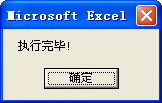

<u>图 74-2</u>	自动关闭的消息框

:::

## 75、使用 InputBox 函数

### 1）简单的数据输入

Excel 的使用过程中，有时需要用户输入简单的数据，此时可以使用 InputBox 函数显示一个对话框，供用户在对话框中输入数据信息，如下面的代码所示。

```vb
Sub myInputBox()
	Dim sInt As String
	Dim r As Integer
	r = Sheet1.Range("A65536").End(xlUp).Row
	sInt = InputBox("请输入人员姓名：")
	If Len(Trim(sInt)) > 0 Then
		Sheet1.Cells(r + 1, 1) = sInt
	Else
		MsgBox "您没有输入内容!"
	End If
End Sub
```

代码解析：

myInputBox 过程使用 InputBox 函数显示一个对话框供用户在对话框中输入数据，InputBox 函数显示一个对话框，等待用户输入正文或按下按钮，并返回包含文本框内容的字符串，语法如下：

```vb
InputBox(prompt[, title] [, default] [, xpos] [, ypos] [, helpfile, context])

参数prompt是必需的，作为对话框消息出现的字符串表达式。
参数title是可选的，作为显示在对话框标题栏中的字符串表达式，如果省略title参数，则在标题栏中显示“Microsoft Excel”。
参数default是可选的，显示在文本框中的字符串表达式，在没有其它输入时作为缺省值，如果省略default参数，则文本框为空。
参数xpos是可选的，指定对话框的左边与屏幕左边的水平距离。如果省略xpos参数，则对话框会在水平方向居中。
参数ypos是可选的，指定对话框的上边与屏幕上边的距离。如果省略ypos参数，则对话框被放置在屏幕垂直方向距下边大约三分之一的位置。
参数helpfile和参数context是可选的，为对话框提供上下文相关的帮助和编号，如果提供了其中一个参数，则必须提供另一个参数，两者缺一不可。
```

第 5 行代码，使用 InputBox 函数显示一个提示用户输入邮政编码的对话框，其中“请输入人员姓名：”是必需的 prompt 参数，其他参数使用缺省值。

第 4 行代码，使用 Len 函数和 Trim 函数判断返回的去除空格后的字符串长度。如果字符串长度大于零，说明用户单击了对话框的“确定”按钮，则将用户输入的数据写到工作表的 A 列单元格。如果返回的是长度为零的字符串，说明用户单击了对话框的“取消”按钮，则显示一条提示消息。

因为当用户单击对话框的“确定”按钮后，InputBox 函数返回包含文本框内容的字符串，如果用户单击对话框的“取消”按钮则返回一个长度为零的字符串（""），通过返回的字符串长度可以判断用户做出的选择。

运行 sInput 过程将显示一个提示用户输入数据的对话框，如图 75-1 所示。

::: center

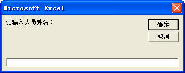

<u>图 75-1</u>	InputBox 函数显示的对话框

:::

### 2）使用对话框输入密码

使用 InputBox 函数显示的对话框输入密码简单方便，但有个明显的缺陷，就是输入过程中不能用占位符显示密码，不够安全。借助 API 函数可以在输入密码过程中以占位符“*”号来显示密码，如下面的代码所示。

```vb
Public Declare Function FindWindow Lib "user32" Alias "FindWindowA" (ByVal lpClassName As String, ByVal lpWindowName As String) As Long
Public Declare Function FindWindowEx Lib "user32" Alias "FindWindowExA" (ByVal hWnd1 As Long, ByVal hWnd2 As Long, ByVal lpsz1 As String, ByVal lpsz2 As String) As Long
Public Declare Function SendMessage Lib "user32" Alias "SendMessageA" (ByVal hwnd As Long, ByVal wMsg As Long, ByVal wParam As Long, lParam As Any) As Long
Public Declare Function timeSetEvent Lib "winmm.dll" (ByVal uDelay As Long, ByVal uResolution As Long, ByVal lpFunction As Long, ByVal dwUser As Long, ByVal uFlags As Long) As Long
Public Declare Function timeKillEvent Lib "winmm.dll" (ByVal uID As Long) As Long
Public Declare Function GetTickCount Lib "kernel32" () As Long
Public Const EM_SETPASSWORDCHAR = &HCC
Public lTimeID As Long
Sub TimeProc(ByVal uID As Long, ByVal uMsg As Long, ByVal dwUser As Long, ByVal dw1 As Long, ByVal dw2 As Long)
	Dim hwd As Long
	hwd = FindWindow("32770", "密码")
	If hwd <> 0 Then
		hwd = FindWindowEx(hwd, 0, "edit", vbNullString)
		SendMessage hwd, EM_SETPASSWORDCHAR, 42, 0
		timeKillEvent lTimeID
	End If
End Sub
Sub Password()
	Dim Password As Variant
	lTimeID = timeSetEvent(10, 0, AddressOf TimeProc, 1, 1)
	Password = InputBox("请输入密码：", "密码")
	If Password = "123456" Then
		MsgBox "密码正确!"
	Else
		MsgBox "密码错误!"
	End If
End Sub
```

代码解析：

Password 程使用 InputBox 函数显示一个输入密码的对话框，并且以占位符“*”号显示输入的密码。

第 1 行到第 8 行代码，API 函数声明。

第 9 行到第 17 行代码，TimeProc 过程是 timeSetEvent 的回调函数，获得对话框句柄。

第 18 行到第 27 行代码，Password 过程显示一个提示用户输入密码的对话框。

运行 Password 过程将显示一个密码输入框，输入的密码以占位符“*”号代替，如图 75-2 所示。

::: center

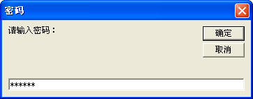

<u>图 75-2</u>	密码输入框

:::

## 76、使用 InputBox 方法

在 Excel 中输入简单的数据可以使用 InputBox 函数显示的对话框，但是如果输入的数据类型不匹配时，过程运行时会产生意外错误。为了避免此类情况发生，可以使用另一种获得用户输入的方式——InputBox 方法。

### 1）输入指定类型的数据

使用 InputBox 方法输入数据时可以指定数据的类型，如下面的代码所示。

```vb
Sub dInput()
	Dim dInput As Double
	Dim r As Integer
	r = Sheet1.Range("A65536").End(xlUp).Row
	dInput = Application.InputBox(Prompt:="请输入数字：", Type:=1)
	If dInput <> False Then
		Sheet1.Cells(r + 1, 1).Value = dInput
	Else
		MsgBox "你已取消了输入!"
	End If
End Sub
```

代码解析：

dInput 过程使用 InputBox 方法显示一个提示用户输入数字的对话框。

InputBox 方法显示一个接收用户输入的对话框，返回此对话框中输入的信息，语法如下：

```
expression.InputBox(Prompt, Title, Default, Left, Top, HelpFile, HelpContextId, Type)

参数expression是必需的，返回一个Application对象。
参数Prompt是必需的，作为对话框消息显示的字符串表达式。
参数Title是可选的，作为显示在对话框标题栏中的字符串表达式。如果省略Title参数，将使用默认的标题。
参数Default是可选的，在对话框显示时出现在文本框中的初始值。如果省略Default参数，则文本框为空。
参数Left是可选的，指定对话框相对于屏幕左上角的 x 坐标。
参数Top是可选的，指定对话框相对于屏幕左上角的 y 坐标。
参数HelpFile和参数HelpContextId是可选的，为对话框提供上下文相关的帮助和编号，如果提供了其中一个参数，则必须提供另一个参数，两者缺一不可。
参数Type是可选的，指定返回的数据类型。如果省略Type参数，对话框将返回文本。
```

InputBox 方法的语法和 InputBox 函数的语法相似，最大的区别在于最后一个参数——Type。通过 Type 参数可以指定返回值的数据类型，表格 76-1 列出了 Type 参数可以使用的数值。

<u>表格 76-1</u>	Type 参数的值

| 数值 | 期望的返回值                |
| ---- | --------------------------- |
| 0    | 一个公式                    |
| 1    | 一个数字                    |
| 2    | 文本（字符串）              |
| 4    | 一个逻辑值，例如true或false |
| 8    | 一个单元格引用              |
| 16   | 一个错误值                  |
| 64   | 一个值的数组                |

这些数值可以相加使用，如果希望返回数字和文本，可以将 Type 参数设置为 1+2。

InputBox 方法与 InputBox 函数相比，优点是内置的出错处理。在第 5 行代码中将 Type 参数值设置为 1，这意味着对话框只能输入数值。当用户输入的不是数值时，显示一个如图 76-1 所示的消息框提示输入错误。

::: center

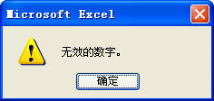

<u>图 76-1</u>	提示输入错误

:::

第 6 行到第 10 行代码，如果用户单击对话框的“确定”按钮，将用户输入的数字写入工作表的 A 列单元格。如果用户单击对话框的“取消”按钮，则显示一条提示消息。

InputBox 方法和 InputBox 函数的另一个区别是，当用户单击“取消”按纽时返回 False 而不是长度为零的字符串。

运行 dInput 过程将显示一个提示用户输入数字的对话框，如图 76-2 所示。

::: center


<u>图 76-2</u>	InputBox 方法显示的对话框

:::

::: tip 注意

在 VBA 代码中，Application.InputBox 调用的是 InputBox 方法，不带对象识别符的 InputBox 调用的是 InputBox 函数。

:::

### 2）获得单元格区域地址

InputBox 方法很适合用户选择工作表单元格区域，并对所选择的单元格区域进行操作，如下面的代码所示。

```vb
Sub RngInput()
	Dim rng As Range
	On Error GoTo line
	Set rng = Application.InputBox("请使用鼠标选择单元格区域：", , , , , , , 8)
	rng.Interior.ColorIndex = 15
line:
End Sub
```

代码解析：

RngInput 过程使用 InputBox 方法显示一个对话框，提示用户在工作表中选择一个单元格区域，并改变所选单元格区域内部的颜色。

第 3 行代码，错误处理语句。因为当对话框显示后，如果用户单击“取消”按钮，将显示一错误信息，如图 76-3 所示，所以必需使用 On Error GoTo 语句来绕过错误。

::: center

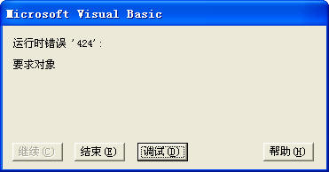

<u>图 76-3</u>	提示运行错误

:::

第 4 行代码，使用 Set 语句将用户选择的单元格区域赋给变量 rng。当 Type 参数设置为 8 时，将返回一个 Range 对象，必须用 Set 语句将结果指定给一个 Range 对象。

第 5 行代码，改变用户所选单元格区域内部的颜色。

运行 RngInput 过程，将显示一个对话框，提示用户在工作表中选择一个单元格区域，并改变所选单元格区域内部的颜色，如图 76 4 所示。

::: center

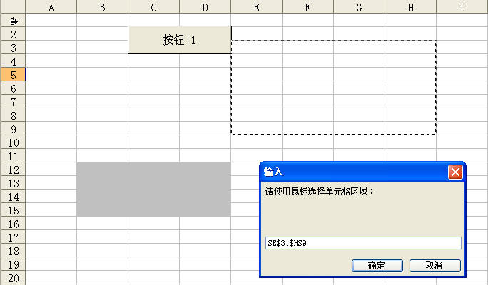

<u>图 76-4</u>	使用 InputBox 方法获得区域地址

:::

## 77、内置对话框

### 1）调用内置的对话框

如果需要使用“打开”、“打印”等 Excel 内置对话框已经具有的功能，可以使用代码直接调用这些内置的对话框，如下面的代码所示。

```vb
Sub DialogOpen()
	Application.Dialogs(xlDialogOpen).Show arg1:=ThisWorkbook.Path & "\*.xls"
End Sub
```

代码解析：

DialogOpen 过程显示内置的“打开”对话框并选定示例所在的文件夹。

显示内置对话框语法如下：

```vb
Application.Dialogs(xlDialogConst).Show

Dialogs集合代表所有的内置对话框，每个Dialog对象代表一个内置对话框，不能新建内置对话框或向该集合中添加内置对话框。
参数xlDialogConst是内置对话框的内置常量，每个常量都以“xlDialog”开头，其后是对话框的名称，如“打开”对话框的常量为“xlDialogOpen”。常用内置对话框的内置常量如表格77-1所示。
```

<u>表格 77-1</u>	内置对话框的内置常量

| 常量                          | 值   | 说明                         |
| ----------------------------- | ---- | ---------------------------- |
| xlDialogActiveCellFont        | 476  | 单元格格式(字体）            |
| xlDialogBorder                | 45   | 单元格格式(边框）            |
| xlDialogCellProtection        | 46   | 单元格格式(保护）            |
| xlDialogDeleteFormat          | 111  | 单元格格式(数字）            |
| xlDialogFormatNumber          | 42   | 单元格格式(数字）            |
| xlDialogPatterns              | 84   | 单元格格式(图案）            |
| xlDialogClear                 | 52   | 清除                         |
| xlDialogColumnWidth           | 47   | 列宽                         |
| xlDialogRowHeight             | 127  | 行高                         |
| xlDialogConditionalFormatting | 583  | 条件格式                     |
| xlDialogDefineName            | 61   | 定义名称                     |
| xlDialogDefineStyle           | 229  | 样式                         |
| xlDialogDisplay               | 27   | 显示选项                     |
| xlDialogFont                  | 26   | 字体                         |
| xlDialogSetBackgroundPicture  | 509  | 工作表背景                   |
| xlDialogInsert                | 55   | 插入                         |
| xlDialogInsertHyperlink       | 596  | 插入超链接                   |
| xlDialogInsertPicture         | 342  | 插入图片                     |
| xlDialogNew                   | 119  | 新建工作簿                   |
| xlDialogOpen                  | 1    | 打开                         |
| xlDialogSaveAs                | 5    | 另存为                       |
| xlDialogWorkbookCopy          | 283  | 移动或复制工作表（建立副本） |
| xlDialogWorkbookInsert        | 354  | 插入工作表                   |
| xlDialogWorkbookMove          | 282  | 移动或复制工作表             |
| xlDialogWorkbookName          | 386  | 重命名工作表                 |
| xlDialogWorkbookNew           | 302  | 新建工作表                   |
| xlDialogWorkbookProtect       | 417  | 保护工作簿                   |
| xlDialogPageSetup             | 7    | 页面设置                     |
| xlDialogPrint                 | 8    | 打印内容                     |
| xlDialogPrinterSetup          | 9    | 打印机设置                   |
| xlDialogPrintPreview          | 222  | 打印预览                     |
| xlDialogSetPrintTitles        | 23   | 设置打印标题                 |
| xlDialogRun                   | 17   | 宏                           |
| xlDialogTable                 | 41   | 模拟运算表                   |
| xlDialogSendMail              | 189  | 发送邮件                     |

显示内置对话框使用 Show 方法，应用于 Dialog 对象的 Show 方法语法如下：

```vb
expression.Show(Arg1, Arg2, Arg3, Arg4, Arg5, Arg6, Arg7, Arg8, Arg9, Arg10, Arg11, Arg12, Arg13, Arg14, Arg15, Arg16, Arg17, Arg18, Arg19, Arg20, Arg21, Arg22, Arg23, Arg24, Arg25, Arg26, Arg27, Arg28, Arg29, Arg30)

参数expression是必需的，返回Dialog对象之一。
参数arg1到参数arg30是可选的，仅应用于内置对话框，是命令的初始参数。若要查找要设置的参数，请在内置对话框参数列表中查找对应的对话框常量。
```

运行 alogOpen 过程，显示内置的“打开”对话框，并且直接选定示例所在的文件夹，如图 77-1 所示。

::: center

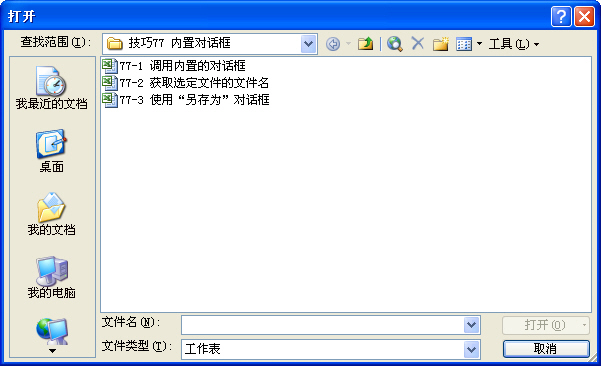

<u>图 77-1</u>	使用内置对话框

:::

### 2）获取选定文件的文件名

如果只希望获取用户在显示的内置 “打开”对话框中选定文件的文件名，而不想真正打开该文件，那么可以使用 GetOpenFilename 方法，如下面的代码所示。

```vb
Sub OpenFilename()
	Dim Filename As Variant
	Dim mymsg As Integer
	Dim i As Integer
	Filename = Application.GetOpenFilename(Title:="删除文件", MultiSelect:=True)
	If IsArray(Filename) Then
		mymsg = MsgBox("是否删除所选文件?", vbYesNo, "提示")
		If mymsg = vbYes Then
			For i = 1 To UBound(Filename)
				Kill Filename(i)
			Next
		End If
	End If
End Sub
```

代码解析：

OpenFilename 过程使用 GetOpenFilename 方法显示标准的内置“打开”对话框，获取用户选定文件的文件名后使用 Kill 语句删除。

GetOpenFilename 方法显示标准的内置“打开”对话框，获取文件名，语法如下：

```vb
expression.GetOpenFilename(FileFilter, FilterIndex, Title, ButtonText, MultiSelect)

参数expression是必需的，返回一个Application对象。
参数FileFilter是可选的，指定文件筛选条件的字符串。如果省略，则默认参数值为“所有文件(*.*)”。
参数FilterIndex是可选的，指定默认文件筛选条件的索引号，取值范围为 1 到由 FileFilter 所指定的筛选条件数目。如果省略，或者取值大于可用筛选数目，则采用第一个文件筛选条件。
参数Title是可选的，指定对话框的标题。如果省略，则使用“打开”作为标题。
参数ButtonText是可选的，仅用于Macintosh。
参数MultiSelect是可选的，如果该值为True，则允许选定多个文件名，如果该值为False，则只允许选定单个文件名。默认值为False。
```

第 5 行代码显示标准的“打开”对话框，将对话框的标题设置为“删除文件”，将 MultiSelect 参数设置为 True，允许选定多个文件。

第 6 行代码，获得返回值。当用户选定文件后，返回的是选定的文件名或用户输入的文件名。因为 MultiSelect 参数已设置为 True，所以返回值将是一个包含所有选定文件名的数组（即使仅选定了一个文件名）。如果用户取消了对话框，则该值为 False。

第 8 行到第 12 行代码，经询问用户后使用 Kill 语句从磁盘中删除用户选定的文件。

运行 OpenFilename 过程，显示标准的内置“打开”对话框，删除用户选定的文件，如所图 77-2示。

::: center

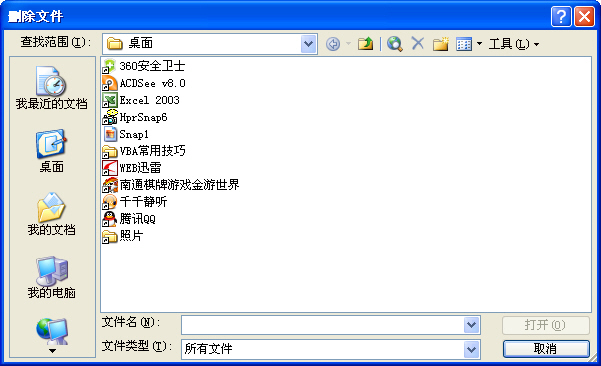

<u>图 77-2</u>	使用内置对话框

:::

::: tip 注意

VBA 中数组下界默认从 0 开始，但使用 GetOpenFilename 方法选择多个文件时返回的包含选定文件名的数组下界是从 1 开始。

:::

### 3）使用“另存为”对话框

在备份文件时可以使用 GetSaveAsFilename 方法显示标准的内置“另存为”对话框，获取备份文件的文件名和保存路径，而无须真正保存任何文件。如下面的代码所示。

```vb
Sub CopyFilename()
	Dim NowWorkbook As Workbook
	Dim FileName As String
	On Error GoTo line
	FileName = Application.GetSaveAsFilename _
		(InitialFileName:="D:\" & Date & " " & ThisWorkbook.Name, _
		fileFilter:="Excel files(*.xls),*.xls,All files (*.*),*.*", _
		Title:="数据备份")
	If FileName <> "False" Then
		Set NowWorkbook = Workbooks.Add
		With NowWorkbook
			.SaveAs FileName
			ThisWorkbook.Sheets("Sheet2").UsedRange.Copy _
			.Sheets("Sheet1").Range ("A1")
			.Save
		End With
		GoTo line
	End If
	Exit Sub
line:
	ActiveWorkbook.Close
End Sub
```

代码解析：

CopyFilename 过程使用 GetSaveAsFilename 方法显示标准的内置“另存为”对话框，获取备份文件的文件名和保存路径，新建工作簿保存备份数据。

第 4 行代码，错误处理语句。备份过程中，如果已存在同名工作簿，会出现如图 77-3 所示的提示，如果选择了“否”，此时新工作簿已经建立，在执行第 12 行代码时发生错误，使程序中断，所以使用 GoTo 语句执行第 21 行代码，关闭新建立的工作簿。

::: center

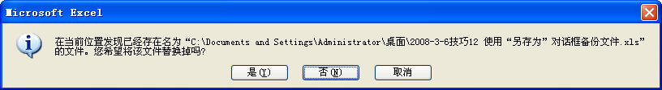

<u>图 77-3</u>	文件已存在提示

:::

第 5 行代码，使用 GetSaveAsFilename 方法显示标准的内置“另存为”对话框。GetSaveAsFilename 方法的语法如下：

```vb
expression.GetSaveAsFilename(InitialFilename, FileFilter, FilterIndex, Title, ButtonText)

参数expression是必需的，返回一个Application对象。
参数InitialFilename是可选的，指定建议的文件名。如果省略，将活动工作簿的名称作为建议的文件名。
参数FileFilter是可选的，指定文件筛选条件的字符串。
参数FilterIndex是可选的，指定默认文件筛选条件的索引号，取值范围为 1 到 FileFilter 指定的筛选条件数目之间。如果省略，或者取值大于可用筛选数目，则采用第一个文件筛选条件。
参数Title是可选的，指定对话框标题。如果省略，则使用默认标题。
参数ButtonText是可选的，仅用于 Macintosh。
```

第 6 行代码，设置对话框的保存路径为 D 盘，保存文件名为日期加工作簿名称。

第 7 行代码，设置对话框文件保存类型为 Excel 文件类型。如果需要设置为文本类型需设置为“文本文件(\*.txt), \*.txt”，而如果是图片文件则需设置为“图片文件(\*.bmp;\*.jpg),\*.bmp;\*.jpg”。

第 8 行代码，设置对话框的标题为“数据备份”。

第 9 行代码，如果用户没有取消操作。

第 10 行到第 16 行代码，使用 Add 方法新建工作簿保存到对话框选定的路径中，将数据备份到新工作簿中。

第 17 行代码，使用 GoTo 语句执行第 21 行代码，关闭新建工作簿和开启屏幕刷新。

运行 CopyFilename 过程，显示内置“另存为”对话框，供用户备份工作簿数据，如图 77-4 所示。

::: center

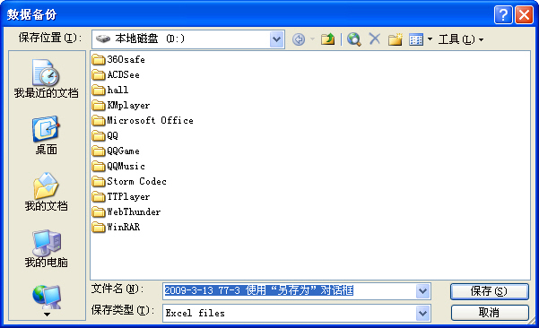

<u>图 77-4</u>	使用“另存为”对话框备份文件

:::

## 78、调用操作系统“关于”对话框

VBA 程序开发完成后，有时需要一个“关于”对话框，除了使用窗体外，还可以调用操作系统的“关于”对话框，显示自定义的内容，如下面的代码所示。

```vb
Private Declare Function ShellAbout Lib "shell32.dll" Alias "ShellAboutA" ( _
		ByVal hwnd As Long, ByVal szApp As String, _
		ByVal szOtherStuff As String, ByVal hIcon As Long) As Long
Private Declare Function FindWindow Lib "user32" Alias "FindWindowA" ( _
		ByVal lpClassName As String, ByVal lpWindowName As String) As Long
Private Sub CommandButton1_Click()
	Dim ApphWnd As Long
	ApphWnd = FindWindow("XLMAIN", Application.Caption)
	ShellAbout ApphWnd, "财务处理系统", "yuanzhuping@yeah.net	0513-86548930", 0
End Sub
```

代码解析：

第 1 行到第 5 行代码是 API 函数声明。

第 8、9 行代码调用操作系统的“关于”对话框并显示自定义的内容。

代码运行后显示如图 78-1 所示的对话框。

::: center

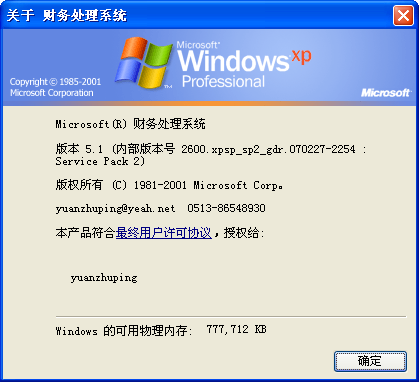

<u>图 78-1</u>	调用操作系统的“关于”对话框

:::

