## 79、在菜单中添加菜单项

在 Excel 工作表的菜单中可以添加新的菜单项和子菜单，如下面的代码所示。

```vb
Sub myTools()
	Dim myTools As CommandBarPopup
	Dim myCap As Variant
	Dim myid As Variant
	Dim i As Byte
	myCap = Array("基础应用", "VBA程序开发", "函数与公式", "图表与图形", "数据透视表")
	myid = Array(281, 283, 285, 287, 292)
	With Application.CommandBars("Worksheet menu bar")
		.Reset
		Set myTools = .Controls("帮助(&H)").Controls.Add(Type:=msoControlPopup, Before:=1)
		With myTools
			.Caption = "Excel Home 技术论坛"
			.BeginGroup = True
			For i = 1 To 5
				With .Controls.Add(Type:=msoControlButton)
					.Caption = myCap(i - 1)
					.FaceId = myid(i - 1)
					.OnAction = "myC"
			End With
			Next
		End With
	End With
	Set myTools = Nothing
End Sub
```

代码解析：

myTools 过程使用 Add 方法在 Excel 工作表菜单栏中的“帮助”菜单中添加一个标题为“Excel Home 技术论坛”的菜单项和 5 个子菜单。

第 2 行到第 5 行代码声明变量类型。

第 6、7 行代码使用 Array 函数创建两个数组用于保存子菜单的名称和图标 ID。

第 9 行代码，在添加菜单项前先使用 Reset 方法重置菜单栏以免重复添加菜单项。Reset 方法重置一个内置控件，恢复该控件原来对应的动作，并将各属性恢复成初始状态，语法如下：

```vb
expression.Reset

参数expression 是必需的，返回一个命令栏或命令栏控件对象。
```

第 10 行代码，使用 Add 方法在 Excel 工作表菜单栏中的“帮助”菜单中添加菜单项。Add 方法应用于 CommandBarControls 对象时，新建一个 CommandBarControl 对象并添加到指定命令栏上的控件集合，语法如下：

```vb
expression.Add(Type, Id, Parameter, Before, Temporary)

参数expression 是必需的，返回一个CommandBarControls对象，代表命令栏中的所有控件。
参数Type是可选的，添加到指定命令栏的控件类型，可以为表格 791所列的MsoControlType常数之一。
```

<u>表格 79-1</u>	MsoControlType 常数

| 常数               | 值   | 控件类型       |
| ------------------ | ---- | -------------- |
| msoControlButton   | 1    | 命令按钮       |
| msoControlEdit     | 2    | 文本框         |
| msoControlDropdown | 3    | 下拉列表控制框 |
| msoControlComboBox | 4    | 下拉组合控制框 |
| msoControlPopup    | 10   | 弹出式控件     |

因为在本例中将添加的是带有子菜单的菜单项，所以将参数 Type 设置为弹出式控件。

参数 Id 是可选的，标识整数。如果将该参数设置为 1 或者忽略，将在命令栏中添加一个空的指定类型的自定义控件。

参数 Parameter 是可选的，对于内置控件，该参数用于容器应用程序运行命令。对于自定义控件，可以使用该参数向 Visual Basic 过程传递信息，或用其存储控件信息。

参数 Before 是可选的，表示新控件在命令栏上位置的数字。新控件将插入到该位置控件之前。如果忽略该参数，控件将添加到指定命令栏的末端。本例中将 Before 参数设置为 1，菜单项添加到“帮助”菜单的顶端。

参数 Temporary 是可选的。设置为 True 将使添加的菜单项为临时的，在关闭应用程序时删除。默认值为 False。

第 12 行代码，设定新添加菜单项的 Caption 属性为“Excel Home 技术论坛”。Caption 属性返回或设置命令栏控件的标题。

第 13 行代码，设置新添加菜单项的 BeginGroup 属性为 True，分组显示。

第 14 行到第 19 行代码，在“Excel Home 技术论坛”菜单项上添加五个子菜单并设置其 Caption 属性、FaceId 属性和 OnAction 属性。

FaceId 属性设置出现在菜单标题左侧的图标，以数字表示，一个数字代表一个内置的图标。

OnAction 属性设置一个 VBA 的过程名，该过程在用户单击子菜单时运行，本例中设置为下面的过程。

```vb
Public Sub myC()
	MsgBox "您选择了： " & Application.CommandBars.ActionControl.Caption
End Sub
```

代码解析：

myC 过程是单击新添加子菜单所运行过程，为了演示方便在这里只使用 MsgBox 函数显示所其 Caption 属性。

删除新添加的菜单项及子菜单的代码如下所示。

```vb
Sub DelmyTools()
	Application.CommandBars("Worksheet menu bar").Reset
End Sub
```

代码解析：

DelmyTools 过程使用 Reset 方法重置菜单栏，删除添加的菜单项及子菜单。

为了在打开工作簿时自动添加菜单项，需要在工作簿的 Activate 事件中调用 myTools 过程，如下面的代码所示。

```vb
Private Sub Workbook_Activate()
	Call myTools
End Sub
```

为了在关闭工作簿时删除新添加的菜单项，还需要在工作簿的 Deactivate 事件中调用 DelmyTools 过程，如下面的代码所示。

```vb
Private Sub Workbook_Deactivate()
	Call DelmyTools
End Sub
```

如果希望这个菜单为所有工作簿使用，那么就应该在工作簿的 Open 事件中调用 myTools 过程，在 BeforeClose 事件中调用 DelmyTools 过程。

运行 myTools 过程，将在 Excel 工作表菜单栏中的“帮助”菜单中添加一个名为“Excel Home 技术论坛”的菜单项及五个子菜单，如图 79-1 所示。

::: center

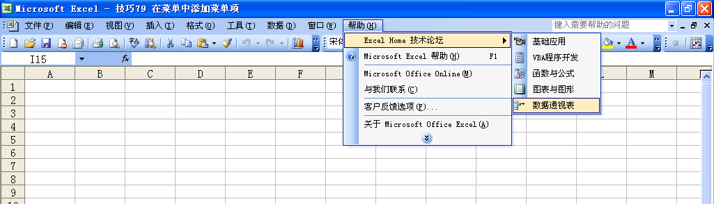

<u>图 79-1</u>	在“帮助”菜单中添加菜单项及子菜单

:::

## 80、在菜单栏指定位置添加菜单

除了可以在工作表菜单中添加菜单项外，还可以在工作表菜单栏的指定位置添加菜单，如下面的代码所示。

```vb
Sub AddNewMenu()
	Dim HelpMenu As CommandBarControl
	Dim NewMenu As CommandBarPopup
	With Application.CommandBars("Worksheet menu bar")
		.Reset
		Set HelpMenu = .FindControl(ID:=.Controls("帮助(&H)").ID)
		If HelpMenu Is Nothing Then
			Set NewMenu = .Controls.Add(Type:=msoControlPopup)
		Else
			Set NewMenu = .Controls.Add(Type:=msoControlPopup, _
				Before:=HelpMenu.Index)
		End If
		With NewMenu
			.Caption = "统计(&S)"
			With .Controls.Add(Type:=msoControlButton)
				.Caption = "输入数据(&D)"
				.FaceId = 162
				.OnAction = ""
			End With
			With .Controls.Add(Type:=msoControlButton)
				.Caption = "汇总数据(&T)"
				.FaceId = 590
				.OnAction = ""
			End With
		End With
	End With
	Set HelpMenu = Nothing
	Set NewMenu = Nothing
End Sub
```

代码解析：

AddNewMenu 过程使用 Add 方法在工作表“帮助”菜单前添加一个标题为“统计”的菜单和两个菜单项。

第 6 行代码，使用 FindControl 方法在工作表菜单栏中查找“帮助”菜单。应用于 CommandBars 对象的 FindControl 方法返回一个符合指定条件的 CommandBarControl 对象。语法如下：

```vb
expression.FindControl(Type, Id, Tag, Visible, Recursive)

参数expression是必需的，返回一个CommandBars对象。
参数Type是可选的，要查找控件的类型。
参数Id是可选的，要查找控件的标识符。
参数Tag是可选的，要查找控件的标记值。
参数Visible是可选，如果该值为True，那么只查找屏幕上显示的命令栏控件。默认值为False。
参数Recursive是可选的，如果该值为True，那么将在命令栏及其全部弹出式子工具栏中查找。此参数仅应用于CommandBar对象。默认值为False。
```

如果没有控件符合搜索条件，那么 FindControl 方法返回 Nothing。

第 7 行到第 12 行代码，如果工作表菜单栏中存在“帮助”菜单，将“统计”菜单添加到“帮助”菜单之前，否则添加到工作表菜单栏末尾。

第 12 行到第 25 行代码，在“统计”菜单中添加两个子菜单并设置其各种属性。

运行 AddNewMenu 过程，将在工作表菜单栏的“帮助”菜单之前添加一个“统计”菜单，如图 80-1 所示。

::: center

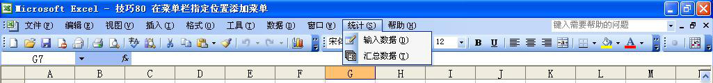

<u>图 80-1</u>	在工作表菜单栏中添加菜单

:::

## 81、屏蔽和删除工作表菜单

如果不希望用户使用工作表菜单栏的部分功能，可以把菜单或菜单项屏蔽或删除，如下面的代码所示。

```vb
Sub Shibar()
	With Application.CommandBars("Worksheet menu bar")
		.Reset
		.Controls("工具(&T)").Controls("宏(&M)").Enabled = False
		.Controls("数据(&D)").Delete
	End With
End Sub
```

代码解析：

Shibar 过程屏蔽 “工具”菜单中的“宏”菜单项，删除菜单栏中的“数据”菜单。

第 3 行代码，使用 Reset 方法重置工作表菜单栏。

第 4 行代码，将“宏”菜单项的 Enabled 属性设置为 False，使之无效。

Enabled 属性决定命令栏或命令栏控件是否激活，如果将该属性设置为 False，那么该菜单项将无效。

第 5 行代码，使用 Delete 方法将“数据”菜单从工作表菜单栏中删除。

Delete 方法应用于命令栏或命令栏控件时，从集合中删除指定对象，语法如下：

```vb
expression.Delete(Temporary)

参数expression是必需的，返回命令栏或命令栏控件对象之一。
参数Temporary是可选的，设置为True将从当前会话中删除控件，应用程序在下次会话时将再次显示控件。
```

运行 Shibar 过程，将屏蔽工作表“工具”菜单中的“宏”菜单项和删除工作表菜单栏中的“数据”菜单，如图 81-1 所示。

::: center

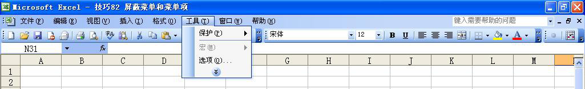

<u>图 81-1</u>	屏蔽和删除工作表菜单

:::

## 82、改变系统菜单的操作

利用 VBA 甚至可以改变系统菜单的默认操作，使之达到自定义菜单的效果，如下面的代码所示。

```vb
Dim WithEvents Saveas As CommandBarButton
Private Sub Workbook_Open()
	Set Saveas = Application.CommandBars("File").Controls("另存为(&A)...")
End Sub
Private Sub Saveas_Click(ByVal Ctrl As Office.CommandBarButton, CancelDefault As Boolean)
	CancelDefault = True
	MsgBox "本工作簿禁止另存!"
End Sub
```

代码解析：

第 1 行代码，在模块级别中使用关键词 WithEvents 声明变量 Saveas 是用来响应由 CommandBarButton 对象触发事件的对象变量。

第 2 行到第 4 代码工作簿的 Open 事件过程，在工作簿打开时将变量 Saveas 赋值为系统菜单的“另存为”菜单。

因为在声明变量 Saveas 时使用了关键词 WithEvents，不能同时使用 New 关键词隐式地创建对象，所以在使用变量 Saveas 之前，必须使用 Set 语句将变量赋值为一个已有对象。

第 5 行到第 8 代码变量 Saveas 的单击事件过程，改变系统菜单“另存为”的默认操作。

变量 Saveas 的 Click 事件在用户单击系统菜单“另存为”时发生，语法如下：

```vb
Private Sub CommandBarButton_Click(ByVal Ctrl As CommandBarButton,ByVal CancelDefault As Boolean)

参数Ctrl是必需的，指示初始化该事件的CommandBarButton控件。
参数CancelDefault是必需的，Boolean类型，如果执行了与CommandBarButton控件关联的默认操作，该值为False。除非其他过程或加载项取消了此操作。
```

第 6、7 行代码，将 CancelDefault 参数设置为 True，使单击“另存为”菜单时并不执行默认操作而只显示一个消息框。

将工作簿保存、关闭后，重新打开，单击“另存为”菜单并不执行默认操作，只显示一个消息框，如图 82-1 所示。

::: center

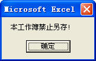

<u>图 82-1</u>	改变系统菜单的默认操作

:::

## 83、定制自己的系统菜单

使用 VBA 开发的小型应用系统完成后，Excel 原有的菜单栏完全可以舍弃不用，只使用自定义的菜单栏，更加方便快捷，如下面的代码所示。

```vb
Sub AddNowBar()
	Dim NewBar As CommandBar
	On Error Resume Next
	With Application
		.CommandBars("Standard").Visible = False 
		.CommandBars("Formatting").Visible = False 
		.CommandBars("Stop Recording").Visible = False
		.CommandBars("toolbar list").Enabled = False
		.CommandBars.DisableAskAQuestionDropdown = True
		.DisplayFormulaBar = False 
		.CommandBars("NewBar").Delete
	End With
	Set NewBar = Application.CommandBars.Add(Name:="NewBar", Position:=msoBarTop, MenuBar:=True, Temporary:=True)
	With NewBar
		.Visible = True
		With .Controls.Add(Type:=msoControlPopup)
			.Caption = "系统设置(&X)"
			.BeginGroup = True
			With .Controls.Add(Type:=msoControlButton)
				.Caption = "保存(&S)"
				.BeginGroup = True
				.FaceId = 1975
			End With
			With .Controls.Add(Type:=msoControlButton)
				.Caption = "备份(&B)"
				.BeginGroup = True
				.FaceId = 747
			End With
		End With
		With .Controls.Add(Type:=msoControlPopup)
			.Caption = "会计凭证(&P)"
			.BeginGroup = True
			With .Controls.Add(Type:=msoControlButton)
				.Caption = "录入(&L)"
				.BeginGroup = True
				.FaceId = 197
			End With
			With .Controls.Add(Type:=msoControlButton)
				.Caption = "审核(&S)"
				.BeginGroup = True
				.FaceId = 714
			End With
		End With
		With .Controls.Add(Type:=msoControlPopup)
			.Caption = "会计账簿(&Z)"
			.BeginGroup = True
			With .Controls.Add(Type:=msoControlButton)
				.Caption = "记账(&L)"
				.BeginGroup = True
				.FaceId = 65
			End With
			With .Controls.Add(Type:=msoControlButton)
				.Caption = "结账(&S)"
				.BeginGroup = True
				.FaceId = 47
			End With
		End With
		With .Controls.Add(Type:=msoControlPopup)
			.Caption = "会计报表(&B)"
			.BeginGroup = True
			With .Controls.Add(Type:=msoControlPopup)
				.Caption = "资产负债表(&Y)"
				.BeginGroup = True
				With .Controls.Add(Type:=msoControlButton)
					.Caption = "月报(&M)"
					.BeginGroup = True
					.FaceId = 1180
				End With
					With .Controls.Add(Type:=msoControlButton)
						.Caption = "年报(&Y)"
						.BeginGroup = True
						.FaceId = 1188
					End With
				End With
			With .Controls.Add(Type:=msoControlPopup)
				.Caption = "损益表(&S)"
				.BeginGroup = True
				With .Controls.Add(Type:=msoControlButton)
					.Caption = "月报(&M)"
					.BeginGroup = True
					.FaceId = 1180
				End With
				With .Controls.Add(Type:=msoControlButton)
					.Caption = "年报(&Y)"
					.BeginGroup = True
					.FaceId = 1188
				End With
			End With
		End With
		With .Controls.Add(Type:=msoControlButton)
			.Caption = "退出系统(&C)"
			.BeginGroup = True
			.Style = msoButtonCaption
		End With
	End With
	Set NewBar = Nothing
End Sub
```

代码解析：

AddNowBar 过程使用 Add 方法创建自定义菜单栏替换工作表菜单栏。

第 2 行代码定义变量 NwBar 为命令栏。

第 3 行代码忽略错误语句，以免第 11 行代码在删除可能不存在的“NewBar”菜单栏时发生错误。

第 5 行代码隐藏“常用”工具栏。

第 6 行代码隐藏“格式”工具栏。

第 7 行代码隐藏“停止录制”工具栏。

第 8 行代码屏蔽工具栏的右键快捷菜单。

第 9 行代码屏蔽工具栏的“键入需要帮助的问题”下拉框。

第 10 行代码屏蔽工具栏的编辑栏。

第 11 行代码，在添加命令栏前先删除“NewBar”菜单栏，以免重复增加。

第 13 行代码，使用 Add 方法创建命令栏。Add 方法应用于 CommandBars 对象的语法如下：

```vb
expression.Add(Name, Position, MenuBar, Temporary)

参数expression是必需的，返回一个CommandBars对象，该对象代表应用程序中的命令栏，新建命令栏的控件均以该对象为载体。
参数Name是可选的，设置新建命令栏的标题。如果忽略该参数，则为新建命令栏指定默认标题，本例中设置新建命令栏的标题为“NewBar”。
参数Position是可选的，设置新建命令栏的位置或类型，可以为表格 831所列的 MsoBarPosition常数之一。
参数MenuBar是可选的，设置为True 将以新命令栏替换活动菜单栏，默认值为False。
参数Temporary是可选的，设置为True将使新建命令栏为临时命令栏，在关闭应用程序时删除，默认值为False。
```

<u>表格 83-1</u>	MsoBarPosition 常数

| 常数                                               | 说明                                     |
| -------------------------------------------------- | ---------------------------------------- |
| msoBarLeft、msoBarTop、msoBarRight 和 msoBarBottom | 指定新命令栏的左侧、顶部、右侧和底部坐标 |
| msoBarFloating                                     | 指定新命令栏不固定                       |
| msoBarPopup                                        | 指定新命令栏为快捷菜单                   |
| msoBarMenuBar                                      | 仅适用于 Macintosh 机                    |

本例中设置“NewBar”命令栏的 Position 参数为 msoBarTop，使“NewBar”命令栏位于 Excel 窗口的顶部。

在本例中，设置“NewBar”命令栏的 MenuBar 属性为 True，以“NewBar”命令栏替换活动菜单栏。

在本例中，设置“NewBar”命令栏的 Temporary 属性为 True，使“NewBar”命令栏为临时命令栏，在关闭应用程序时删除。

第 15 行代码，设置“NewBar”命令栏为可见的。

第 16 行到 95 行代码，使用 Add 方法在“NewBar”命令栏中添加菜单、菜单项及子菜单并设置其各项属性，参阅 79 。

恢复 Excel 原有的菜单栏的代码如下：

```vb
Sub DelNowBar()
	On Error Resume Next
	With Application
		.CommandBars("Standard").Visible = True
		.CommandBars("Formatting").Visible = True
		.CommandBars("Stop Recording").Visible = True
		.CommandBars("toolbar list").Enabled = True
		.CommandBars.DisableAskAQuestionDropdown = False
		.DisplayFormulaBar = True
		.CommandBars("NewBar").Delete
	End With
End Sub
```

代码解析：

DelNowBar 过程取消 “常用”、“格式”和“停止录制”工具栏的的隐藏，恢复“键入需要帮助的问题”下拉框和编辑栏，删除“NewBar”命令栏。

运行 AddNowBar 过程，工作表菜单栏如图 83-1 所示。

::: center

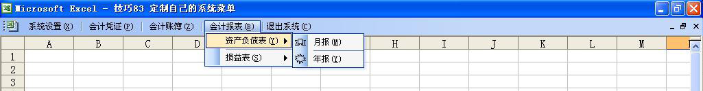

<u>图 83-1</u>	定制自己的系统菜单

:::

## 84、改变菜单按钮图标

利用 VBA 可以改变系统菜单的默认图标，使之达到自定义按钮图标的效果，如下面的代码所示。

```vb
Sub myCbarCnt()
	Dim myCbarCnt As CommandBarControl
	With Sheet1.Shapes.AddShape(17, 1000, 1000, 30, 30)
		.Fill.ForeColor.SchemeColor = 29
		.CopyPicture
		.Delete
	End With
	Set myCbarCnt = Application.CommandBars("Standard").Controls(1)
	myCbarCnt.PasteFace
	Set myCbarCnt = Nothing
End Sub
Sub DelmyCbarCnt()
	Application.CommandBars("Standard").Controls(1).Reset
End Sub
```

代码解析：

myCbarCnt 过程改变系统菜单的“新建”按钮的图标。

第 3 行代码使用 Shape 对象的 AddShape 方法在工作表中新建一个自选图形。应用于 Shape 对象的 AddShape 方法请参阅 53 。

在本例中将新建图形的 Left 参数和 Top 参数设置为较大的数值使新建的自选图形不在当前窗口的可视区域内。

第 4 行代码设置新建自选图形的颜色。

第 5 行代码使用 CopyPicture 方法将新建自选图形作为图片复制到剪贴板。CopyPicture 方法的语法如下：

```vb
expression.CopyPicture(Appearance, Format)

参数expression是必需的，一个有效的对象。
参数Appearance是可选的，指定图片的复制方式。
参数Format是可选的，图片的格式。
```

第 6 行代码使用 Delete 方法删除新建的自选图形。

第 8 行代码使用 Set 语句将系统菜单的“新建”按钮赋给变量 myCbarCnt。

第 9 行代码 PasteFace 方法将新建的自选图形粘贴到“新建”按钮中。PasteFace 方法将“剪贴板”的内容粘贴到指定命令栏按钮控件上，语法如下：

```vb
expression.PasteFace

参数expression是必需的，返回一个CommandBarButton对象。
```

DelmyCbarCnt 过程使用 Reset 方法恢复“新建”按钮的默认图标。

运行 myCbarCnt 过程结果如图 84-1 所示。

::: center


<u>图 84-1</u>	定制自己的系统菜单

:::

## 85、右键快捷菜单增加菜单项

在 Excel 的右键快捷菜单中可以添加新的菜单项，如下面的代码所示。

```vb
Sub MyCmb()
	Dim MyCmb As CommandBarButton
	With Application.CommandBars("Cell")
		.Reset
		Set MyCmb = .Controls.Add(Type:=msoControlButton, _
			ID:=2521, Before:=.Controls.Count, Temporary:=True)
			MyCmb.BeginGroup = True
		End With
	Set MyCmb = Nothing
End Sub
```

代码解析：

MyCmb 过程使用 Add 方法在 Excel 的右键快捷菜单中添加内置的“打印”菜单项。

在使用 Add 方法添加菜单项时将 Id 参数设置为 2521，添加的就是内置的“打印”菜单项。将 Before 属性设置成右键快捷菜单中最后一个控件的值，使“打印”菜单项添加到右键快捷菜单中最后一个控件之前。将 Temporary 参数设置成 True，在关闭应用程序时从右键快捷菜单中删除“打印”菜单项。

运行 MyCmb 过程，将在 Excel 右键快捷菜单中添加 “打印”菜单项，如图 85-1 所示。

::: center

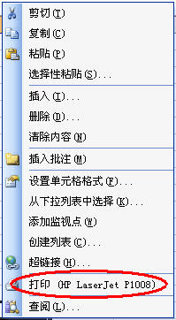

<u>图 85-1</u>	在右键快捷菜单中添加菜单项

:::

## 86、自定义右键快捷菜单

在工作表中创建自定义的右键快捷菜单替换 Excel 默认的右键快捷菜单，如下面的代码所示。

```vb
Sub Mycell()
	With Application.CommandBars.Add("Mycell", msoBarPopup)
		With .Controls.Add(Type:=msoControlButton)
			.Caption = "会计凭证"
			.FaceId = 9893
		End With
		With .Controls.Add(Type:=msoControlButton)
			.Caption = "会计账簿"
			.FaceId = 284
		End With
		With .Controls.Add(Type:=msoControlPopup)
			.Caption = "会计报表"
			With .Controls.Add(Type:=msoControlButton)
				.Caption = "月报"
				.FaceId = 9590
			End With
			With .Controls.Add(Type:=msoControlButton)
				.Caption = "季报"
				.FaceId = 9591
			End With
			With .Controls.Add(Type:=msoControlButton)
				.Caption = "年报"
				.FaceId = 9592
			End With
		End With
		With .Controls.Add(Type:=msoControlButton)
			.Caption = "凭证打印"
			.FaceId = 9614
			.BeginGroup = True
		End With
		With .Controls.Add(Type:=msoControlButton)
			.Caption = "账簿打印"
			.FaceId = 707
		End With
		With .Controls.Add(Type:=msoControlButton)
			.Caption = "报表打印"
			.FaceId = 986
		End With
	End With
End Sub
```

代码解析：

Mycell 过程在 Excel 工作表中创建自定义的右键快捷菜单。

第 2 行代码，使用 Add 方法添加名称为“Mycell”命令栏，设置“Mycell”命令栏的 Position 属性为 msoBarPopup，使“Mycell”命令栏为快捷菜单。关于 Position 参数的 MsoBarPosition 常数请参阅 83 中的表格 83-1。

第 3 行到第 39 行代码，使用 Add 方法在“Mycell”命令栏中添加菜单和菜单项，并设置其各项属性。

为了让自定义右键快捷菜单替换 Excel 默认的右键快捷菜单，并且只在右键单击 Sheet1 工作表时显示，需要在 Sheet1 工作表的 BeforeRightClick 事件中写入下面的代码。

```vb
Private Sub Worksheet_BeforeRightClick(ByVal Target As Range, Cancel As Boolean)
	Application.CommandBars("Mycell").ShowPopup
	Cancel = True
End Sub
```

代码解析：

工作表的 BeforeRightClick 事件过程，在右键单击工作表时，将“Mycell”命令栏作为右键快捷菜单，在当前光标位置显示。

工作表 BeforeRightClick 事件语法如下：

```vb
Private Sub expression_BeforeRightClick(ByVal Target As Range, Cancel As Boolean)

参数expression是必需的，Worksheet类型对象。
参数Target 是可选的，右键单击发生时最靠近鼠标指针的单元格。
参数Cancel是可选的，当事件发生时为False。如果在事件过程中将Cancel参数设为True，则该过程执行结束之后不进行默认的右键单击操作。
```

第 2 行代码，使用 ShowPopup 方法将“Mycell”命令栏作为右键快捷菜单，在当前光标位置显示。

ShowPopup 方法的语法如下：

```vb
expression.ShowPopup(x, y)

参数expression是必需的，返回一个CommandBar对象。
参数x是可选的，快捷菜单所在位置的 x 坐标。如果省略此参数，将使用当前光标位置的x坐标。
参数y是可选的，快捷菜单所在位置的y坐标。如果省略此参数，将使用当前光标位置的y坐标。
```

当用鼠标右键单击工作表中任意单元格时激活 BeforeRightClick 事件，此事件先于默认的右键单击操作。在使用 ShowPopup 方法显示“Mycell”命令栏后，将 Cancel 参数设置为 True，过程执行结束之后不进行默认的右键单击操作，Excel 右键快捷菜单就不会显示。

运行 Mycell 过程后，右键单击 Sheet1 工作表，在工作表中显示自定义右键快捷菜单，如图 86-1 所示。

::: center

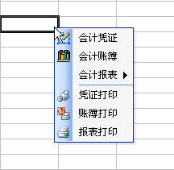

<u>图 86-1</u>	自定义右键快捷菜单

:::

## 87、使用右键菜单制作数据有效性

在工作表中输入数据时可以使用自定义右键菜单制作数据有效性，如下面的代码所示。

```vb
Sub Mycell()
	Dim arr As Variant
	Dim i As Integer
	Dim Mycell As CommandBar
	On Error Resume Next
	Application.CommandBars("Mycell").Delete
	arr = Array("经理室", "办公室", "生技科", "财务科", "营业部")
	Set Mycell = Application.CommandBars.Add("Mycell", 5)
	For i = 0 To 4
		With Mycell.Controls.Add(1)
			.Caption = arr(i)
			.OnAction = "MyOnAction"
		End With
	Next
End Sub
Sub MyOnAction()
	ActiveCell = Application.CommandBars.ActionControl.Caption
End Sub
```

代码解析：

Mycell 过程创建自定义的右键菜单，请参阅 86 。

MyOnAction 过程是点击自定义右键菜单所运行的过程，将所选右键菜单的名称写入活动单元格。

为了使自定义的右键菜单在 Sheet1 工作表的特定区域中显示，需要在 VBE 中双击 Sheet1 表后写入下面的代码。

```vb
Private Sub Worksheet_BeforeRightClick(ByVal Target As Range, Cancel As Boolean)
	If Target.Column = 2 Then
		Call Mycell
		Application.CommandBars("Mycell").ShowPopup
		Cancel = True
	End If
End Sub
```

代码解析：

工作表的 BeforeRightClick 事件过程，在右键单击工作表时，将“Mycell”命令栏作为右键快捷菜单，在当前光标位置显示，请参阅 86 。

在工作表的 B 列中点击右键结果如图 87-1 所示。

::: center

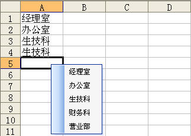

<u>图 87-1</u>	使用右键菜单制作数据有效性

:::

## 88、禁用工作表右键菜单

有时并不希望用户使用工作表中的右键菜单对工作表进行操作，那么可以使用下面的代码禁用工作表右键菜单。

```vb
Sub DisBar()
	Dim myBar As CommandBar
	For Each myBar In CommandBars
		If myBar.Type = msoBarTypePopup Then
			myBar.Enabled = False
		End If
	Next
End Sub
```

代码解析：

DisBar 过程禁用工作表中所有的右键菜单。

第 3 行代码使用 For Each...Next 语句遍历 CommandBars 集合。CommandBars 集合代表应用程序中所有的命令栏。

第 4 行代码根据命令栏的 Type 属性判断命令栏是否为右键菜单。应用于 CommandBar 对象的 Type 属性返回命令栏的类型，可以为表格 88-1 所列的 MsoBarType 常量之一。

表格 88-1	MsoBarType 常量

| 常量              | 值   | 描述         |
| ----------------- | ---- | ------------ |
| msoBarTypeMenuBar | 1    | 菜单栏       |
| msoBarTypeNormal  | 0    | 工具栏       |
| msoBarTypePopup   | 2    | 右键快捷菜单 |

第 5 行代码将 CommandBars 集合中右键快捷菜的 Enabled 属性设置为 False，使之无效。

运行 DisBar 过程将禁用工作表中所有的右键菜单，需要恢复时只需将其 Enabled 属性设置为 True 即可。

## 89、创建自定义工具栏

为了方便用户操作，在 Excel 原有的的工具栏上，还可以创建自定义的工具栏，如下面的代码所示。

```vb
Sub NowToolbar()
	Dim arr As Variant
	Dim id As Variant
	Dim i As Integer
	Dim Toolbar As CommandBar
	On Error Resume Next
	Application.CommandBars("MyToolbar").Delete
	arr = Array("会计凭证", "会计账簿", "会计报表", "凭证打印", "账簿打印", "报表打印")
	id = Array(9893, 284, 9590, 9614, 707, 986)
	Set Toolbar = Application.CommandBars.Add("MyToolbar", msoBarTop)
		With Toolbar
			.Protection = msoBarNoResize
			.Visible = True
			For i = 0 To 5
				With .Controls.Add(Type:=msoControlButton)
					.Caption = arr(i)
					.FaceId = id(i)
					.BeginGroup = True
					.Style = msoButtonIconAndCaptionBelow
				End With
			Next
		End With
	Set Toolbar = Nothing
End Sub
```

代码解析：

NowToolbar 过程使用 Add 方法在 Excel 窗口中创建自定义工具栏。应用于 CommandBars 对象的 Add 方法请参阅 83 。

第 10 行代码，使用 Add 方法在菜单栏上创建名称为“MyToolbar”的命令栏，创建时设置新命令栏的 Position 参数为 msoBarTop，使新命令栏位于应用程序窗口的顶部。如果将 Position 参数设置成 msoBarFloating，新命令栏为浮动工具栏，如图 89-1 所示。

::: center

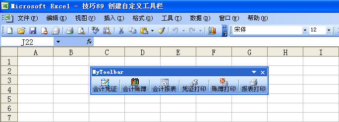

<u>图 89-1</u>	浮动命令栏

:::

关于 Position 参数的 MsoBarPosition 常数请参阅 83 中的表格 83-1。

第 12 行代码，设置“MyToolbar”命令栏的 Protection 属性为 msoBarNoResize。应用于 CommandBar 对象的 Protection 属性指定命令栏的保护类型，可以为表格 89-1 所列的 MsoBarProtection 常数之一。

<u>表格 89-1</u>	MsoBarProtection常数

| 常数                   | 值   | 说明                       |
| ---------------------- | ---- | -------------------------- |
| msoBarNoProtection     | 0    | 不受保护，可自定义(缺省值) |
| msoBarNoCustomize      | 1    | 不能自定义                 |
| msoBarNoResize         | 2    | 不能调整大小               |
| msoBarNoMove           | 4    | 不能移动                   |
| msoBarNoChangeVisible  | 8    | 不能更改可见状态           |
| msoBarNoChangeDock     | 16   | 不能改变停靠的位置         |
| msoBarNoVerticalDock   | 32   | 不能沿窗口左侧或右侧停放   |
| msoBarNoHorizontalDock | 64   | 不能沿窗口顶部或底部停放   |

第 14 行到第 21 代码，使用 Add 方法在新命令栏中添加按钮控件，设置按钮控件的各项属性。其中第 19 行代码，设置按钮控件的 Style 属性为 msoButtonIconAndCaptionBelow，使工具栏按钮显示时包含图标和标题，且标题位于图标之下。

应用于 CommandBar 对象的 Style 属性返回或设置工具栏按钮的显示方式，可以为表格 89-2 所列的 MsoButtonStyle 常数之一。

<u>表格 89-2</u>	MsoButtonStyle 常数

| 常数                         | 值   | 说明                                 |
| ---------------------------- | ---- | ------------------------------------ |
| msoButtonIcon                | 1    | 包含图标的按钮                       |
| msoButtonCaption             | 2    | 包含标题的按钮                       |
| ButtonIconandCaption         | 3    | 包含图标和标题的按钮                 |
| msoButtonIconAndCaptionBelow | 11   | 包含图标和标题，且标题位于底部的按钮 |
| msoButtonIconAndWrapCaption  | 7    | 包含图标和标题，且标题自动换行的按钮 |
| msoButtonWrapCaption         | 14   | 包含标题，且标题自动换行的按钮       |

运行 NowToolbar 过程，将在 Excel 窗口的顶部创建一个自定义的工具栏，如图 89-2 所示。

::: center

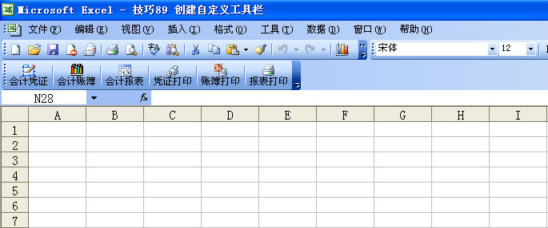

<u>图 89-2</u>	创建自定义工具栏

:::

## 90、自定义工具栏按钮图标

在创建自定义的工具栏时，除了可以为工具栏按钮添加 Excel 内置的图标外，还能为工具栏按钮添加自定义的图标，如下面的代码所示。

```vb
Sub AddCustomButton()
	Dim xBar As CommandBar
	Dim xButton As CommandBarButton
	On Error Resume Next
	Application.CommandBars("CustomBar").Delete
	Set xBar = CommandBars.Add("CustomBar", msoBarTop)
	Set xButton = xBar.Controls.Add(msoControlButton)
	With xButton
		.Picture = LoadPicture(ThisWorkbook.Path & "\P.BMP")
		.Mask = LoadPicture(ThisWorkbook.Path & "\M.BMP")
		.TooltipText = "Excel Home 论坛"
	End With
	xBar.Visible = True
	Set xBar = Nothing
	Set xButton = Nothing
End Sub
```

代码解析：

AddCustomButton 过程创建自定义工具栏，并设置工具栏的按钮自定义图标。

第 6、7 行代码，使用 Add 方法在 Excel 窗口中添加自定义工具栏和按钮。请参阅 89 。

第 9 行代码，设置工具栏按钮的 Picture 属性为同一目录中的 p.bmp 图片。

应用于 CommandBarButton 对象的 Picture 属性返回一个 IPictureDisp 对象，表示  CommandBarButton 对象的图像，语法如下：

```vb
expression.Picture

参数是必需的，返回一个CommandBarButton对象。
```

指定对象的 Picture 属性就能设置对象的图像。

第 10 行代码，设置工具栏按钮的 Mask 属性为同一目录中的 m.bmp 图片。

为了使工具栏按钮图标透明显示，在指定对象的 Picture 属性后，还需要指定对象的 Mask 属性。

应用于 CommandBarButton 对象的 Mask 属性返回表示 CommandBarButton 对象的屏蔽图像的 IPictureDisp 对象，语法如下：

```vb
expression.Mask

参数是必需的，返回一个CommandBarButton对象。
```

屏蔽图像决定按钮图像透明的部分。在创建作为屏蔽图像使用的图像时，所有要透明的区域应该为白色，所有要显示的区域应该为黑色。

第 11 行代码，设置按钮的“屏幕提示”为“ExcelHome论坛”。

运行 AddCustomButton 过程，创建自定义工具栏，并设置工具栏按钮的图标，如图 90-1 所示。

::: center


<u>图 90-1</u>	自定义工具栏图标

:::

## 91、自定义工作簿图标

Excel 标题栏的图标是默认的，而借助 API 函数可以自定义工作簿标题栏图标，如下面的代码所示。

```vb
Private Declare Function FindWindow Lib "user32" Alias "FindWindowA" (ByVal lpClassName As String, ByVal lpWindowName As String) As Long
Private Declare Function DrawMenuBar Lib "user32" (ByVal hWnd As Long) As Long
Private Declare Function SetFocus Lib "user32" (ByVal hWnd As Long) As Long
Private Declare Function SendMessage Lib "user32" Alias "SendMessageA" (ByVal hWnd As Long, ByVal wMsg As Long, ByVal wParam As Integer, ByVal lParam As Long) As Long
Private Declare Function ExtractIcon Lib "shell32.dll" Alias "ExtractIconA" (ByVal hInst As Long, ByVal lpszExeFileName As String, ByVal nIconIndex As Long) As Long
Private Const WM_SETICON = &H80
Private Sub Workbook_Open()
	Dim IStyle As Long
	Dim hIcon As Long
	Dim hWndForm As Long
	hWndForm = FindWindow(vbNullString, Application.Caption)
	hIcon = ExtractIcon(0, ActiveWorkbook.Path & "\p.bmp", 0)
	SendMessage hWndForm, WM_SETICON, True, hIcon
	SendMessage hWndForm, WM_SETICON, False, hIcon
End Sub
```

代码解析：

工作簿打开后使用 API 函数自定义工作簿标题栏的图标。

第 1 行到第 6 行代码，API 函数声明。

第 7 行到第 15 行代码，工作簿的 Open 事件过程，把工作簿标题栏默认的图标更改为同一文件夹下的 p.bmp 图片。

工作簿打开后标题栏如图 91-1 所示，任务栏图标如图 91-2 所示。

::: center


<u>图 91-1</u>	自定义工作簿标题和图标


<u>图 91-2</u>	任务栏图标

:::

## 92、移除工作表的最小最大化和关闭按钮

如果不希望工作表的最小、最大化和关闭按钮出现在菜单栏中，可以使用以下代码去除：

```vb
ActiveWorkbook.Protect , , True
```

代码解析：

使用 Protect 方法对工作簿进行保护。Protect 方法应用于 Workbook 对象的时保护工作簿使其不至被修改，语法如下：

```vb
expression.Protect(Password, Structure, Windows)

参数expression是必需的，该表达式返回一个Workbook对象。
参数Password是可选的，为工作表或工作簿指定区分大小写的密码。
参数Structure是可选的，如果为True，则保护工作簿结构（工作表的相对位置）。默认值为False。
参数Windows是可选的，如果为True，则保护工作簿窗口。
```

恢复工作表的最大、最小化和关闭按钮的代码如下：

```vb
ActiveWorkbook.Protect , , False
```

在本例中将 Windows 参数设置为 True，使工作簿窗口受到保护，工作表的最小、最大化和关闭按钮及图标不出现在菜单栏中，如图 92-1 所示。

::: center


<u>图 92-1</u>	移除工作表最小、最大化和关闭按钮

:::

## 93、在工具栏上添加下拉列表框

如果需要在工具栏中添加类似“字体”这样的下拉列表控制框控件，那么可以使用下面的代码。

```vb
Sub AddDropdown()
	Dim myDropdown As Object
	Dim myCap As Variant
	Dim i As Integer
	myCap = Array("基础应用", "VBA程序开发", "函数与公式")
	Call DeleteButton
	Set myDropdown = Application.CommandBars("Formatting").Controls _
		.Add(Type:=msoControlDropdown, Before:=1)
	With myDropdown
		.Caption = "请选择版块"
		.OnAction = "myOnA"
		.Style = msoComboNormal
		For i = 0 To UBound(myCap)
			.AddItem myCap(i)
		Next
		.ListIndex = 1
	End With
End Sub
Sub DeleteButton()
	With Application.CommandBars("Formatting").Controls(1)
		If .Caption = "请选择版块" Then .Delete
	End With
End Sub
Sub myOnA()
	Dim myList As Byte
	myList = Application.CommandBars("Formatting") _
		.Controls(1).ListIndex
	ActiveWorkbook.FollowHyperlink _
	Address:="http://club.excelhome.net/forum-" & myList & "-1.html", NewWindow:=True
End Sub
```

代码解析：

AddDropdown 过程使用 Add 方法在工具栏中添加下拉列表控制框控件。

第 5 行代码使用 Array 函数创建一个数组用于保存下拉列表控制框控件加载列表项所需的元素。

第 6 行代码先运行第 19 行到第 23 行的 DeleteButton 过程删除可能存在的下拉列表控制框控件，以免重复添加。DeleteButton 过程判断工具栏中第一个控件的 Caption 属性是否为“请选择版块”，如果是则删除该下拉列表控制框控件。

第 7、8 行代码使用 Add 方法在工具栏中添加下拉列表控制框控件。应用于  CommandBarControls 对象的 Add 方法请参阅 79 。示例中将其参数 Type 设置为 msoControlDropdown，添加的就是下拉列表控制框控件。

第 10 行代码设置下拉列表控制框控件的 Caption 属性，应用于 CommandBarControls 对象的 Caption 属性返回或设置指定命令栏控件的题注文字，也可作为默认的“屏幕提示”显示。

第 11 行代码设置改变下拉列表控制框控件的内容时要运行的过程为第 24 行到第 30 行代码的 myOnA 过程。myOnA 过程根据下拉列表控制框控件的 ListIndex 属性值打开 Excel Home 论坛中相应的版块。

第 12 行代码设置下拉列表控制框控件的样式。Style 属性返回或设置命令栏控件的显示方式，该属性值可设置为表格 93-1 所列 MsoComboStyle 常量之一。

表格 93-1	MsoComboStyle 常量

| 常量           | 值   | 描述       |
| -------------- | ---- | ---------- |
| msoComboLabel  | 1    | 显示标签   |
| msoComboNormal | 0    | 不显示标签 |

第 13 行到第 15 行代码使用 AddItem 方法将数组中的元素添加到下拉列表控制框控件的列表项中。

第 16 行代码将下拉列表控制框控件的 ListIndex 属性设置为 1，使其显示第一条列表项。

运行 AddDropdown 过程，工具栏如图 93-1 所示。

::: center

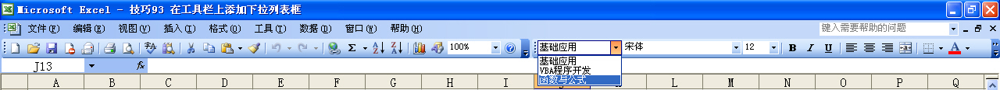

<u>图 93-1</u>	添加下拉列表控制框控件

:::

## 94、屏蔽工作表的复制功能

有时我们并不希望用户对工作表中的数据进行复制粘贴操作，此时可以把所有的复制功能都屏蔽，如下面的代码所示。

```vb
	Dim CmdCtrls As CommandBarControls
	Dim Cmd As CommandBarControl
Sub ProCopy()
	Set CmdCtrls = Application.CommandBars.FindControls(ID:=19)
	For Each Cmd In CmdCtrls
		Cmd.Enabled = False
	Next
	Application.CellDragAndDrop = False
	Application.OnKey ("^c"), ""
End Sub
Sub StaCopy()
	Set CmdCtrls = Application.CommandBars.FindControls(ID:=19)
	For Each Cmd In CmdCtrls
		Cmd.Enabled = True
	Next
	Application.CellDragAndDrop = True
	Application.OnKey ("^c")
End Sub
```

代码解析：

第 1、2 行代码在模块顶部声明两个模块级的变量。

第 3 行到第 10 行代码 ProCopy 过程，屏蔽工作表中所有的复制功能。其中第 4 行到第 7 行代码使用 FindControls 方法将所有与“复制”相关的命令栏控件赋给变量 CmdCtrls 后将其 Enabled 设置为 False。关于 FindControls 方法请参阅 80 。

第 8 行代码屏蔽单元格拖放功能，关于应用于 Application 对象的 CellDragAndDrop 属性请参阅 10 。

第 9 行代码屏蔽 <Ctrl+C> 组合键功能，关于应用于 Application 对象的 OnKey 方法请参阅 68 。

第 11 行到第 18 行代码 StaCopy 过程，恢复所有的复制功能。

## 95、禁用工具栏的自定义 

在 Excel 中，用户可以通过依次单击菜单“视图”→“工具栏”→“自定义”，显示“自定义”选项卡来调整菜单栏和工具栏，如图 95-1、图 95-2 所示。

::: center

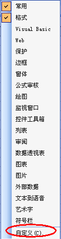

<u>图 95-1</u>	自定义功能


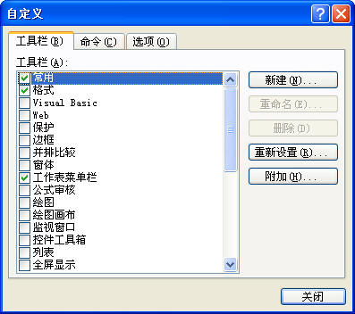

<u>图 95-2</u>	自定义选项卡

:::

如果不希望用户使用“自定义”选项卡来调整菜单栏和工具栏，可以禁用工具栏的自定义功能，如下面的代码所示。

```vb
Sub nCustomize()
	Application.CommandBars.DisableCustomize = True
End Sub
```

代码解析：

nCustomize 过程禁用工具栏的自定义功能，应用于 CommandBars 集合对象的DisableCustomize 属性设置是否禁用工具栏的自定义。如果禁用，返回 True，否则返回 False。

用于启用工具栏的自定义的代码是：

```vb
Sub yCustomize()
	Application.CommandBars.DisableCustomize = False
End Sub
```

运行 nCustomize 过程，禁用工具栏的自定义对话框，自定义菜单项消失,如图 95-3 所示。

::: center

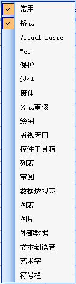

<u>图 95-3</u>	禁用工具栏的自定义

## 96、屏蔽所有的命令栏

在使用自定义的操作界面时，需要屏蔽 Excel 中所有的命令栏，可以使用下面的代码。

```vb
Sub Shielding_1()
	Dim i As Integer
	For i = 1 To Application.CommandBars.Count
		Application.CommandBars(i).Enabled = False
	Next
End Sub
```

代码解析：

Shielding_1 过程使用 For...Next 语句遍历 Excel 命令栏，并将其 Enabled 属性设置为 False，使之无效。

还可以使用 For Each...Next 语句遍历所有的 CommandBars 对象，代码如下：

```vb
Sub Shielding_2()
	Dim Cmd As CommandBar
	For Each Cmd In Application.CommandBars
		Cmd.Enabled = False
	Next
End Sub
```

运行 Shielding_1 或 Shielding_2 过程工作簿如图 96-1 所示。

::: center

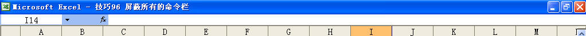

<u>图 96-1</u>	屏蔽所有的命令栏

:::

在需要恢复时只需将 Enabled 属性设置为 True 即可，如下面的代码所示。

```vb
Sub Recovery_1()
	Dim i As Integer
	For i = 1 To Application.CommandBars.Count
		Application.CommandBars(i).Enabled = True
	Next
End Sub
Sub Recover_2()
	Dim Cmd As CommandBar
	For Each Cmd In Application.CommandBars
		Cmd.Enabled = True
	Next
End Sub
```

代码解析：

Recovery_1 和 Recover_2 过程分别使用 For...Next 语句和 For Each...Next 语句遍历所有的 CommandBars 对象，设置其 Enabled 属性为 True，显示所有的命令栏。

## 97、恢复 Excel 的命令栏

如果用户经常添加、删除 Excel 的菜单和工具栏而又没有及时恢复的话，有时会破坏 Excel 默认的用户界面，即使用 Reset 方法也不能恢复成初始状态。

此时可以在电脑的本地硬盘中查找扩展名为 \*.xlb 的文件，该文件在电脑中的位置会因 Excel 版本的不同而不同，在 XP 操作系统中，该文件位于系统盘的 `Documents and Settings\Administrator\Application Data\Microsoft\Excel` 文件夹，其中 Administrator 是电脑的用户名。找到它最简单的方法是使用 Windows 的搜索功能。按 <Win+F> 组合键调出 Windows 的搜索窗口，然后用 \*.xlb 为目标在本地硬盘中进行搜索，如图 97-1 所示。

::: center

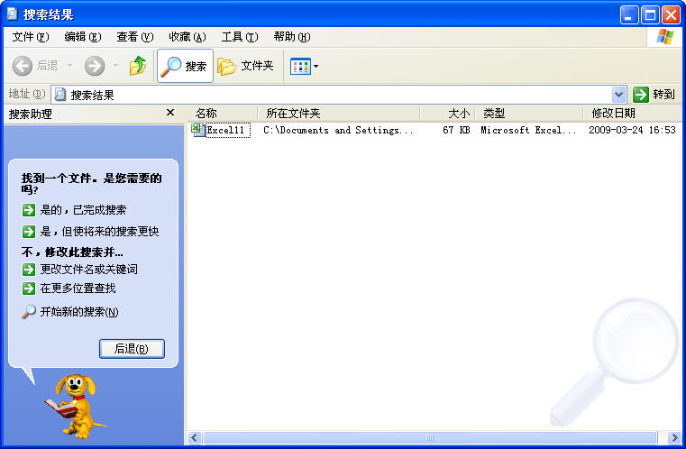

<u>图 97-1</u>	搜索 \*.xlb 文件

:::

如果搜索没有结果，请检查“更多高级选项”中是否选中“搜索隐藏的文件和文件夹”选项，如图 97-2 所示。

::: center

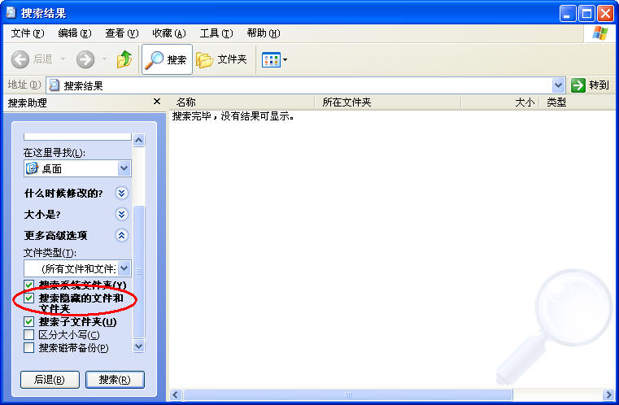

<u>图 97-2</u>	搜索隐藏的文件和文件夹

:::

对 Excel 用户界面的任何修改都会保存在 \*.xlb 文件中，找到后删除该文件，然后重新启动 Excel。Excel 会重新创建一个 \*.xlb 文件，而菜单和工具栏也会全部恢复成初始状态。

