## 98、限制文本框的输入

用户在使用文本框输入数据时，往往希望能限制输入数据的类型，比如只能输入数字。但是没有内置的属性能限制在文本框中只能输入数字，只能在文本框的事件过程中使用代码来测试输入的是哪类字符，然后只允许输入数字字符和一个“-”号、一个“.”号，如下面的代码所示。

```vb
Private Sub TextBox1_KeyPress(ByVal KeyANSI As MSForms.ReturnInteger)
	Select Case KeyANSI
		Case Asc("0") To Asc("9")
		Case Asc("-")
			If InStr(1, Me.TextBox1.Text, "-") > 0 Or _
				Me.TextBox1.SelStart > 0 Then
				KeyANSI = 0
			End If
		Case Asc(".")
			If InStr(1, Me.TextBox1.Text, ".") > 0 Then
				KeyANSI = 0
			End If
		Case Else
			KeyANSI = 0
	End Select
End Sub
```

代码解析：

文本框的 KeyPress 事件过程，测试键盘输入的是哪类字符，只允许输入数字字符和一个“-”号、一个“.”号。

KeyPress 事件的语法如下：

```vb
Private Sub object_KeyPress( ByVal KeyANSI As MSForms.ReturnInteger)

参数Object是必需的，一个有效的对象。
参数KeyANSI是可选的，整数值，代表标准的数字ANSI 键代码。
```

第 2 行代码使用 Case Else 语句测试文本框 KeyPress 事件的 KeyANSI 参数值。

第 3 行代码，如果键盘输入的是 0 到 9 之间的数字字符，则允许输入。如果想在文本框中允许其它类型的字符输入，在此句代码中列出允许输入的字符即可。

第 4 行到第 8 行代码，如果键盘输入的是“-”号，先使用 InStr 函数测试文本框中是否已有“-”号，如果 InStr 函数返回值大于 0，说明文本框中已有“-”号。接下来使用文本框的 SelStart  属性来测试插入点，如果文本框的 SelStart  属性值大于 0，说明“-”号的插入点不是第一个。如果以上两个条件中有任何一个成立，将 KeyAscii 参数值设置为 0，使文本框只能在第一位输入一个“-”号。

第 9 行到第 12 行代码，如果键盘输入的是“.”号的话，使用 InStr 函数测试文本框中是否已有“.”号，如果已有“.”号，将 KeyAscii 参数值设置为 0，使文本框只能输入一个“.”号。

第 13、14 行代码，如果键盘输入的是其他字符则将 KeyAscii 参数值设置为 0，使文本框不能输入其他字符。

经过以上设置文本框只允许输入数字字符和一个“-”号、一个“.”号，但是能输入中文字符。如果希望限制中文字符的输入，可以在文本框的 Change 事件中进行设置，如下面的代码所示。

```vb
Private Sub TextBox1_Change()
	Dim i As Integer
	Dim s As String
	With TextBox1
		For i = 1 To Len(.Text)
			s = Mid(.Text, i, 1)
			Select Case s
				Case ".", "-", "0" To "9"
				Case Else
					.Text = Replace(.Text, s, "")
			End Select
		Next
	End With
End Sub
```

代码解析：

文本框的 Change 事件，判断输入的字符是否为数字字符和“-”号、“.”号，如果不是则使用 Replace 函数将文本框中输入的其他字符替换成空白。

第 5、6 行代码在文本框输入的所有字符中循环。

第 8 行代码列出允许输入的字符。如果想在文本框中允许其它字符输入，在此句代码中列出即可。

第 9、10 行代码，如果不是允许输入的字符，使用 Replace 函数替换成空白。

经过以上的设置，文本框中只能在第一位输入一个“-”号、一个“.”号和“0”到“9”的数字。

## 99、文本框添加右键快捷菜单

VBA 中的控件没有提供右键快捷菜单，用户可以使用 Excel 中的命令栏自已添加右键快捷菜单。

- 步骤 1：按 <Alt+F11> 组合键进入 VBE 窗口，单击菜单“插入”→“模块”，在其代码窗口输入以下代码：

```vb
Private ActiveTB As MSForms.TextBox
Public Sub CreateShortCutMenu()
	Dim ShortCutMenu As CommandBar
	Dim ShortCutMenuItem As CommandBarButton
	Dim sCaption As Variant
	Dim iFaceId As Variant
	Dim sAction As Variant
	Dim i As Integer
	sCaption = Array("剪切(&C)", "复制(&T)", "贴粘(&P)", "删除(&D)")
	iFaceId = Array(21, 19, 22, 1786)
	sAction = Array("Action_Cut", "Action_Copy", "Action_Paste", "Action_Delete")
	On Error Resume Next
	Application.CommandBars("ShortCut").Delete
	Set ShortCutMenu = Application.CommandBars.Add("ShortCut", msoBarPopup)
	With ShortCutMenu
		For i = 0 To 3
			Set ShortCutMenuItem = .Controls.Add(msoControlButton)
			With ShortCutMenuItem
				.Caption = sCaption(i)
				.faceID = Val(iFaceId(i))
				.OnAction = sAction(i)
			End With
		Next
	End With
End Sub
```

代码解析：

第 1 行代码，在模块级别中声明变量 ActiveTB 是用来对应窗体中的文本框所触发的所有事件的变量。

CreateShortCutMenu 过程用来创建标题为“ShortCut”的右键快捷菜单，并添加 4 个菜单项。关于自定义右键快捷菜单请参阅 86 。

```vb
Public Sub ShowPopupMenu(txtCtr As MSForms.TextBox)
	Dim Action As Variant
	Set ActiveTB = txtCtr
	With Application.CommandBars("ShortCut")
		.Controls(1).Enabled = txtCtr.SelLength > 0
		.Controls(2).Enabled = .Controls(1).Enabled
		.Controls(3).Enabled = txtCtr.CanPaste
		.Controls(4).Enabled = .Controls(1).Enabled
		.ShowPopup
	End With
End Sub
```

代码解析：

ShowPopupMenu 过程根据文本框中字符的选中状态设置右键快捷菜单菜单项的 Enabled 属性后使用 ShowPopup 方法显示右键快捷菜单。

第 5 行代码，如果当前文本框中已有选中的字符则“剪切”按钮有效。

第 6 行代码，如果当前文本框中已有选中的字符则“复制”按钮有效。

第 7 行代码，如果剪贴板中包含对象支持的数据。则“贴粘”按钮有效。

第 8 行代码，如果当前文本框中已有选中的字符则“删除”按钮有效。

第 9 行代码，显示快捷菜单。

```vb
Public Sub Action_Cut()
	ActiveTB.Cut
End Sub
Public Sub Action_Copy()
	ActiveTB.Copy
End Sub
Public Sub Action_Paste()
	ActiveTB.Paste
End Sub
Public Sub Action_Delete()
	Dim s As String
	With ActiveTB
		s = .SelText
		.Value = Replace(.Value, s, "")
	End With
End Sub
```

代码解析：

Action_Cut 过程是快捷菜单中单击“剪切”菜单项所运行的过程。使用 Cut 方法将当前选中的文本框中的文本删除并移至剪贴板。

Action_Copy 过程是快捷菜单中单击“复制”菜单项所运行的过程。使用 Copy 方法将文本框选中的文本复制到剪贴板上。

Action_Paste 过程是快捷菜单中单击“贴粘”菜单项所运行的过程。使用 Paste 方法把剪贴板上的内容传送到一个文本框中。

Action_Delete 过程是快捷菜单中单击“贴粘”菜单项所运行的过程。使用 Replace 函数将文本框中选中的文本的文本替换成空字符。

```vb
Public Sub DeleteShortCutMenu()
	On Error Resume Next
	Application.CommandBars("ShortCut").Delete
End Sub
```

代码解析：

DeleteShortCutMenu 过程删除创建的右键快捷菜单。

- 步骤 2：在VBE 窗口中，单击菜单“插入”→“用户窗体”，在窗体上添加两个文本框控件。双击窗体，在其代码窗口中输入下面的代码。

```vb
Private Sub UserForm_Initialize()
	Call CreateShortCutMenu
End Sub
Private Sub TextBox1_MouseUp(ByVal Button As Integer, ByVal Shift As Integer, ByVal X As Single, ByVal Y As Single)
	If Button = 2 Then ShowPopupMenu ActiveControl
End Sub
Private Sub TextBox2_MouseUp(ByVal Button As Integer, ByVal Shift As Integer, ByVal X As Single, ByVal Y As Single)
	If Button = 2 Then ShowPopupMenu ActiveControl
End Sub
Private Sub UserForm_QueryClose(Cancel As Integer, CloseMode As Integer)
	Call DeleteShortCutMenu
End Sub
```

代码解析：

第 1 行到第 3 行代码，窗体的 Initialize 事件，在窗体初始化时运行 CreateShortCutMenu 过程创建右键快捷菜单。

第 4 行到第 9 行代码，文本框的 MouseUp 事件，当用户右健单击文本框时运行 ShowPopupMenu 过程在选中的菜单项上显示右键快捷菜单。

第 10 行到第 12 行代码，窗体的 QueryClose 事件，在关闭窗体时运行 DeleteShortCutMenu 过程删除右键快捷菜单。

窗体运行后，右键单击文本框显示右键快捷菜单，如图 99-1 所示。

::: center

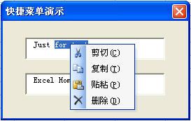

<u>图 99-1</u>	文本框快捷菜单

:::

## 100、文本框回车自动输入

在使用文本框向工作表输入数据时，为了加快输入速度，可以利用文本框的 KeyDown 事件，回车后自动输入并清空文本框，如下面的代码所示。

```vb
Private Sub TextBox1_KeyDown(ByVal KeyCode As MSForms.ReturnInteger, ByVal Shift As Integer)
	With TextBox1
		If Len(Trim(.Value)) > 0 Then
			If KeyCode = vbKeyReturn Then
				Sheet1.Range("A65536").End(xlUp).Offset(1, 0) = .Value
				.Text = ""
			End If
		End If
	End With
End Sub
```

代码解析：

文本框的 KeyDown 事件，在输入数据并按 \<Enter\> 键后自动将数据录入到工作表 A 列最后一个非空单元格的下一个单元格中。

KeyDown 事件在按下键盘按键时发生，语法如下：

```vb
Private Sub object_KeyDown( ByVal KeyCode As MSForms.ReturnInteger, ByVal Shift As fmShiftState)

参数object是必需的，一个有效的对象。
参数KeyCode是必需的，代表被按下的键的键代码。
参数Shift是可选的，Shift、Ctrl 和Alt的状态。
```

第 3 行代码，为了防止误输入空白数据，使用 Len 函数和 Trim 函数检查文本框内是否为有效数据。

第 4 行代码，根据 KeyCode 参数值判断是否按下了回车键。如果用户按下了回车键，KeyCode 参数返回常数 vbKeyReturn。

第 5、6 行代码，将文本框数据输入到工作表A列的最后一个单元格内，同时清空文本框内容准备下一次输入。

## 101、自动选择文本框内容

如果希望光标进入文本框时能自动选择文本框内容，可以在文本框的 MouseUp 事件中来完成，如下面的代码所示。

```vb
Private Sub TextBox1_MouseUp(ByVal Button As Integer, ByVal Shift As Integer, ByVal X As Single, ByVal Y As Single)
	With TextBox1
		If Button = 2 Then
			.SelStart = 0
			.SelLength = Len(.Text)
		End If
	End With
End Sub
```

代码解析：

文本框的 MouseUp 事件，在光标进入文本框释放鼠标右键时自动选择文本框内容。

MouseUp 事件在用户释放鼠标按键时发生，语法如下：

```vb
Private Sub object_MouseUp( ByVal Button As fmButton, ByVal Shift As fmShiftState, ByVal X As Single, ByVal Y As Single)

参数object是必需的，一个有效的对象。
参数Button是可选的，设置引起该事件的鼠标按键的整数值，如表格101-1所示。
参数Shift是可选的，Shift、Ctrl 和Alt的状态。
参数X和参数Y是可选的，窗体、框架或页的位置的横坐标与纵坐标。
```

<u>表格 101-1</u>	Button参数值

| 常数           | 值   | 说明       |
| -------------- | ---- | ---------- |
| fmButtonLeft   | 1    | 按下左键。 |
| fmButtonRight  | 2    | 按下右键。 |
| fmButtonMiddle | 3    | 按下中键。 |

第 3 行到第 6 行代码，如果用户进入文本框释放鼠标右键，设置文本框的 SelStart 属性为 0， SelLength 属性为文本框的全部字符数。

SelStart 属性指定选中文本的起点，语法如下：

```vb
object.SelStart [= Long]

参数object是必需的，一个有效的对象。
参数Long是可选的，指定选中文本的起点。
```

SelLength 属性指定文本框或组合框的文本部分中选中的字符数，语法如下：

```vb
object.SelLength [= Long]

参数object是必需的，一个有效的对象。
参数Long是可选的，指定选中的字符数。
```

运行窗体，当光标进入文本框释放鼠标右键时自动选择文本框内容，如图 101-1 所示。

::: center

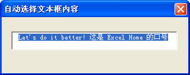

<u>图 101-1</u>	自动选择文本框内容

:::

## 102、设置文本框数据格式

文本框在用来输入数据时，除了限制输入的数据类型外，还可以设置文本框的数据格式，如下面的代码所示。

```vb
Private Sub TextBox1_Exit(ByVal Cancel As MSForms.ReturnBoolean)
	TextBox1 = Format(TextBox1, "0.00")
End Sub
Private Sub TextBox2_Exit(ByVal Cancel As MSForms.ReturnBoolean)
	TextBox2 = Format(TextBox2, "0.00")
End Sub
```

代码解析：

文本框的 Exit 事件过程，在文本框输入数据时使用 Format 函数格式化为两位小数格式。

控件的 Exit 事件在同一窗体中的一个控件即将把焦点转移到另一个控件之前发生，语法如下：

```vb
Private Sub object_Exit( ByVal Cancel As MSForms.ReturnBoolean)

参数Object是必需的，一个有效的对象。
参数Cancel是必需的，事件状态。如果设置为False表示由该控件处理这个事件（默认方式）。设置为True表示由应用程序处理这个事件，并且焦点留在当前控件上。
```

当文本框在输入完数据失去焦点时使用Format函数格式化自定义数值格式。Format 函数语法如下：

```vb
Format(expression[, format[, firstdayofweek[, firstweekofyear]]])

参数expression是必需的，任何有效的表达式。
参数format是可选的，有效的命名表达式或用户自定义格式表达式。
参数firstdayofweek是可选的，常数，表示一星期的第一天。
参数firstweekofyear是可选的，常数，表示一年的第一周。
```

在本例中，将文本框的数据格式化成自定义的两位小数的数值格式，关于 Format 函数格式化日期和时间等其他数据请参阅 VBA 中 Format 函数的帮助。

```vb
Private Sub TextBox1_Change()
	TextBox3 = Format(Val(TextBox1) * Val(TextBox2), "0.00")
End Sub
Private Sub TextBox2_Change()
	TextBox3 = Format(Val(TextBox1) * Val(TextBox2), "0.00")
End Sub
```

代码解析：

文本框的 Change 事件过程，在两个文本框输入完数据后，使用文本框的 Change 事件使 TextBox3 显示其相乘的金额并格式化为两位小数的数据格式。

Change 事件在控件的 Value 属性改变时发生，语法如下：

```vb
Private Sub object_Change( )

参数object是必需的，一个有效的对象。
```

Change 事件过程可以使显示在控件上的数据同步或一致。在本例中，当 TextBox1 或 TextBox2 的数据发生改变时，两者相乘的金额的金额也随之改变并在 TextBox3 中显示。

因为文本框的数据类型是文本字符串，不能直接进行计算的，所以计算前先使用 Val 函数转换为数字，才能进行计算。

运行窗体，输入数据后格式化为两位小数的数据格式，如图 102-1 所示。

::: center

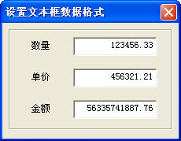

<u>图 102-1</u>	设置文本框的数据格式

:::

## 103、限制文本框的输入长度

在使用文本框输入数据时，可能希望限制能输入的字符长度，即只能输入一定长度的字符，超过设置数值就不能输入，这时可以通过设置文本框的 MaxLength 属性来实现，如下面的代码所示。

```vb
Private Sub Worksheet_Activate()
	Me.TextBox1.MaxLength = 6
End Sub
```

代码解析：

工作表的激活事件过程，将文本框的 MaxLength 属性设置为 6，使文本框只能输入 6 个字符，超过 6 个字符即不能输入。

应用于文本框控件的 MaxLength 属性规定用户可以在文本框中输入的最多字符数，语法如下：

```vb
object.MaxLength [= Long]

参数object是必需的，一个有效的对象。
参数Long是可选的，整数，表示所允许的字符数。
```

如果将 MaxLength 属性设置为 0，表示只要内存允许则没有限制。

## 104、将光标返回文本框中

在用文本框往工作表录入数据时，一般会在录入到工作表前验证输入的数据是否正确，如果错误，则清空文本框内容，提示用户重新输入。但此时光标已经不在文本框中，需要重新选择文本框才能输入。

可以在 Exit 事件中可以设置 Cancel 参数值使光标停留在当前文本框中，如下面的代码所示。

```vb
Private Sub TextBox1_Exit(ByVal Cancel As MSForms.ReturnBoolean)
	With TextBox1
		If .Text <> "" And Len(Trim(.Text)) <> 15 And Len(Trim(.Text)) <> 18 Then
			.Text = ""
			MsgBox "身份证号码录入错误!"
			Cancel = True
		End If
	End With
End Sub
```

代码解析：

文本框的 Exit 事件，在输入身份证号码后即将把焦点转移到录入按钮控件之前检查输入的身份证号码是否正确。

Exit 事件在一个控件从同一窗体的另一个控件实际接收到焦点之前发生,语法如下:

```vb
Private Sub object_Exit( ByVal Cancel As MSForms.ReturnBoolean)

Cancel参数为事件状态。False表示由该控件处理这个事件（这是默认方式）。True表示由应用程序处理这个事件，并且焦点应当留在当前控件上。
```

第 3 行代码，使用 Len 函数和 Trim 函数检查输入的身份证号码是否为 15 位或 18 位。

第 4 行到第 6 行代码，如果输入的身份证号码不正确，清空文本框以便重新输入并提示用户，设置 Cancel 参数为 True 使光标停留在文本框中。

在 Exit 事件中之所以把文本框为空也做为通过验证的条件之一，因为如果不加上“ <u>TextBox1.Text <> ""</u> ”这一条件，那么在窗体显示后，如果用户取消输入或关闭输入窗体，也会提示输入错误。所以在录入到工作表之前再验证文本框是否为空，如下面的代码所示。

```vb
Private Sub CommandButton1_Click()
	With TextBox1
		If .Text <> "" Then
			Sheet1.Range("a65536").End(xlUp).Offset(1, 0) = .Text
			.Text = ""
		Else
			MsgBox "请输入身份证号码!"
		End If
			.SetFocus
	End With
End Sub
```

代码解析：

输入按钮的 Click 事件，把文本框数据录入到工作表 A 列最后一个单元格中并重新选择文本框准备下一次输入。

第 3 行代码，在输入到工作表前检查文本框是否为空。

第 4、5 行代码，如果文本框不为空，录入数据到工作表并清空文本框内容。

第 7 行代码，如果文本框为空，提示用户输入数据。

第 8 行代码，使用 SetFocus 方法将光标返回到文本框中以便重新输入。

SetFocus 方法将焦点移动到对象的实例中，语法如下 ：

```vb
object.SetFocus

参数object.是必需的，一个有效的对象。
```

运行窗体，在输入框中输入身份证号码后自动验证输入的数据，如果输入数据错误，清空文本框并提示用户重新输入，如图 104-1 所示。

::: center

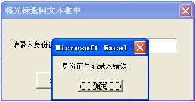

<u>图 104-1</u>	提示用户重新输入

:::

## 105、文本框的自动换行

在使用使用文本框显示或录入一段很长的文本时，需要将文本框设置成多行显示，否则文本内容只能在一行中显示，示例代码如下：

```vb
Private Sub UserForm_Initialize()
	With TextBox1
		.WordWrap = True
		.MultiLine = True
		.Text = Space(4) & "VBA(Visual Basic for Application)是" _
				& "微软公司为了加强Office软件的二次开发能力而附加" _
				& "于其中的编程语言。VBA的确非常强大，其与VB完全一" _
				& "致的语法结构，高效控制Office对象模型的能力，令无" _
				& "数人为之折腰。利用VBA，几乎可以在Office里面做任何" _
				& "其他程序能做的事情。但是，应该清楚的认识到VBA是依" _
				& "托其宿主─—Excel（或其他Office组件）而存在的，对" _
				& "于Excel用户来讲，VBA只不过是锦上添花的东西，切不可" _
				& "本末倒置，捡了芝麻丢了西瓜，把明明能够利用Excel内置" _
				& "功能完成的任务，硬是搬到VBA里面去做，以为用代码实现" _
				& "就是高人一头的表现。其实，真正的高手，会尽量发挥" _
				& "Excel自身的威力，不到万不得已的时候是不会去<Alt+F11>的。"
	End With
End Sub
```

代码解析：

窗体的 Initialize 事件过程，在窗体显示时将文本框设置成多行显示文本。

第 3 行代码设置文本框的 WordWrap 属性。WordWrap 属性指定一个控件的内容在行末是否自动换行，语法如下：

```vb
object.WordWrap [= Boolean]

参数object是必需的，一个有效的对象。
参数Boolean是可选的，控件是否扩展以适应文本的大小，设置为True，文本换行，设置为False，文本不换行。
```

第 4 行代码设置文本框的 MultiLine 属性。MultiLine 属性规定控件能否接受和显示多行文本，语法如下：

```vb
object.MultiLine [= Boolean]

参数object是必需的，一个有效的对象。
参数Boolean是可选的，控件是否支持多行文本，设置为True，以多行显示文本，设置为False，不多行显示文本。如果将多行文本框的MultiLine属性设置为False，则文本框的所有字符都将合并为一行，包括非打印字符（如，回车和换行）。
```

对于既支持 WordWrap 属性又支持 MultiLine 属性的控件，当 MultiLine 属性为 False 时，WordWrap 属性被忽略。

运行窗体，文本框显示如图 105-1 所示。

::: center

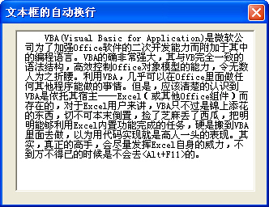

<u>图 105-1</u>	文本框自动换行

:::

## 106、多个文本框数据相加

在 102 中，我们在 TextBox1、TextBox2 中输入完数据后，利用文本框的 Change 事件使 TextBox3 显示其两者相乘的金额，但是如果窗体中有多个文本框，需要在每一个文本框的 Change 事件中写上相同的重复代码，因此使用类模块可以简化代码。

在附件的窗体有七个文本框，其中六个用来输入数据，一个用来显示其他六个文本框相加后的合计数，首先打开 VBE，插入一个类模块建立一个类，类模块的名字就是类的名字修改为“cmds”，在类模块中输入下面的代码：

```vb
Public WithEvents cmd As MSForms.TextBox
```

代码解析：

使用 Public 语句声明变量 cmd 是用来响应由 TextBox 对象触发的事件的对象变量。

在窗体的 Initialize 事件中写入下面的代码：

```vb
Dim col As New Collection
Private Sub UserForm_Initialize()
	Dim i As Integer
	Dim myc As cmds
	For i = 1 To 6
		Set myc = New cmds
		Set myc.cmd = Me.Controls("TextBox" & i)
		col.Add myc
	Next
	Set myc = Nothing
End Sub
```

代码解析：

第 1 行代码在模块顶部声明变量 col 的类型为集合。

第 5 行到第 9 行代码，将窗体中的六个文本框赋给 col 集合。

（关于类模块请参阅论坛中有关的资料。）

在类模块中写入下面的代码：

```vb
Private Sub cmd_Change()
	Dim i As Integer
	Dim Dval As Double
	For i = 1 To 6
		Dval = Dval + Val(UserForm1.Controls("TextBox" & i))
		UserForm1.TextBox7.Value = Dval
	Next
End Sub
```

代码解析：

窗体中的六个文本框统一的 Change 事件，当任何一个文本框中的数据发生变化时，所有文本框相加的合计数显示在最后一个文本框中。

运行窗体在文本框中输入数据结果如图 106-1 所示。

::: center

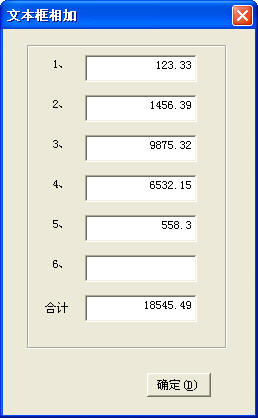

<u>图 106-1</u>	多个文本框数据相加

:::

## 107、控件跟随活动单元格

在工作表中使用控件时一般都把控件放在工作表的上部，如果工作表中数据较多，当页面滚动到工作表下面的区域时，控件会离开当前可视区域，这时操作起来很不方便。解决方法除了冻结工作表的第一行放置控件的外，还可以使控件出现在选定的单元格位置，如下面的代码所示。

```vb
Private Sub Worksheet_SelectionChange(ByVal Target As Range)
	With Me.CommandButton1
		.Top = Target.Top
		.Left = Target.Left + Target.Width
	End With
End Sub
```

代码解析：

工作表的 SelectionChange 事件，使工作表中的按钮控件出现在选定单元格的右边。

第 3 行代码，设置按钮的 Top 属性等于选定单元格的 Top 属性。Top 属性设置对象顶端到第一行顶端的距离。

第 4 行代码，设置按钮的 Left 属性等于选定单元格的 Left 属性加上选定单元格的宽度，即按钮出现在选定单元格的右边。Left 属性设置对象左边界至 A 列左边界的距离。

当单击工作表区域的任一单元格，按钮出现在单元格的右边，如图 107-1 所示。

::: center

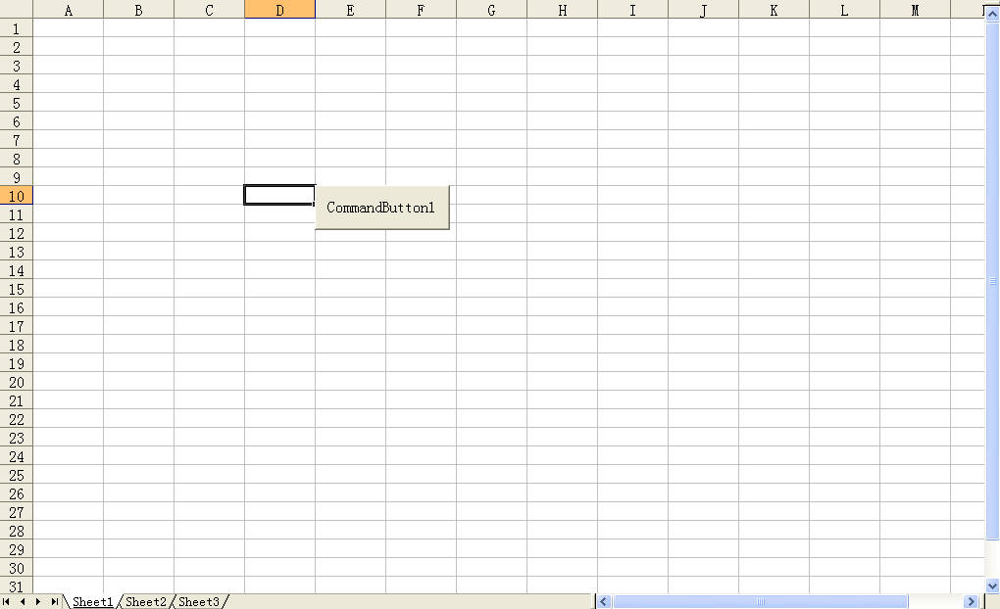

<u>图 107-1</u>	控件跟随活动单元格

:::

## 108、高亮显示按钮

为了达到当鼠标掠过按钮时以高亮和凸起显示按钮的效果，可以在窗体和按钮的 MouseMove 事件中进行模拟，如下面的代码所示。

```vb
Private Sub CommandButton1_MouseMove(ByVal Button As Integer, ByVal Shift As Integer, ByVal X As Single, ByVal Y As Single)
	With Me.CommandButton1
		.BackColor = &HFFFF00
		.Width = 62
		.Height = 62
		.Top = 69
		.Left = 31
	End With
End Sub
Private Sub UserForm_MouseMove(ByVal Button As Integer, ByVal Shift As Integer, ByVal X As Single, ByVal Y As Single)
	With Me.CommandButton1
		.BackColor = Me.BackColor
		.Width = 60
		.Height = 60
		.Top = 70
		.Left = 32
	End With
End Sub
```

代码解析：

窗体和按钮的 MouseMove 事件过程，以高亮和凸起显示按钮。

当用户在窗体中移动鼠标时，分别在窗体和按钮的 MouseMove 事件设置按钮的 BackColor 属性值，指定按钮的背景色，当鼠标移动到按钮时以高亮显示，当鼠标移动到窗体时恢复原来的设置。接下来分别设置按钮不同的 Width 属性、Height 属性、Top 属性和 Left 属性值，以模拟按钮凸起的效果。

运行窗体，当鼠标掠过按钮时效果如图 108-1 所示。

::: center

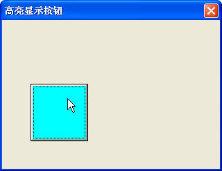

<u>图 108-1</u>	高亮和凸起显示按钮

:::

## 109、组合框和列表框添加列表项的方法

组合框和列表框是 Excel 中最常用的控件，可以用来显示工作表中的数据。为组合框和列表框添加列表项的方法有多种，下面以列表框为例演示添加列表项的方法。

### 1）使用 RowSource 属性添加列表项

使用 RowSource 属性将列表框直接与工作表上的一个单元格区域相链接，如下面的代码所示。

```vb
Private Sub UserForm_Initialize()
	Dim iRow As Integer
	iRow = Sheet1.Range("A65536").End(xlUp).Row
	Me.ListBox1.RowSource = "sheet1!a1:a" & iRow
End Sub
```

代码解析：

在窗体初始化时使用 RowSource 属性为列表框添加列表项。

RowSource 属性的语法如下：

```vb
object.RowSource [= String]

参数object是必需的，一个有效的对象。
参数String是可选的，组合框或列表框列表的来源。
```

RowSource 属性也可以使用单元格地址，第4行代码可以改成下面的代码：

```vb
Me.ListBox1.RowSource = Sheet1.Range("A1:A" & iRow).Address(External:=True)
```

需要注意的是，如果 RowSource 属性指定的工作表区域不是活动工作表的话，Address 属性的 External 参数是不可缺的，设置为 True 表示是外部引用，如果缺省此参数或为 False，将不能为列表框添加列表项。

RowSource 属性还可以使用命名的单元格区域，如果已把工作表区域命名为“城市”，第 4 行代码可以改成下面的代码：

```vb
Me.ListBox1.RowSource = "城市"
```

对于工作表中的列表框控件或使用窗体添加的列表框控件不能使用 RowSource 属性，需要使用 ListFillRange 属性指定填充列表框的工作表区域，如下面的代码所示。

```vb
Sub ListFillRange()
	Dim iRow As Integer
	iRow = Sheet1.Range("A65536").End(xlUp).Row
	Sheet2.ListBox1.ListFillRange = "Sheet1!a1:a" & iRow
	Sheet2.Shapes("列表框").ControlFormat.ListFillRange = "Sheet1!a1:a" & iRow
End Sub
```

代码解析：

ListFillRange 过程为工作表中的列表框的填充区域，ListFillRange 属性用于指定填充列表框的工作表区域。

第 4 行代码对于使用窗体添加的列表框控件需要使用 ControlFormat 属性来返回窗体控件以后才能设置其 ListFillRange 属性。

### 2）使用 List 属性添加列表项

使用 List 属性为列表框添加列表项，如下面的代码所示。

```vb
Private Sub UserForm_Initialize()
	Dim Arr As Variant
	Dim iRow As Integer
	iRow = Sheet1.Range("A65536").End(xlUp).Row
	Arr = Sheet1.Range("A1:A" & iRow)
	Me.ListBox1.List = Arr
End Sub
```

代码解析：

在窗体初始化时使用List属性为列表框添加列表项。

List 属性的语法如下：

```vb
object.List( row, column ) [= Variant]

参数object是必需的，一个有效对象。
参数row是必需的，取值范围为 0 到列表条目数减 1 之间的数值。
参数column是必需的，取值范围为 0 到总列数减 1 之间的数值。
参数Variant是可选的，列表框中指定条目的内容。
```

第 6 行代码，使用 List 属性把数组复制到列表框控件上。

除了使用数组外，List 属性还可以使用命名的单元格区域，如果已把工作表区域命名为“城市”，可以改成下面的代码：

```vb
Private Sub UserForm_Initialize()
	Me.ComboBox1.List = Range("城市").Value
End Sub
```

对于工作表中使用窗体添加的列表框控件使用 List 属性添加列表项，如下面的代码所示。

```vb
Sub List()
	Dim Arr As Variant
	Dim iRow As Integer
	Dim myObj As Object
	iRow = Sheet1.Range("A65536").End(xlUp).Row
	Arr = Sheet1.Range("A1:A" & iRow)
	Set myObj = Sheet2.Shapes("列表框").ControlFormat
	myObj.List = Arr
End Sub
```

代码解析：

List 过程设置列表框的 List 性，用于指定填充列表框的工作表区域。

### 3）使用 AddItem 方法添加列表项

使用 AddItem 方法添加列表项，对于单列的列表框，在列表中添加一项。对于多列的列表框，在列表中添加一行，如下面的代码所示。

```vb
Private Sub UserForm_Initialize()
	Dim iRow As Integer
	Dim i As Integer
	iRow = Sheet1.Range("A65536").End(xlUp).Row
	For i = 1 To iRow
		Me.ListBox1.AddItem (Sheet1.Cells(i, 1))
	Next
End Sub
```

代码解析：

在窗体初始化时使用 AddItem 方法为列表框添加列表项。

AddItem 方法的语法如下：

```vb
object.AddItem [ item [, varIndex]]

参数object是必需的，一个有效的对象。
参数item是可选的，指定要添加的项或行。第一个项或行的编号为 0；第二个项或行的编号为 1，依此类推。
参数varIndex是可选的，指定新的项或行在对象中的位置。
```

如果提供一个有效的 varIndex 的值，AddItem 方法就把项或行放在列表中的那个位置。如果忽略 varIndex，此方法就把项或行添加在列表的末尾。对于多列列表框或者组合框，AddItem 方法插入一个完整的行，为控件的每一列都插入一项。为了给第一列后面的项赋值，可用 List 或 Column 属性来规定项的行和列。

对于工作表中使用窗体添加的列表框控件使用 AddItem 方法添加列表项，如下面的代码所示。

```vb
Sub AddItem()
	Dim iRow As Integer
	Dim i As Integer
	iRow = Sheet1.Range("A65536").End(xlUp).Row
	With Sheet2.Shapes("列表框").ControlFormat
		.RemoveAllItems
		For i = 1 To iRow
			.AddItem Sheet1.Cells(i, 1)
		Next
	End With
End Sub
```

代码解析：

AddItem 过程设置使用 AddItem 方法添加为工作表中使用窗体控件添加的列表框添加列表项。

其中第 5 行代码使用 ControlFormat 属性来返回窗体控件，第 6 行代码使用 RemoveAllItems 方法删除窗体控件中的列表框的所有数据项，如果控件是 ActiveX  列表框则需要使用 Clear 方法。

## 110、去除列表框数据源的重复值和空格

列表框的数据源引用工作表的数据时，如果工作表数据有重复值和空格，列表框也会出现重复值和空格，如图 110-1 所示。

::: center

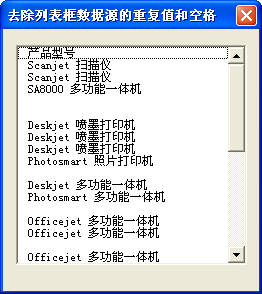

<u>图 110-1</u>	列表框中的重复值和空格

:::

为了在窗体显示时去除列表框的重复值和空格，可以使用 Add 方法，如下面的代码所示。

```vb
Private Sub UserForm_Initialize()
	On Error Resume Next
	Dim Col As New Collection
	Dim rng As Range, arr
	Dim i As Integer
	For Each rng In Range("A1:A" & [a65536].End(xlUp).Row)
		If Trim(rng) <> "" Then
			Col.Add rng, key:=CStr(rng)
		End If
	Next
	ReDim arr(1 To Col.Count)
	For i = 1 To Col.Count
		arr(i) = Col(i)
	Next
	Me.ListBox1.List = arr
End Sub
```

代码解析：

窗体的初始化事件，去除列表框引用工作表数据中的重复值和空格。

第 2 行代码，错误处理语句，忽略错误。

第 3 行到第 5 行代码，声明变量类型。

第 6 行到第 9 行代码代码，在列表框引用的工作表数据中循环，把工作表数据源中的空格去除后使用 Add 方法添加到变量 Col 中。Add 方法添加一个成员到 Collection 对象，语法如下：

```vb
object.Add item, key, before, after

参数object是必需的，一个有效的对象。
参数Item是必需的，任意类型的表达式，指定要添加到集合中的成员。
参数Key是可选的，唯一字符串表达式，指定可以使用的键字符串，代替位置索引来访问集合中的成员。
如果指定的key和集合中现有成员的key发生重复，则会导致错误发生。所以在第2行代码中使用错误处理语句，忽略错误，继续执行下一句代码，这样就将数据源中的重复值去除。
参数before是可选的，指定集合中的相对位置。在集合中将添加的成员放置在before参数识别的成员之前。如果参数是数值表达式，则before必须是介于 1 和集合Count属性值之间的值。如果参数是字符串表达式，则当添加一个被引用的成员到集合时，before 必须对应于指定的key值。可以指定before位置或after位置，但不能同时指定这两个位置。
参数after是可选的，指定集合中的相对位置。在集合中将添加的成员放置在After参数识别的成员之后。如果参数是数值表达式，则after必须是介于 1 和集合Count属性值之间的值；如果参数是字符串表达式，则当添加一个被引用的成员到集合时，after 必须对应于指定的key值。可以指定before位置或after位置，但不能同时指定这两个位置。
```

第 10 行到第 14 行代码，重新定义数组 arr 大小，把 Col 中数据赋给数组。

第 15 行代码，把数组 arr 复制到列表框中。

运行窗体，窗体中的列表框引用去除重复值和空格后的工作表数据，如图 110-2 所示。

::: center

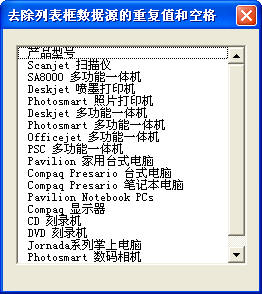

<u>图 110-2</u>	去除重复值和空格的列表框

:::

## 111、移动列表框条目

将列表框中的条目进行上下移动，如下面的代码所示。

```vb
Dim Intlist As Integer
Dim Strlist As String
Private Sub CommandButton1_Click() 
	With Me.ListBox1
		Intlist = .ListIndex
		Select Case Intlist
			Case -1
				MsgBox "请选择一行后再移动!"
			Case 0
				MsgBox "已经是最上一行了!"
			Case Is > 0
				Strlist = .List(Intlist)
				.List(Intlist) = .List(Intlist - 1)
				.List(Intlist - 1) = Strlist
				.ListIndex = Intlist - 1
		End Select
	End With
End Sub
Private Sub CommandButton2_Click() 
	With ListBox1
		Intlist = .ListIndex
		Select Case Intlist
			Case -1
				MsgBox "请选择一行后再移动!"
			Case .ListCount - 1
				MsgBox "已经是最下一行了!"
			Case Is < .ListCount - 1
				Strlist = .List(Intlist)
				.List(Intlist) = .List(Intlist + 1)
				.List(Intlist + 1) = Strlist
				.ListIndex = Intlist + 1
		End Select
	End With
End Sub
```

代码解析：

第 1、2 行代码在模块顶部声明两个变量分别用于保存列表框当前选中行的索引和内容。

第 3 行到第 18 行代码，将列表框当前选中行的内容上移一行的代码。其中第 5 行代码使用变量 Intlist 保存列表框当前选中行的索引号，第 6 行代码判断索引号,，第 7、8 行代码如果变量 Intlist 值为 -1 ，说明当前没有选中的行，显示一个消息框进行提示。第 9、10 行代码变量 Intlist 值为 0 ，说明当前选中的行已是第一行了。

列表框的 ListIndex 属性指定当前选中的列表框或组合框条目，语法如下：

```vb
object.ListIndex [= Variant]

参数object是必需的，一个有效的对象。
参数Variant是可选的，控件中当前被选的条目。
```

第 11 行到第 15 行代码将当前选中的行向下移动一行，其中第 12 行代码将当前选中的行的内容赋给变量 Strlist，第 13 行代码将当前选中行的内容更改为下面一行的内容，第 14 行代码将当前选中行的下面一行的内容更改为变量 Strlist 保存的内容，第 15 行代码将选中行向下移动一行，这样就将当前选中的行向下移动了一行。

第 19 行到第 34 行代码将当前选中的行向上移动一行。

将移动后的列表框条目保存到工作表中的代码如下：

```vb
Private Sub CommandButton3_Click()
	Dim i As Integer
	For i = 1 To ListBox1.ListCount
		Sheet1.Cells(i + 1, 1) = ListBox1.List(i - 1)
	Next
End Sub
```

代码解析：

窗体中“保存”按钮的单击过程，将移动后的列表框条目保存到工作表。

第 3 行到第 5 行代码使用 For...Next 语句循环遍历列表框所有条目，将 List 属性返回的列表框的列表条目写入到工作表中。List 属性返回或设置列表框或组合框的列表条目数，语法请参阅 109-2。

运行窗体效果如所示。

::: center

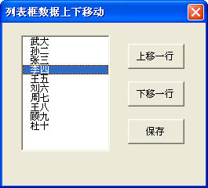

<u>图 111-1</u>	移动列表框条目

:::

## 112、允许多项选择的列表框

一般情况下在显示的列表框中用户只能选择一个列表项，而经过简单的设置，列表框条目前可以显示选项按钮，允许进行多项选择，如下面的代码所示。

```vb
Private Sub UserForm_Initialize()
	Dim arr As Variant
	arr = Array("经理室", "办公室", "生技科", "财务科", "营业部", "制水车间", "污水厂", "安装公司", "其他")
	With Me.ListBox1
		.List = arr
		.ListStyle = 1
		.MultiSelect = 1
	End With
End Sub
```

代码解析：

窗体的 Initialize 事件过程，在窗体初始化时对列表框进行设置。

其中第 5 行代码使用 List 属性为列表框添加列表项，请参阅 109-2。

第 6 行代码将列表框的 ListStyle 属性设置为 1（fmListStyleOption），显示用于多重选择列表的复选框，ListStyle 属性规定列表框或组合框中的列表的外观，语法如下：

```vb
object.ListStyle [= fmListStyle]

参数object是必需的，一个有效的对象。
参数fmListStyle是可选的，列表的可视风格，设置值如表格 112-1所示。
```

<u>表格 112-1</u>	fmListStyle 设置值

| 常量              | 值   | 说明                                                         |
| ----------------- | ---- | ------------------------------------------------------------ |
| fmListStylePlain  | 0    | 外观与常规的列表框相似，条目的背景为高亮                     |
| fmListStyleOption | 1    | 显示选项按钮，或显示用于多重选择列表的复选框（默认）。当用户选定组中的条目时，与该条目相关的选项按钮即被选中，而该组其他条目的选项按钮则被取消选择 |

ListStyle 属性可用来改变列表框或组合框的可视外观。通过一种不同于 fmListStylePlain 的设置，可以将任意控件的内容作为一组单独项目演示，每个项目都包含一个可视记号用以表示它是否被选中。

如果控件支持单一选择（MultiSelect 属性被设置为 mMultiSelectSingle），则可按下组中的一个按钮。如果控件支持多重选择，则可以按下组中两个或更多的按钮。

第 7 行代码将 MultiSelect 属性设置为 1（fmMultiSelectMulti），允许列表框进行多项选择，MultiSelect 属性表示对象是否允许多项选择，语法如下：

```vb
object.MultiSelect [= fmMultiSelect]

参数object是必需的，一个有效的对象。
参数fmMultiSelect是可选的，控件所用的选择方式，设置值如表格 112-2 所示。
```

<u>表格 112-2</u>	fmMultiSelect 设置值

| 常量                  | 值   | 说明                                                         |
| --------------------- | ---- | ------------------------------------------------------------ |
| fmMultiSelectSingle   | 0    | 只可选择一个条目（默认）                                     |
| fmMultiSelectMulti    | 1    | 按空格键或单击鼠标以选定列表中一个条目或取消选定             |
| fmMultiSelectExtended | 2    | 按 Shift 并单击鼠标，或按 Shift 的同时按一个方向键，将所选条目由前一项扩展到当前项。按 Ctrl 的同时单击鼠标可选定或取消选定 |

经过以上设置，列表框显示时可以进行多项选择并且条目前都有一个选项按钮用以表示它是否被选中，如图 112-1 所示。

::: center

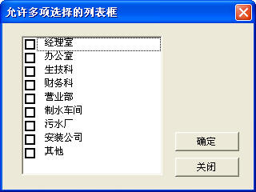

<u>图 112-1</u>	允许多项选择的列表框

:::

如果将列表框的 ListStyle 属性设置为 0 则与常规的列表框相似。

如果将列表框的 MultiSelect 属性设置 0 则列表框只能进行单项选择，如图 112-2 所示。

::: center

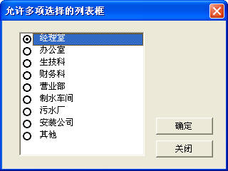

<u>图 112-2</u>	允许单项选择的列表框

:::

通过列表框的 Selected 属性值可以判断列表框中条目的选定状态，如下面的代码所示。

```vb
Private Sub CommandButton1_Click()
	Dim i As Integer
	Dim s As String
	For i = 0 To ListBox1.ListCount - 1
		If ListBox1.Selected(i) = True Then
			s = s & ListBox1.List(i) & Chr(13)
		End If
	Next
	If s <> "" Then
		MsgBox "你选择了：" & Chr(13) & s
	Else
		MsgBox "请最少选择一个部门!"
	End If
End Sub
```

代码解析：

按钮的单击过程，将列表框中选中的条目使用消息框显示出来。

第 4 行到第 8 行代码使用 For...Next 语句循环遍历列表框所有条目，通过返回的 Selected 属性值判断列表框中条目的选定状态，如果处于选中状态，第 6 行代码将列表框选中条目的值赋给字符串变量 s。

Selected 属性判断列表框中条目的选定状态，语法如下：

```vb
object.Selected( index ) [= Boolean]

参数object是必需的，一个有效的对象。
参数index是必需的，整数，取值范围是0到列表中的条目数减1之间的数值。
参数Boolean是必需的，判断一个条目是否被选中。
```

第 9 行到第 13 行代码使用消息框显示列表框中选中的条目。

运行窗体结果如图 112-3 所示。

::: center

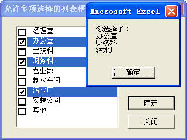

<u>图 112-3</u>	允许多项选择的列表框

:::

## 113、多列组合框和列表框的设置

### 1）多列组合框和列表框添加列表项

如果组合框和列表框是多列的话，除了使用 109 的方法外，还需要设置控件的其他属性，如下面的代码所示。

```vb
Private Sub UserForm_Initialize()
	Dim iRow As Integer
	Dim Arr As Variant
	iRow = Sheet1.Range("A65536").End(xlUp).Row
	Arr = Sheet1.Range("A1:G" & iRow)
	With Me.ListBox1
		.ColumnCount = 7
		.ColumnWidths = "45,45,45,45,45,30,45"
		.BoundColumn = 1
		.Column = Application.WorksheetFunction.Transpose(Arr)
	End With
End Sub
```

代码解析：

在窗体初始化时为多列列表框添加列表项。

第 4 行代码，设置列表框显示的列数。ColumnCount  属性指定列表框或组合框的显示列数，语法如下：

```vb
object.ColumnCount [= Long]

参数object是必需的，一个有效的对象。
参数Long是可选的，指定需显示的列数。
如果将ColumnCount设为 -1，将显示所有列。
```

第 8 行代码，设置列表框各列的宽度。ColumnWidths 属性指定多列的组合框或列表框中的各列的宽度，语法如下：

```vb
object.ColumnWidths [= String]

参数object是必需的，一个有效的对象。
参数String是可选的，以磅为单位设置列的宽度。
如将ColumnWidths 属性设为 -1 或空，则将控件宽度等分，给予列表中的各列。设为 0 则隐藏该列，大于 0 的数值则是该列的精确宽度值。若要指定另一种不同的度量单位，设置时必须包括该度量单位。
```

第 9 行代码，设置多列列表框中的第一列为数据的来源。BoundColumn 属性标识多列组合框或列表框中的数据的来源，语法如下：

```vb
object.BoundColumn [= Variant]

参数object是必需的，一个有效的对象。
参数Variant是可选的，标识选择 BoundColumn 属性值的方法，设置值如表格 113-1所示：
```

<u>表格 113-1</u>	Variant 的设置值

| 值           | 说明                                                         |
| ------------ | ------------------------------------------------------------ |
| 0            | 将 ListIndex 属性的值赋予控件。                              |
| 1 或者大于 1 | 将指定列中的值赋予控件。当采用此属性时，列从 1 开始计数（默认值）。 |

当选择了多列列表框的一行时，BoundColumn 属性标识出将该行的哪一条目作为控件的值存储。BoundColumn 属性设为 0，将所选行的行号赋予控件，作为控件的值。如果 BoundColumn 属性设为 1 或者大于 1，则将指定列中的值赋予控件。

第 10 行代码，设置多列列表框中列表的来源。在设置列表来源时除了可以使用 109 所介绍的方法外，还可以使用 Column 属性指定列表框中的一个或多个条目，Column 属性语法如下：

```vb
object.Column( column, row ) [= Variant]

参数object是必需的，一个有效对象。
参数column是可选的，取值范围为0到总列数减1之间的数值。
参数row是可选的，取值范围为0到总行数减1之间的数值。
参数Variant是可选的，指定欲加载到列表框的一个值、一列值或一个二维数组。
```

::: tip 注意

 当从一个二维数组中复制数据时，使用 Column 属性将转置控件中数组的内容，所以在加载时需使用 Transpose 函数对数组进行转置。

:::

多列列表框设置完成后效果如图 113-1 所示。

::: center

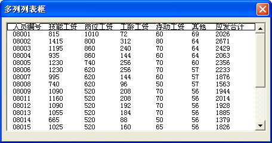

<u>图 113-1</u>	多列列表框

:::

### 2）多列列表框写入工作表

在把多列列表框的写入工作表中时，只能把 BoundColumn 属性所指定列中的值写入工作表中，不能把选中的整行内容写入到工作表中。如果需要把多列列表框中选中行的整行内容写入工作表中，可以使用循环语句将列表框各列的写入工作表，如下面的代码所示。

```vb
Private Sub UserForm_Initialize()
	Dim iRow As Integer
	iRow = Sheet2.Range("A65536").End(xlUp).Row
	With Me.ListBox1
		.ColumnCount = 7
		.ColumnWidths = "45,45,45,45,45,30,45"
		.BoundColumn = 1
		.ColumnHeads = True
		.RowSource = Sheet2.Range("A2:G" & iRow).Address(External:=True)
	End With
End Sub
Private Sub ListBox1_Click()
	Dim iRow As Integer
	Dim i As Byte
	iRow = Sheet1.Range("A65536").End(xlUp).Row + 1
	For i = 1 To ListBox1.ColumnCount
		Sheet1.Cells(iRow, i) = ListBox1.Column(i - 1)
	Next
End Sub
```

代码解析：

第 1 行到第 11 行代码窗体的 Initialize 事件过程，在窗体初始化时为多列列表框添加列表项，请参阅 113-1。

第 8 行代码，设置多列列表框中的第一行为列标题行。ColumnHeads 属性显示列表框、组合框及接受列题注的对象中的列标题行，语法如下：

```
object.ColumnHeads [= Boolean]

参数object是必需的，一个有效的对象。
参数Boolean是可选的，指定是否显示列标题。
```

将 ColumnHeads 属性设置为 True，多列列表框的第一行显示为列标题，默认值为 False，不显示列标题。

需要注意的是，当数据项中的第一行作为列标题时，则不可选中该行。

第 9 行代码，使用 RowSource 属性设置多列列表框中列表的来源。关于 RowSource 属性请参阅 109-1。

::: tip 注意

如果已将多列列表框中列表项来源的第一行设置为列标题，在设置 RowSource 属性时应从列表项来源的第二行开始设置。

:::

第 12 行到第 19 行代码列表框的 Click 事件，单击多列列表框时把选中行的整行内容写入工作表中。其中第 17 行代码，使用循环语句将多列列表框选中行的各列的值写入工作表对应的单元格中。关于 Column 属性请参阅 113-1，在本例中没有指定 row 参数，所以是把当前选中行的内容写入工作表。

运行窗体后，单击列表框将选中的整行内容写入工作表中，如图 113-2 所示。

::: center

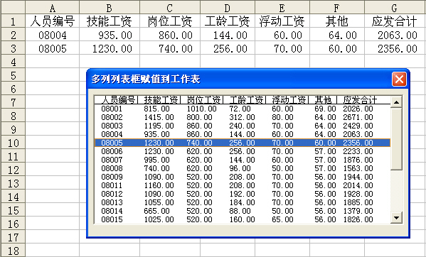

<u>图 113-2</u>	多列列表框选中的整行内容写入工作表

:::

## 114、输入时逐步提示信息

用户在录入数据时，比如在工作表中输入产品名称，除了希望有所有产品名称的下拉列表供选择外，更希望能逐步给出提示信息。比如在输入一两个字符后把符合条件的数据筛选出来供选择，最好是中英文、拼音首字母、大小写能混合查询，如输入“LJ”或“六角”后所有以“六角”开头的产品名称都筛选到列表中供选择，这将大大提高录入速度和正确率。

为了达到这一目的，首先在工作簿需要有如图 114-1 所示的基础数据表。

::: center

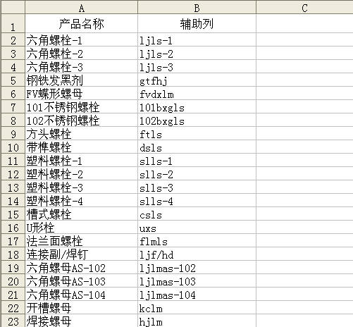

<u>图 114-1</u>	基础数据表

:::

基础数据表中 A 列保存不重复的产品名称，为了能用中英文、拼音首字母、大小写混合查询，要把产品名称转换成小写的拼音首字母保存在 B 列。

- 步骤 1：在 VBE 窗口单击菜单“插入”→“模块”，在代码窗口写入下面的代码。

```vb
Public Function LChin(Str As String) As Variant
	On Error Resume Next
	Str = StrConv(Str, vbNarrow)
	If Asc(Str) > 0 Or Err.Number = 1004 Then LChin = ""
	LChin = WorksheetFunction.VLookup(Str, [{"吖","a";"八","b";"嚓","c";"咑","d";"鵽","e";"发","f";"猤","g";"铪","h";"夻","j";"咔","k";"垃","l";"嘸","m";"旀","n";"噢","o";"妑","p";"七","q";"囕","r";"仨","s";"他","t";"屲","w";"夕","x";"丫","y";"帀","z"}], 2)
End Function
```

代码解析：

自定义 LChin 函数，该函数把中文字符转换为拼音首字母。

- 步骤 2：在 VBE 窗口双击 Sheet2 表，在代码窗口写入下面的代码。

```vb
Private Sub Worksheet_Change(ByVal Target As Range)
	Dim i As Integer
	Dim myStr As String
	With Target
		If .Column <> 1 Or .Count > 1 Then Exit Sub
		If WorksheetFunction.CountIf(Sheet2.Range("A:A"), .Value) > 1 Then
			.Value = ""
			MsgBox "不能输入重复的产品名称!", 64
			Exit Sub
		End If
		For i = 1 To Len(.Value)
			If Asc(Mid$(.Value, i, 1)) > 255 Or Asc(Mid$(.Value, i, 1)) < 0 Then
				myStr = myStr & LChin(Mid$(.Value, i, 1))
			Else
				myStr = myStr & LCase(Mid$(.Value, i, 1))
			End If
		Next
		.Offset(, 1).Value = myStr
	End With
End Sub
```

代码解析：

工作表的 Change 事件，当 A 列输入不重复的产品名称后，转换成小写的字母保存在 B 列的单元格中，便于以后的查询。

第 11 行代码，设置事件触发的条件，只有在 A 列输入产品名称后才触发 Change 事件。

第 12 行到第 16 行代码，使用工作表 CountIf 函数检查输入的产品名称是否重复。

第 17 行到第 23 行代码，字符的转换过程。首先检查是否是中文字符，如果是使用自定义函数 LChin 转换成小写拼音首字母。如果是大写的英文字母使用 LCase 函数转换成小写字母。

第 24 行代码，将转换后的字符保存到 B 列。

- 步骤 3：基础数据表完成后，在工作表“录入表”中添加一个文本框控件和一个列表框控件。在 VBE 窗口中双击 Sheet1 表，写入下面的代码。

```vb
Private Sub Worksheet_SelectionChange(ByVal Target As Range)
	Dim i As Integer
	If Target.Count = 1 Then
		If Target.Column = 1 And Target.Row > 1 Then
			With Me.TextBox1
				.Visible = True
				.Top = Target.Top
				.Left = Target.Left
				.Width = Target.Width
				.Height = Target.Height
				.Activate
			End With
			With Me.ListBox1
				.Visible = True
				.Top = Target.Top
				.Left = Target.Left + Target.Width
				.Width = Target.Width
				.Height = Target.Height * 5
				For i = 2 To Sheet2.Range("A65536").End(xlUp).Row
					.AddItem Sheet2.Cells(i, 1).Value
				Next
			End With
		Else
			Me.ListBox1.Clear
			Me.TextBox1 = ""
			Me.ListBox1.Visible = False
			Me.TextBox1.Visible = False
		End If
	End If
End Sub
```

代码解析：

工作表的 SelectionChange 事件，当用户选定工作表 A 列第 2 行以下的单个单元格时，设置文本框和列表框的 Visible 为 True，使它们成为可见的，并设置其外观，同时给列表框加载列表项。当用户选定其他列的单元格时隐藏文本框和列表框控件。

- 步骤 4：在设计模式下双击文本框，在代码窗口写入下面的代码。

```vb
Private Sub TextBox1_KeyUp(ByVal KeyCode As MSForms.ReturnInteger, ByVal Shift As Integer)
	Dim i As Integer
	Dim Language As Boolean
	Dim myStr As String
	Me.ListBox1.Clear
	With Me.TextBox1
		For i = 1 To Len(.Value)
			If Asc(Mid$(.Value, i, 1)) > 255 Or Asc(Mid$(.Value, i, 1)) < 0 Then
				Language = True
				myStr = myStr & Mid$(.Value, i, 1)
			Else
				myStr = myStr & LCase(Mid$(.Value, i, 1))
			End If
		Next
	End With
	With Sheet2
		For i = 2 To .Range("A65536").End(xlUp).Row
			If Language = True Then
				If Left(.Cells(i, 1).Value, Len(myStr)) = myStr Then
					Me.ListBox1.AddItem .Cells(i, 1).Value
				End If
			Else
				If Left(.Cells(i, 2).Value, Len(myStr)) = myStr Then
					Me.ListBox1.AddItem .Cells(i, 1).Value
				End If
			End If
		Next
	End With
End Sub
```

代码解析：

文本框的 KeyUp 事件，在文本框输入查询条件时筛选符合条件的数据加载到列表框。

第 3 行代码，声明变量 Language 为 Boolean 数据类型，在下面的代码中使用 Language 的值判断输入的是否为中文。

第 5 行代码，使用 Clear 方法删除列表框所有的列表项，语法如下：

```vb
object.Clear

参数object是必需的，一个有效的对象。
```

::: tip 注意

如果列表框绑定了数据，Clear 方法将会失败。

:::

第 6 行到第 15 行代码，判断文本框输入的是否为中文字符。如果是中文字符，将变量 Language 赋值为 True，并把文本框中的字符赋给变量 myStr。如果是英文字符则转换成小写字母后赋变量 myStr。

第 16 行到第 29 行代码，如果变量 Language 的值为 True，在基础数据表的 A 列中使用 Left 函数查找与文本框字符相符的单元格并加载到列表框，否则就在 B 列查找。

- 步骤 5：在设计模式下双击文本框，在代码窗口写入下面的代码。

```vb
Private Sub TextBox1_KeyDown(ByVal KeyCode As MSForms.ReturnInteger, ByVal Shift As Integer)
	If KeyCode = vbKeyReturn Then
		Sheet1.ListBox1.Activate
	End If
End Sub
```

代码解析：

文本框的 KeyDown 事件，当用户在文本框中输入完成，列表框中已显示所需的内容后按回车键后选择列表框。

- 步骤 6：在设计模式下双击列表框，在代码窗口写入下面的代码

```vb
Private Sub ListBox1_GotFocus()
	On Error Resume Next
	ListBox1.ListIndex = 0
End Sub
```

代码解析：

列表框的 GotFocus 事件，当用户在文本框中输入完成按回车键后，选定列表框中第 1 个条目，方便用户进行下一步操作。

```vb
Private Sub ListBox1_KeyDown(ByVal KeyCode As MSForms.ReturnInteger, ByVal Shift As Integer)
	If KeyCode = vbKeyReturn Then
		ActiveCell.Value = ListBox1.Value
		Me.ListBox1.Clear
		Me.TextBox1 = ""
		Me.ListBox1.Visible = False
		Me.TextBox1.Visible = False
	End If
End Sub
```

代码解析：

列表框的 KeyDown 事件，当用户在列表框中按下回车后将列表框选中的条目写入到活动工作表的单元格中，同时清空文本框和列表框内容后隐藏，准备下一次录入。

```vb
Private Sub ListBox1_DblClick(ByVal Cancel As MSForms.ReturnBoolean)
	ActiveCell.Value = ListBox1.Value
	Me.ListBox1.Clear
	Me.TextBox1 = ""
	Me.ListBox1.Visible = False
	Me.TextBox1.Visible = False
End Sub
```

代码解析：

列表框的 DblClick 事件，当用户双击列表框的列表项时，把列表框数据赋给活动单元格，同时清空文本框和列表框内容后隐藏，准备下一次录入。

以上设置完成后，在“录入”工作表的A列选定单元格后，显示一个文本框和一个列表框，在文本框中输入查询条件后列表框显示符合查询条件的所有内容供用户选择，如图 114-2 所示。

::: center

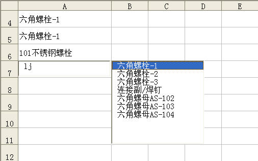

<u>图 114-2</u>	输入时逐步提示信息

:::

## 115、二级组合框

在使用多个组合框输入数据时，往往希望后一个组合框中的条目能根据前一个组合框的内容有所不同，如示例中第二个选择城市的组合框根据第一个选择省份的组合框所选择的不同省份加载不同的县市名称，示例代码如下：

```vb
Private Sub UserForm_Initialize()
	Dim col As New Collection
	Dim arr As Variant
	Dim rng As Range
	Dim i As Integer
	On Error Resume Next
	For Each rng In Range("A2:A" & Sheet1.Range("A65536").End(xlUp).Row)
		If rng <> "" Then col.Add rng, CStr(rng)
	Next
	ReDim arr(1 To col.Count)
	For i = 1 To col.Count
		arr(i) = col(i)
	Next
	ComboBox1.List = arr
	ComboBox1.ListIndex = 0
	CommandButton1.Accelerator = "D"
End Sub
Private Sub ComboBox1_Change()
	Dim myAddress As String
	Dim rng As Range
	Dim mymsg As Integer
	ComboBox2.Clear
	With Sheet1.Range("A:A")
		Set rng = .Find(What:=ComboBox1.Text)
			If Not rng Is Nothing Then
				myAddress = rng.Address
				Do
					ComboBox2.AddItem rng.Offset(, 1)
					Set rng = .FindNext(rng)
				Loop While Not rng Is Nothing And rng.Address <> myAddress
			End If
		End With
		ComboBox2.ListIndex = 0
End Sub
```

代码解析：

第 1 行到第 17 行代码窗体的 Initialize 事件过程，在窗体显示时将工作表 A 列中的省份名称去除重复后加载到组合框中。

其中第 7 行到第 13 行代码把工作表 A 列中的省份名称使用 Add 方法去除重复后加载到组合框中，应用于 Collection 对象的 Add 方法添加一个成员对象，请参阅 110 。

第 15 行代码设置组合框的 ListIndex 属性为 0，选中组合框的第一行条目。ListIndex 属性指定当前选中的列表框或组合框条目，语法如下：

```vb
object.ListIndex [= Variant]

参数Variant是可选的，控件中当前被选的条目。
```

ListIndex 属性包含列表中被选行的索引，取值范围为 -1 到列表总行数减 1（即ListCount - 1）之间的数值。当用户没有选中行时，ListIndex 返回 -1。列表中第一行的 ListIndex 值是 0，第二行的 ListIndex 值是 1，依此类推。

第 16 行代码设置窗体中按钮的 Accelerator 属性值。Accelerator 属性设置或检索控件的加速键，语法如下：

```vb
object.Accelerator [= String]

参数String是可选的，用作加速键的字符。
```

先按住 Alt 再紧接着按加速键，会将焦点定位到该对象上，并初始化与该对象关联的一个或多个事件，也就是说窗体显示后按 Alt+D 组合键将会执行“关闭”按钮中的代码关闭窗体。

第 18 行到第 34 行代码 ComboBox1 的 Change 事件过程，使用 Find 方法将所有属于 ComboBox1 所选择的省份的县市加载到 ComboBox2 中。关于 Find 方法请参阅 5-1。

窗体运行后效果如图 115-1 所示。

::: center

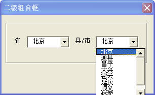

<u>图 115-1</u>	二级组合框

:::

