## 116、使用 DTP 控件输入日期

在工作表中输入日期可以使用日期时间控件（Microsoft Date and Time Picker Control 6.0，简称 DTP 控件）。

在工作表中单击菜单“视图”→“工具栏”→“控件工具箱”，选择“其他控件”中的 DTP 控件如图 116-1 所示，在工作表中添加一个 DTP 控件。

::: center

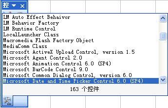

<u>图 116-1</u>	选择 DTP 控件

:::

在设计模式下双击 DTP 控件写入下面的代码：

```vb
Private Sub Worksheet_SelectionChange(ByVal Target As Range)
	With Me.DTPicker1
		If Target.Count = 1 And Target.Column = 2 And (Not Target.Row = 1) Or Target.MergeCells Then
			.Visible = True
			.Top = Selection.Top
			.Left = Selection.Left
			.Height = Selection.Height
			.Width = Selection.Width
			If Target.Cells(1, 1) <> "" Then
				.Value = Target.Cells(1, 1).Value
			Else
				.Value = Date
			End If
		Else
			.Visible = False
		End If
	End With
End Sub
Private Sub DTPicker1_CloseUp()
	ActiveCell.Value = Me.DTPicker1.Value
	Me.DTPicker1.Visible = False
End Sub
Private Sub Worksheet_Change(ByVal Target As Range)
	If Target.Count = 1 And Target.Column = 2 Or Target.MergeCells Then
		If Target.Cells(1, 1).Value = "" Then
			DTPicker1.Visible = False
		End If
	End If
End Sub
```

代码解析：

第 1 行到第 18 行代码工作表的 SelectionChange 事件，当选择工作表的 B 列第 2 行以下的单个单元格时显示日期控件供用户选择日期。

其中第 3 行代码设置显示日期控件的触发条件。只有当用户选择 B 列第 2 行以下单元格且只能选择单个单元格时才显示日期控件，因为本例 B 列中存在合并单元格，所以需要加上 Or Target.MergeCells 这个条件，否则单击合并单元格不显示日期控件。

第 4 行到第 8 行代码显示日期控件并设置日期控件的大小等于所选单元格的大小。

第 9 行到第 13 行代码，如果单元格已经输入了日期，将单元格中的日期赋给日期控件，否则将当前日期赋给日期控件。因为本例 B 列中存在合并单元格，而合并区域的值在该区域左上角的单元格中指定，所以用 Target.Cells(1, 1) 指定合并单元格的值，否则代码会出错。

第 15 行代码如果选择的是其他列则隐藏日期控件。

第 19 行到第 22 行代码日期控件的 CloseUp 事件，将日期控件的值赋给活动单元格后隐藏日期控件。

第 23 行到第 29 行代码工作表的 Change 事件，如果删除了 B 列单元格的日期则隐藏日期控件。

当用户选择 B 列单元格时效果如图 116-2 所示。

::: center

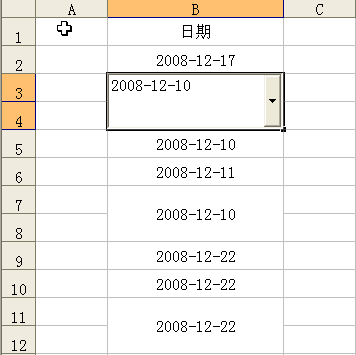

<u>图 116-2</u>	使用 DTP 控件输入日期

:::

## 117、使用 RefEdit 控件选择区域

在 76-2 中介绍了如何使用 InputBox 方法获得所选单元格区域的地址，而使用 RefEdit 控件获得单元格区域的地址比使用 InputBox 方法更加方便，可以单击 RefEdit 控件中的按钮以折叠用户窗体，选定区域后再单击按钮展开用户窗体，示例代码如下：

```vb
Private Sub CommandButton1_Click()
	Dim Rng As Range
	On Error GoTo line
	Set Rng = Range(RefEdit1.Value)
		Rng.Interior.ColorIndex = 15
		Unload UserForm1
		Exit Sub
line:
	MsgBox "你选择的是非单元格区域!"
End Sub
```

代码解析：

用户窗体中按钮的单击事件过程，改变用户使用 RefEdit 控件所选择的单元格区域内部的颜色。

第 3 行代码，错误处理语句。因为如果用户输入或选定了错误的单元格区域地址，将显示一错误信息，如图 117-1 所示，所以必需使用 On Error GoTo 语句来绕过错误。

::: center

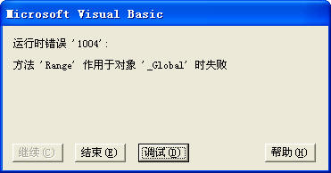

<u>图 117-1</u>	提示运行错误

:::

第 4 行代码，使用 Set 语句将用户选择的单元格区域赋给变量 rng。

第 5 行代码，改变用户所选单元格区域内部的颜色。

::: tip 注意

不能在无模式用户窗体中使用 RefEdit 控件。

:::

窗体运行后，当用户在工作表中选择一个单元格区域后改变所选单元格区域内部的颜色，如图 117-2 所示。

::: center

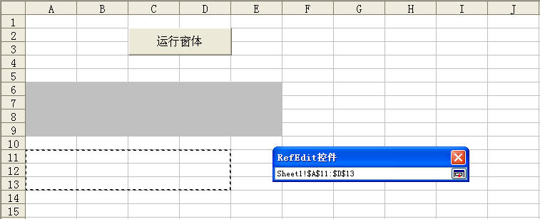

<u>图 117-2</u>	使用 RefEdit 控件获得区域地址

:::

## 118、如何注册控件

Excel 文件中如果有 ActiveX 控件如日期时间控件（Microsoft Date and Time Picker Control 6.0，简称 DTP 控件），在有些电脑上运行时会出现“无法装载这个对象，因为它不适于这台计算机”的提示，如图 118-1 所示。文件中的控件丢失，无法正常使用。

::: center

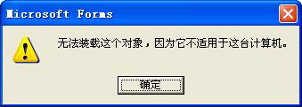

<u>图 118-1</u>	无法装载对象提示

:::

这是因为 DTP 控件没有注册引起的，解决办法是在能运行该控件的电脑中复制 DTP 控件的文件到目标电脑中进行注册。在 VBE 窗口中右键单击“工具箱”，选择“附加控件”，在“附加控件”对话框中选择 DTP 控件，对话框底部会显示控件的名称和文件所在的路径，如图 118-2 所示。

::: center

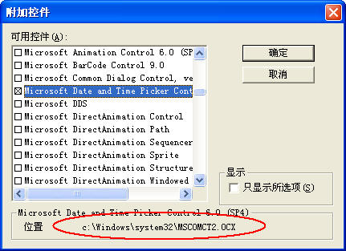

<u>图 118-2</u>	OCX 文件名称和路径

:::

DTP 控件的文件名为 MSCOMCT2.OCX，在 `C盘的Windows\system32` 文件夹中，把该文件复制到目标电脑 `C盘的Windows\system32` 文件夹中，单击“开始”→“运行”，在“运行”对话框中键入“regsvr32 C:\Windows\system32\MSCOMCT2.OCX”，注册成功后会出现如图 118-3 所示的对话框，DTP 控件即能正常使用。

::: center

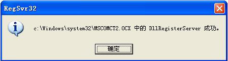

<u>图 118-3</u>	注册成功提示

:::

在 Excel 中可以使用程序代码进行自动注册，代码如下：

```vb
Sub regsvrs()
	Dim SouFile As String
	Dim DesFile As String
	On Error Resume Next
	SouFile = ThisWorkbook.Path & "\MSCOMCT2.OCX"
	DesFile = "c:\Windows\system32\MSCOMCT2.OCX"
	FileCopy SouFile, DesFile
	Shell "regsvr32 /s" & DesFile
	MsgBox "DTP控件已成功注册，现在可以使用了!"
End Sub
```

代码解析：

Regsvrs 过程将保存在同一目录中的 MSCOMCT2.OCX 文件复制到电脑的文件夹中，使用 Shell 函数注册 DTP 控件。

第 4 行代码，错误处理语句，用于忽略复制文件时可能出现的错误。因为如果电脑文件夹中已存在 MSCOMCT2.OCX 文件，使用 FileCopy 方法复制时会发生错误，如图 118-4 所示。

::: center

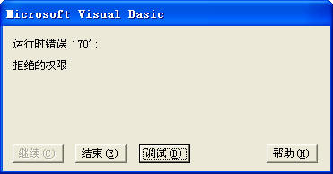

<u>图 118-4</u>	复制文件错误提示

:::

第 7 行代码，使用 FileCopy 方法复制 MSCOMCT2.OCX 文件到电脑中。

FileCopy 方法的语法如下：

```vb
FileCopy source, destination

参数Source是必需的，字符串表达式，用来表示要被复制的文件名。
参数destination是必需的，字符串表达式，用来指定要复制的目的文件名。
```

第 8 行代码，使用 Shell 函数注册 DTP 控件。

Shell 函数执行一个可执行文件，语法如下：

```vb
Shell(pathname[,windowstyle])

参数pathname是必需的，要执行的程序名，以及任何必需的参数或命令行变量，可能还包括目录或文件夹，以及驱动器。
参数windowstyle是可选的，表示在程序运行时窗口的样式。windowstyle参数值如表格 1181所示。
```

<u>表格 118-1</u>	windowstyle参数值

| 常量               | 值   | 描述                                                         |
| ------------------ | ---- | ------------------------------------------------------------ |
| vbHide             | 0    | 窗口被隐藏，且焦点会移到隐式窗口。常数vbHide在Macintosh平台不可用。 |
| VbNormalFocus      | 1    | 窗口具有焦点，且会还原到它原来的大小和位置。                 |
| VbMinimizedFocus   | 2    | 窗口会以一个具有焦点的图标来显示。                           |
| VbMaximizedFocus   | 3    | 窗口是一个具有焦点的最大化窗口。                             |
| VbNormalNoFocus    | 4    | 窗口会被还原到最近使用的大小和位置，而当前活动的窗口仍然保持活动。 |
| VbMinimizedNoFocus | 6    | 窗口会以一个图标来显示。而当前活动的的窗口仍然保持活动。     |

运行程序前应确保在工作簿同一目录中存在 MSCOMCT2.OCX 文件。此代码相当于在“运行”对话框中键入“regsvr32 C:\ Windows\system32\MSCOMCT2.OCX”后进行注册，只是在“REGSVR32”后加上了 s 参数，使注册成功后不会出现如图 118-3 所示的对话框。

可以使用程序代码卸载该控件，代码如下：

```vb
Sub regsvru()
	Shell "REGSVR32 /u " & ThisWorkbook.Path & "\MSCOMCT2.OCX"
End Sub
```

代码解析：

Regsvru 过程使用 Shell 函数注册 DTP 控件，在 pathname 参数“REGSVR32”后加上 u 参数，对 DTP 控件进行反注册。

## 119、遍历控件的方法

如果窗体或工作表中的控件很多，在写代码时，如果是相同的代码，可以使用循环语句遍历控件，无需每个控件都写相同的代码，以减少代码量。

### 1）使用名称中的变量遍历控件

如果控件使用系统缺省名称，如“TextBox1”、“TextBox2”，前面是固定的字符串，后面是序号的，可以使用 For...Next 语句循环遍历控件。

对于窗体中的控件，如下面的代码所示。

```vb
Private Sub CommandButton1_Click()
	Dim i As Integer
	For i = 1 To 3
		Me.Controls("TextBox" & i) = ""
	Next
End Sub
```

代码解析：

窗体按钮的单击事件，一次性清空窗体中三个文本框的内容。

第 4 行代码，将窗体中三个文本框名称中的最后一个序号设成变量，在文本框中循环并清空其内容。

对于工作表中的控件，如下面的代码所示。

```vb
Private Sub CommandButton1_Click()
	Dim i As Integer
	For i = 1 To 4
		Me.OLEObjects("TextBox" & i).Object.Text = ""
	Next
End Sub
```

代码解析：

工作表中按钮的单击事件，在工作表中的三个文本框中循环，清空文本框的内容。

第 4 行代码，将工作表中四个文本框名称中的最后一个序号设成变量，使用 OLEObjects 方法在工作表中的文本框中循环。

OLEObjects 方法返回图表或工作表上单个 OLE 对象（OLEObject）或所有 OLE 对象的集合（OLEObjects 集合）的对象，语法如下：

```vb
expression.OLEObjects(Index)

参数expression是必需的，返回一个Chart 对象或Worksheet 对象。
参数Index 是可选的，OLE对象的名称或编号。
```

注意 控件的名称是指控件在属性窗口中的名称，如图 119-1 所示。如果控件的名称没有规律不适用此方法。

::: center

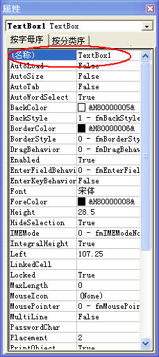

<u>图 119-1</u>	控件属性窗口中的名称

:::

### 2）使用对象类型遍历控件

如果控件的名称没有规律，可以使用 For Each...Next 语句循环遍历所有控件，使用 TypeName 函数返回控件的对象类型，根据控件的对象类型进行相应的操作。

对于窗体中的控件，如下面的代码所示。

```vb
Private Sub CommandButton1_Click()
	Dim Ctr As Control
	For Each Ctr In Me.Controls
		If TypeName(Ctr) = "TextBox" Then
			Ctr = ""
		End If
	Next
End Sub
```

代码解析：

按钮的单击事件，遍历所有控件并把所有文本框的内容清空。

第 2 行代码，声明变量类型。

第 3 行代码，使用 For Each...Next 语句遍历窗体所有控件。

第 4 行代码，使用 TypeName 函数返回变量的对象类型。

TypeName 函数返回一个字符串，提供有关变量的信息，语法如下：

```vb
TypeName(varname)

参数 varname是必需的，它包含用户定义类型变量之外的任何变量。
```

如果变量 Ctr 是文本框控件，无论该文本框的名称是否已经被修改，TypeName(Ctr) 都会返回“TextBox”字符串。

对于工作表中的控件，则使用下面的代码。

```vb
Private Sub CommandButton1_Click()
	Dim Obj As OLEObject
	For Each Obj In Me.OLEObjects
		If TypeName(Obj.Object) = "TextBox" Then
			Obj.Object.Text = ""
		End If
	Next
End Sub
```

### 3）使用程序标识符遍历控件

工作表中的 ActiveX 控件还可以根据控件的程序标识符找到相应的控件，如下面的代码所示。

```vb
Private Sub CommandButton1_Click()
	Dim Obj As OLEObject
	For Each Obj In Me.OLEObjects
		If Obj.progID = "Forms.TextBox.1" Then
			Obj.Object.Text = ""
		End If
	Next
End Sub
```

代码解析：

工作表中按钮的单击事件，遍历工作表中的所有控件并把工作表中所有文本框的内容清空。

第 2 行代码，声明变量类型。

第 3 行代码，使用 For Each...Next 语句遍历工作表中的所有控件。

第 4 行代码，使用控件的 ProgId 属性返回控件的程序标识符。

ProgId 属性返回控件的程序标识符，语法如下：

```vb
expression.ProgId

参数expression是必需的，一个有效的对象。
```

ActiveX 控件的程序标识符如表格 119-1 所示。

<u>表格 119-1</u>	ActiveX 控件的程序标识符

| 控件名称 | 标识符                |
| -------- | --------------------- |
| 复选框   | Forms.CheckBox.1      |
| 组合框   | Forms.ComboBox.1      |
| 命令按钮 | Forms.CommandButton.1 |
| 框架     | Forms.Frame.1         |
| 图像     | Forms.Image.1         |
| 标签     | Forms.Label.1         |
| 列表框   | Forms.ListBox.1       |
| 多页     | Forms.ListBox.1       |
| 选项按钮 | Forms.OptionButton.1  |
| 滚动条   | Forms.ScrollBar.1     |
| 旋转按钮 | Forms.SpinButton.1    |
| TabStrip | Forms.TabStrip.1      |
| 文字框   | Forms.TextBox.1       |
| 切换按钮 | Forms.ToggleButton.1  |

文本框控件返回的程序标识符是“Forms.TextBox.1”，此返回值并不受文本框控件名称的影响，所以根据工作表中控件的程序标识符可以找出全部文本框控件。

### 4）使用名称中的变量遍历图形

如果工作表中有多个图形，可以根据名称的序号使用 For...Next 语句遍历图形，如下面的代码所示。

```vb
Private Sub CommandButton1_Click()
	Dim i As Integer
	For i = 1 To 3
		Me.Shapes("文本框 " & i).TextFrame.Characters.Text = "TextBox" & i
	Next
End Sub
```

代码解析：

工作表中按钮的单击事件，在工作表中的三个图形文本框中依次写入“TextBox1”、“TextBox2”和“TextBox3”字符串。

第 3 行到第 5 行代码，使用 Shapes 属性在工作表上的三个图形文本框中循环。

Shapes 属性返回 Shapes 对象，代表工作表或图形工作表上的所有图形，可以使用 Shapes(index)（其中 index 是图形的名称或索引号）返回单个的 Shape 对象。

返回单个的 Shape 对象后使用 Characters 方法向图形文本框中添加字符。Characters 方法的语法如下：

```vb
expression.Characters(Start, Length)

参数expression是必需的，返回一个指定文本框内Characters对象的表达式。
参数Start是可选的，表示将要返回的第一个字符。如果此参数设置为 1 或被忽略，则Characters方法会返回以第一个字符为起始字符的字符区域。
参数Length是可选的，表示要返回的字符个数。如果此参数被忽略，则Characters 方法会返回该字符串的剩余部分。
```

### 5）使用 FormControlType 属性遍历图形

如果工作表中的是窗体控件，可以使用 For Each...Next 语句遍历工作表中图形并根据其 FormControlType 属性返回特定的窗体控件，如下面的代码所示。

```vb
Private Sub CommandButton2_Click()
	Dim myShape As Shape
	For Each myShape In Sheet4.Shapes
		If myShape.Type = msoFormControl Then
			If myShape.FormControlType = xlCheckBox Then
				myShape.ControlFormat.Value = 1
			End If
		End If
	Next
End Sub
```

代码解析：

工作表中按钮的单击事件，清除工作表中所有的复选框。

第 2 行代码声明变量 myShape 为图形对象。

第 3 行代码使用 For Each...Next 语句遍历工作表中的图形。

第 4 行代码根据图形的 Type 属性判断图形是否为窗体控件。应用于 Shape 对象的 Type 属性返回或设置图形类型，窗体控件返回常量 msoFormControl。

第 5 行代码根据控件的 FormControlType 属性判断窗体控件是否为复选框控件。FormControlType 属性返回窗体控件的类型，可以为表格 119-2 所示的 XlFormControl 常量之一。

<u>表格 119-2</u>	XlFormControl 常量

| 常量            | 值   | 控件类型 |
| --------------- | ---- | -------- |
| xlButtonControl | 0    | 按钮     |
| xlCheckBox      | 1    | 复选框   |
| xlDropDown      | 2    | 组合框   |
| xlGroupBox      | 4    | 分组框   |
| xlLabel         | 5    | 标签     |
| xlListBox       | 6    | 列表框   |
| xlOptionButton  | 7    | 选项按钮 |
| xlScrollBar     | 8    | 滚动条   |
| xlSpinner       | 9    | 微调项   |

第 6 行代码使用 ControlFormat 属性返回工作表中的复选框，并将其他 Value 属性设置为 1 选中复选框，如果需要取消复选框只需将 Value 属性设置为 -4146。

## 120、使微调框最小变动量小于 1

在用微调框调节数值时，默认的变动量只能设置成整数。为了使微调框的变动量小于 1，如每次的变动量为 0.01，需要在代码中做必要的设置，如下面的代码所示。

```vb
Private Sub UserForm_Initialize()
	With Me.SpinButton1
		.Max = 10000
		.Min = -10000
		.SmallChange = 1
		.Value = 0
		Me.TextBox1 = Format(.Value, "0.00")
	End With
End Sub
Private Sub SpinButton1_Change()
	Me.TextBox1 = Format(Me.SpinButton1 * 0.01, "0.00")
End Sub
```

代码解析：

使用微调框调节文本框的数值，每次的变动量为 0.01。

第 1 行代码到第 9 行代码，窗体的初始化事件，在窗体显示时对微调框控件进行必要的设置。

第 3、4 行代码，设置微调框控件的 Max、Min 属性。Max、Min 属性规定滚动条或数值调节钮的 Value 属性可接收的最大值和最小值，语法如下：

```vb
object.Max [= Long]
object.Min [= Long]

参数object是必需的，一个有效的对象。
参数Long是可选的，指定Value属性的最大设置值或最小设置值。
```

第 5 行代码，设置微调框控件的 SmallChange 属性为 1。SmallChange 属性设定当用户单击滚动条或数值调节钮中的滚动箭头时发生的变动量，语法如下：

```vb
object.SmallChange [= Long]

参数object是必需的，一个有效的对象。
参数Long是可选的，设定Value属性的变动量。
```

SmallChange 属性只能设置为整数。

第 6 行代码，设置窗体显示时微调框控件的 Value 属性为 0。

第 7 行代码，使用 Format 函数将将文本框的初始值格式化为“0.00”。关于 Format 函数请参阅 102 。

第 11 行代码，微调框控件的 Change 事件，在微调框控件的 Value 属性发生变动时，将变动量乘 0.01 后赋给文本框，使文本框的变动量每次为 0.01。

窗体运行后效果如图 120-1 所示。

::: center

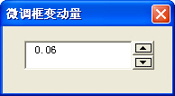

<u>图 120-1</u>	微调框变动量小于 1

:::

## 121、不打印工作表中的控件

在打印工作表时，如果工作表中有控件，会把控件也一起打印出来，从而影响打印出来的工作表的美观。经过简单的设置能使工作表中的控件不被打印出来。

### 1）设置控件格式

如果工作表中的是窗体控件，设置时右键单击控件，在显示的右键快捷菜单中选择“设置控件格式”，在“设置控件格式”选项卡中选择“属性”页面，使“打印对象”前的复选框为空白状态，如图 121-1 所示。

::: center

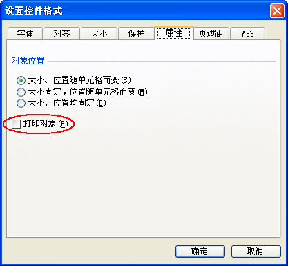

<u>图 121-1</u>	窗体控件

:::

如果工作表中的控件是 ActiveX 控件，那么需要在设计模式下右键单击控件，在显示的右键快捷菜单中选择“设置控件格式”，在“设置控件格式”选项卡中选择“属性”页面，使“打印对象”前的复选框为空白状态，如图 121-2 所示。

::: center

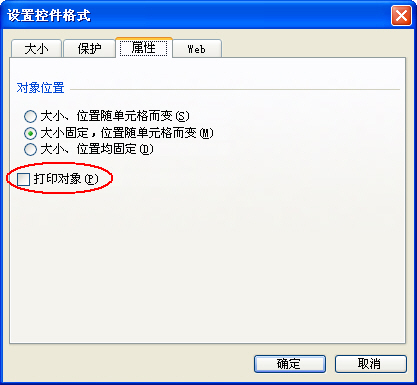

<u>图 121-2</u>	ActiveX 控件

:::

### 2）设置控件的 printobjcet 属性

如果工作表中的控件是 ActiveX 控件，使用除了使用 121-1 的方法外，还可以在设计模式下右键单击控件，选择“属性”，设置控件的 printobjcet 属性为 False。如图 121-3 所示。

::: center

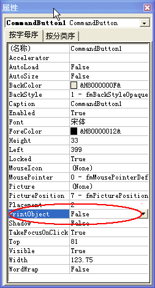

<u>图 121-3</u>	设置控件 printobjcet 属性

:::

## 122、在框架中使用滚动条

如果需要在窗体中显示较多的内容，比如使用标签显示一段很长的文本内容，而又不希望窗体很大的话，可以在窗体中使用框架放置标签，设置框架可滚动区域的高度，使标签可以进行上下移动以查看全部区域。

在VBE窗口中单击菜单“插入”→“用户窗体”，在窗体中添加一个框架控件，在框架中添加一个标签控件。根据需要显示的内容调整好标签的大小，再将框架和窗体调整为合适的大小。

在VBE中双击窗体，写入下面的代码。

```vb
Private Sub UserForm_Initialize()
	Dim sLab As String
	sLab = Space(4) & "欢迎来到ExcelHome技术论坛，全球最领先的Excel技术论坛之一。" & vbLf _
		& Space(4) & "在这里，我们讨论Microsoft Office系列产品的应用技术，重点讨论Microsoft Excel。本论坛从属于Excel Home这一全球最大的华语Excel技术门户，目前是个人、非营利性质的网站学习平台。各行各业的Excel使用者都活跃在此，各种形式的学习资源也汇聚于在此，所以，只要您愿意花时间，并使用正确的方法，我们有理由相信您的绝大部分应用问题和学习愿望都在这里被满足。无数已经取得了非凡进步的人，也可以证明这一点。" & vbLf _
		& Space(4) & "Let’s do it better!这是Excel Home的口号，我们的宗旨是帮助大家解决在使用Office软件中的问题，提升自己的应用技能。" & vbLf _
		& Space(4) & "鉴于许多人在此之前没有正确使用网络学习资源的经验，或者对Excel Home的行为规则缺乏了解，我们特别准备了这样一篇文章，送给每一位有志与我们一起成长的朋友。本文将重点叙述学习方法和论坛的规则，对于如何使用论坛的各项功能，请阅读论坛的帮助系统（http://club.excelhome.net/boardhelp.asp ）"
	Label1.Caption = sLab
	With Frame1
		.ScrollBars = 2
		.ScrollHeight = Label1.Height
	End With
End Sub
```

代码解析：

窗体的初始化事件，在窗体加载时使用标签显示文本内容。

第 3 行到第 6 行代码，变量 sLab 为要显示的文本，使用 Space 函数在每段的首字前插入 4 个空格，使首字缩进。在需要换行的地方插入常数 vbLf 进行换行。

第 9 行代码，设置框架的 ScrollBars 属性为显示垂直滚动条。ScrollBars 属性指定一个控件、窗体或页面是否有垂直或水平滚动条，或两者都有，语法如下：

```vb
object.ScrollBars [= fmScrollBars]

参数object是必需的，一个有效的对象。
参数fmScrollBars是可选的，滚动条的显示位置，设置值如表格 122-1所示。
```

<u>表格 122-1</u>	ScrollBars 属性设置值

| 常量                   | 值   | 说明                     |
| ---------------------- | ---- | ------------------------ |
| fmScrollBarsNone       | 0    | 不显示滚动条（默认）。   |
| fmScrollBarsHorizontal | 1    | 显示水平滚动条。         |
| fmScrollBarsVertical   | 2    | 显示垂直滚动条。         |
| fmScrollBarsBoth       | 3    | 垂直和水平滚动条都显示。 |

第 10 行代码，设置框架的 ScrollHeight 属性为标签的高度。ScrollHeight 属性指定通过移动控件、窗体或页面中的滚动条，可以查看的全部区域的高度，语法如下：

```vb
object.ScrollHeight [= Single]

参数object是必需的，一个有效的对象。
参数Single是可选的，可滚动区域的高度。
```

如果框架具有水平滚动条，可以设置框架的 ScrollWidth 属性来设置可以查看的全部区域的宽度。

运行窗体，使用标签显示文本内容，可通过框架的滚动条查看全部内容，如图 122-1 所示。

::: center

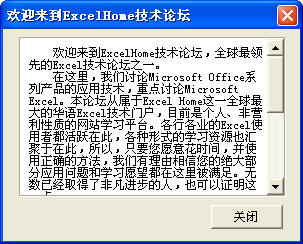

<u>图 122-1</u>	在框架中使用滚动条

:::

## 123、使用多页控件

在处理可以划分为不同类别的大量信息时可以使用多页控件。例如，在示例中，多页控件的第一页用于显示欢迎信息，另三页显示其他信息。利用多页控件能够将相关信息组织在一起显示出来，同时又能够随时访问整条记录。

多页控件中的每个页面都是一个窗体，含有自己的控件，并且可以有唯一的布局。一般情况下，多页控件中的页面都有标签，以便让用户选择单个页面。

在窗体中使用多页控件时，往往希望窗体显示时能显示特定的页面，比如每次打开窗体时先显示第一页的欢迎信息，除了在 VBE 中选择多页控件的第一页后保存外，还可以通过设置多页控件的 Value 属性来实现，如下面的代码所示。

```vb
Private Sub UserForm_Initialize()
	MultiPage1.Value = 0
End Sub
```

代码解析：

窗体的 Initialize 事件，在窗体显示时选择多页控件的第一页。

控件的 Value 属性定义某给定的控件的状态或内容，对于多页控件标识当前激活页。

Value 属性是多页控件的默认属性，该属性返回当前活动页面的索引编号（位于多页控件的 Pages 集合中），零 ( 0 ) 表示是第一页，最大值比总页数少一。

多页控件的默认事件是 Change 事件，示例中使用消息框显示当前活动页面的 Caption 属性，代码如下：

```vb
Private Sub MultiPage1_Change()
	If MultiPage1.SelectedItem.Index > 0 Then
		MsgBox "欢迎来到" & MultiPage1.SelectedItem.Caption & "版块!"
	End If
End Sub
```

代码解析：

MultiPage1_Change 过程根据当前活动页面是否是第一页，如果不是则使用消息框显示当前活动页面的 Caption 属性。

应用于 Page 对象的 Index 属性指 Pages 集合中 Page 对象的位置，语法如下：

```vb
object.Index [= Integer]

参数object是必需的，一个有效对象。
参数Integer是可选的，当前选定的Page对象的索引。
```

Index 属性指定了标签出现的顺序，改变 Index 属性的值将改变多页控件中页面的顺序，第一页的索引值是 0，第二页的索引值是 1，依此类推。

应用于多页控件的 SelectedItem 属性返回当前选中的 Page 对象，SelectedItem 属性是只读的，用 SelectedItem 属性可对当前选中的 Page 对象进行可编程控制。

运行窗体，多页控件显示第一页的欢迎信息，当选择其他页面时显示提示信息，如图 123-1 所示。

::: center

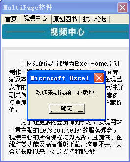

<u>图 123-1</u>	使用多页控件

:::

## 124、标签文字垂直居中对齐

在使用标签控件为其他控件作题注时，只能设置题注文字在水平方向的对齐方式，不能设置为垂直居中。要达到题注文字垂直居中的效果，可以使用两个标签控件组合来完成。

- 步骤 1，在窗体中添加一个标签控件 Label1，将 Caption 属性设置为空，再设置需要的背景颜色及边框颜色。

- 步骤 2，添加一个标签控件 Label2，将 Caption 属性设置为需要的标题；AutoSize 属性设置为 True，BackStyle 属性设置为 0，TextAligh 属性设置为 fmTextAlignCenter，其它属性不改变。

AutoSize 属性规定对象是否自动调整大小以显示其完整的内容，语法如下：

```vb
object.AutoSize [= Boolean]

参数object是必需的，一个有效对象。
参数Boolean是可选的，是否自动调整大小。设置值为True控件可自动调整大小以显示其完整的内容，设置为False控件尺寸保持不变。如果内容超出了控件的区域，内容将被剪裁（默认）。
```

BorderStyle 属性指定控件或窗体的边框类型，语法如下：

```vb
object.BorderStyle [= fmBorderStyle]

参数object是必需的，一个有效对象。
参数fmBorderStyle是可选的，指定边框类型，设置值如表格 1241所示。
```

<u>表格 124-1</u>	fmBorderStyle 设置值

| 常量                   | 值   | 描述                   |
| ---------------------- | ---- | ---------------------- |
| fmBackStyleTransparent | 0    | 背景为透明             |
| fmBackStyleOpaque      | 1    | 背景为不透明（默认值） |

TextAligh 属性定义控件中文本的对齐方式，语法如下：

```vb
object.TextAlign [= fmTextAlign]

参数object是必需的，一个有效对象。
参数fmTextAlign是可选的，控件中文本的对齐方式，设置值如表格 124-2 所示。
```

<u>表格 124-2</u>	fmTextAlign设置值

| 常量              | 值   | 描述                                                         |
| ----------------- | ---- | ------------------------------------------------------------ |
| fmTextAlignLeft   | 1    | 将所显示文本的第一个字符与控件显示或编辑区的左边界对齐（默认值）。 |
| fmTextAlignCenter | 2    | 在控件的显示或编辑区中，使文本中央对齐                       |
| fmTextAlignRight  | 3    | 将所显示文本的最后一个字符与控件显示或编辑区的右边界对齐。   |

- 步骤 3，同时选中两个标签控件，在右键弹出菜单中选择“统一尺寸”→“宽度相同”，再右击选择“对齐”→“左对齐”，重新右键“对齐”→“中间对齐”。

- 步骤 4，最后同时选中两个标签控件，在右键弹出菜单中选择“生成组”，就达到标题为垂直居中的效果了，如图 124-1 窗体中左边的标签所示。

::: center

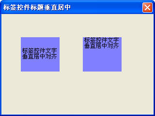

<u>图 124-1</u>	标签控件标题垂直居中

:::

## 125、使用 TabStrip 控件

使用 TabStrip 控件，可以在用户窗体中的同一区域定义多个数据页面，也就是说使用 TabStrip 控件可以使用户窗体中的同一组控件根据 TabStrip 控件所选择的页面具有不同的功能，而不必像多页控件那样需要在每个页面中放置相同的控件。

在示例的窗体中使用一个图像控件和一个标签控件，根据 TabStrip 控件所选择的页面来显示相应城市的图片和标签控件的题注。

- 步骤 1，在窗体中添加一个 TabStrip 控件，默认情况下，一个 TabStrip 控件包含两个页面，所以需要在 TabStrip 控件上右键单击，在显示的右键菜单中选择“新建页”继续添加三个页面。因为 TabStrip 控件不像多页控件具有分页的属性窗口，所以需要在显示的右键菜单中选择“重命名”将页面分别重命名为各城市的名称。

- 步骤 2，在 TabStrip 控件上添加一个 Image 控件和一个 Label 控件，调整为合适的大小。

- 步骤 3，双击窗体写入下面的代码：

```vb
Private Sub TabStrip1_Change()
	Dim FilPath As String
	FilPath = ThisWorkbook.Path & "\" & TabStrip1.SelectedItem.Caption & ".jpg"
	Image1.Picture = LoadPicture(FilPath)
	Label1.Caption = TabStrip1.SelectedItem.Caption & "欢迎您!"
End Sub
Private Sub UserForm_Initialize()
	TabStrip1.Value = 0
End Sub
```

代码解析：

第 1 行到第 6 行代码，TabStrip 控件的 Change 事件过程，根据 TabStrip 控件所选择的页面来显示相应城市的图片和标签控件的题注。

第 3 行代码设置 Image 控件需加载图片的完整路径，使用 SelectedItem 属性返回 TabStrip 控件当前选中页面的 Caption 属性，即窗体中所选城市的名称，将图片的完整路径设置为保存在同一目录中已命名为所选城市的图片。

 第 4 行代码为 Image 控件加载图片。Picture 属性指定显示在对象上的位图，语法如下：

```vb
object.Picture = LoadPicture( pathname )

参数expression是必需的，一个有效的对象。
参数pathname是必需的，一个图片文件的完整路径。
```

第 5 行代码设置标签控件的题注为窗体中所选城市的名称和“欢迎您!”。

第 7 行到第 9 行代码窗体的 Initialize 事件过程，为了使窗体显示时 TabStrip 控件显示第一页，将其 Value 设置为零 ( 0 )。

运行窗体，选择不同的标签将显示不同城市的图片，如图 125-1 所示。

::: center


<u>图 125-1</u>	使用 TabStrip 控件（一）

:::

如果将 TabStrip 控件的 Style 属性设置为 1，则在标签条中显示的是按钮而不是标签，如图 125-2 所示。

::: center


<u>图 125-2</u>	使用 TabStrip 控件（一）

:::

## 126、显示 GIF 动画图片

如果希望在 Excel 中显示 GIF 格式的动画图片，可以使用 AniGif 控件。

- 步骤 1，在工作表中单击菜单“视图”→“工具栏”→“控件工具箱”→“其他控件”，选择“VBAniGIF. AniGif”后在工作表中拖动添加 AniGif 控件，如图 126-1 所示。

::: center

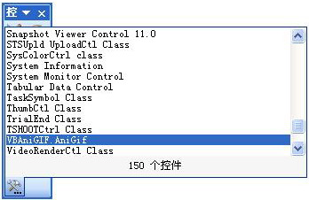

<u>图 126-1</u>	添加 AniGif 控件

:::

如果“其他控件”中没有该控件，那么需要对该控件进行注册。注册控件请参阅 118 。AniGif 控件的文件名为 VBAniGIF.OCX，也可以在工作表中单击菜单“视图”→“工具栏”→“控件工具箱”→“其他控件”，选择“注册自定义控件”，在显示的对话框中选择 VBAniGIF.OCX 文件进行注册，如图 126-2 所示。

::: center

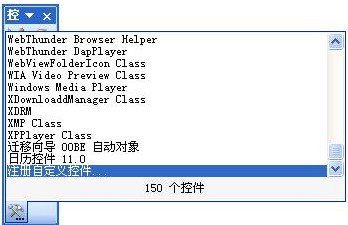

<u>图 126-2</u>	注册 AniGif 控件

:::

- 步骤 2，在设计模式下右键单击 AniGif 控件，选择“属性”，设置 AniGif 控件的 Filename 属性为 CIF 图片所在的路径，如图 126-3 所示。

::: center

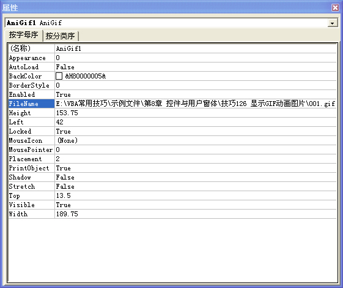

<u>图 126-3</u>	设置 Filename 属性

:::

可以使用代码设置 AniGif 控件的 Filename 属性，如下面的代码所示。

```vb
Private Sub Workbook_Open()
	Sheet1.AniGif1.Filename = ThisWorkbook.Path & "\001.gif"
End Sub
```

代码解析：

工作簿打开时将 AniGif 控件的 Filename 属性设置为同一目录中的“001.gif”文件。

工作簿打开时可能出现如图 126-4 所示的对话框，这是因为当打开包含 ActiveX 控件的文件时，如果该控件被标识为初始化不安全时，Office 程序不加载或激活未被标志为初始化安全的 ActiveX 控件。

::: center

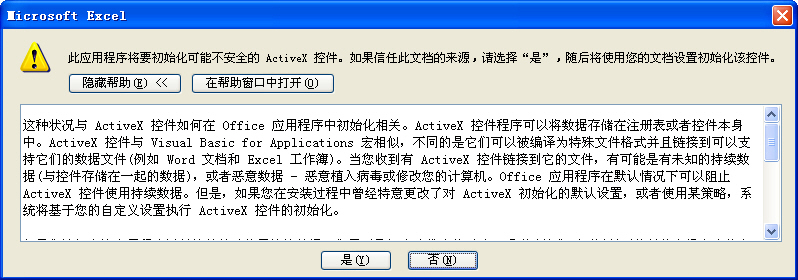

<u>图 126-4</u>	初始化不安全 ActiveX 控件提示

:::

解决此问题的方法是更改 Office 程序处理 ActiveX 组件的方式，需要对注册表进行修改。也可以使用以下代码修改注册表：

```vb
Sub RegWriteProc()
	Dim WshShell
	Set WshShell = CreateObject("Wscript.Shell")
	WshShell.RegWrite "HKCU\Software\Microsoft\Office\Common\Security\UFIControls", 1, "REG_DWORD"
	WshShell.RegWrite "HKCU\Software\Microsoft\VBA\Security\LoadControlsInForms", 1, "REG_DWORD"
	Set WshShell = Nothing
End Sub
```

代码解析：

RegWriteProc 过程修改注册表设置。第 4 行代码将 UFIControls 子项设置为 1（最不安全）。第 5 行代码将 LoadControlsInForms 子项设置为 1（最不安全）。关于为 ActiveX 控件授予权限请参阅微软的技术文章：http://support.microsoft.com/kb/827742/zh-cn

退出设计模式后，将在工作表中显示 GIF 动画图片，如图 126-5 所示。

::: center

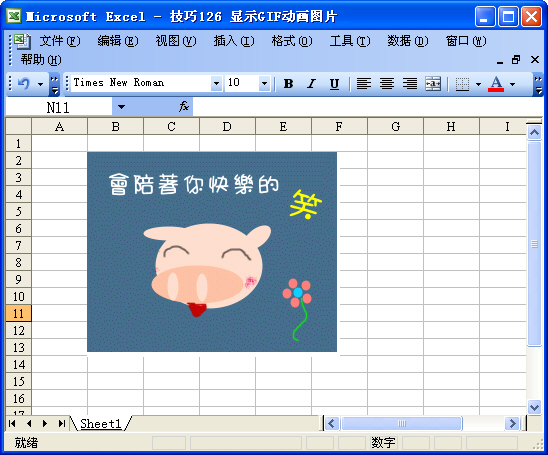

<u>图 126-5</u>	显示 GIF 动画图片

:::

## 127、播放 Flash 文件

如果需要在工作表中播放 Flash 文件，那么可以使用 ShockwaveFlash 控件。

- 步骤 1，在工作表中单击菜单“视图”→“工具栏”→“控件工具箱”→“其他控件”，选择“ShocKwave Flash Object”后在工作表中拖动添加 ShockwaveFlash 控件，如图 127-1 所示。

::: center

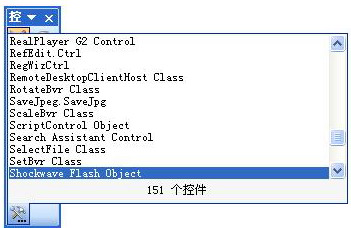

<u>图 127-1</u>	添加 ShockwaveFlash 控件

:::

如果“其他控件”中没有该控件，请参阅 126 对其进行注册，ShockwaveFlash 控件的文件名为 Flash9d.OCX。

- 步骤 2，在设计模式下右键单击 ShockwaveFlash 控件，选择“属性”，设置 ShockwaveFlash 控件的 Base 属性和 Movie 属性为 Flash 文件所在的路径，设置 Embedmovie 属性为 True，使 Flash 文件嵌入到 Excel 中，如图 127-2 所示。

::: center

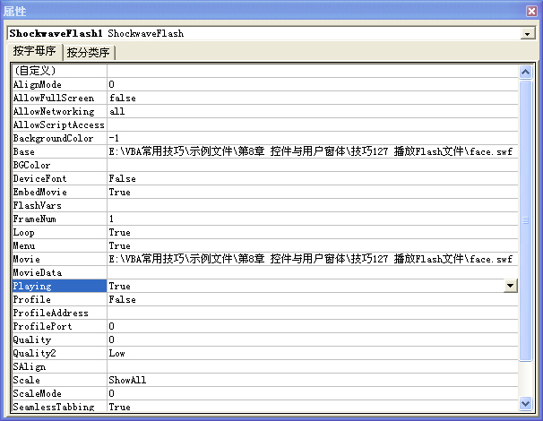

<u>图 127-2</u>	设置 ShockwaveFlash 控件属性

:::

可以使用代码设置 ShockwaveFlash 控件的各项属性，如下面的代码所示。

```vb
Private Sub Workbook_Open()
	With Sheet1.ShockwaveFlash1
		.Base = ThisWorkbook.Path & "\face.swf"
		.Movie = ThisWorkbook.Path & "\face.swf"
		.EmbedMovie = True
	End With
End Sub
```

代码解析：

工作簿打开时将 ShockwaveFlash 控件的 Base 属性和 Movie 属性设置为同一目录中的“face.swf”文件，设置 Embedmovie 属性为 True。

退出设计模式后，将在工作表中显示 Flash 动画，如图 127-3 所示。

::: center

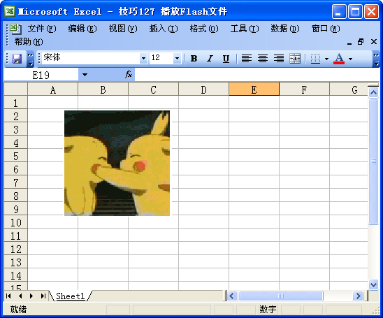

<u>图 127-3</u>	显示 Flash 动画

:::

## 128、在工作表中添加窗体控件

在工作表中添加窗体控件，除了使用手工添加外，还可以使用代码添加，方法如下：

### 1）使用 AddFormControl 方法

使用 AddFormControl 方法在工作表中添加窗体控件，如下面的代码所示。

```vb
Sub AddFormControls()
	Dim myShape As Shape
	On Error Resume Next
	Sheet1.Shapes("myButton").Delete
	Set myShape = Sheet1.Shapes.AddFormControl(0, 108, 72, 108, 27)
	With myShape
		.Name = "myButton"
		With .TextFrame.Characters
			.Font.ColorIndex = 3
			.Font.Size = 12
			.Text = "新建的按钮"
		End With
		.OnAction = "myButton"
	End With
End Sub
Sub myButton()
	MsgBox "这是使用AddFormControl方法新建的按钮!"
End Sub
```

代码解析：

AddFormControls 过程使用 AddFormControl 方法在工作表中添加窗体控件。

第 3、4 行代码为了避免在工作表中重复添加按钮控件，先删除工作表中的“myButton”按钮。

第 5 行代码，使用 AddFormControl 方法在工作表中添加命令按钮控件并设置控件的坐标和大小。应用于 Shapes 对象的 AddFormContl 方法创建一个 Microsoft Excel 控件，返回一个 Shape 对象，该对象代表新建的控件，语法如下：

```vb
expression.AddFormControl(Type, Left, Top, Width, Height)

参数expression是必需的，一个有效的对象。
参数Type是必需的，Microsoft Excel控件类型，可以为表格 128-1所列XlFormControl 常量之一。
参数Left是必需的，新对象的初始坐标（以[磅](##)为单位）相对于工作表 A1 单元格的左上角或图表的左上角。
参数Top是必需的，新对象的初始坐标（以[磅](##)为单位）相对于工作表 A1 单元格的左上角或图表的左上角。
参数Width是必需的，以磅为单位的新对象的初始大小。
参数Height是必需的，以磅为单位的新对象的初始大小。
```

<u>表格 128-1</u>	XlFormControl 常量

| 常量            | 值   | 说明     |
| --------------- | ---- | -------- |
| xlButtonControl | 0    | 命令按钮 |
| xlCheckBox      | 1    | 复选框   |
| xlDropDown      | 2    | 组合框   |
| xlEditBox       | 3    | 编辑框   |
| xlGroupBox      | 4    | 分组框   |
| xlLabel         | 5    | 标签     |
| xlListBox       | 6    | 列表框   |
| xlOptionButton  | 7    | 选项按钮 |
| xlScrollBar     | 8    | 滚动条   |
| xlSpinner       | 9    | 微调项   |

第 7 行代码将新添加的按钮名称设置为“myButton”。

第 8 行到第 12 行代码设置新添加的按钮文字设置为“新建的按钮”，并设置文字的大小和颜色。

第 13 行代码，指定新添加按钮所执行的宏名称。

myButton 过程是单击新添加按钮所执行的过程，显示一个消息框。

运行 AddFormControls 过程将在工作表中添加一个命令按钮，单击按钮显示一个消息框，如图 128-1 所示。

::: center

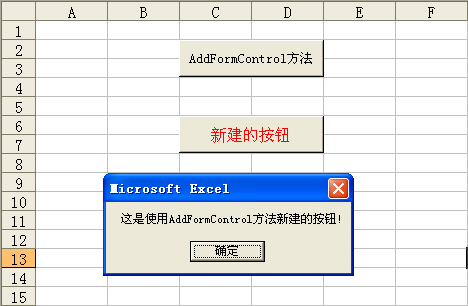

<u>图 128-1</u>	使用 AddFormControl 方法添加窗体控件

:::

### 2）使用 Add 方法

在工作表中添加窗体控件还可以使用 Add 方法，如下面的代码所示。

```vb
Sub AddChartObjects()
	Dim myButton As Button
	On Error Resume Next
	Sheet1.Shapes("myButton").Delete
	Set myButton = Sheet1.Buttons.Add(108, 72, 108, 27)
	With myButton
		.Name = "myButton"
		.Font.Size = 12
		.Font.ColorIndex = 5
		.Characters.Text = "新建的按钮"
		.OnAction = "myButton"
	End With
End Sub
Sub myButton()
	MsgBox "这是使用Add方法新建的按钮!"
End Sub
```

代码解析：

AddChartObjects 过程使用 Add 方法在工作表中添加窗体控件。

第 3、4 行代码为了避免在工作表中重复添加按钮控件，先删除工作表中的“myButton”按钮。

第 5 行代码，使用 Add 方法在工作表中添加命令按钮控件，Add 方法适用于 ChartObjects 对象的语法如下：

```vb
expression.Add(Left, Top, Width, Height)

参数expression是必需的，该表达式返回一个ChartObjects对象。
如果需要在工作表中添加其他窗体控件，可以将参数expression设置为表格 128-2所示的ChartObjects对象之一。
参数Left和Top是必需的，以磅为单位给出新对象的初始坐标，该坐标是相对于工作表上单元格 A1 的左上角或图表的左上角的坐标。
参数Width和参数Height是必需的，以磅为单位给出新对象的初始大小。
```

<u>表格 128-2</u>	ChartObjects 对象

| 类型     | ChartObjects对象 |
| -------- | ---------------- |
| 复选框   | CheckBoxes       |
| 组合框   | DropDowns        |
| 标签     | Labels           |
| 列表框   | ListBoxes        |
| 选项按钮 | OptionButtons    |
| 滚动条   | ScrollBars       |
| 微调项   | Spinners         |

第 7 行代码将新添加的按钮的名称设置为“myButton”。

第 8 行到第 10 代码新添加的按钮的文字设置为“新建的按钮”并设置文字的大小和颜色。

第 11 行代码，指定新添加命令按钮所执行的宏名称。

myButton 过程是单击新添加按钮所执行的过程，显示一个消息框。

运行 AddChartObjects 过程将在工作表中添加一个命令按钮，单击按钮显示一个消息框，如图 128-2 所示。

::: center

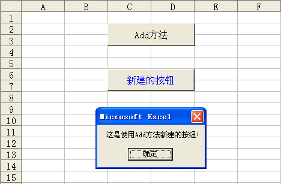

<u>图 128-2</u>	使用 Add 方法添加窗体控件

:::

## 129、在工作表中添加 ActiveX 控件

在 128 中使用代码在工作表中添加的是窗体控件，而本例中使用代码在工作表中添加的是 ActiveX 控件，两者是有区别的，在工作表中前者是使用窗体对话框添加，而后者是使用控件工具箱添加，如图 129-1 所示。 

::: center

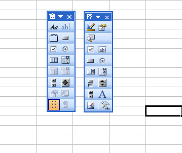

<u>图 129-1</u>	窗体控件和 ActiveX 控件的区别

:::

### 1）使用 Add 方法

使用 Add 方法在工作表中添加 ActiveX 控件，如下面的代码所示。

```vb
Sub AddObj()
	Dim Obj As New OLEObject
	On Error Resume Next
	Sheet1.OLEObjects("MyButton").Delete
	Set Obj = Sheet1.OLEObjects.Add(ClassType:="Forms.CommandButton.1", _
			Left:=108, Top:=72, Width:=108, Height:=27)
	With Obj
		.Name = "MyButton"
		.Object.Caption = "新建的按钮"
		.Object.Font.Size = 16
		.Object.ForeColor = &HFF&
	End With
	With ActiveWorkbook.VBProject.VBComponents(Sheet1.CodeName).CodeModule
		If .Lines(1, 1) <> "Option Explicit" Then
			.InsertLines 1, "Option Explicit"
		End If
		If .Lines(2, 1) = "Private Sub MyButton_Click()" Then Exit Sub
		.InsertLines 2, "Private Sub MyButton_Click()"
		.InsertLines 3, vbTab & "MsgBox ""这是使用Add方法新建的按钮!"""
		.InsertLines 4, "End Sub"
	End With
End Sub
```

代码解析：

AddOLEObject 过程使用 Add 方法在向工作表中添加 ActiveX 控件中的命令按钮和相应的代码。

第 3、4 行代码为了避免在工作表中重复添加按钮控件，先删除工作表中的名称为“myButton”的按钮。

第 5、6 行代码，使用 Add 方法在向工作表中添加 ActiveX 控件中的命令按钮，Add 方法应用于 OLEObjects 对象的语法如下：

```VB
expression.Add(ClassType, FileName, Link, DisplayAsIcon, IconFileName, IconIndex, IconLabel, Left, Top, Width, Height)

其中参数expression是必需的，返回一个 OLEObjects 对象。
参数ClassType是可选的，创建的对象的程序标识符。如果指定了 ClassType参数，则忽略FileName参数和Link参数。
在本例中指定添加控件的程序标识符为“Forms.CommandButton.1”，即命令按钮控件，关于对象的程序标识符请参阅技巧119-3。
参数Left和参数Top是必需的，以磅为单位给出新对象的初始坐标，该坐标是相对于工作表上单元格 A1 的左上角或图表的左上角的坐标。
参数Width和参数Height是可选的，以磅为单位给出OLE对象的初始大小。
```

第 8 行代码，设置命令按钮的名称为“MyButton”。

第 9 行代码，设置命令按钮的文字为“新建的按钮”

第 10 行代码，设置命令按钮的文字的大小。

第 11 行代码，设置命令按钮的文字的颜色。

第 13 行到第 21 行代码，在工作表中写入新添加的命令按钮的单击事件代码。

ActiveX 控件不能像窗体控件用 OnAction 属性来指定宏，需要使用 CodeModule 对象的 InsertLines 方法在工作表中插入代码。

应用于 CodeModule 对象的 InsertLines 方法的语法如下：

```VB
object.InsertLines(line, code)

参数object是必需的，一个有效的对象。
参数line是必需的，用来指定要插入代码的位置。
参数code是必需的，要插入的代码。
```

第 14 行到第 16 行代码判断首行内容是否为要求变量声明，如不是则添加要求变量声明语句。

第 17 行到第 20 行代码判断是否已存在相同名称的过程，如不存在则使用 InsertLines 方法在工作表中插入代码。

运行 AddOLEObject 过程，将在工作表中添加一个命令按钮和相应的代码，单击按钮显示一个消息框，如图 129-2 所示。

::: center

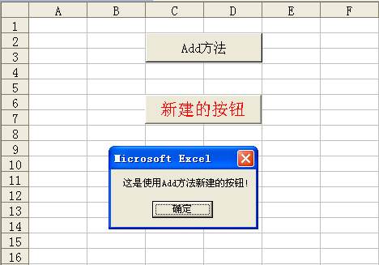

<u>图 129-2</u>	使用 Add 方法添加 ActiveX 控件

:::

### 2）使用 AddOLEObject 方法

在工作表中添加 ActiveX 控件，还可以使用 AddOLEObject 方法，如下面的代码所示。

```VB
Sub AddShapes()
	Dim ShpBut As Shape
	On Error Resume Next
	Sheet1.OLEObjects("MyButton").Delete
	Set ShpBut = Sheet1.Shapes.AddOLEObject(ClassType:="Forms.CommandButton.1", _
			Left:=108, Top:=72, Width:=108, Height:=27)
			ShpBut.Name = "MyButton"
	With ActiveWorkbook.VBProject.VBComponents(Sheet1.CodeName).CodeModule
		If .Lines(1, 1) <> "Option Explicit" Then
			.InsertLines 1, "Option Explicit"
		End If
		If .Lines(2, 1) = "Private Sub MyButton_Click()" Then Exit Sub
		.InsertLines 2, "Private Sub MyButton_Click()"
		.InsertLines 3, vbTab & "MsgBox ""这是使用AddOLEObject方法新建的按钮!"""
		.InsertLines 4, "End Sub"
	End With
End Sub
```

代码解析：

AddShapes 过程使用 AddOLEObject 方法在向工作表中添加 ActiveX 控件中的命令按钮和相应的代码。

第 5、6 行代码，使用 AddOLEObject 方法在向工作表中添加 ActiveX 控件中的命令按钮，AddOLEObject 方法创建 OLE 对象，语法如下：

```vb
expression.AddOLEObject(ClassType, FileName, Link, DisplayAsIcon, IconFileName, IconIndex, IconLabel, Left, Top, Width, Height)

AddOLEObject方法参数与Add方法类似，请参阅技巧129-1。
```

运行 AddShapes 过程，将在工作表中添加一个命令按钮和相应的代码，单击按钮显示一个消息框，如图 129-3 所示。

::: center

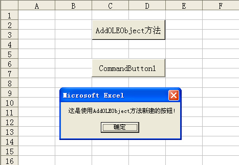

<u>图 129-3</u>	使用 AddOLEObject 方法添加 ActiveX 控件

:::

## 130、使用 spreadsheet 控件

如果希望在窗体中显示类似工作表的表格，并且可以像工作表一样进行操作，那么可以在窗体中使用表格控件（Spreadsheet 控件）。

- 步骤 1，在 VBE 窗口中单击菜单“插入”→“用户窗体”，在窗体上添加一个 Spreadsheet 控件，双击窗体，在其代码窗口中输入下面的代码：

```vb
Private Sub UserForm_Initialize()
	Dim iRow As Integer
	Dim arr As Variant
	With Me.Spreadsheet1
		.DisplayToolbar = False
		.DisplayHorizontalScrollBar = False
		.DisplayVerticalScrollBar = False
		.DisplayWorkbookTabs = False
		iRow = Sheet1.Range("B65536").End(xlUp).Row
		arr = Sheet1.Range("B2:H" & iRow)
		With .Range("B2:H" & iRow)
			.Value = arr
			.Borders.LineStyle = xlContinuous
			.Borders.Weight = xlMedium
			.Borders.ColorIndex = 10
		End With
		With .Range("B2:H2")
			.HorizontalAlignment = -4108
			.VerticalAlignment = -4108
			.Interior.ColorIndex = 44
		End With
		.Range("B3:B" & iRow).HorizontalAlignment = -4108
		.Range("C3:H" & iRow).NumberFormat = "0.00"
		.Rows(2).RowHeight = 23.25
		.Columns("A").ColumnWidth = 2.75
		.Columns("B:H").ColumnWidth = 8
	End With
End Sub
```

代码解析：

用户窗体的初始化事件过程，使用窗体显示工作表中的表格。

第 5 行代码，设置 Spreadsheet 控件不显示工具栏。

DisplayToolbar 属性设置工具栏是否隐藏，语法如下：

```vb
expression.DisplayToolbar

参数expression是必需的，一个有效的对象。
如果指定电子表格、图表区或“数据透视表”列表显示了工具栏，则返回True。
```

第 6、7 行代码，设置 Spreadsheet 控件不显示水平和垂直滚动条。

第 8 行代码，设置 Spreadsheet 控件不显示工作表标签。

第 9 行代码，取得工作表 B 列有数据的最后一行的行号。

第 10 行代码，把工作表数据赋值给数组。

第 11 行到 16 行代码，把数组赋给 Spreadsheet 控件的单元格，使 Spreadsheet 控件显示工作表内容，并且添加加框线。

第 17 行到第 21 行代码，设置 Spreadsheet 控件中表格第一行的字体对齐方式为居中并添加单元格的底纹颜色。

第 22 行代码，设置 Spreadsheet 控件中表格第一列的字体对齐方式为居中。

第 23 行代码，设置 Spreadsheet 控件中表格数据的格式。

第 24 行到 26 行代码，设置 Spreadsheet 控件的行高与列宽。

- 步骤 2，在窗体上添加一个按钮控件，将其 Caption 属性设置为“保存”，双击按钮控件，在其代码窗口中输入下面的代码：

```vb
Private Sub CommandButton1_Click()
	Dim iRow As Integer
	Dim arr As Variant
	If MsgBox("是否保存对表格所作的修改?", 4 + 32) = 6 Then
		With Me.Spreadsheet1
			iRow = .Range("B65536").End(xlUp).Row
			arr = .Range("B2:H" & iRow).Value
			Sheet1.Range("B2:H" & iRow).Value = arr
		End With
	End If
	Unload Me
End Sub
```

代码解析：

用户窗体中“保存”按钮的单击过程，把在窗体中对数据的修改重新保存到工作表。

第 4 行代码，询问用户是否保存修改。

第 5 行到第 10 行代码，如果用户选择保存，把 Spreadsheet 控件中的数据保存到工作表。

运行窗体，显示效果如图 130-1 所示。

::: center

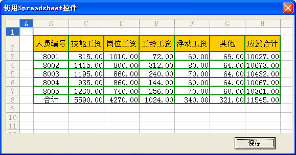

<u>图 130-1</u>	使用 Spreadsheet 控件

:::

## 131、使用 Listview 控件

ListView 控件是 VBA 程序开发中的常用控件，可以用来显示各项带图标的列表，也可以用来显示带有子项的列表。

### 1）使用 Listview 控件显示数据列表

使用 Listview 控件在用户窗体中显示数据列表，代码如下：

```vb
Private Sub UserForm_Initialize()
	Dim Itm As ListItem
	Dim r As Integer
	Dim c As Integer
	With ListView1
		.ColumnHeaders.Add , , "人员编号 ", 50, 0
		.ColumnHeaders.Add , , "技能工资 ", 50, 1
		.ColumnHeaders.Add , , "岗位工资 ", 50, 1
		.ColumnHeaders.Add , , "工龄工资 ", 50, 1
		.ColumnHeaders.Add , , "浮动工资 ", 50, 1
		.ColumnHeaders.Add , , "其他", 50, 1
		.ColumnHeaders.Add , , "应发合计", 50, 1
		.View = lvwReport
		.Gridlines = True
		For r = 2 To Sheet1.[A65536].End(xlUp).Row
			Set Itm = .ListItems.Add()
			Itm.Text = Space(2) & Sheet1.Cells(r, 1)
			For c = 1 To 6
				Itm.SubItems(c) = Format(Sheet1.Cells(r, c + 1), ",,0.00")
			Next
		Next
		End With
	Set Itm = Nothing
End Sub
```

代码解析：

窗体的初始化事件，在窗体显示时将工作表中数据显示在 Listview 控件中。

第 6 行到第 12 行代码，使用 ColumnHeader 对象的 Add 方法在 Listview 控件中添加标题列，并设置列标题、列宽和文本对齐方式。

ColumnHeader 对象是 ListView 控件中包含标题文字的项目，应用于 ColumnHeader 对象的 Add 方法语法如下：

```vb
object.ColumnHeader.Add(index,key,text,width,alignment)

其中参数text代表标题文字，参数width代表标题的列宽，参数alignment代表列标题中文本对齐方式。Listview控件中文本的对齐方法有三种，如表格 131-1所示。
```

<u>表格 131-1</u>	Listview 控件中文本的对齐方法

| 常数            | 值   | 说明                     |
| --------------- | ---- | ------------------------ |
| lvwColumnLeft   | 0    | 文本向左对齐。（缺省值） |
| lvwColumnRight  | 1    | 文本向右对齐。           |
| lvwColumnCenter | 2    | 文本居中对齐。           |

在 Listview 控件中第一列的文本对齐方式只能设置为左对齐。

第 13 行代码，设置 Listview 控件的 View 属性为 lvwReport，使 Listview 控件显示为报表型。View 属性决定在列表中控件使用何种视图显示项目，语法如下：

```vb
object.view [= value]

参数object是必需的，对象表达式，listview控件。
参数value是必需的，指定控件外观的整数或常数，如表格 131-2所示。
```

<u>表格 131-2</u>	View 属性的设置值

| 常数         | 值   | 说明   |
| ------------ | ---- | ------ |
| lvwicon      | 0    | 图标   |
| lvwsmallicon | 1    | 小图标 |
| lvwlist      | 2    | 列表   |
| lvwreport    | 3    | 报表   |

第 14 行代码，设置 Listview 控件的 Gridlines 属性为 True，显示网格线。只有在将 View 属性设置为 lvwReport 时才能显示网格线，否则 Gridlines 属性无效。

第 16 行代码，使用 ListItem 对象的 Add 方法在 Listview 控件中添加项目。应用于ListItem对象的 Add 方法语法如下：

```vb
ListItems.Add(index,key,text,icon,smallIcon)

其中参数text代表添加的项目内容。
```

第 17 行代码，添加行标题。ListItem 对象的 text 属性代表 Listview 控件的第一列内容，因为 Listview 控件的第一列的文本对齐方式只能设置为左对齐，所以在添加时使用 Space 函数插入两个空格，使行标题达到居中显示的效果。

第 18 行到 20 行代码，继续添加其他列的内容。Listview 控件其他列的项目需要使用 SubItems 属性来添加。

运行窗体，Listview 控件显示工作表中的内容，如图 131-1 所示。

::: center

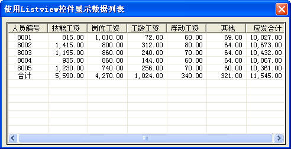

<u>图 131-1</u>	使用 Listview 控件显示数据

:::

### 2）在 Listview 控件中使用复选框

在 Listview 控件中使用复选框，可以进行多重选择，示例代码如下：

```vb
Private Sub UserForm_Initialize()
	Dim Itm As ListItem
	Dim r As Integer
	Dim c As Integer
	With ListView1
		.ColumnHeaders.Add , , "人员编号 ", 50, 0
		.ColumnHeaders.Add , , "技能工资 ", 50, 1
		.ColumnHeaders.Add , , "岗位工资 ", 50, 1
		.ColumnHeaders.Add , , "工龄工资 ", 50, 1
		.ColumnHeaders.Add , , "浮动工资 ", 50, 1
		.ColumnHeaders.Add , , "其他", 50, 1
		.ColumnHeaders.Add , , "应发合计", 50, 1
		.View = lvwReport
		.Gridlines = True
		.FullRowSelect = True
		.CheckBoxes = True
		For r = 2 To Sheet2.[A65536].End(xlUp).Row - 1
			Set Itm = .ListItems.Add()
			Itm.Text = Sheet2.Cells(r, 1)
			For c = 1 To 6
				Itm.SubItems(c) = Format(Sheet2.Cells(r, c + 1), ",,0.00")
			Next
		Next
		End With
	Set Itm = Nothing
End Sub
Private Sub CommandButton1_Click()
	Dim r As Integer
	Dim i As Integer
	Dim c As Integer
	r = Sheet1.[A65536].End(xlUp).Row
	If r > 1 Then Sheet1.Range("A2:G" & r) = ""
	With ListView1
		For i = 1 To .ListItems.Count
			If .ListItems(i).Checked = True Then
				Sheet1.Range("A65536").End(xlUp).Offset(1, 0) = .ListItems(i)
				For c = 1 To 6
					Sheet1.Cells(65536, c + 1).End(xlUp).Offset(1, 0) = .ListItems(i).SubItems(c)
				Next
			End If
		Next
	End With
End Sub
```

代码解析：

第 1 行到第 26 行代码，用户窗体的 Initialize 事件过程，在窗体显示时将工作表中数据显示在 Listview 控件中。

其中第 15 行代码设置 Listview 控件的 FullRowSelect 属性为 True，使用户可以选择整行。

第 16 行代码设置 Listview 控件的 CheckBoxes 属性为 True，使 Listview 控件在列表的每个项的旁边显示复选框。

第 27 行到第 43 行代码，用户窗体中“保存”按钮的单击过程，将 Listview 控件中选中的项目写入到工作表中。

第 31、32 行代码，删除工作表中原有的数据，

第 34、35 行代码遍历 Listview 控件中所有的 ListItem 对象，判定其 Checked 值，如果为 True，即说明其处于选中状态。

第 36 行到第 40 行代码将 Listview 控件中选中的内容依次写入到工作表中。

运行窗体，Listview 控件显示工作表中的内容，单击“保存”按钮将如 Listview 控件中选中的内容依次写入到工作表中，如图 131-2 所示。

::: center

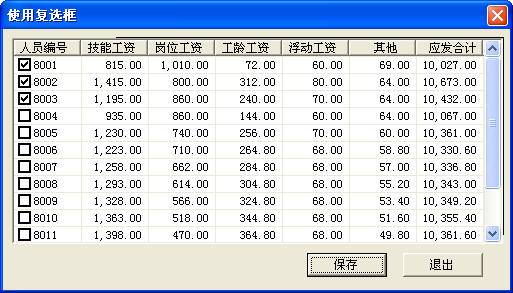

<u>图 131-2</u>	Listview 控件使用复选框

:::

### 3）调整 Listview 控件的行距

在使用 Listview 控件显示数据列表时，行距是由 Listview 控件所设置的字体大小决定的，无法自定义行距，即使调整了字体大小，行距还是很近。

如果需要自定义 Listview 控件的行距，可以在窗体中添加一个 ImageList 控件，在 ImageList 控件中导入一张大小合适的空白图片，然后指定 Listview 控件的 SmallIcons 属性为 ImageList 控件中的图片，代码如下：

```vb
Private Sub UserForm_Initialize()
	Dim Itm As ListItem
	Dim r As Integer
	Dim c As Integer
	Dim Img As ListImage
	With ListView1
		.ColumnHeaders.Add , , "人员编号 ", 50, 0
		.ColumnHeaders.Add , , "技能工资 ", 50, 1
		.ColumnHeaders.Add , , "岗位工资 ", 50, 1
		.ColumnHeaders.Add , , "工龄工资 ", 50, 1
		.ColumnHeaders.Add , , "浮动工资 ", 50, 1
		.ColumnHeaders.Add , , "其他", 50, 1
		.ColumnHeaders.Add , , "应发合计", 50, 1
		.View = lvwReport
		.Gridlines = True
		.FullRowSelect = True
		Set Img = ImageList1.ListImages.Add(, , LoadPicture(ThisWorkbook.Path & "\" & "1×25.bmp"))
		.SmallIcons = ImageList1
		For r = 2 To Sheet1.[A65536].End(xlUp).Row - 1
			Set Itm = .ListItems.Add()
			Itm.Text = Space(2) & Sheet1.Cells(r, 1)
			For c = 1 To 6
				Itm.SubItems(c) = Format(Sheet1.Cells(r, c + 1), ",,0.00")
			Next
		Next
	End With
	Set Itm = Nothing
	Set Img = Nothing
End Sub
```

代码解析：

用户窗体的 Initialize 事件过程，在窗体显示时将工作表中数据显示在 Listview 控件中并调整 Listview 控件的行距。

第 17 行代码使用 Add 方法在 ImageList 控件中添加图片。ImageList 控件是一个向其他控件提供图像的资料中心，它包含了一组 ListImage 对象即一组图像的集合，该集合中的每个对象都可以通过其索引或关键字被其他控件所引用，但控件本身并不能单独使用。

在运行时给 ImageList 控件添加图片需要使用 Add 方法，语法如下：

```vb
Add(index,key,picture)

参数index是可选的，整数，指定要插入的ListImage对象的位置。如果没有指定index，ListImage对象将被添加到ListImages集合的末尾。
参数key是可选的，用来标识ListImage对象的唯一字符串。
参数picture是必需的，指定欲添加到集合中的图片。
```

也可以在设计时在 ImageList 控件中添加图片，这样就无需在文件夹中保留图片文件。在 VBE 中选择 ImageList 控件属性页中的“自定义”，在显示的“属性页”对话框中插入图片，如图 131-3 所示。

::: center

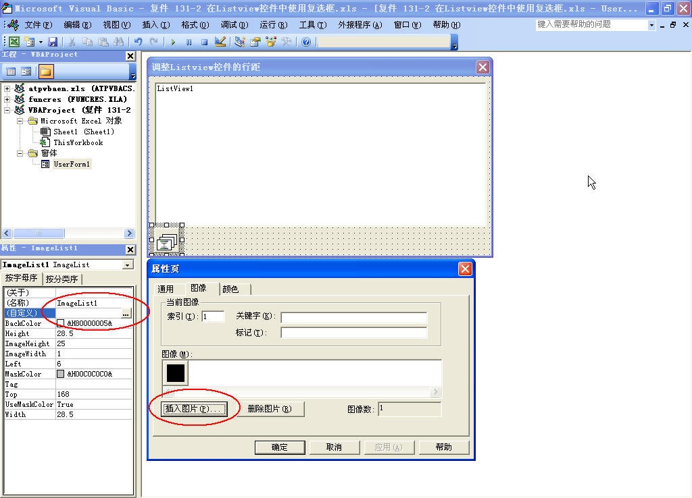

<u>图 131-3</u>	在 ImageList 控件中添加图片

:::

第 18 行代码，指定 Listview 控件的 SmallIcons 属性为 ImageList 控件中的图片，使用图片来调整行距。

运行窗体，Listview 控件显示工作表中的内容，调整 Listview 控件的行距，如图 131-4 所示。

::: center

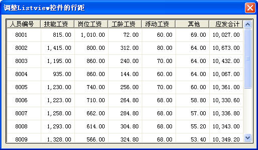

<u>图 131-4</u>	调整 Listview 控件的行距

:::

### 4）在 Listview 控件中排序

在使用 Listview 控件显示报表型的数据时，可能通过单击 Listview 控件的列标题对列表数据进行排序，代码如下：

```vb
Private Sub ListView1_ColumnClick(ByVal ColumnHeader As MSComctlLib.ColumnHeader)
	With ListView1
		.Sorted = True
		.SortOrder = (.SortOrder + 1) Mod 2
		.SortKey = ColumnHeader.Index - 1
	End With
End Sub
```

代码解析：

Listview 控件的 ColumnClick 事件过程，单击列标题时触发，对列表数据进行升序或降序排序。

第 3 行代码将 Listview 控件的 Sorted 属性设置为 True。Sorted 属性返回或设置确定 ListView 控件中的 ListItem 对象是否排序，设置为 False则不进行排序。

第 4 行代码设置 Listview 控件的排序方式。SortOrder 属性返回或设置一个值，决定 ListView 控件中的 ListItem 对象以升序或降序排序，设置为 0 以升序排序，设置为 1 则以降序排序。在设置 SortOrder 属性值时使用 Mod 运算符以达到第一次排序以降序排序，再次排序时以升序排序，交替进行的效果。

第 5 行代码设置 Listview 控件排序关键字的整数，即指定 Listview 控件以当前选定的列数据进排序。SortKey 属性返回或设置一个值，此值决定 ListView 控件中的 ListItem 对象如何排序，语法如下：

```vb
object.SortKey [=integer]

参数object是必需的，对象表达式，其值为ListView控件。
参数integer是必需的，指定排序关键字的整数，设置为0使用ListItem对象的Text属性排序，即第一列的数据进行排序。设置为大于0的整数则使用子项目的集合索引排序。
```

运行窗体，Listview 控件显示工作表中的内容，单击列标题对列表数据进行升序或降序排序，如图 131-5 所示。

::: center

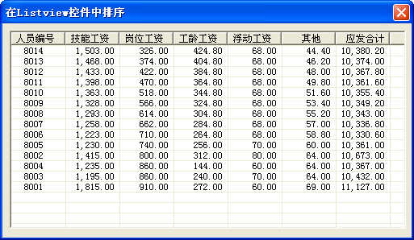

<u>图 131-5</u>	在 Listview 控件中排序

:::

### 5）Listview 控件的图标设置

ListView 控件作为一个可以显示图标或者子项的列表控件，可以在控件中显示自定义的图标，它最重要的属性就是 View 属性，该属性决定了以哪种视图模式显示控件的项，请参阅 131-1。

在 ListView 控件中显示图标，需要在用户窗体中添加一个 ImageList 控件用于保存图像文件。关于 ImageList 控件的使用请参阅 131-3。

以大图标模式显示 ListView 控件的代码如下：

```vb
Private Sub UserForm_Initialize()
	Dim ITM As ListItem
	Dim r As Integer
	With ListView1
		.View = lvwIcon
		.Icons = ImageList1
		For r = 2 To 6
			Set ITM = .ListItems.Add()
			ITM.Text = Cells(r, 1)
			ITM.Icon = r - 1
		Next
	End With
	Set ITM = Nothing
End Sub
```

代码解析：

在用户窗体中以大图标模式显示 ListView 控件，可使用鼠标拖放图标，并重新排列。

第 5 行代码将 ListView 控件的 View 属性设置为 lvwIcon，大图标视图模式。

第 6 行代码使用 ListView 控件的 Icons 属性建立与 ImageList 控件的关联。

第 7 行到第 11 行代码在 ListView 控件中添加 ListItem 对象，其中第 10 行代码设置使用 ListItem 对象的 Icon 属性指定其图像文件在 ImageList 控件中的编号。

ListView 控件以大图标视图模式显示时如图 131-6 所示。

::: center

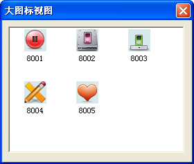

<u>图 131-6</u>	大图标视图模式

:::

以小图标模式显示 ListView 控件的代码如下：

```vb
Private Sub UserForm_Initialize()
	Dim ITM As ListItem
	Dim r As Integer
	With ListView1
		.View = lvwSmallIcon
		.SmallIcons = ImageList1
		For r = 2 To 6
			Set ITM = .ListItems.Add()
			ITM.Text = Sheet1.Cells(r, 1)
			ITM.SmallIcon = r - 1
		Next
	End With
	Set ITM = Nothing
End Sub
```

代码解析：

在用户窗体中以小图标模式显示 ListView 控件，可使用鼠标拖放图标，并重新排列。

第 5 行代码将 ListView 控件的 View 属性设置为 lvwSmallIcon，小图标视图模式。

与大图标视图模式有所不同的是，当使用小图标视图模式时需要使用 ListView 控件的 SmallIcons 属性建立与 ImageList 控件的关联，使用 ListItem 对象的 SmallIcon 属性指定其图像文件在 ImageList 控件中的编号。

ListView 控件以小图标视图模式显示时如图 131-7 所示。

::: center

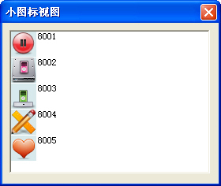

<u>图 131-7</u>	小图标视图模式

:::

将 ListView 控件的 View 属性设置为 lvwList，以列表视图模式显示，如图 131-8 所示。

::: center

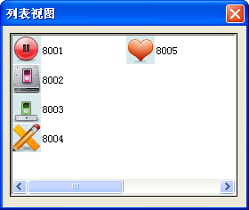

<u>图 131-8</u>	列表视图模式

:::


将 ListView 控件的 View 属性设置为 lvwReport，以报表视图模式显示，如图 131-9 所示。

::: center

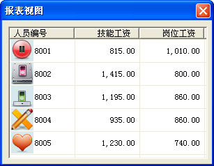

<u>图 131-9</u>	报表视图模式

:::

## 132、调用非模式窗体

在 VBA 中显示用户窗体需要使用 Show 方法，Show 方法显示窗体对象，语法如下：

```vb
[object.]Show modal

参数object是可选的，对象表达式。如果省略掉object，则将与活动的窗体模块相关联的窗体当作object。
参数modal是可选的，决定窗体是模态的还是非模式的。Modal参数的设置值如表格 132-1所示。
```

<u>表格 132-1</u>	modal 参数的设置值

| 常数       | 值   | 描述                       |
| ---------- | ---- | -------------------------- |
| vbModal    | 1    | UserForm是模态的，缺省值。 |
| vbModeless | 0    | UserForm是非模式的。       |

当窗体显示时是模态时，用户在使用应用程序的其它部分之前，必须先对其作出响应。在隐藏或卸载窗体之前，后续代码不会被执行。

比如下面的代码，希望在显示窗体的同时给单元格赋值，但因为窗体显示为模态的，在窗体没有关闭之前，给单元格赋值的代码是不会执行的，所以达不到显示窗体的同时给单元格赋值的目的。

```vb
Private Sub CommandButton1_Click()
	Dim i As Integer
	Columns(1).ClearContents
	UserForm1.Show 0
	For i = 1 To 1000
		Cells(i, 1) = i
	Next
End Sub
```

只有在窗体显示为非模式时，后续代码才一出现即被执行。模态下是无法操作工作表的，所以应将第 4 行代码改成如下的代码，才能在显示窗体的同时给单元格赋值，如图 132-1 所示。

```vb
UserForm1.Show 0
```

::: center

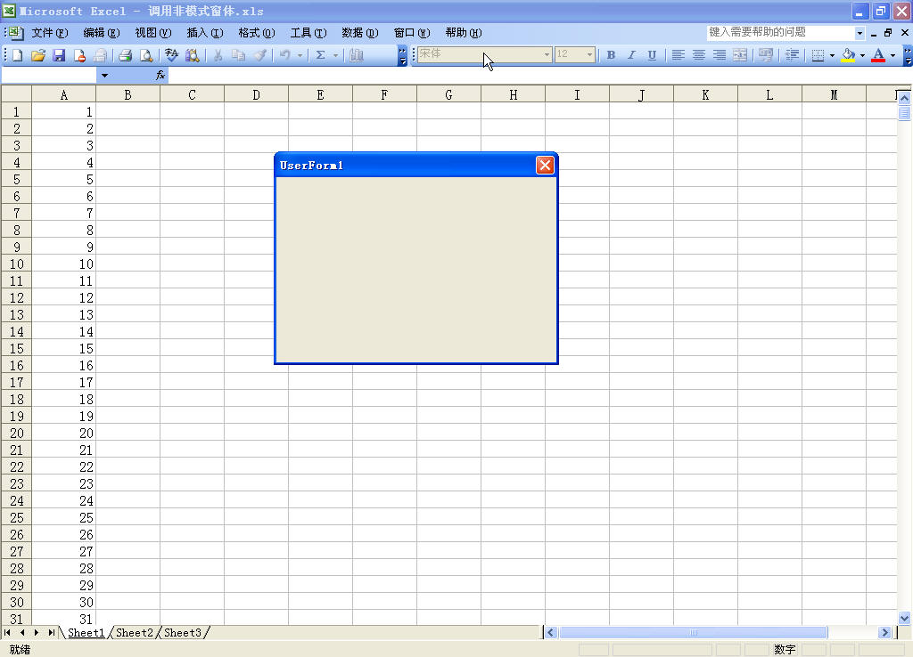

<u>图 132-1</u>	调用非模式窗体

:::

## 133、进度条的制作

如果程序执行时间较长，使用进度条能让用户知道程序执行到何种程度，大约需等待多长时间，可以使界面显得友好。

### 1）使用进度条控件

使用窗体加进度条控件（ProgressBar）制作进度条是最常用的方法。

在 VBE 窗口中单击菜单“插入”→“用户窗体”，在窗体上添加一个进度条控件，调整为合适的大小，如图 133-1 所示。

::: center

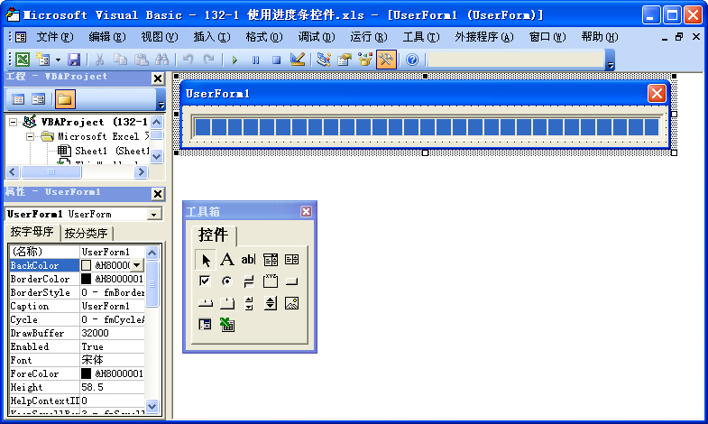

<u>图 133-1</u>	使用ProgressBar控件

:::

在工作表中添加一个命令按钮，双击后写入下面的代码。

```vb
Private Sub CommandButton1_Click()
	Dim i As Integer
	UserForm1.Show 0
	With UserForm1.ProgressBar1
		.Min = 1
		.Max = 10000
		.Scrolling = 0
		For i = 1 To 10000
			Cells(i, 1) = i
			.Value = i
			UserForm1.Caption = "正在运行,已完成" & i / 100 & "%,请稍候!"
		Next
	End With
	Unload UserForm1
	Columns(1).ClearContents
End Sub
```

代码解析：

工作表中命令按钮的单击事件，在给工作表 `A1:A10000` 单元格赋值的同时使用进度条显示其运行速度。

第 3 行代码，使用 Show 方法显示进度条控件所在的窗体，并且设置为无模式显示，请参阅 132 。

第 5、6 行代码，设置进度条控件的最小值和最大值，应与第 8 行代码中的循环计数器的 start 参数和 End 参数相一致。

第 7 行代码，设置进度条控件显示为有间隔的。如果将 Scrolling 属性设置为 1 则显示为无间隔的。

第 9 行代码，在单元格中进行无意义的填充数据以演示进度条。在实际应用中可以将进度条嵌入到程序的循环中。

第 11 行代码，在窗体的标题栏中显示已完成的百分比。

第 14 行代码，使用 Unload 语句卸载窗体。

Unload 语句从内存中删除一个对象，语法如下：

```vb
Unload object

参数object参数是必需的，一个有效的对象。
```

第 19 行代码，清空 A 列填充的数据。

单击工作表中的命令按钮，填充单元格并显示进度条，如图 133-2 所示。

::: center


<u>图 133-2</u>	ProgressBar 进度条

:::

### 2）使用标签控件

在窗体中使用标签可以制作双色的进度条。

- 步骤 1，在 VBE 窗口中单击菜单“插入”→“用户窗体”，在窗体上添加一个框架控件，在框架控件中添加两个标签控件。

- 步骤 2，在控件的属性窗口中将框架的 BackColor 属性设为 &H000000FF&，使框架的背景色为红色。将标签1 的 BackColor 属性设为 &H0000C000&，使标签1 的背景色为绿色。将标签2 的 BackStyle 属性设为 fmBackStyleTransparent，使标签2 的背景为透明，并把它们的 Caption 属性全部设置为空白。

- 步骤 3，将窗体和控件调整为合适的大小，如图 133-3 所示。

::: center

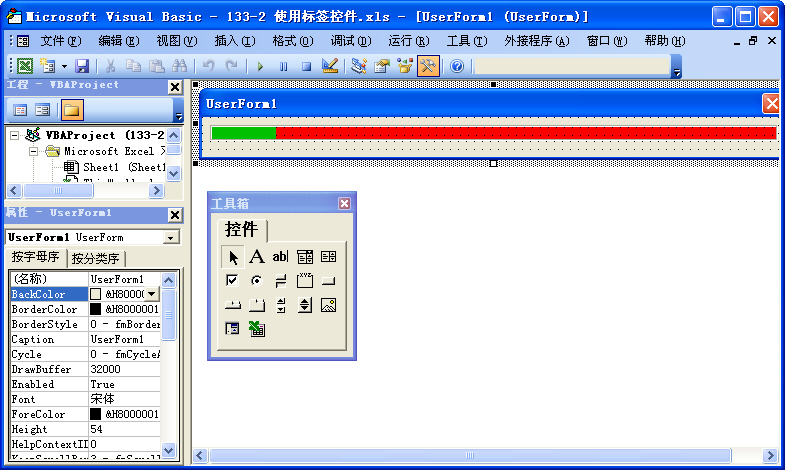

<u>图 133-3</u>	制作标签进度条

:::

- 步骤 4，在 VBE 中双击窗体，写入下面的代码。

```vb
Private Declare Function DrawMenuBar Lib "user32" (ByVal Hwnd As Long) As Long
Private Declare Function GetWindowLong Lib "user32" Alias "GetWindowLongA" (ByVal Hwnd As Long, ByVal nIndex As Long) As Long
Private Declare Function SetWindowLong Lib "user32" Alias "SetWindowLongA" (ByVal Hwnd As Long, ByVal nIndex As Long, ByVal dwNewLong As Long) As Long
Private Declare Function FindWindow Lib "user32" Alias "FindWindowA" (ByVal lpClassName As String, ByVal lpWindowName As String) As Long
Private Const GWL_STYLE As Long = (-16)
Private Const GWL_EXSTYLE = (-20)
Private Const WS_CAPTION As Long = &HC00000
Private Sub UserForm_Initialize()
	Dim IStyle As Long
	Dim Hwnd As Long
	If Val(Application.Version) < 9 Then
		Hwnd = FindWindow("ThunderXFrame", Me.Caption)
	Else
		Hwnd = FindWindow("ThunderDFrame", Me.Caption)
	End If
	IStyle = GetWindowLong(Hwnd, GWL_STYLE)
	IStyle = IStyle And Not WS_CAPTION
	SetWindowLong Hwnd, GWL_STYLE, IStyle
	DrawMenuBar Hwnd
	UserForm1.Height = 28
End Sub
```

代码解析：

窗体的初始化事件，在窗体加载时使用 API 函数去除其标题栏。

第 1 行到第 7 行代码，API 函数的声明。

第 11 行到第 15 行代码，获取窗口句柄。

第 16 行到第 19 行代码，去除窗体标题栏。

第 20 行代码，设置窗体的高度。

- 步骤 5，在工作表中添加一个命令按钮，双击后写入下面的代码。

```vb
Private Sub CommandButton1_Click()
	Dim n As Integer
	Dim i As Integer
	n = 10000
	With UserForm1
		.Show 0
		For i = 1 To n
			Cells(i, 1) = i
			.Label1.Width = i / n * .Frame1.Width
			.Label2.Caption = "已完成" & Round(i / n * 100, 0) & "%"
			.Label2.Left = .Label1.Width - 50
			DoEvents
		Next
	End With
	Unload UserForm1
	Range("A1:A" & n).ClearContents
End Sub
```

代码解析：

工作表中命令按钮的单击事件，在给工作表 `A1:A10000` 单元格赋值的同时使用进度条显示其运行速度。

第 4 行代码，设置循环最大值，可根据实际需要设置。

第 6 行代码，使用 Show 方法显示窗体，并且设置为无模式的。

第 8 行代码，在单元格中进行无意义的填充数据以演示进度条。

第 9 行代码，根据程序运行程度动态设置标签1的宽度，使之达到进度条的效果。

第 10 行代码，标签2 显示已完成百分比。

第 11 行代码，根据标签1 的宽度动态设置标签2 的 Left 属性，使已完成百分比跟随标签1 移动。

第 12 行代码，使用 DoEvents 函数转让控制权。DoEvents 函数将控制权传给操作系统。当操作系统处理完队列中的事件，并且在 SendKeys 队列中的所有键也都已送出之后，返回控制权。如果不使用 DoEvents 函数转让控制权，进度条不能正常显示。

第 15 行代码，使用 Unload 语句卸载窗体。

单击工作表中的命令按钮，填充单元格并显示进度条，如图 133-4 所示。

::: center


<u>图 133-4</u>	标签进度条

:::

