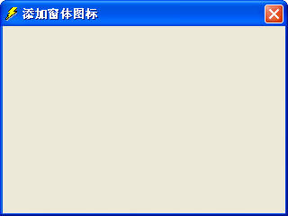

## 134、使用 TreeView 控件显示层次

TreeView 控件是一个树形结构的控件，该控件用于显示分层数据，如目录或文件目录，使程序的表现更为灵活，用户的操作更加方便，示例代码如下：

```vb
Private Sub UserForm_Initialize()
	Dim c As Integer
	Dim r As Integer
	Dim rng As Variant
	rng = Sheet1.UsedRange
	With Me.TreeView1
		.Style = tvwTreelinesPlusMinusPictureText
		.LineStyle = tvwRootLines
		.CheckBoxes = False
		With .Nodes
			.Clear
			.Add Key:="科目", Text:="科目名称"
			For c = 1 To Sheet1.UsedRange.Columns.Count
				For r = 2 To Sheet1.UsedRange.Rows.Count
					If Not IsEmpty(rng(r, c)) Then
						If c = 1 Then
							.Add relative:="科目", relationship:=tvwChild, Key:=rng(r, c), Text:=rng(r, c)
						ElseIf Not IsEmpty(rng(r, c - 1)) Then
							.Add relative:=rng(r, c - 1), relationship:=tvwChild, Key:=rng(r, c), Text:=rng(r, c)
						Else
							.Add relative:=CStr(Sheet1.Cells(r, c - 1).End(xlUp)), relationship:=tvwChild, Key:=rng(r, c), Text:=rng(r, c)
						End If
					End If
				Next
			Next
		End With
	End With
End Sub
```

代码解析：

在窗体初始化时将工作表中的科目名称填充 TreeView 控件。

第 7 行代码，设置 TreeView 控件每个列表的组成方式。Style 属性设置值如表格 131-2 所示。

<u>表格 134-1</u>	Style 属性设置值

| 常量                             | 值   | 描述     |
| -------------------------------- | ---- | -------- |
| tvwTextOnly                      | 0    | 文本     |
| tvwPictureText                   | 1    | 图像文本 |
| tvwPlusMinusText                 | 2    | 符号文本 |
| tvwTreelinesText                 | 4    | 直线文本 |
| tvwTreelinesPlusMinusPictureText | 7    | 正常显示 |

第 8 行代码，设置 TreeView 控件显示根节点连线。TreeView 控件的 LineStyle 属性设置为 tvwRootLines 显示根节点连线，设置为 tvwTreeLines 则隐藏根节点连线。

第 9 行代码，设置 TreeView 控件不显示复选框。

第 10 行代码使用 Nodes 属性返回对 TreeView 控件的 Node 对象的集合的引用。

第 11 行代码，清除 TreeView 控件所有的节点。

第 12 行代码，使用 Add 方法在 Treeview 控件的 Nodes 集合中添加一个 Node 对象。Add 方法语法如下：

```vb
object.Add(relative, relationship, key, text, image, selectedimage)

参数Object是必需的，一个有效的对象。
参数Relative是可选的，代表已存在的Node对象的索引号或键值。
参数relationship是可选的，代表新节点与已存在的节点间的关系，指定的Node对象的相对位置。relationship的设置值如表格 134-2所示。
参数key是可选的，唯一的字符串，可用于用Item方法检索Node。
参数text 是必需的，在Node中出现的字符串。
参数image是可选的，代表一个图像或在ImageList控件中图象的索引。
参数selectedimage是可选的，代表一个图像或在ImageList控件中图象的索引，在 Node被选中时显示。
```

<u>表格 134-2</u>	relationship 的设置值

| 常量        | 值   | 说明                                                         |
| ----------- | ---- | ------------------------------------------------------------ |
| tvwFirst    | 0    | 首节点，该Node和在relative中被命名的节点位于同一层，并位于所有同层节点之前。 |
| tvwLast     | 1    | 最后的节点，该Node和在relative中被命名的节点位于同一层，并位于所有同层节点之后。任何连续地添加的节点可能位于最后添加的节点之后。 |
| tvwNext     | 2    | 下一个节点，该Node位于在relative中被命名的节点之后。         |
| tvwPrevious | 3    | 前一个节点，该Node位于在relative中被命名的节点之前。         |
| tvwChild    | 4    | 子节点。该Node 为在relative中被命名的节点的子节点。          |

第 13 行到第 25 行代码代，在根节点下添加子节点。添加子节点仍然使用 Add 方法，需要一个唯一的 Key 值，必须提供根节点的 Key 值（参数 relative）和参数 relationship 值（tvwChild）。要将子节点链接到根节点的下面，参数 relative 必须与根节点的 Key 值一致，参数 relationship 必须设置为 tvwchild。要使子节点有效，子节点必须也有自已唯一的 Key 值。

获得双击 TreeView 控件后的返回值的代码如下：

```vb
Private Sub TreeView1_DblClick()
	If TreeView1.SelectedItem.Children = 0 Then
		Sheet1.Range("A65536").End(xlUp).Offset(1) = TreeView1.SelectedItem.Text
	Else
		MsgBox "所选择的不是末级科目,请重新选择科目!"
	End If
End Sub
```

代码解析：

TreeView1_ DblClick过程是 TreeView 控件的双击事件，将所选的科目名称写入到工作表中。

第 2 行代码判断所选节点是否是末级科目。TreeView 控件的 SelectedItem 属性返回当前所选择的节点，而 Children 属性检查所选节点是否还有子节点，如没有子节点则返回 0。

运行窗体效果如图 134-1 所示。

::: center


<u>图 134-1</u>	使用 TreeView 控件显示层次

:::

## 135、用户窗体添加图标

窗体在显示时标题栏上是没有图标的，如果希望在窗体上添加图标，可以借助 API 函数在窗体显示时添加自定义的图标。

在 VBE 窗口中单击菜单“插入”→“用户窗体”，插入一个窗体，在窗体中添加一个 Image 控件，设置 Image 控件 Picture 属性为自定义图标的位图，并将 Image 控件的 Visible 属性设置为 False，使窗体运行时隐藏 Image 控件，如图 135-1 所示。

::: center


<u>图 135-1</u>	窗体中添加 Image 控件

:::

在 VBE 中双击窗体，写入下面的代码。

```vb
Private Declare Function SendMessage Lib "user32" Alias "SendMessageA" (ByVal hWnd As Long, ByVal wMsg As Long, ByVal wParam As Long, lParam As Any) As Long
Private Declare Function DrawMenuBar Lib "user32" (ByVal hWnd As Long) As Long
Private Declare Function FindWindow Lib "user32" Alias "FindWindowA" (ByVal lpClassName As String, ByVal lpWindowName As String) As Long
Private Const WM_SETICON = &H80
Private Const ICON_SMALL = 0&
Private Const ICON_BIG = 1&
Sub ChangeIcon(ByVal hWnd As Long, Optional ByVal hicon As Long = 0&)
	SendMessage hWnd, WM_SETICON, ICON_SMALL, ByVal hicon
	SendMessage hWnd, WM_SETICON, ICON_BIG, ByVal hicon
	DrawMenuBar hWnd
End Sub
Private Sub UserForm_Initialize()
	Dim hWnd As Long
	hWnd = FindWindow(vbNullString, Me.Caption)
	Call ChangeIcon(hWnd, Image1.Picture.Handle)
End Sub
```

代码解析：

窗体的初始化事件，窗体在显示时运行 ChangeIcon 函数，在标题栏中添加图标。

第 1 行到第 6 行代码， API 函数声明。

第 7 行到第 11 行代码，ChangeIcon 过程，用于转换图标。

第 14 行代码，获得窗口句柄。

第 15 行代码，运行 ChangeIcon 过程，将 Image 控件中的位图显示在窗体的标题栏上。

运行窗体后，在窗体标题栏上添加图标，如图 135-2 所示。

::: center



<u>图 135-2</u>	在窗体标题栏中添加图标

:::

## 136、用户窗体添加最大最小化按纽

VBA 中的窗体标题栏上只有关闭按纽，没有最大最小化按纽的，可以使用 API 函数在窗体的标题栏上添加最大最小化按纽，如下面的代码所示。

```vb
Private Declare Function FindWindow Lib "user32" Alias "FindWindowA" (ByVal lpClassName As String, ByVal lpWindowName As String) As Long
Private Declare Function GetWindowLong Lib "user32" Alias "GetWindowLongA" (ByVal hWnd As Long, ByVal nIndex As Long) As Long
Private Declare Function SetWindowLong Lib "user32" Alias "SetWindowLongA" (ByVal hWnd As Long, ByVal nIndex As Long, ByVal dwNewLong As Long) As Long
Private Const WS_MAXIMIZEBOX = &H10000
Private Const WS_MINIMIZEBOX = &H20000
Private Const GWL_STYLE = (-16)
Private Sub UserForm_Initialize()
	Dim hWndForm As Long
	Dim iStyle As Long
	hWndForm = FindWindow("ThunderDFrame", Me.Caption)
	iStyle = GetWindowLong(hWndForm, GWL_STYLE)
	iStyle = iStyle Or WS_MINIMIZEBOX
	iStyle = iStyle Or WS_MAXIMIZEBOX
	SetWindowLong hWndForm, GWL_STYLE, iStyle
End Sub
```

代码解析：

窗体初始化时使用 API 函数在标题栏上添加最大最小化按纽。

第 1 行到第 6 行代码，API 函数声明。

第 10 行代码，获取窗口句柄。

第 11 行到第 14 行代码，在标题栏上添加最大最小化按纽。

运行窗体后效果如图 136-1 所示。

::: center


<u>图 136-1</u>	标题栏上添加最大最小化按纽

:::

## 137、禁用窗体标题栏的关闭按钮

如果不希望用户通过窗体标题栏的关闭命令来关闭窗体，可以禁用窗体标题栏上的关闭按钮，如下面的代码所示。

```vb
Private Sub UserForm_QueryClose(Cancel As Integer, CloseMode As Integer)
	If CloseMode <> 1 Then
		Cancel = True
		MsgBox "请点击按钮关闭窗体!"
	End If
End Sub
```

代码解析：

窗体的 QueryClose 事件，禁用窗体标题栏上的关闭按钮。

窗体的 QueryClose 事件发生在窗体关闭之前，语法如下：

```vb
Private Sub UserForm_QueryClose(cancel As Integer, closemode As Integer)

参数Cance是可选的，整数。将此[参数](JavaScript:hhobj_5.Click())设置成 0 以外的任意值，在所有加载的用户窗体中停止QueryClose事件，并防止关闭窗体与应用程序。
参数closemode是可选的，一个值或常数，用来指示引起QueryClose事件的原因。
closemode参数的设置值如表格 137-1所示。
```

<u>表格 137-1</u>	closemode 参数

| 常数              | 值   | 描述                                                         |
| ----------------- | ---- | ------------------------------------------------------------ |
| vbFormControlMenu | 0    | 用户在 UserForm上选择“控制”菜单中的“关闭”命令                |
| VbFormCode        | 1    | 由代码调用 Unload 语句                                       |
| vbAppWindows      | 2    | 正在结束当前 Windows 操作环境的过程。(仅用于Visual Basic 5.0 ) |
| vbAppTaskManager  | 3    | Windows 的“任务管理器”正在关闭这个应用。(仅用于Visual Basic 5.0 ) |

第 2、3 行代码，如果窗体不是由代码调用 Unload 语句关闭，则停止关闭过程，从而禁用窗体标题栏的关闭按钮。

需要注意的是，一定要在窗体上设置关闭窗体的途径，否则会使窗体无法关闭。

窗体运行后，禁用窗体上的关闭按钮关闭窗体，只能使用按钮关闭窗体，如图 137-1 所示。

::: center


<u>图 137-1</u>	禁用窗体标题栏的关闭命令

:::

## 138、屏蔽窗体标题栏的关闭按钮

使用 API 函数可以屏蔽窗体标题栏的关闭按钮，如下面的代码所示。

```vb
Private Declare Function FindWindow Lib "user32" Alias "FindWindowA" (ByVal lpClassName As String, ByVal lpWindowName As String) As Long
Private Declare Function GetWindowLong Lib "user32" Alias "GetWindowLongA" (ByVal Hwnd As Long, ByVal nIndex As Long) As Long
Private Declare Function SetWindowLong Lib "user32" Alias "SetWindowLongA" (ByVal Hwnd As Long, ByVal nIndex As Long, ByVal dwNewLong As Long) As Long
Private Declare Function DrawMenuBar Lib "user32" (ByVal Hwnd As Long) As Long
Private Const GWL_STYLE = (-16)
Private Const WS_SYSMENU = &H80000
Private Hwnd As Long
Private Sub UserForm_Initialize()
	Dim Istype As Long
	Hwnd = FindWindow("ThunderDFrame", Me.Caption)
	Istype = GetWindowLong(Hwnd, GWL_STYLE)
	Istype = Istype And Not WS_SYSMENU
	SetWindowLong Hwnd, GWL_STYLE, Istype
	DrawMenuBar Hwnd
End Sub
```

代码解析：

第 1 行到第 7 行代码是 API 函数声明。

第 8 行到第 15 行代码是窗体的 Initialize 事件，当窗体显示时屏蔽窗体标题栏的关闭按钮。

窗体运行后，屏蔽窗体上的关闭按钮，只能使用按钮关闭窗体，如图 138-1 所示。

::: center


<u>图 138-1</u>	屏蔽窗体标题栏的关闭按钮

:::

## 139、无标题栏和边框的窗体

如果希望制作无标题栏和边框的窗体，那么可以使用 API 函数。

在 VBE 窗口中单击菜单“插入”→“用户窗体”，双击窗体，在其代码窗口中输入下面的代码：

```vb
Private Declare Function DrawMenuBar Lib "user32" (ByVal Hwnd As Long) As Long
Private Declare Function GetWindowLong Lib "user32" Alias "GetWindowLongA" (ByVal Hwnd As Long, ByVal nIndex As Long) As Long
Private Declare Function SetWindowLong Lib "user32" Alias "SetWindowLongA" (ByVal Hwnd As Long, ByVal nIndex As Long, ByVal dwNewLong As Long) As Long
Private Declare Function FindWindow Lib "user32" Alias "FindWindowA" (ByVal lpClassName As String, ByVal lpWindowName As String) As Long
Private Const GWL_STYLE As Long = (-16)
Private Const GWL_EXSTYLE = (-20)
Private Const WS_CAPTION As Long = &HC00000
Private Const WS_EX_DLGMODALFRAME = &H1&
Private Sub UserForm_Initialize()
	Dim IStyle As Long
	Dim Hwnd As Long
	If Val(Application.Version) < 9 Then
		Hwnd = FindWindow("ThunderXFrame", Me.Caption)
	Else
		Hwnd = FindWindow("ThunderDFrame", Me.Caption)
	End If
	IStyle = GetWindowLong(Hwnd, GWL_STYLE)
	IStyle = IStyle And Not WS_CAPTION
	SetWindowLong Hwnd, GWL_STYLE, IStyle
	DrawMenuBar Hwnd
	IStyle = GetWindowLong(Hwnd, GWL_EXSTYLE) And Not WS_EX_DLGMODALFRAME
	SetWindowLong Hwnd, GWL_EXSTYLE, IStyle
End Sub
Private Sub UserForm_Click()
	Unload Me
End Sub
```

代码解析：

窗体初始化时使用 API 函数去除其标题栏和边框。

第 1 行到第 8 行代码，API 函数的声明。

第 12 行到第 16 行代码，获取窗口句柄。

第 17 行到第 20 行代码，去除窗体标题栏。

第 21、22 行代码，去除窗体边框。

第 24 行到第 26 行代码，窗体的单击事件，单击窗体后关闭该窗体。

窗体运行后如图 139-1 所示，单击后关闭该窗体。

::: center


<u>图 139-1</u>	无标题栏和边框的窗体

:::

## 140、制作年月选择窗体

在工作表中需要输入日期时，可以使用日期时间控件（Microsoft Date and Time Picker Control 6.0，简称 DTP 控件），请参阅 116 。但有时只需要输入年份和月份，使用 DTP 控件选择月份并不方便，此时可以使用文本框结合微调框做一个年月选择窗体供用户输入年份和月份。

- 步骤 1，在 VBE 窗口中单击菜单“插入”→“用户窗体”，将窗体的 Caption 属性设置为“请选择年月”。

- 步骤 2，在窗体上添加一个框架控件和两个命令按纽控件。在框架控件中添加两个文本框控件和两个 SpinButton 控件，并把命令按纽的 Caption 属性分别设置为“确定”和“取消”。

- 步骤 3，调整好控件位置，双击窗体写入下面的代码。

```vb
Private Sub UserForm_Initialize()
	SpinButton1.Value = Year(Date)
	SpinButton2.Value = Month(Date)
	TextBox1.Text = Year(Date) & "年"
	TextBox2.Text = Month(Date) & "月份"
End Sub
Private Sub SpinButton1_Change()
	TextBox1.Text = SpinButton1.Value & "年"
End Sub
Private Sub SpinButton2_Change()
	With SpinButton2
		Select Case .Value
			Case 1 To 12
				TextBox2.Text = .Value & "月份"
			Case Is > 12
				TextBox1.Text = Left(TextBox1.Text, 4) + 1 & "年"
				.Value = 1
			Case Is < 1
				TextBox1.Text = Left(TextBox1.Text, 4) - 1 & "年"
				.Value = 12
		End Select
	End With
End Sub
Private Sub CommandButton1_Click()
	Sheet1.Range("A65536").End(xlUp).Offset(1) = TextBox1.Text & TextBox2.Text
End Sub
Private Sub CommandButton2_Click()
	Unload Me
End Sub
```

代码解析：

第 1 行到第 6 行代码，窗体的初始化事件，在窗体加载时设置文本框和微调框的初始值。

第 2 行代码，设置微调框1 的初始值为当前年份。Year 函数返回年份的整数，语法如下：

```vb
Year(date)

参数date是必需的，可以是任何能够表示日期的Variant、数值表达式、字符串表达式或它们的组合。
```

第 3 行代码，设置微调框2 的初始值为当前月份。Mont 函数返回值为 1 到 12 之间的整数，表示一年中的某月，语法如下：

```vb
Month(date)

参数date与Year函数的参数date相同。
```

第 4 行代码，设置文本框1 显示的文本为当前年份。

第 5 行代码，设置文本框2 显示的文本为当前月份。

第 7 行到第 9 行代码，微调框1 的 Change 事件过程。当单击微调框1 数值调节钮的向上键或向下键调节年份时，文本框1 显示的年份等于调节后的年份。

第 10 行到第 23 行代码，微调框2 的 Change 事件过程。当单击微调框2 数值调节钮的向上键或向下键调节月份时，文本框2 显示的月份等于调节后的月份。如果是一年以内的调节，只调节文本框2 显示的月份，否则还需要调节文本框1 显示的年份。

第 25 行代码，“确定”按钮的单击过程，将选择好的年月写入工作表中。

第 28 行代码，使用 Unload 语句卸载窗体。

运行窗体后效果如图 140-1 所示。

::: center


<u>图 140-1</u>	年月选择窗体

:::

## 141、自定义窗体中的鼠标指针类型

使用对象的 MousePointer 属性可以自定义鼠标掠过窗体控件时的指针类型，如下面的代码所示。

```vb
Private Sub UserForm_Initialize()
	With Me.TextBox1
		.MousePointer = 99
		.MouseIcon = LoadPicture(ThisWorkbook.Path & "\myMouse.ico")
	End With
End Sub
```

代码解析：

当用户把鼠标放到窗体的文本框上时，所显示的鼠标指针的类型为自定义图标。

第3行代码设置文本框的 MousePointer 属性。MousePointer 属性指定当用户把鼠标放到特定对象上时，所显示鼠标指针的类型，语法如下：

```vb
object.MousePointer [= fmMousePointer]

参数object是必需的，一个有效对象。
参数fmMousePointer是可选的，所需鼠标指针的形状。fmMousePointer的设置值如表格 141-1所示。
```

<u>表格 141-1</u>	fmMousePointer 的设置值

| 常量                      | 值   | 说明                                                         |
| ------------------------- | ---- | ------------------------------------------------------------ |
| fmMousePointerDefault     | 0    | 标准指针。根据对象来决定指针的图像（默认）                   |
| fmMousePointerArrow       | 1    | 箭头                                                         |
| fmMousePointerCross       | 2    | 十字线指针                                                   |
| fmMousePointerIBeam       | 3    | I 形标                                                       |
| fmMousePointerSizeNESW    | 6    | 斜下的双箭头                                                 |
| fmMousePointerSizeNS      | 7    | 南北向的双箭头                                               |
| mMousePointerSizeNWSE     | 8    | 斜上的双箭头                                                 |
| fmMousePointerSizeWE      | 9    | 东西向的双箭头                                               |
| fmMousePointerUpArrow     | 10   | 向上键                                                       |
| fmMousePointerHourglass   | 11   | 沙漏                                                         |
| fmMousePointerNoDrop      | 12   | 在被拖动的对象上有 “Not”符号（有一条斜线的圆）。表示是无效的放置目标。 |
| fmMousePointerAppStarting | 13   | 带沙漏的箭头                                                 |
| fmMousePointerHelp        | 14   | 带问号的箭头                                                 |
| fmMousePointerSizeAll     | 15   | 调整所有尺寸的光标（四向箭头）                               |
| fmMousePointerCustom      | 99   | 使用由MouseIcon属性指定的图标                                |

第 3 行代码将文本框的 MousePointer 属性设置为 99，使用由 MouseIcon 属性指定的自定义图标。MouseIcon 属性为对象指定一个自定义的图标，语法如下：

```vb
object.MouseIcon = LoadPicture( pathname )

参数object是必需的，一个有效的对象。
参数pathname是必需的，指定包含自定义图标的文件的路径和文件名。
```

设置后的鼠标指针的形状如图 141-1 所示。

::: center


<u>图 141-1</u>	自定义鼠标指针类型

:::

## 142、调整窗体的显示位置

用户窗体显示时，默认的位置是窗体所在 Excel 文件的中央。如果需要调整，可以在窗体加载时对其进行设置，如下面的代码所示。

```vb
Private Sub UserForm_Initialize()
	With Me
		.StartUpPosition = 0
		.Left = 500
		.Top = 300
	End With
End Sub
```

代码解析：

窗体的初始化事件，在窗体加载时设置其显示位置。

第 3 行代码，将窗体的 StartUpPosition 属性设置成手动。

StartUpPosition 属性返回或设置一个值，用来指定窗体第一次出现时的位置，设置值如表格 142-1 所示。

<u>表格 142-1</u>	StartUpPosition 属性设置值

| 设置       | 值   | 描述                       |
| ---------- | ---- | -------------------------- |
| 手动       | 0    | 没有初始设置指定           |
| 所有者中心 | 1    | 在 UserForm 所属项目的中央 |
| 屏幕中心   | 2    | 在整个屏幕的中央           |
| 窗口缺省   | 3    | 在屏幕的左上角             |

StartUpPosition 属性可以在程序中设置，也可以在窗体的属性窗口中设置。

第 4、5 行代码，设置窗体的 Left 属性和 Top 属性，使其加载时显示在屏幕的右下角。

经过设置后的窗体加载时显示位置如图 142-1 所示。

::: center


<u>图 142-1</u>	调整窗体的显示位置

:::

## 143、由鼠标确定窗体显示位置

窗体加载时其显示位置还可以由鼠标的坐标来确定，如下面的代码所示。

```vb
Private Sub CommandButton1_Click()
	Dim ActiveCellX As Integer
	Dim ActiveCellY As Integer
	ActiveCellX = ExecuteExcel4Macro("GET.CELL(44)")
	ActiveCellY = ExecuteExcel4Macro("GET.CELL(43)")
	With UserForm1
		.Show 0
		.Top = ActiveCellY
		.Left = ActiveCellX
	End With
End Sub
```

代码解析：

使用 ExecuteExcel4Macro 方法执行 Microsoft Excel 4.0 宏函数取得鼠标的坐标，ExecuteExcel4Macro 方法的语法如下：

```vb
expression.ExecuteExcel4Macro(String)

expression参数是可选的，返回一个Application对象。
String参数是必需的，一个不带等号的Microsoft Excel 4.0宏语言函数。
```

第 4 行代码使用 GET.CELL(44) 宏函数取得鼠标的 X 坐标，第 5 行代码使用 GET.CELL(43) 宏函数取得鼠标的 Y 坐标。

第 6 行到第 10 行代码显示窗体并设置其 Top 属性和 Left 属性，调整其显示的位置。

还可以利用工作表 SelectionChange 事件的 Target 参数取得鼠标的坐标，如下面的代码所示。

```vb
Private Sub Worksheet_SelectionChange(ByVal Target As Range)
	With UserForm1
		.Show 0
		.Top = Target.Top
		.Left = Target.Left
	End With
End Sub
```

代码解析：

工作表的 SelectionChange 事件过程，Target 参数代表新选定的区域，返回一个 Range 对象，在显示窗体时取得其 Top 和 Left 属性后设置窗体显示的 Top 和 Left 属性。

## 144、用户窗体的打印

在使用如图 144-1 所示的窗体录入数据时，如果需要把窗体打印出来，可以使用 PrintForm 方法，如下面的代码所示。

::: center


<u>图 144-1</u>	录入窗体

:::

```vb
Private Sub CommandButton7_Click()
	Dim myHeight As Integer
	Application.ScreenUpdating = False
	With UserForm1
		myHeight = .Height
		.DTPicker1.Visible = False
		.Frame1.Visible = False
		.Height = myHeight - 30
		.PrintForm
		.Height = myHeight
		.DTPicker1.Visible = True
		.Frame1.Visible = True
	End With
	Application.ScreenUpdating = True
End Sub
```

代码解析：

录入窗体中的“打印”按钮的单击代码，使用 PrintForm 方法打印窗体。

第 5 行代码使用变量 myHeight 记录窗体的 Height 属性值，以便在第 10 行代码中恢复窗体原有的高度。

第 6、7 行代码将窗体中的 DTP 日历控件和功能按钮的 Visible 属性设置为 False，使之隐藏，这样在打印时就不会被打印出来。

第 9 行代码使用 PrintForm 方法打印窗体，PrintForm 方法将 UserForm 对象的图象逐位发送到打印机，语法如下：

```vb
object.PrintForm

参数object代表对象表达式，其值为“应用于”列表中的对象。如果省略该参数，则把焦点所在的窗体当做object。
```

第 11、12 行代码重新显示窗体中的 DTP 日历控件和功能按钮。

窗体打印后的效果如图 144-2 所示。

::: center


<u>图 144-2</u>	窗体打印效果

:::

## 145、使用自定义颜色设置窗体颜色

在用 VBA 进行设计时，会发现控件与颜色相关的属性中系统提供可选择的颜色太少。比如窗体的 BackColor 属性，如果需要把窗体的背景颜色设置为淡蓝色 RGB(52,150,203)，可以在窗体初始化过程中对之进行设置，可以实现想要的效果，但是在设计时却不能看到最终效果。

其实窗体的 BackColor 属性（包括 ForeColor 以及 BorderColor 等等这些设置颜色的属性）允许输入一个以十六进制表示的长整型数值，这样在设计时就看到效果。

首先获取所需要的颜色值并以十六进制表示。还以上面的颜色为例，在立即窗口输入`“? Hex(RGB(52,150,203))”`可得到一个十六进制数据 CB9634，然后把光标定位在窗体属性窗口的 BackColor 属性值中，删除原来的数值后，输入`“&HCB9634&”`后按 <kbd>Enter</kbd> 键，窗体颜色效果立即就出现了，如图 145-1 所示。

::: center


<u>图 145-1</u>	在窗体设计时显示自定义颜色

:::

## 146、在窗体中显示图表

工作表中的图表是不能直接显示在窗体中的，如果需要在窗体上显示图表，除了使用 61 介绍的使用 ShowWindow 属性将工作表中嵌入的图表显示在独立的窗口中，还可以使用以下的方法。

### 1）使用 Export 方法

可以把图表以图形格式从工作表中导出，再用窗体上的 Image 控件把图表显示出来，如下面的代码所示。

```vb
Private Sub UserForm_Initialize()
	Dim Charts As Chart
	Dim cName As String
	Set Charts = Sheets("Sheet2").ChartObjects(1).Chart
	cName = ThisWorkbook.Path & "\Temp.gif"
	Charts.Export Filename:=cName, FilterName:="GIF"
	Image1.Picture = LoadPicture(cName)
End Sub
```

代码解析：

窗体的初始化事件过程，窗体加载时将工作表中的图表显示在窗体中。

第 4 行到第 6 行代码，使用 Export 方法把 Sheet2 表中的第一个图表导出到工作簿的同一目录下。

Export 方法以图形格式导出图表，语法如下：

```vb
expression.Export(Filename, FilterName, Interactive)

参数expression是必需的，一个有效的对象。
参数Filename是必需的，导出的文件的名称。
```

本例中设置 Filename 参数时加上了导出路径，将图形导出到同一文件夹下。

参数 FilterName 是可选的，导出文件的格式。

第 7 行代码，设置窗体中 Image 控件的 Picture 属性为导出文件的完整路径。

Picture 属性指定显示在对象上的位图，语法如下：

```vb
object.Picture = LoadPicture( pathname )

参数expression是必需的，一个有效的对象。
参数pathname是必需的，一个图片文件的完整路径。
```

为了使窗体关闭时删除导出的图片文件，在窗体的 QueryClose 事件中写入下面的代码。

```vb
Private Sub UserForm_QueryClose(Cancel As Integer, CloseMode As Integer)
	Kill ThisWorkbook.Path & "\Temp.gif"
End Sub
```

代码解析：

窗体关闭时使用 Kill 方法删除导出的图片文件。Kill 方法的语法如下：

```vb
Kill pathname

参数Pathname是必需的，用来指定一个文件名的字符串表达式。Pathname参数可以包含目录或文件夹、以及驱动器。
```

运行窗体，将工作表的图表显示在窗体中，如图 146-1 所示。

::: center


<u>图 146-1</u>	在窗体上显示图表

:::

### 2）使用 API 函数

可以使用 API 函数把图表从工作表中导出，再用窗体上的 Image 控件把图表显示出来，如下面的代码所示。

```vb
Private Declare Function CreateStreamOnHGlobal Lib "ole32" (ByVal hGlobal As Long, ByVal fDeleteOnRelease As Long, ppstm As Any) As Long
Private Declare Function OleLoadPicture Lib "olepro32" (pStream As Any, ByVal lSize As Long, ByVal fRunmode As Long, riid As Any, ppvObj As Any) As Long
………代码略详见附件
Private Declare Function GetClipboardFormatName Lib "user32" Alias "GetClipboardFormatNameA" (ByVal wFormat As Long, ByVal lpString As String, ByVal nMaxCount As Long) As Long
Public Function LoadShapePicture(shp As Object) As IPictureDisp
	Dim nClipsize As Long
	Dim hMem As Long
	Dim lpData As Long
	Dim sdata() As Byte
	Dim fmt As Long
	Dim fmtName As String
	Dim iClipBoardFormatNumber As Long
	Dim IID_IPicture(15)
……代码略详见附件
	EmptyClipboard
	CloseClipboard
End Function
 Private Sub UserForm_Initialize()
	Image1.Picture = LoadShapePicture(Sheet1.ChartObjects(1))
End Sub
```

代码解析：

第 1 行到第 12 行代码 API 函数声明。

第 13 行到第 60 行代码 LoadShapePicture 函数，导出工作表中的图表。

第 61 行到第 63 行代码窗体的初始化事件过程，窗体加载时将工作表中的图表显示在窗体中，如图 146-2 所示。关于 Image 控件的 Picture 属性请参阅 146-1。

::: center


<u>图 146-2</u>	在窗体上显示图表

:::

## 147、窗体运行时调整控件大小

用户窗体中的控件在运行时是不能调整大小的，而在某些情况下需要在窗体运行时调整控件的大小，此时可以利用控件的 MouseMove 事件。

- 步骤 1，在 VBE 窗口中单击菜单“插入”→“用户窗体”，在窗体中添加两个框架控件，在框架控件中间添加一个 Image 控件，如图 147-1 所示。

::: center


<u>图 147-1</u>	添加控件

:::

- 步骤 2，Image 控件是用来在窗体运行时拖动调整框架控件大小的，所以需要在 Image 控件的属性窗口将 BackStyle 属性设置为 fmBackStyleTransparent，使控件的背景为透明；将 BorderStyle 属性设置为 fmBorderStyleNone，使控件无可见的边框线；MousePointer 属性设置为 fmMousePointerSizeWE，当用户把鼠标放到 Image 控件上时，鼠标指针的类型为东西向的双箭头。关于控件的 MousePointer 属性请参阅 141 中的表格 141-1。

- 步骤 3，在窗体中调整好控件的位置后双击 Image 控件写入下面的代码：

```vb
Dim Abscissa As Single
Private Sub Image1_MouseDown(ByVal Button As Integer, ByVal Shift As Integer, ByVal x As Single, ByVal y As Single)
	Abscissa = x
End Sub
Private Sub Image1_MouseMove(ByVal Button As Integer, ByVal Shift As Integer, ByVal x As Single, ByVal y As Single)
	If Button = 1 Then
		If Abscissa - x > Frame1.Width Or x > Frame2.Width Then Exit Sub
		Frame1.Width = Frame1.Width - Abscissa + x
		Image1.Left = Image1.Left - Abscissa + x
		Frame2.Left = Frame2.Left - Abscissa + x
		Frame2.Width = Frame2.Width + Abscissa - x
	End If
End Sub
```

代码解析：

第 2 行到第 4 行代码，Image 控件的 MouseDown 事件过程，用户按下鼠标按键时发生，语法如下：

```vb
Private Sub object_MouseDown( ByVal Button As fmButton, ByVal Shift As fmShiftState, ByVal X As Single, ByVal Y As Single)

其中参数x是可选的，控件位置的横坐标，以磅为单位，从左边开始测量。
```

第 3 行代码将控件的横坐标赋给变量 Abscissa。

第 5 行到第 12 行代码，Image 控件的 MouseMove 事件过程，用户移动鼠标时该事件发生，语法如下：

```vb
Private Sub object_MouseMove( ByVal Button As fmButton, ByVal Shift As fmShiftState, ByVal X As Single, ByVal Y As Single)

其中参数Button是必需的，标识鼠标按键状态的整数值，其设置值如表格 147-1所示。
参数x是可选的，控件位置的水平坐标，以磅为单位，从左边开始测量。
```

<u>表格 147-1</u>	Button 参数的设置值

| 值   | 说明               | 值   | 说明               |
| ---- | ------------------ | ---- | ------------------ |
| 0    | 按键未被按下       | 4    | 按下中键           |
| 1    | 按下左键           | 5    | 同时按下左键和中键 |
| 2    | 按下右键           | 6    | 同时按下中键和右键 |
| 3    | 同时按下左键和右键 | 7    | 三个按键全都按下   |

在 MouseMove 事件过程中，当用户在窗体上按下左键移动鼠标时，调整两个框架控件的 Width属性和框架 2 的 Left 属性，使其达到窗体运行时可以进行拖动调整大小的效果。

当鼠标指针在对象上移动时，MouseMove 事件是连续发生的，只要鼠标位于对象的边界之内，对象就会不断的识别 MouseMove 事件，所以框架控件可以连续的进行拖动调整大小。

运行窗体的，选择两个框架控件的中间位置，当鼠标指针变成东西向的双箭头时按下鼠标左键拖动可以进行拖动调整框架控件的大小，如图 147-2 所示。

::: center


<u>图 147-2</u>	窗体运行时调整控件大小

:::

## 148、在用户窗体上添加菜单

在 VBA 中，用户窗体上是没有菜单的，为了使用方便，我们可以使用 API 函数在用户窗体上添加菜单，示例代码如下：

```vb
Private Declare Function FindWindow Lib "user32" Alias "FindWindowA" (ByVal lpClassName As String, ByVal lpWindowName As String) As Long
Private Declare Function SetMenu Lib "user32" (ByVal hwnd As Long, ByVal hMenu As Long) As Long
Private Declare Function CreateMenu Lib "user32" () As Long
Private Declare Function AppendMenu Lib "user32" Alias "AppendMenuA" (ByVal hMenu As Long, ByVal wFlags As Long, ByVal wIDNewItem As Long, ByVal lpNewItem As Any) As Long
Private Declare Function DestroyMenu Lib "user32" (ByVal hMenu As Long) As Long
Private Declare Function CreatePopupMenu Lib "user32" () As Long
Private Declare Function SetWindowLong Lib "user32" Alias "SetWindowLongA" (ByVal hwnd As Long, ByVal nIndex As Long, ByVal dwNewLong As Long) As Long
Private Declare Function GetWindowLong Lib "user32" Alias "GetWindowLongA" (ByVal hwnd As Long, ByVal nIndex As Long) As Long
Private Const GWL_WNDPROC = (-4)
Private Const MF_STRING = &H0&
Private Const MF_POPUP = &H10&
Private Const MF_SEPARATOR = &H800&
Dim MenuWnd As Long, Dump As Long, PopupMenuID As Long, PopupMenuWnd As Long, MenuID As Long
Private Sub UserForm_Initialize()
	If Val(Application.Version) < 9 Then
		hwnd = FindWindow("ThunderXFrame", Me.Caption)
	Else
		hwnd = FindWindow("ThunderDFrame", Me.Caption)
	End If
	MenuWnd = CreateMenu()
	PopupMenuID = CreatePopupMenu()
	Dump = AppendMenu(MenuWnd, MF_STRING + MF_POPUP, PopupMenuID, "系统设置(&X)")
	Dump = AppendMenu(PopupMenuID, MF_STRING, 100, "保存(&S)...")
	Dump = AppendMenu(PopupMenuID, MF_STRING, 101, "备份(&E)")
	Dump = AppendMenu(PopupMenuID, MF_STRING, 102, "退出(&X)")
	PopupMenuID = CreatePopupMenu()
	Dump = AppendMenu(MenuWnd, MF_STRING + MF_POPUP, PopupMenuID, "会计凭证(&P)")
	Dump = AppendMenu(PopupMenuID, MF_STRING, 110, "录入(&L)")
	Dump = AppendMenu(PopupMenuID, MF_STRING, 111, "审核(&C)")
	PopupMenuID = CreatePopupMenu()
	Dump = AppendMenu(MenuWnd, MF_STRING + MF_POPUP, PopupMenuID, "会计账簿(&Z)")
	Dump = AppendMenu(PopupMenuID, MF_STRING, 112, "记账(&T)")
	Dump = AppendMenu(PopupMenuID, MF_STRING, 113, "结账(&J)")
	PopupMenuID = CreatePopupMenu()
	Dump = AppendMenu(MenuWnd, MF_STRING + MF_POPUP, PopupMenuID, "会计报表(&B)")
	Dump = AppendMenu(PopupMenuID, MF_STRING, 114, "资产负债表(&F)")
	Dump = AppendMenu(PopupMenuID, MF_STRING, 115, "损益表(&Y)")
	Dump = SetMenu(hwnd, MenuWnd)
	PreWinProc = GetWindowLong(hwnd, GWL_WNDPROC)
	SetWindowLong hwnd, GWL_WNDPROC, AddressOf MsgProcess
End Sub
Private Sub UserForm_Terminate()
	DestroyMenu MenuWnd
	DestroyMenu PopupMenuID
	DestroyMenu PopupMenuWnd
	SetWindowLong hwnd, GWL_WNDPROC, PreWinProc
End Sub
```

代码解析：

第 1 行到第 13 行代码，API 函数声明。

第 14 行到第 41 代码，用户窗体的 Initialize 事件过程，在窗体显示时使用 API 函数在窗体上添加菜单。其中第 22 行代码添加第一个“系统设置”菜单，第 23、24、25 行代码在“系统设置”菜单中添加三个子菜单，第 26 行代码往下继续添加其他菜单。

第 40 行代码，为窗体中添加的菜单指定所执行的过程名称为“MsgProcess”函数过程。

第 42 行到第 47 行代码，用户窗体的 Terminate 事件过程，将所有引用对象的变量设置成 Nothing，从而删除对象的所有引用。

为了能够使用窗体中添加的菜单，需要在模块中写入下面的代码：

```vb
Public PreWinProc As Long, hwnd As Long
Public Declare Function CheckMenuRadioItem Lib "user32" (ByVal hMenu As Long, ByVal un1 As Long, ByVal un2 As Long, ByVal un3 As Long, ByVal un4 As Long) As Long
Public Declare Function CheckMenuItem Lib "user32" (ByVal hMenu As Long, ByVal wIDCheckItem As Long, ByVal wCheck As Long) As Long
Public Declare Function EnableMenuItem Lib "user32" (ByVal hMenu As Long, ByVal wIDEnableItem As Long, ByVal wEnable As Long) As Long
Public Const MF_UNCHECKED = &H0&
Public Const MF_CHECKED = &H8&
Public Const MF_DISABLED = &H2&
Public Const MF_GRAYED = &H1&
Public Const MF_ENABLED = &H0&
Private Declare Function CallWindowProc Lib "user32" Alias "CallWindowProcA" (ByVal lpPrevWndFunc As Long, ByVal hwnd As Long, ByVal Msg As Long, ByVal wParam As Long, ByVal lParam As Long) As Long
Private Declare Function GetMenu Lib "user32" (ByVal hwnd As Long) As Long
Private Declare Function GetSubMenu Lib "user32" (ByVal hMenu As Long, ByVal nPos As Long) As Long
Private Const MF_BYCOMMAND = &H0&
Public Function MsgProcess(ByVal hwnd As Long, ByVal Msg As Long, ByVal wParam As Long, ByVal lParam As Long) As Long
	Dim SubMenu_hWnd As Long
	Select Case wParam
		Case 100
			MsgBox "你选择的是""保存""按钮!"
		Case 101
			MsgBox "你选择的是""备份""按钮!"
		Case 102
			Unload UserForm1
		Case 110
			MsgBox "你选择的是""录入""按钮!"
		Case 111
			MsgBox "你选择的是""审核""按钮!"
		Case 112
			MsgBox "你选择的是""记账""按钮!"
		Case 113
			MsgBox "你选择的是""结账""按钮!"
		Case 114
			MsgBox "你选择的是""资产负债表""按钮!"
		Case 115
			MsgBox "你选择的是""损益表""按钮!"
		Case Else
			MsgProcess = CallWindowProc(PreWinProc, hwnd, Msg, wParam, lParam)
	End Select
End Function
```

代码解析：

第 1 行到第 13 行代码，API 函数声明。

第 14 行到第 36 行代码，MsgProcess 函数过程，根据参数 wParam 的值为窗体中的菜单指定所执行的操作，为了演示方便只使用 MsgBox 函数显示一个消息框，在实际应用中可以为菜单写入代码或指定过程名称。

运行窗体后在窗体上添加菜单，如图 148-1 所示。

::: center


<u>图 148-1</u>	用户窗体上添加菜单

:::

## 149、在用户窗体上添加工具栏

在 148 中我们在用户窗体上使用 API 函数添加了菜单，还可以在用户窗体上继续添加工具栏用以显示一列下拉菜单的位图按钮，单击一个工具栏按钮等于选择一个菜单命令，以提供对常用功能和命令的快速访问。

在用户窗体上添加工具栏可以使用 Toolbar 控件，在设计模式下右键单击“工具箱”，在显示的右键菜单中选择“附加控件”，在显示的对话框中选择“Microsoft Toolbar Control， veision 6.0”控件，在用户窗体上添加一个 Toolbar 控件。如图 149-1 所示。

::: center


<u>图 149-1</u>	选择 Toolbar 控件

:::

因为需要在 Toolbar 控件按钮中使用图标，所以还需要在用户窗体中添加一个 ImageList 控件保存所需要的图像文件，在 ImageList 控件的属性页中插入 6 张图片，如图 149-2 所示。

::: center


<u>图 149-2</u>	ImageList 控件插入图片

:::

用户窗体上添加了 Toolbar 控件后还需要设置其属性和添加按钮控件，可以在 Toolbar 控件的属性页中进行设置和添加，如图 149-3 所示。

::: center


<u>图 149-3</u>	设置 Toolbar 控件属性

:::

还可以在代码运行时对其进行设置和添加按钮，双击用户窗体写入下面的代码：

```vb
Private Sub UserForm_Initialize()
	……使用API函数添加菜单代码略，详见附件
	Dim arr As Variant
	Dim i As Byte
	arr = Array(" 录入 ", " 审核", " 记账 ", " 结账 ", "负债表", "损益表")
	With Toolbar1
		.ImageList = ImageList1
		.Appearance = ccFlat
		.BorderStyle = ccNone
		.TextAlignment = tbrTextAlignBottom
		With .Buttons
			.Add(1, , "").Style = tbrPlaceholder
			For i = 0 To UBound(arr)
				.Add(i + 2, , , , i + 1).Caption = arr(i)
			Next
		End With
	End With
End Sub
```

代码解析：

第 5 行代码数组 arr 用来保存按钮的标题文字。

第 7 行代码建立 Toolbar 控件和 ImageList 控件的关联。

第 8 行代码设置 Toolbar 控件的外观效果，Appearance 属性获得或设置控件的外观效果，设置值如表格 149-1 所示。

<u>表格 149-1</u>	Appearance 属性值

| 设置值 | 值   | 说明 |
| ------ | ---- | ---- |
| ccFlat | 0    | 平面 |
| cc3D   | 1    | 立体 |

第 9 行代码设置 Toolbar 控件的边界样式，BorderStyle 属性获得或设置边界样式，设置值如表格 149-2 所示。

<u>表格 149-2</u>	BorderStyle 属性值

| 设置值        | 值   | 说明       |
| ------------- | ---- | ---------- |
| ccNone        | 0    | 无边界线   |
| ccFixedSingle | 1    | 固定单线框 |

第 10 行代码设置按钮文本显示在按钮图像下方，TextAlignment 属性获得或设置一个值，决定按钮文本显示在按钮图像下方还是右侧，设置值如表格 149-3 所示。

<u>表格 149-3</u>	TextAlignment 属性值

| 设置值             | 值   | 说明 |
| ------------------ | ---- | ---- |
| tbrTextAlignBottom | 0    | 下方 |
| tbrTextAlignRight  | 1    | 右侧 |

第 11 行到第 15 行代码在 Toolbar 控件中添加按钮，添加按钮需要在 Buttons 的集合对象中使用 Add 方法，语法如下：

```vb
object.Buttons.Add(index, key, caption, style, image)

参数object是必需的，代表Toolbar对象。
参数index是可选的，指定新增按钮的索引值，该索引值决定了按钮在Toolbar控件中的位置。如果省略index参数新增按钮添加到Butons集合的最后。
参数key是可选的，指定新增按钮的关键字。
参数caption是可选的，指定新增按钮的标题文本。
参数style是可选的，指定新增按钮的样式，设置值如表格 149-1所示。
参数image是可选的，指定新增按钮载入的图像，图像必须是与该Toolbar控件相关联的ImageList控件图像库中的一个。image参数可以是一个整数，对应ImageList图像库中某个图片的Index值也可以是一个字符串，对应图片的关键字Key。
```

<u>表格 149-4</u>	Style 参数值

| 属性值         | 值   | 说明     |
| -------------- | ---- | -------- |
| tbrDefault     | 0    | 一般按钮 |
| tbrCheck       | 1    | 开关按钮 |
| tbrButtonGroup | 2    | 编组按钮 |
| tbrSeparator   | 3    | 分隔按钮 |
| tbrPlaceholder | 4    | 占位按钮 |

第 12 行代码代码首先在 Toolbar 控件中添加占位按钮，设置其 style 属性为 tbrPlaceholder，添加的就是占位按钮，在 Toolbar 控件中是不显示的，仅仅起到占位的作用。

第 14 行代码在占位按钮后继续添加 6 个按钮，设置其标题文本和图像在 ImageList 控件中的编号。

为了响应 Toolbar 控件，双击 Toolbar 控件写入下面的代码：

```vb
Private Sub Toolbar1_ButtonClick(ByVal Button As MSComctlLib.Button)
	Select Case Button.Index
		Case 2
			MsgBox "录入"
		Case 3
			MsgBox "审核"
		Case 4
			MsgBox "记账"
		Case 5
			MsgBox "结账"
		Case 6
			MsgBox "资产负债表"
		Case 7
			MsgBox "损益表"
	End Select
End Sub
```

代码解析：

Toolbar 控件的 ButtonClick 事件，在单击 Toolbar 控件的按钮时发生，参数 Button 代表单击的按钮。为了演示方便，根据其 Index 属性值使用消息框显示按钮标题文本，在实际应用中可以为菜单写入代码或指定过程名称。

运行窗体后在窗体上添加工具栏，如图 149-4 所示。

::: center


<u>图 149-4</u>	在用户窗体上添加工具栏

:::

## 150、使用代码添加窗体及控件

VBA 中的用户窗体为用户提供了可视化的操作界面，在用户窗体中一般都包含控件以便与用户进行交互。我们通常是在 VBE 中使用菜单“插入”→“用户窗体”来创建用户窗体，然后拖动工具箱中的控件到用户窗体中，也可以使用代码来添加用户窗体及其控件，代码如下：

```vb
Private Sub CommandButton1_Click()
	Dim myForm As VBComponent
	Dim myTextBox As Control
	Dim myButton As Control
	Dim i As Integer
	Set myForm = ThisWorkbook.VBProject.VBComponents.Add(vbext_ct_MSForm)
	With myForm
		.Properties("Name") = "Formtest"
		.Properties("Caption") = "演示窗体"
		.Properties("Height") = "180"
		.Properties("Width") = "240"
		Set myTextBox = .Designer.Controls.Add("Forms.CommandButton.1")
		With myTextBox
			.Name = "myTextBox"
			.Caption = "新建文本框"
			.Top = 40
			.Left = 138
			.Height = 20
			.Width = 70
		End With
		Set myButton = .Designer.Controls.Add("Forms.CommandButton.1")
		With myButton
			.Name = "myButton"
			.Caption = "删除文本框"
			.Top = 70
			.Left = 138
			.Height = 20
			.Width = 70
		End With
		With .CodeModule
			i = .CreateEventProc("Click", "myTextBox")
			.ReplaceLine i + 1, Space(4) & "Dim myTextBox As Control" & Chr(10) & Space(4) & "Dim i As Integer" & Chr(10) & Space(4) & "Dim k As Integer" _
				& Chr(10) & Space(4) & "k = 10" & Chr(10) & Space(4) & "For i = 1 To 5" & Chr(10) & Space(8) & "Set myTextBox = Me.Controls.Add(bstrprogid:=""Forms.TextBox.1"")" _
				& Chr(10) & Space(8) & "With myTextBox" & Chr(10) & Space(12) & ".Name = ""myTextBox"" & i" & Chr(10) & Space(12) & ".Left = 20" _
				& Chr(10) & Space(12) & ".Top = k" & Chr(10) & Space(12) & ".Height = 18" & Chr(10) & Space(12) & ".Width = 80" _
				& Chr(10) & Space(12) & "k = .Top + 28" & Chr(10) & Space(8) & "End With" & Chr(10) & Space(4) & "Next"
			i = .CreateEventProc("Click", "myButton")
			.ReplaceLine i + 1, Space(4) & "Dim i As Integer" & Chr(10) & Space(4) & "On Error Resume Next" & Chr(10) & Space(4) & "For i = 1 To 5" & Chr(10) & Space(8) & "Formtest.Controls.Remove ""myTextBox"" & i" & Chr(10) & Space(4) & "Next"
		End With
	End With
End Sub
```

代码解析：

使用代码添加一个用户窗体及其两个按钮控件，并为按钮控件添加单击事件及其相应的代码。

第 2 行到第 5 行代码声明变量类型，如果发生错误请在菜单“工具”→“引用”中引用“Microsoft Visual Basic for Applications Extensibility 5.3”，如图 150-1 所示。

::: center


<u>图 150-1</u>	引用

:::

第 6 行代码，使用 Add 方法添加用户窗体，应用于 VBComponents 集合的 Add 方法将一个对象添加到集合，语法如下：

```vb
object.Add(component)

参数object是必需的，一个有效的对象名。
参数component是必需的，对于VBComponents集合，则为表示类模块、窗体、标准模块的列举常数，可以为表格 1501所示的常量之一。
```

<u>表格 150-1</u>	component 参数值

| 常量                 | 值   | 描述                   |
| -------------------- | ---- | ---------------------- |
| vbext_ct_ClassModule | 2    | 将一个类模块添加到集合 |
| Vbext_ct_MSForm      | 3    | 将窗体添加到集合       |
| vbext_ct_StdModule   | 1    | 将标准模块添加到集合   |

第 8 行到第 11 行代码，使用 VBComponent 对象的 Properties 属性设置用户窗体的相关属性。

第 12 行代码，使用 Add 方法添加在用户窗体上添加一个按钮控件。VBComponent 对象的 Designer 属性返回一个设计器对象，其 Controls 属性返回 Controls 集合，代表用户窗体中所有的控件。应用于 Controls 集合对象的 Add 方法在用户窗体中添加控件，语法如下：

```vb
object.Add( ProgID [, Name [, Visible]])

参数object是必需的，一个有效的对象名。
参数ProgID是必需的，程序设计标识符。是用于标识对象类的、没有空格的文本串。关于程序设计标识符请参阅技巧119-3中的表格 1191。
参数Name是可选的，指定被添加的对象的名称。
参数Visible是可选的，若对象为可见的为True，若对象为隐藏的则为False。默认值为True。
```

第 13 行到第 20 行代码设置添加的按钮控件的相关属性。

第 21 行到第 29 行代码继续添加一个按钮控件并设置其相关属性。

第 30 行到第 40 行代码为添加的按钮控件创建单击事件过程并在其单击事件中添加代码。

其中第 30、39 行代码使用 CreateEventProc 方法为按钮控件创建单击事件过程，应用于 CodeModule 对象的 CreateEventProc 方法创建一个事件过程，语法如下：

```vb
object.CreateEventProc(eventname, objectname) As Long

参数object是必需的，一个有效的对象名。
参数eventname是必需的，字符串表达式，用来指定欲添加到模块的事件名称。
参数objectname是必需的，字符串表达式，用来指定事件源的对象名称。
```

CreateEventProc 方法可返回事件过程的开始行，所以使用变量i保存开始行。

第 32 行代码使用 ReplaceLine 方法在按钮控件的单击事件过程中添加代码，应用于CodeModule对象的 ReplaceLine 方法用特定的代码代替原代码，语法如下：

```vb
object.ReplaceLine(line, code)

参数object是必需的，一个有效的对象名。
参数line是必需的，用来指定所要代替的行。
参数code是必需的，用来指定要插入的代码。
```

在使用 ReplaceLine 方法时将 line 参数设置为变量i加 1，也就是在单击事件过程的第 2 行开始添加代码，在添加代码时使用 Space 函数插入空格，使用 Chr 函数进行换行。

运行 CommandButton1_Click 过程，添加一个用户窗体及两个按钮控件，并在用户窗体中添加以下的代码：

```vb
Private Sub myTextBox_Click()
	Dim myTextBox As Control
	Dim i As Integer
	Dim k As Integer
	k = 10
	For i = 1 To 5
		Set myTextBox = Me.Controls.Add("Forms.TextBox.1")
		With myTextBox
			.Name = "myTextBox" & i
			.Left = 20
			.Top = k
			.Height = 18
			.Width = 80
			k = .Top + 28
		End With
	Next
End Sub
Private Sub myButton_Click()
	Dim i As Integer
	On Error Resume Next
	For i = 1 To 5
		Formtest.Controls.Remove "myTextBox" & i
	Next
End Sub
```

代码解析：

第 1 行到第 17 行代码，用户窗体中“添加文本框”按钮的单击事件，在用户窗体运行时使用 Add 方法在用户窗体中添加5个文本框控件并设置其相关属性。

第 18 行到第 24 行代码，用户窗体中“删除文本框”按钮的单击事件，在用户窗体运行时使用 Remove 方法删除文本框控件。应用于 Controls 集合的 Remove 方法从集合中删除一个成员，或者从框架、页面或窗体中删除一个控件，语法如下：

```vb
object.Remove( collectionindex)

参数object是必需的，一个有效的对象名。
参数collectionindex是必需的，成员在集合内的位置或索引。
```

::: tip 注意

Remove 方法只能删除在运行时间添加的控件，如果想删除在设计时间添加的控件则会出错。

:::

运行 CommandButton1_Click 过程添加的用户窗体如图 150-2 所示。

::: center


<u>图 150-2</u>	添加的用户窗体

:::

单击“新建文本框”按钮在用户窗体中添加5个文本框控件，如图 150-3 所示，而单击“删除文本框”按钮则删除用户窗体中添加的文本框控件。

::: center


<u>图 150-3</u>	在用户窗体上添加文本框

:::

## 151、用户窗体的全屏显示

在需要用户窗体全屏显示时，可以将窗体的 Height 属性和 Width 属性设置为一定的数值，使之显示时和显示器一样大小。

使用这种方法虽然可以达到全屏显示的要求，但是如果换台显示器不一样的电脑时，此种方法便会失效。为了使用户窗体达到真正的全屏显示，可以使用以下的方法。

### 1）设置用户窗体为应用程序的大小

将用户窗体的高度和宽度设置为应用程序的高度和宽度，如下面的代码所示。

```vb
Private Sub UserForm_Initialize()
	Application.WindowState = xlMaximized
	With Me
		.Width = Application.Width
		.Height = Application.Height
		.Left = Application.Left
		.Top = Application.Top
	End With
End Sub
```

代码解析：

用户窗体初始化时，将高度和宽度设置成与 Excel 应用程序窗口一样。

第 2 行代码，将 Excel 应用程序的 WindowState 属性设置为 xlMaximized，使 Excel 应用程序最大化显示。

不使用对象识别符时 Application 属性返回一个 Application 对象，代表 Excel 应用程序。WindowState 属性返回或设置窗口的状态，可以为表格 151-1 所示的 XlWindowState 常量之一。

<u>表格 151-1</u>	XlWindowState 常量

| 常量        | 值    | 说明   |
| ----------- | ----- | ------ |
| xlMaximized | -4137 | 最大化 |
| xlNormal    | -4143 | 不变化 |
| xlMinimized | -4140 | 最小化 |

第 3 行到第 8 行代码将用户窗体的 Width 属性、Height 属性设置为 Excel 应用程序的高度和宽度，Width 属性、Height 属性以磅为单位返回或设置对象的高度和宽度。将用户窗体的 Left 属性、Top 属性设置为和最大化后的 Excel 应用程序的一样。

### 2）根据屏幕分辨率进行设置

根据屏幕分辨率的大小自动调整用户窗体的高度和宽度，如下面的代码所示。

```vb
Private Declare Function GetSystemMetrics Lib "user32" (ByVal nIndex As Long) As Long
Const SM_CXSCREEN As Long = 0
Const SM_CYSCREEN As Long = 1
Private Sub UserForm_Initialize()
	With Me
		.Height = GetSystemMetrics(SM_CYSCREEN) * 0.72 
		.Width = GetSystemMetrics(SM_CXSCREEN) * 0.75
		.Left = 0
		.Top = 0
	End With
End Sub
```

代码解析：

用户窗体初始化时根据屏幕分辨率的大小自动调整用户窗体的高度和宽度。

第 1 行到第 3 行代码，API 函数声明。

第 6 行代码设置用户窗体的高度，屏幕分辨率的Y坐标值乘以 0.72 将其换算成以磅为单位的数值。

第 7 行代码设置用户窗体的宽度，屏幕分辨率的X坐标值乘以 0.75 将其换算成以磅为单位的数值。

经过以上两种方法的设置，用户窗体显示时始终以全屏显示。

## 152、在用户窗体上添加状态栏

在 148 、 149 中我们在用户窗体上添加了菜单和工具栏，为了使窗体更像正规的软件，还需要在用户窗体的底部添加一个状态栏，用于显示程序的各种状态信息。

在用户窗体上添加状态栏使用 StatusBar 控件，StatusBar 控件用于设计窗体状态栏，状态栏由一组连续的窗格（最多 16 个）对象组合而成，用于显示应用程序当前的工作状态，其位置通常在应用程序窗体的底部。在设计模式下右键单击“工具箱”，在显示的右键菜单中选择“附加控件”，在显示的对话框中选择“Microsoft StatusBar Control， veision 6.0”控件如图 152-1 所示，拖动后就可以在用户窗体上添加一个 StatusBar 控件。

:::center


<u>图 152-1</u>	选择 StatusBar 控件

:::

在用户窗体上添加了 StatusBar 控件后还需要添加窗格，可以在 StatusBar 控件的属性页中进行设置和添加，在 StatusBar 控件的属性窗口中选择“自定义”按钮，在显示的属性页中设置属性和添加窗格，如图 152-2 所示。

:::center


<u>图 152-2</u>	添加 StatusBar 控件的窗格

:::

也可以在代码运行时对其进行属性设置和添加窗格，双击用户窗体写入下面的代码：

```vb
Private Sub UserForm_Initialize()
	……使用API函数添加菜单代码略，详见附件。
	Dim arr As Variant
	Dim i As Byte
	……使用Toolbar控件添加工具栏代码略，详见附件。
	arr = Array(0, 6, 5)
	With StatusBar1
		.Width = Me.Width - 10
		For i = 1 To 3
			.Panels.Add(i, , "").Style = arr(i - 1)
		Next
		.Panels(1).Text = "准备就绪!"
		.Panels(2).Width = 60
		.Panels(3).Width = 75
		.Panels(1).Width = Me.Width - .Panels(1).Width - .Panels(2).Width
		.Panels(3).Picture = LoadPicture(ThisWorkbook.Path & "\123.BMP")
		For i = 0 To 2
			.Panels(i + 1).Alignment = i
		Next
	End With
End Sub
```

代码解析：

第 8 行代码设置 StatusBar 控件的宽度比用户窗体略小一点。

第 9 行到第 11 行代码在 StatusBar 控件中添加三个窗格并指定窗格的样式。添加窗格需要在 Panels 集合对象中使用 Add 方法，语法如下：

```vb
object.Panels.Add(index, key, text, style, picture)

参数object是必需的，代表StatusBar对象。
参数index是可选的，指定新增窗格的索引值，该索引值决定了窗格在StatusBar控件中的位置。如果省略index参数新增窗格添加到Panels集合的最后。
参数key是可选的，指定新增窗格的关键字。
参数text是可选的，指定新增窗格中显示的文本。
参数style是可选的，指定新增窗格的样式，设置值如表格 152-1所示。
参数picture是可选的，指定新增窗格载入的图像。
```

<u>表格 152-1</u>	Style 参数值

| 属性值  | 值   | 说明               |
| ------- | ---- | ------------------ |
| sbrText | 0    | 显示文本与图形     |
| sbrCaps | 1    | 显示大小写状态     |
| sbrNum  | 2    | 显示numlock键状态  |
| sbrIns  | 3    | 显示Insert状态     |
| sbrScrl | 4    | 显示Scroll键状态   |
| sbrtime | 5    | 按系统格式显示时间 |
| sbrDate | 6    | 按系统格式显示日期 |

第 12 行代码设置第一个窗格显示的文本。

第 13 行到第 15 行代码设置三个窗格的宽度。

第 16 行代码为第三个窗格加载指定的图像。

第 17 行到第 19 行代码设置三个窗格中文本的对齐方式。Panels 对象的 Alignment 属性返回或设置窗格中文本的对齐方式，设置值如表格 152-2 所示。

<u>表格 152-2</u>	Alignment 属性值

| 属性值    | 值   | 说明         |
| --------- | ---- | ------------ |
| sbrLeft   | 0    | 文本左对齐   |
| sbrCenter | 1    | 文本居中对齐 |
| sbrRight  | 3    | 文本右对齐   |

在示例中使用 StatusBar 控件的第一个窗格在用户窗体的文本框输入时显示所输入的内容，需要在文本框中写入下面的代码。

```vb
Private Sub TextBox1_Change()
	StatusBar1.Panels(1).Text = "正在录入:" & TextBox1.Text
End Sub
```

代码解析：

文本框的 Change 事件过程，将文本框中输入的内容显示在 StatusBar 控件的第一个窗格中。

运行窗体后在窗体上添加状态栏，如图 152-3 所示。

::: center

 

<u>图 152-3</u>	在用户窗体上添加状态栏

:::

