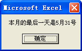

## 153、调用工作表函数求和

在对工作表的单元格区域进行求和计算时，使用工作表 Sum 函数比使用 VBA 代码遍历单元格进行累加求和效率要高得多，代码如下所示。

```vb
Sub rngSum()
	Dim rng As Range
	Dim d As Double
	Set rng = Range("A1:F7")
	d = Application.WorksheetFunction.Sum(rng)
	MsgBox rng.Address(0, 0) & "单元格的和为" & d
End Sub
```

代码解析：

rngSum 过程调用工作表 Sum 函数对工作表的单元格区域进行求和计算。

在 VBA 中调用工作表函数需要在工作表函数前加上 WorksheetFunction 属性。应用于 Application 对象的 WorksheetFunction 属性返回 WorksheetFunction 对象，作为 VBA 中调用工作表函数的容器，在实际应用中可省略 Application 对象识别符。

## 154、查找最大、最小值

在 VBA 中没有内置的函数可以进行最大、最小值的查找，借助工作表 Max、Min 函数可以快速地在工作表区域中查找最大、最小值，如下面的代码所示。

```vb
Sub seeks()
	Dim rng As Range
	Dim myRng As Range
	Dim k1 As Integer, k2 As Integer
	Dim max As Double, min As Double
	Set myRng = Sheet1.Range("A1:F30")
	For Each rng In myRng
		If rng.Value = WorksheetFunction.max(myRng) Then
			rng.Interior.ColorIndex = 3
			k1 = k1 + 1
			max = rng.Value
		ElseIf rng.Value = WorksheetFunction.min(myRng) Then
			rng.Interior.ColorIndex = 5
			k2 = k2 + 1
			min = rng.Value
		Else
			rng.Interior.ColorIndex = 0
		End If
	Next
	MsgBox "最大值是:" & max & "共有 " & k1 & "个" _
		& Chr(13) & "最小值是:" & min & "共有 " & k2 & "个"
End Sub
```

代码解析：

seeks 过程在工作表单元格区域中查找最大、最小值，并将其所在的单元格底色分别设置为红色和蓝色。

第 2 行到第 5 行代码声明变量类型。

第 6 行代码使用关键字 Set 将单元格引用赋给变量 myRng。

第 7 行到第 19 行代码遍历单元格区域，使用工作表 Max、Min 函数判断单元格数值是否是所在区域的最大、最小值，如果是，将其所在的单元格底色设置为红色或蓝色，并保存其数值和数量。

第 20、21 行代码使用消息框显示最大、最小值数值和数量。

运行 seeks 过程后将工作表区域最大、最小值所在的单元格的底色设置为红色或蓝色并用消息框显示其数值和数量，如图 154-1 所示。

::: center


<u>图 154-1</u>	查找最大、最小值

:::

## 155、不重复值的录入

在工作表中录入数据时，有时希望能限制重复值的录入，比如在示例的 A 列单元格只能录入唯一的人员编号，此时可以利用工作表的 Change 事件结合工作表的 CountIf  函数来判断所录入的人员编号是否重复，示例代码如下。

```vb
Private Sub Worksheet_Change(ByVal Target As Range)
	With Target
		If .Column <> 1 Or .Count > 1 Then Exit Sub
		If Application.CountIf(Range("A:A"), .Value) > 1 Then
			.Select
			MsgBox "不能输入重复的人员编号!", 64
			Application.EnableEvents = False
			.Value = ""
			Application.EnableEvents = True
		End If
	End With
End Sub
```

代码解析：

工作表的 Change 事件过程，使A列单元格只能录入唯一的人员编号。

第 4 行代码使用工作表的 CountIf 函数来判断在A列单元格输入的人员编号是否重复。工作表的 CountIf 函数计算区域中满足给定条件的单元格的个数，语法如下：

```vb
COUNTIF(range, criteria)

参数range为需要计算其中满足条件的单元格数目的单元格区域。
参数criteria为确定哪些单元格将被计算在内的条件，其形式可以为数字、表达式、单元格引用或文本。
```

在示例中以所录入的人员编号与A列单元格区域进行比较，如果 CountIf 函数的返回值大于 1，说明录入的是重复编号。

第 5 行代码，重新选择该单元格便于下一步清空后重新录入。

第 7、8、9 行代码，清除录入的重复编号，在清除前将 Application 对象的 EnableEvents 属性设置为 False，禁用事件。因为如果不禁用事件，那么在清除重复值的过程中会不断地触发工作表的 Change 事件，从而造成代码运行的死循环。

经过以上的设置，在工作表的A列中只能录入唯一的人员编号，如果录入重复值会进行提示，如图 155-1 所示，点击确定后自动清除录入的重复编号。

::: center


<u>图 155-1</u>	限制重复值的录入

:::

## 156、获得当月的最后一天

在实际工作中经常需要根据给定的日期计算其所属月份的最后一天，此时可以使用 DateSerial 函数完成计算，如下面的代码所示。

```vb
Sub Serial()
	Dim DateStr As Byte
	DateStr = Day(DateSerial(Year(Date), Month(Date) + 1, 0))
	MsgBox "本月的最后一天是" & Month(Date) & "月" & DateStr & "号"
End Sub
```

代码解析：

Serial 过程配合使用了 4 个 VBA 内置函数 Year、Month、Day 和 DateSerial 完成计算并使用消息框显示当月最后一天的日期。

Year、Month 和 Day 函数分别返回代表指定日期的年、月、日的整数，语法如下：

```vb
Year(Date)
Month(Date)
Day(Date)

其中参数Date可以是任何能够表示日期的Variant、数值表达式、字符串表达式或它们的组合。
```

DateSerial 函数返回包含指定的年、月、日的 Variant(Date)，语法如下：

```vb
DateSerial(year, month, day)

其中参数year、 month、day分别表示指定的年、月、日。
```

为了指定某个日期， DateSerial 函数中的每个参数的取值范围应该是可接受的，即日的取值范围应在 1-31 之间，而月的取值范围应在 1-12 之间。但是，当一个数值表达式表示某日之前或其后的年、月、日数时，也可以为每个使用这个数值表达式的参数指定相对日期。当任何一个参数的取值超出可接受的范围时，它会自动地在可接受的时间单位进行调整，例如本例中的 day 参数设置为 0，则被解释成 month 参数指定月的前一天，即表达式 Month(Date) + 1 指定的下一个月的前一天，也就是本月的最后一天。

运行 Serial 过程结果如图 156-1 所示。

::: center



<u>图 156-1</u>	获得当月的最后一天

:::

## 157、四舍五入运算

在实际工作中经常需要对数值或计算结果进行四舍五入运算，此时可以使用 VBA 内置的 Round 函数。Round 函数返回一个数值，该数值是按照指定的小数位数进行四舍五入运算的结果，语法如下：

```vb
Round(expression [,numdecimalplaces])

参数expression是必需的，要进行四舍五入运算的数值表达式。
参数numdecimalplaces是可选的，数字值，表示进行四舍五入运算时，小数点右边应保留的位数。如果忽略，则Round函数返回整数。
```

但是 VBA 内置的 Round 函数在对数值进行四舍五入运算时实行的是 Bankre 舍入，而不是算术舍入。按 Bankre 舍入规则，如果保留位数的下一个数字正好是 5 则其后没有其他有效数字，则按保留位最后一位“偶舍奇入”的方法进行处理。比如 Round(1.5) 的保留位最后为 1，是奇数，小数位的 5 入上去，因此 Round(1.5) 的运算结果是 2；而 Round(4.5) 的保留位最后为 4，是偶数，小数位的 5 舍去，因此 Round(4.5) 的运算结果是 4 而不是 5。

Bankre 舍入规则虽然有其合理性，但不符合实际工作的需要。在实际应用中使用以下两种方法避免 Bankre 舍入：

### 1）极小值修正法

在使用 Round 函数时对需要舍入的数值先加上极小值再调用 VBA 内置的 Round 函数，如下面的代码所示。

```vb
Sub aTestRound()
	MsgBox "Round(4.5)=" & Round(4.5) & Chr(13) & "Round(4.5)=" & Round(4.5 + 0.0000001)
End Sub
```

代码解析：

aTestRound 过程分别调用 VBA 内置的 Round 函数和加上极小值再调用 VBA 内置的 Round 函数在洗染店框中显示两者运算结果，如图 157-1 所示。

::: center


<u>图 157-1</u>	加上极小值进行运算结果

:::

从运算结果中可以发现，加上极小值后 Round(4.5) 已正确运算为 5 而不是 4。

### 2）调用工作表函数法

还可以使用工作表函数 Round 代替 VBA 内置的 Round 函数。工作表函数 Round 和 VBA 内置的 Round 函数的用法相同，但它采用算术舍入而不是 Bankre 舍入，所以不会有“偶舍奇入”的问题，如下面的代码所示。

```vb
Sub bTestRound()
	MsgBox "Round(4.5)=" & Round(4.5) & Chr(13) & "Round(4.5)=" & Application.Round(4.5, 0)
End Sub
```

代码解析：

bTestRound 过程分别调用 VBA 内置的 Round 函数和工作表 Round 函数在消息框中显示两者运算结果，如图 157-2 所示。

::: center


<u>图 157-2</u>	工作表函数运算结果

:::

从运算结果中可以发现，使用工作表 Round 函数后 Round(4.5) 已正确运算为 5 而不是 4。

## 158、使用字符串函数

使用 VBA 的字符串函数可以对字符串进行各种操作，如下面的代码所示。

```vb
Sub StrFunctions()
	Dim Str As String
	Str = "AbcD EFG hijk Lmn"
	MsgBox "原始字符串为：" & Str & Chr(13) _
		& "字符串长度为：" & Len(Str) & Chr(13) _
		& "左边8个字符为：" & Left(Str, 8) & Chr(13) _
		& "右边6个字符为：" & Right(Str, 6) & Chr(13) _
		& "从左边第2个开始取5个字符为：" & Mid(Str, 2, 5) & Chr(13) _
		& "转换为大写：" & UCase(Str) & Chr(13) _
		& "转换为小写：" & LCase(Str) & Chr(13)
End Sub
```

代码解析：

StrFunctions 过程使用字符串函数对字符串进行各种操作，如计算字符数、取得一定数量的字符、大小写转换等。

第 5 行代码使用 Len 函数返回字符串内字符的数目，Len 函数语法如下：

```vb
Len(string | varname)

参数string为任何有效的字符串表达式。
参数varname为任何有效的变量名称。
两个可能的参数必须有一个，而且只能有一个参数。
```

第 6 行代码使用 Left 函数从字符串左边起返回 8 个字符。

第 7 行代码使用 Right 函数从字符串右边起返回 6 个字符

Left 和 rigth 函数语法如下：

```vb
Left(string, length)
Right(string, length)

参数string是必需的，字符串表达式。
参数length是必需的，数值表达式，将返回的字符数量。如果为0，返回零长度字符串 ("")；如果大于或等于参数string的字符数，则返回整个字符串
```

第 8 行代码使用 Mid 函数从字符串第 2 位起返回 5 个字符。Mid 函数语法如下：

```vb
Mid(string, start[, length])

参数string是必需的，字符串表达式。
参数start是必需的，string中被取出部分的字符位置。如果超过string的字符数，将返回零长度字符串 ("")。
参数length是可选的，要返回的字符数。如果省略或超过string的字符数，将返回字符串中所有字符。
```

第 9 行代码使用 UCase 函数将字符串转换成大写的字符串。

第 10 行代码使用 LCase 函数将字符串转换成小写的字符串。

UCase 和 LCase 函数的语法如下：

```vb
UCase(string)
LCase(string)

参数string是必需的，任何有效的字符串表达式。
```

运行 StrFunctions 过程结果如图 158-1 所示。

::: center


<u>图 158-1</u>	使用字符串函数

:::

## 159、使用日期函数

使用 VBA 的日期函数可以对日期进行各种计算，如下面的代码所示。

```vb
Sub DatFunctions()
	Dim Str As String
	Dim Week As String
	Str = InputBox("请输入日期：")
	If Len(Str) > 0 Then
		If IsDate(Str) Then
			Select Case Weekday(Str, vbMonday)
				Case 1
					Week = "一"
				Case 2
					Week = "二"
				Case 3
					Week = "三"
				Case 4
					Week = "四"
				Case 5
					Week = "五"
				Case 6
					Week = "六"
				Case 7
					Week = "日"
			End Select
			MsgBox "你输入的日期是" & DateValue(Str) & Chr(13) _
				& "是" & Year(Str) & "年的第" & DatePart("q", Str) & "季度" & Chr(13) _
				& "是星期" & Week & Chr(13) _
				& "距离今天有" & Abs(DateDiff("d", Date, Str)) & "天" & Chr(13) _
				& "60天后的日期是" & DateAdd("d", 60, Str)
		Else
			MsgBox "请输入正确格式的日期!"
		End If
	End If
End Sub
```

代码解析：

DatFunctions 过程在对话框中输入日期后使用各种日期函数对其进行计算并用消息框显示。

第 4、5 行代码使用 InputBox 函数显示一个对话框，供用户在对话框中输入一个日期。

第 6 行代码使用 IsDate 函数判断输入的日期是否正确。IsDate 函数返回 Boolean 值，指出一个表达式是否可以转换成日期，语法如下：

```vb
IsDate(expression)

参数expression是必需的，日期表达式或字符串表达式，如果表达式是一个日期，或者可以作为有效日期识别，则IsDate函数返回True，否则返回False。
```

第 7 行到第 22 行代码使用 Weekday 函数判断所输入的日期是星期几。Weekday 函数返回一个整数，代表某个日期是星期几，语法如下：

```vb
Weekday(date, [firstdayofweek])

参数date是必需的，能够表示日期的 Variant、数值表达式、字符串表达式或它们的组合。
参数firstdayofweek是可选的，指定一星期第一天的常数，如表格 159-1所示。
```

<u>表格 159-1</u>	firstdayofweek 参数值

| 常数        | 值   | 描述              |
| ----------- | ---- | ----------------- |
| vbUseSystem | 0    | 使用 NLS API 设置 |
| VbSunday    | 1    | 星期日（缺省值）  |
| vbMonday    | 2    | 星期一            |
| vbTuesday   | 3    | 星期二            |
| vbWednesday | 4    | 星期三            |
| vbThursday  | 5    | 星期四            |
| vbFriday    | 6    | 星期五            |
| vbSaturday  | 7    | 星期六            |

Weekday 函数返回一个 1 到 7 之间的整数，当 firstdayofweek 参数设置为 vbMonday（2）时，返回 1 时说明是星期一，以此类推。

第 23 行代码根据系统中指定的短日期格式来显示所输入的日期。DateValue 函数的语法如下：

```vb
DateValue(date)

参数date是必需的，任何表达式，表示从 100 年 1 月 1 日到 9999 年 12 月 31 日之间的一个日期。如果是一个字符串，且其内容只有数字以及分隔数字的日期分隔符，则 DateValue函数就会根据系统中指定的短日期格式来识别月、日、年的顺序。DateValue函数也识别明确的英文月份名称，全名或缩写均可。例如，除了12/30/1991 和12/30/91 之外，DateValue函数也能识别December 30, 1991 和Dec 30, 1991。

如果date参数中略去了年这一部分，DateValue函数就会使用由计算机系统日期设置的当前年份。
```

第 24 行代码判断输入的日期的季度。DatePart 函数返回一个包含已知日期的指定时间部分的值，语法如下：

```vb
DatePart(interval, date[,firstdayofweek[, firstweekofyear]])

其中参数interval是必需的，字符串表达式，是要返回的时间间隔，设定值如表格 159-2所示。
```

<u>表格 159-2</u>	interval 参数设定值

| 设置 | 说明       |
| ---- | ---------- |
| yyyy | 年         |
| q    | 季         |
| m    | 日         |
| y    | 一年的日数 |
| d    | 日         |
| w    | 一周的日数 |
| ww   | 周         |
| h    | 时         |
| n    | 分钟       |
| s    | 秒         |

第 26 行代码计算所输入的日期距当天的天数。DateDiff 函数返回两个指定日期间的时间间隔数目，语法如下：

```vb
DateDiff(interval, date1, date2[, firstdayofweek[, firstweekofyear]])

其中参数interval是必需的，字符串表达式，表示用来计算date1和date2的时间差的时间间隔，设定值如表格 1592所示。
参数date1和date2是必需的，计算中要用到的两个日期。
```

因为如果输入的日期是当前日期以前的日期，DateDiff 函数会返回负值，所以使用 Abs 函数返回绝对值将其转换为正值。

第 27 行代码计算所输入的日期距当天的天数，DateAdd 返回加上了一段时间间隔的一个日期，语法如下：

```vb
DateAdd(interval, number, date)

参数interval是必需的，字符串表达式，是所要加上去的时间间隔，设定值如表格 159-2所示。
参数number是必需的，是要加上的时间间隔的数目。其数值可以为正数（得到未来的日期），也可以为负数（得到过去的日期）。
参数date是必需的，需要加上时间间隔的字符串表达式。
```

运行 DatFunctions 过程，在显示的对话框中输入一个日期，结果如图 159-1 所示。

::: center


<u>图 159-1</u>	使用日期函数

:::

## 160、判断是否为数值

使用 IsNumeric 函数可以判断表达式的运算结果是否为数值，如下面的代码所示。

```vb
Sub Numeric()
	Dim i As Integer
	Dim n As String
	Dim s As String
	With Sheet1
		For i = 1 To .Range("A65536").End(xlUp).Row
			If IsNumeric(.Cells(i, 1)) Then
				n = n & .Cells(i, 1).Address(0, 0) & Chr(9) & .Cells(i, 1) & Chr(13)
			Else
				s = s & .Cells(i, 1).Address(0, 0) & Chr(9) & .Cells(i, 1) & Chr(13)
			End If
		Next
	End With
	MsgBox "A列中数值单元格：" & Chr(13) & n & Chr(13) _
		& "A列中非数值单元格：" & Chr(13) & s
End Sub
```

代码解析：

Numeric 过程使用 IsNumeric 函数判断工作表的A列单元格是否为数值，并使用消息框显示。

第 7 行代码判断工作表的 A 列单元格是否为数值。IsNumeric 函数返回 Boolean 值，指出表达式的运算结果是否为数，语法如下：

```vb
IsNumeric(expression)

参数expression是必需的，Variant类型，包含数值表达式或字符串表达式。
如果参数expression的运算结果为数字，则IsNumeric返回True，否则返回False。
```

第 8 行代码将数值单元格的地址和数值保存在变量 e 中。

第 10 行代码将非数值单元格的地址和内容保存在变量 s 中。在保存时插入制表符对数据列进行分隔，使之排列整齐，请参阅 73-5。

运行 Numeric 过程结果如图 160-1 所示。

::: center


<u>图 160-1</u>	判断是否为数值

:::

## 161、格式化数值、日期和时间

Format 函数是 VBA 中的常用函数，可以实现数值、日期和时间格式的转变，示例代码如下：

```vb
Sub FromatCurrent()
	MsgBox Format(123456.789, "0.00") & Chr(13) _
		& Format(123456.789, "0.00%") & Chr(13) _
		& Format(123456.789, "##,##0.00") & Chr(13) _
		& Format(-123456.789, "$#,##0.00;($#,##0.00)") & Chr(13) _
		& Format(-123456.789, "￥#,##0.00;(￥#,##0.00)") & Chr(13) _
		& Format(Date, "yyyy-mm-dd") & Chr(13) _
		& Format(Date, "yyyymmdd") & Chr(13) _
		& Format(Date, "Long Date") & Chr(13) _
		& Format(Now, "hh:mm:ss") & Chr(13) _
		& Format(Now, "hh:mm:ss AMPM")
End Sub
```

代码解析：

FromatCurrent 过程使用消息框显示格式化后的数值、日期和时间。

Format 函数根据格式表达式中的指令来格式化的数值、日期和时间，语法如下：

```vb
Format(expression[, format[, firstdayofweek[, firstweekofyear]]])

其中参数expression是必需的，任何有效的表达式。
参数format是可选的，有效的命名表达式或用户自定义格式表达式。
```

第 2 行代码将数值格式化为两位小数格式显示。

第 3 行代码将数值格式化为两位小数的百分比格式显示。

第 4 行代码将数值格式化为千位分隔符显示。

第 5 行代码将数值格式化为以美元符号显示的两位小数，以千位分隔符分隔，如果是负值则以小括号显示。

第 6 行代码将数值格式化为以人民币符号显示的两位小数，以千位分隔符分隔，如果是负值则以小括号显示。

第 7 行代码将系统日期格式化为“yyyy-mm-dd”格式显示。

第 8 行代码将系统日期格式化为“yyyymmdd”格式显示。

第 9 行代码将系统日期格式化为长日期格式显示。

第 10 行代码将系统时间格式化为 24 小时、分钟和秒的格式显示。

第 11 行代码将系统时间格式化为分 12 小时、分钟和秒的格式显示。

运行 FromatCurrent 过程结果如图 161-1 所示。

::: center


<u>图 161-1</u>	格式化数值、日期和时间

:::

## 162、个人所得税自定义函数

在财务工作中经常需要计算个人所得税，而在 Excel 中没有计算个人所得税的函数，此时可以使用自定义函数来计算，如下面的代码所示。

```vb
Public Function PITax(Income, Optional Threshold) As Single
	Dim Rate As Single
	Dim Debit As Single
	Dim Taxliability As Single
	If IsMissing(Threshold) Then Threshold = 2000
	Taxliability = Income - Threshold
	Select Case Taxliability
		Case 0 To 500
			Rate = 0.05
			Debit = 0
		Case 500.01 To 2000
			Rate = 0.1
			Debit = 25
		Case 2000.01 To 5000
			Rate = 0.15
			Debit = 125
		Case 5000.01 To 20000
			Rate = 0.2
			Debit = 375
		Case 20000.01 To 40000
			Rate = 0.25
			Debit = 1375
		Case 40000.01 To 60000
			Rate = 0.3
			Debit = 3375
		Case 60000.01 To 80000
			Rate = 0.35
			Debit = 6375
		Case 80000.01 To 10000
			Rate = 0.4
			Debit = 10375
		Case Else
			Rate = 0.45
			Debit = 15375
	End Select
	If Taxliability <= 0 Then
		PITax = 0
	Else
		PITax = Application.Round(Taxliability * Rate - Debit, 2)
	End If
End Function
```

代码解析：

自定义 PITax 函数根据应纳税额计算应纳的个人所得税额。

第 5 行代码设置个人所得税的起征点为 2000 元，如果以后需要调整起征点，可把 2000 元改为调整后的起征点。

第 6 行代码设置全月应纳税所得额等于应纳税收入减去起征点。

第 7 行到第 35 行代码根据全月应纳税所得额取得税率和速算扣除数。税率和速算扣除数根据如表格 162-1 所示的工资、薪金所得适用个人所得税九级超额累进税率表计算。

<u>表格 162-1</u>	个人所得税九级超额累进税率表

| 级数 | 全月应纳税所得额（含税所得额） | 税率% | 速算扣除数（元） |
| ---- | ------------------------------ | ----- | ---------------- |
| 一   | 不超过500元                    | 5     | 0                |
| 二   | 超过500元至2000元              | 10    | 25               |
| 三   | 超过2000元至5000元             | 15    | 125              |
| 四   | 超过5000元至20000元            | 20    | 375              |
| 五   | 超过20000元至40000元           | 25    | 1375             |
| 六   | 超过40000元至60000元           | 30    | 3375             |
| 七   | 超过60000元至80000元           | 35    | 6375             |
| 八   | 超过80000元至100000元          | 40    | 10375            |
| 九   | 超过100000元                   | 45    | 15375            |

第 36 行到第 40 行代码根据应纳税所得额、税率和速算扣除数计算应纳的个人所得税额。其中第 39 行代码中使用工作表函数 Round 对计算结果进行四舍五入运算，请参阅 157-2。

在工作表中使用自定义 PITax 函数结果如图 162-1 所示。

::: center


<u>图 162-1</u>	工作表中使用自定义 PITax 函数

:::

## 163、人民币大写函数

在 VBA 中没有内置的函数进行人民币大写转换，此时可以编写自定义函数进行人民币大写转换，如下面的代码所示。

```vb
Public Function RMBDX(M)
	RMBDX = Replace(Application.Text(Round(M + 0.00000001, 2), "[DBnum2]"), ".", "元")
	RMBDX = IIf(Left(Right(RMBDX, 3), 1) = "元", Left(RMBDX, Len(RMBDX) - 1) & "角" & Right(RMBDX, 1) & "分", IIf(Left(Right(RMBDX, 2), 1) = "元", RMBDX & "角整", IIf(RMBDX = "零", "", RMBDX & "元整")))
	RMBDX = Replace(Replace(Replace(Replace(RMBDX, "零元零角", ""), "零元", ""), "零角", "零"), "-", "负")
End Function
```

代码解析：

第 2 行代码首先使用 Round 函数对小写数字加上极小值后进行四舍五入运算，关于 Round 函数请参阅 157-1。其次使用工作表 Text 函数将数值转换成人民币大写格式表示的文本。Text 函数将数值转换为按指定数字格式表示的文本，语法如下：

```vb
TEXT(value,format_text)

Value参数为数值、计算结果为数值的公式，或对包含数值的单元格的引用。
Format_text参数为“单元格格式“对话框中”数字“选项卡上”分类框中的文本形式的数字格式。
```

最后使用 Replace 函数将人民币大写格式表示的文本中的小数点替换成“元”。 Replace 函数返回一个字符串，该字符串中指定的子字符串已被替换成另一子字符串，并且替换发生的次数也是指定的，语法如下：

```vb
Replace(expression, find, replace[, start[, count[, compare]]])

其中参数expression是必需的，包含要替换的子字符串。
参数find是必需的，要搜索到的子字符串。
参数replace是必需的，用来替换的子字符串。
参数start是可选的，在表达式中子字符串搜索的开始位置。
```

第 3 行代码使用了 IIF 函数、Left 函数、Right 函数根据第 2 行代码返回的人民币大写格式表示的文本中的“元”的位置在文本中插入正确的“元”、“角”、“分”字符，使之符合人民币大写习惯。

IIf 函数根据表达式的值，来返回两部分中的其中一个，语法如下：

```vb
IIf(expr, truepart, falsepart)

参数expr是必需的，用来判断真伪的表达式。
参数truepart是必需的，如果expr为True，则返回这部分的值或表达式。
参数falsepart是必需的，如果expr为False，则返回这部分的值或表达式。
```

Left、Right 函数请参阅 158 。

第 4 行代码使用 Replace 函数将人民币大写格式表示的文本中可能出现的“零元零角”、“零元”替换成空白字符；可能出现的“零角”替换成“零”。如果输入负数的话，将“-”替换成“负”。

在工作表中使用自定义 RMBDX 函数转换人民币大写的效果如图 163-1 所示。

::: center


<u>图 163-1</u>	人民币大写转换

:::

## 164、列号转换为列标

使用 VBA 获取单元格的列号时，只能返回一个数值。如果需要获取以字符表示的列标，可以使用下面的自定义 GetColumn 函数过程。

```vb
001  Function GetColumn(C As Integer) As String
002    GetColumn = Split(Cells(1, C).Address, "$")(1)
003  End Function
```

代码解析：

GetColumn 函数过程代码中，将参数 iCol 作为列号传递给 Cells 属性，并获取其绝对地址字串符，然后以“$”字符为分隔符，通过Split函数返回一个一维数组。 

Split 函数返回一个下标从零开始的一维数组，它包含指定数目的子字符串，语法如下：

```vb
Split(expression[, delimiter[, limit[, compare]]])

其中参数expression是必需的，包含子字符串和分隔符的字符串表达式 。如果expression是一个长度为零的字符串("")，则返回一个空数组，即没有元素和数据的数组。
参数delimiter是可选的，用于标识子字符串边界的字符串字符。如果忽略，则使用空格字符(" ")作为分隔符。
```

返回一维数组后获取该数组的第 2 个元素（下标为 1），即该列号的字符列标。

下面的代码使用 GetColumn 函数过程获得所选单元格的字符列标。 

```vb
Private Sub Worksheet_SelectionChange(ByVal Target As Range)
	MsgBox GetColumn(Selection.Column)
End Sub
```

在工作表中选择单元格后结果如图 164-1 所示。

::: center


<u>图 164-1</u>	返回列标字符串

:::

## 165、判断工作表是否为空表

VBA 中没有专门的属性或函数可以判断工作表是否为空白工作表，可以使用自定义函数返回指定工作表是否为空工作表，如下面的代码所示。

```vb
Function IsBlankSht(Sh As Variant) As Boolean
	If TypeName(Sh) = "String" Then Set Sh = Worksheets(Sh)
	If Application.CountA(Sh.UsedRange.Cells) = 0 Then
		IsBlankSht = True
	End If
End Function
```

代码解析：

自定义 IsBlankSht 函数包含一个 Variant 变量类型的参数，代表工作表名称或者对象名称。如果指定的工作表为空工作表，则该函数返回 True。

第 2 行代码使用 TypeName 函数判断参数 Sh 是否为字符串类型（“String”），如果是字符串，则将以该字符串作为名称的工作表赋值给变量 Sh。

第 3 行代码通过工作表函数 CountA 统计工作表已使用区域的非空单元格个数，如果统计结果为 0，则表示该工作表为空工作表。

现在就可以像使用 VBA 函数一样使用自定义的 IsBlankSht 函数，如下面的代码所示。

```vb
Sub DelBlankSht()
	Dim Sh As Worksheet
	Application.DisplayAlerts = False
	For Each Sh In ThisWorkbook.Sheets
		If IsBlankSht(Sh) Then Sh.Delete
	Next
	Application.DisplayAlerts = True
End Sub
```

代码解析：

使用自定义的 IsBlankSht 函数删除工作簿中所有空工作表。

第 3 行代码将 Application 对象的 DisplayAlerts 属性设置为 False，使删除时不显示系统警告对话框。

第 4 行到第 6 行代码，使用 For Each...Next 语句遍历所有工作表，使用自定义的 IsBlankSht 函数判断是否为空表，如果为空表则使用 Delete 方法删除。

::: tip 注意

自定义 IsBlankSht 函数仅仅判断工作表单元格区域内容是否为空，如果工作表中存在其它对象（如图形对象、数据有效性、单元格批注等），还需要再进一步判断。

:::

## 166、查找指定工作表

判断工作簿中是否存在指定名称的工作表，除了使用遍历工作簿中所有工作表的方法外，还可以使用自定义函数，如下面的代码所示。

```vb
Function ExistSh(Sh As String) As Boolean
	Dim Sht As Object
	On Error Resume Next
	Set Sht = Sheets(Sh)
	If Err.Number = 0 Then ExistSh = True
	Set Sht = Nothing
End Function
```

代码解析：

自定义 ExistSh 函数包含一个 String 类型的参数，代表需要判断的工作表名称。如果该工作表存在，则返回 True。

第 5 行代码判断前面的代码是否出错，如果前面的代码存在错误，则表示不存在指定名称的表。

使用自定义 ExistSheet 函数判断工作簿中是否存在指定名称的工作表，如下面的代码所示。

```vb
Sub NotSht()
	Dim Sh As String
	Sh = InputBox("请输入工作表名称：")
	If Len(Sh) > 0 Then
		If Not ExistSh(Sh) Then
			MsgBox "对不起," & Sh & "表不存在!"
		Else
			Sheets(Sh).Select
		End If
	End If
End Sub
```

代码解析：

NotSht 过程使用自定义的 ExistSh 函数判断工作簿中是否存在指定名称的工作表，如果不存在则使用消息框进行提示，如图 166-1 所示。

::: center


<u>图 166-1</u>	查找指定工作表

:::

## 167、查找指定工作簿是否打开

如果需要判断指定名称的工作簿是否已经打开，除了使用 43 的方法外，还可以使用与 166 类似的自定义函数，如下面的代码所示。

```vb
Function ExistWorkbook(WbName As String) As Boolean
	Dim wb As Workbook
	On Error Resume Next
	Set wb = Workbooks(WbName)
	If Err.Number = 0 Then ExistWorkbook = True
	Set wb = Nothing
End Function
```

代码解析：

自定义 ExistWorkbook 函数判断指定名称的工作簿是否已经打开。

第 5 行代码判断前面的赋值语句是否存在错误。如果没有指定名称的工作簿，则第 4 行代码会产生错误，自定义 ExistWorkbook 函数返回 False。

下面使用自定义 ExistWorkbook 函数判断名称为“Excel Home”的工作簿是否已经打开，如果没有打开则使用消息框进行提示，如图 167-1 所示。

```vb
Sub NotWorkbook()
	If Not (ExistWorkbook("Excel Home")) Then MsgBox "对不起,Excel Home工作簿没有打开!"
End Sub
```

::: center


<u>图 167-1</u>	消息框提示

:::

## 168、取得应用程序的安装路径

使用自定义函数取得应用程序的安装路径，如下面的代码所示。

```vb
Function GetSetupPath(AppName As String)
	Dim WSH As Object
	Set WSH = CreateObject("Wscript.Shell")
	GetSetupPath = WSH.RegRead("HKEY_LOCAL_MACHINE\Software" _
		& "\Microsoft\Windows\CurrentVersion\App Paths\" _
		& AppName & "\Path")
	Set WSH = Nothing
End Function
Sub WinRARPath()
	MsgBox GetSetupPath("WinRAR.exe")
End Sub
```

代码解析：

自定义 GetSetupPath 函数取得应用程序的安装路径，其中参数 AppName 代表指定的应用程序的名称。

第 3 行代码使用 CreateObject 函数将 Wscript.Shell 对象的引用赋给变量 WSH。

CreateObject 函数创建并返回一个对 ActiveX 对象的引用，语法如下：

```vb
CreateObject(class,[servername])

参数class是必需的，Variant (String)，要创建的应用程序名称和类。
参数servername是可选的，Variant (String)，要在其上创建对象的网络服务器名称。如果servername是一个空字符串("")，即使用本地机器。
```

第 4 行代码取得 AppName 参数指定的应用程序在注册表中的路径。

WinRARPath 过程使用消息框显示由自定义的 GetSetupPath 函数取得的应用程序“WinRAR”的安装路径。

运行 WinRARPath 过程结果如图 168-1 所示。

::: center


<u>图 168-1</u>	应用程序安装路径

:::

## 169、数组的使用

### 1）代码运行时创建数组

使用 Array 函数可以在代码运行时创建数组并把一系列数据保存在数组中，示例代码如下：

```vb
Option Base 1
Sub arr()
	Dim arr As Variant
	Dim i As Integer
	arr = Array("王晓明", "吴胜玉", "周志国", "曹武伟", "张新发", "卓雪梅", "沈煜婷", "丁林平")
	For i = LBound(arr) To UBound(arr)
		Cells(i, 1) = arr(i)
	Next
End Sub
```

代码解析：

Arr 过程使用 Array 函数创建一个数组用来保存数据并将其写入到工作表的单元格区域。

第 1 行代码使用 Option Base 语句声明数组下标的缺省下界为 1，数组下标的缺省下界默认为 0。

第 5 行代码使用 Array 函数创建数组用来保存数据。Array 函数返回一个包含数组的 Variant，语法如下：

```vb
Array(arglist)

Arglist参数是一个用逗号隔开的值表，这些值用于给Variant所包含的数组的各元素赋值。如果不提供Arglist参数，则创建一个长度为 0 的数组。
```

第 6 行代码使用 LBound 函数和 UBound 函数取得数组的最小和最大下标。

LBound 函数返回一个 Long 型数据，其值为指定数组维可用的最小下标，语法如下：

UBound 函数返回一个 Long 型数据，其值为指定数组维可用的最大下标，语法如下：

```vb
LBound(arrayname[, dimension])
UBound(arrayname[, dimension])

参数arrayname是必需的，数组变量的名称。
参数dimension是可选的，指定返回哪一维的下界，1表示第一维，2表示第二维，如此类推。默认为1。
```

UBound 函数与 LBound 函数一起使用，可以用来确定数组的大小。

第 7 行代码确定数组的大小后使用 For...Next 语句遍历数组元素并将数组元素依次写入到工作表的 A 列单元格中，如图 169-1 所示。

::: center


<u>图 169-1</u>	将数组元素写入工作表

:::

### 2）文本转换为数组

在处理字符串时可以使用 Split 函数将字符串按指定的分隔符分开并以数组返回，代码如下：

```vb
Sub Splitarr()
	Dim Arr As Variant
	Arr = Split(Sheet2.Cells(1, 1), ",")
	Sheet1.Cells(1, 1).Resize(UBound(Arr) + 1, 1) = Application.Transpose(Arr)
End Sub
```

代码解析：

Splitarr 过程使用 Split 函数将工作表 Sheet2 中 `A1` 单元格的姓名分别写入到工作表 Sheet1 中的 A 列单元格。

Split 函数返回一个下标从零开始的一维数组，包含指定数目的子字符串，语法如下：

```vb
Split(expression[, delimiter[, limit[, compare]]])

参数expression是必需的，包含子字符串和分隔符的字符串表达式。
参数delimiter是必需的，用来标识子字符串边界的字符串字符。如果忽略，则使用空格字符(" ")作为分隔符。
```

第 4 行代码，首先使用 UBound 函数取得返回数组的最大下标后调整单元格区域，因为数组下标的缺省下界默认为 0，所以在使用 Resize 属性调整单元格区域时参数 RowSize 需要在返回数组的最大下标上加一。

然后使用工作表 Transpose 函数将返回数组转置后写入到工作表调整后的单元格区域中。

工作表 Transpose 函数返回转置单元格区域，即将一行单元格区域转置成一列单元格区域，反之亦然，语法如下：

```vb
TRANSPOSE(array)

参数 array 为需要进行转置的数组或工作表中的单元格区域。
```

Splitarr 过程将如图 169-2 所示的工作表单元格中的字符串以逗号分隔后依次写入到工作表的 A 列单元格中，如图 169-3 所示。

::: center


<u>图 169-2</u>	工作表单元格中的字符串


<u>图 169-3</u>	文本转换为数组写入单元格

:::

### 3）使用动态数组去除重复值

在 169-2 中使用数组函数将单元格中的文本进行分隔后写入到工作表 Sheet1 中的 A 列单元格，但是如果文本中含有大量的重复值，在写入时也会将重复值写入到工作表中，此时可以使用动态数组去除文本中的重复值，如下面的代码所示。

```vb
Sub Splitarr()
	Dim Splarr() As String
	Dim Arr() As String
	Dim Temp() As String
	Dim r As Integer
	Dim i As Integer
	On Error Resume Next
	Splarr = Split(Sheet2.Range("a1"), ",")
	For i = 0 To UBound(Splarr)
		Temp = Filter(Arr, Splarr(i))
		If UBound(Temp) < 0 Then
			r = r + 1
			ReDim Preserve Arr(1 To r)
			Arr(r) = Splarr(i)
		End If
	Next
	Sheet1.Range("a1").Resize(r, 1) = Application.Transpose(Arr)
End Sub
```

代码解析：

Splitarr 过程将工作表 Sheet2 中 `A1` 单元格的文本去除重复值后写入到工作表 Sheet1 中的 A 列单元格。

第 2 行代码声明数组 Splarr 用来保存 Sheet2 中 `A1` 单元格的文本。

第 3 行代码声明数组 Arr 用来保存去除重复值后的文本。

第 4 行代码声明数组 Temp 用来判断文本是否重复。

第 5 行代码声明变量 r 用来保存去除重复值后的文本数量。

第 7 行代码启动错误处理程序来忽略错误，因为在程序运行到第 11 行代码会发生下标越界错误。

第 8 行代码使用 Split 函数以 Sheet2 中 `A1` 单元格的文本创建一个下标从零开始的一维数组。关于 Split 函数请参阅 169-2。

第 9 行代码使用 For...Next 语句遍历数组 Splarr 的所有元素。

第 10 行代码使用 Filter 函数创建一个数组 Temp 用来保存以当前 Splarr 数组的值在 Arr 数组中的搜索结果。Filter 函数返回一个下标从零开始的数组，该数组包含基于指定筛选条件的一个字符串数组的子集，语法如下：

```vb
Filter(sourcesrray, match[, include[, compare]])

参数sourcesrray是必需的，要执行搜索的一维字符串数组。
参数match是必需的，要搜索的字符串。
参数include是可选的，Boolean值，表示返回子串是否包含match字符串。如果参数include是True，Filter函数返回的是包含match参数子字符串的数组子集。如果参数include是False，Filter函数返回的是不包含match参数子字符串的数组子集。
参数compare是可选的，所使用的字符串比较类型。
```

第 11 行代码根据返回的数组 Temp 的最大下标来判断当前 Splarr 数组的值是否重复。在使用使用 Filter 函数时如果没有相匹配的值，将返回一个空数组，最大下标小于 0。

第 12 行代码如果当前 Splarr 数组的值不重复则将变量 r 的值加 1。

第 13 行代码重新定义动态数组大小。ReDim 语句，在过程级别中使用，用于为动态数组变量重新分配存储空间，语法如下：

```vb
ReDim [Preserve] varname(subscripts) [As type] [, varname(subscripts) [As type]]

参数Preserve是可选的，关键字，当改变原有数组最末维的大小时，使用此关键字可以保持数组中原来的数据。
参数varname是必需的，变量的名称。
参数subscripts是必需的，数组变量的维数，最多可以定义 60 维的多维数组，使用下面的语法；

[lower To] upper [,[lower To] upper]
```

第 14 行代码将不重复值添加到数组 Arr 中。

第 15 行代码使用工作表 Transpose 函数将去除重复值的的文本转置后写入到工作表的 A 列单元格中。

如果需要将去除重复值的的文本写入到第一行单元格中，可以将第 15 行代码改成下面的代码：

```vb
Sheet1.Range("a1").Resize(1, r) = Arr
```

如果需要将去除重复值的的文本还是以逗号作为分隔符写入到 `A1` 单元格中，可以将第 15 行代码改成下面的代码：

```vb
Sheet1.Range("a1") = Join(Arr, ",")
```

Join 函数返回一个字符串，该字符串是通过连接某个数组中的多个子字符串而创建的，语法如下：

```vb
Join(sourcearray[, delimiter])

参数sourcearray是必需的，包含被连接子字符串的一维数组。
参数delimiter是可选的，在返回字符串中用于分隔子字符串的字符，如果忽略则使用空格(" ")来分隔子字符串。
```

