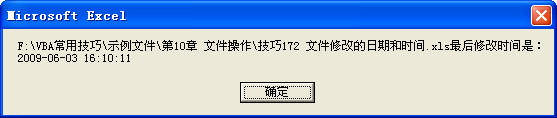
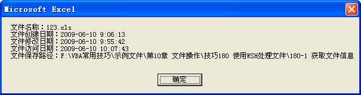

## 170、导入文本文件

在实际应用中，我们经常从软件中将数据导出为文本文件，在需要将这些文本文件导入到 Excel 中时可以使用以下的方法。

### 1）使用查询表导入

```vb
Sub AddQuery()
	Sheet1.UsedRange.ClearContents
	With Sheet1.QueryTables.Add( _
		Connection:="TEXT;" & ThisWorkbook.Path & "\工资表.txt", _
		Destination:=Range("A1"))
		.TextFilePlatform = 936
		.TextFileCommaDelimiter = True
		.Refresh
	End With
End Sub
```

代码解析：

AddQuery 过程使用 QueryTable 对象的 Add 方法新建查询表后将文本文件“工资表.txt”的内容导入到工作表中。

应用于 QueryTable 对象的 Add 方法新建一个查询表，返回 QueryTable 对象，该对象代表新建的查询表，语法如下：

```vb
expression.Add(Connection, Destination, Sql)

参数expression是必需的，返回一个QueryTables对象。
参数Connection是必需的，查询表的数据源。如果数据源是文本文件，是“TEXT;<文本文件路径和名称>”形式的字符串，其他数据源请参阅帮助。
参数Destination是必需的，Range类型，查询表目标区域左上角单元格用于放置生成的查询表的区域。目标区域必须在包含expression 指定的QueryTables对象的工作表上。
参数Sql是可选的，在ODBC数据源上运行的SQL查询字符串，当将QueryTable对象、文本文件、或是ADO或DAO Recordset对象指定为数据源时不能使用该参数。
```

第 3 行到第 5 行代码在工作表中建立对位于同一目录中的“工资表.txt”文本文件的查询，并将查询结果放置到工作表中。

第 6 行代码设置导入的文本文件的原始格式，QueryTables 对象的 TextFilePlatform 属性返回或设置正向查询表中导入的文本文件的原始格式，默认值是在“文本导入向导”的“文件原始格式”选项中的当前设置。

第 7 行代码设置文本文件导入查询表中时，是以逗号作为分隔符。

第 8 行代码使用 Refresh 方法更新外部数据区域，应用于 QueryTable 对象的 Refresh 方法更新外部数据区域，语法如下：

```vb
expression.Refresh(BackgroundQuery)

参数expression是必需的，返回一个QueryTable对象。
参数BackgroundQuery是可选的的，只用于基于SQL查询结果的QueryTable。
```

### 2）使用 Open 语句导入

使用 Open 语句输入文本文件，如下面的代码所示。

```vb
Sub OpenText()
	Dim Filename As String
	Dim myText As String
	Dim mArr() As String
	Dim i As Integer
	Dim j As Integer
	Filename = ThisWorkbook.Path & "\工资表.txt"
	j = 1
	Sheet1.UsedRange.ClearContents
	Open Filename For Input As 1
	Do While Not EOF(1)
		Line Input 1, myText
		mArr = Split(myText, ",")
		For i = 0 To UBound(mArr)
			Sheet1.Cells(j, i + 1) = mArr(i)
		Next
		j = j + 1
	Loop
	Close 1
End Sub
```

代码解析：

OpenText 过程使用 Open 语句将文本“工资表.txt”的内容输入到工作表中。

第 10 行代码使用 Open 语句打开文本文件以完成对文本文件的输入。Open 语句能够对文件输入/输出（I/O），语法如下：。

```
Open pathname For mode [Access access] [lock] As [#]filenumber [Len=reclength]

Pathname是必需的，指定文件名，该文件名可能还包括目录、文件夹及驱动器。
mode是必需的，指定文件方式，有Append、Binary、Input、Output、或Random方式。如果未指定方式，则以Random访问方式打开文件。
Access是可选的，说明打开的文件可以进行的操作，有Read、Write、或Read Write操作。
lock是可选的，说明限定于其它进程打开的文件的操作，有Shared、Lock Read、Lock Write、和Lock Read Write操作。
filenumber是必需的，一个有效的文件号，范围在 1 到 511 之间。使用FreeFile函数可得到下一个可用的文件号。
reclength是可选的，小于或等于 32，767（字节）的一个数。对于用随机访问方式打开的文件，该值就是记录长度。对于顺序文件，该值就是缓冲字符数。
```

第 11 行代码使用 Do...Loop 语句重复执行第 12 行到第 17 行代码，直到文本文件的结尾。EOF 函数返回一个 Integer，它返回 Boolean 值 True，表明已经到达为 Random 或顺序 Input 打开的文件结尾，语法如下：

```vb
EOF(filenumber)

参数filenumber是必需的，是一个Integer，包含任何有效的文件号。
```

第 12 行代码使用 Line Input # 语句读入一行数据并将其赋予变量 myText。Line Input # 语句从已打开的顺序文件中读出一行并将它分配给 String 变量，语法如下：

```vb
Line Input #filenumber, varname

Filenumber是必需的，任何有效的文件号。
varnamer是必需的，有效的Variant或String变量名。
```

第 13 行代码使用 Split 函数按逗号作为分隔符分开这行字符，赋值数组 mArr。关于 Split 函数请参阅 169-2。

第 14 行到第 16 行代码将数组 mArr 循环赋值给单元格，请参阅 169-1。

第 19 行代码关闭文本文件。Close 语句关闭 Open 语句所打开的输入/输出 (I/O) 文件，语法如下：

```vb
Close [filenumberlist]

参数filenumberlist是可选的，为一个或多个文件号，如省略则将关闭所有由Open语句打开的活动文件。
```

### 3）使用 OpenText 方法

使用 OpenText 方法载入一个文本文件并将其作为包含单个工作表的工作簿处理，如下面的代码所示。

```vb
Sub OpenText()
	Dim myFileName As String
	myFileName = "工资表.txt"
	Sheet1.UsedRange.ClearContents
	Workbooks.OpenText _
		Filename:=ThisWorkbook.Path & "\" & myFileName, _
		StartRow:=1, DataType:=xlDelimited, Comma:=True
	With ActiveWorkbook
		With .Sheets("工资表").Range("A1").CurrentRegion
			ThisWorkbook.Sheets("Sheet1").Range("A1").Resize(.Rows.Count, .Columns.Count).Value = .Value
		End With
		.Close False
	End With
End Sub
```

代码解析：

OpenText 过程使用 OpenText 方法载入“工资表.txt”文本文件并将其数据写入到工作表中。

第 5 行到第 7 行代码使用 OpenText 方法载入“工资表.txt”文本文件。OpenText 方法载入一个文本文件，并将其作为包含单个工作表的工作簿进行分列处理，然后在此工作表中放入经过分列处理的文本文件数据，语法如下：

```vb
expression.OpenText(FileName, Origin, StartRow, DataType, TextQualifier, ConsecutiveDelimiter, Tab, Semicolon, Comma, Space, Other, OtherChar, FieldInfo, TextVisualLayout, DecimalSeparator, ThousandsSeparator, TrailingMinusNumbers, Local)

其中参数FileName是必需的，指定要载入并作分列处理的文件名称。
参数StartRow是可选的，作分列处理的起始行号，默认值为 1。
参数DataType是可选的，在文件中指定数据的列格式。
参数Comma是可选的，如果该值为True，则将分隔符设为逗号。
其他参数请参阅VBA中的帮助文档。
```

第 9 行到第 11 行代码将作为工作表打开的文本文件中的数据写入到工作表中。

第 13 行代码使用 Close 方法关闭打开的文本文件。

## 171、将数据写入文本文件

在需要时可以将 Excel 中的数据写入到文本文件中，有以下方法可以实现。

### 1）使用 Print # 语句

使用 Print # 语句将数据写入文本文件中，如下面的代码所示。

```vb
Sub PrintText()
	Dim myFileName As String
	Dim myDataAr() As Variant
	Dim myStr As String
	Dim myRow As Integer
	Dim myCol As Integer
	Dim i As Integer
	Dim j As Integer
	On Error Resume Next
	myFileName = "工资表.txt"
	Kill ThisWorkbook.Path & "\" & myFileName
	With Sheet1
		myRow = .Range("A65536").End(xlUp).Row
		myCol = .Range("IV1").End(xlToLeft).Column
		ReDim myDataAr(1 To myRow, 1 To myCol)
		For i = 1 To myRow
			For j = 1 To myCol
				myDataAr(i, j) = .Cells(i, j).Value
			Next
		Next
		Open ThisWorkbook.Path & "\" & myFileName For Output As 1
		For i = 1 To UBound(myDataAr, 1)
			myStr = ""
			For j = 1 To UBound(myDataAr, 2)
				myStr = myStr & CStr(myDataAr(i, j)) & ","
			Next
			myStr = Left(myStr, (Len(myStr) - 1))
			Print 1, myStr
		Next
		Close 1
	End With
	MsgBox "文件保存成功!"
End Sub
```

代码解析：

PrintText 过程将工作表中数据写入到文本文件“工资表.txt”中。

第 11 行代码使用 Kill 方法删除同一目录中可能存在的同名文本文件。

第 13、14 行使用单元格的 End 属性取得工作表中已使用数据的行、列号，关于 End 属性请参阅 3 。

第 15 行代码重新定义动态数组 myDataAr 的大小。关于动态数组请参阅技巧169-3。

第 16 行到第 20 行代码将工作表数据赋给数组 myDataAr。

第 21 行代码使用 Open 语句打开文本文件以完成对文本文件的输入。关于 Open 语句请参阅 170-2。

第 22 行到第 29 行代码使用 Print # 语句将数组 myDataAr中的所有元素写入到文本文件中。Print # 语句将格式化显示的数据写入顺序文件中，语法如下：

```vb
Print #filenumber, [outputlist]

Filenumber是必需的，任何有效的文件号。
```

第 30 行代码 Close 语句关闭文本文件。

### 2）另存为文本文件

使用 SaveAs 方法将工作表另存为文本文件，如下面的代码所示。

```vb
Sub SaveText()
	Dim myFileName As String
	myFileName = "工资表.txt"
	On Error Resume Next
	Kill ThisWorkbook.Path & "\" & myFileName
	Application.ScreenUpdating = False
	Worksheets("Sheet1").Copy
	ActiveWorkbook.SaveAs Filename:=ThisWorkbook.Path _
		& "\" & myFileName, _
		FileFormat:=xlCSV
	MsgBox "文件保存成功!"
	ActiveWorkbook.Close SaveChanges:=False
	Application.ScreenUpdating = True
End Sub
```

代码解析：

SaveText 过程将工作表“Sheet1”保存为文本文件。

第 4、5 行代码使用 Kill 方法删除同一目录中可能存在的同名文本文件。

第 7 行代码使用 Copy 方法复制工作表“Sheet1”。

第 8 行到第 10 行代码使用 SaveAs 方法将文件保存为文本文件。应用于 Workbook 对象的 SaveAs 方法保存对不同文件中的工作表的更改，语法如下：

```vb
expression.SaveAs(FileName, FileFormat, Password, WriteResPassword, ReadOnlyRecommended, CreateBackup, AccessMode, ConflictResolution, AddToMru, TextCodepage, TextVisualLayout, Local)

其中参数Filename表示要保存的文件名。可包含完整路径。如果不指定路径，Microsoft Excel 将文件保存到当前文件夹中。
其中参数FileFormat指定保存文件时使用的文件格式，在本例中指定为xlCSV即保存为文本文件。
```

第 12 行代码使用 Close 方法关闭活动工作簿。

## 172、文件修改的日期和时间

在 VBA 过程中如果需要获得文件最后修改的日期和时间，可以使用 FileDateTime 函数，如下面的代码所示。

```vb
Sub myDateTime()
	Dim Stmp As String
	Dim myDateTime As Date
	Stmp = ThisWorkbook.Path & "\" & ThisWorkbook.Name
	myDateTime = FileDateTime(Stmp)
	MsgBox Stmp & "最后修改时间是：" & Chr(13) & myDateTime
End Sub
```

代码解析：

myDateTime 过程使用消息框显示文件最后修改的日期和时间。

FileDateTime 函数返回一个文件被创建或最后修改后的日期和时间，语法如下：

```vb
FileDateTime(pathname)

pathname 参数是必需的，用来指定文件名的字符串表达式。pathname 可以包含目录或文件夹、以及驱动器。
```

第 4 行代码使用变量 Stmp 保存代码所在工作簿的路径和名称。

第 5 行代码使用变量 myDateTime 保存 FileDateTime 函数返回的日期和时间。

运行 myDateTime 过程结果如图 172-1 所示。

::: center



<u>图 172-1</u>	文件最后修改的日期和时间

:::

## 173、查找文件或文件夹

在磁盘中查找文件或文件夹，可以使用 Dir 函数，如下面的代码所示。

```vb
Sub mydir()
	Dim mydir As String
	Dim b As Byte
	b = 1
	Range("A:A").ClearContents
	mydir = Dir(ThisWorkbook.Path & "\*.xls", vbNormal)
	Do While mydir <> ""
		Cells(b, 1) = mydir
		mydir = Dir
		b = b + 1
	Loop
End Sub
```

代码解析：

Mydir 过程使用 Dir 函数在代码所在工作簿的文件夹中查找所有的 Excel 文件，找到后写入到工作表的 A 列单元格中。

第 2 行代码声明变量 mydir 保存返回的文件名称。

第 3 行代码声明变量 b 保存返回的文件数目。

第 4 行代码设置变量 b 的初始值。

第 5 行代码清除 A 列所有数据。

第 6 行代码使用 Dir 函数在代码所在工作簿的文件夹中查找 Excel 文件。Dir 函数返回一个 String，用以表示一个文件名、目录名或文件夹名称，语法如下：

```vb
Dir[(pathname[, attributes])]

参数pathname是可选的，用来指定文件名的字符串表达式，可能包含目录或文件夹、以及驱动器。如果没有找到pathname，则会返回零长度字符串 ("")。
参数attributes是可选的，常数或数值表达式，其总和用来指定文件属性，如表格 1731所示。如果省略，则会返回不包含属性的匹配文件。
```

<u>表格 173-1</u>	attributes设置值

| 常数        | 值   | 描述                                                         |
| ----------- | ---- | ------------------------------------------------------------ |
| vbNormal    | 0    | (缺省) 指定没有属性的文件。                                  |
| vbReadOnly  | 1    | 指定无属性的只读文件。                                       |
| vbHidden    | 2    | 指定无属性的隐藏文件。                                       |
| VbSystem    | 4    | 指定无属性的系统文件，在Macintosh中不可用。                  |
| vbVolume    | 8    | 指定卷标文件；如果指定了其它属性，则忽略。vbVolume 在Macintosh中不可用。 |
| vbDirectory | 16   | 指定无属性文件及其路径和文件夹。                             |
| vbAlias     | 64   | 指定的文件名是别名，只在Macintosh上可用。                    |

::: tip 注意

在第一次调用 Dir 函数时，必须指定 pathname，否则会产生错误。

:::

第 7 行到第 11 行代码将返回的文件名称写入到 A 列单元格中。Dir 函数会返回匹配 pathname 参数的第一个文件名，若想得到其他匹配 pathname 参数的文件名，需再一次调用 Dir 函数，且不要使用参数。如果已没有合乎条件的文件，则 Dir 函数会返回一个零长度字符串 ("")。

运行 Mydir 过程工作表中如图 173-1 所示。

::: center


<u>图 173-1</u>	使用 Dir 函数返回文件名称

:::

## 174、获得当前文件夹的名称

在处理文件时经常需要获得当前文件夹的名称，此时可以使用 CurDir 函数，如下面的代码所示。

```vb
Sub CurFolder()
	MsgBox CurDir("F")
End Sub
```

CurFolder 过程使用消息框显示F盘中的当前文件夹名称。

CurDir 函数返回一个 Variant 类型的文件路径。如果需要返回字符串类型的文件路径则使用 CurDir$，语法如下：

```vb
CurDir[(drive)]

参数drive是可选的，字符串表达式，指定一个存在的驱动器。如果没有指定驱动器，或参数drive 是零长度字符串 ("")，则CurDir函数会返回当前驱动器的路径。
```

假设示例文件保存在 F 盘的“VBA常用技巧\示例文件\第10章 文件操作”文件夹中，运行 CurFolder 过程结果如图 174-1 所示。

::: center


<u>图 174-1</u>	获得当前文件夹的名称

:::

## 175、创建和删除文件夹

可以在程序运行时创建和删除文件夹，如下面的代码所示。

```vb
Sub TempFolder()
	On Error Resume Next
	MkDir ThisWorkbook.Path & "\Temp"
End Sub
```

代码解析：

TempFolder 过程使用 MkDir 语句在示例所在的文件夹中创建“Temp”文件夹。MkDir 语句创建一个新的目录或文件夹，语法如下：

```vb
MkDir path

参数path是必需的，指定所要创建的目录或文件夹的字符串表达式，可以包含驱动器。如果没有指定驱动器，则在当前驱动器上创建新的目录或文件夹。
```

第 2 行代码启动错误处理程序，因为在创建过程中如果文件夹中已存在相同名称的“Temp”文件夹会发生 “路径未找到”错误，所以使用 On Error Resume Next 语句忽略错误。

第 3 行代码使用 MkDir 语句创建“Temp”文件夹。

如果需要删除不需要的文件夹可以使用 RmDir 语句，如下面的代码所示。

```vb
Sub RmFolder()
	On Error Resume Next
	RmDir ThisWorkbook.Path & "\Temp"
End Sub
```

代码解析：

RmFolder 过程使用 RmDir 语句删除在示例所在的文件夹中创建“Temp”文件夹。RmDir 语句删除一个存在的目录或文件夹，语法如下：

```vb
RmDir path

参数path是必需的，指定所要创建的目录或文件夹的字符串表达式，可以包含驱动器。如果没有指定驱动器，则在当前驱动器上创建新的目录或文件夹。
```

第 2 行代码启动错误处理程序，因为在使用 RmDir 语句删除并不存在的文件夹或删除含有文件的文件夹时会发生 “路径未找到”错误，所以使用 On Error Resume Next 语句忽略错误。

第 3 行代码使用 RmDir 语句删除“Temp”文件夹。如果“Temp”文件夹中含有文件可以在删除文件夹之前，先使用 Kill 语句来删除所有文件，请参阅 178 。

## 176、重命名文件或文件夹

使用 Name 语句可以重命名文件或文件夹，如下面的代码所示。

```vb
Sub Filename()
	On Error Resume Next
	Name ThisWorkbook.Path & "\123" As ThisWorkbook.Path & "\ABC"
	Name ThisWorkbook.Path & "\123.xls" As ThisWorkbook.Path & "\ABC\ABC.xls"
End Sub
```

Filename 过程使用 Name 语句重命名示例文件所在文件夹中的“123”文件夹和“123.xls” Excel 文件并将重命名后的 Excel 文件移动到重命名后的文件夹中。

Name 语句重新命名一个文件、目录、或文件夹，语法如下：

```vb
Name oldpathname As newpathname

参数oldpathname是必需的，字符串表达式，指定已存在的文件名和位置，可以包含目录或文件夹、以及驱动器。
参数newpathname是必需的，字符串表达式，指定新的文件名和位置，可以包含目录或文件夹、以及驱动器。
```

第 2 行代码启动错误处理程序，因为在重命名过程中如果参数 oldpathname 指定的文件或文件夹不存在会发生 “文件未找到”错误，所以使用 On Error Resume Next 语句忽略错误。

第 3 行代码使用 Name 语句将示例文件所在文件夹中的“123”文件夹重命名为“ABC”文件夹。

第 4 行代码使用 Name 语句将示例文件所在文件夹中的“123.xls”Excel文件重命名为“ABC.xls”文件并移动到“ABC”文件夹中。

在运行 Filename 过程前请确认示例文件所在文件夹中包含一个“123”文件夹和一个“123.xls” Excel 文件。

## 177、复制指定的文件

如果需要把文件从一个地方复制到另一个地方，可以使用 FileCopy 语句复制文件，如下面的代码所示。

```vb
Sub CopyFile()
	Dim SourceFile As String
	Dim DestinationFile As String
	SourceFile = ThisWorkbook.Path & "\123.xls"
	DestinationFile = ThisWorkbook.Path & "\ABC\abc.xls"
	FileCopy SourceFile, DestinationFile
End Sub
```

代码解析：

CopyFile 过程使用 FileCopy 语句将示例文件所在文件夹中的“123.xls”Excel文件复制到示例文件目录下的“ABC”文件夹中并重新命名为“abc.xls”。

FileCopy 语句复制一个文件，语法如下：

```vb
FileCopy source, destination

Source参数是必需的，字符串表达式，用来表示要被复制的文件名。source参数可以包含目录或文件夹、以及驱动器。
destination参数是必需的，字符串表达式，用来指定要复制的目地文件名。destination参数 可以包含目录或文件夹、以及驱动器。
```

::: tip 注意

不能对一个已打开的文件使用 FileCopy 语句，否则会产生错误。

:::

第 4 行代码指定被复制的文件名称和路径。

第 5 行代码指定目的文件名称和路径，如果已存在相同名称的文件则会覆盖原文件。

第 6 行代码使用 FileCopy 语句复制文件。

## 178、删除指定的文件

使用 Kill 方法删除指定的文件，如下面的代码所示。

```vb
Sub KillFile()
	Dim myFile As String
	myFile = ThisWorkbook.Path & "\123.xls"
	If Dir(myFile) <> "" Then Kill myFile
End Sub
```

代码解析：

KillFile 过程使用 Kill 方法示例文件所在文件夹中的“123.xls”文件。

第 3 行代码指定所要删除文件的路径和文件名称。

第 4 行代码使用 Dir 函数返回指定文件名，（关于 Dir 函数请参阅 173 ）如果存在该文件则使用 Kill 语句删除。Kill 语句从磁盘中删除文件，语法如下：

```vb
Kill pathname

参数pathname是必需的，用来指定一个文件名的字符串表达式，可以包含目录或文件夹、以及驱动器。
```

在 Microsoft Windows 中，Kill 方法支持多字符 (\*) 和单字符 (?) 的统配符来指定多重文件，如需要删除当前目录下所有 *. Xls 文件可以使用下面的代码：

```vb
Kill "*.xls"
```

::: tip 注意

使用 Kill 方法不能删除已打开的文件，否则会产生错误。

:::

## 179、搜索特定的文件

如果需要对文件夹中所有的 Excel 文件进行相同的操作，那么可以使用 Execute 方法进行文件搜索，示例代码如下所示。

```vb
Sub Sort()
	Dim i As Byte
	Application.ScreenUpdating = False
	With Application.FileSearch
		.LookIn = ThisWorkbook.Path
		.FileType = msoFileTypeExcelWorkbooks
		If .Execute > 0 Then
			For i = 1 To .FoundFiles.Count
				If .FoundFiles(i) <> ThisWorkbook.FullName Then
					Workbooks.Open .FoundFiles(i)
					With ActiveWorkbook
						.Sheets("Sheet1").Range("A1") = "最后打开时间：" & Now
						.Close True
					End With
				End If
			Next
		End If
	End With
	Application.ScreenUpdating = True
End Sub
```

代码解析：

Sort 过程搜索同一目录中的所有 Excel 文件并对其进行操作。

第 3 行代码关闭屏幕更新功能，加快代码的运行速度。

第 4 行代码为文件搜索创建一个 FoundFiles 对象。

第 5 行代码设置要搜索的文件夹，应用于 FoundFiles 对象的 LookIn 属性返回或设置在指定的文件搜索过程中要搜索的文件夹。

第 6 行代码设置搜索的文件类型为 Excel 文件，应用于 FoundFiles 对象的 FileType 属性返回或设置文件搜索过程中要查找的文件类型，设置为 msoFileTypeExcelWorkbooks 返回 Excel 文件。

第 7 行代码开始对指定文件进行搜索，应用于 FoundFiles 对象的 Execute 方法用于搜索文件，语法如下：

```vb
expression.Execute(SortBy, SortOrder, AlwaysAccurate)

参数expression是必需的，返回一个FoundFiles对象。
参数SortBy是可选的，用于对返回的文件进行排序。
参数SortOrder是可选的，表明所返回文件的排序顺序。
参数AlwaysAccurate是可选的，设置为True使文件搜索包括上次更新文件索引以来添加、修改或删除的文件。
```

在使用 Execute 方法搜索文件时，如果没有找到文件，则返回零 (0)，如果找到一个或多个文件，则返回一个正数。

第 8 行代码使用 For...Next 语句遍历 Execute 方法返回的返回的文件列表。应用于FoundFiles对象的 FoundFiles 属性返回一个 FoundFiles 对象，代表由文件搜索过程中返回的文件列表。

第 9 行代码判断返回的单个 FoundFiles 对象的名称是否是示例文件的名称，如果否则执行后续代码。

第 10 行代码使用应用于 Workbooks 对象的 Open 方法打开由返回的单个 FoundFiles 对象代表的工作簿。

第 11 行到第 14 行代码在打开的活动工作簿的工作表中写入打开时间后保存、关闭活动工作簿。

运行 Sort 过程将打开示例所在文件夹中所有的 Excel 文件并对其进行相应的操作。

## 180、使用 WSH 处理文件

Windows Scripting Hos（WSH）可以创建一些控制 Windows 操作系统和应用程序以及从操作系统中获取信息的小程序，而使用 WSH 的 FileSystemObject 对象可以用来处理文件系统。

在使用 WSH 处理文件时，必需使用 CreateObject 函数创建一个 ActiveX 对象（FileSystemObject 对象），用来提供访问计算机的文件系统，如下面的代码所示：

```vb
Dim MyFile As Object
Set MyFile = CreateObject("Scripting.FileSystemObject")
```

上面的代码首先声明一个名为 MyFile 的对象变量，然后使用 CreateObject 函数创建一个 ActiveX 对象并将该对象赋给对象变量。

CreateObject 函数创建并返回一个对 ActiveX 对象的引用，语法如下：

```vb
CreateObject(class,[servername])

其中参数class是必需的，要创建的应用程序名称和类，使用appname.objecttype这种语法，appname指定该对象的应用程序名称，objecttype指定该对象的类型或类。
```

在声明了对象变量 MyFile 为 Windows Scripting 库的 FileSystemObject 对象后就能使用该对象的属性、方法来处理文件系统。

### 1）获取文件信息

如果需要获得指定文件的信息，可以使用 File 对象的 Getfile 方法，如下面的代码所示。

```vb
Sub Fileinfo()
	Dim MyFile As Object
	Dim Str As String
	Dim StrMsg As String
	Str = ThisWorkbook.Path & "\123.xls"
	Set MyFile = CreateObject("Scripting.FileSystemObject")
	With MyFile.Getfile(Str)
		StrMsg = StrMsg & "文件名称：" & .Name & Chr(13) _
			& "文件创建日期：" & .DateCreated & Chr(13) _
			& "文件修改日期：" & .DateLastModified & Chr(13) _
			& "文件访问日期：" & .DateLastAccessed & Chr(13) _
			& "文件保存路径：" & .ParentFolder
	End With
	MsgBox StrMsg
	Set MyFile = Nothing
End Sub
```

代码解析：

Fileinfo 过程使用 Getfile 方法获取示例所在文件夹中的“123.xls”文件的信息。

第 5 行代码将文件路径名称赋给变量 Str。

第 6 行代码使用 CreateObject 函数创建 FileSystemObject 对象并将该对象赋给变量 MyFile。

第 7 行代码使用 Getfile 方法返回一个 File 对象。Getfile 方法返回一个和指定路径中文件相对应的 File 对象，语法如下：

```vb
object.GetFile(filespec)

参数object是必需的，FileSystemObject对象的名称。
参数filespec是必需的，指定文件的路径。
```

第 8 行到第 12 行代码根据 File 对象的属性取得文件信息，File 对象的常用属性如表格 180-1 所示。

<u>表格 180-1</u>	File 对象的常用属性

| 属性             | 描述                 |
| ---------------- | -------------------- |
| Name             | 文件名称             |
| DateCreated      | 文件创建日期         |
| DateLastModified | 文件最后修改日期     |
| DateLastAccessed | 文件最后访问日期     |
| ParentFolder     | 文件的父文件夹       |
| Path             | 文件的完整路径       |
| Type             | 文件类型             |
| Size             | 以字节表示的文件大小 |

运行 Fileinfo 过程使用消息框显示“123.xls”文件的信息，如图 180-1 所示。

::: center



<u>图 180-1</u>	获取文件信息

:::

### 2）查找文件

使用 FileSystemObject 对象的 FileExists 方法可以查找指定的文件，如下面的代码所示。

```vb
Sub FileExis()
	Dim MyFile As Object
	Dim Str As String
	Dim StrMsg As String
	Str = ThisWorkbook.Path & "\123.xls"
	Set MyFile = CreateObject("Scripting.FileSystemObject")
	If MyFile.FileExists(Str) Then
		MsgBox "文件已找到!"
	Else
		MsgBox "文件不存在!"
	End If
	Set MyFile = Nothing
End Sub
```

代码解析：

FileExis 过程使用 FileExists 方法查找示例所在文件夹中是否存在“123.xls”文件。

第 6 行代码使用 CreateObject 函数创建 FileSystemObject 对象并将该对象赋给变量 MyFile。

第 7 行代码使用 FileExists 方法可以查找文件。应用于 FileSystemObject 对象的 FileExists 方法查找指定的文件，语法如下：

```vb
object.FileExists(filespec)

参数object是必需的，FileSystemObject对象的名称。
参数filespec是必需的，要确定是否存在的文件的名字。如果文件不在当前文件夹中，必须提供一个完整的路径说明。
```

使用 FileExists 方法查找文件时如果指定的文件存在，返回 True，若不存在，则返回 False，根据返回值可以确定所要查找的文件是否存在。

### 3）移动文件

如果需要把文件从一个地方移动到另一个地方，可以使用 FileSystemObject 对象的 MoveFile 方法，如下面的代码所示。

```vb
Sub MoveFile()
	Dim MyFile As Object
	On Error Resume Next
	Set MyFile = CreateObject("Scripting.FileSystemObject")
	MyFile.MoveFile ThisWorkbook.Path & "\123.xls", ThisWorkbook.Path & "\ABC\"
	Set MyFile = Nothing
End Sub
```

代码解析：

MoveFile 过程使用 MoveFile 方法将示例文件所在文件夹中的“123.xls”文件移动到“ABC”文件夹中。

第 4 行代码使用 CreateObject 函数创建 FileSystemObject 对象并将该对象赋给变量 MyFile。

第 5 行代码使用 MoveFile 方法移动文件。应用于 FileSystemObject 对象的 MoveFile 方法将一个或多个文件从一个地方移动到另一个地方，语法如下：

```vb
object.MoveFile source, destination 

参数object是必需的， FileSystemObject对象的名称。
参数source是必需的，一个或多个要移动文件的路径，source参数字符串在路径的最后部件中可以使用通配符。
参数destinatio是必需的，一个或多个文件要移动到的目标路径，不能使用通配符。
```

运行 MoveFile 过程将示例文件所在文件夹中的“123.xls”文件移动到同一目录中的“ABC”文件夹。

### 4）复制文件

如果需要把文件从一个地方复制到另一个地方，可以使用 CopyFile 方法，如下面的代码所示。

```vb
Sub CopyFile()
	Dim MyFile As Object
	On Error Resume Next
	Set MyFile = CreateObject("Scripting.FileSystemObject")
	MyFile.CopyFile ThisWorkbook.Path & "\123.xls", ThisWorkbook.Path & "\ABC\"
	Set MyFile = Nothing
End Sub
```

代码解析：

CopyFile 过程使用 CopyFile 方法将示例文件所在文件夹中的“123.xls”文件复制到“ABC”文件夹中。

第 4 行代码使用 CreateObject 函数创建 FileSystemObject 对象并将该对象赋给变量 MyFile。

第 5 行代码使用 CopyFile 方法复制文件。应用于 FileSystemObject 对象的 CopyFile 方法把一个或多个文件从一个地方复制到另一个地方，语法如下：

```vb
object.CopyFile source, destination[, overwrite]

参数object是必需的， FileSystemObject对象的名字。
参数source是必需的，指明一个或多个要被复制文件的字符串文件说明，可以包括通配符。
参数destination是必需的，指明参数source中的一个或多个文件要被复制到的接受端的字符串，不允许有通配符。
参数overwrite是可选的，表示存在的文件是否被覆盖。如果是True，文件将被覆盖；如果是False，它们不被覆盖，缺省值是True。
```

::: tip 注意

如果参数 destination 指定的接受端具有只读属性设置，不论参数 overwrite 的值如何设置，CopyFile 方法都将失败。

:::

运行 CopyFile 过程将示例文件所在文件夹中的“123.xls”文件复制到“ABC”文件夹中。

### 5）删除文件

如果需要删除一个指定的文件，可以使用 DeleteFile 方法，如下面的代码所示

```vb
Sub DelFile()
	Dim MyFile As Object
	On Error Resume Next
	Set MyFile = CreateObject("Scripting.FileSystemObject")
	MyFile.DeleteFile ThisWorkbook.Path & "\123.xls"
	Set MyFile = Nothing
End Sub
```

代码解析：

DelFile 过程使 DeleteFile 方法删除示例文件所在文件夹中的“123.xls”文件。

第 4 行代码使用 CreateObject 函数创建 FileSystemObject 对象并将该对象赋给变量 MyFile。

第 5 行代码使用 DeleteFile 方法复制文件。应用于 FileSystemObject 对象的 DeleteFile 方法删除一个指定的文件，语法如下：

```vb
object.DeleteFile filespec[, force]

参数object是必需的， FileSystemObject对象的名字。
参数filespec是必需的，指明要删除文件的名字，可以在最后的路径部件中包含通配符。
参数force是可选的，如果要删除具有只读属性设置的文件，其值为True。如果其值为False（缺省），则不能删除具有只读属性设置的文件。
```

运行 DelFile 过程删除示例文件所在文件夹中的“123.xls”文件。

### 6）创建文件夹

如果需要创建一个文件夹，可以使用 CreateFolder 方法，如下面的代码所示。

```vb
Sub CreFolder()
	Dim MyFile As Object
	On Error Resume Next
	Set MyFile = CreateObject("Scripting.FileSystemObject")
	MyFile.CreateFolder (ThisWorkbook.Path & "\ABC")
	Set MyFile = Nothing
End Sub
```

代码解析：

CreFolder 过程使 CreateFolder 方法在示例文件所在文件夹中创建一个“ABC”文件夹。

第 4 行代码使用 CreateObject 函数创建 FileSystemObject 对象并将该对象赋给变量 MyFile。

第 5 行代码使用 CreateFolder 方法创建文件夹。应用于 FileSystemObject 对象的 CreateFolder 方法创建一个文件夹，语法如下：

```vb
object.CreateFolder(foldername)

参数object是必需的， FileSystemObject对象的名字。
参数foldername是必需的，字符串表达式，指明要创建文件夹的名称和路径。
```

运行 CreFolder 过程将在示例文件所在文件夹中创建一个“ABC”文件夹。

### 7）复制文件夹

如果需要复制文件夹，可以使用 CopyFolder 方法，如下面的代码所示。

```vb
Sub CopyFolder()
	Dim MyFile As Object
	Set MyFile = CreateObject("Scripting.FileSystemObject")
	MyFile.CopyFolder ThisWorkbook.Path & "\ABC", ThisWorkbook.Path & "\123"
	Set MyFile = Nothing
End Sub
```

代码解析：

CopyFolder 过程使 CopyFolder 方法将示例文件所在文件夹中的“ABC”文件夹复制并改名为“123”文件夹。

第 3 行代码使用 CreateObject 函数创建 FileSystemObject 对象并将该对象赋给变量 MyFile。

第 4 行代码使用 CopyFolder 方法复制文件夹。应用于 FileSystemObject 对象的 CreateObject 方法从一个地方递归地复制一个文件夹到另一个地方，语法如下：

```vb
object.CopyFolder source, destination[, overwrite]

参数object是必需的， FileSystemObject对象的名字。
参数source是必需的，指明一个或多个被复制文件夹的字符串文件夹说明，可以包括通配符。
参数destination是必需的，被复制文件夹和子文件夹的接受端的字符串，不允许有通配符。
参数overwrite是可选的，表示已存在的文件夹是否被覆盖。如果为True，文件被覆盖，如果为False，文件不被覆盖。缺省值为True。
如果参数source中包含通配符或参数destination以路径分隔符（\）为结尾，则认为参数destination是一个已存在的文件夹，在其中复制相匹配的文件夹和子文件夹。否则认为参数destination是一个要创建的文件夹的名字。
```

运行 CopyFolder 过程将示例文件所在文件夹中的“ABC”文件夹复制并改名为“123”文件夹。

### 8）移动文件夹

如果需要移动文件夹，可以使用 MoveFolder 方法，如下面的代码所示。

```vb
Sub MoveFolder()
	Dim MyFile As Object
	On Error Resume Next
	Set MyFile = CreateObject("Scripting.FileSystemObject")
	MyFile.MoveFolder ThisWorkbook.Path & "\123", "F:\123"
	Set MyFile = Nothing
End Sub
```

代码解析：

MoveFolder 过程使 MoveFolder 方法将示例文件所在文件夹中的“123”文件夹移动到F盘中。

第 4 行代码使用 CreateObject 函数创建 FileSystemObject 对象并将该对象赋给变量 MyFile。

第 5 行代码使 MoveFolder 方法移动文件夹。应用于 FileSystemObject 对象的 MoveFolder 方法将一个或多个文件夹从一个地方移动到另一个地方，语法如下：

```vb
object.MoveFolder source, destination

参数object是必需的， FileSystemObject对象的名字。
参数source是必需的，指明一个或多个要移动文件夹的字符串文件夹说明，在路径的最后部件中可以包括通配符。
参数destination是必需的，一个或多个文件夹要移动到的目标路径，不能包含通配符。
如果参数source中包含通配符或参数destination以路径分隔符（\）为结尾，则认为参数destination是一个已存在的文件夹，在此文件夹中移动相匹配的文件。否则认为参数destination是一个要创建的文件夹的名字。
```

运行 MoveFolder 过程将示例文件所在文件夹中的“123”文件夹移动到F盘中。

### 9）删除文件夹

如果需要删除一个文件夹，可以使用 DeleteFolder 方法，如下面的代码所示。

```vb
Sub DelFolder()
	Dim MyFile As Object
	On Error Resume Next
	Set MyFile = CreateObject("Scripting.FileSystemObject")
	MyFile.DeleteFolder ThisWorkbook.Path & "\123"
	Set MyFile = Nothing
End Sub
```

代码解析：

DelFolder 过程使 DeleteFolder 方法删除示例文件所在文件夹中的“123”文件夹。

第 4 行代码使用 CreateObject 函数创建 FileSystemObject 对象并将该对象赋给变量 MyFile。

第 5 行代码使用 DeleteFolder 方法删除文件。应用于 FileSystemObject 对象的 DeleteFolder 方法删除一个指定的文件夹和其中的内容，语法如下：

```
object.DeleteFolder folderspec[, force]

参数object是必需的， FileSystemObject对象的名字。
参数filespec是必需的，指明要删除的文件夹的名称，可以在最后的路径部件中包含通配符。
参数force是可选的，如果要删除具有只读属性设置的文件夹，其值为True。如果其值为False（缺省），则不能删除具有只读属性设置的文件夹。
```

运行 DelFolder 过程删除示例文件所在文件夹中的“123.xls”文件夹。

### 10）导入文本文件

如果需要从文本文件中导入数据，可以使用 OpenTextFile 方法，如下面的代码所示。

```vb
Sub OpenText()
	Dim MyFile As Object
	Dim mArr() As String
	Dim j As Integer, i As Integer
	j = 1
	Sheet1.UsedRange.ClearContents
	Set MyFile = CreateObject("Scripting.FileSystemObject") _
		.OpenTextFile(ThisWorkbook.Path & "\" & "工资表.txt")
	Do While Not MyFile.AtEndOfStream
		mArr = Split(MyFile.ReadLine, ",")
		For i = 0 To UBound(mArr)
			Sheet1.Cells(j, i + 1) = mArr(i)
		Next
		j = j + 1
	Loop
	MyFile.Close
	Set MyFile = Nothing
End Sub
```

代码解析：

OpenText 过程使用 OpenTextFile 方法打开示例文件所在文件夹中的“工资表.txt”文件并将数据导入到工作表中。

第 7、8 行代码使用 OpenTextFile 方法打开文本文件。应用于 FileSystemObject 对象的 OpenTextFile 方法打开一个指定的文件并返回一个 TextStream 对象，该对象可用于对文件进行读操作或追加操作，语法如下：

```
object.OpenTextFile(filename[, iomode[, create[, format]]])

参数object是必需的，FileSystemObject对象的名字。
参数filename是必需的，需要打开的文件名称。
参数iomode是可选的，表示输入/输出方式，设置值如表格180-2所示。
参数create是可选的，它表示如果指定的参数filename不存在是否可以创建一个新文件。如果创建新文件，其值为True。若不创建文件其值为False。缺省值为False。
参数format是可选的，打开文件的格式，设置值如表格180-3所示。
```

<u>表格 180-2</u>	iomode 参数设置值

| 常数         | 值   | 描述                                       |
| ------------ | ---- | ------------------------------------------ |
| ForReading   | 1    | 打开一个只读文件，不能对此文件进行写操作。 |
| ForAppending | 8    | 打开一个文件并写到文件的尾部。             |

<u>表格 180-3</u>	format 参数设置值

| 常数               | 值   | 描述                    |
| ------------------ | ---- | ----------------------- |
| TristateUseDefault | -2   | 使用系统缺省打开文件    |
| TristateTrue       | -1   | 以 Unicode 格式打开文件 |
| TristateFalse      | 0    | 以 ASCII 格式打开文件   |

第 9 行代码开始对文本文件进行读操作。应用于 TextStream 对象的 AtEndOfStream 属性指示文件指针是否位于 TextStream 文件中的结尾，如果是返回 True，否则返回 False。

第 10 行代码使用 Split 函数将逐行读取的字符串以逗号进行分隔后赋给数组 mArr。关于 Split 函数请参阅 169-2。

应用于 TextStream 对象的 ReadLine 方法从一个 TextStream 文件读取一整行（到换行符但不包括换行符）并返回得到的字符串，语法如下：

```vb
object.ReadLine

参数object是必需的，TextStream对象的名字。
```

第 11 行到第 14 行代码将数组元素写入到工作表的单元格。

第 15 行代码重新读取下一行数据。

第 16 行使用 Close 方法关闭打开的文本文件。

运行 OpenText 过程将“工资表.txt”文件的数据导入到工作表中。

### 11）创建文本文件

如果需要将工作表中的数据保存为文本文件，可以创建一个文本文件用于保存数据。

使用 CreateTextFile 方法创建文本文件，如下面的代码所示。

```vb
Sub CreText()
	Dim MyFile As Object
	Dim myStr As String
	Dim j As Integer, i As Integer
	Set MyFile = CreateObject("Scripting.FileSystemObject") _
		.CreateTextFile(ThisWorkbook.Path & "\" & "工资表.txt", True)
		For i = 1 To Range("A65536").End(xlUp).Row
			myStr = ""
			For j = 1 To Range("IV"& i).End(xlToLeft).Column
				myStr = myStr & Cells(i, j) & ","
			Next
			myStr = Left(myStr, (Len(myStr) - 1))
			MyFile.WriteLine (myStr)
		Next
	MyFile.Close
	Set MyFile = Nothing
End Sub
```

代码解析：

CreText 过程使 CreateTextFile 方法创建一个指定名称的文本文件并将工作表数据写入到文件内。

第 5、6 行代码使用 CreateObject 函数创建 FileSystemObject 对象并将该对象赋给变量 MyFile 后使用 CreateTextFile 方法创建一个指定名称的文本文件。

应用于 FileSystemObject 对象的 CreateTextFile 方法创建一个指定的文件并且返回一个用于该文件读写的 TextStream 对象，语法如下：

```vb
object.CreateTextFile(filename[, overwrite[, unicode]])

参数object是必需的，FileSystemObject对象的名字。
参数filename是必需的，需要创建的文件名称。
参数overwrite是可选的，表示是否覆盖已存在文件。如果可被覆盖其值为True，其值为False时不能覆盖，如果省略，则已存在文件不能覆盖。
参数unicode是可选的，表示文件是作为一个Unicode文件创建的还是作为一个ASCII文件创建的。如果作为一个Unicode文件创建，其值为True，作为一个ASCII文件创建，其值为False，如果省略，则认为是一个ASCII文件。
```

第 7 行代码逐行读取工作表数据。

第 8 行代码清空字符串变量 myStr 的内容，用来保存下一行的数据。

第 9 行代码遍历当前行的所有单元格。

第 10 行代码将当前行的所有单元格保存到字符串变量 myStr 中并以逗号进行分隔。

第 12 行代码去除保存在字符串变量 myStr 中当前行数据的最后一个逗号。

第 13 行代码使用 WriteLine 方法将当前行数据写入到创建的文本文件。

应用于 TextStream 对象的 WriteLine 方法写入一个指定的字符串和换行符到一个 TextStream 文件中，语法如下：

```vb
object.WriteLine([string])

参数object是必需的，TextStream对象的名字。
参数string是可选的，要写入文件的正文。如果省略，写入一个换行符。
```

第 15 行使用 Close 方法关闭打开的文本文件。

还可以使用 OpenTextFile 方法创建文本文件，如下面的代码所示。

```vb
Sub OpenText()
	Dim MyFile As Object
	Dim myStr As String
	Dim j As Integer, i As Integer
	Set MyFile = CreateObject("Scripting.FileSystemObject") _
		.OpenTextFile(ThisWorkbook.Path & "\" & "工资表.txt", 8, True)
		For i = 1 To Range("A65536").End(xlUp).Row
			myStr = ""
			For j = 1 To Range("IV" & i).End(xlToLeft).Column
				myStr = myStr & Cells(i, j) & ","
			Next
			myStr = Left(myStr, (Len(myStr) - 1))
			MyFile.WriteLine (myStr)
		Next
	MyFile.Close
	Set MyFile = Nothing
End Sub
```

代码解析：

OpenText 过程使 OpenTextFile 方法创建一个指定名称的文本文件并将工作表数据写入到文件内。

应用于 FileSystemObject 对象的 OpenTextFile 方法打开一个指定的文件并返回一个  TextStream 对象，该对象可用于对文件进行读操作或追加操作，请参阅 180-10。 

示例中将 OpenTextFile 方法的 iomode 参数设置为 8，打开文本文件后在文件的尾部进行追加操作；将 create 参数设置为 True，如果指定的文本文件不存在则创建一个新文件。

::: tip 注意

如果重复运行 OpenText 过程将在文本文件中重复写入工作表数据，所以 OpenTextFile 方法更适用于对文本文件进行追加操作。

:::

OpenText 过程的其他代码请参阅 CreText 过程的代码解析。

运行 CreText 过程和 OpenText 过程将在示例所在的文件夹中创建一个名称为“工资表”的文本文件并将工作表数据读入到文件内。

