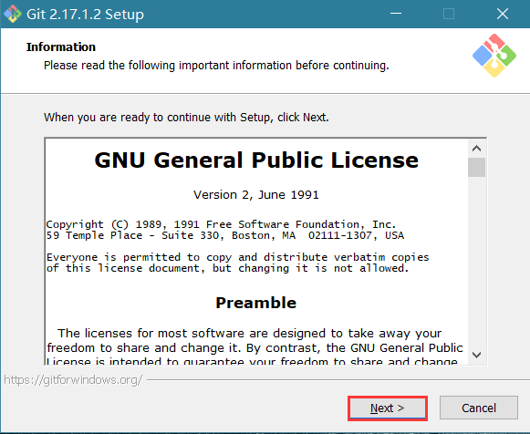

在使用Git前我们需要先安装 Git。Git 目前支持 Linux/Unix、Solaris、Mac 和 Windows 平台上运行。

Git 各平台安装包下载地址为：<http://git-scm.com/downloads>


## Linux 平台安装

Git 的工作需要调用 curl，zlib，openssl，expat，libiconv 等库的代码，所以需要先安装这些依赖工具。

各 Linux 系统可以使用其安装包管理工具（apt-get、yum 等）进行安装：

### Debian/Ubuntu

如果你使用的系统是 Debian/Ubuntu， Git 安装命令为：

```shell
$ apt-get install libcurl4-gnutls-dev libexpat1-dev gettext libz-dev libssl-dev
$ apt-get install git
$ git --version
git version 1.8.1.2
```

### Centos/RedHat

如果你使用的系统是 Centos/RedHat， Git 安装命令为：

```shell
$ yum install curl-devel expat-devel gettext-devel openssl-devel zlib-devel
$ yum -y install git-core
$ git --version
git version 1.7.1
```

### 源码安装

我们也可以在官网下载源码包来安装，最新源码包下载地址：<https://git-scm.com/download>

安装指定系统的依赖包：

```shell
########## Centos/RedHat ##########
$ yum install curl-devel expat-devel gettext-devel openssl-devel zlib-devel

########## Debian/Ubuntu ##########
$ apt-get install libcurl4-gnutls-dev libexpat1-dev gettext libz-dev libssl-dev
```

解压安装下载的源码包：

```shell
$ tar -zxf git-1.7.2.2.tar.gz
$ cd git-1.7.2.2
$ make prefix=/usr/local all
$ sudo make prefix=/usr/local install
```

## Windows 平台安装

在 Windows 平台上安装 Git 同样轻松，有个叫做 msysGit 的项目提供了安装包，可以到 GitHub 的页面上下载 exe 安装文件并运行：

安装包下载地址：<https://git-scm.com/download/win>

官网慢，可以用国内的镜像：<https://npm.taobao.org/mirrors/git-for-windows/>



一直默认下一步，直到安装完成。

完成安装之后，就可以使用命令行的 git 工具（已经自带了 ssh 客户端）了，另外还有一个图形界面的 Git 项目管理工具。

在开始菜单里找到"Git"->"Git Bash"，会弹出 Git 命令窗口，你可以在该窗口进行 Git 操作。

## Mac 平台上安装

在 Mac 平台上安装 Git 最容易的当属使用图形化的 Git 安装工具，下载地址为：

<https://sourceforge.net/projects/git-osx-installer/>

安装界面如下所示：


当然，你也可以其他方法安装。

<https://git-scm.com/download/mac>
