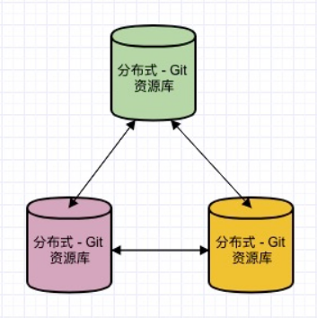

## Git 是什么

Git 是一个开源的分布式版本控制系统，用于敏捷高效地处理任何或小或大的项目。

Git 是 Linus Torvalds 为了帮助管理 Linux 内核开发而开发的一个开放源码的版本控制软件。

Git 与常用的版本控制工具 CVS，Subversion 等不同，它采用了分布式版本库的方式，不必服务器端软件支持。

Git 不仅仅是个版本控制系统，它也是个内容管理系统（CMS），工作管理系统等。

## Git 的诞生

很多人都知道，Linus Torvalds 在 1991 年创建了开源的 Linux，从此，Linux 系统不断发展，已经成为最大的服务器系统软件了。

Linus Torvalds 虽然创建了 Linux，但 Linux 的壮大是靠全世界热心的志愿者参与的，这么多人在世界各地为 Linux 编写代码，那 Linux 的代码是如何管理的呢？

事实是，在 2002 年以前，世界各地的志愿者把源代码文件通过 diff 的方式发给 Linus Torvalds，然后由 Linus Torvalds 本人通过手工方式合并代码！

你也许会想，为什么 Linus Torvalds 不把 Linux 代码放到版本控制系统里呢？不是有 CVS、SVN 这些免费的版本控制系统吗？因为Linus Torvalds坚定地反对 CVS 和 SVN，这些集中式的版本控制系统不但速度慢，而且必须联网才能使用。有一些商用的版本控制系统，虽然比 CVS、SVN 好用，但那是付费的，和 Linux 的开源精神不符。

不过，到了 2002 年，Linux 系统已经发展了十年了，代码库之大让 Linus Torvalds 很难继续通过手工方式管理了，社区的弟兄们也对这种方式表达了强烈不满，于是 Linus Torvalds 选择了一个商业的版本控制系统 BitKeeper，BitKeeper 的东家BitMover 公司出于人道主义精神，授权 Linux 社区免费使用这个版本控制系统。

安定团结的大好局面在 2005 年就被打破了，原因是 Linux 社区牛人聚集，不免沾染了一些梁山好汉的江湖习气。开发 Samba 的 Andrew 试图破解 BitKeeper 的协议（这么干的其实也不只他一个），被 BitMover 公司发现了（监控工作做得不错！），于是 BitMover 公司怒了，要收回 Linux 社区的免费使用权。

Linus Torvalds 可以向 BitMover 公司道个歉，保证以后严格管教弟兄们，嗯，这是不可能的。实际情况是这样的：

Linus Torvalds 花了两周时间自己用 C 写了一个分布式版本控制系统，这就是 Git！一个月之内，Linux 系统的源码已经由 Git 管理了！牛是怎么定义的呢？大家可以体会一下。

Git 迅速成为最流行的分布式版本控制系统，尤其是 2008 年，GitHub 网站上线了，它为开源项目免费提供 Git 存储，无数开源项目开始迁移至 GitHub，包括 jQuery，PHP，Ruby 等等。

历史就是这么偶然，如果不是当年 BitMover 公司威胁 Linux 社区，可能现在我们就没有免费而超级好用的 Git 了。

## Gitub 是什么

GitHub 是一个面向开源及私有软件项目的托管平台，因为只支持 Git 作为唯一的版本库格式进行托管，故名 GitHub。

GitHub 于 2008 年 4 月 10 日正式上线，除了 Git 代码仓库托管及基本的 Web 管理界面以外，还提供了订阅、讨论组、文本渲染、在线文件编辑器、协作图谱（报表）、代码片段分享（Gist）等功能。目前，其注册用户已经超过 350 万，托管版本数量也是非常之多，其中不乏知名开源项目 Ruby on Rails、jQuery、python 等。
2018 年 6 月 4 日，微软宣布，通过 75 亿美元的股票交易收购代码托管平台 GitHub。

::: tip 了解

GitHub 使用 git 分布式版本控制系统，而 git 最初是 LinusTorvalds 为帮助 Linux 开发而创造的，它针对的是 Linux 平台，因此 git 和 Windows 从来不是最好的朋友，因为它一点也不像 Windows。GitHub 发布了 GitHub for Windows，为 Windows 平台开发者提供了一个易于使用的 Git 图形客户端。
GitHub for Windows 是一个 Metro 风格应用程序，集成了自包含版本的 Git，bash 命令行 shell，PowerShell 的 posh-git 扩展。GitHub 为 Windows 用户提供了一个基本的图形前端去处理大部分常用版本控制任务，可以创建版本库，向本地版本库递交补丁，在本地和远程版本库之间同步。微软也通过 CodePlex 向开发者提供 git 版本控制系统，而 GitHub 创造了一个更具有吸引力的 Windows 版本。

:::