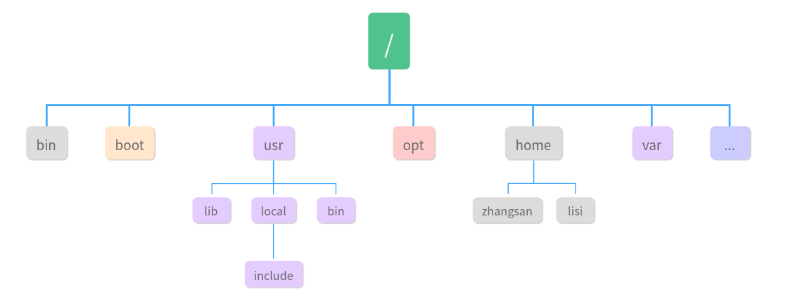

## 目录结构

学习 Linux，不仅限于学习各种命令，了解整个 Linux 文件系统的目录结构以及各个目录的功能同样至关重要。

使用 Linux 时，通过命令行输入 `ls -l /` 可以看到，在 Linux 根目录 `/` 下包含很多的子目录（称为一级目录），例如 `bin`、`boot`、`usr` 等。同时，各一级目录下还含有很多子目录（称为二级目录），比如 `/usr/bin`、`/usr/lib` 等。Linux 文件系统目录总体呈现树形结构，`/` 根目录就相当于树根。如图3-1 所示。

::: center



**图3-1	<u>Linux 系统目录结构示意图</u>**

:::

由于 Linux 系统免费开源，使得 Linux 发行版本有很多，利用 Linux 开发产品的团队也有很多，如果任由每个人都按照自己的想法来配置 Linux 系统文件目录，后期可能会产生诸多的管理问题。试想，如果您进入一家公司，所用 Linux 系统的文件目录结构与所学的完全不同，实在令人头疼。

为了避免诸多使用者对 Linux 系统目录结构天马行空，Linux 基金会发布了 FHS 标准。多数 Linux 发行版系统都遵循这一标准。

::: tip

FHS（Filesystem Hierarchy Standard），文件系统层次化标准，该标准规定了 Linux 系统中所有一级目录以及部分二级目录（`/usr` 和 `/var`）的用途。发布此标准的主要目的就是为了让用户清楚地了解每个目录应该存放什么类型的文件。

:::

###  / 根目录

FHS 认为，Linux 系统的根目录 `/`  最为重要（没有之一），其原因有以下 2 点：

- 所有目录都是由根目录衍生出来的；
- 根目录与系统的开机、修复、还原密切相关；

因此，根目录必须包含开机软件、核心文件、开机所需程序、函数库、修复系统程序等文件。常见的一级目录如表3-1 所示。

**表3-1	<u>常见一级目录及作用</u>**

| 一级目录 | 功能（作用）                                                 |
| -------- | ------------------------------------------------------------ |
| /bin/    | 存放系统命令，普通用户和 root 都可以执行。放在 `/bin` 下的命令在单用户模式下也可以执行。 |
| /boot/   | 系统启动目录，保存与系统启动相关的文件，如内核文件和启动引导程序（grub）文件等。 |
| /dev/    | 设备文件保存位置。                                           |
| /etc/    | 配置文件保存位置。系统内所有采用默认安装方式的服务配置文件全部保存在此目录中。<br />如用户信息、服务的启动脚本、常用服务的配置文件等。 |
| /home/   | 普通用户的主目录（也称为家目录）。<br />在创建用户时，每个用户要有一个默认登录和保存自己数据的位置，就是用户的主目录，<br />所有普通用户的主目录是在 `/home/` 下建立一个和用户名相同的目录。 |
| /lib/    | 系统调用的函数库保存位置。                                   |
| /media/  | 挂载目录。系统建议用来挂载媒体设备，如软盘和光盘。           |
| /mnt/    | 挂载目录。早期 Linux 中只有这一个挂载目录，并没有细分。<br />系统建议这个目录用来挂载额外的设备，如 U盘、移动硬盘和其他操作系统的分区。 |
| /misc/   | 挂载目录。系统建议用来挂载 NFS 服务的共享目录。<br />虽然系统准备了三个默认挂载目录 `/media/`、`/mnt/`、`/misc/`，<br />但是到底在哪个目录中挂载什么设备可以由管理员自己决定。 |
| /opt/    | 第三方安装的软件保存位置。<br />这个目录是放置和安装其他软件的位置，手工安装的源码包软件都可以安装到这个目录中。<br />也有人习惯把软件放到 `/usr/local/` 目录中，也就是说，`/usr/local/` 目录也可以用来安装软件。 |
| /root/   | root 的主目录。普通用户主目录在 `/home/` 下，root 主目录直接在 `/` 下。 |
| /sbin/   | 保存与系统环境设置相关的命令，只有 root 可以使用这些命令进行系统环境设置，<br />但也有些命令可以允许普通用户查看。 |
| /srv/    | 服务数据目录。一些系统服务启动之后，可以在这个目录中保存所需要的数据。 |
| /tmp/    | 临时目录。系统存放临时文件的目录，在该目录下，所有用户都可以访问和写入。<br />此目录中不能保存重要数据，最好每次开机都把该目录清空。 |
| /var/    | 用于存储动态数据，例如缓存、日志文件、软件运行过程中产生的文件等。 |

FHS 针对根目录中包含的子目录仅限于上表，但除此之外，Linux 系统根目录下通常还包含表3-2 中的几个一级目录。

**表3-2	<u>特殊一级目录及作用</u>**

| 一级目录     | 功能（作用）                                                 |
| ------------ | ------------------------------------------------------------ |
| /lost+found/ | 当系统意外崩溃或意外关机时，产生的一些文件碎片会存放在这里。<br />在系统启动的过程中，`fsck` 工具会检查这里，并修复已经损坏的文件系统。<br />这个目录只在每个分区中出现，例如，`/lost+found` 就是根分区的备份恢复目录，`/boot/lost+found` 就是 `/boot` 分区的备份恢复目录。 |
| /proc/       | 虚拟文件系统。该目录中的数据并不保存在硬盘上，而是保存到内存中。主要保存系统的内核、进程、外部设备状态和网络状态等。<br />如 `/proc/cpuinfo` 是保存 CPU 信息的，`/proc/devices` 是保存设备驱动的列表的，`/proc/filesystems` 是保存文件系统列表的，`/proc/net` 是保存网络协议信息的...... |
| /sys/        | 虚拟文件系统。<br />和 `/proc/` 目录相似，该目录中的数据都保存在内存中，主要保存与内核相关的信息。 |

### /usr 目录

usr（注意不是 user），全称为 Unix Software Resource，此目录用于存储系统软件资源。FHS 建议所有开发者，应把软件产品的数据合理的放置在 `/usr` 目录下的各子目录中，而不是为他们的产品创建单独的目录。

Linux 系统中，所有系统默认的软件都存储在 `/usr` 目录下，`/usr` 目录类似 Windows 系统中 `C:\Windows\` + `C:\Program files\` 两个目录的综合体。

FHS 建议，`/usr` 目录应具备表3-3 所示的子目录。

**表3-3	<u>常见二级 /usr 目录及作用</u>**

| 二级目录     | 功能（作用）                                                 |
| ------------ | ------------------------------------------------------------ |
| /usr/bin/    | 存放系统命令，普通用户和超级用户都可以执行。<br />这些命令和系统启动无关，在单用户模式下不能执行。 |
| /usr/sbin/   | 存放根文件系统不必要的系统管理命令，如多数服务程序，只有 root 可以使用。 |
| /usr/lib/    | 应用程序调用的函数库保存位置。                               |
| /usr/XllR6/  | 图形界面系统保存位置。                                       |
| /usr/local/  | 手工安装的软件保存位置。我们一般建议源码包软件安装在这个位置。 |
| /usr/share/  | 应用程序的资源文件保存位置，如帮助文档、说明文档和字体目录。 |
| /usr/src/    | 源码包保存位置。我们手工下载的源码包和内核源码包都可以保存到这里。<br />不过笔者更习惯把手工下载的源码包保存到 `/usr/local/src/` 目录中，<br />把内核源码保存到 `/usr/src/linux/` 目录中。 |
| /usr/include | C/C++ 等编程语言头文件的放置目录。                           |

### /var 目录

`/var` 目录用于存储动态数据，例如缓存、日志文件、软件运行过程中产生的文件等。通常，此目录下建议包含如表3-4 所示的这些子目录。

**表3-4	<u>常见二级目录 /var 及作用</u>**

| 二级目录               | 功能（作用）                                                 |
| ---------------------- | ------------------------------------------------------------ |
| /var/lib/              | 程序运行中需要调用或改变的数据保存位置。<br />如 MySQL 的数据库保存在 `/var/lib/mysql/` 目录中 |
| /var/log/              | 登陆文件放置的目录，其中所包含比较重要的文件如 `/var/log/messages`, `/var/log/wtmp` 等。 |
| /var/run/              | 一些服务和程序运行后，它们的 PID（进程 ID）保存位置          |
| /var/spool/            | 里面主要都是一些临时存放，随时会被用户所调用的数据，<br />例如 `/var/spool/mail/` 存放新收到的邮件，`/var/spool/cron/` 存放系统定时任务。 |
| /var/www/              | RPM 包安装的 Apache 的网页主目录                             |
| /var/nis <br />/var/yp | NIS 服务机制所使用的目录，nis 主要记录所有网络中每一个 client 的连接信息；<br />yp 是 linux 的 nis 服务的日志文件存放的目录。 |
| /var/tmp               | 一些应用程序在安装或执行时，需要在重启后使用的某些文件，<br />此目录能将该类文件暂时存放起来，完成后再行删除 |

根据以上各表列举的各目录及作用，如果我们要做一些实验和练习，需要创建一些临时文件，应该保存在哪里呢？

答案是用户的主目录或 `/tmp/` 临时目录。但是要小心有些目录中不能直接修改和保存数据，比如 `/proc/fn/sys/` 目录，因为它们是保存在内存中的，如果在这里写入数据，那么您的内存会越来越小，直至死机；`/boot/` 目录也不能保存额外数据，因为 `/boot/` 目录会单独分区作为启动分区，如果没有空闲空间，则会导致系统不能正常启动。

总之，Linux 要在合理的目录下进行操作和修改。

::: warning

目录名或文件名都是区分大小写的，如 dog、DOG 和 Dog 为 3 个不同的目录或文件。完整的目录或文件路径是由一连串的目录名所组成的，其中每一个目录由 `/` 来分隔。如 cat 的完整路径是 `/home/cat`。

:::

### 硬件设备名称

**表3-5	<u>常见硬件设备及命名</u>**

| 硬件设备      | 文件名称                                                     |
| ------------- | ------------------------------------------------------------ |
| IDE 设备      | `/dev/hd[a-d]`，现在的 IDE 设备已经很少见了，因此一般的硬盘设备会以 `/dev/sd` 开头。 |
| SCSI/SATA/U盘 | `/dev/sd[a-p]`，一台主机可以有多块硬盘，因此系统采用 a~p 代表 16 块不同的硬盘。 |
| 软驱          | `/dev/fd[0-1]`                                               |
| 打印机        | `/dev/lp[0-15]`                                              |
| 光驱          | `/dev/cdrom`                                                 |
| 鼠标          | `/dev/mouse`                                                 |
| 磁带机        | `/dev/st0` 或 `/dev/ht0`                                     |


## 文件系统

目录就相当于 Windows 中的文件夹，目录中存放的既可以是文件，也可以是其他的子目录，而文件中存储的是真正的信息。

文件系统的最顶层是由根目录开始的，系统使用“`/`”来表示根目录，在根目录之下的既可以是目录，也可以是文件，而每一个目录中又可以包含（子）目录或文件。如此反复就可以构成一个庞大的文件系统。
其实，使用这种树状、具有层次的文件结构主要目的是方便文件系统的管理和维护，想象一下，如果所有的文件都放在一个目录下，其文件系统的管理和维护将变成一场噩梦。

现实中也有许多类似的例子，例如在整个行政管理体制中，村民就相当于文件，他们住在一个村庄中，村庄就是存储村民的目录。许多村又组成了个乡，这个乡就相当于存储村的目录，依此类推，最终就构建出了一个庞大的行政区域管理结构图。

注意，目录名或文件名都是区分大小写的，如 dog、DOG 和 Dog 为 3 个不同的目录或文件。完整的目录或文件路径是由一连串的目录名所组成的，其中每一个目录由“`/`”来分隔。如 cat 的完整路径是 `/home/cat`。

在文件系统中，有两个特殊的目录，一个是用户所在的工作目录，即当前目录，可用一个点“`.`”表示；另一个是当前目录的上一层目录，也叫父目录，用两个点“`..`”表示。

如果一个目录或文件名是以一个点开始，就表示这个目录或文件是一个隐藏目录或文件。即以默认方式査找（后续会讲查找命令）时，不显示该目录或文件。

为了方便管理和维护，Linux 系统采用了文件系统层次标准，也称为 FHS 标准，它规定了根目录下各个目录应该存在哪些类型的文件（或子目录），比如说，在 `/bin` 和 `/sbin` 目录中存放的应该是可执行文件，有关各个目录存放文件的类型，前面已经稍微作了介绍，这里不再过多赘述。

### 文件

虽然从名称上不容易分辨，但是可以从颜色上进行区分。一般情况下，Linux 用蓝色代表目录，其他颜色则表示是文件。

和 Linux 不同，Windows 下带有 `<DIR>` 标记的行或使用中括号 `[ ]` 括起来的名称就是目录，其他的则是文件。

不仅如此，Linux 中还可以用不同的颜色来区分不同种类的文件，例如绿色代表可执行文件、红色代表压缩文件、浅绿色代表链接文件、白色代表其他文件、黄色代表设备文件等。

但是，不同颜色所代表的文件类型不一定是这样，更准确的对应方式还取决于配置文件 `/etc/DIR_COLORS` 中的规定。因此，如果想详细了解不同文件类型所对应的颜色，可以使用 `man` 命令，例如:

```shell-session
[root@localhost ~]# man dir_colors
```

注意，有些 Linux 发行版单独使用 `ls` 命令，无法显示出带有不同颜色的文件和目录，此时就需要使用 `ls --color=auto` 命令，明确令其使用颜色来区分文件类型。

在此基础上，如果不想每次使用 `ls` 命令时，都显式附带 `--color=auto`，可以执行如下命令:

```shell-session
[root@localhost ~]# alias ls = 'ls --color=auto'
```

通过给 `ls --color==auto` 这个整体设置一个别名 `ls`，这样当后续使用 `ls` 命令时，就等同于执行 `ls --color=auto` 命令。

同时，如果想使这个设置永远生效，还需要将其添加到 `/etc/bashrc` 或 `/home/<user>/.bashrc` 文件中，前者对所有用户有效，而后者仅对用户 `<user>` 有效。

其实，那些默认提供颜色功能的 Linux 发行版，也是通过这个方法开启的功能。

当然，通过颜色来区分文件类型，难免有些牵强，对于颜色不太敏感的读者来说，很容易搞错。Linux 中精确判断文件类型的方法，是通过文件本身所具有的属性进行判断。

通过 `ls -l` 命令，我们就可以查看当前目录下所有文件和目录各自的属性

例如：

```shell
[root@localhost ~]# ls -l
总用量 620
-rwxrw-r--    1 root root    493 4月  27 14:29 deploy.sh
drwxr-xr-x   16 root root   4096 5月   4 16:52 dist
drwxr-xr-x    7 root root   4096 5月   4 09:10 docs
drwxr-xr-x 1002 root root  36864 5月   4 09:16 node_modules
-rw-r--r--    1 root root    386 5月   4 08:16 package.json
-rw-r--r--    1 root root 577009 5月   4 08:17 package-lock.json
```


### 命名规则

- 除了字符“/”之外，所有的字符都可以使用，但是要注意，在目录名或文件名中，使用某些特殊字符并不是明智之举。例如，在命名时应避免使用 `<`、`>`、`?`、`*` 和`非打印字符`等。如果一个文件名中包含了特殊字符，例如空格，那么在访问这个文件时就需要使用引号将文件名括起来。
- 目录名或文件名的长度不能超过 255 个字符。
- 目录名或文件名是区分大小写的。如 DOG、dog、Dog 和 DOg ，是互不相同的目录名或文件名，但使用字符大小写来区分不同的文件或目录，也是不明智的。

### 不同字符对应的文件类型

**表3-6	<u>常见的文件类型</u>**

| 第一个字符 | 文件类型                                                     |
| ---------- | ------------------------------------------------------------ |
| -          | 普通文件，包括纯文本文件、二进制文件、各种压缩文件等。       |
| d          | 目录，类似 Windows 系统中的文件夹。                          |
| b          | 块设备文件，就是保存大块数据的设备，比如最常见的硬盘。       |
| c          | 字符设备文件，例如键盘、鼠标等。                             |
| s          | 套接字文件，通常用在网络数据连接，<br />可以启动一个程序开监听用户的要求，用户可以通过套接字进行数据通信。 |
| p          | 管道文件，其主要作用是解决多个程序同时存取一个文件所造成的错误。 |
| l          | 链接文件，类似 Windows 系统中的快捷方式。                    |


## Linux 挂载

前面讲过，Linux 系统中“一切皆文件”，所有文件都放置在以根目录为树根的树形目录结构中。在 Linux 看来，任何硬件设备也都是文件，它们各有自己的一套文件系统（文件目录结构）。

因此产生的问题是，当在 Linux 系统中使用这些硬件设备时，只有将 Linux 本身的文件目录与硬件设备的文件目录合二为一，硬件设备才能为我们所用。合二为一的过程称为“挂载”。

如果不挂载，通过 Linux 系统中的图形界面系统可以查看找到硬件设备，但命令行方式无法找到。

挂载，指的就是将设备文件中的顶级目录连接到 Linux 根目录下的某一目录（最好是空目录），访问此目录就等同于访问设备文件。

纠正一个误区，并不是根目录下任何一个目录都可以作为挂载点，由于挂载操作会使得原有目录中文件被隐藏，因此根目录以及系统原有目录都不要作为挂载点，会造成系统异常甚至崩溃，挂载点最好是新建的空目录。

举个例子，我们想通过命令行访问某个 U盘中的数据，我们要在根目录下新建一个目录 `/sdb-u`，通过挂载命令将 U盘文件系统挂载到此目录，前面讲过，根目录下的 `/dev/` 目录文件负责所有的硬件设备文件，事实上，当 U盘插入 Linux 后，系统也确实会给 U盘分配一个目录文件（比如 sdb1），就位于 `/dev/` 目录下 （`/dev/sdb1`），但无法通过 `/dev/sdb1/` 直接访问 U 盘数据，访问此目录只会提供给您此设备的一些基本信息（比如容量）。

总之，Linux 系统使用任何硬件设备，都必须将设备文件与已有目录文件进行挂载。
