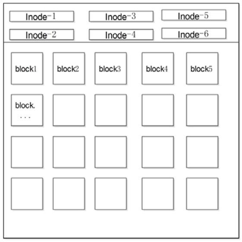
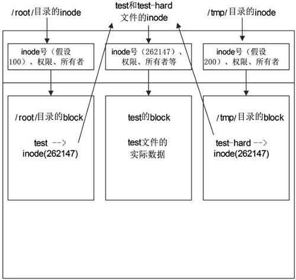
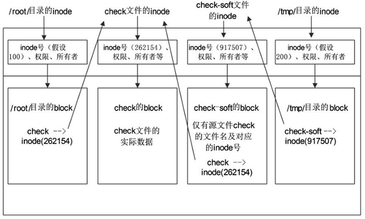

## 命令的基本格式

### 命令提示符

登录系统后，第一眼看到的内容是：

```shell
[root@localhost ~]#
```

这就是 Linux 系统的命令提示符。那么，这个提示符的含义是什么呢？

- `[]`：这是提示符的分隔符号，没有特殊含义。
- `root`：显示的是当前的登录用户，笔者现在使用的是 root 用户登录。
- `@`：分隔符号，没有特殊含义。
- `localhost`：当前系统的简写主机名（完整主机名是 `localhost.localdomain`）。
- `~`：代表用户当前所在的目录，此例中用户当前所在的目录是家目录。
- `#`：命令提示符，Linux 用这个符号标识登录的用户权限等级。如果是超级用户，提示符就是 `#`；如果是普通用户，提示符就是 `$`。

家目录（又称主目录）是什么？ Linux 系统是纯字符界面，用户登录后，要有一个初始登录的位置，这个初始登录位置就称为用户的家：

- 超级用户的家目录： `/root`
- 普通用户的家目录： `/home/<user>`

用户在自己的家目录中拥有完整权限，所以我们也建议操作实验可以放在家目录中进行。我们切换一下用户所在目录，看看有什么效果。

```shell
[root@localhost ~]# cd /usr/local
[root@localhost local]#
```

仔细看，如果切换用户所在目录，那么命令提示符中的会变成用户当前所在目录的最后一个目录（不显示完整的所在目录 `/usr/local`，只显示最后一个目录 `local`）。

### 命令的基本格式

接下来看看 Linux 命令的基本格式：

```shell
[root@localhost ~]# 命令 [选项] [参数]
```

命令格式中的 `[]` 代表可选项，也就是有些命令可以不写选项或参数，也能执行。那么，我们就用 Linux 中最常见的 `ls` 命令来解释一下命令的格式（有关 `ls` 命令的具体用法，后续章节会详细介绍）。如果按照命令的分类，那么 `ls` 命令应该属于目录操作命令。

```shell
[root@localhost ~]# ls
anaconda-ks.cfg	install.log	install.log.syslog
```

### 选项的作用

选项的作用是调整命令功能。如果没有选项，那么命令只能执行最基本的功能；而一旦有选项，则可以显示更加丰富的数据。

Linux 的选项又分为短格式选项（`-l`）和长格式选项（`--all`）。短格式选项是英文的简写，用一个减号调用，例如：

```shell
[root@localhost ~]# ls -l
```

而长格式选项是英文完整单词，一般用两个减号调用，例如：

```shell
[root@localhost ~]# ls --all
```

一般情况下，短格式选项是长格式选项的缩写，也就是一个短格式选项会有对应的长格式选项。当然也有例外，比如 `ls` 命令的短格式选项 -l 就没有对应的长格式选项。所以具体的命令选项可以通过后面我们要学习的帮助命令来进行査询。

### 参数的作用

参数是命令的操作对象，一般文件、目录、用户和进程等可以作为参数被命令操作。例如：

```shell
[root@localhost ~]# ls -l anaconda-ks.cfg
-rw------- 1 root root 1207 1 月 14 18:18 anaconda-ks.cfg
```

但是为什么一开始 `ls` 命令可以省略参数？ 那是因为有默认参数。命令一般都需要加入参数，用于指定命令操作的对象是谁。如果可以省略参数，则一般都有默认参数。例如：

```shell
[root@localhost ~]# ls
anaconda-ks.cfg install.log install.log.syslog
```

这个 `ls` 命令后面没有指定参数，默认参数是当前所在位置，所以会显示当前目录下的文件名。

::: tip 总结

**命令的选项用于调整命令功能，而命令的参数是这个命令的操作对象。**

:::

## 目录操作命令

### ls 命令

<u>`ls` 命令，是最常见的目录操作命令，其主要功能是显示当前目录下的内容。</u>

英文原意：list directory contents

命令格式如下：

```shell
[root@localhost ~]# ls [选项] [文件名或目录名]
选项 ：
	-a	：显示全部的文件，包括隐藏文件（开头为 . 的文件）也一起罗列出来，这是最常用的选项之一。
	-A	：显示全部的文件，连同隐藏文件，但不包括 . 与 .. 这两个目录。
	-d	：仅列出目录本身，而不是列出目录内的文件数据。 
	-h	：以人们易读的方式显示文件或目录大小，如 1KB、234MB、2GB 等。
	-i	：显示 inode 节点信息。
	-l	：使用长格式列出文件和目录信息。
	-r	：将排序结果反向输出，比如，若原本文件名由小到大，反向则为由大到小。
	-R	：连同子目录内容一起列出来，等于将该目录下的所有文件都显示出来。
	-S	：以文件容量大小排序，而不是以文件名排序。
	-t	：以时间排序，而不是以文件名排序。
	--color=auto	：auto表示让系统自行依据配置来判断是否给予颜色。
```

::: tip

当 `ls` 命令不使用任何选项时，默认只会显示非隐藏文件的名称，并以文件名进行排序，同时会根据文件的具体类型给文件名配色（蓝色显示目录，白色显示一般文件）。

```shell
[root@localhost ~]# ls -l
-rw-------.   1 root root     1423 3月  23 01:54 anaconda-ks.cfg
```

`ls` 命令使用了“-l”选项，显示出文件的详细信息，此选项显示的这 7 列的含义分别是：

> - 第一列：规定了不同的用户对文件所拥有的权限，具体权限的含义将在后续章节中讲解。
> - 第二列：引用计数，文件的引用计数代表该文件的硬链接个数，而目录的引用计数代表该目录有多少个一级子目录。
> - 第三列：所有者，也就是这个文件属于哪个用户。默认所有者是文件的建立用户。
> - 第四列：所属组，默认所属组是文件建立用户的有效组，一般情况下就是建立用户的所在组。
> - 第五列：大小，默认单位是字节。
> - 第六列：文件修改时间，文件状态修改时间或文件数据修改时间都会更改这个时间，注意这个时间不是文件的创建时间。
> - 第七列：文件名或目录名。

:::

### cd 命令

<u>`cd` 命令，用来切换工作目录。</u>

英文原意：Change Directory

Linux 命令按照来源方式，可分为两种，分别是 Shell 内置命令和外部命令。所谓 Shell 内置命令，就是 Shell 自带的命令，这些命令是没有执行文件的；而外部命令就是由程序员单独开发的，所以会有命令的执行文件。Linux 中的绝大多数命令是外部命令，而 `cd` 命令是一个典型的 Shell 内置命令，所以 `cd` 命令没有执行文件所在路径。

命令格式如下：

```shell
[root@localhost ~]# cd [相对路径或绝对路径]
```

除此之外，`cd` 命令后面可以跟一些特殊符号，表达固定的含义。如表4-1 所示。

**表4-1	<u>特殊符号的含义</u>**

| 特殊符号  | 作 用                      |
| --------- | -------------------------- |
| `~`       | 代表当前登录用户的主目录   |
| `~<user>` | 表示切换至指定用户的主目录 |
| `-`       | 代表上次所在目录           |
| `.`       | 代表当前目录               |
| `..`      | 代表上级目录               |

::: tip

在 Linux 系统中，根目录确实存在 `.`（当前目录）以及 `..`（当前目录的父目录）两个目录，但由于根目录是最顶级目录，因此根目录的 `..` 和 `.` 的属性和权限完全一致，也就是说，根目录的父目录是自身。

:::

### mkdir 命令

<u>`mkdir` 命令，用于创建新目录。</u>

英文原意：make directories

命令格式如下：

```shell
[root@localhost ~]# mkdir [选项] 目录名
选项：
	-m	：用于手动配置所创建目录的权限，而不再使用默认权限。
	-p	：递归创建所有目录。

#以创建 /home/test/demo 为例，在默认情况下，您需要一层一层的创建各个目录，而使用 -p 选项，则系统会自动帮您创建 home、/home/test 以及 home/test/demo。
```

### rmdir 命令

<u>`rmdir` 命令，命令用于**删除空目录**，和 `mkdir` 命令相反。</u>

英文原意：remove empty directories

命令格式如下：

```shell
[root@localhost ~]# rmdir [选项] 目录名
选项：
	-p	：选项用于递归删除空目录。
```

::: tip

**`rmdir` 命令的作用十分有限，因为只能刪除空目录，所以一旦目录中有内容，就会报错。**

:::

### pwd 命令

<u>`pwd` 命令，功能是显示用户当前所处的工作目录。</u>

英文原意：Print Working Directory

由于 Linux 文件系统中有许多目录，当用户执行一条 Linux 命令又没有指定该命令或参数所在的目录时，Linux 系统就会首先在当前目录搜寻这个命令或它的参数。因此，用户在执行命令之前，常常需要确定目前所在的工作目录，即当前目录。

当用户登陆 Linux 系统之后，其当前目录就是它的主目录。那么，如何确定当前目录呢？可以使用 Linux 系统的 `pwd` 命令来显示当前目录的绝对路径。

命令格如下：

```shell
[root@localhost ~]# pwd
```

### tree 命令

`tree` 命令，用于以树状图列出目录的内容。

英文原意：list contents of directories in a tree-like format

执行 `tree` 命令，它会列出指定目录下的所有文件，包括子目录里的文件。

命令格如下：

```shell
[root@localhost ~]# tree 目录名
```

用法比较单一，就是显示目录树。

```shell
# 例子：
[root@localhost ~]# tree ./share/
./share/
├── doc
│   └── node
│       ├── gdbinit
│       └── lldb_commands.py
├── man
│   └── man1
│       └── node.1
└── systemtap
    └── tapset
        └── node.stp

6 directories, 4 files
[root@localhost ~]# 
```

## 文件操作命令

其实计算机的基本操作大多数可以归纳为“增删改查”四个字，文件操作也不例外。只是修改文件数据需要使用文件编辑器，如 `vim`、`nano` 等。而编辑器操作不是一句两句就可以说明白的，所以暂且不说。

### touch 命令

`touch` 命令，如果文件不存在，则会建立空文件；如果文件已经存在，则会修改文件的时间戳（访问时间、数据修改时间、状态修改时间都会改变)。千万不要把 `touch` 命令当成新建文件的命令，牢牢记住这是触摸的意思。

英文原意：change file timestamps

命令格式如下：

```shell
[root@localhost ~]# touch [选项] 文件名
选项：
	-a	：只修改文件的访问时间。
	-c	：仅修改文件的时间参数（3 个时间参数都改变），如果文件不存在，则不建立新文件。
	-d	：后面可以跟欲修订的日期，而不用当前的日期，即把文件的 atime 和 mtime 时间改为指定的时间。
	-m	：只修改文件的数据修改时间。
	-t	：命令后面可以跟欲修订的时间，而不用目前的时间，时间书写格式为 YYMMDDhhmm。
```

`touch` 命令可以只修改文件的访问时间，也可以只修改文件的数据修改时间，但是不能只修改文件的状态修改时间。因为，不论是修改访问时间，还是修改文件的数据时间，对文件来讲，状态都会发生改变，即状态修改时间会随之改变（更新为操作当前文件的真正时间）。

::: tip 说明

Linux 系统中，文件没有创建时间，文件主要拥有 3 个时间参数（通过 `stat` 命令进行查看），分别是文件的访问时间、数据修改时间以及状态修改时间：

> - 访问时间 （Access Time，简称 atime）：只要文件的内容被读取，访问时间就会更新。例如，使用 `cat` 命令可以查看文件的内容，此时文件的访问时间就会发生改变。
> - 数据修改时间 （Modify Time，简称 mtime）：当文件的内容数据发生改变，此文件的数据修改时间就会跟着相应改变。
> - 状态修改时间 （Change Time，简称 ctime）：当文件的状态发生变化，就会相应改变这个时间。比如说，如果文件的权限或者属性发生改变，此时间就会相应改变。

:::

### stat 命令

`stat` 命令，用于显示文件的状态信息。以文字的格式来显示 inode 的内容。

英文原意：display file or file system status

命令格式如下：

```shell
[root@localhost ~]# stat [选项] 文件或目录
选项：
	-f	：显示文件系统状态而非文件状态。
	-t	：以简洁方式输出信息。
```

例子：

```shell
[root@localhost ~]# stat anaconda-ks.cfg
  文件："anaconda-ks.cfg"
  大小：1423      	块：8          IO 块：4096   普通文件
设备：fd00h/64768d	Inode：8409167     硬链接：1
权限：(0600/-rw-------)  Uid：(    0/    root)   Gid：(    0/    root)
环境：system_u:object_r:admin_home_t:s0
最近访问：2021-03-23 01:54:45.054000000 -0400
最近更改：2021-03-23 01:54:45.059000000 -0400
最近改动：2021-03-23 01:54:45.059000000 -0400
创建时间：-
```

::: tip

事实上，`stat` 命令显示的是文件的 i节点信息。Linux 文件系统以块为单位存储信息，为了找到某一个文件所在存储空间的位置，用 i节点对每个文件进行索引。所谓的 i节点，是文件系统管理的一个数据结构，是一个 64 字节长的表，包含了描述文件所必要的全部信息，其中包含了文件的大小、类型、存取权限、文件的所有者等等。

:::

### cat 命令

`cat` 命令，用于查看文件内容。不论文件内容有多少，都会一次性显示。

如果文件非常大，那么文件开头的内容就看不到了。不过 Linux 可以使用 <kbd>PgUp</kbd>+<kbd>上箭头</kbd> 向上翻页，但是这种翻页是有极限的，如果文件足够长，那么还是无法看全文件的内容。所以 `cat` 命令适合查看不太大的文件。

英文原意：concatenate files and print on the standard output

命令格式如下：

```shell
[root@localhost ~]# cat [选项] 文件名
选项：
	-n	：由 1 开始对所有输出的行数编号。
	-b	：和 -n 相似，只不过对于空白行不编号。
	-v	：使用 ^ 和 M- 符号，除了 LFD 和 TAB 之外。
	-E	：在每行结束处显示 $。
	-T	：将 TAB 字符显示为 ^I。
	-A	：等价于 -vET。
```

### more 命令

`more` 命令，用于分屏显示文件内容。

如果文件过大，则 `cat` 命令会有心无力，这时 `more` 命令的作用更加明显。

英文原意：file perusal filter for crt viewing

命令格式如下：

```shell
[root@localhost ~]# more 文件名
```

::: tip

more命令比较简单，一般不用什么选项，命令会打开一个交互界面。常用交互命令如下：

> **空格：向下翻页。**
>
> **b键：向上翻页。**
>
> **回车：向下滚一行。**
>
> **/字符串：搜索指定的字符串。**
>
> **q键：退出。**

:::

### less 命令

`less` 命令，用于分行显示文件内容。

和 `more` 命令类似，只是 `more` 是分屏显示命令，而 `less` 是分行显示命令.

英文原意：opposite of more

命令格式如下：

```shell
[root@localhost ~]# less 文件名
```

::: tip

`less` 命令可以使用上、下箭头，用于分行查看文件内容。

:::

### head 命令

`head` 命令，用来显示文件开头内容。

英文原意：output the first part of files

命令格式如下：

```shell
[root@localhost ~]# head [选项] 文件名
选项：
	-n	：行数，从文件头开始，显示指定行数。
	-v	：显示文件名。
```

::: tip

也可以直接使用 `head -行数 文件名` 显示文件开头的行数内容。

```shell
[root@localhost ~]# head -20 anaconda-ks.cfg
#显示文件 anaconda-ks.cfg 的开头前 20 行的内容
```

:::

### tail 命令

`tail` 命令，用来显示文件末尾内容。

既然有显示文件开头的命令，就会有显示文件末尾的命令。`tail` 命令就是显示文件末尾内容的命令。

英文原意：output the last part of files

命令格式如下：

```shell
[root@localhost ~]# tail [选项] 文件名
选项：
	-n	：行数，从文件结尾开始，显示指定行数。
	-f	：监听文件的新增内容。
```

**`tail` 的特殊用法，监听文件的新增内容。**

```shell
# 例子：
[root@localnost ~]# tail -f anaconda-ks.cfg
@server-platform
@server-policy
pax
oddjob
sgpio
certmonger
pam_krb5
krb5-workstation
per1-DBD-SQLite
%end
#光标不会退出文件，而会一直监听在文件的结尾处
```

这条命令会显示文件的最后 10 行内容，而且光标不会退出命令，而会一直监听在文件的结尾处，等待显示新增内容。这时如果向文件中追加一些数据（需要开启一个新终端），那么上面的末尾的 **%<u>end</u>** 后面紧接着会显示追加的内容。退出监听状态，可使用 <kbd>Ctrl</kbd>+<kbd>Z</kbd> 或者  <kbd>Ctrl</kbd>+<kbd>C</kbd> 。

::: tip

也可以直接使用 `tail -行数 文件名` 显示文件末尾的行数内容。

```shell
[root@localhost ~]# tail -20 anaconda-ks.cfg
#显示文件 anaconda-ks.cfg 的末尾的 20 行的内容
```

:::

### ln 命令

如果要想说清楚 `ln` 命令，则必须先解释下 ext 文件系统（ Linux 文件系统）是如何工作的。我们的 Linux 目前使用的是 ext4 文件系统。

#### ext4 文件系统

ext4 文件系统把分区主要分为两大部分（暂时不提超级块）：小部分用于保存文件的 inode（ i节点）信息；剩余的大部分用于保存 block 信息。如图4-1 所示。

::: center



**图4-1	<u>ext4 文件系统示意图</u>**

:::

inode 的默认大小为 128 Byte，用来记录文件的权限（ r、w、x ）、文件的所有者和属组、文件的大小、文件的状态改变时间（ ctime ）、文件的最近一次读取时间（ atime ）、文件的最近一次修改时间（ mtime ）、文件的数据真正保存的 block 编号。每个文件需要占用一个 inode。大家如果仔细查看，就会发现 inode 中是不记录文件名的，那是因为文件名记录在文件所在目录的 block 中。

block 的大小可以是 1KB、2KB、4KB，默认为 4KB。block 用于实际的数据存储，如果一个 block 放不下数据，则可以占用多个 block。例如，有一个 10KB 的文件需要存储，则会占用 3 个 block，虽然最后一个 block 不能占满，但也不能再放入其他文件的数据。这 3 个 block 有可能是连续的，也有可能是分散的。

由此，我们可以知道以下 2 个重要的信息：

1. 每个文件都独自占用一个 inode，文件内容由 inode 的记录来指向；
1. 如果想要读取文件内容，就必须借助目录中记录的文件名找到该文件的 inode，才能成功找到文件内容所在的 block 块；

了解了 Linux 系统底层文件的存储状态后，接下来学习 `ln` 命令。

#### ln 命令用法

`ln` 命令，用于给文件创建链接，根据 Linux 系统存储文件的特点，链接的方式分为以下 2 种：

- 软链接：类似于 Windows 系统中给文件创建快捷方式，即产生一个特殊的文件，该文件用来指向另一个文件，此链接方式同样适用于目录。
- 硬链接：我们知道，文件的基本信息都存储在 inode 中，而硬链接指的就是给一个文件的 inode 分配多个文件名，通过任何一个文件名，都可以找到此文件的 inode，从而读取该文件的数据信息。

英文原意：make links between files

命令格式如下：

```shell
[root@localhost ~]# ln [选项] 源文件 目标文件
选项：
	-s	：建立软链接文件。如果不加 -s 选项，则建立硬链接文件。
	-f	：强制。如果目标文件已经存在，则删除目标文件后再建立链接文件。
```

建立硬链接和软链接非常简单，那这两种链接有什么区别？它们都有什么作用？这才是链接文件最不容易理解的地方，我们分别来讲讲。

#### ln 创建硬链接

我们再来建立一个硬链接文件，然后看看这两个文件的特点。

```shell
[root@localhost ~]# touch test
#建立源文件
[root@localhost ~]# ln /root/test /tmp/test-hard
#给源文件建立硬链接文件 /tmp/test-hard
[root@localhost ~]# ll -i /root/test /tmp/test-hard
262147 -rw-r--r-- 2 root root 0 6月 19 10:06 /root/test
262147 -rw-r--r-- 2 root root 0 6月 19 10:06 /tmp/test-hard
#查看两个文件的详细信息，可以发现这两个文件的 inode 号是一样的，"ll"等同于"ls -l"。
```

这里有一件很奇怪的事情，我们之前在讲 inode 号的时候说过，每个文件的 inode 号都应该是不一样的。inode 号就相当于文件 ID，我们在查找文件的时候，要先查找 inode 号，才能读取到文件的内容。

但是这里源文件和硬链接文件的 inode 号居然是一样的，那我们在查找文件的时候，到底找到的是哪一个文件呢？我们来画一张示意图，如图4-2 所示。

::: center



**图4-2	<u>硬链接示意图</u>**

:::

在 inode 信息中，是不会记录文件名称的，而是把文件名记录在上级目录的 block 中。也就是说，目录的 block 中记录的是这个目录下所有一级子文件和子目录的文件名及 inode 的对应；而文件的 block 中记录的才是文件实际的数据。

当我们查找一个文件，比如 `/root/test` 时，要经过以下步骤:

> - 首先找到根目录的 inode（根目录的 inode 是系统已知的，inode 号是 2），然后判断用户是否有权限访问根目录的 block。
> - 如果有权限，则可以在根目录的 block 中访问到 `/root` 的文件名及对应的 inode 号。
> - 通过 `/root/` 目录的 inode 号，可以查找到 `/root/` 目录的 inode 信息，接着判断用户是否有权限访问 `/root/` 目录的 block。
> - 如果有权限，则可以从 `/root/` 目录的 block 中读取到 test 文件的文件名及对应的 inode 号。
> - 通过 test 文件的 inode 号，就可以找到 test 文件的 inode 信息，接着判断用户是否有权限访问 test 文件的 block。
> - 如果有权限，则可以读取 block 中的数据，这样就完成了 `/root/test` 文件的读取与访问。

按照这个步骤，在给源文件 `/root/test` 建立了硬链接文件 `/tmp/test-hard` 之后，在 `/root/` 目录和 `/tmp/` 目录的 block 中就会建立 test 和 test-hard 的信息，这个信息主要就是文件名和对应的 inode 号。但是我们会发现 test 和 test-hard 的 inode 信息居然是一样的，那么，我们无论访问哪个文件，最终都会访问 inode 号是 262147 的文件信息。

这就是硬链接的原理。**硬链接的特点**如下：

- 不论是修改源文件（test 文件），还是修改硬链接文件（test-hard 文件），另一个文件中的数据都会发生改变。
- 不论是删除源文件，还是删除硬链接文件，只要还有一个文件存在，这个文件（inode 号是 262147 的文件）都可以被访问。
- 硬链接不会建立新的 inode 信息，也不会更改 inode 的总数。
- 硬链接不能跨文件系统（分区）建立，因为在不同的文件系统中，inode 号是重新计算的。
- 硬链接不能链接目录，因为如果给目录建立硬链接，那么不仅目录本身需要重新建立，目录下所有的子文件，包括子目录中的所有子文件都需要建立硬链接，这对当前的 Linux 来讲过于复杂。

硬链接的限制比较多，既不能跨文件系统，也不能链接目录，而且源文件和硬链接文件之间除 inode 号是一样的之外，没有其他明显的特征。这些特征都使得硬链接并不常用，大家有所了解就好。

#### ln 创建软链接

软链接也称作符号链接，相比硬链接来讲，软链接就要常用多了。我们先建立一个软链接，再来看看软链接的特点。

```shell
[root@localhost ~]# touch check
#建立源文件
[root@localhost ~]# ln -s /root/check /tmp/check-soft
#建立软链接文件
[root@localhost ~]# ll -id /root/check /tmp/check-soft
262154 -rw-r--r-- 1 root root 0 6月 19 11:30 /root/check
917507 lrwxrwxrwx 1 root root 11 6月 19 11:31 /tmp/ check-soft -> /root/check
#软链接和源文件的 inode 号不一致，软链接通过 -> 明显地标识出源文件的位置
#在软链接的权限位 lrwxrwxrwx 中，l 就代表软链接文件
```

再强调一下，**软链接的源文件必须写绝对路径**，否则建立的软链接文件就会报错，无法正常使用。

软链接的标志非常明显，首先，权限位中"l"表示这是一个软链接文件；其次，在文件的后面通过 "->" 显示出源文件的完整名字。所以软链接比硬链接的标志要明显得多，而且软链接也不像硬链接的限制那样多，比如软链接可以链接目录，也可以跨分区来建立软链接。

软链接完全可以当作 Windows 的快捷方式来对待，它的特点和快捷方式一样，我们更推荐大家使用软链接，而不是硬链接。

大家在学习软链接的时候会有一些疑问：Windows 的快捷方式是由于源文件放置的位置过深，不容易找到，建立一个快捷方式放在桌面，方便查找，那 Linux 的软链接的作用是什么呢？

软链接主要是为了照顾管理员的使用习惯。比如，有些系统的自启动文件 `/etc/rc.local` 放置在 `/etc` 目录中，而有些系统却将其放置在 `/etc/rc.d/rc.local` 中，那么干脆对这两个文件建立软链接，不论您习惯操作哪一个文件，结果都是一样的。

如果您比较细心，则应该已经发现软链接和源文件的 inode 号是不一致的，我们也画一张示意图来看看软链接的原理，如图4-3 所示。

::: center



**图4-3	<u>软链接示意图</u>**

:::

软链接和硬链接在原理上最主要的不同在于：硬链接不会建立自己的 inode 索引和 block（数据块），而是直接指向源文件的 inode 信息和 block，所以硬链接和源文件的 inode 号是一致的；而软链接会真正建立自己的 inode 索引和 block，所以软链接和源文件的 inode 号是不一致的，而且在软链接的 block 中，写的不是真正的数据，而仅仅是源文件的文件名及 inode 号。

我们来看看访问软链接的步骤和访问硬链接的步骤有什么不同。

> - 首先找到根目录的 inode 索引信息，然后判断用户是否有权限访问根目录的 block。
> - 如果有权限访问根目录的 block，就会在 block 中查找到 `/tmp/` 目录的 inode 号。
> - 接着访问 `/tmp/` 目录的 inode 信息，判断用户是否有权限访问 `/tmp/` 目录的 block。
> - 如果有权限，就会在 block 中读取到软链接文件 check-soft 的 inode 号。因为软链接文件会真正建立自己的 inode 索引和 block，所以软链接文件和源文件的 inode 号是不一样的。
> - 通过软链接文件的 inode 号，找到了 check-soft 文件 inode 信息，判断用户是否有权限访问 block。
> - 如果有权限，就会发现 check-soft 文件的 block 中没有实际数据，仅有源文件 check 的 inode 号。
> - 接着通过源文件的 inode 号，访问到源文件 check 的 inode 信息，判断用户是否有权限访问 block。
> - 如果有权限，就会在 check 文件的 block 中读取到真正的数据，从而完成数据访问。

通过这个过程，我们就可以总结出**软链接的特点**（软链接的特点和 Windows 中的快捷方式完全一致）。

- 不论是修改源文件（check），还是修改硬链接文件（check-soft），另一个文件中的数据都会发生改变。
- 删除软链接文件，源文件不受影响。而删除源文件，软链接文件将找不到实际的数据，从而显示文件不存在。
- 软链接会新建自己的 inode 信息和 block，只是在 block 中不存储实际文件数据，而存储的是源文件的文件名及 inode 号。
- 软链接可以链接目录。
- 软链接可以跨分区。


## 文件目录皆可操作的命令

### rm 命令

`rm` 命令，是强大的删除命令，不仅可以删除文件，也可以删除目录。

英文原意：remove files or directories

命令格式如下：

```shell
[root@localhost ~]# rm [选项] 文件或目录
选项：
	-f	：强制删除
	-r	：第归删除，可以删除目录
	-i	：交互删除，在删除之前会询问用户
```

1. **基本用法**

`rm` 命令如果任何选项都不加，则默认执行的是 `rm -i 文件名`，也就是在删除一个文件之前会先询问是否删除。例如：

```shell
[root@localhost ~]# touch cangls
[root@localhost ~]# rm cangls
rm:是否删除普通空文件"cangls"?y
#删除前会询问是否删除
```

2. **删除目录**

如果需要删除目录，则需要使用 `-r` 选项。例如：

```shell
[root@localhost ~]# mkdir -p /test/lm/movie/jp
#递归建立测试目录
[root@localhost ~]# rm /test
rm:无法删除"/test/"：是一个目录
#如果不加"-r"选项，则会报错
[root@localhost ~]# rm -r /test
rm:是否进入目录"/test"?y
rm:是否进入目录"/test/lm/movie"?y
rm:是否删除目录"/test/lm/movie/jp"?y
rm:是否删除目录"/test/lm/movie"?y
rm:是否删除目录"/test/lm"?y
rm:是否删除目录"/test"?y
#会分别询问是否进入子目录、是否删除子目录
```

大家会发现，如果每级目录和每个文件都需要确认，那么在实际使用中简直是灾难!

3. **强制删除**

如果要删除的目录中有 1 万个子目录或子文件，那么普通的 `rm` 删除最少需要确认 1 万次。所以，在真正删除文件的时候，我们会选择强制删除。例如：

```shell
[root@localhost ~]# mkdir -p /test/lm/movie/jp
#重新建立测试目录
[root@localhost ~]# rm -rf /test
#强制删除，一了百了
```

加入了强制功能之后，删除就会变得很简单，但是需要注意，数据强制删除之后无法恢复，除非依赖第三方的数据恢复工具，如 extundelete 等。但要注意，数据恢复很难恢复完整的数据，一般能恢复 70%~80% 就很难得了。所以，与其把宝压在数据恢复上，不如养成良好的操作习惯。

虽然 -rf 选项是用来删除目录的，但是删除文件也不会报错。所以，为了使用方便，一般不论是删除文件还是删除目录，都会直接使用 -rf 选项。

### cp 命令

`cp` 命令，既可以复制文件，也可以复制目录。

英文原意：copy files and directories

命令格式如下：

```shell
[root@localhost ~]# cp [选项] 源文件 目标文件
选项：
	-a	：相当于 -dpr 选项的集合，这几个选项我们一一介绍。
	-d	：如果源文件为软链接（对硬链接无效），则复制出的目标文件也为软链接。
	-i	：询问，如果目标文件已经存在，则会询问是否覆盖。
	-l	：把目标文件建立为源文件的硬链接文件，而不是复制源文件。
	-s	：把目标文件建立为源文件的软链接文件，而不是复制源文件。
	-p	：复制后目标文件保留源文件的属性（包括所有者、所属组、权限和时间）。
	-r	：递归复制，用于复制目录。
```

1. **基本用法**

`cp` 命令既可以复制文件，也可以复制目录。我们先来看看如何复制文件，例如：

```shell
[root@localhost ~]# touch cangls
#建立源文件
[root@localhost ~]# cp cangls /tmp/
#把源文件不改名复制到 /tmp/ 目录下
```

如果需要改名复制，则命令如下:

```shell
[root@localhost ~]# cp cangls /tmp/bols
#改名复制
```

如果复制的目标位置已经存在同名的文件，则会提示是否覆盖，因为 `cp` 命令默认执行的是 `cp -i` 的别名，例如：

```shell
[root@localhost ~]# cp cangls /tmp/
cp:是否覆盖"/tmp/cangls"?y
#目标位置有同名文件，所以会提示是否覆盖
```

接下来我们看看如何复制目录，其实复制目录只需使用 -r 选项即可，例如：

```shell
[root@localhost ~]# mkdir movie
#建立测试目录
[root@localhost ~]# cp -r /root/movie/ /tmp/
#目录原名复制
```

2. **复制软链接文件**

如果源文件不是一个普通文件，而是一个软链接文件，那么是否可以复制软链接的属性呢？我们试试：

```shell
[root@localhost ~]# ln -s /root/cangls /tmp/cangls_slink
#建立一个测试软链接文件 /tmp/cangls_slink
[root@localhost ~]# ll /tmp/cangls_slink
lrwxrwxrwx 1 root root 12 6 月 14 05:53 /tmp/cangls_slink -> /root/cangls
#源文件本身就是一个软链接文件
[root@localhost ~]# cp /tmp/cangls_slink /tmp/cangls_t1
#复制软链接文件，但是不加"-d"选项
[root@localhost ~]# cp -d /tmp/cangls_slink /tmp/cangls_t2
#复制软链接文件，加入"-d"选项
[root@localhost ~]# ll /tmp/cangls_t1 /tmp/cangls_t2
-rw-r--r-- 1 root root 0 6月 14 05:56 /tmp/cangls_t1
#会发现不加"-d"选项，实际复制的是软链接的源文件，而不是软链接文件
lrwxrwxrwx 1 root root 12 6 月 14 05:56/tmp/ cangls_t2-> /root/cangls
#而如果加入了"-d"选项，则会复制软链接文件
```

这个例子说明，如果在复制软链接文件时不使用 -d 选项，则 `cp` 命令复制的是源文件，而不是软链接文件；只有加入了 -d 选项，才会复制软链接文件。请大家注意，-d 选项对硬链接是无效的。

3. **保留源文件属性复制**

我们发现，在执行复制命令后，目标文件的时间会变成复制命令的执行时间，而不是源文件的时间。例如：

```shell
[root@localhost ~]# cp /var/lib/mlocate/mlocate.db /tmp/
[root@localhost ~]# ll /var/lib/mlocate/mlocate.db
-rw-r-----1 root slocate 2328027 6月 14 02:08/var/lib/mlocate/mlocate.db
#注意源文件的时间和所属组
[root@localhost ~]#ll /tmp/mlocate.db
-rw-r----- 1 root root 2328027 6 月 14 06:05/tmp/mlocate.db
#由于复制命令由root用户执行，所以目标文件的所属组为了root，而且时间也变成了复制命令的执行时间
```

而当我们执行备份、曰志备份的时候，这些文件的时间可能是一个重要的参数，这就需执行 -p 选项了。这个选项会保留源文件的属性，包括所有者、所属组和时间。例如：

```shell
[root@localhost ~]# cp -p /var/lib/mlocate/mlocate.db /tmp/mlocate.db_2
#使用"-p"选项
[root@localhost ~]# ll /var/lib/mlocate/mlocate.db /tmp/mlocate.db_2
-rw-r----- root slocate 2328027 6月 14 02:08 /tmp/mlocate.db_2
-rw-r----- root slocate 2328027 6月 14 02:08 /var/lib/mlocate/mlocate.db
#源文件和目标文件的所有属性都一致，包括时间
```

我们之前讲过，-a 选项相当于 -dpr 选项，这几个选项我们已经分别讲过了。所以，当我们使用 -a 选项时，目标文件和源文件的所有属性都一致，包括源文件的所有者，所属组、时间和软链接性。使用 -a 选项来取代 -dpr 选项更加方便。

### mv 命令

`mv` 命令，既可以在不同的目录之间移动文件或目录，也可以对文件和目录进行重命名。

英文原意：move (rename) files

命令格式如下：

```shell
[root@localhost ~]# mv [选项] 源文件 目标文件
选项：
	-f	：强制覆盖，如果目标文件已经存在，则不询问，直接强制覆盖。
	-i	：交互移动，如果目标文件已经存在，则询问用户是否覆盖（默认选项）。
	-n	：如果目标文件已经存在，则不会覆盖移动，而且不询问用户。
	-v	：显示文件或目录的移动过程。
```

::: tip 注意

同 `rm` 命令类似，`mv` 命令也是一个具有破坏性的命令，如果使用不当，很可能给系统带来灾难性的后果。

:::

1. **基本用法**

移动文件或目录。

```shell
[root@localhost ~]# mv cangls /tmp
#移动之后，源文件会被删除，类似剪切
[root@localhost ~]# mkdir movie
[root@localhost ~]# mv movie/ /tmp
#也可以移动目录。和 rm、cp 不同的是，mv 移动目录不需要加入 "-r" 选项
```

如果移动的目标位置已经存在同名的文件，则同样会提示是否覆盖，因为 `mv` 命令默认执行的也是 `mv -i` 的别名，例如：

```shell
[root@localhost ~]# touch cangls
#重新建立文件
[root@localhost ~]# mv cangls /tmp
mv:县否覆盖"tmp/cangls"? y
#由于 /tmp 目录下已经存在 cangls 文件，所以会提示是否覆盖，需要手工输入 y 覆盖移动
```

2. **强制移动**

之前说过，如果目标目录下已经存在同名文件，则会提示是否覆盖，需要手工确认。这时如果移动的同名文件较多，则需要一个一个文件进行确认，很不方便。

如果我们确认需要覆盖已经存在的同名文件，则可以使用 -f 选项进行强制移动，这就不再需要用户手工确认了。例如：

```shell
[root@localhost ~]# touch cangls
#重新建立文件
[root@localhost ~]# mv -f cangls /tmp
#就算 /tmp/ 目录下已经存在同名的文件，由于"-f"选项的作用，所以会强制覆盖
```

3. **不覆盖移动**

既然可以强制覆盖移动，那也有可能需要不覆盖的移动。如果需要移动几百个同名文件，但是不想覆盖，这时就需要 -n 选项的帮助了。例如：

```shell
[root@localhost ~]# ls /tmp
/tmp/bols /tmp/cangls
#在/tmp/目录下已经存在bols、cangls文件了
[root@localhost ~]# mv -vn bols cangls lmls /tmp/
"lmls"->"/tmp/lmls"
#再向 /tmp/ 目录中移动同名文件，如果使用了 "-n" 选项，则可以看到只移动了 lmls，而同名的 bols 和 cangls 并没有移动（"-v" 选项用于显示移动过程）
```

4. **改名**

如果源文件和目标文件在同一目录中，那就是改名。例如：

```shell
[root@localhost ~]# mv bols lmls
#把 bols 改名为 lmls
```

目录也可以按照同样的方法改名。

5. **显示移动过程**

如果我们想要知道在移动过程中到底有哪些文件进行了移动，则可以使用 -v 选项来查看详细的移动信息。例如：

```shell
[root@localhost ~]# touch test1.txt test2.txt test3.txt
#建立三个测试文件
[root@localhost ~]# mv -v *.txt /tmp
"test1.txt" -> "/tmp/test1.txt"
"test2.txt" -> "/tmp/test2.txt"
"test3.txt" -> "/tmp/test3.txt"
#加入"-v"选项，可以看到有哪些文件进行了移动
```

