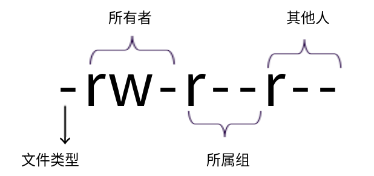

## 权限介绍

### 为什么需要权限

我们发现，初学者并不是不能理解权限命令，而是不能理解为什么需要设定不同的权限。所有的人都直接使用管理员身份，不可以吗？这是由于绝大多数用户使用的是个人计算机，而使用个人计算机的用户一般都是被信任的用户（如家人、朋友等）。在这种情况下，大家都可 以使用管理员身份直接登录。又因为管理员拥有最大权限，所以给我们带来了错觉，以为在计算机中不需要分配权限等级，不需要使用不同的账户。但是在服务器上就不是这种情况了，在服务器上运行的数据越重要（如游戏数据），价值越高（如电子商城数据、银行数据），那么对权限的设定就要越详细，用户的分级也要越明确。所以，在服务器上，绝对不是所有的用户都使用 root 身份登录，而要根据不同的工作需要和职位需要，合理分配用户等级和权限等级。

### 所有者、所属组和其他人

前面讲 `ls` 命令的 -l 选项时，简单解释过所有者和所属组以及其他人，例如：

```shell
[root@localhost ~]# ls -l install.log
-rw-r--r--.   1 root root    24772 1月  14 18:17 install.log
```

命令的第三列 root 用户就是文件的所有者，第四列 root 组就是文件的所属组。而且我们也介绍过，文件的所有者一般就是这个文件的建立者，而系统中绝大多数系统文件都是由 root 建立的，所以绝大多数系统文件的所有者都是 root。 接下来我们解释一下所属组，首先讲解一下用户组的概念。用户组就是一组用户的集合，类似于大学里的各种社团。那为什么要把用户放入一个用户组中呢？当然是为了方便管理。大家想想，如果我有 100 位用户，而这 100 位用户对同一个文件的权限是一致的，那我是一位用户一位用户地分配权限方便，还是把 100 位用户加入一个用户组中，然后给这个用户组分配权限方便呢？不言而喻，一定是给一个用户组分配权限更加方便。综上所述，给一个文件区分所有者、所属组和其他人，就是为了分配权限方便。就像你买了一台电脑，那你当然是这台电脑的所有者，可以把你的朋友加入一个用户组，其他不认识的路人当然就是其他人了。分配完了用户身份，就可以分配权限了，所有者当然对这台电脑拥有所有的权限，而位于所属组中的这些朋友可以借用你的电脑，而其他人则完全不能碰你的电脑。

### 权限位的含义

前面讲解 `ls` 命令时，我们长格式显示的第一列就是文件的权限，例如：

```shell
[root@localhost ~]# ls -l install.log
-rw-r--r--    1 root root    24772 1月  14 18:17 install.log
```

第一列的权限位共有 10 位，这 10 位权限位的含义如图5-1 所示。

::: center



**图5-1	<u>权限位的含义</u>**

:::


- 第 1 位代表文件类型

> -：普通文件
>
> b：块设备文件。这是一种特殊设备文件，存储设备都是这样的文件，如分区文件/dev/sda1就是这种文件。
>
> c：字符设备文件。也是特殊设备文件，输入设备一般都是这种文件，如鼠标、键盘等。
>
> d：目录文件。linux中一切皆文件，所以目录也是文件的一种。
>
> l：软链接文件。相当于快捷方式。
>
> p：管道符文件。这是一种非常少见的特殊设备文件。
>
> s：套接字文件。这也是一种特殊设备文件，一些服务支持 Socket 访问，就会产生这样的文件。
>
> ?：其他文件

- 第 2～4 位代表文件所有者的权限。


 > -r：代表 read，是读取限。
 >
 > -w：代表 write，是写权限。
 >
 > -x：代表 execute，是执行权限。
 >
 > 如果有字母，代表对应的权限；如果是“-”，则代表没有对应的权限。

- 第 5～7 位代表文件所属组的权限。

 > 同样拥有 rwx 权限

- 第 8～10 位代表文件的其他人权限。

 > 同样拥有 rwx 权限

::: tip

有的文件拥有第 11 位权限位“.”，这个“.”是什么意思呢？这就不得要提到 SELinux 了。

SELinux（Security-Enhanced Linux）是美国国家安全局（NSA）对于强制访问控制的实现，是 Linux 历史上最杰出的新安全子系统。是一种基于“域-类型”模型（domain-type）的强制访问控制（MAC）安全系统，它由 NSA 编写并设计成内核模块包含到内核中，相应的某些安全相关的应用也被打了 SELinux 的补丁，最后还有一个相应的安全策略。2.6 及以上版本的 Linux 内核都已经集成了 SELinux 模块。

SELinux 的结构及配置非常复杂，而且有大量概念性的东西，要学精难度较大。很多 Linux 系统管理员嫌麻烦都把 SELinux 关闭了。如果可以熟练掌握 SELinux 并正确运用，我觉得整个系统基本上可以到达"坚不可摧"的地步了（请永远记住没有绝对的安全）。

其配置文件：  `/etc/selinux/config`

SELinux 有三种工作模式，分别是：

1. enforcing：强制模式。违反 SELinux 规则的行为将被阻止并记录到日志中。

2. permissive：宽容模式。违反 SELinux 规则的行为只会记录到日志中。一般为调试用。

3. disabled：关闭 SELinux。

:::

## chmod 命令

`chmod` 命令，用于修改文件权限。

英文原意：change file mode bits

命令格式如下：

```shell
[root@localhost ~]# chmod [选项] 权限模式 文件名
选项：
	-R	：第归设置权限，也就是给子目录中所有文件设定权限。
```

### 权限模式

`chmod` 命令的权限模式的格式是`[ugoa][[+-=][perms]]`，也就是`[用户身份][[赋予方式][权限]]`的格式，我们来解释一下。

- 用户身份。
> u：代表所有者（user）。
>
> g：代表所属组（group）。
>
> o：代表其他人（other）。
>
> a：代表全部身份（all）。

- 赋予方式。
> +：加入权限。 
>
> -：减去权限。 
>
> =：设置权限。 


- 权限。 
> r：读取权限（read）。
>
> w：写权限（write）。
>
> x：执行权限（execute）。

这里我们只讲解基本权限，至于特殊权限（如 suid、sgid 和 sbit 等），我们在后面再详细讲解。

### 数字权限

数字权限的赋予方式是最简单的，但是不如前面的字母权限好记、直观。

数字权限的含义：

- 4：代表 r 权限

- 2：代表 w 权限

- 1：代表 x 权限

```shell
[root@localhost ~]# chmod 755 install.log
[root@localhost ~]# ls -l install.log
-rwxr-xr-x    1 root root    24772 1月  14 18:17 install.log
```

755权限解释说明：

> 第一个数字 7 ：代表所有者的权限是“ 4+2+1 ”，也就是“ rwx ”，读、写、执行权限
>
> 第二个数字 5 ：代表所有组的权限是“ 4+1 ”，也就是“ r-x ”，读、执行权限
>
> 第三个数字 5 ：代表其他人的权限是“ 4+1 ”，也就是“ r-x ”，读、执行权限

::: tip

数字权限的赋予方式更加简单，但是需要用户对这几个数字更加熟悉。其实常用的权限也并不多，只有如下几个：

- 644：这是文件的基本权限，代表所有者拥有读、写权限，而所属组和其他人拥有只读权限
- 755：这是文件的执行权限和目录的基本权限，代表所有者拥有读、写、执行权限，而所有组和其他人拥有读、执行权限
- 777：这是最大权限，在实际生产服务器中，要尽力避免给文件或目录赋予这样的权限，这回造成一定的安全隐患

我们很少会使用 457 这样的权限，因为这样的权限是不合理的，怎么可能文件的所有者的权限还没有其他人的权限大呢？所以，除非是实验需要，否则一般情况下所有者的权限要大于所属组和其他人的权限。

:::

### 基本权限的含义

1. 权限含义的解释

我们已经知道了权限的赋予方式，但是这些读、写、执行权限到底是什么含义呢？有些人可能会说：“你也太小瞧我们了，读、写、执行的含义这么明显，我们还能不知道吗？” 其实，这些权限的含义不像表面上这么明显，下面我们就来讲讲这些权限到底是什么含义。

首先，读、写、执行权限对文件和目录的作用是不同的。

- 权限对文件的作用
  - 读（r）：对文件有读（r）权限，代表可以读取文件中的数据。如果把权限对应到命 令上，那么一旦对文件有读（r）权限，就可以对文件执行 `cat`、`more`、`less`、`head`、`tail` 等文件查看命令。
  - 写（w）：对文件有写（w）权限，代表可以修改文件中的数据。如果把权限对应到命令上，那么一旦对文件有写（w）权限，就可以对文件执行 `vim`、`echo` 等修改文件数据的命令。<u>注意：对文件有写权限，是不能删除文件本身的，只能修改文件中的数据。如果要想删除文件，则需要对文件的上级目录拥有写权限。</u>
  - 执行（x）：对文件有执行（x）权限，代表文件拥有了执行权限，可以运行。在 Linux 中，只要文件有执行（x）权限，这个文件就是执行文件了。只是这个文件到底能不能正确执行，不仅需要执行（x）权限，还要看文件中的代码是不是正确的语言代码。对文件来说，执行（x）权限是最高权限。

- 权限对目录的作用
  - 读（r）：对目录有读（r）权限，代表可以查看目录下的内容，也就是可以查看目录下有哪些子文件和子目录。如果把权限对应到命令上，那么一旦对目录拥有了读（r） 权限，就可以在目录下执行 `ls` 命令，查看目录下的内容了。 
  - 写（w）：对目录有写（r）权限，代表可以修改目录下的数据，也就是可以在目录中新建、删除、复制、剪切子文件或子目录。如果把权限对应到命令上，那么一旦对目录拥有了写（w）权限，就可以在目录下执行 `touch`、`rm`、`cp`、`mv` 命令。对目录来 说，写（w）权限是最高权限。 
  - 执行（x）：目录是不能运行的，那么对目录拥有执行（x）权限，代表可以进入目录。 如果把权限对应到命令上，那么一旦对目录拥有了执行（x）权限，就可以对目录执行 `cd` 命令，进入目录。


## chown 命令

`chown` 命令，用于修改文件和目录的所有者和所属组。

英文原意：change file owner and group

命令格式如下：

```shell
[root@localhost ~]# chown [选项] 所有者:所属组 文件或目录
选项：
	-R	：第归设置权限，也就是给子目录中的所有文件设置权限。
```

### 常见用法

1. **修改文件的所有者**

之所以需要修改文件的所有者，是因为赋予权限的需要。当普通用户需要对某个文件拥有最高权限的时候，是不能把其他人的权限修改为最高权限的，也就是不能出现 777 的权限，这是非常不安全的做法。合理的做法是修改文件的所有者，这样既能让普通用户拥有最高权限，又不会影响其他普通用户。我们来看一个例子：

```shell
[root@localhost ~]# touch laowang 
#由 root 用户创建 laowang 文件 
[root@localhost ~]# ll laowang
-rw-r--r-- 1root root 0 6月 16 05:12 laowang 
#文件的所有者是 root，普通用户 user 对这个文件拥有只读权限 
[root@localhost ~]# chown user laowang 
#修改文件的所有者 
[root@localhost ~]# ll laowang 
-rw-r--r-- 1 user root 0 6月 16 05:12 laowang 
#所有者变成了user 用户，这时 user 用户对这个文件就拥有了读、写权限
```


2. **修改文件的所属组**

`chown` 命令不仅可以修改文件的所有者，也可以修改文件的所属组。例如：

```shell
[root@localhost ~]# chown user:user laowang 
#“:”之前是文件的所有者，之后是所属组。这里的“:”也可以使用“.”代替 
[root@localhost ~]# ll laowang 
-rw-r--r-- l user user 0 6月 16 05:12 laowang 
```

修改所属组，也是为了调整文件的权限。只是我们目前还没有学习如何把用户加入用户组中，如果可以把用户加入同一个组当中，然后直接调整所属组的权限，那当然要比一个一个用户赋予权限要简单方便。 Linux 中用户组的建立与 Windows 中是不同的。在 Windows 中，新建的用户都属于 users 这个组，而不会建立更多的新组。但是在 Linux 中，每个用户建立之后，都会建立和用户名同名的用户组，作为这个用户的初始组，user 用户组是自动建立的。

3. **普通用户修改权限**

在讲权限作用的时候强调过，并不是只有 root 用户才可以修改文件的权限，而是超级用户可以修改任何文件的权限，但是普通用户只能修改自己文件的权限。也就是说，只有普通用户是这个文件的所有者，才可以修改文件的权限。我们试试：

```shell
[root@localhost ~]# cd /home/user/ 
#进入 user 用户的家目录 
[root@localhost user]# touch test 
#由 root 用户新建文件 test 
[root@localhost user]# ll test
-rw-r--r-- 1 root root 0 6月 16 05:37 test 
#文件所有者和所属组都是 root 用户 
[root@localhost user]# su- user 
#切换为 user 用户 
[user@localhost ~]$ chmod 755 test
chmod：更改"test”的权限：不允许的操作 
#user 用户不能修改 test 文件的权限 
[user@localhost ~]$ exit 
#退回到 root 身份 
[root@localhost user]# chown user test 
#由 root 用户把 test 文件的所有者改为 user 用户 
[root@localhost user]# su- user 
#切换为user 用户 
[user@localhost ~]$ chmod 755 test 
#user 用户由于是 test 文件的所有者，所以可以修改文件的权限 
[user@localhost ~]$ ll test 
-rwxr-xr-x 1 user root 0 6月 16 05:37 test 
#查看权限
```

通过这个实验，我们可以确定，如果普通用户是这个文件的所有者，就可以修改文件的权限。

## chgrp 命令

`chgrp` 命令，用于修改文件或目录的所属组。

英文原意：change group ownership

命令格式如下：

```shell
[root@localhost ~]# chgrp 所属组 文件或目录
```

### 常见用法

```shell
[root@localhost ~]# touch test 
#由 root 用户创建 test 文件 
[root@localhost ~]# chgrp user test 
#修改文件的所属组 
[root@localhost ~]# ll test 
-rw-r--r-- 1 root user 0 6月 16 09:32 test 
#所属组变成了user
```

## umask 命令

### umask 默认权的作用

`umask` 默认权限是 Linux 权限的一种，主要用于 Linux 中的新建文件和目录拥有默认权限。 Limux 是一个比较安全的操作系统，而安全的基础就是权限，所以，在 Linux 中所有的文件和目录都要有基本的权限，新建的文件和目录当然也要有默认的权限。

在 Linux 中，通过 `umask` 默认权限来给所有新建立的文件和目录赋予初始权限，这一点和 Windows 不太一样，Windows是通过继承上级目录的权限来给文件和目录赋予初始权限的。

查看系统的 `umask` 权限：

```shell
[root@localhost ~]# umask
0022
#用八进制数值显示 umask 权限
[root@localhost ~]# umask -S
u-rwx,g-rx,o=rx 
#用字母表示文件和目录的初始权限
```

使用“ -S ”选项，会直接用字母来表示文件和目录的初始权限。我们查看数值的 `umask` 权限，看到的是 4 位数字“0022”，其中第一个数字“0”代表的是文件的特殊权限（SetUID、 SetGID、Sticky BIT），暂不讨论。也就是后 3 位数字“022”才是真正的 `umask` 默认权限。

### umask 默认权限的计算方法

在学习 `umask` 默认权限的计算方法之前，我们需要先了解一下新建文件和目录的默认最大权限。

- 对文件来讲，新建文件的默认最大权限是 666，没有执行（x）权限。这是因为执行权限对文件来讲比较危险，不能在新建文件的时候默认赋予，而必须通过用户手工赋予。 

- 对目录来讲，新建目录的默认最大权限是 777。这是因为对目录而言，执行（x）权限仅仅代表进入目录，所以即使建立新文件时直接默认赋予，也没有什么危险。 

接下来我们学习如何计算 `umask` 默认权限。按照官方的标准算法，`umask` 默认权限需要使用二进制进行逻辑与和逻辑非联合运算才可以得到正确的新建文件和目录的默认权限。这种方法既不好计算，也不好理解，并不推荐。 我们在这里还是按照权限字母来讲解 `umask` 权限的计算方法。

我们就按照默认的 `umask` 值是 022 来分别计算一下新建文件和目录的默认权限吧。 

- 文件的默认权限最大只能是 666，换算成字母就是“-rw-rw-rw-”；而 `umask` 的值是 022， 也换算成字母就是“----w--w-”。把两个字母权限相减，得到的就是新建文件的默认权限 644：（ -rw-r--r-- ）=**（ -rw-rw-rw- ）-（ ----w--w-）**。
- 目录的默认权限最大可以是 777，换算成字母就是“drwxrwxrwx”；而 umask 的值是 022，也换算成字母就是“d----w--w-”。也把两个字母权限相减，得到的就是新建目录的默认权限 755：（ drwx-r-xr-x ）=**（ drwxrwxrwx ）-（ d----w--w- ）**。

我们测试一下：


```shell
[root@localhost ~]# umask
0022
#默认 umask 的值是 0022 
[rootelocalhost ~]# touch laowang 
[root@localhost ~]# mkdir fengjie 
[root@localhost ~1# ll -d laowang fengjie/ 
drwxr-xr-x 2 root root 4096 6月 16 02:36 fengjie/ 
-rw-r--r-- 1 root root 0 6月 16 02:36 laowang 
#新建立目录的默认权展是 755，新建立文件的默认权限是 644 
```

::: tip 注意

这里强调一下，`umask` 默认权限的计算是不能直接使用数字相减的。很多人会理解为，既然文件的默认极限最大是“666”，`umask` 的值是“022”，而新建文件的值刚好是“644”，那是不是就是直接使用“666-644”呢？这是不对的，如果 `umask` 的值是“033”呢？按照数值相减，就会得到“633”的值。但是我们强调过文件是不能在新建立时就拥有执行（x）权限 的，而权限“3”是包含执行（x）权限的。我们测试一下： 

```shell
[root@localhost ~]# umask 033
#修改 umask 的值为 033 
[root@localhost ~]# touch xuejie
#建立测试文件xuejie 
[root@localhost ~]# ll xuejie 
-rw-r--r-- 1 root root 0 6月 16 02:46 xuejie xuejie 
#文件的默认权限依然是 644 
```

由这个例子我们可以知道：

**`umask` 默认权限一定不是直接使用权限数字相减得到的，而是通过二进制逻辑与和逻辑非联合运算得到的。最简单的办法还是使用权限字母来计算。**

文件的默认权限最大只能是 666 ，换算成字母就是“-rw-rw-rw-”；而 `umask` 的值是 033，也换算成字母就是“-----wx-wx”。把两个字母权限相减，得到的就是新建文件的默认权限：（-rw-rw-rw-）-（-----wx-wx）=（-rw-r--r--）。 

:::

### umask 默认权限的修改方法

`umask` 默认权限可以直接通过命令来进行修改，例如：

```shell
[root@localhost ~]# umask 002
[root@localhost ~]# umask 033
```

不过，通过命令进行的修改只能临时生效，一旦重启或重新登录就会失效。如果想让修改永久生效，则需要修改对应的环境变量配置文件`/etc/profile`。例如：

```shell
[root@localhost ~]# vi /etc/profile
...省略部分内容...
if[ $UID -gt 199 ] && ["`id -gn'`"="`id -un`"]; then
	umask 002 
	#如果 UID 大于199（普通用户），则使用此 umask 值 
else
	umask 022 
	#如果 UID 小于 199（超级用户)，则使用此 umask 值
fi
...省略部分内容...
```

这是一段 Shell 脚本，大家目前可能看不懂，但是没有关系，只需知道普通用户的 `umask` 值由 if 语句的第一段定义，而超级用户的 `umask` 值由 else 语句定义即可。如果修改的是这个文件，则 `umask` 值是永久生效的。 我们学习了文件的基本权限和 `umask` 默认权限这两种权限，但是 Linux 的权限并不只有这两种，其他的权限内容我们会在后面详细介绍，这里就不一一列举了。

