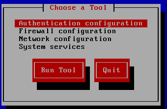
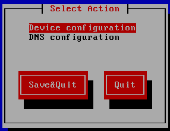
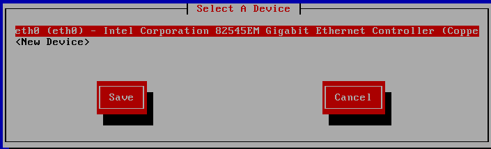
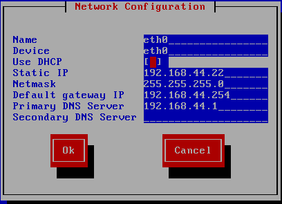

我们在做练习的时候，需要让 Linux 进行联网配置。介绍一下如何给 Linux 配置 IP 地址，以及一些常用的网络命令。

## 配置 Linux 的 IP 地址

IP 地址是计算机在互联网中唯一的地址编码。每台计算机如果需要接入网络和其他计算机进行数据通信，就必须配置唯一的公网 IP 地址。

### setup 命令配置网卡

Linux 当然也需要配置 IP 地址才可以正常使用网络。其实 Linux 主要是通过修改网卡配置文件来永久修改 IP 地址的。`setup` 是一个简化命令，是 Red Hat 系列专有的命令，其他的 Linux 系列不一定有此命令。`setup` 命令会开启一个图形化的配置工具，如图10-1 所示。

这是一个综合工具，既可以配置 IP 地址，也可以管理防火墙和系统服务。如果我们需要配置 IP 地址，则只要选择“Network configuration”就会开始 IP 地址配置。

::: center



**图10-1	<u>配置工具界面</u>**

:::

接下来就可以执行动作选择了。我们要配置 IP 地址，就选择“Decive configuration”，如图10-2 所示。

::: center 



**图10-2	<u>选择动作</u>**

:::

在 CentOS 6.x 中，网卡的设备文件名用 eth0 来表示第一块网卡，如果有第二块网卡，则设备文件名会依次为 eth1。在这里，我们的 Linux 只有一块网卡，所以在选择设备时只需选择 eth0 网卡配置即可，如图10-3 所示。

::: center



**图10-3	<u>选择设备</u>**

:::

接下来就会进入网络配置界面，如图10-4 所示。这时如果在“Use DHCP”选项上输入 “\*”号（空格输入）。就会自动获取 IP 地址：取消“*”号，就会手工分配 IP 地址。

::: center



**图10-4	<u>网络配置</u>**

:::

输入正确的 IP 地址后，使用 Tab 键切換至“OK”按钮上，接下来一路保存退出，IP 地址就输入完成了。但是，如果想让 IP 地址配置生效，则还需要重启网络服务。

```shell
[root@localhost ~]# service network restart
#重启网络服务
```

当然，重启网络服务有很多种方法，这里直接使用 `service` 命令进行网络服务重启。

::: tip 补充

CentOS 7.x 及以上版本的的 `setup` 命令没有网络配置“Decive configuration”选项了，但是可以用 `nmtui` 命令配置网络，同样也是图形化配置工具。
:::

### 手工配置网卡

手工开启网卡 在 CentOS 5x 以前的系统中，通过 `setup` 配置 IP 地址，重启后，IP地址就可以配置成功。但如果是在 CenOS 6.x 中，那么重启后可能依然无法找到 eth0 网卡，而只能看到 lo（本地回环）网卡。例如：

```shell
[root@localhost ~] ifcontig
lo		Link encap:Local Loopback
inet adar:127.0.0.1 Mask:256.0.0.0
inet6 addr: ::1/128 Scope:Hoat
		UP LOOPBACK RUNNING MTU:16436 Metric:1
		RX packets:12 errors:0 dropped:0 qverruns:0 frame:0
        TX packets:12 errors:0 dropped:0 overruns:0 carrier:0 collisions:0 txqueuelen:0 
        RX bytes:840 (840.0 b) TX bytes:840 (840.0 b) 
#只有lo网卡，没有eth0网卡
```

这是因为，在 CentOS 6.x 中，eth0 网卡是默认没有开启的，需要修改网卡配置文件手工开启。例如：

```shell
[root@1ocalhost ~]# vi /etc/sysconfig/network-scripts/ifcfg-eth0
TYPE=Ethernet
PROXY_METHOD=none
BROWSER_ONLY=no
BOOTPROTO=dhcp
DEFROUTE=yes
IPV4_FAILURE_FATAL=no
IPV6INIT=yes
IPV6_AUTOCONF=yes
IPV6_DEFROUTE=yes
IPV6_FAILURE_FATAL=no
IPV6_ADDR_GEN_MODE=stable-privacy
NAME=ens3
UUID=c3c79e29-8228-4e7a-a39a-f54599644675
DEVICE=eth0
ONBOOT=yes
#在网卡配置文件中，ONBOOT默认是 no
[root@1ocalhost ~]# service network restart
Restarting network (via systemctl):                        [  OK  ]
[root@1ocalhost ~]# 
```

手工把 ONBOOT 选项改为 yes，然后再重启网络服务（`service network restart`），就会发现 eth0 网卡启动了，IP 地址也可以正常使用了。


::: tip 补充

Debain/Ubuntu 系统的网络配置：`/etc/network/interfaces`

1. 打开 ubuntu 的 `/etc/network/interfaces` 文件

默认的内容如下：

```shell
$ cat /etc/network/interfaces
auto lo
iface lo inet loopback
```

在文件中添加如下信息：（动态或者静态，二选一）

```shell
# 1. 动态获取的配置方法：
auto eth0
iface eth0 inet dhcp

# 2. 静态分配的配置方法：
auto eth0
iface eth0 inet static
address 192.168.2.6
netmask 255.255.255.0
gateway 192.168.2.1
```


2. 添加域名服务器（DNS）：

打开 `/etc/resolv.conf` 文件，添加如下内容。DNS 写自己常用的就可以了。

```shell
nameserver 114.114.114.114
```

3. 重启下网络

```shell
$ /etc/init.d/networking restart
#这条命令是重启网卡
或者
$ ifdown eth0
$ ifup eth0
#这两条命令是有针对性的重启某个网络接口，因为一个系统可能有多个网络接口
```

以上配置好之后， `ifconfig` 查看下配置是否成功，`ping` 一下，验证网络是否通了。

> Ubuntu 16.04 之后的版本，启用了新的网络工具 netplan，命令行配置网络参数跟之前的版本有比较大的差别，其网卡配置文件为：`/etc/netplan/01-network-manager-all.yaml`，netplan 描述文件采用了 yaml 语法，默认是用 dhcp方式，如果要配置静态地址，则需要修改此文件的想关内容。

   ```shell
# 1. 默认配置为 DHCP 方式：
#注意行缩进
root@ubuntu:~# vim /etc/netplan/01-network-manager-all.yaml
network:
    version: 2
    ethernets:
        eth0:
            dhcp4: true
            match:
                macaddress: 52:54:00:d4:51:ad
            set-name: eth0
            
# 2. 配置静态 IP 地址：
#注意行缩进
root@ubuntu:~# grep -v ^# /etc/netplan/01-network-manager-all.yaml
network:
    version: 2
    ethernets:
        eth0:
            addresses: [192.168.120.18/24]
            gateway4: 192.168.120.1
            nameservers:
                    addresses: [183.60.83.19,183.60.82.98]
                  
# 更新配置生效  
root@ubuntu:~# sudo netplan apply
   ```
:::

## ifconfig 命令

`ifconfig` 命令，是 Linux 中查看和临时修改 IP 地址的命令。

1. **查看 IP 地址信息**

`ifconfig` 命令最主要的作用就是查看 IP 地址的信息，直接输入 `ifconfig` 命令即可。

英文原意：configure a network interface

```shell
[root@localhost ~]# ifconfig
eth0	Link encap:Ethernet HWaddr 00:0C:29:C5:FB:AA
#eth0网卡信息 网络类型为以太网	MAC 地址
inet addr:192.168.44.3 Bcast:192.168.44.255 Mask:255.255.255.0
#IP地址 				  广播地址 				子网掩码
inet6 addr：fe80::20c:29ff:fec5:fbaa/64 Scope:Link
#IPv6的地址（目前不生效）
		UP BROADCAST RUNNING MULTICAST MTU:1500 Metric:1
		#网络参数 					   最大传输单元  数据包转送次数
		RX packets:881 errors:0 dropped:O overruns:0 frame:0
		#接收到的数据包情况
		TX packets:853 errors:0 dropped:0 overruns:0 carrier:0 collisions:0 txqueuelen:1000
        #发送的数据包情况         								  数据包碰撞		数据缓冲区长度
        RX bytes:82229 （80.3 KiB) TX bytes:273463 （267.0 KiB）
        #接收包的大小 发送包的大小
        Interrupt:19 Base address:0x2000
        #TRQ中断 			 内存地址
        
lo 		Link encap:Local Loopback
#本地回环网卡信息
inet addr:127.0.0.1 Mask:255.0.0.0
inet6 addr: ::1/128 Scope:Host
		UP LOOPBACK RUNNING MTU:16436 Metric:1
        RX packets:12 errors:0 dropped:0 overruns:0 frame:0
        TX packets:12 errors:O dropped:O overruns:0 carrier:0 collisions:0 txqueuelen:0
        RX bytes:840 (840.0 b) TX bytes:840 (840.0 b)
```

`ifconfig` 命令主要用于查看 **IP 地址、子网掩码** 和 **MAC地址**这三类信息，其他信息我们有所了解即可。

lo 网卡是 Loopback 的缩写，也就是本地回环网卡，这个网卡的 IP 地址是 **127.0.0.1**。它只代表我们的网络协议正常，就算不插入网线也可以 `ping` 通，所以基本没有实际使用价值，大家了解一下即可。

2. **临时配置 IP 地址**

`ifconfig` 命令除可以查看 IP 地址之外，还可以临时配置 IP 地址，但是一旦重启，IP 地址就会失效，所以我们还是应该使用 `setup` 命令来进行 IP 地址配置。

使用 `ifconfig` 命令临时配置 IP 地址的示例如下：

```shell
[root@localhost ~]#ifconfig eth0 192.168.44.3
#配置 IP地址，不指定子网掩码就会使用标准子网掩码
[rootelocalhost -]#ifconfig eth0 192.168.44.3 netmask 255.255.255。0
#配置 IP地址，同时配置子网掩码
```

## ifup 和 ifdown 命令

`ifup` 和 `ifdown` 是两个非常简单的命令，其作用类似于 Windows 中的启用和禁用网卡，主要用于启用和关闭网卡。

英文原意：bring a network interface up **&** take a network interface down

命令格式如下：

```shell
[root@localhost ~]# ifdown 网卡设备名
#例子：
[root@localhost ~]# ifdown eth0
#关闭 eth0 网卡
[root@localhost ~]# ifup eth0
#启用 eth0 网卡
```

## ping 命令

`ping` 是常用的网络命令，主要通过 ICMP 协议进行网络探测，测试网络中主机的通信情况。

英文原意：send ICMP ECHO_REQUEST to network hosts

命令格式如下：

```shell
[root@localhost ~]# ping [选项] IP
选项：
	-b		：后面加入广播地址，用于对整个网段进行探测
    -c 次数	：用于指定 ping 的次数
    -s 字节	：指定探测包的大小 
```

1. **探测与指定主机通信**

直接输入 `ping IP地址` 即可，例如：

```shell
[root@localhost ~]# ping 192.168.103.151
PING 192.168.103.151 (192.168.103.151) 56(84) bytes of data.
64 bytes from 192.168.103.151: icmp_seq=1 tt1=128 time=0.300 ms
64 bytes from 192.168.103.151: icmp_seq=2 ttl=128 time=0.481 ms
...省略部分内容.... 
#探测与指定主机是否通信
```

 Linux 是一个比较实在的操作系统，这个 `ping` 命令如果不使用 <kbd>Ctrl</kbd>+<kbd>C</kbd> 快捷键强行中止， 就会一直 `ping` 下去，直到天荒地老…… 	

2. **指定 ping 的次数**

 既然 `ping` 这么“实在”，如果不想一直 `ping` 下去，则可以使用“-c”选项指定 ping 的次数。例如：

```shell
 [root@localhost ~]# ping -c 3 192.168.103.151
 #只探测3次，就中止 ping 命令
```

3. **探测网段中的可用主机**

在 `ping` 命令中，可以使用“-b”选项，后面加入广播地址，探测整个网段。我们可以使 用这个选项知道整个网络中有多少主机是可以和我们通信的，而不用一个一个 IP 地址地进行探测。例如：

```shell
[root@localhost ~]# ping -b -c 3 192.168.103.255
WARNING：pinging broadcast address
PING 192.168.103.255 (192.168.103.255) 56(84) bytes of data.
64 bytes from 192.168.103.199:icmp_seq=1 ttl=64 time=1.95 ms
64 bytes from 192.168.103.168:icmp_seq=1 ttl=64 time=1.97 ms
64 bytes from 192.168.103.252:icmp_seq=1 ttl=64 time=2.29 ms
...省略部分内容...
#探测 192.168.103.0/24 网段中有多少可以通信的主机
```

## natstat 命令

> 说道这个命令，就不得不提以下端口的作用。
>
> 我们要先简单了解一下端口的作用。在互联网中，如果 IP 地址是服务器在互联网中唯一的地址标识，那么大家可以想象一下：我有一台服务器，它有固定的公网 IP 地址，通过 IP 地址可以找到我的服务器。但是我的服务器中既启动了网页服务（Web 服务），又启动了文件传输服务（FTP 服务），那么你的客户端访问我的服务器，到底应该如何确定你访问的是哪一个服务呢？
>
> 端口就是用于网络通信的接口，是数据从传输层向上传递到应用层的数据通道。我们可以理解为每个常规服务都有默认的端口号，通过不同的端口号，我们就可以确定不同的服务。也就是说，客户端通过 IP 地址访问到我的服务器，如果数据包访问的是 80 端口，则访问的是 Web 服务；而如果数据包访问的是 21 端口，则访问的是 FTP 服务。
>
> 我们可以简单地理解为每个常规服务都有一个默认端口（默认端口可以修改)，这个端口是所有人都知道的，客户端可以通过固定的端口访问指定的服务。而我们通过在服务器中查看已经开启的端口号，就可以判断服务器中开启了哪些服务。


`netstat` 命令，是网络状态查看命令，既可以查看到本机开启的端口，也可以查看有哪些客户端连接。

英文原意：Print network connections, routing tables, interface statis‐tics, masquerade connections, and multicast memberships

命令格式如下：

```shell
[root@localhost ~]# netstat [选项]
选项：
	-a		：列出所有网络状态，包括 Socket 程序
	-c 秒数	：指定每隔几秒刷新一次网络状态
	-n		：使用 IP 地址和端口号显示，不使用域名与服务名
	-p		：显示 PID 和程序名
	-t		：显示使用 TCP 协议端口的连接状况
	-u		：显示使用 UDP 协议端口的连接状况
	-l		：仅显示监听状态的连接
	-r		：显示路由表
```

1. **查看本机开启的端口**

这是本机最常用的方式，使用选项“-tuln”。因为使用了”-l“项，所以只能看到监听状态的连接，而不能看到已经建立连接状态的连接。例如：

```shell
[root@localhost ~]# netstat -tuln
Active Internet connections (only servers)
Prota  Recv-Q  Send-Q	Local Address		Foreign Address		State
tcp			0		0 	0.0.0.0:3306		0.0.0.0:*			LISTEN
tcp			0		0	0.0.0.0:11211		0.0.0.0:*			LISTEN
tcp			0		0	0.0.0.0:22			0.0.0.0:*			LISTEN
tcp			0		0	:::11211			:::*				LISTEN
tcp			0		0	:::80				:::*				LISTEN
tcp			0		0	:::22				:::*				LISTEN
udp			0		0	0.0.0.0:11211		0.0.0.0:*			
udp			0		0	:::11211			:::*				
#协议  接收队列  发巡队列  本机的IP及端口号		 远程主机的IP地扯及端口号  状态
```

这个命令的输出较多。

> - Proto：网络连接的协议，一般就是 TCP 协议或者 UDP 协议。
> - Reev-Q：表示接收到的数据，已经在本地的缓冲中，但是还没有被进程取走。
> - Send-Q：表示从本机发送，对方还没有收到的数据，依然在本地的缓冲中，一般是不具备 ACK 标志的数据包。
> - Local Address：本机的 IP 地址和端口号。
> - Foreign Address：远程主机的 IP 地址和端口号。
> - State：状态。常见的状态主要有以下几种。
>   - LISTEN：监听状态，只有 TCP 协议需要监听，而 UDP 协议不需要监听。
>   - ESTABLISHED：已经建立连接的状态。如果使用“-l”选项，则看不到已经建立连接的状态。
>   - SYN_SENT：SYN 发起包，就是主动发起连接的数据包。
>   - SYN_RECV：接收到主动连接的数据包。
>   - FIN_WAIT1：正在中断的连接。
>   - FIN_WAIT2：已经中断的连接，但是正在等待对方主机进行确认。
>   - TIME_WAIT：连接已经中断，但是套接字依然在网络中等待结束。
>   - CLOSED：套接字没有被使用。

在这些状态中，我们最常用的就是 LISTEN 和 ESTABLISHED 状态，一种代表正在监听，另一种代表已经建立连接。

2. **查看本机有哪些程序开启的端口**

如果使用“-p”选项，则可以查看到是哪个程序占用了端口，并且可以知道这个程序的 PID。例如：

```shell
[root@localhost ~]# netstat -tulnp
Active Internet connections (only servers)
Prota  Recv-Q  Send-Q	Local Address		Foreign Address		State		PID/Program name
tcp			0		0	0.0.0.0:3306		0.0.0.0:*			LISTEN		2359/mysqld
tcp			0		0	0.0.0.0:11211		0.0.0.0:*			LISTEN		1563/memcached
tcp			0		0	0.0.0.0:22			0.0.0.0:*			LISTEN		1490/sshd
tcp			0		0	:::11211			:::*				LISTEN		1563/memcached
tcp			0		0	:::80				:::*				LISTEN		21025/httpd
tcp			0		0	:::22				:::*				LISTEN		1490/sshd
udp			0		0	0.0.0.0:11211		0.0.0.0:*						1563/memcached
udp			0		0	:::11211			:::*							1563/memcached
#协议  接收队列  发巡队列  本机的IP及端口号		 远程主机的IP地扯及端口号  状态		PID/程序名
#比之前的命令多了一个“-p”选项，结果多了“PID/程序名”，可以知道是哪个程序占用了端口
```

3. **查看所有连接**

查看所有连接使用选项“-an”可以查看所有连接，包括监听状态的连接（LISTEN）、已经建立连接状态的连接（ESTABLISHED）、Socket程序连接等。因为连接较多，所以输出的内容有很多。例如：

```shell
[root@localhost ~]# netstat -an
Active Internet connections (servers and established)
Proto Recv-Q Send-Q		Local Address		Foreign Address		 State
tcp			0		0 	0.0.0.0:3306		0.0.0.0:*			 LISTEN
tcp			0		0	0.0.0.0:11211		0.0.0.0:*			 LISTEN
tcp			0		0	117.79.130.170:80	78.46.174.55:58815	 SYN_RECV
tcp			0		0	0.0.0.0:22			0.0.0.0:*			 LISTEN
tcp			0		0	117.79.130.170:22	124.205.129.99:10379 ESTABLISHED
tcp			0		0	117.79.130.170:22	124.205.129.99:11811 ESTABLISHED
...省略部分内容...
udp			0		0	0.0.0.0:11211		0.0.0.0:*			
udp			0		0	:::11211			:::*				
Active UNIX domain sockets (servers and established)
Proto	RefCnt	Flags	Type	state		I-Node	Path
unix	2		[ ACC ]	STREAM	LISTENING	9761	@/var/run/hald/dbus-fr41WkQn1c
...省略部分内容.... 
```

从“Active UNIX domain sockets”开始，之后的内容就是 Socket 程序产生的连接，之前的内容都是网络服务产生的连接。我们可以在“-an”选项的输出中看到各种网络连接状态，而之前的“-tuln”选项则只能看到监听状态。

## write 命令

在服务器上，有时会有多个用户同时登录，一些必要的沟通就显得尤为重要。比如，我必须关闭某个服务，或者需要重启服务器，当然需要通知同时登录服务器的用户，这时就可以使用 `write` 命令，向其他用户发送信息。

`write` 命令，用于向指定登录用户终端上发送信息。

英文原意：send a message to another user

write 命令的基本格式如下：

```shell
[root@localhost ~]#write 用户名 [终端号]
```

`write` 命令没有多余的选项，我们要向在某个终端登录的用户发送信息，就可以这样来执行命令：

```shell
[root@localhost ~]# wlite userl pts/1
hello
I will be in 5 minutes to restart, please save your data
#向在 pts/1（远程终端1）登录的 user1 用戶发送信息，使用“Ctrl+D”快捷键保存发送的数据
```

这时，user1 用户就可以收到你要在 5 分钟之后重启系统的信息了。

## wall 命令

 `wall` 命令，用于给所有登录用户发送信息，包括你自己。

英文原意：send a message to everybody's terminal.

命令格式，在 `wall` 命令后加入需要发送的信息即可，例如：

```shell
[root@localhost ~]# wall "I will be in 5 minutes to restart, please save your data"
```

## mail 命令

`mail` 是 Linux 的邮件客户端命令，可以利用这个命令给其他用户发送邮件。

1. **发送邮件**

如果我们想要给其他用户发送邮件，则可以执行如下命令：

```shell
[root@localhost ~]# mail userl
Subject：hello					<---邮件标题
Nice to meet you!				<---部件具体内容
.								<---使用 “.” 来结束邮件输入
#发送邮件给 user1 用户
```

我们接收到的邮件都保存在 `/var/spool/mail/用户名` 中，每个用户都有一个以自己的用户名命名的邮箱。

2. **发送文件内容**

如果我们想把某个文件的内容发送给指定用户，则可以执行如下命令：

```shell
[root@localhost ~]# mail -s "test mall" root < /root/anaconda-ks.cfg
选项：
	-s：指定邮件标题
#把 /root/anaconda-ks.cfg 文件的内容发送给 root用户
```

我们在写脚本时，有时需要脚本自动发送一些信息给指定用户，把要发送的信息预先写到文件中，是一个非常不错的选择。

3. **查看已经接收的邮件**

我们可以直接在命令行中执行 `mail` 命令，进入 `mail` 的交互命令中，可以在这里查看已经接收到的邮件。例如：

```shell
[root@localhost ~)# mail
Heirloom Mail version 12.4 7/29/08.Type ?for help.
"/var/spool/mail/root": 1 message 1 new
>N 1 root		Mon Dec 5 22:45  68/1777  "teat mall"		<---之前收到的邮件
>N 2 root		Mon Dec 5 23:08  18/602   "hello"
#未读 编号 发件人 时间						标题

&		<---等待用户输入命令
```

可以看到已经接收到的邮件列表，“N”代表未读邮件，如果是已经阅读过的邮件，则前面是不会有这个“N”的；之后的数字是邮件的编号，我们主要通过这个编号来进行邮件的操作。如果我们想要查看第一封邮件，则只需输入邮件的编号“`1`”就可以了。

在交互命令中执行“`?`”，可以查看这个交互界面支持的命令。例如：

```shell
$ ?		<-输入 ? 命令
               mail commands
type <message list>             type messages
next                            goto and type next message
from <message list>             give head lines of messages
headers                         print out active message headers
delete <message list>           delete messages
undelete <message list>         undelete messages
save <message list> folder      append messages to folder and mark as saved
copy <message list> folder      append messages to folder without marking them
write <message list> file       append message texts to file, save attachments
preserve <message list>         keep incoming messages in mailbox even if saved
Reply <message list>            reply to message senders
reply <message list>            reply to message senders and all recipients
mail addresses                  mail to specific recipients
file folder                     change to another folder
quit                            quit and apply changes to folder
xit                             quit and discard changes made to folder
!                               shell escape
cd <directory>                  chdir to directory or home if none given
list                            list names of all available commands
```

这些交互命令是可以简化输入的，比如 `headers` 命令，就可以直接输入 `h`，这是列出邮件标遇列表的命令。我们解释一下常用的交互命令。

- headers：列出邮件标题列表，直接输入 `h` 命令即可。
- delete：删除指定邮件。比如想要删除第二封邮件，可以输入 `d2`。
- save：保存邮件。可以把指定邮件保存成文件，如 `s2 /tmp/tcst.mail`。
- quit：退出，并把已经操作过的邮件进行保存。比如移除已删除邮件、保存已阅读邮件等。
- exit：退出，但是不保存任何操作。
