## 文本编辑器 Vim

Linux 中的所有内容以文件形式管理，在命令行下更改文件内容，常常会用到文本编辑器。

我们首选的文本编辑器是 Vim，它是一个基于文本界面的编辑工具，使用简单且功能强大，更重要的是，Vim 是所有 Linux 发行版本的默认文本编辑器。

很多 UNIX 和 Linux 的老用户习惯称呼它为 Vi，Vi 是 Vim 的早期版本，现在我们使用的 Vim（Vi improved）是 Vi 的增强版，增加了一些正则表达式的查找、多窗口的编辑等功能，使得 Vim 对于程序开发来说更加方便。想了解 Vi 和 Vim 的区别，可以在 Vim 命令模式下输入 `:help vi_diff`，就能够看到两者区别的摘要。

值得一提的是，Vim 是慈善软件，如有赞助或评比得奖，所得钱财将用于救助乌干达孤儿。软件使用是免费的，使用者是否捐款赞助当然不会勉强。不过，如果有有奖评比活动，那么你去投一票也算功德一件。

了解 Vim 更多信息可以访问官网：<http://www.vim.org>

### Vim 的工作模式

在使用 Vim 编辑文件前，我们先来了解一下它的 3 种工作模式：**命令模式**、**输入模式**和**编辑模式**，这 3 种工作模式可随意切换，如图11-1 所示。

::: center


**图11-1	<u>Vim 的三种工作模式</u>**

:::

- **命令模式**

使用 Vim 编辑文件时，默认处于命令模式。此模式下，可使用方向键（上、下、左、右键）或 <kbd>k</kbd>、<kbd>j</kbd>、<kbd>h</kbd>、<kbd>i</kbd> 移动光标的位置，还可以对文件内容进行复制、粘贴、替换、删除等操作。

- 输入模式

在输入模式下，Vim 可以对文件执行写操作，类似于在 Windows 系统的文档中输入内容。使 Vim 进行输入模式的方式是在命令模式状态下输入 <kbd>i</kbd>、<kbd>I</kbd>、<kbd>a</kbd>、<kbd>A</kbd>、<kbd>o</kbd>、<kbd>O</kbd> 等插入命令，编辑文件完成后按 <kbd>Esc</kbd> 键即可返回命令模式。

- **编辑模式**

如果要保存、查找或者替换一些内容等，就需要进入编辑模式。编辑模式的进入方法为：在命令模式下按 <kbd>:</kbd> 键，Vim 窗口的左下方会出现一个“:”符号，这时就可以输入相关的指令进行操作了。指令执行后会自动返回命令模式。

对于新手来说，经常不知道自己处于什么模式。不论是自己忘了，还是不小心切换了模式，都可以直接按一次 <kbd>Esc</kbd> 键返回命令模式。如果你多按几次 <kbd>Esc</kbd> 键后听到了“嘀——”的声音，则代表你已经处于命令模式了。

## 进入 Vim

了解了 Vim 的工作模式后，就可以愉快地使用 Vim 进行文件编辑了。先来看一下 Vim 打开文件的方法。

### 使用 Vim 打开文件

使用 Vim 打开文件很简单，例如，你想打开一个自己编写的文件 `/test/vi.test`，打开方法如下：

```shell
[root@itxdl ~]# vim /test/vi.test
```

刚打开文件时进入的是命令模式，此时文件的下方会显示文件的一些信息，包括文件名，文件的总行数和字符数，以及当前光标所在的位置等，此时可以使用插入命令（如：<kbd>i</kbd>）进入输入模式对文件进行编辑，如图11-2 所示。

::: center

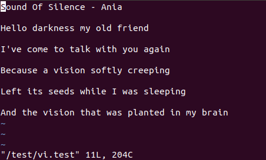

**图11-2	<u>Vim 打开文件</u>**

:::

接下来的操作练习，如果你的 Linux 中没有自己编写的文件，或者你懒得编写文件，则可以直接复制一个系统文件，方法如下：

```shell
[root@itxdl ~]# cp /etc/passwd /tmp/passwd.vi
```

千万不要随意打开一个系统文件就直接开始练习！

### 直接进入指定位置

如果想直接进入 Vim 编辑文件的指定行数处或者特定字符串所在行，节省编辑时间，例如，打开 `/tmp/passwd.vi` 文件时直接进入第 20 行，则可以这样操作：

```shell
[root@itxdl ~]# vim +20 /tmp/passwd.vi
```

打开文件后，直接进入“nobody”字符串所在行，则可以这样操作：

```shell
[root@itxdl ~]# vim +/nobody /tmp/passwd.vi
```

如果文件中有多个“nobody”字符串，则会以查到的第一个为准。

## Vim 的基本应用

打开文件后，接下来开始对文件进行编辑。Vim 虽然是一个基于文本模式的编辑器，但却提供了丰富的编辑功能。对于习惯使用图形界面的朋友来说，刚开始会较难适应，但是熟练后就会发现，使用 `Vim` 进行编辑实际上更加快速。

### 插入命令

从命令模式进入**输入模式**进行编辑，可以按下 <kbd>i</kbd>、<kbd>I</kbd>、<kbd>a</kbd>、<kbd>A</kbd>、<kbd>o</kbd>、<kbd>O</kbd> 等键来完成，不同的键只是光标所处的位置不同而已。当进入输入模式后，你会发现，在 Vim 编辑窗口的左下角会出现“INSERT”标志（中文版本出现“插入”标志），这就代表我们可以执行写入操作了，如图11-3 所示。

::: center

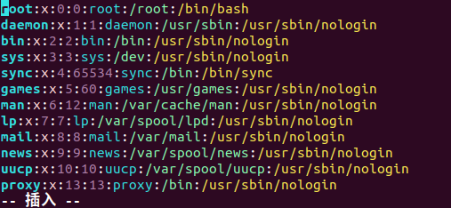

**图11-3	<u>输入模式</u>**

:::

常用的插入命令：

```shell
i	——在当前光标所在位置插入随后输入的文本，光标后的文本相应向右移动
I 	——在光标所在行的行首插入随后输入的文本，行首是该行的第一个非空白字符，相当于光标移动到行首再执行 i 命令
a	——在当前光标所在位置之后插入随后输入的文本
A	——在光标所在行的行尾插入随后输入的文本，相当于光标移动到行尾再执行 a 命令
o	——在光标所在行的下面插入新的一行。光标停在空行的行首，等待输入文本
O	——在光标所在行的上面插入新的一行。光标停在空行的行首，等待输入文本
```


::: tip 注意

在Linux 纯字符界面中，默认是不支持中文输入的。如果想要输入中文，则有三种方法。

1. 安装中文语言支持和图形界面，在图形界面下输入中文，使用 gVim（Vim 的图形前端）。

2. 安装中文语言支持，使用远程连接工具（如 PuTTY )，在远程连接工具中调整中文编码，进行中文输入。

3. 倘若非要在 Linux 纯字符界面中输入中文，则可以安装中文插件，如 zhcon。
:::

### 光标移动命令

在进行编辑工作之前，需要将光标移动到适当的位置。Vim 提供了大量的光标移动命令，注意这些命令需要在**命令模式**下执行。下面介绍一些常用的光标移动命令。

1. **以字符为单位移动**

```shell
上、下、左、右方向健		——移动光标
```

习惯使用鼠标的用户可能很自然地想到用鼠标来进行编辑定位，但是你会发现鼠标不会给你任何反应。在 Vim 中进行定位需要通过上、下、左、右方向键，并且无论是命令模式还是输入模式，都可以通过方向键来移动光标（在编辑模式中，方向键是用来查看命令历史记录的）。

```shell
h、j、k、l					——移动光标
```

另外，还可以在命令模式中使用 h、j、k、l 四个字符控制方向，分别表示向左、向下、向上、向右。在大量编辑文档时，会频繁地移动光标，这时使用方向键可能会比较浪费时间，使用这 4 个键就很方便快捷。当然，这同样是一件熟能生巧的事情。

2. 以单词为单位移动

```shell
w	——移动光标到下一个单词的词首
b	——移动光标到上一个单词的词首
e	——移动光标到下一个单词的词尾
```

有时候需要迅速进入一行中的某个位置，如果能使光标一次移动一个单词就会非常方便。可以在命令模式中使用“w”命令来使光标向后跳到下一个单词的词首，或者使用“b”命令使光标向前跳到上一个单词的词首，还可以使用“e”命令使光标跳到下一个单词的词尾。

3. **移动到行尾或者行首**

```shell
$		——移动光标到行尾
0 或 ^	——移动光标到行首
```

可以使用 `$` 命令将光标移至行尾，使用 `0` 或 `^` 命令将光标移至行首。其实，对于 `$` 命令来说，可以使用诸如 `n$` 之类的命令来将光标移至当前光标所在行的之后 n 行的行尾（n 为数字）：对于 `0` 命令来说却不可以，但可以用 `n^`。

4. **移动到一行的指定字符处**

```shell
f字符				——移动光标到第一个符合条件的字符处
```

如果在一行中需要将光标移动到当前行的某个特定字符处，则可以使用 `f` 命令。例如，某行内容为“you can you up，no can no bb”，现在需要将光标移动到字符 p 处，则可以使用“`fp`”命令，这样光标就会迅速定位到字符 p 处。`f` 命令有一个使用条件，即光标需在指定字符前。

5. **移动到匹配的括号处**

```shell
%		 			——在匹配的括号间切换
```

如果你是一名程序员，那么在使用 Vim 进行编辑时经常会为将光标移动到与一个 “`(`" 匹配的 “`)`” （对于[ ]和{ }也是一样的）处而感到头疼。其实在 Vim 里面提供了一个非常方便地查找匹配括号的命令，这就是 `%` 。比如，在 `/etc/init.d/sshd` 脚本文件中（最好还是复制后练习，小心驶得万年船)，想迅速地将光标定位到与第 49 行的 “`{`” 相对应的 “`}`” 处，则可以将光标先定位在 “`{`” 处，然后再使用 `%` 命令，使之定位在 “`}`” 处，如图11-4 所示。关于定位文件指定的行，后续会有介绍。

::: center

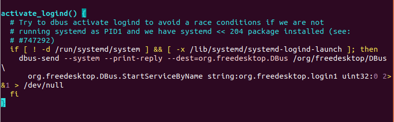

**图11-4	<u>使用“%”命令定位括号</u>**

:::

6. **移动到指定行处**

```shell
nG 或 :n			——移动光标到指定的行
```

可以直接在命令模式中输入 `nG`（n 为数字，G 为大写）或  `:n`（在编辑模式中输入数字）命令将光标快速地定位到指定行的行首。这种方法对于快速移动光标非常有效。

### 使用 Vim 进行编辑

光标移动到指定位置后，如何进行编辑操作呢？Vim 提供了大量的编辑命令，下面介绍其中一些常用的命令。

1. **查找指定字符串**

```shell
/要查找的字符串		——从光标所在行开始向下查找所需的字符串
?要查找的字符串		——从光标所在行开始向上查找所需的字符串
:set ic				——查找时忽略大小写
```

一个字符串可以是一个或者多个字母的集合。如果想在 Vim 中查找字符串，则需要在命令模式下进行。在 Vim 命令模式中输入 `/要查找的字符串`，再按一下回车键，就可以从光标所在行开始向下查找指定的字符串。如果要向上查找，则只需输入 `?要查找的字符串` 即可。例如，在 `/etc/passwd.vi` 文件中查找字符串“root”，则运行命令如图11-5 所示。

::: center

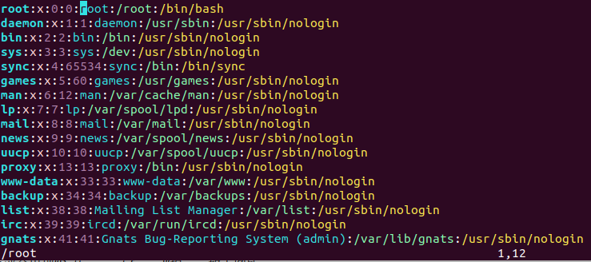

**图11-5	<u>使用 Vim 进行查找</u>**

:::

如果匹配的字符串有多个，则可以按 <kbd>n</kbd> 键向下继续匹配查找，按 <kbd>N</kbd> 键向上继续匹配查找。如果在文件中并没有找到所要查找的字符串，则在文件底部会出现“Pattern not found”提示（中文版本出现“找不到模式”），如图11-6 所示。

::: center

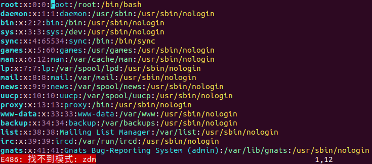

**图11-6	<u>未查找到指定字符串的提示</u>**

:::

在查找的过程中需要注意的是，要查找的字符串是严格区分大小写的，如查找“zhiling”和“ZhiLing”会得到不同的结果。如果想忽略大小写，则输入命令 `:set ic`；调整回来输入`:set noice`，如果在字符串中出现特殊符号，则需要加上转义字符“\”，常见的特殊符号有 **\\、\?、\^、\$** 等。如果出现这些字符，例如，要查找字符串“10\$”，则需要在命令模式中输入 `/10\$`。还可以查找指定的行。例如，要查找一个以”root“为行首的行，则可以进行如下操作：

```shell
/^root
```

要查找一个以“root”为行尾的行，则可以进行如下操作：

```shell
/root$
```

2. **使用 Vim 进行替换**

```shell
r	——潜換光标所在处的字符
R	——从光标所在处开始替换字符，按 Esc 键结束
```

小写“r”可以替换光标所在处的某个字符，将光标移动到想替换的单个字符处，按下 <kbd>r</kbd> 键，然后直接输入替换的字符即可；大写“R”可以从光标所在处开始替换字符，输入会覆盖后面的文本内容，直到按 <kbd>Esc</kbd> 键结束替换，如图11-7 所示。

::: center

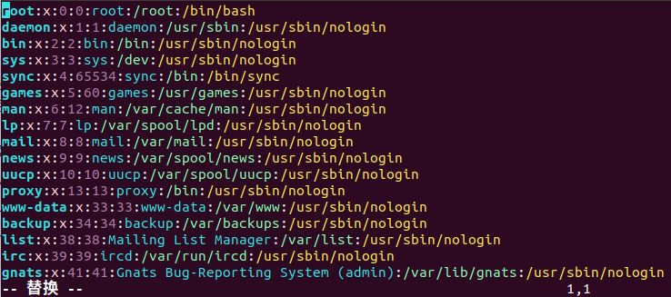

**图11-7	<u>使用“R”进行替换</u>**

:::

按下 <kbd>R</kbd> 键替换后，Vim 编辑文件左下角会显示“REPLACE”（中文版为“替换”），进入替换状态。输入的内容会替换掉所在行光标后面的内容，直到按 <kbd>Esc</kbd> 键才会退出替换；否则将一直处于替换状态。

批量替换：

```shell
:替换起始处,替换结束处 s/源字符串/替换的字符串/g	——替换范围内的字符串
:% s/源字符串/替换的字符串/g						——替换整篇文档的字符串
```

如果不加“g”，则只替换每行第一个找到的字符串。

假设要将 `/tmp/passwd.vi` 文件中所有的“root”替换为“liudehua”，则可以输入 `:1,$ s/root/liudehua/g` 或 `:% s/root/liudehua/g`。如图11-8 所示：

::: center

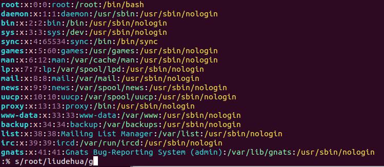

**图11-8	<u>指定范围替换</u>**

:::

上述命令是在**编辑模式**下操作的，表示的是从第一行到最后一行，即全文查找“root”，然后替换成“liudehua”。

如果刚才的命令变成如下这样：

```shell
:10,20 s/root/liudehua/g
```

则知替换从第 10 行到第 20 行的“root”。

3. **使用 Vim 进行删除、粘贴、复制**

```shell
x					——删除光标所在字符
nx					——从光标所在位置向后删除 n 个字符，n 为数字
dd					——删除整行。如果之后粘贴，则此命令的作用是剪切
ndd					——删除多行
dG					——删除从光标所在行到文件末尾的内容
D					——删除从光标所在处到这行行尾的内容
:起始行,终止行 d	——删除指定范围的行
yy 或 Y				——复制单行
nyy 或 nY			——复制多行
P					——粘贴到当前光标所在行下
p					——粘贴到当前光标所在行上
```

如果处于**命令模式**下，则可以按下 <kbd>x</kbd> 键来删除光标所在位置的单个字符；快速按两下 <kbd>d</kbd> 键来进行整行删除；如果想要删除连续多行，例如，想要删除 10 行，则可以按下`10dd`，可以快速删除当前光标所在行下 10 行。

此时被删除的内容并没有真正删除，都临时放在了内存中。将光标移动到指定位置处，按下 <kbd>p</kbd> 键，就可以将刚才删除的内容又粘贴到此处。在软件开发中可能需要将连续两行进行互换，就可以先将上面的一行通过 `dd` 键删除，再将光标移动到下面，通过 <kbd>p</kbd> 键将其重新粘贴，这样就能够达到两行互相交换位置的目的。 `dG` 键可以删除从光标所在行一直到文件末尾的全部内容，而 <kbd>D</kbd> 键可以删除从光标所在处到这行行尾的内容。如果要删除指定范围的行，则可以用 `:起始行,终止行 d`。如删除第 1～3 行，则输入 `:1,3 d`，如图11-9 所示，会提示“3 fewer lines”。（或“少了 3 行”）

::: center

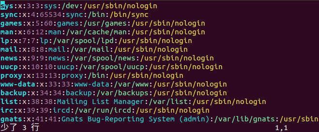

**图11-9	<u>删除指定范围的行</u>**

:::

还可以通过 `yy` 键来复制单行，或者通过在前面加上数字来复制当前光标所在行下的多行。

有时候可能需要把两行进行连接。如在下面的文件中有两行，现在需要使其成为一行，实际上就是将两行同的换行符去掉。可以直接在命令模式中按下 <kbd>J</kbd> 键，按下前后如图11-10所示：

::: center

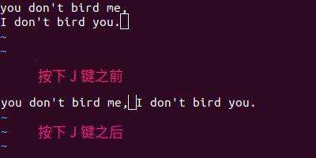

**图11-10	<u>按下“J”之前和之后对比</u>**

:::

4. **使用 Vim 撤销上一步操作**

```shell
u	——撒销
```

如果不小心误删除了文件内容，则可以通过 <kbd>u</kbd> 键来撤销刚才执行的命令。如果要撤销刚才的多次操作，则可以多按几次 <kbd>u</kbd> 键。

### 保存退出命令

估计前面一大堆的操作已经让你有些力不从心了，其实，这还只是总结出来的常用部分。不过对于日常使用基本足够了，不用死记硬背，只需多练习就能掌握。

Vim 的保存和退出是在**命令模式**中进行的，为了方便记忆，只需要记住 **w、q、!** 三个符号的含义即可完成保存任务。

```shell
字母“w”	——保存不退出
字母“q”	——不保存退出
字符“!”	——强制性操作
```

例如，在命令模式中只輸入“w”字母就意味着保存但不退出；如果输入“wq”就意味着保存并且退出：如果输入“w!”或“wq！”就意味着强制保存或强制保存退出，这种情况经常发生在对一个文件没有写权限的时候（显示 “readonly” 或 “只读”，如图11-11 所示)，但如果你是文件的所有着或者 root 用户，就可以强制执行。

::: center

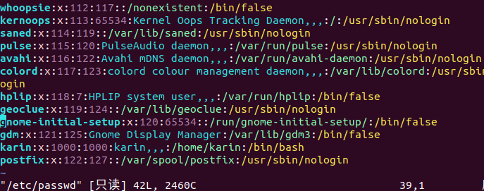

**图11-11	<u>只读文件</u>**

:::

其他用法，如“q!”表示不保存退出：保留源文件，而另存为其他的文件，可以用 `w 新文件名`，如：`w /tmp/shadow.vi`。

在命令模式中，还可以输入 `ZZ` 命令退出，按两次 <kbd>Shif</kbd> + <kbd>Z</kbd> 快捷键比较方便，强烈推荐。此时如果对文件没有修改，就是不保存退出；如果对文件已经进行了一些修改，就是保存后退出。


## Vim 的进阶应用

以上介绍了 Vim 的常见用法，接下来给大家介绍一下 Vim 使用的小技巧。

### Vim 配置文件

在使用 Vim 进行编辑的过程中，经常会遇到需要同时对连续几行进行操作的情况，这时如果每行都有行号提示，就会非常方便。在命令模式下输入 `:set nu` 即可显示每一行的行号，如图11-12 所示。如果想要取消行号，则再次输入 `:set nonu` 即可。

::: center

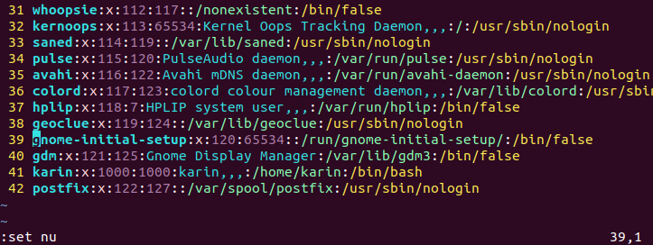

**图11-12	<u>显示行号</u>**

:::

如果希望每次打开文件都默认显示行号，则可以编辑 Vim 的配置文件。每次使用 Vim打开文件时，Vim 都会到当前登录用户的宿主目录（用户配置文件所在位置）中读取 `.vimnc` 文件，此文件可以对 Vim 进行一-些默认配置设定。如果 `.vimrc` 文件存在，就先读取其中对 Vim 的设置；否则就采取默认配置。在默认情况下，用户宿主目录中是没有此文件的，需要在当前用户的宿主目录中手工建立，如 `vim  ~/.vimne`，“~”代表宿主目录，root 的宿主目录为 `/root`，普通用户的宿主目录存放在 `/home/` 目录下。可以直接使用 Vim 編辑生成此文件，并在此文件中添加一行“set nu”，保存并退出，如图11-13 所示。

::: center

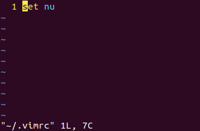

**图11-13	<u>.vimrc 配置文件</u>**

:::

之后此用户登录，每次 Vim 打开文件时，都会默认显示行号。后面将要讲到的 mmp，ab 等 Vim 命令也可以写入配置文件中，便于使用。常见的可以写入 `.vimrc` 文件中的设置参数如表11-1 所示。

**表11-1	<u>常见的可以写入 .vimrc 文件中的设置参数</u>**

| 设置参数                                 | 含义                                                         |
| ---------------------------------------- | ------------------------------------------------------------ |
| `:set nu`<br />`:set nonu`               | 设置与取消行号                                               |
| `:syn on`<br />`:syn off`                | 是否依据语法显示相关的颜色帮助。在 Vim 中修改相关的<br />配置文件或 Shell 脚本文件时，默认会显示相应的颜色，用来帮助排错。 |
| `:set  hlsearch`<br />`:set  nohlcearch` | 设置是否将查找的字符串高亮显示。默认是 hlsearch 高亮显示     |
| `:set  backup`<br />`:set  nobackup`     | 是否保存自动备份文件。默认是 nobackup 不自动备份，<br />如果设定了:sel backup，则会产生“文件名~”作为备份文件 |
| `:set ruler`<br />`:set noruler`         | 设置是否显示右下角的状态栏默认是 ruler 显示                  |
| `:set  showmode`<br />`:set  noshowmode` | 设置是否在左下角显示如“--INSTALL--”之类的状态栏，默认是 showmode 显示 |

设置参数实在太多了，这里只列举了常见的几个，可以使用 `:set all` 命令查看所有的设置参数。这些设置参数都可以写入 `.vimre` 配置文件中，让它们永久生效；也可以直接在 Vim 中执行，让它们临时生效。

### 多窗口编辑

在编辑文件时，有时需要参考另一个文件，如果在两个文件之间进行切换则比较麻烦。可以使用 Vin 同时打开两个文件，每个文件分别占用一个窗口。例如，在查看 `/etc/passwd` 时需要参考 `/etc/shadow`，有两种办法可以实现：可以先使用 Vim 打开第一个文件，接着输入命令 `:sp /etc/shadow` 水平切分窗口，然后按回车键，如果想垂直切分窗口则可以输入 `vs /etc/shadow`；也可以直接执行命令 `vim -o 第一个文件名 第二个文件名`，也就是 `vim -o /etc/passwd /etc/shadow`。得到的结果图11-14 所示。

::: center

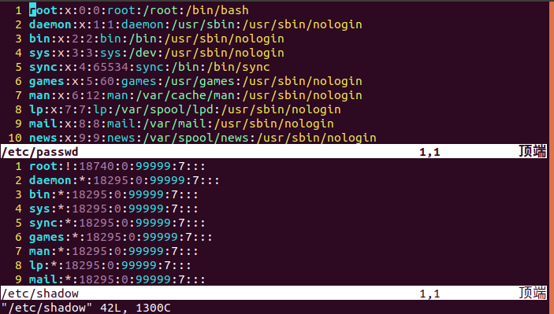

**图11-14	<u>使用 Vim 打开多个窗口</u>**

:::

切换到另一个文件窗口，可以按 <kbd>Ctl</kbd>+<kbd>W</kbd><kbd>W</kbd> 快捷键。

如果想将一个文件的内容全部复制到另一个文件中，则可以输入命令 `:r 被复制的文件名`，即可将导入文件的全部内容复制到当前光标所在行下面。


### 区域复制

通过前面的操作，大家会发现，Vim 是以行为单位进行整体编辑的。但是有时候需要对一些特定格式的文件进行某个范围的编辑，就需要使用区域复制功能。

举例来说，现在想将 `/etc/services` 文件（此文件记录了所有服务名与端口的对应关系）中的服务名都复制下来，就可以执行以下操作：先使用 Vim 打开 `/etc/scrvices` 文件，再将光标移动到需要复制的第一行处，然后按下 <kbd>Ctrl</kbd> + <kbd>V</kbd> 快捷键，这时底部状态栏出现“--VISUAL BLOCK--”（或“--可视 块--”），就可以使用上、下、左、右方向键进行区域的选取了；当全 <kbd>y</kbd> 健，然后将光标移动到目标位置处；按下 <kbd>p</kbd> 键，即可完成区域复制，如图11-15 所示。

::: center

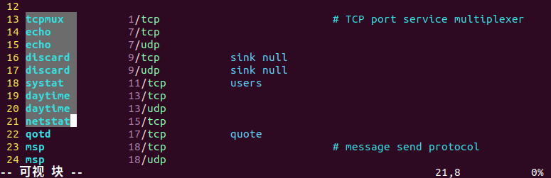

**图11-15	<u>区域复制</u>**

:::

### 定义快捷键

使用 Vim 编辑 Shell 脚本，在进行调试时，需要进行多行的注释，每次都要先切换到输入模式，在行首输入注释符“#”，再退回命令模式，非常麻烦。连续行的注释其实可以用替换命令来完成。

在指定范围行添加“#”注释，可以使用 `:起始行,终止行 s/^/#/g`，例如：

```shell
:1,10s /^/#/g
```

表示在第 1～10 行行首加“#”注释。“^”意为行首。“g”表示执行替换时不询问确认。如果希望每行交互询问是否执行，则可将“g”改为“c”。

取消连续行注释，则可以使用 `:起始行,终止行 s/#//g`，例如：

```shell
:1,10s/^#//g
```

意为将行首的“#”替换为空，即删除。当然，使用语言不同，注释符号或想替换的内容不同，都可以采用此方法，添加“//”注释，要稍微麻烦一些，`:起始行,终止行 s/^/\/\//g`”，因为“/”前面需要加转义字符“\\"，所以写出来比较奇特，例如：


```shell
:1,5s /^/\/\//g
```

表示在第 1～5 行行首加“//”注释。

以上方法可以解决连续行的注释问题，如果是非连续的多行就不灵了，这时我们可以定义快捷键简化操作。

格式如下：

```shell
:map 快捷健 执行命令		——定义快捷键
```

如定义快捷键 <kbd>Ctrl</kbd>+<kbd>P</kbd> 为在行首添加“#”注释，可以执行 `:map  ^P I#<Esc>`。其中“\^P”为定义快捷键 <kbd>Ctrl</kbd>+<kbd>P</kbd>。注意：必须同时按 <kbd>Ctrl</kbd>+<kbd>V</kbd>+<kbd>P</kbd> 快捷键生成“\^P”方可有效，或先按 <kbd>Ctrl</kbd>+<kbd>V</kbd> 再按 <kbd>Ctrl</kbd>+<kbd>P</kbd> 也可以，直接输入“\^P”是无效的。

“I#\<Esc>”就是此快捷键要触发的动作，“I”为在光标所在行行首插入，“#”为要输入的字符，“\<Esc>”表示退回命令模式。“\<Esc>”要逐个字符输入，不可直接按键盘上的 <kbd>Esc</kbd> 键。

设置成功后，直接在任意需要注释的行上按 <kbd>Ctrl</kbd>+<kbd>P</kbd> 快捷键，就会自动在行首加上“#”注释。取消此快捷键定义，输入 `:unmap ^P` 即可。我们可以延伸一下，如果想定义删除文件行首字符的快捷键，则可以设置 `:map ^B 0x`，快捷键为 <kbd>Ctrl</kbd>+<kbd>B</kbd>，“0”表示跳到行首，“x”表示删除光标所在处字符。

再如，有时我们写完脚本等文件，需要在末尾注释中加入自己的邮箱，则可以直接定义解次按快捷键 <kbd>Ctrl</kbd>+<kbd>E</kbd> 实现插入邮箱，定义方法为 `:map ^E asamlee@itxdl.net<Esc>`。其中，“a”表示在当前字符后插入，“samlee@itxdl.net“为插入的邮箱，”\<Esc>“表示插入后返回命令模式。

所以，通过定义快捷键，我们可以把前面讲到的命令组合起来使用。

将快捷键对应的命令保存在`.vimrc` 文件中，即可在每次使用 Vim 时自动调用，非常方便。

### 在 Vim 中与 Shell 交互

在 Vim中，可以在编辑模式下用 `!` 命令来访问 Linux 的 Shell 以进行操作。命令格式如下：

```shell
:! 命令
```

直接在 `!` 后面跟所要执行的命令即可，这样可以在系统中直接查看命令的执行结果。例如，在编辑过程中想查看一下 `/etc/passwd` 文件的权限，则可以使用如下命令：

```shell
:! ls -l /etc/passwd
```

执行后，会在当前编辑文件中显示命令的执行结果，完毕后会提示用户按回车键返回编辑状态。如图11-16 所示。

::: center

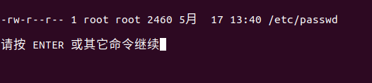

**图11-16	<u>与 shell 交互</u>**

:::

如果想把命令的执行结果导入编辑文件中，则还可以与导入命令 `r` 一起使用。如在编辑完文件后，在文件未尾加入当前时间，命令如下：

```shell
:r !date
```

这也是一种可以展开想象的使用方法，这里就不再举例了，大家可以自行尝试。

### 文本格式转换

`unix2dos` 和 `dos2unix` 命令可实现文本格式转换的功能。从命令名称即可得知，这两个文本操作命令是在 UNIX 与 DOS 文件格式之间进行数据转换的。在实际应用中，管理员经常会把 Linux 平台上的重要文档放到自己的 Windows 工作站上保存和查看，而这两种平台之间的文本在互相查看的时候可能会因为一些控制符号的存在而使屏幕显得很乱，甚至无法使用。这时就需要用到这两个转换命令。

::: tip 注意

在默认安装时，`dos2unix` 和 `unix2dos` 命令是没有的，需要手工安装。先放入安装光盘，如果是 VMware，则加载一下 ISO 安装镜像，然后挂载光盘。

```shell
[root@localhost ~]# mount /dev/cdrom /mnt/cdrom
[root@localhost ~]# rpm -ivh /mnt/cdrom/Packages/dos2unix-3.1-37.e16.1686.rpm
[root@localhost ~]# rpm -ivh /mnt/cdrom/packages/unix2dos-2.2-35.e16.1686.rpm
```

不同版本的 Linux，以上 RPM 包版本号可能有差别，但方法相同。

Ubuntu 系统使用的是 `todos` 和 `fromdos`，命令的字面意思也很好理解，都在 tofrodos 包里，安装如下：

```shell
[root@ubuntu ~]# sudo apt install tofrodos
```

:::

不少人喜欢将 Linux 的 Shell 脚本备份存放在 Windows 个人计算机上，有时会在 Windown 上进行更改，但是再复制到 Linux 中可能就无法执行了。

在 Windows 文件中，列的结束符号有两个控制字符：一个是归位字符（Carriage Retwm，^M），另一个是换行字符（New Line，^J）；但在 Linux 文件中只使用一个换行字符“\n”（功能同 ^J）。所以，当 Linux 中的文本文件放到 Windows 上用文本编辑器编辑时，会乱成首尾相连的一行。

`unix2dos` 命令的作用就是把 Linux 中的行尾符号 “n\” 转换成 Windows 中使用的 “\^M\^J”。命令格式如下：

```shell
[root@localhost ~]# unix2dos 源文件名
[root@localhost ~]# dos2unix 源文件名
```

如下命令可更新 `ls.man. txt` 文件，再复制到 Windows 中查看就正常了。

```shell
[root@localhost ~]# unix2dos ls.man.txt
```

 可以想象，`dos2unix` 命令的作用正好相反，即把 Windows 文档中的行尾符号“\^M\^J”转换为“^J”。命令格式也相同，如下：

```shell
[root@localhost ~]# dos2unix backup.sh
```

在 Windows 上编辑后无法执行的 Shell 脚本就是通过上面的命令来解决的。

### Vim 的宏记录

有时候需要对某些行进行相同的改动，如果逐一对每行进行修改则比较麻烦。Vim 提供了非常优秀的宏记录功能，下面举例说明。

现在有一个文件名列表，如图11-17 所示。

::: center


**图11-17	<u>文件名列表</u>**

:::

假设这是我们所需的库文件名列表，需要将其编辑成如图11-18 所示的格式。

::: center

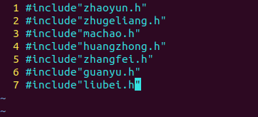

**图11-18	<u>需要完成的文件格式</u>**

:::

可以看到，如果行数比较多，那么一行一行地修改会比较麻烦。可以使用宏记录的方式来完成。

1. 在命令模式中将光标移动到 zhaoyun.h 行的行首，按下 `qx` 键，其中“q”代表宏记录，“x”代表给宏起的名，可以是任意字符，这时候可以发现，在屏幕左下角会出现“rcording”（或“记录中”）字样，如图11-19 所示。

::: center


**图11-19	<u>开始进行宏记录</u>**

:::

2. 将第一行设置成下图中第一行所示的形式。当修改完成后，接 <kbd>Ese</kbd>键回到命令模式，再按下 <kbd>q</kbd> 键退出宏记录模式，如图11-20 所示。

::: center


**图11-20	<u>完成宏记录</u>**

:::

3. 当宏记录完成后，就可以执行它了。执行的方法是将光标移动到需要进行修改的行首，然后执行 `@宏名` 命令即可。如本例就可以将光标移动到第二行行首，然后执行 `@x` 命令，其他的行以此类推，最后得到图11-18 所示的效果。

### ab 命令的小技巧

在 Vim 中可以使用 `map` 定义快捷键，如输入电子邮箱、通信地址、联系电话……但是定义太多，难以记住，此时可以在编辑模式中使用神奇的 `ab` 命令。命令格式如下：

```shell
:ab 替代符 原始信息
```

示例如下：

```shell
:ab mymail samlee@itxal.cn
:ab xdl http://mge.itxdl.cn
```

执行之后，在任何地方输入 `mymail`、`xdl`，再敲任意非字母，非数字的符号（如句号，逗号等)，或者回车，或者空格，马上就会变成对应的邮箱和网址，非常方便。Linux 的编辑工具当然不止 Vim 一种，如大名鼎痛的 Emacs、类似 DOS 下的 cdit 程序的 Pico、名字很华丽的午夜执行官 MC（Midnight Commander）……不过 Vim 如终是 Linux 平台上默认及应用最为广泛的文本编辑器，是编辑器中的“霸主”。虽然初学时可能应用起来比较吃力，但是一旦用熟，必将爱不释手。

## 文本编辑器 nano

nano 是 Linux 中的一款功能非常简单的文本编辑器，该编辑器支持鼠标功能，因此非常容易上手。标准的 Ubuntu 系统默认都安装了nano文本编辑器。

命令格式：

```shell
[root@localhost ~]# nano [选项] 文件名
选项：
	-w	：禁止 `nano` 自动换行，这个选项在编辑系统配置文件时比较有用，防止因自动换行而对配置文件产生误解
	-m	：启用鼠标支持，开启此选项在使用SSH远程连接时也可以使 nano 支持鼠标。如果忘了添加 -m 选项，在启动 nano 后也可以通过快捷键 Alt+M 启用鼠标支持。
```

在 `nano` 打开或新建文件之后，下方有常用快捷键的提示，配合<kbd>Ctrl</kbd>键使用，使用更方便，不用怕忘记命令。如图11-21 所示：

::: center

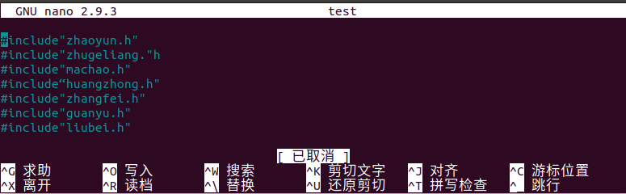

**图11-21	<u>nano 命令打开文件</u>**

:::

**表11-2	<u>nano 命令的常用快捷键及作用</u>**

| 按键                          | 作用         |
| ----------------------------- | ------------ |
| <kbd>Ctrl</kbd>+<kbd>O</kbd>  | 保存文件     |
| <kbd>Ctrl</kbd>+<kbd>X</kbd>  | 退出编辑器   |
| <kbd>Ctrl</kbd>+<kbd>K</kbd>  | 剪切行       |
| <kbd>Ctrl</kbd>+<kbd>U</kbd>  | 粘贴         |
| <kbd>Ctrl</kbd>+<kbd>\\</kbd> | 替换         |
| <kbd>Ctrl</kbd>+<kbd>W</kbd>  | 查找         |
| <kbd>Ctrl</kbd>+<kbd>G</kbd>  | 调用帮助菜单 |
| ...                           | ...          |
