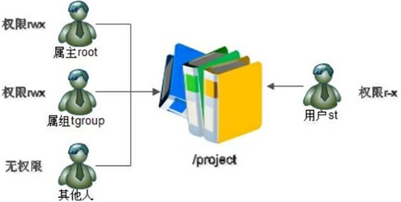

## 访问控制列表权限

### ACL权限介绍

在普通权限中，用户对文件只有三种身份，就是属主、属组和其他人；每种用户身份拥有读（read)、写（write）和执行（execute）三种权限。但是在实际工作中，这三种身份实在是不够用，我们举个例子来看看。先看看示意图，如图14-1 所示。

::: center



**图14-1	<u>ACL 权限简介</u>**

:::

上图的根目录中有一个 /project 目录，这是班级的项目目录。班级中的每个学员都可以访问和修改这个目录，老师也需要对这个目录拥有访问和修改权限，其他班级的学员当然不能访问这个目录。需要怎么规划这个目录的权限呢？应该这样：老师使用 root 用户，作为这个目录的属主，权限为 rwx；班级所有的学员都加入 tgroup 组，使 tgroup 组作为 `/project` 目录的属组，权限是 rwx；其他人的权限设定为 0。这样这个目录的权限就可以符合我们的项目开发要求了。

有一天，班里来了一位试听的学员 st，她必须能够访问 `/project` 目录，所以必须对这个目录拥有 r 和 x 权限；但是她又没有学习过以前的课程，所以不能赋予她 w 权限，怕她改错了目录中的内容，所以学员 st 的权限就是 r-x。可是如何分配她的身份呢？变为属主？当然不行，要不 root 该放哪里？加入 tgroup 组？也不行，因为 tgroup 组的权限是 rwx，而我们要求学员 st 的权限是 r-x。如果把其他人的权限改为 r-x 呢？这样一来，其他班级的所有学员都可以访问 /project 目录了。

当出现这种情况时，普通权限中的三种身份就不够用了。ACL 权限就是为了解决这个问题的。在使用 ACL 权限给用户 st 陚予权限时，st 既不是 /project 目录的属主，也不是属组，仅仅赋予用户 st 针对此目录的 r-x 权限。这有些类似于 Windows 系统中分配权限的方式，单独指定用户并单独分配权限，这样就解决了用户身份不足的问题。

**ACL 是 Access Control List**（访问控制列表）的缩写，不过在 Linux 系统中，ACL 用于设定用户针对文件的权限，而不是在交换路由器中用来控制数据访问的功能（类似于防火墙）。

### 开启 ACL 权限

在 CentOS 6.x 系统中 ACL 权限默认是开启的，不需要手工开启。不过，如果你的操作系统不是 CentOS 6.x，那该如何查看 ACL 权限是否开启了呢？可以这样查看：

```shell
[root@localhost ~]# mount
/dev/sda1 on /boot type ext4 (rw)
/dev/sda3 on I type ext4 (rw)
…省略部分输出…
#使用mount命令可以看到系统中已经挂载的分区，但是并没有看到ACL权限的设置
[root@localhost ~]# dumpe2fs -h /dev/sda3	
#dumpe2fs是查询指定分区文件系统详细信息的命令
#选项-h：仅显示超级块中的信息，而不显示磁盘块组的详细信息
…省略部分输出…
Default mount options: user_xattr acl
…省略部分输出…
```

使用 `mount` 命令可以査看到系统中已经挂载的分区，而使用 `dumpe2fs` 命令可以査看到这个分区文件系统的详细信息。大家可以看到，我们的 ACL 权限是 `/dev/sda3` 分区的默认挂载选项，所以不需要手工挂载。

不过我的 Linux 系统如果没有默认挂载，则可以手工挂载吗？当然可以，执行如下命令：

```shell
[root@localhost ~]# mount -o remount, acl /
#重新挂载根分区，并加入ACL权限
```

使用 mount 命令重新挂载，并加入 ACL 权限。不过使用此命令是临时生效的。要想永久生效，需要修改 `/etc/fstab` 文件，命令如下：

```shell
[root@localhost ~]#vi /etc/fstab
UUID=c2ca6f57-b15c-43ea-bca0-f239083d8bd2 /ext4 defaults,acl 1 1
#加入ACL权限
[root@localhost ~]# mount -o remount /
#重新挂载文件系统或重启系统，使修改生效
```

在你需要开启 ACL 权限的分区行上（也就是说 ACL 权限针对的是分区），手工在 defaults 后面加入", acl"即可永久在此分区中开启 ACL 权限。

### ACL权限管理命令

我们知道了 ACL 权限的作用，也知道了如何开启 ACL 权限，接下来学习如何査看和设定 ACL 权限。命令如下：

```shell
[root@localhost ~]# getfacl 文件名
#查看ACL权限
[root@localhost ~]# setfacl [选项] 文件名
#设定ACL权限

选项：
	-m	：设定 ACL 权限。如果是给予用户 ACL 权限，则使用"u:用户名:权限"格式赋予；如果是给予组 ACL 权限，则使用"g:组名:权限" 格式赋予；
	-x	：删除指定的 ACL 权限；
	-b	：删除所有的 ACL 权限；
	-d	：设定默认 ACL 权限。只对目录生效，指目录中新建立的文件拥有此默认权限；
	-k	：删除默认 ACL 权限；
	-R	：递归设定 ACL 权限。指设定的 ACL 权限会对目录下的所有子文件生效；
```

### 添加 ACL 权限

举个例子，就来看看上图中的权限怎么分配。我们要求 root 是 /project 目录的属主，权限是 rwx；tgroup 是此目录的属组，tgroup 组中拥有班级学员 zhangsan 和 lisi，权限是 rwx；其他人的权限是 0。这时，试听学员 st 来了，她的权限是 r-x。我们来看具体的分配命令。

```shell
[root@localhost ~]# useradd zhangsan
[root@localhost ~]# useradd lisi
[root@localhost ~]# useradd st
[root@localhost ~]# groupadd tgroup
#添加需要试验的用户和用户组，省略设定密码的过程
[root@localhost ~]# mkdir /project #建立需要分配权限的目录
[root@localhost ~]# chown root:tgroup /project/
#改变/project目录的属主和属组
[root@localhost ~]# chmod 770 /project/
#指定/project目录的权限
[root@localhost ~]# ll -d /project/
drwxrwx--- 2 root tgroup 4096 1月19 04:21 /project/
#查看一下权限，已经符合要求了
#这时st学员来试听了，如何给她分配权限
[root@localhost ~]# setfacl -m u:st:rx /project/
#给用户st赋予r-x权限，使用"u:用户名:权限" 格式
[root@localhost /]# cd /
[root@localhost /]# ll -d project/
drwxrwx---+ 3 root tgroup 4096 1月19 05:20 project/
#使用ls-l査询时会发现，在权限位后面多了一个"+"，表示此目录拥有ACL权限
[root@localhost /]# getfacl project
#查看/prpject目录的ACL权限
# file: project			<-文件名
# owner: root			<-文件的属主
# group: tgroup			<-文件的属组
user::rwx				<-用户名栏是空的，说明是属主的权限
user:st:r-x				<-用户st的权限
group::rwx				<-组名栏是空的，说明是属组的权限
mask::rwx				<-mask权限
other::---				<-其他人的权限
```

大家可以看到，st 用户既不是 /prpject 目录的属主、属组，也不是其他人，我们单独给 st 用户分配了 r-x 权限。这样分配权限太方便了，完全不用先辛苦地规划用户身份了。

我想给用户组赋予 ACL 权限可以吗？当然可以，命令如下：

```shell
[root@localhost /]# groupadd tgroup2
#添加测试组
[root@localhost /]# setfacl -m g:tgroup2:rwx project/
#为组tgroup2纷配ACL权限，使用"g:组名:权限"格式
[root@localhost /]# ll -d project/
drwxrwx---+ 2 root tgroup 4096 1月19 04:21 project/
#属组并没有更改
[root@localhost /]# getfacl project/
# file: project/
# owner: root
# group: tgroup
user::rwx
user:st:r-x
group::rwx
group:tgroup2:rwx <-用户组tgroup2拥有了rwx权限
mask::rwx
other::--
```

### 最大有效权限 mask

mask 是用来指定最大有效权限的。mask 的默认权限是 rwx，如果我给 st 用户赋予了 r-x 的 ACL 权限，mj 需要和 mask 的 rwx 权限"相与"才能得到 st 的真正权限，也就是 r-x "相与"rwxtj 出的值是 r-x，所以 st 用户拥有 r-x 权限。

如果把 mask 的权限改为 r--，和 st 用户的权限相与，也就是 r--"相与"r-x 得出的值是 r--，st 用户的权限就会变为只读。大家可以这么理解：用户和用户组所设定的权限必须在 mask 权限设定的范围之内才能生效，mask权限就是最大有效权限。

不过我们一般不更改 mask 权限，只要给予 mask 最大权限 rwx，那么任何权限和 mask 权限相与，得出的值都是权限本身。也就是说，我们通过给用户和用户组直接赋予权限，就可以生效，这样做更直观。

::: info 补充

逻辑与运算的运算符是"and"。可以理解为生活中所说的"并且"。也就是相与的两个值都为真，结果才为真；有一个值为假，与的结果就为假。比如 A 相与 B，结果入表14-1 所示。

:::

**表14-1	<u>逻辑与运算</u>**

| A    | B    | and  |
| ---- | ---- | ---- |
| 真   | 真   | 真   |
| 真   | 假   | 假   |
| 假   | 真   | 假   |
| 假   | 假   | 假   |

那么两个权限相与和上面的结果类似，我们以读（r）权限为例，结果如表41-2 所示。

**表14-2	<u>读权限相与</u>**

| A    | B    | and  |
| ---- | ---- | ---- |
| r    | r    | r    |
| r    | -    | -    |
| -    | r    | -    |
| -    | -    | -    |

所以，“rwx”相与“r-x”，结果是“r-x”；“r--”相与“r-x”，结果是“r--”。

修改最大有效权限的命令如下：

```shell
[root@localhost /]# setfacl -m m:rx project/
#设定mask权限为r-x，使用"m:权限"格式
[root@localhost /]# getfacl project/
# file：project/
# owner：root
# group：tgroup
user::rwx
group::rwx #effective:r-x
mask::r-x
#mask权限变为r-x
other::--
```

### 默认 ACL 权限和递归 ACL 权限

我们已经给 /project 目录设定了 ACL 权限，那么，在这个目录中新建一些子文件和子目录，这些文件是否会继承父目录的 ACL 权限呢？我们试试吧。

```shell
[root@localhost /]# cd /project/
[root@localhost project]# touch abc
[root@localhost project]# mkdir d1
#在/project目录中新建了abc文件和d1目录
[root@localhost project]# ll
总用量4
-rw-r--r-- 1 root root 01月19 05:20 abc
drwxr-xr-x 2 root root 4096 1月19 05:20 d1
#这两个新建立的文件权限位后面并没有"+"，表示它们没有继承ACL权限
```

子文件 abc 和子目录 d1 因为是后建立的，所以并没有继承父目录的 ACL 权限。当然，我们可以手工给这两个文件分配 ACL 权限，但是如果在目录中再新建文件，都要手工指定，则显得过于麻烦。这时就需要用到默认 ACL 权限。

默认 ACL 权限的作用是：如果给父目录设定了默认 ACL 权限，那么父目录中所有新建的子文件都会继承父目录的 ACL 权限。默认 ACL 权限只对目录生效。命令如下：

```shell
[root@localhost /]# setfacl -m d:u:st:rx /project/
#使用"d:u:用户名：权限"格式设定默认ACL权限
[root@localhost project]# getfacl project/
# file: project/
# owner: root
# group: tgroup
user:: rwx
user:st:r-x
group::rwx
group:tgroup2:rwx
mask::rwx
other::--
default:user::rwx 			<-多出了default字段
default:user:st:r-x
default:group::rwx
default:mask::rwx
default:other::--
[root@localhost /]# cd project/
[root@localhost project]# touch bcd
[root@localhost project]# mkdir d2
#新建子文件和子目录
[root@localhost project]# ll 总用量8
-rw-r--r-- 1 root root 01月19 05:20 abc
-rw-rw----+ 1 root root 01月19 05:33 bcd
drwxr-xr-x 2 root root 4096 1月19 05:20 d1
drwxrwx---+ 2 root root 4096 1月19 05:33 d2
#新建的bcd和d2已经继承了父目录的ACL权限
```

大家发现了吗？原先的 abc 和 d1 还是没有 ACL 权限，因为默认 ACL 权限是针对新建立的文件生效的。

再说说递归 ACL 权限。递归是指父目录在设定 ACL 权限时，所有的子文件和子目录也会拥有相同的 ACL 权限。

```shell
[root@localhost project]# setfacl -m u:st:rx -R /project/
#-R递归
[root@localhost project]# ll
总用量8
-rw-r-xr--+ 1 root root 01月19 05:20 abc
-rw-rwx--+ 1 root root 01月19 05:33 bcd
drwxr-xr-x+ 2 root root 4096 1月19 05:20 d1
drwxrwx--+ 2 root root 4096 1月19 05:33 d2
#abc和d1也拥有了ACL权限
```

::: tip 总结

默认 ACL 权限指的是针对父目录中新建立的文件和目录会继承父目录的 ACL 权限，格式是 `setfacl -m d:u:用户名:权限 文件名`；递归 ACL 权限指的是针对父目录中已经存在的所有子文件和子目录继承父目录的 ACL 权限，格式是 `setfacl -m u:用户名:权限 -R 文件名"。

:::

### 删除 ACL 权限

我们来看看怎么删除 ACL 权限，命令如下：

删除指定的ACL权限：

```shell
[root@localhost /]# setfacl -x u:st /project/
#删除指定用户和用户组的ACL权限
[root@localhost /]# getfacl project/
# file:project/
# owner: root
# group: tgroup
user::rwx
group::rwx
group:tgroup2:rwx
mask::rwx
other::--
#st用户的权限已被删除
```

删除所有ACL权限：

```shell
[root@localhost /]# setfacl -b project/
#会删除文件的所有ACL权限
[root@localhost /]# getfacl project/
# file: project/
# owner: root
# group: tgroup
user::rwx
group::rwx
other::--
#所有ACL权限已被删除
```


## 文件特殊权限

在复杂多变的生产环境中，单纯设置文件的rwx权限无法满足我们对安全和灵活性的需求，因此便有了 **SetUID、SetGID 与 Sticky BIT** 的特殊权限位。这是一种对文件权限进行设置的特殊功能，可以与一般权限同时使用，以弥补一般权限不能实现的功能。下面具体解释这 3 个特殊权限位的功能以及用法。

### 文件特殊权限之 SetUID

1. 什么是 SetUID

   在 Linux 系统中我们已经学习过 r（读）、w（写）、x（执行）这三种文件普通权限，但是我们在查询系统文件权限时会发现出现了一些其他权限字母，比如：

   ```shell
   [root@localhost ~]# ll /usz/bin/passwd
   -rwsr-xr-x 1 root root 25980 2月 22 2012 /usr/bin/passwd 
   ```

   大家发现了吗？在属主本来应该写 ×（执行）权限的位置出现了一个小写 s，这是什么权限？我们把这种权限称作 SetUTD 权限，也叫作 SUID 的特殊权限。这种权限有什么作用呢？ 我们知道，在 Linux 系统中，每个普通用户都可以更改自己的密码，这是合理的设置。问题是， 普通用户的信息保存在`/etc/passwd`文件中，用户的密码实际保存在`/etc/shadow`文件中，也就是说，普通用户在更改自己的密码时修改了`/etc/shadow`文件中的加密密码，但是，看下面的 代码：

   ```shell
   [root@localhost ~]# ll /etc/passwd
   -rw-r--r-- I root root 1728 1月 19 04:20 /etc/passwd
   [root@localhost ~]# ll /etc/shadow
   ---------- 1 root root 1373 1月 19 04:21 /etc/shadow
   ```

   `/etc/passwd`文件的权限是 644，意味着只有超级用户 root 可以读/写，普通用户只有只读权限。`/etc/shadow`文件的权限是 000 ，也就是没有任何权限。这意味着只有超级用户可以读取文件内容，并且可以强制修改文件内容；而普通用户没有任何针对`/etc/shadow`文件的权限。也就是说，普通用户对这两个文件其实都是没有写权限的，那为什么普通用户可以修改自己的密码呢？

   其实，普通用户可以修改自己的密码的秘密不在于`/etc/passwd`和`/etc/shadow`这两个文件， 而在于 `passwd` 命令。我们再来看看 `passwd` 命令的权限：

   ```shell
   [root@localhost ~]# ll /usr/bin/passwd
   -rwsr-xr-x. 1 root root 25980 2月 22 2012 /usr/bin/passwd passwd
   ```

   `passwd` 命令拥有特殊权限 SetUID，也就是在属主的权限位的执行权限上是 s。可以这样来理解它：当一个具有执行权限的文件设置 SetUID 权限后，用户在执行这个文件时将以文件所有者的身份来执行。`passwd` 命令拥有 SetUID 权限，所有者为 root（Linux 中的命令默认所有者都是 root），也就是说，当普通用户使用 `passwd` 命令更改自己的密码的时候，实际上是在用 `passwd` 命令所有者 root 的身份在执行 `passwd` 命令，root 当然可以将密码写入 `/etc/shadow` 文件，所以普通用户也可以修改 `/etc/shadow` 文件，命令执行完成后，该身份也随之消失。

    SetUID 的功能可以这样理解：

   > 1）只有执行的二进制程序才能设定 SUID 权限
   >
   > 2）命令执行者要对该程序有用 x（执行）权限
   >
   > 3）命令执行者在执行该程序时获得该程序文件属主的身份执行
   >
   > 4）SetUID 权限只在该程序执行过程中有效，也就是说身份改变只在程序执行过程中有效

2. 危险的 SetUID 

如果把系统命令本身拥有的 SetUID 权限取消，这样会导致命令本身可以执行的功能失效。但是如果我们给默认没有 SetUID 权限的系统命令赋予了 SetUID 权限，那又 会出现什么情况呢？那样的话系统就会出现重大安全隐患，这种操作一定不要随意执行。

手工赋予 SetUTD 权限真有这么恐怖吗？我们试试给常见的命令 vim 赋予 SetUID 权限， 看看会发生什么事情。 

```shell
[root@localhost ~]# chmod u+s /usr/bin/vim
[root@localhost ~]# ll /usr/bin/vim
-rwsr-xr-x 1 root root 1847752 4月 5 2012 /usr/bin/vim
```

当 vim 命令拥有了 SetUID 权限后，任何普通用户在使用 vim 命令时，都会暂时获得 root 的身份和权限，那么很多普通用户本身不能查看和修改的文件马上就可以查看了，包括 `/etcpasswd`和`etc/shadow`这两个重要的用户信息文件，这样我就可以轻易地把自己的 UID 改 为 0，升级为超级用户了。如果我修改了系统重要的启动文件，比如`/etc/inittab`或`/etc/fstab`，就 可以轻易地导致系统瘫痪。 其实任何只有管理员可以执行的命令，如果被赋予了 SetUID 权限，那么后果都是灾难性的。大家可以想象普通用户可以随时重启服务器、随时关闭看得不顺眼的服务、随时添加其他普通用户的服务器是什么样子的吗？ 所以，SetUTD 权限不能随便设置，同时要防止黑客的恶意修改。

### 文件特殊权限之 SetGID

前面学了 SetUID，那什么是 SetGID 呢？当 s 标志在属主的 x 位置时是 SeUID，那么s 标志在属组的 x 位置时是 SetGID，简称为SGID。比如：

```shell
[root@localhost ~]# ll/usr/bin/locate
-rwx--s--x 1 root glocate 35612 8月 24 2010 /usr/bin/locate 
```

1. SetGID 针对文件的作用

   SetGID 既可以针对文件生效，也可以针对目录生效，这和 SetUID 明显不同。如果针对文件，那么 SetGID 的含义如下：

   - 只有可执行的二进制程序才能设置 SetGID 权限。 

   - 命令执行者要对该程序拥有 x（执行）权限。

   - 命令执行者在执行程序的时候，组身份升级为该程序文件的属组。

   - SetGID 权限同样只在该程序执行过程中有效，也就是说，组身份改变只在程序执行过程中有效。 

   和 `passwd` 命令类似，普通用户在执行 `locate` 命令的时候，会获取 `locate` 属组的组身份。`locate` 命令是在系统中按照文件名查找符合条件的文件的，不过它不是直接搜索系统的，而是搜索 `varlib/mlocate/mlocate.db` 这个数据库的。我们来看看这个数据库的权限。
   
   ```shell
    [root@localhost ~]# ll /var/lib/mlocate/mlocate.db
    -rw-r----- 1 root slocate 1838850 1月 20 04:29 /var/lib/mlocate/mlocate.db
   ```
   
   大家会发现，属主权限是 r、w，属组权限是 r，其他人的权限是 0。那是不是意味着普通用户不能使用 `locate` 命令呢？再看看 `locate` 命令的权限。
   
   ```shell
    [root@localhost ~]# ll /usr/bin/locate
    -rwx--s--x 1 root slocate 35612 8月 24 2010 /usr/bin/locate
   ```
   
   当普通用户 lamp 执行 `locate` 命令时，会发生如下事情：
   
   - `/usr/bin/locate` 是可执行二进制程序，可以被赋予 SetGID 权限。
   - 执行用户 lamp 对 `locate` 命令拥有执行权限。
   - 执行 `locate` 命令时，组身份会升级为 slocate 组，而 slocate 组对`/var/lib/mlocate/mlocate.db`数据库拥有 r 权限，所以普通用户可以使用 `locate` 命令查询 mlocate.db 数据库。
   - 命令结束，lamp 用户的组身份返回为 lamp 组。
   
2. SetGID 针对目录的作用

   如果 SetGID 针对目录设置，则其含义如下：

   - 普通用户必须对此目录拥有 r 和 x 权限，才能进入此目录。
   - 普通用户在此目录中的有效组会变成此目录的属组。
   - 若普通用户对此目录拥有 w 权限，则此目录内所新建的文件（或子目录）默认属组是这个目录的属组。

### 文件特殊权限之 Sticky BIT

Sticky BIT 意为粘着位，也简称为 SBIT。它的作用如下： 

- 粘着位目前只对目录有效。

- 普通用户对该目录拥有 w 和 x 权限，即普通用户可以在此目录中拥有写入权限。 

- 如果没有粘着位，那么，因为普通用户拥有 w 权限，所以可以删除此目录下的所有文件，包括其他用户建立的文件。一旦被赋予了粘着位，除了 root 可以删除所有文件，普通用户就算拥有 w 权限，也只能刪除自己建立的文件，而不能删除其他用户建立的文件。

举个例子，默认系统中 `/tmp/` 目录拥有 SBIT 权限。

```shell
 [root@localhost ~]# ll -d /tmp/
 drwxrwxrwt 4 root root 4096 1月: 20 06:17 /tmp/
```

在其他人的 x 权限位，被 t 符号占用了，代表 `/tmp/` 目录拥有 SBIT 权限。

### 特殊权限设置

说了这么多，到底该如何设置特殊权限呢？其实还是依赖 chmod 命令的，只不过文件的普通权限只有三个数字，例如，“755”代表属主拥有读、写、执行权限；属组拥有读、执行权 限；其他人拥有读、执行权限。如果把特殊权限也考虑在内，那么权限就应该写成“4755”， 其中“4”就是特殊权限 SetUTD 了，“755”还是代表属主、属组和其他人的权限。这几个特 殊权限这样来表示：

- 4 代表 SetUID。

- 2 代表 SetGID。 

- 1 代表 SBIT。 

举个例子，我们手工赋予一下特殊权限。

  ```shell
[root@localhost ~]# touch ftest
[root@localhost ~]# chmod 4755 ftest
#赋予 SetuID 权限
[root@localhost ~]# ll ftest
-rwsr-xr-x l root root 0 1月 20 23:54 ftest
#查看一下，属主的 x 位变成了 s
[root@localhost ~]# chmod 2755 ftest
#赋于 SetGID 权展
[root@localhost ~]# ll ftest
-rwxr-sr-x 1 root root 0 1月 20 23:54 ftest
#查看一下，属组的 × 位变成了 s 
[root@localhost ~)# mkdir dtest
[root@localhost ~]# chmod 1755 dtest/
# SBIT 只对目录有效，所以建立测试目录，并赋予 SBIT 权限 
[root@localhost ~]# ll -d dtest/ drwxr-xr-t 2 root root 4096 1月 20 23:56 dtest/ 
#查看一下，其他人的 x 位变成了 t 
  ```

我们可以把特殊权限设置为“7777”吗？命令执行是没有问题的，这样会把 SUID， SGID、SBIT 权限都赋予一个文件，命令如下：

```shell
 [root@localhost ~]# chmod 7777 ftest 
 #一次赋予 SetUID、SetGID 和 SBIT 权限
 [root@localhost ~]# ll ftest
 -rwsrwsrwt 1 root root 0 1月 20 23:54 ftest
 [root@localhost ~]# chmod 0755 ftest
 #取消特殊权限 
 [root@localhost ~]# ll ftest
 -rwxr-xr-x 1 root root 0 1月 20 23:54 ftest 
```

但是这样做没有任何意义，因为这几个特殊权限操作的对象不同，SetUID 只对二进制程序文件有效，SetGID 可以对二进制程序文件和目录有效，但是 SBIT 只对目录有效。所以，如果需要设置特殊权限，则还是需要分开设置的。

我们讲过，在赋予权限的时候可以采用字母的方式，这对特殊权限来讲是同样适用的。比如我们可以通过“ u+s ”赋予 SetUID 权限，通过“ g+s ”赋予 SetGID 权限，通过“ o+t ”赋予 SBIT 权限。命令如下： 

```shell
 [root@localhost ~]# chmod u+s,g+s,o+t ftest 
 #设置特殊权限
 [root@localhost ~]# ll ftest
 -rwsr-sr-t 1 root root 0 1月 20 23:54 ftest 
 [root@localhost ~]# chmod u-s,g-s,o-t ftest 
 #取消特殊权限 
 [root@localhost ~]# ll ftest 
 -rwxr-xr-x 1 root root 0 1月 20 23:54 ftest
```

最后，还有一个大家要注意的问题，特殊权限只针对具有可执行权限的文件有效，不具有 x 权限的文件被赋予了 SetUID 和 SetGID 权限会被标记为 S，SBIT 权限会被标记为 T，仔细想 一下，如果没有可执行权限，则设置特殊权限无任何意义。命令如下：

```shell
[root@localhost ~]# chmod 7666
[root@localhost ~]# ll ftest
-rwSrwSrwT 1 root root 0 1月 20 23:54 ftest 
```

大家也可以这样理解：S 和 T代表“空的”，没有任何意义。

## 文件系统属性权限

### 设定文件系统属性：chattr

`chatr` 只有 root 用户可以使用，用来修改文件系统的权限属性，建立凌驾于 rwx 基础权限之上的授权。命令格式如下：

```shell
[root@localhost ~]# chattr [+-=] [选项] 文件或目录名
选项：
	+	：增加权限
	-	：删除权限
	=	：等于某权限 
	i	：如果对文件设置 i 属性，那么不允许对文件进行删除、改名，也不能添加和修改数据；如果对目录设置 i 属性，那么只能修改目录下文件中的数据，但不允许建立和删除文件
	a	：如果对文件设置 a 属性，那么只能在文件中增加数据，但是不能删除和修改数据；如果对目录设置 a 属性，那么只允许在目录中建立和修改文件，但是不允许删除文件 
	e	：Linux 中的绝大多数文件都默认拥有 e 属性，表示该文件是使用 ext 文件系统进行 存储的，而且不能使用“chattr -e”命令取消 e 属性
```

`chattr` 命令不宜对目录 `/`、`/dev/`、`tmp/`、`/var/`、等进行设置，严重者甚至容易导致系统无法启动。

### 查看文件系统属性：lsattr

`lsattr` 命令比较简单，命令格式如下：

```shell
[root@localhost ~]# lsattr [选项]文件名 
选项：
	-a	：显示所有文件和目录
	-d	：如果目标是目录，则仅列出目录本身的属性，而不会列出文件的属性

[root@localhost ~]# lsattr -d /back/log/
 -----a------e- /back/log/ 
 #查看/back/10g/目录，其拥有 a 和 e 属性
```


## 系统命令 sudo 权限

### sudo 用法

管理员作为特权用户，很容易误操作造成不必要的损失。再者，都由 root 管理也怪累的，管理员也是人，也需要留点时间去约约会、看看电影、装装傻、发发呆，不是吗？所以健康的管理方法是在 Linux 服务架构好后，可授权普通用户协助完成日常管理。现在较为流行的工具是 sudo，几乎所有 Linux 都已默认安装。还要注意一点，我们在前面介绍的所有权限，比如普通权限、默认权限、ACL 权限、特殊权限、文件系统属性权限等操作的对象都是文件和目 录，但是 sudo 的操作对象是系统命令，也就是 root 把本来只能由超级用户执行的命令赋予普通用户执行。 sudo 使用简单，管理员 root 使用 visudo 命令即可编辑其配置文件`/etc/sudoers`进行授权。 命令如下：

```shell
[root@localhost ~]# visudo
...省略部分输出...
root    ALL=(ALL)    ALL
# %wheell	ALI=(ALL)	ALL <---此行是注释的，没有生效
#这两行是系统为我们提供的模板，我们参照它写自己的就可以了
...省略部分输出... 
```

解释一下文件的格式。

```shell
root    ALL=(ALL)   ALI
#用户名    被管理主机的地址=（可使用的身份）    授权命令（绝对路径）
# %wheel    ALL=(ALL)    ALL
# %组名    被管理主机的地址=（可使用的身份）    授权命令（绝对路径） 
```

4 个参数的具体含义如下。 

- 用户名/组名：代表 root 给哪个用户或用户组赋予命令，注意组名前加“%”。 
- 用户可以用指定的命令管理指定 IP 地址的服务器。如果写 ALL，则代表用户可以管理任何主机：如果写固定 IP，则代表用户可以管理指定的服务器。如果我们在这里写本机的 IP 地址，则不代表只允许本机的用户使用指定命令，而代表指定的用户可以从任何 IP 地址来管理当前服务器。 
- 可使用的身份：就是把来源用户切换成什么身份使用，(ALL)代表可以切换成任意身份。这个字段可以省略。 
- 授权命令：代表 root 把什么命令授权给普通用户。默认是 ALL，代表任何命令，这当然不行。如果需要给哪个命令授权，则只需写入命令名即可。不过需要注意，一定要写成绝对路径。

