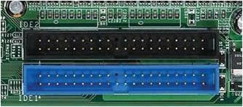

文件系统这个名词大家都很陌生，不过如果说成分区，大家就比较容易理解了。原先每个分区只能格式化为一个文件系统，所以我们可以认为文件系统就是指分区。不过随着技术的进步，现在一个文件系统可以由几个分区组成，或者一个分区可以格式化为几个不同的文件系统，所以我们已经不能把文件系统和分区等同对待了。不过，为了便于理解，大家可以把文件系统想象成分区。下面会介绍硬盘的基本结构、Linux 中常见的文件系统，`fdisk` 命令分区和 swap 分区的手工分配等内容。

## 硬盘结构

硬盘是计算机的主要外部存储设备。计算机中的存储设备种类非常多，常见的主要有软盘、硬盘、光盘、U 盘等，甚至还有网络存储设备 SAN、NAS 等，不过我们使用最多的还是硬盘。

如果从存储数据的介质上来区分，那么硬盘可以分为**机械硬盘**（Hard Disk Drive，HDD）和**固态硬盘**（Solid State Disk，SSD），机械硬盘采用磁性碟片来存储数据，而固态硬盘是通过闪存颗粒来存储数据的。

### 机械硬盘

1. **机械硬盘的物理结构**

我们先来看看最常见的机械硬盘。机械硬盘的外观大家可能都见过，那么机械硬盘拆开后是什么样子的呢？如图15-1 所示。

::: center


**图15-1	<u>机械硬盘结构</u>**

:::

机械硬盘主要由**磁盘盘片、磁头、主轴与传动轴等**组成，我们的数据就存放在磁盘盘片当中。大家见过老式的留声机吗？留声机上使用的唱片和我们的磁盘盘片非常相似，只不过留声机只有一个磁头，而硬盘是上下双磁头，盘片在两个磁头中间高速旋转，类似图15-2。

::: center


**图15-2	<u>磁盘盘片</u>**

:::

也就是说，机械硬盘是上下盘面同时进行数据读取的。而且机械硬盘的旋转速度要远高于唱片（目前机械硬盘的常见转速是 7200 r/min），所以机械硬盘在读取或写入数据时，非常害怕晃动和磕碰。另外，因为机械硬盘的超高转速，如果内部有灰尘，则会造成磁头或盘片的损坏，所以机械硬盘内部是封闭的，如果不是在无尘环境下，则禁止拆开机械硬盘。

2. **机械硬盘的逻辑结构**

我们已经知道数据是写入破盘盘片的，那么数据是按照什么结构写入的呢？机械硬盘的逻辑结构主要分为**磁道、扇区和柱面**。我们来看看图15-3。

::: center


**图15-3	<u>磁道和扇区</u>**

:::

**什么是磁道呢**？每个盘片都在逻辑上拥有很多的同心圆，最外面的同心圆就是 0 磁道。我们将每个同心圆称作磁道（注意，磁道只是逻辑结构，在盘面上并没有真正的同心圆）。硬盘的磁道密度非常高，通常一面上就有上千个磁道。但是相邻的磁道之间并不是紧挨着的，这是因为磁化单元相隔太近会相互产生影响。

**那扇区又是什么呢**？扇区其实是很形象的，大家都见过折叠的纸扇吧，纸扇打开后是半圆形或扇形的，不过这个扇形是由每个扇骨组合形成的。在磁盘上每个同心圆是磁道，从圆心向外呈放射状地产生分割线（扇骨），将每个磁道等分为若干弧段，每个弧段就是一个扇区。每个扇区的大小是固定的，为 **512 Byte**。扇区也是磁盘的最小存储单位。

**那柱面又是什么呢**？如果硬盘是由多个盘片组成的，每个盘面都被划分为数目相等的磁道，那么所有盘片都会从外向内进行磁道编号，最外侧的就是 0 磁道。具有相同编号的磁道会形成一个圆柱，这个圆柱就被称作磁盘的柱面，如图15-4 所示。

::: center


**图15-4	<u>柱面</u>**

:::

硬盘的大小是使用“**磁头数×柱面数×扇区数×每个扇区的大小**”这样的公式来计算的。

其中，磁头数（Heads）表示硬盘共有几个磁头，也可以理解为硬盘有几个盘面，然后乘以 2；柱面数（Cylinders）表示硬盘每面盘片有几条磁道；扇区数（Sectons）表示每条磁道上有几个扇区；每个扇区的大小一般是 512 Byte。

3. **硬盘的接口**

机械硬盘通过接口与计算机主板进行连接。硬盘的读取和写入速度与接口有很大关系。大家都见过大礼堂吧，大礼堂中可以容纳很多人，但是如果只有一扇很小的门，那么人是很难进入或出来的，这样会造成拥堵，甚至会出现事故。机械硬盘的读取和写入也是一样的，如果接口的性能很差，则同样会影响机械硬盘的性能。目前我们常见的机械硬盘接口有这样几种。

- IDE 硬盘接口（Integrated Drive Electronics，并口，即电子集成驱动器）也称作“ATA 硬盘”或“PATA 硬盘”，是早期机械硬盘的主要接口，ATA133 硬盘的理论速度可以达到 133MB/s（此速度为理论平均值)，IDE 硬盘接口如图15-5 所示。

::: center



**图15-5	<u>IDE 硬盘接口</u>**

:::

- SATA 接口（Serial ATA，串口）是速度更高的硬盘标准，具备了更高的传输速度，并具备了更强的纠错能力。目前已经是 SATA 三代，理论传输速度达到 600MB/s（此速度为理论平均值)，如图15-6 所示。

::: center


**图15-6	<u>SATA 硬盘接口</u>**

:::

- SCSI 接口（Small Computer System Interface，小型计算机系统接口）广泛应用在服务器上，具有应用范围广、多任务、带宽大、CPU 占用率低及支持热插拔等优点，理论传输速度达到 320MB/s，如图15-7 所示。

::: center


**图15-7	<u>SCSI 硬盘接口</u>**

:::

- M.2 接口（也就是以前经常提到的 NGFF，即 Next Generation Form Factor）是为超极本（Ultrabook）量身定做的新一代接口标准接口。无论规格尺寸，还是传输性能，都有很大的提升，理论带宽最大可达 4GB/s，如图15-8 所示。

::: center


**图15-8	<u>M.2 硬盘接口</u>**

:::

### 固态硬盘

固态硬盘和传统的机械硬盘最大的区别就是不再采用盘片进行数据存储，而采用存储芯片进行数据存储。固态硬盘的存储芯片主要分为两种：一种是采用闪存作为存储介质的；另一种是采用 DRAM 作为存储介质的。目前使用较多的主要是采用闪存作为存储介质的固态硬盘，如图15-9 所示。

::: center


**图15-9	<u>固态硬盘</u>**

:::

固态硬盘和机械硬盘对比主要有以下一些特点，如表15-1 所示。

**表15-1	<u>固态硬盘和机械硬盘对比</u>**

| 对比项目  | 固态硬盘        | 机械硬盘     |
| --------- | --------------- | ------------ |
| 容量      | 较小            | **大**       |
| 读/写速度 | **极快**        | —般          |
| 写入次数  | 5000〜100000 次 | **没有限制** |
| 工作噪声  | **极低**        | 有           |
| 工作温度  | **极低**        | 较高         |
| 防震      | **很好**        | 怕震动       |
| 重量      | **低**          | 高           |
| 价格      | 高              | **低**       |

大家可以发现，固态硬盘因为丢弃了机械硬盘的物理结构，所以相比机械硬盘具有了低能耗、无噪声、抗震动、低散热、体积小和速度快的优势；不过价格相比机械硬盘更高，而且使用寿命有限。

## Linux 中常见的文件系统

硬盘是用来存储数据的，我们可以将其想象成柜子，只不过柜子是用来存储衣物的。分区就是把一个大柜子按照要求分割成几个小柜子（组合衣柜）；格式化就是在每个小柜子中打入隔断，决定每个隔断的大小和位置，然后在柜门上贴上标签，标签中写清楚每件衣服保存的隔断的位置和这件衣服的一些特性（比如衣服是谁的，衣服的颜色、大小等）。很多人认为格式化的目的就是清空数据，其实格式化是为了写入文件系统（就是在硬盘中打入隔断并贴上标签）。

### 文件系统的特性

我们已经知道了，格式化是为了规划和写入文件系统。那么，Linux 中的文件系统到底是什么？它是什么样子的呢？在 CentOS 6.3 系统中默认的文件系统是 ext4，它是 ext3 文件系统的升级版。ext4 文件系统在性能、伸缩性和可靠性方面进行了大量改进。ext4 文件系统的变化可以说是翻天覆地的，比如向下兼容 ext3、最大 1EB 文件系统和 16TB 文件、无限数量子目录、Extents 连续数据块概念、多块分配、延迟分配、持久预分配、快速 FSCK、日志校验、无日志模式、在线碎片整理、inode 增强、默认启用 banier 等。ext4 文件系统是由 Theodore Tso（ext3 的维护者）领导的开发团队实现的，并引入 2.6.19 内核中。

那么，文件系统到底是如何运作的呢？文件系统中除要保存文件的数据外，还要保存文件的属性，如文件的权限、所有者、属组和时间参数等内容。文件系统把文件的数据和属性分开存放，把文件的数据放入 date block 中（数据块，保存文件的具体数据。类似衣柜的隔断，用来真正保存衣物），把文件的属性保存在 inode 中（i 节点，保存文件属性，如权限、所有者、属组和时间参数等。类似衣柜门上贴的标签，标签中写入衣物的特性）。每个 block 和 inode 都有序列号，用来区分和编码。另外，还有一个 super block（超级块）用于记录整个文件系统的信息，如 inode 和 block 的总量、已经使用量和剩余量。总结一下：

- super block（超级块）：记录整个文件系统的信息，包括 block 与 inode 的总量、已经使用的 inode 和 block 的数量、未使用的 inode 和 block 的数量、block 与 inode 的大小，文件系统的挂载时间、最近一次的写入时间、最近一次的磁盘检验时间等。

- date block（数据块，也称作 block）：用来实际保存数据（柜子的隔断），block 的大小（1KB、2KB 或4KB）和数量在格式化后就已经决定，不能改变，除非重新格式化（在制作柜子的时候，隔断大小就已经决定，不能更改，除非重新制作柜子）。每个 block 只能保存一个文件的数据，如果文件数据小于一个 block 块，那么这个 block 的剩余空间不能被其他文件使用；如果文件数据大于一个 block 块，则要占用多个 block 块。Windows 中磁盘碎片整理工具的原理就是把一个文件占用的多个 block 块尽量整理到一起，这样可以加快读/写速度。

- inode （i 节点，柜门上的标签）：用来记录文件的权限（r、w、x)、文件的所有者和属组、文件的大小、文件的状态改变时间（ctime)、文件的最近一次读取时间（atime）、文件的最近一次修改时间（mtime)、文件的数据真正保存的 block 编号。每个文件需要占用一个 inode。

大家注意到了吗？在 inode 中并没有保存文件的文件名，那是因为文件名是文件所在目录的数据，所以保存在上一级目录的 block 中。还记得我们在讲权限命令的时候说过，要对文件的上一级目录拥有 w 权限，才能删除目录中的文件，就是因为文件名是保存在目录的 block 中的。

### Linux 支持的常见文件系统

Linux 系统能够支持的文件系统非常多，除 Linux 默认文件系统 ext2、ext3 和 ext4 之外，还能支持 fat16、fat32、NTFS（需要重新编译内核）等 Windows 文件系统。也就是说，Linux 可以通过挂载的方式使用 Windows 文件系统中的数据。Linux 所能够支持的文件系统在 `/usr/src/kemels/当前系统版本/fs` 目录中（需要在安装时选择），该目录中的每个子目录都是一个可以识别的文件系统。我们介绍较为常见的 Linux 支持的文件系统，如表15-2 所示。

**表15-2	<u>常见的 Linux 支持的文件系统</u>**

| 文件系统   | 描述                                                         |
| ---------- | ------------------------------------------------------------ |
| ext        | Linux 中最早的文件系统，由于在性能和兼容性上具有很多缺陷，现在已经很少使用 |
| ext2       | 是 ext 文件系统的升级版本，Red Hat Linux 7.2 版本以前的系统默认都是 ext2 文件系统。于 1993 年发布，支持最大 16TB 的分区和最大 2TB 的文件（1TB=1024GB=1024x1024KB） |
| ext3       | 是 ext2 文件系统的升级版本，最大的区别就是带日志功能，以便在系统突然停止时提高文件系统的可靠性。支持最大 16TB 的分区和最大 2TB 的文件 |
| ext4       | 是 ext3 文件系统的升级版。ext4 在性能、伸缩性和可靠性方面进行了大量改进。ext4 的变化可以说是翻天覆地的，比如向下兼容 ext3、最大 1EB 文件系统和 16TB 文件、无限数量子目录、Extents 连续数据块 概念、多块分配、延迟分配、持久预分配、快速 FSCK、日志校验、无日志模式、在线碎片整理、inode 增强、默认启用 barrier 等。它是 CentOS 6.3 的默认文件系统 |
| xfs        | 被业界称为最先进、最具有可升级性的文件系统技术，由 SGI 公司设计，目前最新的 CentOS 7 版本默认使用的就是此文件系统。 |
| swap       | swap 是 Linux 中用于交换分区的文件系统(类似于 Windows 中的虚拟内存)，当内存不够用时，使用交换分区暂时替代内存。一般大小为内存的 2 倍，但是不要超过 2GB。它是 Linux 的必需分区 |
| NFS        | NFS 是网络文件系统(Network File System)的缩写，是用来实现不同主机之间文件共享的一种网络服务，本地主机可以通过挂载的方式使用远程共享的资源 |
| iso9660111 | 光盘的标准文件系统。Linux 要想使用光盘，必须支持 iso9660 文件系统 |
| fat        | 就是 Windows 下的 fatl6 文件系统，在 Linux 中识别为 fat      |
| vfat       | 就是 Windows 下的 fat32 文件系统，在 Linux 中识别为 vfat。支持最大 32GB 的分区和最大 4GB 的文件 |
| NTFS       | 就是 Windows 下的 NTFS 文件系统，不过 Linux 默认是不能识别 NTFS 文件系统的，如果需要识别，则需要重新编译内核才能支持。它比 fat32 文件系统更加安全，速度更快，支持最大 2TB 的分区和最大 64GB 的文件 |
| ufs        | Sun 公司的操作系统 Solaris 和 SunOS 所采用的文件系统         |
| proc       | Linux 中基于内存的虚拟文件系统，用来管理内存存储目录 /proc   |
| sysfs      | 和 proc —样，也是基于内存的虚拟文件系统，用来管理内存存储目录 /sysfs |
| tmpfs      | 也是一种基于内存的虚拟文件系统，不过也可以使用 swap 交换分区 |

### 硬盘分区

1. **硬盘分区的类型**

不管是 Windows 系统还是 Linux 系统，可以识别的分区类型就是以下三种，如图15-10 所示。

::: center


**图15-10	<u>分区示意图1</u>**

:::

- 主分区：最多只能分为4个。

- 扩展分区：只能有一个，也算作主分区的一种，也就是说主分区加扩展分区最多有 4 个。但是扩展分区不能存储数据和进行格式化，必须再划分成逻辑分区才能使用。
- 逻辑分区：逻辑分区是在扩展分区中划分的。如果是 IDE 硬盘，那么 Linux 最多支持 59 个逻辑分区；如果是 SCSI 硬盘，那么 Linux 最多支持 11 个逻辑分区。

### Linux 中硬盘与分区的表示方式

我们知道，在 Linux 系统中，所有内容都是以文件方式保存的。硬盘和分区也是一样的。我们使用“sd”代表 SCSI 或 SATA 硬盘，使用“hd”代表 IDE 硬盘。使用“1～4”代表主分区或者扩展分区，使用“5～59”代表逻辑分区。也就是说，如果按照上图所示的方式来分区，那么分区的设备文件名就如表15-3 所示。

**表15-3	<u>分区的设备文件名1</u>**

| 分区       | 设备文件名  |
| ---------- | ----------- |
| 主分区 1   | `/dev/sda1` |
| 主分区 2   | `/dev/sda2` |
| 主分区 3   | `/dev/sda3` |
| 扩展分区   | `/dev/sda4` |
| 逻辑分区 1 | `/dev/sda5` |
| 逻辑分区 2 | `/dev/sda6` |
| 逻辑分区 3 | `/dev/sda7` |

如果采用图15-11 所示的方式来分区，那么分区的设备文件名就如表15-4 所示。

::: center


**图15-11	<u>分区示意图2</u>**

:::

**表15-4	<u>分区的设备文件名2</u>**

| 分区       | 设备文件名  |
| ---------- | ----------- |
| 主分区 1   | `/dev/sda1` |
| 扩展分区   | `/dev/sda2` |
| 逻辑分区 1 | `/dev/sda5` |
| 逻辑分区 2 | `/dev/sda6` |
| 逻辑分区 3 | `/dev/sda7` |

对于第二种分区方式，虽然主分区和扩展分区加起来只有两个，但是分区号 3 和分区号4 就算空着也不能被逻辑分区占用。也就是说，不管怎么分区，逻辑分区一定是从 `/dev/sda5`开始计算的。

## 文件系统常用命令

我们先来学习一下文件系统相关的常用命令，只有知道了这些命令，才能有效地管理我们的文件系统。

### 文件系统查看命令：df

通过 `df` 命令可以查看已经挂载的文件系统的信息，包括设备文件名、文件系统总大小、已经使用的大小、剩余大小、使用率和挂载点等。命令格式如下：

```shell
[root@localhost ~]# df [选项] [挂载点或分区设备文件名]
选项:
	-a	：显示所有文件系统信息，包括特殊文件系统，如 /proc、/sysfs
	-h	：使用习惯单位显示容量，如 KB、MB 或 GB 等
	-T	：显示文件系统类型
	-m	：以 MB 为单位显示容量
	-k	：以 KB 为单位显示容量。默认以 KB 为单位
```

举几个例子。

```shell
# 例子 1 ：显示系统内的文件系统信息
[root@localhost ~]# df
文件系统		1K-块		已用		可用		已用%	挂载点
/dev/sda3	28744836	2243516	25041148	9%	/
tmpfs		515396		515396	0			0%	/dev/shm
#内存虚拟出来的磁盘空间
/dev/sdal	198337		26333	161764		14%	/boot
```

说明一下命令的输出结果。

> 第一列：设备文件名。
>
> 第二列：文件系统总大小，默认以 KB 为单位。
>
> 第三列：已用空间大小。
>
> 第四列：未用空间大小。
>
> 第五列：空间使用百分比。
>
> 第六列：文件系统的挂载点。

```shell
# 例子 2：
[root@localhost ~]# df -ahT
#	-a：显示特珠文件系统，这些文件系统几乎都是保存在内存中的，如 /proc。因为是挂载在内存中的，所以占用量都是0
#	-h：单位不再只用 KB，而是換算成习惯单位
#	-T：多出了文件系统类型一列
文件系统			类型				容量		已用		可用		已用%	挂载点
/dev/sda3	  ext4				28G  	2.2G	24G		9% 		/
sysfs         sysfs         	0		0    	0     	- 		/sys
proc          proc          	0   	0     	0     	- 		/proc
devpts        devpts        	0		0       0    	- 		/dev/pts
tmpfs         tmpfs         	394M  	1.5M  	393M    1% 		/run
/dev/sda1     ext4          	194M   	26M   	158M   	14% 	/boot
none          binfmt_misc		0   	0   	0      	- 		/proc/sys/fs/bintmt_misc
sunrpe        rpe_pipersivar	0   	0   	0     	- 		/lib/nfs/rpe_pipefs
/dev/sro      iso9660       	3.5G 	3.5G	0  		100% 	/mnt/cdrom
```

### 统计目录或文件所占磁盘空间大小命令：du

1. **du命令**

`du` 是统计目录或文件所占磁盘空间大小的命令，需要注意的是，使用 `ls -l` 命令是可以看到文件的大小的。但是大家会发现，在使用 `ls -l` 命令查看目录大小时，目录的大小多数是 4KB，这是因为目录下的子目录名和子文件名是保存到父目录的 block （默认大小为 4KB）中的，如果父目录下的子目录和子文件并不多，一个 block 就能放下，那么这个父目录就只占用了一个 block 大小。大家可以将其想象成图书馆的书籍目录和实际书籍。如果我们用 `ls -l` 命令查看，则只能看到这些书籍占用了 1 页纸的书籍目录，但是实际书籍到底有多少是看不到的，哪怕它堆满了几个房间。

但是我们在统计目录时，不是想看父目录下的子目录名和子文件名到底占用了多少空间，而是想看父目录下的子目录和子文件的总磁盘占用量大小，这时就需要使用 `du` 命令才能统计目录的真正磁盘占用量大小。`du` 命令的格式如下：

```shell
[root@localhost ~]# du [选项] [目录成文件名]
选项：
	-a	：显示每个子文件的磁盘占用量。默认只统计子目录的磁盘占用量
	-h	：使用习惯单位显示磁盘占用量，如 KB、MB 或 GB 等
	-s	：统计息磁盘占用量，而不列出子目录和子文件的磁盘占用量
```

举几个例子。

```shell
# 例子 1：
[root@localhost ~]# du
#统计统计当前目录的总磁盘占用量的大小，同时会统计当前目录下所有子目录的磁盘占用量大小，不统计子文件磁盘占用量大小，默认单位为 KB1
20		./.gnupg			<---统计每个子目录的大小
24		./yum.bak
8		./dtest
28		./sh
188		.					<---统计当前目录的大小

# 例子 2：
[root@localhost ~]# du -a
#统计当前目录的总大小，同时会统计当前目录下所有子文件和子目录磁盘占用量的大小。默认单位为 KB
4		./.bash_logout
36		./install.l0g
4		./.bash_profile
4		./.cshrc
...省略部分输出...
188		.

# 例子 3：
[root@localhost ~]# du -sh
#只统计磁盘占用量总的大小，同时使用习惯单位显示
188K	.
```

2. **du 命令和 df 命令的区别**

有时我们会发现，使用 `du` 命令和 `df` 命令去统计分区的使用情况时，得到的数据是不一样的。那是因为 `df` 命令是从文件系统的角度考虑的，通过文件系统中未分配的空间来确定文件系统中已经分配的空间大小。也就是说，在使用 `df` 命令统计分区时，不仅要考虑文件占用的空间，还要统计被命令或程序占用的空间（最常见的就是文件已经删除，但是程序并没有释放空间）。而 `du` 命令是面向文件的，只会计算文件或目录占用的磁盘空间。也就是说，`df` 命令统计的分区更准确，是真正的空闲空间。

### 挂载和卸载命令：mount 和 umount

Linux 中所有的存储设备都必须在挂载之后才能使用，包括硬盘、U 盘和光盘（swap 分区是系统直接调用的，所以不需要挂载）。不过，硬盘分区在安装时就已经挂载了，而且会在每次系统启动时自动挂载，所以不需要手工参与。但是在 Linux 系统中要想使用光盘和 U 盘，就需要学一些挂载命令。

我们还需要复习一下，挂载是指把硬盘分区（如分区 `/dev/sdb1`，其实指的是文件系统）和挂载点（已经建立的空目录）联系起来的过程。这里需要注意，挂载点必须是目录，而且原则上应该使用空目录作为挂载点。

如果不使用空目录作为挂载点，而使用已经有数据的目录（如 `/etc/` 目录）作为挂载点，则会出现什么情况呢？很简单，原先 `/etc/` 目录下的数据就查找不到了，在 `/etc/` 目录中只能看到新的分区中的数据。这是因为 `/etc/` 目录原先并不是单独的分区，而是 `/` 分区的子目录，所以 `/etc/` 目录中的数据实际上保存在 `/` 分区的 block 中。但是现在给 `/etc/` 目录单独分区了，再向 `/etc/` 目录中保存数据，就会保存在 `/etc/` 目录的新分区的 blok 中，那么原始数据当然就不能看到了。如果还想访问原始数据，则只能把新分区卸载掉。

1. **mount命令的基本格式**

说了这么多，`mount` 命令的具体格式如下：

```shell
[root@localhost ~]# mount [-l]
#查询系统中已经挂载的设备，-l 会显示卷标名称
[root@localhost ~]# mount -a
#依据配置文件 /etc/fstab 的内容，自动挂载

[root@localhost ~]# mount [-t 文件系统] [-L 卷标名] [-o 特殊选项] 设备文件名 挂载点
选项：
	-t 文件系统	：加入文件系统类型来指定挂载的类型，可以是 ext3、ext4、iso9660 等文件系统，具体可以参考---Linux 支持的常见文件系统的表
	-L 卷标名	：挂载指定卷标的分区，而不是安装设备文件名挂载
	-o 特殊选项	：可以指定挂载的额外选项，比如读写权限、同步/异步等，如果不指定,则默认值生效。具体的特殊选项参见表15-5
	
```
**表15-5	<u>mount 命令挂载特殊选项</u>**

| 选项          | 说明                                                         |
| ------------- | ------------------------------------------------------------ |
| atime/noatime | 更新访问时间/不更新访问时间。在访问分区文件时，是否更新文件的访问时间，默认为更新 |
| async/sync    | 异步/同步，默认为异步                                        |
| auto/noauto   | 自动/手动。如 `mount -a` 命令执行时，是否会自动安装 `/etc/fstab` 文件内容挂载，默认为自动 |
| default       | 定义默认值，相当于 rw、suid、dev、exec、auto，nouser、async 这 7个选项 |
| exec/noexec   | 执行/不执行。设定是否允许在文件系统中执行可执行文件，默认是允许 |
| remount       | 重新挂载已经挂载的文件系统，一般用于指定修改特殊权限         |
| rw/ro         | 读写/只读。文件系统挂载时，是否拥有读写权限，默认是rw        |
| suid/nosuid   | 具有/不具有 SetUID 权限。设定文件系统是否拥有 SetUID 和 SetGID 权限，默认是拥有 |
| user/nouser   | 允许/不允许普通用户挂载。设定文件系统是否允许普通用户挂载，默认是不允许，只有 root 可以挂载分区 |
| usrquota      | 代表文件系统支持用户磁盘配额，默认不支持                     |
| grpquota      | 代表文件系统支持组磁盘配额，默认不支持                       |

```shell
# 例子 1：
[root@localhost ~]# mount
#查看系统中已经挂载的文件系统，注意有虚拟文件系统
/dev/sda3 on / type ext4 (rw,relatime,errors=remount-ro)
sysfs on /sys type sysfs (rw,nosuid,nodev,noexec,relatime,seclabel)
proc on /proc type proc (rw,nosuid,nodev,noexec,relatime)
devtmpfs on /dev type devtmpfs (rw,nosuid,seclabel,size=495400k,nr_inodes=123850,mode=755)
tmpfs on /dev/shm type tmpfs (rw,nosuid,nodev,seclabel)
/dev/sda1 on /boot type xfs (rw,relatime,seclabel,attr2,inode64,noquota)
#命令结果表示：将 /dev/sda3 分区挂载到 / 目录，文件系统是 etx4，权限是读写 rw

# 例子 2：修改特殊权限
[root@localhost ~]# mount
#我们查看到 /boot 分区已经被挂载了，而且采用的是 defaults 选项，那么我们重新挂载分区，并采用 noexec 权限禁止执行文件执行，看看会出现什么情况（注意不要用 / 分区做实验，否则系统命令也就不能执行了
...省略部分输出...
/dev/sdal on /boot type ext4 (rw)
...省略部分输出...
[root@localhost ~]# mount -o remount,noexec /boot
#重新挂载 /boot 分区，并使用 noexec 权限
[root@localhost ~]# cd /boot/
[root@localhost boot]# vi hello.sh
#写一个 Shell 吧
#!/bin/bash 
echo "hello!!"
[root@localhost boot]# chmod 755 hello.sh
[root@localhost boot]# ./hello.sh
-bash: ./hello.sh: 权限不够
#虽然赋予了 hello.sh 执行权限，但是仍然无法执行
[root@localhost boot]# mount -o remount,exec /boot
#记得改回来，否则会影响系统启动
```

如果我们做实验修改了特殊选项，那一定要记住，而且确定需要修改；否则非常容易出现系统问题，而且还找不到问题的根源。

```shell
# 例子 3：挂载分区
[root@localhost ~]# mkdir /mnt/diskl
#建立挂载点目录
[root@localhost ~]# mount /dev/sdbl /mnt/disk1
#挂载分区
```

`/dev/sdb1` 分区还没有被划分。我们在这里只看看挂载分区的方式，非常简单，甚至不需要使用“-text4”命令指定文件系统，因为系统是可以自动检测的。

2. **挂载光盘**

在 Windows 中如果想要使用光盘，则只需把光盘放入光驱，单击使用即可。但是在 Linux 中除了要把光盘放入光驱，而且必须在挂载之后才能正确使用。还要记得用完光盘后也不能像 Windows 一样，直接弹出光驱取出光盘，而必须先卸载才能取出光盘（确实不如 Windows 方便，不过这也只是一个操作习惯，习惯了就好）。挂载命令如下（当然要记得在 Linux 中放入光盘)：

```shell
[rootelocalhost ~]# mkdir /mnt/cdrom/
#建立挂截点
[root@localhost ~]# mount -t iso9660 /dev/cdrom /mnt/cdrom/
#挂载光盘

#光盘的文件系统是 iso9660，不过这个文件系统可以省略不写，系统会自动检测，命令如下：
[root@localhost ~]# mount /dev/cdrom /mnt/cdrom/
#挂载光盘。两个挂载光盘的命令使用一个就可以了
[root@localhost ~]# mount
#查看已经挂载的设备
...省略部分输出...
/dev/sr0 on /mnt/cdrom type iso9660 (ro)
#光盘已经挂载了，但是挂载的设备文件名是 /dev/sr0
```

我们已经知道挂载就是把光驱的设备文件和挂载点连接起来。挂载点 `/mn/cdrom` 是我们手工建立的空目录，我个人习惯把挂载点建立在 `/mnt` 目录中，因为我们在学习 Linux 的时候是没有 `/media/` 目录的，大家要是愿意也可以建立 `/media/cdrom` 作为挂载点，只要是已经建立的空目录都可以作为挂载点。那么 `/dev/cdrom` 就是光驱的设备文件名，不过注意 `/dev/cdrom` 只是一个软链接。命令如下：

```shell
[root@localhost ~]# ll /dev/cdrom 
lrwxrwxrwx 1 root root 3 1月 31 01:13 /dev/cdrom -> sro
```

`/dev/cdrom` 的源文件是 `/dev/sr0`。`/dev/sr0` 是光驱的真正设备文件名，代表 SCSI 接口或 SATA接口的光驱，所以刚刚查询挂载时看到的光驱设备文件命令是 `/dev/sr0`。也就是说，挂载命令也可以写成这样：

```shell
[root@localhost ~]# mount /dev/sr0 /mnt/cdrom/
```

其实光驱的真正设备文件名是保存在 `/proc/sys/dev/cdrom/info` 文件中的，所以可以通过查看这个文件来查询光盘的真正设备文件名，命令如下：

```shell
[root@localhost ~]# cat /proc/sys/dev/cdrom/info
CD-ROM information, Id: cdrom.c 3.20 2003/12/17
drive name:				sr0
...省略部分输出...
```

3. **挂载 U 盘**

其实挂载 U 盘和挂载光盘的方式是一样的，只不过光盘的设备文件名是固定的（`/dev/sr0` 或 `/dev/cdrom`），而 U 盘的设备文件名是在插入U盘后系统自动分配的。因为 U 盘使用的是硬盘的设备文件名，而每台服务器上插入的硬盘数量和分区方式都是不一样的，所以 U 盘的设备号需要单独检测与分配，以免和硬盘的设备文件名产生冲突。U 盘的设备文件名是系统自动分配的，我们只要查找出来然后挂载就可以了。

首先把 U 盘插入 Linux 系统中（注意：如果是虚拟机，则需要先把鼠标点入虚拟机再插入 U 盘)，然后就可以使用 `fdisk` 命令查看 U 盘的设备文件名了。命令如下：

```shell
[root@localhost ~]# fdisk -l

Disk /dev/sda: 21.5 GB, 21474836480 bytes
#系统硬盘
...省略部分输出...
Disk /dev/sdb： 8022 MB, 8022654976 bytes
#这就是识别的口盘，大小为 8GB
94 heads, 14 sectors/track, 11906 cylinders
Units = cylinders of 1316 * 512 = 673792 bytes
Sector size (logical/physical): 512 bytes / 512 bytes
I/O size (minimum/optimal): 512 bytes / 512 bytes
Disk identifier: Ox00000000
Device Boot		start		End		Bloks		Id		System
/dev/sab1		1			11907	7834608		b		W95 FAT32
#系统给 U盘分配的设备文件名
```

查看到 U 盘的设备文件名，接下来就要创建挂载点了。命令如下：

```shell
[rootelocalhost ~]# mkdir /mnt/usb
```

然后就是挂载了，挂载命令如下：

```shell
[root@localhost ~]# mount -t vfat /dev/sdbl /mnt/usb/
#挂载U盘。因为是 Windows 分区，所以是 vfat 文件系统格式
[root@localhost ~]# cd /mnt/usb/
#去挂载点访问 U盘数据
[root@localhost usb]# ls 
??		?????	????(5).xls			DSC_5843.jpg		??VCR(?).mp4
??		1111111????????.xls		???????.BD??1280??????.rmvb		J02		????.wps
#之所以出现乱码，是因为编码格式不同
```

之所以出现乱码，是因为 U 盘是 Windows 中保存的数据，而 Windows 中的中文编码格式和 Linux 中的不一致，只需在挂载的时候指定正确的编码格式就可以解决乱码问题，命令如下：

```shell
[root@localhost ~]# mount -t vfat -o iocharset=utf8 /dev/sdbl /mnt/usb/
#挂载 U盘。指定中文编码格式为 UTF-8
[root@localhost ~]# cd /mnt/usb/
[root@localhost usb]# ls
1111111		年度总结及计划表.xls	ZsyquMLToskarnodahsur6.mp4		协议书
12月21日.doc		恭喜发财（定）.mp4		新年VCR（定）.mp4
#可以正确地查看中文了
```

因为我们的 Linux 在安装时采用的是 UTTF-8 编码格式，所以要让 U 盘在挂载时也指定为 UTF-8 编码格式，才能正确显示。

```shell
[root@localhost ~]# echo $LANG
zh_CN.UTF-8
#查看一下 Linux 默认的编码格式
```

::: tip 注意

Linux 默认是不支持 NTFS 文件系统的，所以默认是不能挂载 NTFS 格式的移动硬盘的。

要想让 Linux 支持移动硬盘，主要有三种方法：

- 一是重断编译内核，加入 ntfs 模块，然后安装 ntfs 模块即可；
- 二是不自己编译内核，而是下载已经编译好的内核，直接安装即可；
- 三是安装 NTFS 文件系统的第三方插件，也可以支持 NTFS 文件系统。

:::

4. **卸载命令**

光盘和 U 盘使用完成后，在取出之前都要卸载。不过，硬盘分区是否需要卸载取决于你下次是否还需要使用，一般硬盘分区不用卸载。卸载命令如下：

```shell
[root@localhost ~]# umount 设备文件名或挂载点

[root@localhost ~]# umount /mnt/usb
#卸载 U盘
[root@localnost ~]# umount /mnt/cdrom
#卸载光盘
[root@localhost ~]# umount /dev/sr0
#命令加设备文件名同样是可以卸载的
```

卸载命令后面既可以加设备文件名也可以加挂载点，不过只能加一个，如果加了两个，如 `umount /dev/sr0 /mnt/cdrom`，就会对光驱卸载两次，当然卸载第二次的时候就会报错。另外，我们在卸载时有可能会出现以下情况：

```shell
[root@localhost ~]# mount /dev/sr0 /mnt/cdrom/
#挂载光盘
[root@localhost ~]# cd /mnt/cdrom/
#进入光盘挂载点
[root@localhost cdrom]# umount /mnt/cdrom
umount: /mnt/cdrom: device is busy.
```

这种报错是因为我们已经进入了挂载点，这时如果要卸载，那么登录用户应该放在什么位置呢？所以卸载时必须退出挂载目录。这也很好理解，如果我们踩着梯子爬到了三楼这么高，这时给你一把锯，请你把二楼的梯子锯断，那么我估计谁都不愿意，因为如果锯断了二楼，那么已经爬到三楼的用户怎么下来呢？所以要记得在退出挂载目录之后再进行卸载。

### 文件系统检测与修复命令： fsck

计算机系统难免会因为人为的误操作或系统的原因而出现死机或突然断电的情况，这种情况下非常容易造成文件系统的崩溃，严重时甚至会造成硬件损坏。这也是我们一直在强调的服务器一定要先关闭服务再进行重启的原因所在。

如果真出现了文件系统损坏的情况，难道就没有修复的办法吗？我们现在要讲的 `fsck` 命令就是用来进行文件系统检测与修复的，命令格式如下：

```shell
[root@localhost ~]# fsck [选项] 分区设备文件名
选项：
	-t 文件系统	：指定分区的文件系统
	-A			：按照配置文件 /etc/fstab 检查所有分区
	-a			：不用显示用户提示，自动修复文件系统
	-C			：显示检查分区的进度条
	-f			：强制检测。一般 fsck 命令如果没有发现分区有问题，则是不会检测的。如果强制检测，那么不管是否发现问题，都会检测
	-y			：自动修复。和 -a 作用一致，不过有些文件系统只支持 -y
```

如果想要修复某个分区，则只需执行如下命令：

```shell
[root@localhost ~]# fsck -y /dev/sdb1
#自动修复
```

### 显示磁盘状态命令：dumpe2fs

```shell
root@localhost ~]# dumpe2fs /dev/sda1
dumpe2fs 1.44.1 (24-Mar-2018)
Filesystem volume name:   <none>									<---卷标名
Last mounted on:          /										<---挂载点
Filesystem UUID:          0a5e044f-60e0-4e15-af8f-c6c5882f3425		<---UUID
Filesystem magic number:  0xEF53
Filesystem revision #:    1 (dynamic)
Filesystem features:      has_journal ext_attr resize_inode dir_index filetype needs_recovery extent 64bit flex_bg sparse_super large_file huge_file dir_nlink extra_isize metadata_csum
Filesystem flags:         signed_directory_hash 
Default mount options:    user_xattr acl							<---挂载参数
Filesystem state:         clean									<---文件系统状态，正常
Errors behavior:          Continue
Filesystem OS type:       Linux
Inode count:              2621440									<---inode 总数
Block count:              10485248									<---块总数
Reserved block count:     524262
Free blocks:              6357559
Free inodes:              1946492
First block:              0
Block size:               4096										<---块大小
Fragment size:            4096
Group descriptor size:    64
Reserved GDT blocks:      1024
Blocks per group:         32768
Fragments per group:      32768
Inodes per group:         8192
Inode blocks per group:   512
Flex block group size:    16
Filesystem created:       Fri Apr 23 16:13:19 2021
Last mount time:          Mon May 24 13:48:59 2021
Last write time:          Mon May 24 13:48:58 2021
Mount count:              12
Maximum mount count:      -1
Last checked:             Fri Apr 23 16:13:19 2021
Check interval:           0 (<none>)
Lifetime writes:          61 GB
Reserved blocks uid:      0 (user root)
Reserved blocks gid:      0 (group root)
First inode:              11
Inode size:	          	  256										<---inode 的大小
...省略部分输出...

组 0：(块 0-32767) 校验值 0x2929 [ITABLE_ZEROED]					<---第一个数据组的内容
  主 超级块位于 0，组描述符位于 1-5
  保留的GDT块位于 6-1029
  块位图位于 1030 (+1030)，校验值 0x30f35b5a
  Inode 位图位于 1046 (+1046)，校验值 0x6b19aa45
  Inode表位于 1062-1573 (+1062)
  19414 个可用 块，8176 个可用inode，2 个目录 ，8175个未使用的inodes
  可用块数： 13354-32767
  可用inode数： 15, 18-8192
...省略部分输出...
```

可以看到，使用 `dumpe2fs` 命令可以查询到非常多的信息，以上信息大致可分为 2 部分。

- 前半部分显示的是超级块的信息，包括文件系统名称、已使用以及未使用的 inode 和 block 的数量、每个 block 和 inode 的大小，文件系统的挂载时间等。

- 另外，Linux 文件系统（EXT 系列）在格式化的时候，会分为多个区块群组（block group），每 个区块群组都有独立的 inode/block/superblock 系统。此命令输出结果的后半部分，就是每个区块群组的详细信息（如 Group0、Group1）。

## 硬盘分区命令：fdisk

我们在安装操作系统的过程中已经对系统硬盘进行了分区，但如果新添加了一块硬盘，想要正常使用，难道需要重新安装操作系统才可以分区吗？

当然不是，在 Linux 中有专门的分区命令 `fdisk` 和 `parted`。其中 `fdisk` 命令较为常用，但不支持大于 2TB 的分区；如果需要支持大于 2TB 的分区，则需要使用 `parted` 命令，当然 `parted` 命令也能分配较小的分区。我们先来看看如何使用 `fdisk` 命令进行分区。

### 命令格式

fdisk 命令的格式如下：

```shell
[root@localhost ~]# fdisk ~l
#列出系统分区
[root@localhost ~]# fdisk 设备文件名
#给硬盘分区
```

注意，千万不要在当前的硬盘上尝试使用 `fdisk`，这会完整删除整个系统，一定要再找一块硬盘，或者使用虚拟机。

1. **查看所有分区信息**

```shell
[root@localhost ~]# fdisk -l
#查询本机可以识别的硬盘和分区
Disk /dev/sda:32.2 GB, 32212254720 bytes
#硬盘文件名和硬盘大小
255 heads, 63 sectors/track, 3916 cylinders
#共255个磁头、63个扇区和3916个柱面
Units = cylinders of 16065 *512 = 8225280 bytes
#每个柱面的大小
Sector size (logical/physical): 512 bytes/512 bytes
#每个扇区的大小
I/O size (minimum/optimal): 512 bytes/512 bytes
Disk identifier: 0x0009e098

Device Boot Start End Blocks ld System
/dev/sda1 * 1 26 204800 83 Linux
Partition 1 does not end on cylinder boundary.
#分区1没有占满硬盘
/dev/sda2 26 281 2048000 82 Linux swap / Solaris
Partition 2 does not end on cylinder boundary
#分区2没有占满硬盘
/dev/sda3 281 3917 29203456 83 Linux
#设备文件名启动分区 起始柱面 终止柱面容量 ID 系统

Disk /dev/sdb: 21.5 GB, 21474836480 bytes 
#第二个硬盘识别，这个硬盘的大小
255 heads, 63 sectors/track, 2610 cylinders
Units = cylinders of 16065 * 512 = 8225280 bytes
Sector size (logical/physical): 512 bytes / 512 bytes
I/O size (minimum/optimal): 512 bytes/512 bytes
Disk identifier: 0x00000000
```

使用 `fdisk -l` 查看分区信息，能够看到我们添加的两块硬盘（`/dev/sda` 和 `/dev/sdb`）的信息。我们解释一下这些信息，其上半部分态是硬盘的整体状态，`/dev/sda` 硬盘的总大小是 32.2 GB，共有 3916 个柱面，每个柱面由 255 个磁头读/写数据，每个磁头管理 63 个扇区。每个柱面的大小是 8225280 Bytes，每个扇区的大小是 512 Bytes。

信息的下半部分是分区的信息，共 7 列，含义如下：

- Device：分区的设备文件名。

- Boot：是否为启动引导分区，在这里 `/dev/sda1` 为启动引导分区。

- Start：起始柱面，代表分区从哪里开始。

- End：终止柱面，代表分区到哪里结束。

- Blocks：分区的大小，单位是 KB。

- id：分区内文件系统的 ID。在 `fdisk` 命令中，可以 使用 "i" 查看。

- System：分区内安装的系统是什么。

如果这个分区并没有占满整块硬盘，就会提示 "Partition 1 does not end on cyl inder boundary"，表示第一个分区没有到硬盘的结束柱面。大家发现了吗？`/dev/sda` 已经分配完了分区，没有空闲空间了。而第二块硬盘 `/dev/sdb` 已经可以被识别了，但是没有可分区。


2. **fdisk 交互命令**

我们以硬盘 `/dev/sdb` 为例来做练习，命令如下:

```shell
[root@localhost ~]# fdisk /dev/sdb
#给 /dev/sdb 分区
Device contains neither a valid DOS partition table, nor Sun, SGI or OSF disklabel
Building a new DOS disklabel with disk identifier 0xed7e8bc7.
Changes will remain in memory only, until you decide to write them.
After that, of course, the previous content won't be recoverable.
Warning: invalid flag 0x0000 of partition table 4 will be corrected by w(rite)
WARNING: DOS-compatible mode is deprecated.it's strongly recommended to switch off the mode (command 'c') and change display units to sectors (command 'u').
Command (m for help):m
#交互界面的等待输入指令的位置，输入 m 得到帮助
Command action
#可用指令
a toggle a bootable flag
b edit bsd disklabel
c toggle the dos compatibility flag
d delete a partition
I list known partition types m print this menu
n add a new partition
o create a new empty DOS partition table
p print the partition table
q quit without saving changes
s create a new empty Sun disklabel
t change a partition's system id
u change display/entry units
v verity the partition table
w write table to disk and exit
x extra functionality (experts only)
```

注意这里的分区命令是 `fdisk /dev/sdb`，这是因为硬盘并没有分区，使用 `fdisk` 命令的目的就是建立分区。

在 fdisk 交互界面中输入 m 可以得到帮助，帮助里列出了 fdisk 可以识别的交互命令，我们来解释一下这些命令，如表15-6 所示。

**表15-6	<u>fdisk 交互命令</u>**

| 命令 | 说 明                                                        |
| ---- | ------------------------------------------------------------ |
| a    | 设置可引导标记                                               |
| b    | 编辑 bsd 磁盘标签                                            |
| c    | 设置 DOS 操作系统兼容标记                                    |
| d    | 删除一个分区                                                 |
| 1    | 显示已知的文件系统类型。82 为 Linux swap 分区，83 为 Linux 分区 |
| m    | 显示帮助菜单                                                 |
| n    | 新建分区                                                     |
| 0    | 建立空白 DOS 分区表                                          |
| P    | 显示分区列表                                                 |
| q    | 不保存退出                                                   |
| s    | 新建空白 SUN 磁盘标签                                        |
| t    | 改变一个分区的系统 ID                                        |
| u    | 改变显示记录单位                                             |
| V    | 验证分区表                                                   |
| w    | 保存退出                                                     |
| X    | 附加功能（仅专家）                                           |


3. **新建主分区**

下面我们实际建立一个主分区，看看过程是什么样子的。命令如下：

```shell
[root@localhost ~]# fdisk /dev/sdb
...省略部分输出....
Command (m for help): P					<---显示当前硬盘的分区列表
Disk /dev/sdb: 21.5 GB, 21474836480 bytes
255 heads, 63 sectors/track, 2610 cylinders
Units = cylinders of 16065 * 512 = 8225280 bytes
Sector size (logical/physical): 512 bytes / 512 bytes
I/O size (minimum/optimal):512 bytes / 512 bytes
Disk identifier： Oxb4b0720c

Device Boot		start		End		Blocks		Id		iSystem4
#目前一个分区都没有

Command (m for help): n					<---那么我们新建一个分区
Command action							<---指定分区类型
	e	extended						<---扩展分区
    p	primary partition (1-4)			<---主分区
p										<---这里选择 p，建立一个主分区
Partition number (1-4): 1				<---选择分区号，范围为1～4。这里选择 1
First cylinder (1-2610, default 1):	<---分区的起始柱面，默认从 1 开始。因为要从硬盘头开始分区，所以直接回车了
Using default value 1					<---提示使用的是默认值 1
Last cylinder,+cylinders or +size{K,M,G}(1-2610, default 2610)：+5G
#指定硬盘大小。可以按照柱面指定（1～2610）我们对柱面不熟悉，那么可以使用 +size(K,M,G)的方式指定硬盘大小。这里指定 +5G，建立一个 5GB 大小的分区
Command (m for help):
#主分区就建立了，又回到了 fdisk 交互界面的提示符
Command (m for help):p					<---查询一下新建立的分区
Disk /dev/sdb: 21.5 GB, 21474836480 bytes
255 heads,63 sectors/track, 2610 cylinders
Units = cylinders of 16065 * 512/= 8225280 bytes
Sector size (logical/physical): 512 bytes / 512 bytes
I/O size (minimum/optimal):512 bytes / 512 bytes
Disk identifier: Oxb4b0720c
Device Boot

Device Boot		start		End		Blocks		Id		System
/dev/sdb1			1		654		5253223+ 	83 		Linux
# /dev/sdb1 已经建立了
```

建立主分区的过程就是这样的，总结一下就是 `fdisk 硬盘名 → n（新建）→ p（建立主分区）→ 1（指定分区号）→ 回车（默认从 1 柱面开始建立分区）→ +5G（指定分区大小)`。当然，我们的分区还没有格式化和挂载，所以还不能使用。

3. **新建扩展分区**

这次我们建立一个扩展分区。还记得吗？主分区和扩展分区加起来最多只能建立4个，而扩展分区最多只能建立1 个。扩展分区的建立命令如下：

```shell
Command (m for help); n					<---新建立分区
command action
	e	extended
	p	primary partition (1-4)
e										<---这次建立扩展分区
Partition number (1-4): 2				<---给扩展分区指定分区号 2
First cylinder (655-2610, default 655):
#扩展分区的起始柱面。刚刚建立的主分区1 已经占用了1～654个柱面，所以我们从 655 开始建立
#注意：如果没有特殊要求，则不要跳开柱面建立分区，应该紧挨着建立分区
using default value 655					<---提示使用的是默认值 655
Last cylinder, +cylinders or +sizelK,M,G}(655-2610, default 2610):
#这里把整块硬盘的剩余空间都建立为扩展分区
Using default value 2610
#提示使用的是默认值 2610
```

这里把 `/dev/sdb` 硬盘的所有剩余空间都建立为扩展分区，就是建立一个主分区，剩余空间都建立成扩展分区，再在扩展分区中建立逻辑分区。

4. **新建逻辑分区**

扩展分区是不能被格式化和直接使用的，所以还要在扩展分区内部再建立逻辑分区。我们来看看逻辑分区的建立过程，命令如下：

```shell
command (m for help)： n				<---建立新分区
Command action
	l	logical (5 or over)				<---因为扩展分区已经建立，所以这里变成了 l（logic）
	p	primary partition (1-4)
l										<---建立逻辑分区
First cylinder (655-2610, default 655):
#不用指定分区号，默认会从 5 开始分配，所以直接选择起始柱面
#注意：逻辑分区是在扩展分区内部再划分的，所以柱面是和扩展分区重叠的
Using default value 655
Last eylinder, +cylinders or +size(K,M,G)(655-2610, default 2610):+2G
#分配 2GB 大小
Command (m for help)： n				<---再建立一个逻辑分区
Command action
	l	logical (5 or over)
	p	primary partition (1-4)
l
First cylinder (917-2610, default 917)：
Using default value 917
Last cylinder, +cylinders or +size(K,M,G}(917-2610, default 2610):+2G

Command (m for help)：P					<---查看一下已经建立的分区
Disk /dev/sab: 21.5 GB, 21474836480 bytea
255 hends, 63 pectors/track, 2610 cylinders
Units = cylinders of 16065 * 512 = 8225280 bytes
sector sime (logical/physical): 512 bytes / 512 bytes
I/O size (mininum/optimal): 512 bytes / 512 bytes
Diek identifier: Oxb4b0720c

Device Boot		start		End		Blocks		Id		System
/dev/sdbl		1			654		15253223+ 	83 		Linux			<---主分区
/dev/sdb2		655			2610	15711570	5 		Extended		<---扩展分区
/dev/sdb5		655			916		2104483+	83		Linux			<---逻辑分区1
/dev/sdb6		917 		1178	2104483+ 	83 		Linux			<---逻辑分区2

Command (m for help): w					<---保存并退出
The partition cable has been aitered!

calling loctl() to re-read partition table.
Syncing disks.
[root@localhost ~]#
#退回到提示符界面
```

所有的分区在建立过程中如果不保存并退出是不会生效的，所以建立错了也没有关系，使用 q 命令不保存退出即可。如果使用了 w 命令，就会保存退出。有时因为系统的分区表正忙，所以需要重新启动系统才能使新的分区表生效。命令如下：

```shell
Command (m for help): w							<---保存并退出
The partition table has been altered!

Calling loctl() to re-read partition table.

WARNING: Re-reading the partition table failed with error 16:


Device or resource busy.
The kernel still uses the old table.
The new table will be used at the next reboot.	<---要求重新启动，才能格式化
Syncing disks.
```

看到了吗？必须重新启动！可是重新启动很浪费时间。如果不想重新启动，则可以使用 `partprobe` 命令。这个命令的作用是让系统内核重新读取分区表信息，这样就可以不用重新启动了。命令如下：

```shell
[root@localhost ~]# partprobe
```

如果这个命令不存在，则请安装 partied-2.1-18.el6.i686 这个软件包。`pariprobe` 命令不是必需的，如果没有提示重启系统，则直接格式化即可。

### 格式化分区

分区完成后，如果不格式化写入文件系统，则是不能正常使用的。所以我们需要使用 `mkfs` 命令进行格式化。命令格式如下：

```shell
[root@localhost ~]# mkfs [选项] 分区设备文件名
选项：
	-t 文件系统	：指定格式化的文件系统，如 ext3、ext4
```

我们刚刚建立了 `/dev/sdb1`（主分区)、`/dev/sdb2`（扩展分区）、`/dev/sdb5`（逻辑分区）和 `/dev/sdb6`（逻辑分区）这几个分区，其中 `/dev/sdb2` 不能被格式化。剩余的三个分区都需要格式化之后使用，这里我们格式化一个分区 `/dev/sdb6` 作为演示，其余分区的格式化方法一样。命令如下：

```shell
[root@localhost ~]# mkfs -t ext4 /dev/sdb6
mke2fs 1.41.12 (17-May-2010)
#文件系统标签=						<---这里指的是卷标名，我们没有设置卷标
操作系统:Linux
块大小=4096（log=2)
分块大小=4096 （log=2）
Stride=O blocks, Stripe width=0 blocks
131648 inodes, 526120 blocks
26306 blocks (5.00%) reserved for the super user
第一个数据块=0
Maximum filesystem blocks=541065216
17 block groups
32768 blocks per group, 32768 fragments per group
7744 inodes per group
Superblock backups stored on blocks:
		32768， 98304，163840，229376，294912
正在写入 inodes 表：完成
Creating journal (16384 blocks)：完成
Writing superblocks and filesystem accounting information:完成

This filesystem will be automatically checked every 39 mounts or 180 days, whichever comes first. Use tune2fs -c or -i to override.

[root@localhost ~]# mkfs -t ext4 /dev/sdb5
#把 /dev/sdb5 也格式化
```

`mkfs` 命令非常简单易用，不过是不能调整分区的默认参数的（比如块大小是 4096 Bytes），这些默认参数除非特殊情况，否则不需要调整。如果想要调整，就需要使用 `mke2fs` 命令重新格式化。命令格式如下：

```shell
[root@localhost ~]# mke2fs [选项」分区设备文件名
选项：
	-t 文件系统	：指定格式化成哪个文件系统，如ext2、ext3、ext4
	-b 字节		：指定 block 的大小
	-l 字节		：指定“字节/inode”的比例，也就是多少字节分配一个 inode
	-j			：建立带有 ext3 日志功能的文件系统
	-L 卷标名	：给文件系统设置卷标名，就不使用 e2label 命令设定了
	
# 例如：
[root@localhost ~]# mke2fs -t ext4 -b 2048 /dev/sdb6
#格式化分区，并指定 block 的大小为 2048 Bytes
mke2fs 1.41.12 (27-May-2010)
文件系统标签=
操作系统:Linux
块大小=2048 （log=1）			<--block 的大小就不再是 4096 Bytes 了
分块大小=2048(log=1)
Stride=0 blocks, Stripe width=0 blocks
131560 inodes, 1052240 blocks
52612 blocks (5.00%) reserved for the super user
第一个数据块=0
Maximum filesystem blocks=538968064
65 block groups
16384 blocks per group, 16384 fragments per group
2024 Lnodes per group
Superblock backups stored on blocks:
		16384， 49152，81920，114688，147456，409600，442368，802816
		
正在写入 inode 表：完成
creating journal (32768 blocks)：完成
Writing superblocks and filesystem accounting information:完成
This filesystem will be automatically checked every 38 mounts or 180 days, whichever comes First. Use tune2fs,-c or -i to override.
```

如果没有特殊需要，那么还是 `mkfs` 命令简单易用。

### 建立挂载点并挂载

硬盘已经准备完毕，接下来就是和光盘、U盘一样的步骤，建立挂载点并挂载使用了。命令如下：

```shell
[root@localhost ~]# mkdir /disk5
[root@localhost ~]# mkdir /disk6
#建立两个目录，作为 /dev/sdb5 和 /dev/sdb6 两个分区的挂载点
[rootelocalhost ~]# mount /dev/sdb5 /disk5/
[rootelocalhost ~]# mount /dev/sdb6 /disk6/
#挂载两个分区，文件系统 Linux 会自动查找
[root@localhost ~]# mount
#查看一下
/dev/sda3 on / type ext4 (rw)
proc on /proc type proc (rw)
sysfs on /sys type sysfs (rw)
devpts on /dev/pts type devpts (rw,gid=5,mode=620)
tmpfs on /dev/shm type tmpfs (rw,rootcontext="system_u:object_r:tmpfs_t:s0")
/dev/sda1 on /boot type ext4 (rw)
none on /proc/sys/fs/binfmt_misc type binfmt_misc (rw)
sunrpc on /var/lib/nfs/rpe pipefs type rpc_pipefs (rw)
/dev/sdb5 on /disk5 type ext4 (rw)
/dev/sdb6 on /disk6 type ext4 (rw)
#两个分区已经挂载上了
```

挂载非常简单吧，不过注意这种挂载只是临时挂载，重启系统后还需要手工挂载。

### 实现开机后自动挂载

如果要实现开机后自动挂载，就需要修改系统的自动挂载文件 `/etc/fstab`。不过要小心这个文件会影响系统的启动，因为系统就是依赖这个文件决定启动时加载的文件系统的。我们打开这个文件看看吧。

```shell
[root@localhost ~] vi /etc/fstab
UUID=c2ca6f57-b15c-43ea-bca0-f239083d8bdz	/			ext4	defaults		1 1
UUID=0b23d315-33a7-48a4-bd37-9248e5c44345	/boot		ext4	defaults		1 2
UUID=4021be19-2751-4dd2-98ca-383368c39eab	swap		swap	defaults		0 0
#只有这三个是真正的硬盘分区，下面的都是虚拟文件系统或交换分区
tmpfs										/dev/shm	tmpfs	defaults		0 0
devpts										/dev/pts	devpts	gid-5,mode-620 	0 0
sysfs										/sys		sysfs	defaults		0 0
proc										/proc		Proc	defaults		0 0
```

这个文件共有 6 个字段，我们一一说明。

- 第一个字段：分区设备文件名或 UUID（硬盘通用唯一识别码，可以理解为硬盘的 ID）。
  > 这个字段在 CentOS 5.5 系统中是写入分区的卷标名或分区设备文件名的，现在变成了硬盘的 UUID。这样做的好处是当硬盘增加了新的分区，或者分区的顺序改变，或者内核升级后，仍然能够保证分区能够正确地加载，而不至于造成启动障碍。

  > 那么，每个分区的 UUID 到底是什么呢？用我们讲过的 `dumpe2fs` 命令是可以查看到的，命令如下：

  ```shell
  [root@localhost ~]# dumpe2fs /dev/sdb5
  dumpe2fs 1.41.12 (17-May-2010)
  Filesystem volume name:		test_label
  Last mounted on:			<not available>
  Fileaystem UUID:			63f238f0-2715-4821-8ed1-b3d18756a3ef			<---UUID
  ...省略部分输出...
  ```

  > 也可以通过查看每个硬盘的 UUID 的链接文件名来确定 UUID，命令如下：

  ```
  [root@localhost ~]# ls -l /dev/disk/by-uuid/
  总用量 0
  1rwxrwarwx. 1 root root 10 4 月 11 00:17 0b23d315-33a7-4Ba4-bd37-9248e5c44345 -> ../../sda1
  1rwxrwxrwx. 1 root root 10 4 月 11 00:17 4021be19-2751-4dd2-98cc-383368c39aab -> ../../sda2
  lrwxrwxrwx. 1 root root 10 4 月 11 00:17 63f238f0-a715-4821-8ed1-b3d18756a3c0 -> ../../sdb5
  1rwxrwxrwx. 1 root root 10 4 月 11 00:17 6858b440-ad9e-45cb-b411-963c5419e0e6 -> ../../sdb6
  1rwxrwxrwx. I root root 10 4 月 11 00:17 c2ca6f57-b15c-43ea-bca0-f239083d8bd2 -> ../../sda3
  ```

- 第二个字段：挂载点。再强调一下，挂载点应该是已经建立的空目录。

- 第三个字段：文件系统名称，CentOS 6.3 的默认文件系统应该是 ext4。
- 第四个字段：挂载参数，这个参数和 `mount` 命令的挂载参数一致。
- 第五个字段：指定分区是否被 dump 备份，0 代表不备份，1 代表每天备份，2 代表不定期备份。

- 第六个字段：指定分区是否被 `fsck` 检测，0 代表不检测，其他数字代表检测的优先级，1 的优先级比 2 高。所以先检测 1 的分区，再检测 2 的分区。一般根分区的优先级是 1，其他分区的优先级是 2。

能看懂这个文件了吧？我们把 `/dev/sdb5` 和 `/dev/sdb6` 两个分区加入 `/etc/fstab` 文件,命令如下：

```shell
[root@localhost ~]# vi /etc/fstab
UUID=c2ca6f57-b15c-43ea-bca0-f239083d8bd2	/			ext4	defaults		1 1
UUID=0b23d315-33a7-48a4-bd37-9248e5c44345	/boot		vext4	defaults		1 2
UurD=4021be19-2751-4dd2-98cc-383368c39edb	swap		swap	defaults		0 0
tmpfs										/dev/shm	tmpfs	defaults		0 0
devpts										/dev/pts	devpts	gid-5,mode=620	0 0
sysfs										/sys		sysfs	defaults		0 0
Proc										/proc		proc	defaults		0 0
/dev/sdb5									/disk5		ext4	defaults		1 2
/dev/sdb6									/disk6		ext4	defaults		1 2
#这里没有写分区的 UUID，而是直接写人分区设备文件名，这也是可以的。不过。如果不写UIID，就要注意，在修改了磁盘顺序后，/etc/fstab 文件也要做相应的改变
```

这里直接使用分区的设备文件名作为此文件的第一个字段，当然也可以写分区的 UUID。

只不过 UUID 更加先进，设备文件名稍微简单一点。

至此，分区就建立完成了，接下来只要重新启动，测试一下系统是否可以正常启动就可以了。只要 `/etc/fstab` 文件修改正确，就不会出现任何问题。

###  /etc/fstab 文件修复

如果把 `/etc/fstab` 文件修改错了，也重启了，系统崩溃启动不了了，那该怎么办？比如？

```shell
[root@localhost ~]# vi /etc/fstab
UUID=c2ca6f57-b15c-43ea-bca0-f239083d8bd2	/			ext4	defaults		1 1
UUID=0b23d315-33a7-48a4-bd37-9248e5c44345	/boot		vext4	defaults		1 2
UurD=4021be19-2751-4dd2-98cc-383368c39edb	swap		swap	defaults		0 0
tmpfs										/dev/shm	tmpfs	defaults		0 0
devpts										/dev/pts	devpts	gid-5,mode=620	0 0
sysfs										/sys		sysfs	defaults		0 0
Proc										/proc		proc	defaults		0 0
/dev/sdb5									/disk5		ext4	defaults		1 2
/dev/sdb									/disk6		ext4	defaults		1 2
#故意把 /dev/sdb6 写成了 /dev/sdb
```

我们重新启动系统，真的报错了，如图15-12 所示。

::: center


**图15-12	<u>系统启动报错</u>**

:::

先别急，仔细看看，系统提示输入 root 密码，我们输入密码试试，如图15-13 所示。

::: center


**图15-13	<u>root 登录</u>**

:::

我们又看到了系统提示符，赶快把 `/etc/fstab` 文件修改回来吧。又报错了，提示 “fstab readonly“。别慌，分析一下原因提示是没有写权限，那么只要把 `/` 分区重新挂载上读写权限不就可以修改了吗？命令如下：

```shell
[root@localhost ~]# mount -o remount,rw /
```

再去修改 `/etc/fstab` 文件，把它改回来就可以正常启动了。

## parted 命令分区

在 Linux 系统中有两种常见的分区表：MBR 分区表（主引导记录分区表）和 GPT 分区表（GUID 分区表）。

- MBR 分区表：支持的最大分区是 2TB （1TB=1024GB）；最多支持 4 个主分区，或 3 个主分区 1 个扩展分区。

- GPT 分区表：支持最大 18EB 的分区（1EB=1024PB=1024×1024TB）；最多支持 128个分区，其中 1 个系统保留分区，127 个用户自定义分区。

`fdisk` 工具不能支持 GPT 分区表，所以最大只能支持 2TB 的分区。不过随着硬盘容量的不断增加，总有一天 2TB 的分区会不够用，这时就必须使用 `parted` 命令来进行系统分区了。不过 `parted` 命令也有一点小问题，就是命令自身分区的时候只能格式化成 ext2 文件系统，不支持 ext3 文件系统，更不用说 ext4 文件系统了（这里只是指不能用 parted 命令把分区格式化成 ext4 文件系统，但是 parted 命令还是可以识别 ext4 文件系统的）。不过这没有太大的影响，因为我们可以先分区再用 `mkfs` 命令进行格式化。

### parted 交互模式

`parted` 命令是可以在命令行直接分区和格式化的，不过 `parted` 交互模式才是更加常用的命令方式。命令如下：

```shell
[root@localhost ~]# parted 硬盘设备文件名
#进入交互模式

# 例如：
[root@localhost ~]# parted /dev/sdb
#打算继续划分/dev/sdb硬盘
GNU Parted 2.1
使用/dev/sdb
Welcome to GNU Parted! Type 'help' to view a list of commands.
(parted) help				<--parted 的等待输入交互命令的位置，输入 help，可以看到在交互模式下支持的所有命令
  align-check TYPE N					   check partition N for TYPE(min|opt) alignment
  help [COMMAND]                           print general help, or help on COMMAND
  mklabel,mktable LABEL-TYPE               create a new disklabel (partition table)
  mkpart PART-TYPE [FS-TYPE] START END     make a partition
  name NUMBER NAME                         name partition NUMBER as NAME
  print [devices|free|list,all|NUMBER]     display the partition table, available devices, free space, all found partitions, or a 											 particular partition
  quit                                     exit program
  rescue START END                         rescue a lost partition near START and END
  resizepart NUMBER END                    resize partition NUMBER
  rm NUMBER                                delete partition NUMBER
  select DEVICE                            choose the device to edit
  disk_set FLAG STATE                      change the FLAG on selected device
  disk_toggle [FLAG]                       toggle the state of FLAG on selected device
  set NUMBER FLAG STATE                    change the FLAG on partition NUMBER
  toggle [NUMBER [FLAG]]                   toggle the state of FLAG on partition NUMBER
  unit UNIT                                set the default unit to UNIT
  version                                  display the version number and copyright information of GNU Parted
(parted)                                                                                                                           
```

`parted` 交互命令比较多，我们介绍常见的命令，如表15-7 所示。

**表15-7	<u>parted 常见的交互命令</u>**

| parted 交互命令                         | 说明                                     |
| --------------------------------------- | ---------------------------------------- |
| check NUMBER                            | 做一次简单的文件系统检测                 |
| cp [FROM-DEVICE] FROM-NUMBER TO-NUMBER  | 复制文件系统到另一个分区                 |
| help [COMMAND]                          | 显示所有的命令帮助                       |
| mklabel,mktable LABEL-TYPE              | 创建新的磁盘卷标（分区表）               |
| mkfs NUMBER FS-TYPE                     | 在分区上建立文件系统                     |
| mkpart PART-TYPE [FS-TYPE] START END    | 创建一个分区                             |
| mkpartfs PART-TYPE FS-TYPE START END    | 创建分区，并建立文件系统                 |
| move NUMBER START END                   | 移动分区                                 |
| name NUMBER NAME                        | 给分区命名                               |
| print [devices\|free\|list,all\|NUMBER] | 显示分区表、活动设备、空闲空间、所有分区 |
| quit                                    | 退出                                     |
| rescue START END                        | 修复丢失的分区                           |
| resize NUMBER START END                 | 修改分区大小                             |
| rm NUMBER                               | 删除分区                                 |
| select DEVICE                           | 选择需要编辑的设备                       |
| set NUMBER FLAG STATE                   | 改变分区标记                             |
| toggle [NUMBER [FLAG]]                  | 切换分区表的状态                         |
| unit UNIT                               | 设置默认的单位                           |
| Version                                 | 显示版本                                 |

### parted 命令的使用

1. **查看分区表**

```shell
(parted) print										<---输入 print 指令
Model: VMware, VMware Virtual S (scsi)				<---硬盘参数，是虚拟机
Disk/dev/sdb: 21.5GB								<---硬盘大小
Sector size (logical/physical): 512B/512B			<---扇区大小
Partition Table: msdos								<---分区表类型，是MBR分区表
Number Start End Size Type File system 标志
1 32.3kB 5379MB 5379MB primary
2 5379MB 21.5GB 16.1GB extended
5 5379MB 7534MB 2155MB logical ext4
6 7534MB 9689MB 2155MB logical ext4
#看到了我们使用 fdisk 命令创建的分区，其中 1 分区没被格式化；2 分区是扩展分区，不能被格式化
```

使用 print 命令可以査看分区表信息，包括硬盘参数、硬盘大小、扇区大小、分区表类型和分区信息。分区信息共有 7 列，分别如下：

- Number：分区号，比如，1号就代表 `/dec/sdb1`；

- Start：分区起始位置。这里不再像 fdisk 那样用柱面表示，使用字节表示更加直观；

- End：分区结束位置；

- Size：分区大小；

- Type：分区类型，有 primary、extended、logical 等类型；

- Filesystem：文件系统类型；

- 标志：分区的标记。


2. **修改成 GPT 分区表**

```shell
(partcd) mklabel gpt
#修改分区表命令
警告：正在使用/dev/sdb上的分区。					<---由于/dev/sdb分区已经挂载，所以有警告。注意，如果强制修改，那么原有分区及数据会消失
忽略/Ignore/放弃/Cancel? ignore				 	<---输入ignore忽略报错
警告：The existing disk label on /dev/sdb will be destroyed and all data on this disk will be lost. Do you want to continue?
是/Yes/否/No? yes								<---输入 yes
警告：WARNING: the kernel failed to re-read the partition table on /dev/sdb (设备或资源忙）.
As a result, it may not reflect all of your changes until after reboot.			 	 <---下次重启后才能生效
(parted) print									<---查看一下分区表
Model: VMware, VMware Virtual S (scsi)
Disk /dev/sdb: 21.5GB
Sector size (logical/physical): 512B/512B
Partition Table: gpt							<---分区表已经变成 GPT
Number Start End Size File system Name 标志		<---所有的分区都消失了
```

修改了分区表，如果这块硬盘上已经有分区了，那么原有分区和分区中的数据都会消失，而且需要重启系统才能生效。

另外，我们转换分区表的目的是支持大于 2TB 的分区，如果分区并没有大于 2TB，那么这一步是可以不执行的。

::: tip 注意

一定要把 `/etc/fstab` 文件和原有分区中的内容删除才能重启，否则会报错。

:::

3. **建立分区**

因为修改过了分区表，所以 `/dev/sdb` 硬盘中的所有数据都消失了，我们就可以重新对这块硬盘分区了。不过，在建立分区时，默认文件系统就只能是 ext2 了。命令如下：

```shell
(parted)mkpart
#输入创建分区命令，后面不要参数，全部靠交互
指定
分区名称？ []?disk1							<---分区名称，这里命名为disk 1
文件系统系统？ [ext2]?						<---文件系统类型，直接回车，使用默认文件系统ext2
起始点？ 1MB									<---分区从1MB开始
结束点？5GB									<---分区到5GB结束
#分区完成
(parted) print								<---查看一下
Model: VMware, VMware Virtual S (scsi)
Disk/dev/sdb: 21.5GB
Sector size (logical/physical): 512B/512B
Partition Table: gpt

Number Start End Size file system Name 标志
1 1049kB 5000MB 4999MB disk1	<---分区1已经出现
```

不知道大家有没有注意到，我们现在用 print 查看的分区和第一次查看 MBR 分区表的分区时有些不一样了，少了 Type 这个字段，也就是分区类型字段，多了 Name（分区名）字段。分区类型是用于标识主分区、扩展分区和逻辑分区的，不过这种标识只在 MBR 分区表中使用，现在已经变成了 GPT 分区表，所以就不再有 Type 类型了。


4. **建立文件系统**

分区分完后，还需要进行格式化。我们知道，如果使用 parted 交互命令格式化，则只能格式化成 ext2 文件系统。我们在这里要演示一下 parted 命令的格式化方法，所以就格式化成 ext2 文件系统。命令如下：

```shell
(parted) mkfs
#格式化命令（很奇怪，也是mkfs，但是这只是parted的交互命令）
WARNING: you are attempting to use parted to operate on (mkfs) a file system.
parted's file system manipulation code is not as robust as what you'll find in
dedicated, file-system-specific packages like e2fsprogs. We recommend
you use parted only to manipulate partition tables, whenever possible.
Support for performing most operations on most types of file systems
will be removed in an upcoming release.
警告：The existing file system will be destroyed and all data on the partition will be lost. Do you want to continue?
是/Yes/否/No? yes
#警告你格式化丟失，没关系，已经丢失过了
分区编号？ 1
文件系统类型 [ext2]?
#指定文件系统类型，写别的也没用，直接回车
(parted) print #格式化完成，查看一下
Model: VMware, VMware Virtual S (scsi)
Disk/dev/sdb: 21,5GB
Sector size (logical/physical): 512B/512B
Partition Table: gpt

Number Start End Size File system Name标志
1 1049kB 5000MB 4999MB ext2 diski
#拥有了文件系统
```

如果要格式化成 ext4 文件系统，那么请 mkfs 命令帮忙吧（注意：不是 `parted` 交互命令中的 `mkfs`，而是系统命令 `mkfs`）。

5. **调整分区大小**

parted 命令还有一大优势，就是可以调整分区的大小（在 Windows 中也可以实现，不过要么需要转换成动态磁盘，要么需要依赖第三方工具，如硬盘分区魔术师）。起始 Linux 中 LVM 和 RAID 是可以支持分区调整的，不过这两种方法也可以看成动态磁盘方法，使用 parted 命令调整分区更加简单。

::: tip 注意

parted 调整已经挂载使用的分区时，是不会影响分区中的数据的，也就是说，数据不会丢失。但是一定要先卸载分区，再调整分区大小，否则数据是会出现问题的。另外，要调整大小的分区必须已经建立了文件系统（格式化），否则会报错。

:::

命令如下：

```shell
(parted) resize
分区编号？ 1
#指定要修改的分区编号
起始点？ [1049kB]? 1MB
#分区起始位置
结束点？ [5000MB]? 6GB
分区结束位置
(parted) print
#查看一下
Model: VMware, VMware Virtual S (scsi)
Disk/dev/sdb: 21,5GB
Sector size (logical/physical): 512B/512B
Partition Table: gpt
Number Start End Size File system Name标志
1 1049kB 6000MB 5999MB ext2 diski
#分区大小改变
```


6. **删除分区**

命令如下：

```shell
(parted) rm
#删除分区命令
分区编号？ 1
#指定分区编号
(parted) print
#查看一下
Model: VMware, VMware Virtual S (scsi)
Disk/dev/sdb: 21.5GB
Sector size (logical/physical): 512B/512B
Partition Table: gpt
Number Start End Size File system Name 标志
#分区消失
```

要注意的是，`parted` 中所有的操作都是立即生效的，没有保存生效的概念。这一点和 `fdisk` 交互命令明显不同，所以做的所有操作大家要加倍小心。

那么，到底是使用 `fdisk` 命令，还是使用 `parted` 命令进行分区呢？这完全看个人习惯，我们更加习惯使用 `fdisk` 命令。

## 分配 swap 分区

### 虚拟内存和物理内存

我们都知道，直接从内存读写数据要比从硬盘读写数据快得多，因此更希望所有数据的读取和写入都在内存中完成，然而内存是有限的，这样就引出了物理内存与虚拟内存的概念。

物理内存就是系统硬件提供的内存大小，是真正的内存，相对于物理内存。**在 Linux 下还有一个虚拟内存的概念，虚拟内存是为了满足物理内存的不足而提出的策略，它是利用磁盘空间虚拟出的一块逻辑内存。用作虚拟内存的磁盘空间被称为交换空间（又称 swap 空间）。**

作为物理内存的扩展，Linux 会在物理内存不足时，使用交换分区的虚拟内存，更详细地说，就是内核会将暂时不用的内存块信息写到交换空间，这样一来，物理内存得到了释放，这块内存就可以用于其他目的，当需要用到原始的内容时，这些信息会被重新从交换空间读入物理内存。

Linux 的内存管理采取的是分页存取机制，为了保证物理内存能得到充分的利用，内核会在适当的时候将物理内存中不经常使用的数据块自动交换到虚拟内存中，而将经常使用的信息保留到物理内存。

要深入了解 Linux 内存运行机制，需要知道下面提到的几个方面：

- 首先，Linux 系统会不时地进行页面交换操作，以保持尽可能多的空闲物理内存，即使并没有什么事情需要内存，Linux 也会交换出暂时不用的内存页面，因为这样可以大大节省等待交换所需的时间。

- 其次，Linux 进行页面交换是有条件的，不是所有页面在不用时都交换到虚拟内存，Linux 内核根据“最近最经常使用”算法，仅仅将一些不经常使用的页面文件交换到虚拟内存。

有时我们会看到这么一个现象，Linux 物理内存还有很多，但是交换空间也使用了很多，其实这并不奇怪。例如，一个占用很大内存的进程运行时，需要耗费很多内存资源，此时就会有一些不常用页面文件被交换到虚拟内存中，但后来这个占用很多内存资源的进程结束并释放了很多内存时，刚才被交换出去的页面文件并不会自动交换进物理内存（除非有这个必要），那么此时系统物理内存就会空闲很多，同时交换空间也在被使用，就出现了刚才所说的现象了。

最后，交换空间的页面在使用时会首先被交换到物理内存，如果此时没有足够的物理内存来容纳这些页面，它们又会被马上交换出去，如此一来，虚拟内存中可能没有足够的空间来存储这些交换页面，最终会导致 Linux 出现假死机、服务异常等问题。Linux 虽然可以在一段时间内自行恢复，但是恢复后的系统己经基本不可用了。

因此，合理规划和设计 Linux 内存的使用是非常重要的，关于物理内存和交换空间的大小设置问题，取决于实际所用的硬盘大小，但大致遵循这样一个基本原则：

1. 如果内存较小（根据经验，物理内存小于 4GB），一般设置 swap 分区大小为内存的 2 倍；
2. 如果物理内存大于 4GB，而小于 16GB，可以设置 swap 分区大小等于物理内存；
3. 如果内存大小在 16GB 以上，可以设置 swap 为 0，但并不建议这么做，因为设置一定大小的 swap 分区是有一定作用的。

### 分区

有时候服务器的访问量却是很大，有可能出现 swap 分区不够用的情况，所以我们需要学习 swap 分区的构建方法。建立新的 swap 分区，只需要执行以下几个步骤。

- 分区：不管是 `fdisk` 命令还是 `parted` 命令，都需要先建立一个分区。
- 格式化：格式化命令稍有不同，使用 `mkswap` 命令把分区格式化成 swap 分区。
- 使用 swap 分区。

我们一步一步来实现。

1. **分区**

命令如下：

```shell
[root@localhost ~]# fdisk /dev/sdb
#以/dev/sdb 分区为例
WARNING: DOS-compatible mode is deprecated. It's strongly recommended to switch off the mode (command 'c') and change display units to sectors (command 'u'!).

Command (m for help): n													<---新建
Command action
	e	extended
	p	primary partition (1-4)
p																																					<---主分区
Partition number (1-4): 1												<---分区编号
First cylinder (1-2610, default 1):									<---起始柱面
Using default value 1
Last cylinder, +cylinders or +size{K,M,G} (1-2610, default 2610)：+500M<---大小

Command (m for help)：p													<---查看一下

Disk /dev/sdb：21.5 GB，21474836480 bytes
255 heads, 63 sectors/track, 2610 cylinders
units = cylinders of 16065 * 512 = 8225280 bytes
Sector size (logical/physical): 512 bytes / 512 bytes
I/O size (minimum/optimal): 512 bytes / 512 bytes
Disk identifier: Ox00000ebd

Device Boot		Start		End		Blocks		Id		System
/dev/sdb1		1			65		522081		83		Linux
#刚分配的分区 ID 是 83，是 Linux 分区，我们在这里要分配 swap 分区

command (m for help): t													<---修改分区的系统 ID
Selected partition 1													<---只有一个分区，所以不用选择分区了
Hex code (type I to list codes): 82									<---改为 swap 分区的 ID
Changed system type of partition I to 82 (Linux swap / Solaris)
Command (m for help)： P												<---再查看一下

Disk /dev/sdb: 21.5 GB, 21474836480 bytes
255 heads, 63 sectors/track, 2610 cylinders
Units = cylinders of 16065 * 512 = 8225280 bytes
Sector size (logical/physical): 512 bytes / 512 bytes
I/O size (minimum/optimal): 512 bytes / 512 bytes
Disk identifier: 0x00000ebd
Device Boot		start		End		Blocks		Id		System
/dev/sdb1		1			65		522081		82		Linux swap / Solaris
#修改过来了
command (m for help): w													<---记得保存退出
The partition table has been altered!

Calling ioct1() to re-read partition table.
syncing disks.
```

2. **格式化**

因为要格式化成 swap 分区，所以格式化命令是 `mkswap`。命令如下：

```shell
[root@localhost ~]# mkswap /dev/sdb1
Setting up swapspace version 1, size = 522076 KiB
no label, UUID=c3351dc3-f403-419a-9666-c24615e170fb
```

3. **使用 swap 分区**

在使用 swap 分区之前，我们先来说说 `free` 命令。命令如下：

```shell
[root@localhost ~]# free
              total        used        free      shared  buff/cache   available
Mem:        1030796			30792	900004           0       15292       55420
-/+ buffers/cache:			60080	970716
Swap:       2047792				0	2047792
```

`free` 命令主要是用来查看内存和 `swap` 分区的使用情况的，其中，total 是指总数，used 是指已经使用的，free 是指空闲的，shared 是指共享的，buffers 是指缓冲内存数，cached 是指缓存内存数，单位是 KB。

我们需要解释一下 buffers（缓冲）和 cached（缓存）的区别。简单来讲，cached 是给读取数据时加速的，buffers 是给写入数据加速的。cached 是指把读取出来的数据保存在内存中，当再次读取时，不用读取硬盘而直接从内存中读取，加速了数据的读取过程；buffers 是指在写入数据时，先把分散的写入操作保存到内存中，当达到一定程度后再集中写入硬盘，减少了磁盘碎片和硬盘的反复寻道，加速了数据的写入过程。

我们已经看到，在加载进新的 swap 分区之前，swap 分区的大小是 2000MB，接下来只要加入 swap 分区就可以了，使用命令 `swapon`。命令格式如下：

```shell
[root@localhost ~]# swapon 分区设备文件名

# 例如 ：
[root@localhost ~]# swapon /dev/sdb1
```

swap 分区已经加入，我们查看一下。

```shell
[root@localhost ~]# free
              total        used        free      shared  buff/cache   available
Mem:		1030796		 131264		 899532			  0		  15520		  55500
-/+ buffers/cache:		  60244		 970552
Swap:		2570064			  0		2570064
```

swap 分区的大小变成了 2500MB，加载成功了。如果要取消新加入的 swap 分区，则也很简单，命令如下：

```shell
[root@localhost ~]# swapoff /dev/sdb1
```

如果想让 swap 分区开机之后自动挂载，就需要修改 `/etc/fstab` 文件，命令如下：

```shell
[root@localhost ~]# vi /ete/fstab
UUID=c2ca6f57-b15c-43ea-bca0-f239083d8bd2	/			ext4	defaults		1 1
UUID=0b23d315-33a7-48a4-bd37-9248e5c44345	/boot		ext4 	defaults		1 2
UUID=4021be19-2751-4dd2-98cc-363368c39edb	swap		swap	defaults		0 0
tmpfs										/dev/shm	tmpfs	defaults		0 0
devpts										/dev/pts	devpts	gid=5,mode-620	0 0
sysfs										/sys		sysfs	defaults		0 0
proc										/proc		proc	defaults		0 0
/dev/sdb1									swap		swap	defaults		0 0
#加入新 swap 分区的相关内容，这里直接使用分区的设备文件名，也可以使用 UUID
```

