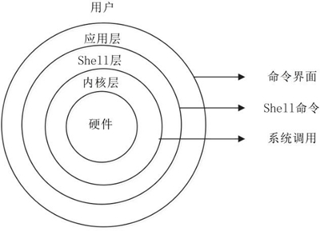
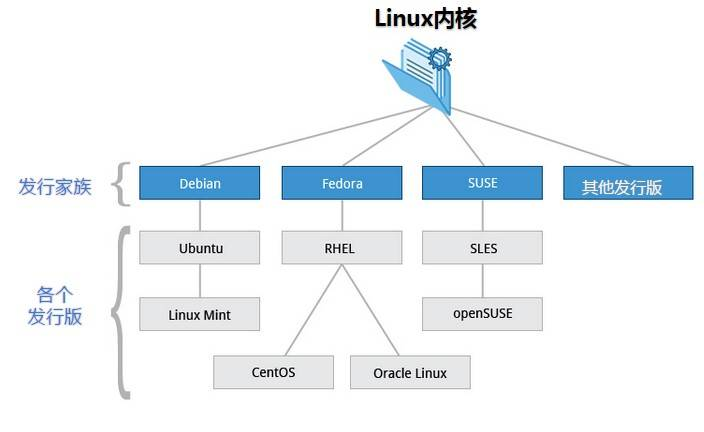

## 什么是操作系统

要讲明白 Linux 是什么，首先得说说什么是操作系统。计算机系统是指按用户的要求，接收和存储信息、自动进行数据处理并输出结果信息的系统，它由硬件子系统（计算机系统赖以工作的实体，包括显示屏、键盘、鼠标、硬盘等）和软件子系统（保证计算机系统按用户指定的要求协调工作，如 Windows 操作系统、Office 办公 软件等）组成。

而操作系统（ Operating System，OS ）是软件子系统的一部分，是硬件基础上的第一层软件，是硬件与其他软件的接口，就好似吃饭的桌子，有了桌子才能摆放碟子、碗、筷子、勺子 等。它控制其他程序运行，管理系统资源，提供最基本的计算功能，如管理及配置内存、决定系统资源供需的优先次序等件，同时还提供一些基本的服务程序，例如：

（1）文件系统。提供计算机存储信息的结构，信息存储在文件中，文件主要存储在计算机的内部硬盘里，在目录的分层结构中组织文件。文件系统为操作系统提供了组织管理数据的 方式。 

（2）设备驱动程序。提供连接计算机的每个硬件设备的接口，设备驱动器使程序能够写 入设备，而不需要了解执行每个硬件的细节。简单来说，就是让你能吃到鸡蛋，但不用养一 只鸡。 

（3）用户接口。操作系统需要为用户提供一种运行程序和访问文件系统的方法。如常用的 Windows 图形界面，可以理解为一种用户与操作系统交互的方式；智能手机的 Android 或 iOS 系统，也是一种操作系统的交互方式。 

（4）系统服务程序。当计算机启动时，会自启动许多系统服务程序，执行安装文件系统，启动网络服务、运行预定任务等操作。

目前流行的服务器和 PC 端操作系统有 Linux、Windows、UNIX 等。

## 从 UNIX 到 Linux

UNIX 与 Linux 之间的关系是一个很有意思的话题。在目前主流的服务器端操作系统中，UNIX 诞生于 20 世纪 60 年代末，Windows 诞生于 20 世纪 80 年代中期，Linux 诞生于 20 世纪 90 年代初，可以说 UNIX 是操作系统中的"老大哥"，后来的 Windows 和 Linux 都参考了 UNIX。

::: tip 说明

现代的 Windows 系统已经朝着“图形界面”的方向发展了，和 UNIX 系统有了巨大的差异，从表面上甚至看不出两者的关联。

:::

### UNIX 的坎坷历史

UNIX 操作系统由肯·汤普森(Ken Thompson)和丹尼斯·里奇(Dennis Ritchie)发明。它的部分技术来源可追溯到从 1965 年开始的 Multics 工程计划，该计划由贝尔实验室、美国麻省理工学院和通用电气公司联合发起，目标是开发一种交互式的、具有多道程序处理能力的分时操作系统，以取代当时广泛使用的批处理操作系统。

::: tip 说明

分时操作系统使一台计算机可以同时为多个用户服务，连接计算机的终端用户交互式发出命令，操作系统采用时间片轮转的方式处理用户的服务请求并在终端上显示结果(操作系统将 CPU 的时间划分成若干个片段，称为时间片)。操作系统以时间片为单位，轮流为每个终端用户服务，每次服务一个时间片。

:::

可惜，由于 Multics 工程计划所追求的目标太庞大、太复杂，以至于它的开发人员都不知道要做成什么样子，最终以失败收场。

以肯 • 汤普森为首的贝尔实验室研究人员吸取了 Multics 工程计划失败的经验教训，于 1969 年实现了一种分时操作系统的雏形，1970 年该系统正式取名为 UNIX。想一下英文中的前缀 Multi 和 Uni，就明白了 UNIX 的隐意。Multi 是大的意思，大而且繁；而 Uni 是小的意思，小而且巧。这是 UNIX 开发者的设计初衷，这个理念一直影响至今。

有意思的是，肯 • 汤普森当年开发 UNIX 的初衷是运行他编写的一款计算机游戏 Space Travel，这款游戏模拟太阳系天体运动，由玩家驾驶飞船，观赏景色并尝试在各种行星和月亮上登陆。他先后在多个系统上试验，但运行效果不甚理想，于是决定自己开发操作系统，就这样，UNIX 诞生了。

自 1970 年后，UNIX 系统在贝尔实验室内部的程序员之间逐渐流行起来。1971-1972 年，肯 • 汤普森的同事丹尼斯 • 里奇发明了传说中的 C 语言，这是一种适合编写系统软件的高级语言，它的诞生是 UNIX 系统发展过程中的一个重要里程碑，它宣告了在操作系统的开发中，汇编语言不再是主宰。到了 1973 年，UNIX 系统的绝大部分源代码都用 C 语言进行了重写，这为提高 UNIX 系统的可移植性打下了基础（之前操作系统多采用汇编语言，对硬件依赖性强），也为提高系统软件的开发效率创造了条件。可以说，UNIX 系统与 C 语言是一对孪生兄弟，具有密不可分的关系。

20 世纪 70 年代初，计算机界还有一项伟大的发明——TCP/IP 协议，这是当年美国国防部接手 ARPAnet 后所开发的网络协议。美国国防部把 TCP/IP 协议与 UNIX 系统、C 语言捆绑在一起，由 AT&T 发行给美国各个大学非商业的许可证，这为 UNIX 系统、C 语言、TCP/IP 协议的发展拉开了序幕，它们分别在操作系统、编程语言、网络协议这三个领域影响至今。肯•汤普森和丹尼斯•里奇因在计算机领域做出的杰出贡献，于 1983 年获得了计算机科学的最高奖——图灵奖。

随后出现了各种版本的 UNIX 系统，目前常见的有 Sun Solaris、FreeBSD、IBM AIX、HP-UX 等。

### Linux 的那些往事

Linux 内核最初是由李纳斯 • 托瓦兹（Linus Torvalds）在赫尔辛基大学读书时出于个人爱好而编写的，当时他觉得教学用的迷您版 UNIX 操作系统 Minix 太难用了，于是决定自己开发一个操作系统。第 1 版本于 1991 年 9 月发布，当时仅有 10000 行代码。

李纳斯 • 托瓦兹没有保留 Linux 源代码的版权，公开了代码，并邀请他人一起完善 Linux。与 Windows 及其他有专利权的操作系统不同，Linux 开放源代码，任何人都可以免费使用它。

据估计，现在只有 2% 的 Linux 核心代码是由李纳斯 • 托瓦兹自己编写的，虽然他仍然拥有 Linux 内核（操作系统的核心部分），并且保留了选择新代码和需要合并的新方法的最终裁定权。现在大家所使用的 Linux，我更倾向于说是由李纳斯 • 托瓦兹和后来陆续加入的众多 Linux 好者共同开发完成的。

李纳斯 • 托瓦兹无疑是这个世界上最伟大的程序员之一，何况，他还搞出了全世界最大的程序员交友社区 GitHub （开源代码库及版本控制系统）。

关于 Linux Logo 的由来是一个很有意思的话题，它是一只企鹅。企鹅是南极洲的标志性动物，根据国际公约，南极洲为全人类共同所有，不属于世界上的任何国家，任何国家都无权将南极洲纳入其版图。Linux 选择企鹅图案作为 Logo，其含义是：开放源代码的 Linux 为全人类共同所有，任何公司无权将其私有。

### UNIX 与 Linux 的关系

二者的关系，不是大哥和小弟，“UNIX 是 Linux 的父亲”这个说法更怡当。之所以要介绍它们的关系，是因为要告诉大家，在学习的时候，其实 Linux 与 UNIX 有很多的共通之处，简单地说，如果您已经熟练掌握了 Linux，那么再上手使用 UNIX 会非常容易。

二者也有两个大的区别：

- UNIX 系统大多是与硬件配套的，也就是说，大多数 UNIX 系统如 AIX、HP-UX 等是无法安装在 x86 服务器和个人计算机上的，而 Linux 则可以运行在多种硬件平台上；

- UNIX 是商业软件，而 Linux 是开源软件，是免费、公开源代码的。

Linux 受至旷大计算机爱好者的喜爱，主要原因也有两个：

- 它属于开源软件，用户不用支付可费用就可以获得它和它的源代码，并且可以根据自己的需要对它进行必要的修改，无偿使用，无约束地继续传播；

- 它具有 UNIX 的全部功能，任何使用 UNIX 操作系统或想要学习 UNIX 操作系统的人都可以从 Linux 中获益。

开源软件是不同于商业软件的一种模式，从字面上理解，就是开放源代码，大家不用担心里面会搞什么猫腻，这会带来软件的革新和安全。

另外，开源其实并不等同于免费，而是一种新的软件盈利模式。目前很多软件都是开源软件，对计算机行业与互联网影响深远。

近年来，Linux 已经青出于蓝而胜于蓝，以超常的速度发展，从一个丑小鸭变成了一个拥有庞大用户群的真正优秀的、值得信赖的操作系统。历史的车轮让 Linux 成为 UNIX 最优秀的传承者。

::: tip 总结

Linux 是一个类似 Unix 的操作系统，Unix 要早于 Linux，Linux 的初衷就是要替代 UNIX，并在功能和用户体验上进行优化，所以 Linux 模仿了 UNIX（但并没有抄袭 UNIX 的源码），使得 Linux 在外观和交互上与 UNIX 非常类似。

相比于 UNIX，Linux 最大的创新是开源免费，这是它能够蓬勃发展的最重要原因；而目前的 UNIX 大部分都是收费的，小公司和个人都难以承受。

正是由于 Linux 和 UNIX 有着千丝万缕的联系，所以人们把 Linux 叫做“类 UNIX 系统”。

:::

## UNIX/Linux 系统结构

UNIX/Linux 系统可以粗糙地抽象为 3 个层次（所谓粗糙，就是不够细致、精准，但是便于初学者抓住重点理解），如图1-1 所示。底层是 UNIX/Linux 操作系统，即系统内核（Kernel）；中间层是 Shell 层，即命令解释层；高层则是应用层。

::: center

**图1-1	<u>UNIX/Linux 系统结构层次概要</u>**

:::

1. **内核层**

   内核层是 UNIX/Linux 系统的核心和基础，它直接附着在硬件平台之上，控制和管理系统内各种资源（硬件资源和软件资源），有效地组织进程的运行，从而扩展硬件的功能，提高资源的利用效率，为用户提供方便、高效、安全、可靠的应用环境。

1. **Shell 层**

   Shell 层是与用户直接交互的界面。用户可以在提示符下输入命令行，由 Shell 解释执行并输出相应结果或者有关信息，所以我们也把 Shell 称作命令解释器，利用系统提供的丰富命令可以快捷而简便地完成许多工作。

1. **应用层**

   应用层提供基于 X Window 协议的图形环境。X Window 协议定义了一个系统所必须具备的功能（就如同 TCP/IP 是一个协议，定义软件所应具备的功能），可系统能满足此协议及符合 X 协会其他的规范，便可称为 X Window。

现在大多数的 UNIX 系统上（包括 Solaris、HP-UX、AIX 等）都可以运行 CDE（Common Desktop Environment，通用桌面环境，是运行于 UNIX 的商业桌面环境）的用户界面；而在 Linux 上广泛应用的有 Gnome、KDE 等。

::: tip 说明

X Window 与微软的 Windows 图形环境有很大的区别：UNIX/Linux 系统与 X Window没有必然捆绑的关系，也就是说，UNIX/Linux 可以安装 X Window，也可以不安装；而微软的 Windows 图形环境与内核捆绑密切。UNIX/Linux 系统不依赖图形环境，依然可以通过命令行完成 100% 的功能，而且因为不使用图形环境还会节省大量的系统资源。作为服务器部署，绝大多数 Linux 并不安装或并不启用图形环境，我们学习的也基本上为 Linux 命令行下的操作。

:::

## Linux 的优势

相比 Windows 系统，Linux 系统有更好的稳定性。此外，Linux 还有如下优势：

1. **大量的可用软件及免费软件**

   Linux 系统上有着大量的可用软件，且绝大多数是免费的，比如声名赫赫的 Apache、Samba、PHP、MySQL 等，构建成本低廉，是 Linux 被众多企业青睐的原因之一。当然，这和 Linux 出色的性能是分不开的，否则，节约成本就没有任何意义。

   但不可否认的是，Linux 在办公应用和游戏娱乐方面的软件相比 Windows 系统还很匮乏，所以，即便打游戏、看影片用的也是 Windows，至于 Linux，就把它用在擅长的服务器领域吧。

1. **良好的可移植性及灵活性**
   
   Linux 系统有良好的可移植性，它几乎支持所有的 CPU 平台，这使得它便于裁剪和定制。我们可以把 Linux 放在 U 盘、光盘等存储介质中，也可以在嵌入式领域广泛应用。
   
   如果大家希望不进行安装就体验 Linux 系统，则可以在网上下载一个 Live DVD 版的 Linux 镜像，刻成光盘放入光驱或者用虚拟机软件直接载入镜像文件，设置 CMOS/BIOS 为光盘启动，系统就会自动载入光盘文件，启动进入 Linux 系统。
   
1. **优良的稳定性和安全性**

   著名的黑客埃里克 • 雷蒙德（EricS.Raymond）有一句名言： “足够多的眼睛，就可让所有问题浮现”。举个例子，假如你在演讲，台下人山人海，你中午吃饭不小心，有几个饭粒粘在衣领上了，分分钟就会被大家发现，因为看的人太多了；如果台下就稀稀落落两三个人且离得很远，那就算你衣领上有一大块油渍也不会被发现。

   Linux 开放源代码，将所有代码放在网上，全世界的程序员都看得到，有什么缺陷和漏洞，很快就会被发现，从而成就了它的稳定性和安全注。

1. **支持几乎所有的网络协议及开发语言**

   经常有初学的朋友会问，Linux 是不是对 TCP/IP 协议支持不好、是不是 Java 开发环境不灵之类的问题。前面在 UNIX 发展史中已经介绍了，UNIX 系统是与 C 语言、TCP/IP 协议一同发展起来的，而 Linux 是 UNIX 的一种，C 语言又衍生出了现今主流的语言 PHP、Java、C++ 等，而哪一个网络协议与 TCP/IP 无关呢? 所以，Linux 对网络协议和开发语言的支持很好。

Linux 的优点在此不一一举例，只说明这几点供参考。诚然，Linux 不可能没有缺点，如桌面应用还有待完善、Linux 的标准统一还需要推广、开源软件的盈利模式与发展还有待考验等，不过，瑕不掩瑜。

## Linux 的应用领域

Linux 似乎在我们平时的生活中很少看到，那么它应用在哪些领域呢？其实，在生活中随时随地都有 Linux 为我们服务着······

1. **网站服务器**

用事实说话！访问国际知名的 Netcraft 网站 <http://www.inetcraf.com>，在“What's that site running?”的地址栏内输入想了解信息的网站地址，单击箭头图标即可搜索到相关信息。

在搜索结果中会看到网站的操作系统信息。例如，搜索兄弟连网站“www.itxd.cn”，可以看到 OS 显示为 Linux。 Netcraft 可以理解为一个基于 Web 页面的扫描器。

验证一下哪些大型网站在使用 Linux。 大家常用的购物网站淘宝用的就是 Linux。如果搜索结果中的 OS 项显示 “unknown”，可能是由于安装了防火墙或代理，无法准确地获取信息。

世界知名的网站 google.com、qq.com、新浪、网易等，无一例外地应用着 Linux。就连你输入 microsoft.com，会发现微软的下载站等也在使用 Linux。 为什么这么多大型网站会采用 Linux 而不使用 UNIX 或 Windows？其中一个重要的原因就是使用 Linux 成本较低，而 UNIX 和 Windows 都是商业软件；另一个更重要的原因是出于安全和性能方面的考虑。

2. **电影工业**

1998 年，看了一部电影《泰坦尼克号》，那些看起来真实、恐怖的豪华巨轮与冰山相撞最终沉没的场面要归功于 Linux，归功于电影特技效果公司里终日处理数据的 100 多台 Linux 服务器。 在过去，SGI 图形工作站支配了整个电影产业，20 世纪 90 年代的影片《侏罗纪公园》中生动的恐龙正是从 SGI 上孕育出来的，SGI 的操作系统 Irix 就是 UNIX 的一种。当时所有动画制作公司都得看 SGI 的脸色。然而，从 1997 年开始，Linux 开始全面占领好莱坞，娱乐业巨擘迪士尼宣布全面采用 Linux，宣告了 SGI 时代的没落，Linux 时代走向辉煌。 好莱坞精明的电影人热情地拥抱 Linux，其中的原因不言而喻。首先，Linux 作为开源软件，可以节省大量成本；其次，Linux 具有商业软件不具备的功能定制化特点，各家电影厂商都可依据自己的制片需要铺设相关平台。到现在为止，使用 Linux 制作的好莱坞大片已经有几百部。

3. **嵌入式应用**

嵌入式系统是以应用为中心，以计算机技术为基础，并且软硬件可定制，适用于各种应用场合，对功能、可靠性、成本、体积、功耗有严格要求的专用计算机系统。它一般由嵌入式微处理器、外围硬件设备、嵌入式操作系统及用户的应用程序 4 部分组成，用于实现对其他设备的控制、监视或管理等。嵌入式系统几乎涵盖了生活中的所有电器设备，如手机、平板电脑、电视机顶盒、游戏机、智能电视、汽车、数码相机、自动售货机、工业自动化仪表与医疗仪 器等。不得不提的是安卓系统（Android）。安卓是基于 Linux 的开源系统，主要适用于便携设备， 如智能手机和平板电脑等，是 Google 公司为移动终端打造的真正开放和完整的移动软件。在如今的智能手机操作系统市场上，安卓系统的占有率已然是傲视群雄。 从安卓手机到智能机器人，从大型网站到美国太空站，Linux 都已涉足其中。Linux 的发展震动了整个科技界，动摇了微软一贯以来的霸权，并且为科技界贡献了一种软件制造的新方式。 [Top500](www.top500.org) 是评定全球 500 台最快的超算系统性能榜单，连续多届，在世界上 500 台超级计算机里，超过 9 成是 Linux 系统！如果你还关在家里面，认为全世界都是 Windows，则无异于坐井观天。世界那么大，出去看看吧！

## Linux 的发行版本

Linux 的发行版说简单点就是将 Linux 内核与应用软件做一个打包。

::: center

**图1-2	<u>Linux 的发行版</u>**

::: center

事实上，已经孵化出专属 Linux 各发行版的巨大生态系统。一个发行版（ distribution ，有时缩写为 distro ）是一个定制的软件包，它将 Linux 内核以及用户计算机 Linux 运行版的安装工具一起发布。

在 Linux 内核的发展过程中，各种 Linux 发行版本起了巨大的作用，正是它们推动了 Linux 的应用，从而让更多的人开始关注 Linux。因此，把 Red Hat、Ubuntu、SUSE 等直接说成 Linux 其实是不确切的，它们是 Linux 的发行版本，更确切地说，应该叫作“以 Linux 为核心的操作系统软件包”。

Linux 的各个发行版本使用的是同一个 Linux 内核，因此在内核层不存在什么兼容性问题，每个版本有不一样的感觉，只是在发行版本的最外层（由发行商整合开发的应用）才有所体现。

目前市面上较知名的发行版有: Ubuntu、RedHat、CentOS、Debian、Fedora、SuSE、OpenSUSE、Arch Linux、SolusOS 等。如图1-2 所示。

Linux 的发行版本可以大体分为两类：

- 商业公司维护的发行版本，以著名的 Red Hat 为代表；
- 社区组织维护的发行版本，以 Debian 为代表。

很难说大量 Linux 版本中哪一款更好，每个版本都有自己的特点。

### Red Hat Linux

Red Hat（红帽公司）创建于 1993 年，是目前世界上资深的 Linux 厂商，也是最获认可的 Linux 品牌。

Red Hat 公司的产品主要包括 RHEL（Red Hat Enterprise Linux，收费版本）和 CentOS（ RHEL 的社区克隆版本，免费版本）、Fedora Core（由 Red Hat 桌面版发展而来，免费版本）。

Red Hat 是在我国国内使用人群最多的 Linux 版本，资料丰富，如果您有什么不明白的地方，则容易找到人来请教，而且大多数 Linux 教程是以 Red Hat 为例来讲解的（包括本教程）。

CentOS 是基于 Red Hat Enterprise Linux 源代码重新编译、去除 Red Hat 商标的产物，各种操作使用和付费版本没有区别，且完全免费。缺点是不向用户提供技术支持，也不负任何商业责任。

::: tip 说明

CentOS 项目最近宣布了 CentOS 的战略转变，CentOS 以前是作为上游供应商的下游构建版本存在的（即它会在上游供应商之后收到补丁和更新），而现在它将转移为一个上游构建版本（即它会在上游供应商纳入之前测试补丁和更新）。另外，对 CentOS Linux 8 的支持也已从 2029年 5 月 31 日缩短至 2021 年 12 月 31 日。

Rocky Linux 的目标是像 CentOS 以前那样作为一个下游构建版本，在被上游供应商纳入包更新之后（而不是之前）构建发行。

Rocky Linux 是一个社区化的企业级操作系统。其设计为的是与美国顶级企业 Linux 发行版实现 100％ Bug 级兼容，而原因是后者的下游合作伙伴转移了发展方向。目前社区正在集中力量发展有关设施。Rocky Linux 由 CentOS 项目的创始人 Gregory Kurtzer 领导。

Rocky Linux 以社区驱动为导向，为您带来企业级、可生产的 Linux 系统。以后可代替 CentOS 。

:::

### Ubuntu Linux

Ubuntu 基于知名的 Debian Linux 发展而来，界面友好，容易上手，对硬件的支持非常全面，是目前最适合做桌面系统的 Linux 发行版本，而且 Ubuntu 的所有发行版本都免费提供。

Ubuntu 的创始人 Mark Shuttleworth 是非常具有传奇色彩的人物。他在大学毕业后创建了一家安全咨询公司，1999 年以 5.75 亿美元被收购，由此一跃成为南非最年轻有为的本土富翁。作为一名狂热的天文爱好者，Mark Shuttleworth 于 2002 年自费乘坐俄罗斯联盟号飞船，在国际空间站中度过了 8 天的时光。之后，Mark Shuttleworth 创立了 Ubuntu 社区，2005 年 7 月 1 日建立了 Ubuntu 基金会，并为该基金会投资 1000 万美元。他说，太空的所见正是他创立 Ubuntu 的精神之所在。如今，他最热衷的事情就是到处为自由开源的 Ubuntu 进行宣传演讲。

### SuSE Linux

SuSE Linux 以 Slackware Linux 为基础，原来是德国的 SuSE Linux AG 公司发布的 Linux 版本，1994 年发行了第一版，早期只有商业版本，2004 年被 Novell 公司收购后，成立了 OpenSUSE 社区，推出了自己的社区版本 OpenSUSE。

SuSE Linux 在欧洲较为流行，在我国国内也有较多应用。值得一提的是，它吸取了 Red Hat Linux 的很多特质。

SuSE Linux 可以非常方便地实现与 Windows 的交互，硬件检测非常优秀，拥有界面友好的安装过程、图形管理工具，对于终端用户和管理员来说使用非常方便。

### Gentoo Linux

Gentoo 最初由 Daniel Robbins（FreeBSD 的开发者之一）创建，首个稳定版本发布于 2002 年。Gentoo 是所有 Linux 发行版本里安装最复杂的，到目前为止仍采用源码包编译安装操作系统。

不过，它是安装完成后最便于管理的版本，也是在相同硬件环境下运行最快的版本。自从 Gentoo 1.0 面世后，它就像一场风暴，给 Linux 世界带来了巨大的惊喜，同时也吸引了大量的用户和开发者投入 Gentoo Linux 的怀抱。

有人这样评价 Gentoo：快速、设计干净而有弹性，它的出名是因为其高度的自定制性（基于源代码的发行版）。尽管安装时可以选择预先编译好的软件包，但是大部分使用 Gentoo 的用户都选择自己手动编译。这也是为什么 Gentoo 适合比较有 Linux 使用经验的老手使用。

### 发行版选择

Linux 的发行版本众多，在此不逐一介绍，下面给选择 Linux 发行版本犯愁的朋友一点建议：

- 如果您需要的是一个服务器系统，而且已经厌烦了各种 Linux 的配置，只是想要一个比较稳定的服务器系统，那么建议您选择 CentOS 或 RHEL。

- 如果您只是需要一个桌面系统，而且既不想使用盗版，又不想花大价钱购买商业软件，不想自己定制，也不想在系统上浪费太多时间，则可以选择 Ubuntu 。

- 如果您想深入摸索一下 Linux 各个方面的知识，而且还想非常灵活地定制自己的 Linux 系统，那就选择 Gentoo 吧，尽情享受 Gentoo 带来的自由快感。

- 如果您对系统稳定性要求很高，则可以考虑 FreeBSD 。

- 如果您需要使用数据库高级服务和电子邮件网络应用，则可以选择 SuSE 。
