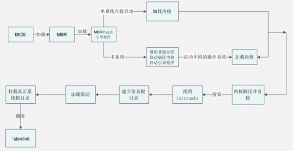
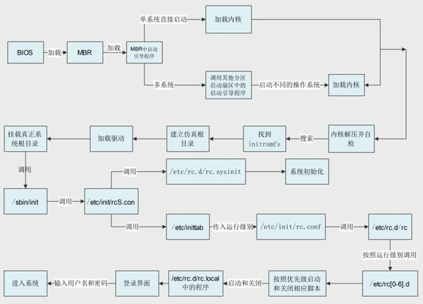
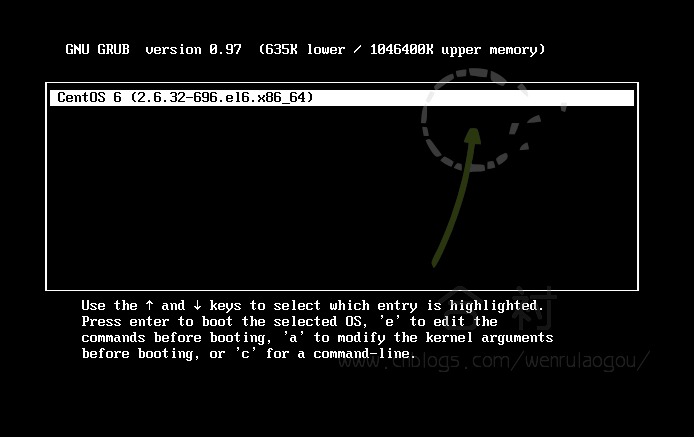
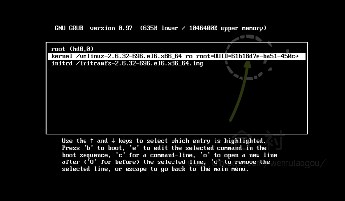
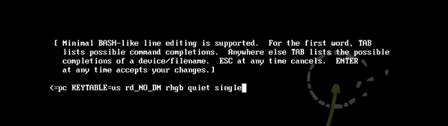
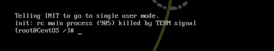

Linux 系统的启动是不需要人为参与和控制的，只要按下电源，系统就会按照设定好的方式进行启动。不过，了解系统的启动有助于我们在系统出现问题时能够快速地修复 Linux 系统。

 在 CentOS 6.x 中，系统的启动过程和以前的系统相比变化较大，CentOS 6.x 系统使用 Upstart 启动服务取代了原先的  System V init 启动服务。Upstart 是事件驱动类型的，使用事件来启动和关闭系统服务；而 System V init  则基于运行级别的系统，使用运行级别和链接来启动和关闭系统服务。Upstart 启动方式比原先的 System V init 启动方式要更快速。

 因此，虽然 CentOS 6.x 比 CentOS 5.x 更加庞大，但是 CentOS 6.x 的启动速度却快于 CentOS 5.x。

## Linux 系统启动流程

Linux 系统的启动，从计算机开机通电自检开始，一直到登陆系统，需要经历多个过程。学习 Linux 的启动过程，有助于了解 Linux 系统的结构，也对系统的排错有很大的帮助。

CentOS 6.x 系统启动过程发生了较大的变化，使用 Upstart 启动服务取代了原先的 System V init 启动服务。Upstart 启动服务的效率更高，启动速度更快。

Linux 系统启动过程比较复杂，我们先整理一下基本的启动过程，有一个整体的印象，然后再进一步说明。

目前，CentOS 6.x 的启动流程经历以下几步：

1. 服务器加电，加载 BIOS 信息，BIOS 进行系统检测。依照 BIOS 设定，找到第一个可以启动的设备（一般是硬盘）；
2. 读取第一个启动设备的 MBR (主引导记录），加载 MBR 中的 Boot Loader（启动引导程序，最为常见的是 GRUB）。
3. 依据 Boot Loader 的设置加载内核，内核会再进行一遍系统检测。系统一般会采用内核检测硬件的信息，而不一定采用 Bios 的自检信息。内核在检测硬件的同时，还会通过加载动态模块的形式加载硬件的驱动。
4. 内核启动系统的第一个进程，也就是 `/sbin/init`。
5. 由 `/sbin/init` 进程调用 `/etc/init/rcS.conf` 配置文件，通过这个配置文件调用 `/etc/rc.d/rc.sysinit` 配置文件。而 `/etc/rc.d/rc.sysinit` 配置文件是用来进行系统初始化的，主要用于配置计算机的初始环境。
6. 还是通过 `/etc/init/rcS.conf` 配置文件调用 `/etc/inittab` 配置文件。通过 `/etc/inittab` 配置文件来确定系统的默认运行级别。
7. 确定默认运行级别后，调用 `/etc/init/rc.conf` 配置文件。
8. 通过 `/etc/init/rc.conf` 配置文件调用并执行 `/etc/rc.d/rc` 脚本，并传入运行级别参数。
9. `/etc/rc.d/rc` 确定传入的运行级别，然后运行相应的运行级别目录 `/etc/rc[0-6].d/` 中的脚本。
10. `/etc/rc[0-6].d/` 目录中的脚本依据设定好的优先级依次启动和关闭。
11. 最后执行 `/etc/rc.d/rc.local` 中的程序。
12. 如果是字符界面启动，就可以看到登录界面了。如果是图形界面启动，就会调用相应的 X Window 接口。


总的来说，Linux 系统的启动，要经历 **`BIOS自检 -> 启动 GRUB -> 加载内核 -> 执行第一个进程 -> 配置系统初始环境`**。当然，这里只是简单地看启动过程，接下来分别详解介绍每步启动过程。

### BIOS 开机自检

前面提到，服务器通电后，会直接进入 BIOS，BIOS 全称 Basic Input/Output System，中文可译为基本输入/输出系统。

简单地理解 BIOS，它就是固化在主板上一个 ROM（只读存储器）芯片上的程序，主要保存计算机的基本输入/输出信息、系统设置信息、开机自检程和系统自启动程序，用来为 计算机提供最底层和最直接的硬件设置与控制。

也就是说，BIOS 是硬件与软件之间的接口，而且是非常基本的接口，BIOS 提供了一组基本的操作系统使用的指令，系统启动的成功与否，依赖于 BIOS。

BIOS 的初始化主要完成以下 3 项工作：

1. 第一次检查计算机硬件和外围设备（第二次自检由内核完后，后续会讲），例如 CPU、内存、风扇灯。当 BIOS 一启动，就会做一个自我检测的工作，整个自检过程也被称为 POST（Power On Self Test）自检。
2. 如果自检没有问题，BIOS 开始对硬件进行初始化，并规定当前可启动设备的先后顺序，选择由那个设备来开机。
3. 选择好开启设备后，就会从该设备的 MBR（主引导目录）中读取 Boot Loader（启动引导程序）并执行。启动引导程序用于引导操作系统启动，Linux 系统中默认使用的启动引导程序是 GRUB。


当 MBR 被加载到 RAM 之后，BIOS 就会将控制权交给 MBR，进入系统引导的第二阶段。

### 主引导目录（MBR）结构及作用

MBR 也就是主引导记录，位于硬盘的 0 磁道、0 柱面、1 扇区中，主要记录了启动引导程序和磁盘的分区表。我们通过图2-1 来看看 MBR 的结构。

::: center

 

**图2-1	<u>MBR 的结构</u>**

:::

MBR 共占用了一个扇区，也就是 512 Byte。其中 446 Byte 安装了启动引导程序，其后 64 Byte 描述分区表，最后的 2  Byte 是结束标记。我们已经知道，每块硬盘只能划分 4 个主分区，原因就是在 MBR 中描述分区表的空间只有 64  Byte。其中每个分区必须占用 16 Byte，那么 64 Byte 就只能划分 4 个主分区。每个分区的 16 字节的规划如表2-1 所示。

**表2-1 <u>分区表内容</u>**

| 存储字节      | 数据内容及含义                     |
| ------------- | ---------------------------------- |
| 第 1 字节     | 引导标志                           |
| 第 2 字节     | 本分区的起始磁道号                 |
| 第 3 字节     | 本分区的起始扇区号                 |
| 第 4 字节     | 本分区的起始柱面号                 |
| 第 5 字节     | 分区类型，可以识别主分区和扩展分区 |
| 第 6 字节     | 本分区的结束磁道号                 |
| 第 7 字节     | 本分区的结束扇区号                 |
| 第 8 字节     | 本分区的结束柱面号                 |
| 第 9~12 字节  | 本分区之前已经占用的扇区数         |
| 第 13~16 字节 | 本分区的总扇区数                   |

大家注意到了吧，MBR 中最主要的功能就是存储启动引导程序。

### 启动引导程序的作用

BIOS 的作用就是自检，然后从 MBR 中读取出启动引导程序。那么，启动引导程序最主要的作用就是加载操作系统的内核。当然，每种操作系统的启动引导程序都是不同的。

每种操作系统的文件格式不同，因此，每种操作系统的启动引导程序也不一样。不同的操作系统只有使用自己的启动引导程序才能加载自己的内核。如果我的服务器上只安装了一个操作系统，那么这个操作系统的启动引导程序就会安装在 MBR 中。BIOS 调用 MBR 时读取出启动引导程序，就可以加载内核了。

但是在有些时候，我的服务器中安装了多个操作系统，而 MBR 只有一 个，那么在 MBR 中到底安装哪个操作系统的启动引导程序呢？

很明显，一个 MBR 是不够用的。每块硬盘只能有一个 MBR 是不能更改的，所以不可能増加 MBR  的数量。系统只能在每个文件系统（可以看成分区）中单独划分出一个扇区，称作引导扇区（Boot  Sector)。每个分区的引导扇区中也能安装启动引导程序，也就是说，在 MBR  和每个单独分区的引导扇区中都可以安装启动引导程序。这样多个操作系统才能安装在同一台服务器中（每个操作系统要安装在不同的分区中），而且每个操作系统都是可以启动的。

还有一个问题，BIOS 只能找到 MBR 中的启动引导程序，而找不到在分区的引导扇区中的启动引导程序。那么，要想完成多系统启动，我们的方法是増加启动引导程序的功能，让安装到 MBR 中的启动引导程序（GRUB）可以调用在分区的引导扇区中的其他启动引导程序。

 因此，启动引导程序拥有以下功能：

1. 加载操作系统的内核。这是启动引导程序最主要的功能。
2. 拥有一个可以让用户选择的菜单，来选择到底启动哪个系统。大家如果在服务器上安装过双 Windows 系统，就应该见过类似的选择菜单，不过这个选择菜单是由 Windows 的启动引导程序提供的，而不是 GRUB。
3. 可以调用其他的启动引导程序，这是多系统启动的关键。不过需要注意的是，Windows 的启动引导程序不能调用 Linux  的启动引导程序，所以我们一般建议先安装 Windows，后安装 Linux，是为了将 Linux 的启动引导程序安装到 MBR 中，覆盖  Windows 的启动引导程序。

当然，这个安装顺序不是绝对的，就算最后安装了 Windows，我们也可以通过手工再安装 GRUB 的方法，来保证 MBR 中安装的还是 Linux 的启动引导程序。

图2-2 为我们展示了启动引导程序的作用。

::: center


**图2-2	<u>启动引导程序的作用</u>**

:::


### 内核（内核模块）的加载过程

1. **内核的加载和内核模块**

GRUB 加载了内核之后，内核首先会再进行二次系统的自检，而不一定使用 BIOS 检测的硬件信息。这时内核终于开始替代 BIOS 接管 Linux 的启动过程了。

内核完成再次系统自检之后，开始采用动态的方式加载每个硬件的模块，这个动态模块大家可以想象成硬件的驱动（默认 Linux  硬件的驱动是不需要手工安装的，如果是重要的功能，则会直接编译到内核当中；如果是非重要的功能，比如硬件驱动会编译为模块，则在需要时由内核调用。不过，如果没有被内核识别的硬件，要想驱动，就需要手工安装这个硬件的模块了。具体的安装方法会在后续会介绍）。

那么，Linux 的内核到底放在了哪里呢？当然是 `/boot` 的启动目录中了，我们来看看这个目录下的内容吧。

```shell
[root@localhost ~]#ls /boot/
config-2.6.32-279.el6.i686
#内核的配置文件，内核编译时选择的功能与模块
efi
#可扩展固件接口，为英特尔为全新PC固件的体系结构、接口和服务提出的建议标准
grub
#启动引导程GRUB的数据目录
initramfs-2.6.32-279.el6.i686.img
#虚拟文件系统（CentOS 6.x 中用initramfs替代了initrd,但功能是一样的）
lost+found
#故boot分区的备份目录
symvers-2_6.32-279.el6.i686.gz
#模块符号信息
System.map-2.6.32-279.el6.i686
#内核功能和内存地址的对应列表
vmlinuz-2.6.32-279.el6.i686
#用于启动的Linux内核。这个文件是一个压缩的内核镜像
```

我们已经知道，Linux 会把不重要的功能编译成内核模块，在需要时再调用，从而保证了内核不会过大。在多数 Linux  中，都会把硬件的驱动程序编译为模块， 这些模块保存在 `/lib/modules` 目录中。常见的 USB、SATA 和 SCSI  等硬盘设备的驱动，还有一些特殊的文件系统（如 LVM、RAID 等）的驱动，都是以模块的方式来保存的。

如果 Linux 安装在 IDE 硬盘之上，并且采用的是默认的 ext3/4  文件系统，那么内核启动后加载根分区和模块的加载都没有什么问题，系统会顺利启动。但是，如果 Linux 安装在 SCSI 硬盘之上，或者采用的是  LVM 文件系统，那么内核（内核载入内存是启动引导程序 GRUB 调用的，并不存在硬盘驱动不识别的问题）在加载根目录之前是需要加载 SCSI  硬盘或 LVM 文件系统的驱动的。

SCSI 硬盘和 LVM 文件系统的驱动都放在硬盘的 `/lib/modules` 目录中，既然内核没有办法识别 SCSI 硬盘或 LVM  文件系统，那怎么可能读取 `/lib/modules` 目录中的驱动呢？Linux 给出的解决办法是使用 initramfs  这个虚拟文件系统来处理这个问题。

2. **initramfe 虚拟文件系统**

CentOS 6.x 中使用 initramfs 虚拟文件系统取代了 CentOS 5.x 中的 initrd RAM Disk。它们的作用类似，可以通过启动引导程序加载到内存中，然后会解压缩并在内存中仿真成一个根目录，并且这个仿真的文件系统能够提供一个可执行程序，通过该程序来加载启动过程中所需的内核模块，比如 USB、SATA. SCSI 硬盘的驱动和 LVM、RAID 文件系统的驱动。

也就是说，通过 initramfs 虚拟文件系统在内存中模拟出一个根目录，然后在这个模拟根目录中加载 SCSI 等硬件的驱动，就可以加载真正的根目录了，之后才能调用 Linux 的第一个进程 `/sbin/init`。

initramfs 虚拟文件系统主要有以下优点：

- initramfs 随着其中数据的増减自动増减容量。
- 在 initramfs 和页面缓存之间没有重复数据。
- initramfs 重复利用了 Linux caching 的代码，因此几乎没有増加内核尺寸，而 caching 的代码已经经过良好测试，所以 initramfs 的代码质量也有保证。
- 不需要额外的文件系统驱动。

其实大家只需要知道 initramfs 是为了在内核中建立一个模拟根目录，这个模拟根目录是为了可以调用  USB、SATA、SCSI、LVM、RAID 等硬盘接口或文件系统的驱动模块，加载了驱动模块后才可以加载真正的系统根目录。我们可以通过图2-3 来表示这个过程。

::: center



**图2-3	<u>内核启动流程</u>**

:::

那么既然 initramfs 是一个仿真根目录，那么我们是否可以看看这个仿真根目录中到底是什么样子的呢？当然可以，命令如下：

```shell
[root@localhost ~]# mkdir /tmp/initramfs
#建立测试目录
[root@localhost ~]# cp /boot/initramfs-2.6.32-279.el6.i686.img /tmp/initramfs/
#复制initramfs文件
[root@localhost ~]# cd /tmp/initramfs/
[root@localhost initramfs]# file initramfs-2.6.32-279.el6.i686.img
initramfe-2.6.32-279.el6.i686.img: gzip compressed data, from Unix, last modified: Wed Apr 10 21:49:34 2013, max compression
#查看文件类型，发现这个文件是一个使用gzip命令打包的压缩包
[root@localhost initramfs]# mv initramfs-2.6.32-279.el6.i686.img initramfs-2.6.32-279.el6.i686.img.gz
#修改文件的扩展名为.gz
[root@localhost initramfs]# gunzip initramfs-2.6.32-279.el6.i686.img.gz
#解压缩
[root@localhost initramfs]# ls
initramfs-2.6.32-279.el6.i686.img
[root@localhost initramfs]# file initramfs-2.6.32-279.el6.i686.img
initramfe-2.6.32-279.el6.i686.img: ASCII cpio archive (SVR4withnoCRC)
#查看文件类型，使用cpio命令的压缩文件
[root@localhost initramfs]# cpio -ivcdu < initramfs-2.6.32-279.el6.i686.img
#解压缩
[root@localhost initramfs]# ll
总用量34512
drwxr-xr-x. 2 root root 4096 4月 2412:10 bin
drwxr-xr-x. 2 root root 4096 4 月 24 12:10 cmdline
drwxr-xr-x. 3 root root 4096 4月 24 12:10 dev
-rw-r--r--. 1 root root 19 4 月 24 12:10 dracut-004-283.el6
drwxr-xr-x. 2 root root 4096 4 月 24 12:10 emergency
drwxr-xr-x. 7 root root 4096 4月 24 12:10 etc
-rwxr-xr-x. 1 root root 8962 4月 24 12:10 init
drwxr-xr-x. 2 root root 4096 4 月 24 12:10 initqueue
drwxr-xr-x. 2 root root 4096 4 月 24 12:10 initqueue-finished
drwxr-xr-x. 2 root root 4096 4 月 24 12:10 initqueue-settled
drwxr-xr-x. 2 root root 4096 4 月 24 12:10
initqueue-timeout
-rw-r--r--. 1 root root 35235328 4 月 24 12:09 initramfs-2.6.32-279.el6.i686.img
drwxr-xr-x. 9 root root 4096 4月 2412:10 lib
...省略部分输出...
#这就是initramfs虚拟文件系统中的内容，和根目录是不是很像
```

### `/sbin/init` 进程调用

在内核加载完毕，并完成硬件检测与驱动程序加载后，此时主机硬件已经准备完毕，内核会主动呼叫第一个进程，也就是 `/sbin/init`，此配置文件最主要的功能就是准备软件执行的环境，包括系统的主机名、网络设定、语言、文件系统格式及其他服务的启动等。

这里和 CentOS 5.x 系统相比也有较大变化。在 CentOS 5.x 系统中，主要通过 init 进程的配置文件 `/etc/inittab` 来设定系统，并启动 Linux。但是在 CentOS 6.x 系统中，由于用 Upstart 启动服务来替换以前的 init，所以在 `/etc/inittab` 配置文件中只能定义系统的默认运行级别，而其他的功能是靠 `/etc/init/` 目录中的其他配置文件实现的。

大家可以把 `/etc/init/` 目录中的配置文件看成以前 `/etc/inittab` 这个文件功能的分拆。

前面提到，由 `/sbin/init` 进程可通过 `/etc/init/rcS.conf` 配置文件，分别找到  `/etc/rc.d/rc.sysinit` 配置文件和 `/etc/inittab` 配置文件，前者用于初始化系统，配置计算机的初始环境；后者用于确定系统的默认运行级别。

### `/etc/rc.d/rc.sysinit`：系统初始化

接下来，先介绍 `/etc/rc.d/rc.sysinit` 配置文件。如果我们使用 Vim 查看 `/etc/rc.d/rc.sysinit` 配置文件，就会发现这个这个配置文件主要进行了以下几项工作：

- 获得网络环境和主机类型；
- 测试设备：除了挂载内存设备 /proc 之外，还会主动侦测系统上是否具有 usb 设备，如果有，则会主动加载 usb 的驱动程序，并尝试挂载 usb 文件系统；
- 开机启动画面 Plymouth（代替了以往的 RHGB）；
- 判断是否启用 SELinux；
- 显示开机过程中的欢迎画面；
- 初始化硬件；
- 用户自定义模块的加载，用户可以在 /etc/sysconfig/modules/*.modules 加入自订的模块，则此时会被加载到系统当中；
- 配置内核的参数，系统会主动去读取 /etc/sysctl.conf 这个文件的配置参数，使内核的功能成为我们想要的样子。
- 设置主机名。
- 同步存储器。
- 设备映射器及相关的初始化。
- 初始化软件磁盘阵列 (RAID)。
- 初始化 LVM 的文件系统功能。
- 检验磁盘文件系统 (fsck)。
- 设置磁盘配额 (quota)。
- 重新以可读写模式挂载系统磁盘。
- 更新 quota (非必要)。
- 启动系统虚拟随机数生成器。
- 配置机器（非必要）。
- 清除开机过程中的临时文件。
- 创建 ICE 目录。
- 启动交换分区（swap）。
- 将开机信息写入 /var/log/dmesg 文件中。


在以上过程中，比较值得注意的是自定模块的加载。在 CentOS 中，如果我们想要加载核心模块的话，就可以将整个模块写入到 `/etc/sysconfig/modules/*.modules`  中。当然，此过程并不是必须的，通常我们的默认模块已经够用，除非对硬件太新，不得不自己加载模块，否则无需刻意添加任何模块。

可以看到，`/etc/rc.d/rc.sysinit` 配置文件已经将基本的系统配置数据都写好了，我们可以查询 `/var/log/dmesg` 文件或使用 `dmesg` 命令查看系统在启动时到底发生了什么。当然，我们也可以通过这个命令来看看 Linux 服务器的硬件信息。

### `/etc/inittab`：设置系统默认运行级别

在 CentOS 6.x 中，`/etc/inittab` 配置文件只能用来设置系统的默认运行级别。

1. **运行级别**

 那么，什么是运行级别呢？其实 Linux 是通过运行级别来确定系统启动时到底启动哪些服务的。Linux 默认有 7 个运行级别，具体如表2-2 所示。

**表2-2	<u>运行级别</u>**

| 运行级别 | 含 义                                                       |
| -------- | ----------------------------------------------------------- |
| 0        | 关机                                                        |
| 1        | 单用户模式，可以想象为 Windows 的安全模式，主要用于系统修复 |
| 2        | 不完全的命令行模式，不含 NFS 服务                           |
| 3        | 完全的命令行模式，就是标准字符界面                          |
| 4        | 系统保留                                                    |
| 5        | 图形模式                                                    |
| 6        | 重新启动                                                    |

在 Linux 系统中可以使用 `runlevel` 命令来查看系统的运行级别，命令如下：

```shell
[root@localhost ~]# runlevel
N 3
#N代表在进入这个级别前，上一个级别是什么；3代表当前级别
```

在这个命令的结果中，"N 3"中的 N 代表在进入这个级别前，上一个级别是什么；3 代表当前级别。"N" 就是 None 的意思，也就是说，系统是开机直接进入 3 运行级别的，没有上一个运行级别。那如果从图形界面切换到字符界面，再查看运行级别，就应该是这样的：

```shell
[root@localhost ~]# runlevel
5 3
#代表由5级别进入3级别
```

那么，可以手工改变当前的运行级别吗？当然可以了，只需使用 `init` 命令（注意这不是 init 进程）即可，命令如下：

```shell
[root@localhost ~]# init 5
#进入图形界面，当然要已经安装了图形界面才可以
[root@localhost ~]# init 0
#关机
[root@localhost ~]# init 6
#重新启动
```

不过要注意，使用 `init` 命令关机和重启并不是太安全，容易造成数据丟失。所以推荐大家使用 `shutdown` 命令进行关机和重启。

2. **系统默认运行级别**

知道了运行级别的作用，我们回到系统启动过程中来。`/etc/inittab` 配置文件的功能就是确定系统的默认运行级别，也就是系统开机后会进入那个运行级别。此文件的内容如下：

```shell
[root@localhost ~]# vim /etc/inittab
# inittab is only used by upstart for the default runlevel.
#
# ADDING OTHER CONFIGURATION HERE WILL HAVE NO EFFECT ON YOUR SYSTEM.
#
# System initialization is started by /etc/init/rcS.conf
#系统会先调用/etc/init/rcS.conf
# Individual runlevels are started by /etc/init/rc.conf
#在调用/etc/init/rc.conf,在不同的运行级别启动不同的服务
# Ctrl-Alt-Delete is handled by/etc/init/control-alt-delete.conf
#通过这个配置文件判断Ctri+Alt+Delete热启动键是否可用
# Terminal gettys are handled by /etc/init/tty.conf and /etc/init/serial.conf,
# with configuration in /etc/sysconfig/init.
#判断系统可以启动的本地终端数量及终端的基本设置（如颜色）
# For information on how to write upstart event handlers, or how
# upstart works, see init(5), init(8), and initctl(8).
#
# Default runlevel. The runlevels used are:
# 0 - halt (Do NOT set initdefault to this)
# 1 - Single user mode
# 2 - Multiuser, without NFS (The same as 3, if you do not have networking)
# 3 - Full multiuser mode
# 4 - unused
# 5-X11
# 6 - reboot (Do NOT set initdefault to this)
#很眼熟吧，就是刚刚的 0~6运行级别的说明
id:3:initdefault:
#这就是系统的默认运行级别，也就是系统开机后直接进入哪个运行级别
```

注意，这里的默认运行级别只能写 3 或 5，其他的级别要么是关机重启，要么是保留或单用户，都不能作为系统默认运行级别。

### 先 `/etc/initrc.conf` 后 `/etc/rc.drc` 脚本文件

一旦确定了默认运行级别，系统就会调用 `/etc/init/rc.conf` 配置文件，传入默认级别作为参数。而 `/etc/init/rc.conf` 配置文件的作用是调用 `/etc/rc.d/rc` 脚本文件。

运行级别参数传入 `/etc/rc.d/rc` 这个脚本文件之后，由这个脚本文件按照不同的运行级别启动 `/etce/rc[0-6]d/` 目录中相应的程序。而 `/etc/re[0-6]d/` 目录中的程序已经设定好了优先级顺序。

按照优先级顺序依次启动相应的程序即可。比如我们的默认运行级别是 3，那么这个默认运行级别会先传入 `/etc/init/rc.conf` 配置文件，然后再传入 `/etc/rc.d/rc` 脚本文件，由此脚本文件调用 `/etc/rc3.d/` 目录中所有的程序。这个目录中的程序一般如下：

- 以 `/etc/rc3.d/k??` 开头的文件（??是数字），会按照数字顺序依次关闭。

- 以 `/etc/rc3.d/S??` 开头的文件（??是数字），会按照数字顺序依次启动。

这些数字就是设定好的优先级，按照数字顺序依次启动和关闭相应的程序，系统就会启动。

另外，`/etc/rc3.d/` 目录中的程序都是链接文件。例如：

```shell
[root@localhont rc3.d]# ll /etc/re3.d/s10network
lrwxrwxtwx. 1 root root 17 4月 10 21:46 /etc/rc3.d/s10network->../init.d/network
```

所以，启动了这些文件，实际上启动了 `/etc/init.d/` 目录中的系统服务。

### `/etc/rc.d/rc.local` 配置文件

在 `/etc/rc[0-6].d/`  目录中的程序启动之后，系统的启动就已经完成。不过，我们总有一些程序是需要在系统启动之后随着系统一起启动的。这时我们并不需要自己把需要启动的服务链接到 `/etc/rc3.d/` 目录中，因为系统给我们准备了 `/etc/rc.d/rc.local` 配置文件。

这个配置文件会在用户登陆之前读取，这个文件中不管写入了什么命令，在每次系统启动时都会执行一次。**也就是说，如果有任何需要在系统启动时运行的工作，则只需写入 `/etc/rc.d/rc.local` 配置文件即可。**这个文件的内容如下：

```shell
[root@localhost ~]# ll /etc/rc.local
lrwxrwxrwx. 1 root root 13 4月10 21:46 /etc/rc.local -> rc.d/rc.local
#有一个链接文件，两个文件修改哪一个都可以
[root@localhost ~]# vi /etc/rc.d/rc.local
#!/bin/sh
#
#This script will be executed *after* all the other init scripts.
#You can put your own initialization stuff in here if you don't
#want to do the full Sys V style init stuff.
touch /var/lock/subsys/local
#默认会touch这个文件，每次系统启动时都会touch这个文件，这个文件的修改时间就是系统的启动时间
/etc/rc.d/init.d/httpd start
#如果写入RPM包安装的apache服务的启动命令，apache服务就会在开机时自动启动
```

Linux 的启动过程基本上就是这样的，我们把启动流程图补充完整，如图2-4 所示。

::: center



**图2-4	<u>Linux 启动流程</u>**

:::

系统的启动过程就是这样的，最终我们就能登录字符界面的 Linux 了。不过，如果需要启动图形界面的 Linux，则还需要调用 X Window 接口。

在启动过程中还有一个配置文件会生效，就是 `/etc/init/start-ttys.conf`，这个文件主要定义了 Linux 支持的 1~6  个本地终端（tty[1-6])。如果在本机，则可以使用快捷键 <kbd>Alt</kbd>+<kbd>F1 ~ F6</kbd> 来切换这 6 个本地终端；如果安装并启动了图形界面，则可以使用快捷键 <kbd>Ctrl</kbd>+<kbd>Alt</kbd>+<kbd>F7</kbd> 来切换图形终端。

至此，字符界面的启动过程就介绍完了。是不是非常复杂？如果你是初学者，则只需了解，不需要彻底掌握。但是掌握了 Linux 系统的启动过程，会更加了解 Linux 的结构。当然，如果你非常自信，则可以尝试安装 gentoo Linux 这个版本，因为这个 Linux  版本到目前为止还是纯源码安装的，如果能够安装成功，就会对 Linux 系统的结构及启动过程有更深入的理解。

## 启动引导程序（BootLoader）

在刚刚的启动过程中，我们已经知道启动引导程序（Boot Loader，也就是 GRUB）会在启动过程中加载内核，之后内核才能取代 BIOS 接管启动过程。如果没有启动引导程，那么内核是不能被加载的。

我们来看看启动引导程序加载内核的过程，当然 initramfs 这个虚拟文件系统也是要靠启动引导程序调用的。在 CentOS 6.x  中，启动引导程序默认是 GRUB，GRUB 是现在最为流行的启动引导程序，我们也用 GRUB 来说明启动引导程序的作用。

早期的 LILO 引导程序已经不是很常见了，GRUB 相比来讲有很多优势，主要有：

- 支持更多的文件系统。
- GRUB 的主程序可以直接在文件系统中查找内核文件。
- 在系统启动时，可以利用 GRUB 的交互界面编辑和修改启动选项。
- 可以动态修改 GRUB 的配置文件，这样在修改配置文件之后不需要重新安装 GRUB，而只需重新启动就可以生效。

### GRUB 加载内核的过程

GRUB 的作用有以下几个：

- 加载操作系统的内核；
- 拥有一个可以让用户选择的的菜单，来选择到底启动哪个系统；
- 可以调用其他的启动引导程序，来实现多系统引导。


按照启动流程，BIOS 在自检完成后，会到第一个启动设备的 MBR 中读取 GRUB。在 MBR 中用来放置启动引导程序的空间只有 446  Byte，那么 GRUB 可以放到这里吗？答案是空间不够，GRUB 的功能非常强大，MBR 空间是不够使用的。那么 Linux 的解决办法是把 GRUB 的程序分成了三个阶段来执行。

**Stage 1：执行 GRUB 主程序**

第一阶段是用来执行 GRUB 主程序的，这个主程序必须放在启动区中（也就是 MBR 或者引导扇区中）。但是 MBR 太小了，所以只能安装  GRUB 的最小的主程序，而不能安装 GRUB 的相关配置文件。这个主程序主要是用来启动 Stage 1.5 和 Stage 2 的。

**Stage 1.5：识别不同的文件系统**

Stage 2 比较大，只能放在文件系统中（分区），但是 Stage 1 不能识别不同的文件系统，所以不能直接加载 Stage 2。这时需要先加载 Stage 1.5，由 Stage 1.5 来加载不同文件系统中的 Stage 2。

还有一个问题，难道 Stage 1.5 不是放在文件系统中的吗？如果是，那么 Stage 1 同样不能找到 Stage 1.5。其实，Stage 1.5 还真没有放在文件系统中，而是在安装 GRUB 时，直接安装到紧跟 MBR 之后的 32KB  的空间中，这段硬盘空间是空白无用的，而且是没有文件系统的，所以 Stage 1 可以直接读取 Stage 1.5。读取了 Stage 1.5  就能识别不同的文件系统，才能加载 Stage 2。

**Stage 2：加载 GRUB 的配置文件**

Stage 2 阶段主要就是加载 GRUB 的配置文件 `/boot/grub/grub.conf`，然后根据配置文件中的定义，加载内核和虚拟文件系统。接下来内核就可以接管启动过程，继续自检与加载硬件模块了。

### `/boot/grub/` 目录

BIOS 在进行完成系统检测之后，就会找到第一个可以启动的设备，并读取该设备的 MBR（主引导记录）以及加载 MBR 中的 boot loader（启动引导程序），这个启动引导程序可以具有菜单功能、直接加载核心文件以及控制权移交的功能等。

另外我们还知道，系统必须要借助启动引导程序，才能加载内核，那么问题来了，MBR 只是占据整个设备的第一个扇区中，其大小也就只有 446 字节而已，但启动引导程序功能这么强大，光程序代码即配置数据就肯定不止 446 字节，是怎么安装的吗？

是这样的，Linux 系统将启动引导程序的程序代码运行与配置数据加载分为以下 2 个阶段：

1. 第一个阶段负责运行启动引导的主程序，该主程序必须要被安装在启动区，或者是 MBR，或者是引导扇区，但我们说过，MBR 的容量实在太小啦，因此，MBR 或引导扇区通常只安装启动引导程序的最小主程序，并不安装相关的配置数据；
2. 第二个阶段是为主程序加载配置文件，包括相关的环境参数文件（文件系统定义以及主要配置文件 menu.1st）；


其中，与 GRUB（启动引导程序）相关的配置文件，都放置在 `/boot/grub` 目录中。我们来看看这个目录下到底有哪些文件。

```shell
[root@localhost ~]# cd /boot/grub/
[root@localhost grub]# ll -h
总用量274K
-rw-r--r--. 1 root root 63 4月 10 21:49 device.map
#GRUB中硬盘的设备文件名与系统的设备文件名的对应文件
-rw-r--r--. 1 root root 14K 4月 10 21:49 e2fs_stage1_5
#ext2/ext3文件系统的 Stage 1.5文件
-rw-r--r--. 1 root root 13K 4月 10 21:49 fat_stage1_5
#FAT文件系统的 Stage 1.5文件
-rw-r--r--. 1 root root 12K 4月 10 21:49 ffs_stage1_5
#FFS文件系统的 Stage 1.5文件
-rw-------.1 root root 737 4月 10 21:49 grub.conf
#GRUB的配置文件
-rw-r--r--. 1 root root 12K 4 月 10 21:49 iso9660_stage1_5
#iso9660文件系统的 Stage 1.5文件
-rw-r--r--. 1 root root 13K 4月 10 21:49 jfs_stage1_5
#JFS文件系统的 Stage 1.5文件
lrwxrwxrwx. 1 root root 11 4月 10 21:49 menu.lst ->./grub.conf
#GRUB的配置文件。和grub.conf是软链接，所以两个文件修改哪一个都可以
-rw-r--r--. 1 root root 12K 4 月 10 21:49 minix_stage1_5
#MINIX文件系统的 Stage 1.5文件
-rw-r--r--. 1 root root 15K 4 月 10 21:49 reiserfs_stage1_5
#ReiserFS文件系统的 Stage 1.5文件
-rw-r--r--. 1 root root 1.4K 11 月 15 2010 splash.xpm.gz
#系统启动时，GRUB程序的背景图像
-rw-r--r--. 1 root root 512 4月 10 21:49 stage1
#安装到引导扇区中的 Stage 1的备份文件
-rw-r--r--. 1 raot root 124K 4月 10 21:49 stage2
#Stage2的备份文件
-rw-r--r--. 1 root root 12K 4月 10 21:49 ufs2_stage1_5
#UFS文件系统的Stage 1.5文件
-rw-r--r--. 1 root root 12K 4 月 10 21:49 vstafs_stage1_5
#vstafs文件系统的 Stage 1.5文件
-rw-r--r--. 1 root root 14K 4月 10 21:49 xfs_stage1_5
#XFS文件系统的 Stage 1.5文件
```

可以看到，这个目录中主要就是 GRUB 的配置文件和各种文件系统的 Stage1.5 文件。不过 GRUB 的配置文件有两个：`/boot/grub/grub.conf` 和  `/boot/grub/menu.lst`，这两个配置文件是软链接，所以修改哪一个都可以。

### GRUB 配置文件

1. **GRUB 中分区的表示方法**

我们已经知道 Linux 系统分区的设备文件名的命名是有严格规范的，类似于 `/dev/sda1` 代表第一块 SCSI 硬盘的第一个主分区。但是在 GRUB 中分区的表示方法却完全不同，采用了类似 **hd(0,0)** 的方式来表示分区。

 其实也很好理解，其中：

- hd 代表硬盘，不再区分是 SCSI 接口硬盘，还是 IDE 接口硬盘，都用 hd 代表；
- 第一个 0 代表 Linux 系统查找到的第一块硬盘，第二块硬盘为 1，以此类推；
- 第二个 0 代表这块硬盘的第一个分区，以此类推；

也就是说，hd(0,0) 代表的是第一块硬盘的第一个分区，和 Linux 系统中 `/dev/sda1` 的含义类似，只是不再区分是 SCSI 硬盘还是 IDE 硬盘。我们用表2-3 来说明一下 Linux 系统对分区的描述和 GRUB 中对硬盘的描述。

**表2-3	<u>分区表示</u>**

<table>
	<tr>
        <td><b>硬 盘</b></td>
		<td><b>分 区</b></td>
		<td><b>Linux 中的设备文件名</b></td>
		<td><b>GRUB 中的设备文件名</b></td>
	</tr>
	<tr>
		<td rowspan="4">第一块 SCSI 硬盘</td>
		<td>第一个主分区</td>
		<td>/dev/sda1</td>
		<td>hd(0,0)</td>
	</tr>
	<tr>
		<td>第二个主分区</td>
		<td>/dev/sda2</td>
		<td>hd(0,1)</td>
	</tr>
	<tr>
		<td>扩展分区</td>
		<td>/dev/sda3</td>
		<td>hd(0,2)</td>
	</tr>
	<tr>
		<td>第一个逻辑分区</td>
		<td>/dev/sda5</td>
		<td>hd(0,4)</td>
	</tr>
    	<tr>
		<td rowspan="4">第二块 SCSI 硬盘</td>
		<td>第一个主分区</td>
		<td>/dev/sdb1</td>
		<td>hd(1,0)</td>
	</tr>
	<tr>
		<td>第二个主分区</td>
		<td>/dev/sdb2</td>
		<td>hd(1,1)</td>
	</tr>
	<tr>
		<td>扩展分区</td>
		<td>/dev/sdb3</td>
		<td>hd(1,2)</td>
	</tr>
	<tr>
		<td>第一个逻辑分区</td>
		<td>/dev/sdb5</td>
		<td>hd(1,4)</td>
	</tr>
</table>


在这张表中要注意，逻辑分区不能占用主分区与扩展分区的分区号，所以第一个逻辑分区在 Linux 系统中应该用 `/dev/sda5` 表示，在  GRUB 中应该用 hd(0,4) 表示，还要注意 GRUB 的表示方式只在 GRUB 的配置文件中生效，一旦离开了 GRUB  的配置文件，就要使用 Linux 中的设备文件名来表示分区了。

2. **GRUB 配置文件的内容**

我们来看看 GRUB 的配置文件 `/boot/gmb/grub.conf` 中到底写了什么。命令如下：

```shell
[rootdlocalhost ~]# vi /boot/grub/grub.conf
default=0
timeout=5
splashimage=(hd0,0)/grub/splash.xpm.gz
hiddenmenu
#以上为GRUB的整体设置

title CentOS (2.6.32-279.el6.i686)
	root (hdO,0)
	kernel /vmlinuz-2.6.32-279.el6.i686 ro  root=OOID=b9a7ala8-767f-4a87-8a2b-a535edb362c9 rd_NO_LUKS  KEYBOARDTYPE=pc KEYTABLE=us rd_NO_MD crashkernel= auto LANG=zh_CN.UTF-8  rd_NO_LVM rd_NO_DM rhgb quiet
	initrd /initramfs-2.6.32-279.el6.i686.img
```

这个文件的内容可以分成两部分：前 4 行为 GRUB 的整体设置；title 以下 4 行为要启动的 CentOS 系统的具体配置。这里只安装了一个系统，如果多系统并存，那么每个系统都会有类似的 title 行存在。

们先看整体设置：

- default=0：默认启动第一个系统。也就是说，如果在等待时间结束后，用户没有选择进入哪个系统，那么系统会默认进入第一个系统。如果有多系统并存，那么每个系统都会有自己的 title 字段，如果想要默认进入第二个系统，这里就可以设为 default=1。
- timeout=5：等待时间，默认是 5 秒。也就是在进入系统时，如果 5 秒内用户没有按下任意键，那么系统会进入 default  字段定义的系统。当然，也可以手工修改这个等待时间，如果timeout=0，则不会等待直接进入系统；如果  timeout=-1，则会一直等待用户输入，而不会自动进入系统。
- splashimage=(hd0,0)/grub/splash.xpm.gz：用来指定 GRUB 启动时的背景图像的保存位置。记得 CentOS 6.x 启动时后台的蓝色图像吧，就是这个文件的作用。不过这个文件具体在哪里呢？我们已经说过，hd(0,0)  代表第一块硬盘的第一个分区，而笔者的系统在安装时 `/boot` 分区就是第一个分区，所以这个背景图像的实际位置就是  `/boot/gmb/splash.xpm.gz`。
- hiddenmenu：隐藏菜单。启动时默认只能看到读秒，而不能看到菜单。如果想要看到菜单，则需要按任意键。如果注释了这句话，那么启动时就能直接看到菜单了。

再来介绍 CentOS 系统的具体配置：

- title CentOS(2.6.32-279.d6.i686)：title 就是标题的意思，也就是说，在 title 后面写入的是什么，系统启动时在 GRUB 的启动菜单中看到的就是什么。

- root（hd0,0）：是指启动程序的保存分区。这里要注意，这个 root 并不是管理员。在我的系统中，`/boot` 分区是独立划分的，而且设备文件名为 `/dev/sda1`，所以在 GRUB 中就被描述为 hd(0,0)。

- kernel /vmlinuz-2.6.32-279.el6.i686 ro  root=UUID=b9a7a1a8-767f-4a87-8a2b-a535edb362c9 rd_NO_LUKS  KEYBOARDTYPE=pc KEYTABLE=us rd_NO_MD crashkernel=auto LANG=zh_CN.UTF-8  rd_NO_LVM rd_NO_DM rhgb quiet。其中：
  - `/vmlinuz-2.6.32-279.el6.i686`：指定了内核文件的位置，这里的 / 是指 boot 分区。
  - ro：启动时以只读方式挂载根文件系统，这是为了不让启动过程影响磁盘内的文件系统。
  - root=UUID=b9a7a1 a8-767f-4a87-8a2b-a535edb362c9：指定根文件系统的所在位置。这里和以前的 Linux 版本不太一样了，不再通过分区的设备文件名或卷标号来指定，而是通过分区的 UUID 来指定的。

那么，如何査询分区的 UUID 呢？方法有很多种，最简单的办法就查询 `/ec/fstab` 文件。命令如下：

```
[root@localhost ~]# cat /etc/fetab | grep "/ "
UUID=b9a7a1a8-767f-4a87-8a2b-a535edb362c9 / ext4 defaults 1 1
```

可以看到 `/`分区的 UUID 和 kernel 行中的 UUID 是匹配的。注意一下 grep 后的"/"，在"/"后是有空格的。

以下禁用都只是在启动过程中禁用，是为了加速系统启动的：

- rd_NO_LUKS：禁用 LUKS，LUKS 用于给磁盘加密。

- rd_NO_MD：禁用软 RAID。

- rd_NO_DM：禁用硬 RAID。

- rd_NO_LVM：禁用 LVM。

除了以上这样，命令输出信息中还包含以下内容：

- KEYBOARDTYPE=pc KEYTABLE=us：键盘类型。

- crashkernel=auto：自动为 crashkernel 预留内存。

- LANG=zh_CN.UTF-8：语言环境。

- rhgb：（redhatgraphics boot）用图片来代替启动过程中的文字信息。启动完成之后可以使用 `dmesg` 命令来查看这些文字信息。

- quiet：隐藏启动信息，只显示重要信息。

- initrd/initramfs-2.6.32-279.el6.i686.img：指定了 initramfs 虚拟文件系统镜像文件的所在位置。


GRUB 的配置文件的内容就是这样的，主要是 kernel 行较为复杂。不过，在这个 `/boot/gmb/grub.conf` 配置文件中，只启动了一个 Linux 系统。如果在 Linux 服务器中 既安装了 Linux 系统，又安装了 Windows 系统，那么  GRUB 的配置文件又是什么样子的呢？

3. **多系统启动**

其实每个系统都是用 title 字段来表示的，如果在服务器中又多了一个 Windows 系统，那么在 GRUB 的配置文件中只不过就是多了一个 title 字段而已。不过要注意，我们一般建议先安装 Windows 系统，后安装 Linux 系统。

原因是 Windows 系统的启动引导程序无法把启动过程转交到 Linux 系统的 GRUB 中，自然就不能启动 Linux 系统了。如果我们后安装 Linux 系统，GRUB 就会安装到 MBR 中，覆盖 Windows 系统的启动引导程序。而 GRUB 是可以把启动过程转交到 Windows 系统的启动引导程序中的，所以 Windows 系统和 Linux 系统都可以顺利启动。

当然，如果真的是后安装 Windows 系统，则也可以通过手工再安装一次 GRUB 来覆盖 MBR 中的 Windows 系统的启动引导程序。

那么我们就来看看 Windows 和 Linux 双系统并存的 GRUB 的配置文件是什么样子的。命令如下：

```shell
[root@localhost ~]#vi /boot/gmb/gmb.conf
default:0
timeout=-1
splashimage=(hd0,0)/grub/splash.xpm.gz
hiddenmenu

title WinXp
rootnoverify (hd0,0)
#指定Windows XP的启动分区。是第一块硬盘的第一个分区
#rootnoverify是不检测此分区的意思
makeactive
#设定分区为激活状态
chainloader +1
#把启动过程转交给此分区的第一个扇区

title CentOS (2.6.32-279.el6.i686)
	root (hd0,5)
	#Linux系统的/boot分区安装到了第一块硬盘的第六个分区中
	kemel/vmlinuz-2.6.32-279.el6.i686 ro
	root=UUID=23e5c9d6-77a8-403a-8c0e2bfeffcab5ef rd_NO_LUKS KEYBOARDTYPE=pc KEYTABLE=us rd_NO_MD crashkernel=auto LANG=zh_CN.UTF-8 rd_NO_LVM  rd_NO_DM rhgb quiet
	initrd/initramfs-2.6.32-279.el6.i686.img
```

配置文件的变化主要是多了 WinXP 这一段。rootnoverify(hd0,0) 字段说明这个分区不检测，同时标称了 Windows  系统的启动分区在第一块硬盘的第一个分区中。也就是 Windows 系统的 C: 盘在第一块硬盘的第一个分区中。chainloader+1  的意思是，GRUB 会把启动过程转交到位于这个分区的第一个扇区（启动扇区）中的引导程序中。

我们已经知道，为了实现多系统启动，除 MBR 中可以安装启动引导程序外，每个分区的第一个扇区也可以安装启动引导程序。在这个例子中，Windows 系统的启动引导程序就被安装到了 C: 盘所在分区的启动扇区中，chainloader+1 就是 GRUB 把启动过程交给了 Windows  系统的启动引导程序，所以可以启动 Windows 系统。

## 内核模块管理

Linux 的内核会在启动过程中自动检验和加载硬件与文件系统的驱动。一般这些驱动都是用模块的形式加载的，使用模块的形式保存驱动，可以不直接把驱动放入内核，有利于控制内核大小。

模块的全称是动态可加载内核模块，它是具有独立功能的程序，可以被单独编译，但不能独立运行。模块是为内核或其他模块提供功能的代码集合。这些模块可以是 Linux  源码中自带的，也可以是由硬件厂商开发的（可以想象成驱动）。不过内核因为发布时间较长，所以自带的模块可能版本较低，还有一些新硬件可能就不自带模块了，只能由硬件厂商在发布硬件的同时发布新模块。

也就是说，安装模块一般有两种方法：

- 第一种方法在编译内核时，手工调整内核模块功能，加入所需的模块。这种方法有一个问题，就是内核必须支持这个硬件或功能才可以通过编译内核加入模块。如果硬件比内核新，内核本身并不支持硬件，就不能通过重新编译内核来加入新的硬件的支持。
- 第二种方法就是下载厂商发布的新硬件的驱动模块，或下载驱动程序，再编译成驱动模块，然后手工安装。


我们主要来学习第二种方法，也就是如果我已经得到了一个模块，该如何手工安装？这个模块该如何得到呢？

如果是新硬件的驱动，则可以到硬件官方网站下载内核驱动或内核模块。如果下载的是内核模块，则直接安装即可；如果下载的是内核驱动源码，则只需要编译源码包，就会生成模块（具体编译过程和源码包安装非常类似，可以查看驱动的说明）。如果需要加入的模块不是硬件的驱动，而只是内核中的某项功能，那么，只要部分重新编译内核，就可以生成新功能的模块（我们会通过 NTFS 文件系统支持来学习这种方法），然后安装这个模块即可。

### 内核模块保存位置与模块保存文件

内核模块的保存位置在什么地方？其实在 `/lib/modules/内核版本/kernel/` 目录中，在 CentOS 6.x 中这个目录就是：

```shell
[root@localhost ~]# cd /lib/modules/2.6.32-279.el6.i686/kemel/
```

查看一下目录内容：

```shell
[root@localhost kernel]#ls
arch			<---与硬件相关的模块
crypto			<---内核支持的加密技术的相关模块
drivers			<---硬件的驱动程序模块，如显卡、网卡等
fs				<---文件系统模块，如 fat、vfat、nfs等
lib				<---函数库
net				<---网络协议相关模块
sound			<---音效相关模块
```

Linux 中所有的模块都存放在 `/lib/modules/2.6.32-279.el6.i686/modules.dep`  文件中，在安装模块时，依赖这个文件査找所有的模块，所以不需要指定模块所在位置的绝对路径，而且也依靠这个文件来解决模块的依赖性。如果这个文件丢失了怎么办？不用担心，使用 `depmod` 命令会自动扫描系统中已有的模块，并生成 `modules.dep` 文件。命令格式如下：

```shell
[root@localhost ~]# depmod [选项]
#不加选项，depmod命令会扫描系统中的内核模块，并写入modules.dep文件
选项：
	-a：扫描所有模块；
	-A：扫描新模块，只有有新模块时，才会更新modules.dep文件；
	-n：把扫描结果不写入modules.dep文件，而是输出到屏幕上；
```

我们把 modules.dep文件删除，看看使用 `depmod` 命令是否可以重新生成这个文件。命令如下：

```shell
[root@localhost ~]# cd /lib/modules/2.6.32-279.el6.i686/
#进入模块目录
[root@localhost 2.6.32-279.el6.i686]# rm -rf modules.dep
#删除 modules.dep文件
[raot@localhost 2.6.32-279.el6.i686]# depmod
#重新扫描模块
[root@localhost 2.6.32-279.el6.i686]# ls -l modules.dep
-rw-r--r--. 1 root root 191899 5 月 23 07:09 modules.dep
#再查看一下，modules.dep文件又生成了
```

`depmod` 命令会扫描系统中所有的内核模块，然后把扫描结果放入 modules.dep 文件。后续的模块安装或删除就依赖这个文件中的内容。也就是说，如果我们要手工安装一个模块，则需要先把模块复制到指定位置，一般复制至  `/lib/modules/2.6.32-279.el6.i686/kernel/` 目录中，使用 `depmod` 命令扫描之后，才能继续安装。

### 内核模块的查看

使用 `lsmod` 命令可以查看系统中到底安装了哪些内核模块。命令如下：

```shell
[root@localhost ~]# lsmod
Module				Size		Used by
autofs4 			20981		3
sunrpc				215000		1
ipt_REJECT			1867		2
nf_conntrack_ipv4	7694		2
nf_defrag_ipv4		1039		1 nf_conntrack_ipv4
...省略部分输出...
```

`lsmod` 命令的指定结果共有三列。

- Module：模块名。
- Size：模块大小。
- Used by：模块是否被其他模块调用。


我们还可以使用 `modinfo` 命令来查看这些模块的说明，命令格式如下：

```shell
[root@localhost ~]# modinfo 模块名

#例如：
[root@localhost ~]# modinfo autofs4
filename:	/lib/modules/2.6.32-279.el6.i686/kernel/fs/autofs4/autofs4.ko
license:	GPL
srcversion:	4F798AD1AD66D2CBBB5D953
depends:
vermagic:	2.6.32-279.el6.i686 SMP mod_unload modversions 686
#能够看到模块名，来源和简易说明
```

### 内核模块的添加与删除

其实，如果模块已经下载到本机了，那么安装模块的方法非常简单。首先需要把模块复制到指定位置，一般复制到 `/lib/modules/2.6.32-279.el6.i686/kemel/` 目录中，模块的扩展名一般是 ***.ko**；然后需要执行 `depmod` 命令扫描这些新模块，并写入 modules.dep 文件；最后就可以利用 `modprobe` 命令安装这些模块了。命令格式如下：

```shell
[root@localhost ~]# modprobe [选项] 模块名
选项：
	-l：列出所有模块的文件名，依赖 modules.dep 文件
	-f：强制加载模块
	-r：删除模块
```


举个例子，我们需要安装 vfat 模块（fat32 文件系统的模块)，那么需要执行如下命令即可：

```shell
[root@localhost ~]# modprobe vfat
#安装vfat模块
[root@localhost ~]# lsmod | grep vfat
vfat	8575	0
fat		47049	1	vfat
```

vfat 模块是系统中的默认模块，所以不需要执行 `depmod` 命令进行扫描。如果是外来模块，则必须执行 `depmod` 命令。因为已经把模块的完整文件名写入了 modules.dep 文件，所以安装模块的命令不需要写绝对路径。

 那么，如何删除这个模块呢？命令如下：

```shell
[root@localhost ~]# modprobe -r vfat
[root@localhost ~]# lsmod | grep vfat
#查找为空
```

### 安装NTFS文件系统模块

在 CentOS 6.x 中，默认 NTFS 文件系统是没有安装的，也就是说在 CentOS 6.x 中是不能直接挂载 NTFS 分区的。但是目前 Windows 的分区绝大多数是 NTFS 分区，这就需要在 CentOS 6.x 中安装 NTFS 文件系统的模块之后，才能使用 NTFS 分区。

安装 NTFS 文件系统模块的方法有三种：

- 第一种方法是完整地重新编译内核，然后在内核中选择 NTFS 功能，但这种方法过于麻烦，如果只是为了加入 NTFS 支持，则不建议采用这么复杂的方法；
- 第二种方法是得到 NTFS 文件系统模块（可以到互联网上下载，也可以利用本机的内核部分编译之后产生，不用完整地编译内核，要简单方便得多），然后使用 `modprobe` 命令安装，本小节就来介绍这种方法；
- 第三种方法是安装 NTFS 文件系统的第三方插件，如 NTFS-3G，这种插件安装简单、功能完整，我们也会讲讲这种方法；

#### 得到 NTFS 文件系统模块后，手动安装

如果使用这种方法，则首先需要得到 NTFS 文件系统模块，这些模块一般是用 ***.ko** 作为扩展名的。我们可以直接在互联网上找到 ntfs.ko 的模块文件下载之后安装；也可以下载完整的内核源码，自己编译生成 ntfs.ko 模块，然后安装。

我们采用第二种方法。具体步骤如下。

1. **下载内核**

我们可以到内核的官方网站下载和本机安装的内核版本相同的内核源码。本机内核的版本可以使用 uname -r 命令查看，命令如下：

```shell
[root@localhost ~]# uname -r
2.6.32-279.el6.i686
```

这里下载的是 linux-2.6.32.tar.bz2 这个内核源码。我们可能会发现，在内核官网上找到的内核源码的版本可能和本机内核的版本不完全相同，这不会有太大影响，只需找到和本机版本差不多的内核源码即可。

另外，在 2.4.x 内核版本中，我们可以通过 RPM 包安装完整的内核源码到本机，而不用去官网下载。但是在 2.6.x 内核版本之后，如果采用 RPM 包的方式安装内核源码，则只会安装部分源码文件，而不会安装完整的内核源码文件。RPM  包安装的内核源码是不能进行正常编译和安装的，所以只能到内核的官方网站上下载完整的内核源码。

2. **解压内核**

下载的内核是压缩包，需要解压。解压命令如下：

```shell
[root@localhost ~]# tar -jxvf linux-2.6.32.tar.bz2
[root@localhost ~]# cp -r linux-2.6.32 /usr/src/kernels/
#复制内核源码到默认内核源码保存位置
```

3. **生成内核编译所需的 .config 文件**

在进行内核编译时，是需要依赖 `.config` 配置文件来配置内核功能的，这个文件是通过 `make menuconfig` 命令生成的。

不过，我们在这里不讲解完整的内核编译过程，只是为了生成 ntfs.ko 文件，那么我们就不需要执行复杂的 `make menuconfig`  命令了。我们可以安装 RPM 包的内核，虽然 RPM 包安装的内核源码并不完整（早期 Linux 版本会安装完整的内核源码），但是有  `.config` 配置文件，我们可以直接利用这个配置文件，而不需要使用 `make menuconfig` 命令自己生成 `.config`  配置文件（在进行真正的内核编译时，是需要使用 `make menuconfig` 命令来配置自己需要的功能，并生成 `.config` 配置文件的）。  命令如下：

```shell
[root@localhost ~]# mount /dev/cdrom /mnt/cdrom/
[root@localhost ~]# rpm -ivh /mnt/cdrom/Packages/ kemel-devel-2.6.32-279.el6.i686.rpm
#安装RPM包的不完整的内核源码
[root@localhost ~]# cp /usr/src/kemels/2.6.32-279.el6.i686/.config /usr/src/kemels/linux-2.6.32/
#从RPM包的内核源码中复制.config配置文件到源码包的内核源码中
```

这样我们就有了 `.config` 配置文件，当然也可以通过 `make menuconfig` 命令生成这个配置文件。不过我们现在还没有学习内核的编译过程，所以采用了这种简单的办法。当然，还要修改一下 `.config` 配置文件，让它支持  NTFS 文件系统。需要把 <u>#CONFIG_NTFS_FS is not set</u> 这行代码改为  <u>CONFIG_NTFS_FS=m</u>，意思是用模块形式加载 NTFS 文件系统。命令如下：

```shell
[root@localhost ~]# vi /usr/src/kernels/ linux-2.6.32/.config
...省略部分输出...
# CONFIG_NTFS_FS is not set
#改为
CONFIG_NTFS_FS=m
..省略部分输出...
```

4. **编译模块**

使用 `make modules` 命令来编译所有的模块，因为我们开启了 NTFS 文件系统模块，所以会生成 ntfs.ko 文件。当然，编译要想正确进行，gcc 编译器是必须安装的。命令如下：

```shell
[root@localhost ~]# cd /usr/src/kernels/linux-2.6.32/
#编译命令一定要进入内核目录才能执行，因为编译命令编译的是模块当前所在目录
[root@localhost linux-2.6.32]# make modules
#在命令执行过程中，需要选择安装哪些模块，这时只选择NTFS相关模块，其他模块都不安装，这样能加快安装速度。注意：需要选择的选项较多，不要漏选
...省略部分输出...
NTFS file system support (NTFS_FS) [M/n/y/?] m
NTFS debugging support (NTFS_DEBUG) [N/y/?] (NEW)y
NTFS write support (NTFS_RW) [N/y/?] (NEW)y
#只有这几个功能选择y(安装)或m(安装成模块),其他功能都不需要安装
...省略部分输出...
```

接下来需要等待编译过程结束，就能看到 ntfs.ko 模块了。命令如下：

```shell
[root@localhost linux-2.6.32]# ll /usr/src/kemels/linux-2.6.32/fe/ntfs/ntfs.ko
-rw-r--r--. 1 root root 3175255 6 月 4 18:57 /usr/src/ kemels/linux-2.6.32/
fs/ntfs/ntfs.ko
```

5. **模块安装**

我们有了 ntfs.ko 模块，接下来的安装过程就比较简单了。先把 ntfs.ko 复制到指定位置，命令如下：

```shell
[root@localhost linux-2.6.32]# cp ./fe/ntfs/ntfe.ko /lib/modules/2.6.32-279.el6.i686/kemel/fs/
```

然后开始模块安装，命令如下：

```shell
[root@localhost linux-2.6.32]# depmod -a
#扫描所有模块
[root@localhost linux-2.6.32]# modprobe ntfs
#安装ntfs模块
```

如果 `modprobe ntfs` 命令报错，那是因为版本不符。这个问题很好解决，只要执行如下命令：

```shell
[root@localhost linux-2.6.32]# modprobe -f ntfs
#-f：强制
```

强制安装 ntfs 模块即可。然后查询一下：

```shell
[root@localhost linux-2.6.32]#lsmod | grep ntfs
ntfs 93874 0 [permanent]
```

这样 ntfs 模块就安装成功了，我们就可以尝试挂载和使用 NTFS 的分区或移动硬盘了。

注意，虽然我们使用了部分内核编译命令，但是我们的目的不是编译内核，而只是生成 ntfs.ko  模块，所以不需要完成内核的完整编译与安装过程。而且，如果执行了 `make install` 命令，那么安装的新内核有 ntfs  功能，其他功能都不存在，新内核是不能正确使用的。

#### 利用 NTFS-3G 插件安装 NTFS 文件系统模块

我们已经学习了利用 ntfs.ko 模块安装 NTFS 文件系统，这种方法生成 ntfs.ko 模块比较麻烦。如果采用安装 NTFS-3G 插件的方式安装 NTFS 文件系统，则更加简单和方便。具体步骤如下。

1. **下载 NTFS-3G 插件**

首先，下载 NTFS-3G 插件到 Linux 服务器上。

2. **安装 NTFS-3G 插件**

在编译安装 NTFS-3G 插件之前，要保证 gcc 编译器已经安装。具体安装命令如下：

```shell
[root@localhost ~]# tar -zxvf ntfs-3g_ntfsprogs-2013.1.13.tgz
#解压
[root@localhost ~]# cd ntfs-3g_ntfeprogs-2013.1.13
#进入解压目录
[root@localhost ntfs-3g_ntfsprogs-2013.1.13]# ./configure
#编译器准备。没有指定安装目录，安装到默认位置
[root@localhost ntfs-3g_ntfsprogs-2013.1.13]# make
#编译
[root@localhost ntfs-3g_ntfsprogs-2013.1.13]# make install
#编译安装
```

这样安装就完成了，可以挂载和使用 Windows 的 NTFS 分区了。不过需要注意，挂载分区时的文件系统不是 NTFS，而是 NTFS-3G。挂载命令如下：

```shell
[root@localhost ~]# mount -t ntfs-3g 分区设备文件名 挂载点

#例如：
[root@localhost ~]# mount -t ntfe-3g /dev/sdb1 /mnt/win
```

这样看来，使用安装 NTFS-3G 插件的方式比安装 NTFS 文件系统更加简便方便。

## 系统修复模式

在操作系统的使用过程中，因为人为的误操作，或者系统非正常关机，都有可能造成系统错误，从而导致系统不能正常启动。Linux 为我们准备了完善的修复手段。本节主要介绍单用户模式和光盘修复模式这两种修复手段。

### 单用户模式

Linux 的单用户模式有些类似 Windows 的安全模式，只启动最少的程序用于系统修复。在单用户模式（运行级别为 1）中，Linux 引导进入根 Shell，网络被禁用，只有少数进程运行单用户模式可以用来修改文件系统损坏、还原配置文件、移动用户数据等。

1. **如何进入单用户模式**

当然不能直接执行命令 `init 1` 了，因为我们的假设是系统出现了问题，已经不能正常登录了。那么，如何进入单用户模式呢？首先需要重启服务器，在 GRUB 读秒界面按任意键，进入 GRUB 菜单界面，如图2-5 所示。

::: center



**图2-5	<u>GRUB 菜单界面</u>**

:::

在想要进入单用户模式的 Linux 菜单上按 <kbd>e</kbd> 键，就会进入 GRUB 编辑界面，如图2-6 所示。

::: center



**图2-6	<u>GRUB 编辑界面</u>**

:::

在 GRUB 编辑界面中，移动光标到第二行 kernel 行，然后继续按 <kbd>e</kbd> 键，进入行编辑界面。在此行最后输入“空格 single”（或者“空格 1”），代表启动进入单用户模式（注意：空格必须存在），如图2-7 所示。

::: center



**图2-7	<u>GRUB 行编辑界面</u>**

:::

然后按回车键，就会回到上一个界面。再按 <kbd>b</kbd> 键（启动），就会启动进入单用户模式。单用户模式是不需要输入用户名和密码就能直接进入提示符界面的，如图2-8 所示。

::: center



**图2-8	<u>单用户模式提示符界面</u>**

:::

我们已经登录了 Linux 系统的单用户模式，而且是不需要输入用户名和密码就可以直接进入的。这时如果有系统问题，就可以在单用户模式中进行修复了。

2. **单用户模式常见的错误修复**

我们已经进入了单用户模式，那么我们在单用户模式中主要可以修复哪些系统错误呢？下面举几个例子。

- 遗忘 root 密码

这是管理员最容易犯的错误，应该如何修复呢？当然是使用单用户模式进行修复了，因为 Linux 启动管理进入单用户模式的最大特点就是不需要输入用户名和密码。既然已经登录了单用户模式，那么直接给 root 用户设定新密码即可。命令如下：

```shell
[root@localhost /]# passwd root
```

- 修改系统默认运行级别

如果我们把系统的默认运行级别修改错误，比如改为了 0 或 6，系统就不能正常启动了。

这时也可以利用单用户模式进行修复，只需直接修改默认运行级别配置文件 `/etc/inittab`，把系统默认运行级别修改回来即可。命令如下：

```shell
[root@localhost /]# vi /etc/inittab
id:3:initdefault:
#把默认运行级别修改为 3 或 5。注意：系统的默认运行级别只能使用 3 或 5
```

理论上，只要能够进入单用户模式，那么系统错误就可以在单用户模式中进行修复。当然，判断系统到底哪里出现了问题，是需要大量的经验积累的。

