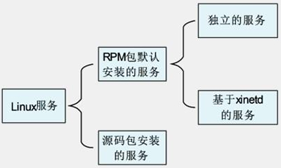
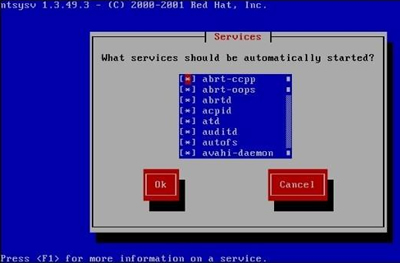

什么是系统服务？服务是在后台运行的应用程序，并且可以提供一些本地系统或网络的功能。

那么，Linux 中常见的服务有那些，这些服务怎么分类，服务如何启动，服务如何自启动，服务如何查看？

其实服务管理并不难，但是 Linux 中服务的分类比较多，而且每种服务又有多种启动和自启动方法，所以容易混淆。同时，常见网络服务的端口号也是必须掌握的基础知识。

## 服务的简介与分类

我们知道，系统服务是在后台运行的应用程序，并且可以提供一些本地系统或网络的功能。我们把这些应用程序称作服务，也就是 Service。不过，我们有时会看到 Daemon 的叫法，Daemon 的英文原意是"守护神"，在这里是"守护进程"的意思。

那么，什么是守护进程？它和服务又有什么关系呢？守护进程就是为了实现服务、功能的进程。比如，我们的 apache 服务就是服务（Service），它是用来实现 Web 服务的。那么，启动 apache 服务的进程是哪个进程呢？就是 httpd 这个守护进程（Daemon）。也就是说，守护进程就是服务在后台运行的真实进程。

如果我们分不清服务和守护进程，那么也没有什么关系，可以把服务与守护进程等同起来。在 Linux 中就是通过启动 httpd 进程来启动 apache 服务的，你可以把 httpd 进程当作 apache 服务的别名来理解。

### 服务的分类和区分

1. **服务的分类**

Linux 中的服务按照安装方法不同可以分为 RPM 包默认安装的服务和源码包安装的服务两大类。其中，RPM 包默认安装的服务又因为启动与自启动管理方法不同分为独立的服务和基于 xinetd 的服务。服务分类的关系图如图3-1 所示。

::: center

 

**图3-1	<u>服务分类的关系图</u>**

:::

我们知道，Linux 中常见的软件包有两种：一种是 RPM 包；另一种是源码包。那么，通过 RPM 包安装的系统服务就是 RPM  包默认安装的服务（因为 Linux 光盘中全是 RPM 包，Linux 系统也是通过 RPM 包安装的，所以我们把 RPM 包又叫作系统默认包），通过源码包安装的系统服务就是源码包安装的服务。

源码包是开源的，自定义性强，通过编译安装更加适合系统，但是安装速度较慢，编译时容易报错。RPM 包是经过编译的软件包，安装更快速，不易报错，但不再是开源的。

以上这些特点都是软件包本身的特点，但是软件包一旦安装到 Linux 系统上，它们的区别是什么呢？

最主要的区别就是安装位置不同，源码包安装到我们手工指定的位置当中，而 RPM 包安装到系统默认位置当中（可以通过 `rpm -ql  包名` 命令查询）。也就是说，RPM  包安装到系统默认位置，可以被服务管理命令识别；但是源码包安装到手工指定位置，当然就不能被服务管理命令识别了（可以手工修改为被服务管理命令识别）。

所以，RPM 包默认安装的服务和源码包安装的服务的管理方法不同，我们把它们当成不同的服务分类。服务分类说明如下。

RPM 包默认安装的服务。这些服务是通过 RPM 包安装的，可以被服务管理命令识别。

这些服务又可以分为两种：

- 独立的服务：就是独立启动的意思，这种服务可以自行启动，而不用依赖其他的管理服务。因为不依赖其他的管理服务，所以，当客户端请求访问时，独立的服务响应请求更快速。目前，Linux 中的大多数服务都是独立的服务，如 apache 服务、FTP 服务、Samba 服务等。
- 基于 xinetd 的服务：这种服务就不能独立启动了，而要依靠管理服务来调用。这个负责管理的服务就是 xinetd 服务。xinetd  服务是系统的超级守护进程，其作用就是管理不能独立启动的服务。当有客户端请求时，先请求 xinetd 服务，由 xinetd 服务去唤醒相对应的服务。当客户端请求结束后，被唤醒的服务会关闭并释放资源。这样做的好处是只需要持续启动 xinetd 服务，而其他基于 xinetd 的服务只有在需要时才被启动，不会占用过多的服务器资源。但是这种服务由于在有客户端请求时才会被唤醒，所以响应时间相对较长。

源码包安装的服务。这些服务是通过源码包安装的，所以安装位置都是手工指定的。由于不能被系统中的服务管理命令直接识别，所以这些服务的启动与自启动方法一般都是源码包设计好的。每个源码包的启动脚本都不一样，一般需要查看说明文档才能确定。

2. **查询已经安装的服务和区分服务**

我们已经知道 Linux 服务的分类了，那么应该如何区分这些服务呢？首先要区分 RPM 包默认安装的服务和源码包安装的服务。源码包安装的服务是不能被服务管理命令直接找到的，而且一般会安装到 `/usr/local/` 目录中。

也就是说，在 `/usr/local/` 目录中的服务都应该是通过源码包安装的服务。RPM 包默认安装的服务都会安装到系统默认位置，所以是可以被服务管理命令（如 `service`、`chkconfig`）识别的。

其次，在 RPM 包默认安装的服务中怎么区分独立的服务和基于 xinetd 的服务？这就要依靠 `chkconfig` 命令了。`chkconfig` 是管理 RPM 包默认安装的服务的自启动的命令，这里仅利用这条命令的查看功能。使用这条命令还能看到 RPM 包默认安装的所有服务。命令格式如下：

```shell
[root@localhost ~]# chkconfig --list [服务名]
选项：
	--list：列出 RPM 包默认安装的所有服务的自启动状态；

#例如：

[root@localhost ~]# chkconfig -list
#列出系统中RPM包默认安装的所有服务的自启动状态
abrt-ccpp	0:关闭 1:关闭 2:关闭 3:启用	4:关闭 5:启用 6:关闭
abrt-oops	0:关闭 1:关闭 2:关闭 3:启用 4:关闭 5:启用 6:关闭
...省略部分输出...
udev-post	0:关闭 1:启用 2:启用 3:启用 4:启用 5:启用 6:关闭
ypbind		0:关闭 1:关闭 2:关闭 3:关闭 4:关闭 5:关闭 6:关闭
```

这条命令的第一列为服务的名称，后面的 0~6  代表在不同的运行级别中这个服务是否开启时自动启动。这些服务都是独立的服务，因为它们不需要依赖其他任何服务就可以在相应的运行级别启动或自启动。但是没有看到基于 xinetd 的服务，那是因为系统中默认没有安装 xinetd 这个超级守护进程，需要我们手工安装。 

安装命令如下：

```shell
[root@localhost ~]# rpm -ivh /mnt/cdrom/Packages/xinetd-2.3.14-34.el6.i686.rpm
Preparing...
###############
[100%]
1:xinetd
###############
[100%]
#xinetd超级守护进程
```

这里需要注意的是，在 Linux 中基于 xinetd 的服务越来越少，原先很多基于 xinetd 的服务在新版本的 Linux 中已经变成了独立的服务。安装完 xinetd 超级守护进程之后，我们再查看一下，命令如下：

```shell
[root@localhost ~]# chkconfig --list
abrt-ccpp	0:关闭 1:关闭 2:关闭 3:启用 4:关闭 5:启用 6:关闭
abrt-oops	0:关闭 1:关闭 2:关闭 3:启用 4:关闭 5:启用 6:关闭
...省略部分输出...
udev-post 	0:关闭 1:启用 2:启用 3:启用 4:启用 5:启用 6:关闭
xinetd 		0:关闭 1:关闭 2:关闭 3:启用 4:启用 5:启用 6:关闭
ypbind 		0:关闭 1:关闭 2:关闭 3:关闭 4:关闭 5:关闭 6:关闭
基于 xinetd 的服务：
	chargen-dgram：		关闭
	chargen-stream：	关闭
	cvs：				关闭
	daytime-dgram：		关闭
	daytime-stream：	关闭
	discard-dgram：		关闭
	discard-stream：	关闭
	echo-dgram：		关闭
	echo-stream：		关闭
	rsync：				关闭
	tcpmux-server：		关闭
	time-dgram：		关闭
	time-stream：		关闭
```

在刚刚的独立的服务之下出现了一些基于 xinetd 的服务，这些服务没有自己的运行级别，因为它们不是独立的服务，到底在哪个运行级别可以自启动，则要看 xinetd 服务是在哪个运行级别自启动的。

### 服务和端口

1. **端口简介**

服务是给系统提供功能的，在系统中除了有系统服务，还有网络服务。而每个网络服务都有自己的端口，一般端口号都是固定的。那么，什么是端口呢？

我们知道，IP 地址是计算机在互联网上的地址编号，每台联网的计算机都必须有自己的 IP 地址，而且必须是唯一的，这样才能正常通信。也就是说，在互联网上是通过 IP 地址来确定不同计算机的位置的。

大家可以把 IP 地址想象成家庭的"门牌号码"，不管你住的是大杂院、公寓楼还是别墅，都有自己的门牌号码，而且门牌号码是唯一的。

如果知道了一台服务器的 IP 地址，我们就可以找到这台服务器。但是这台服务器上有可能搭建了多个网络服务，比如 WWW 服务、FTP  服务、Mail 服务，那么我们到底需要服务器为我们提供哪个网络服务呢？这时就要靠端口（Port）来区分了，因为每个网络服务对应的端口都是固定的。

比如，WWW 服务对应的端口是 80，FTP 服务对应的端口是 20 和 21，Mail 服务对应的端口是 25 和 110。也就是说，IP 地址可以想象成"门牌号码"，而端口可以想象成"家庭成员"，找到了 IP 地址只能找到你们家，只有找到了端口，寄信时才能找到真正的收件人。

为了统一整个互联网的端口和网络服务的对应关系，以便让所有的主机都能使用相同的机制来请求或提供服务，同一个服务使用相同的端口，这就是协议。

 计算机中的协议主要分为两大类：

- 面向连接的可靠的 TCP 协议（Transmission Control Protocol，传输控制协议）；
- 面向无连接的不可靠的 UDP 协议（User Datagram Protocol，用户数据报协议）；


这两种协议都支持 2^16^，也就是 65535 个端口。这么多端口怎么记忆呢？系统给我们提供了服务与端口的对应文件 `/etc/services`。 查看—下：

```shell
[root@localhost ~]# vi /etc/services
...省略部分输出...
ftp-data 20/tcp
ftp-data 20/udp
# 21 is registered to ftp, but also used by fsp
ftp 21/tcp
ftp 21/udp
fsp fspd
#FTP服务的端口
...省略部分输出...
smtp 25/tcp mail
smtp 25/udp mail
#邮件发送信件的端口
...省略部分输出...
http 80/tcp www www-http	#WorldWideWeb HTTP
http 80/udp www www-http	#HyperText Transfer Protocol
#WWW服务的端口
...省略部分输出...
pop3 110/tcp pop-3			# POP version 3
pop3 110/udp pop-3
#邮件接收信件的端口
...省略部分输出...
```

网络服务的端口能够修改吗？当然是可以的，不过一旦修改了端口，那么客户机在访问服务器时很难知道服务器对应的端口是什么，也就不能正确地获取服务了。所以，除非在实验环境下，否则不要修改网络服务对应的端口。

2. **查询系统中已经启动的服务**

既然每个网络服务对应的端口是固定的，那么是否可以通过查询服务器中开启的端口，来判断当前服务器开启了哪些服务？

当然是可以的。虽然判断服务器中开启的服务还有其他方法（如通过 `ps` 命令），但是通过端口的方法查看最为准确。命令格式如下：

```shell
[root@localhost ~]# netstat 选项
选项：
	-a：列出系统中所有网络连接，包括已经连接的网络服务、监听的网络服务和 Socket 套接字
	-t：列出 TCP 数据
	-u：列出 UDF 数据
	-l：列出正在监听的网络服务（不包含已经连接的网络服务）
	-n：用端口号来显示而不用服务名
	-p：列出该服务的进程 ID (PID)
```


举个例子：

```shell
[root@localhost ~]# netstat -tlunp
#列出系统中所有已经启动的服务（已经监听的端口），但不包含已经连接的网络服务
Active Internet connections (only servers)
Proto	Recv-Q	Send-Q	Local Address	Foreign Address	State	PID/Program	name
tcp		0		0		0.0.0.0:53575	0.0.0.0:*		LISTEN	1200/rpc.statd
tcp		0		0		0.0.0.0:111		0.0.0.0:* 		LISTEN	1181/rpcbind
tcp		0		0		0.0.0.0:22		0.0.0.0:*		LISTEN	1405/sshd
tcp		0		0		127.0.0.1:631	0.0.0.0:*		LISTEN	1287/cupsd
tcp		0		0		127.0.0.1:25	0.0.0.0:*		LISTEN	1481/master
tcp		0		0		:::57454		:::*			LISTEN	1200/rpc.statd
tcp		0		0		:::111			:::*			LISTEN	1181/rpcbind
tcp		0		0		:::22			:::*			LISTEN	1405/sshd
tcp		0		0		::1:631			:::*			LISTEN	1287/cupsd
tcp		0		0		::1:25			:::*			LISTEN	1481/master
udp		0		0		0.0.0.0:58322	0.0.0.0:*				1276/avahi-daemon
udp		0		0		0.0.0.0:5353	O.O.O.O:*				1276/avahi-daemon
udp		0		0		0.0.0.0:111		O.O.O.O:*				1181/rpcbind
udp		0		0		0.0.0.0:631		0.0.0.0:*				1287/cupsd
udp		0		0		0.0.0.0:56459	0.0.0.0:*				1200/rpc.statd
udp		0		0		0.0.0.0:932		0.0.0.0:*				1181/rpcbind
udp 	0		0		0.0.0.0:952		0.0.0.0:*				1200/rpc.statd
udp		0		0		:::111			:::*					1181/rpcbind
udp		0		0		:::47858		:::*					1200/rpc.statd
udp		0		0		:::932			:::*					1181/rpcbind
```

执行这条命令会看到服务器上所有已经开启的端口，也就是说，通过这些端口就可以知道当前服务器上开启了哪些服务。

 解释一下命令的执行结果：

- Proto：数据包的协议。分为 TCP 和 UDP 数据包；
- Recv-Q：表示收到的数据已经在本地接收缓冲，但是还没有被进程取走的数据包数量；
- Send-Q：对方没有收到的数据包数量；或者没有 Ack 回复的，还在本地缓冲区的数据包数量；
- Local Address：<u>本地IP:端口</u>。通过端口可以知道本机开启了哪些服务；
- Foreign Address：<u>远程主机:端口</u>。也就是远程是哪个 IP、使用哪个端口连接到本机。由于这条命令只能查看监听端口，所以没有 IP 连接到到本机；
- State：连接状态。主要有已经建立连接（ESTABLISED）和监听（LISTEN）两种状态，当前只能查看监听状态；
- PID/Program name：进程 ID 和进程命令；


再举个例子：

```shell
[root@localhost ~]# netstat -an
#查看所有的网络连接，包括已连接的网络服务、监听的网络服务和Socket套接字
Active Internet connections (servers and established)
Proto	Recv-Q	Send-Q	Local Address		Foreign Address		State
tcp		0		0		0.0.0.0:53575		0.0.0.0:*			LISTEN
tcp		0		0		0.0.0.0:111			0.0.0.0:* 			LISTEN
tcp		0		0		0.0.0.0:22			0.0.0.0:*			LISTEN
tcp		0		0		127.0.0.1:631		0.0.0.0:*			LISTEN
tcp		0		0		127.0.0.1:25		0.0.0.0:*			LISTEN
tcp		0		0		192.168.0.210:22	192.168.0.105:4868	ESTABLISHED
tcp		0		0		:::57454			:::*				LISTEN
...省略部分输出...
udp		0		0		:::932				:::*
Active UNIX domain [socket] (servers and established)
Proto	RefCnt	Flags		Type	State		I-Node	Path
#Socket套接字输出,后面有具体介绍
unix	2		[ ACC ]		STREAM	LISTENING	11712	/var/run/dbus/system_bus_socket
unix	2		[ ACC ]		STREAM	LISTENING	8450	@/com/ubuntu/upstart
unix	7		[ ]			DGRAM				8651	@/org/kernel/udev/udevd
unix	2		[ ACC ]		STREAM	LISTENING	11942	@/var/run/hald/dbus-b4QVLkivf1
...省略部分输出...
```

执行 `netstat -an` 命令能査看更多的信息，在 Stated 中也看到了已经建立的连接（ESTABLISED）。这是 ssh 远程管理命令产生的连接，ssh 对应的端口是 22。

而且我们还看到了 Socket  套接字。在服务器上，除网络服务可以绑定端口，用端口来接收客户端的请求数据外，系统中的网络程序或我们自己开发的网络程序也可以绑定端口，用端口来接收客户端的请求数据。这些网络程序就是通过 Socket 套接字来绑定端口的。也就是说，网络服务或网络程序要想在网络中传递数据，必须利用 Socke 套接字绑定端口，并进行数据传递。

使用 `netstat -an` 命令查看到的这些 Socke 套接字虽然不是网络服务，但是同样会占用端口，并在网络中传递数据。

解释一下 Socket 套接字的输出：

- Proto：协议，一般是 unix；
- RefCnt：连接到此Socket的进程数量；
- Flags：连接标识；
- Type：Socket访问类型；
- State：状态，LISTENING 表示监听，CONNECTED 表示已经建立连接；
- I-Node：程序文件的 i 节点号；
- Path：Socke 程序的路径，或者相关数据的输出路径；

## RPM 包默认安装的服务管理

我们先来讲解 RPM 包默认安装的服务如何管理，这里的管理主要指的是启动管理和自启动管理。启动很好理解，就是在当前系统中让服务运行，并提供功能。自启动是指在系统开机或重新启动之后，随着系统的启动而自动启动服务。

我们一直说 RPM 包默认安装的服务和源码包安装的服务最主要的区别就是程序的安装位置不同。源码包安装的服务安装到了用户的指定位置，那么 RPM 包默认安装的服务到底安装到了哪里呢？这些位置是固定的，我们分别来看。

- `/etc/init.d/`：RPM 包默认安装的服务中所有独立服务的启动脚本都放置在这里。在 `/etc/re.d/init.d/` 目录中放置的也是独立服务的启动脚本，这两个目录中的脚本文件是软链接，所以使用哪一个都可以。

- `/etc/sysconfig/`：这个目录用于放置 RPM 包默认安装的服务的初始化环境配置文件。服务会把自己在初始化过程中的一些参数设置写入这个目录中的文件。

- `/etc/`：这个目录用于放置 RPM 包默认安装的服务的配置文件。注意：源码包安装的服务的配置文件不在这里，而在源码包的安装目录中（源码包安装的服务的所有相关文件都在自己指定的安装目录中，所以删除源码包时可以直接删除安装目录）。

- `/etc/xinetd.conf`：超级守护进程 xinetd 的配置文件，这个文件基本不需要修改，因为 xinetd 进程是用来调用其他依赖它的服务的。

- `/etc/xinetd.d/`：这个目录中的文件就是基于 xinetd 服务的启动脚本。我们如果想要启动基于 xinetd 的服务，则需要修改这个目录中的文件。

- `/var/lib/`：RPM 包默认安装的服务如果产生了数据，就会把数据记录在这个目录中。如 RPM 包默认安装的 mysql 服务的数据库会存放在 `/var/lib/mysql/` 目录中。

- `/var/log/`：RPM 包默认安装的服务的日志都会放置在这个目录中。如 `/var/log/httpd/`目录就用于保存默认安装的 htpd 服务的日志。

RPM 包默认安装的服务的主要安装位置就是这些，某些服务可能会有一些特殊文件没有安装到这里，如默认安装的 apache 服务的网页主目录 `/var/www/html/`，这些特殊文件在学到时再具体对待。

### 独立服务管理

我们知道，RPM 包默认安装的服务分为**<u>独立的服务</u>**和**<u>基于 xinetd 的服务</u>**，那我们先来学习独立服务的管理。

1. **独立服务的启动管理**

独立的服务要想启动，主要有两种方法。

**1) 使用 `/etc/init.d/` 目录中的启动脚本来启动独立的服务**

既然所有独立服务的启动脚本都存放在 `/etc/init.d/` 目录中，那么，调用这些脚本就可以启动独立的服务了。这种启动方式是推荐启动方式，命令格式如下：

```shell
[root@localhost ~]#/etc/init.d/独立服务名 start|stop|status|restart|...
参数：
	start	：启动服务
	stop	：停止服务
	status	：查看服务状态
	restart	：重启动服务
```

我们以启动 RPM 包默认安装的 httpd 服务为例，命令如下：

```shell
[root@localhost ~]# /etc/init.d/httpd start
正在启动httpd:										[确定]
#启动httpd服务
[root@localhost ~]# /etc/init.d/httpd status
httpd (pid 13313)正在运行...
#查询httpd服务状态，并能够看到httpd服务的PID
[root@localhost ~]#/etc/init.d/httpd stop
停止 httpd:											[确定]
#停止httpd服务
[root@localhost ~]#/etc/init.d/httpd restart
停止httpd:											[失败]
正在启动httpd:										[确定]
#重启动httpd服务
```

**2) 使用 `service` 命令来启动独立的服务**

在 CentOS 系统中，我们还可以依赖 `service` 命令来启动独立的服务。`service` 命令实际上只是一个脚本，这个脚本仍然需要调用 `/etc/init.d/` 中的启动脚本来启动独立的服务。而且 `service` 命令是红帽系列 Linux 的专有命令，其他的 Linux 发行版本不一定拥有这条命令，所以我们并不推荐使用 `service` 命令来启动独立的服务。

`service` 命令格式如下：

```shell
[root@localhost ~]# service 独立服务名 start|stop|restart|...

例如：

[root@localhost ~]# service httpd restart
停止httpd:											[确定]
正在启动httpd:										[确定]
```

命令比输入 `/etc/init.d/` 目录要稍微简单。`service` 命令还可以查看所有独立服务的启动状态，这是一个常用功能，命令格式如下：

```shell
[root@localhost ~]# service --status-all
选项：
	--status-all：列出所有独立服务的启动状态;

例如：
abrtd(pid 1505)正在运行…
abrt-dumpoops(pid 1513)正在运行…
acpid(pid 1312)正在运行...
...省略部分输出...
```

随着 httpd 服务的启动和停止，使用 `netstat -tlun` 命令就会看到 80 端口出现和消失。这也就说明 apache 服务绑定的口就是 80，所以我们可以端口是否在服务器中出现来判断 apache 服务是否启动。

**2. 独立服务的自启动管理**

自启动指的是在系统之后，服务是否随着系统的启动而自动启动。如果启动了某个服务，那么这个服务会在系统重启之后启动吗？答案是不知道，因为启动命令只负责启动服务，而和服务的自启动完全没有关系。同样地，自启动命令只管服务是否会在系统重启之后启动，而和当前系统中的服务是否启动没有关系。

独立服务的自启动方法有三种，我们分别来学习。

**1) 使用 `chkconfig` 服务自启动管理命令**

第一种方法是利用 `chkconfig` 服务自启动管理命令来管理独立服务的自启动，这条命令的用法如下：

```SHELL
[root@localhost ~]# chkconfig --list
```

使用 `chkconfig` 命令除了可以查看所有 RPM 包默认安装服务的自启动状态，也可以修改和设置 RPM 包默认安装服务的自启动状态，只是独立的服务和基于 xinetd 的服务的设定方法稍有不同。我们先来看看独立的服务如何设置。命令格式如下：

```shell
[root@localhost ~]# chkconfig [--level 运行级别] [独立服务名] [on|off]
选项：
	--level: 设定在哪个运行级别中开机自启动（on），或者关闭自启动（off）；

例如：
[root@localhost ~]# chkconfig --list | grep httpd
httpd	0:关闭 1:关闭 2:关闭 3:关闭 4:关闭 5:关闭 6:关闭
#查询httpd的自启动状态。所有的级别都是不自启动的
[root@localhost ~]# chkconfig --level 2345 httpd on
#设置apache服务在进入2、3、4、5级别时自启动
[root@localhost ~]# chkconfig --list | grep httpd
httpd	0:关闭 1:关闭 2:启用 3:启用 4:启用 5:启用 6:关闭
#查询apache服务的自启动状态。发现在2、3、4、5这4个运行级别中变为了"启用"
```

还记得 0~6 这 7 个 Linux 的运行级别吗？如果在 0~6 这 7 个运行级别中服务都显示“关闭”，则该服务不自启动。如果在某个运行级别中显示“启用”，则代表在进入这个运行级别时，该服务开机自启动。

服务的自启动方法和服务的启动方法是不通用的，我们做一个实验验证一下。命令如下：

```shell
[root@localhost ~]# /etc/init.d/httpd status
httpd已停
#查询apache服务状态，是已经停止的
[root@localhost ~]# chkconfig --level 2345 httpd on
#设置apache服务在进入2、3、4、5级别时自启动
[root@localhost ~]# chkconfig --list | grep httpd
httpd 0:关闭 1:关闭 2:启用 3:启用 4:启用 5:启用 6:关闭
#查看一下，自启动已经生效
[root@localhost ~]# /etc/init.d/httpd status
httpd已停
#但是apache服务在当前系统中还是关闭的
```

大家看到了吗？虽然 apach 被设置为自启动，但是当前系统中的 apache 是没有启动的，所以启动和自启动是独立的。

**2) 修改 `/etc/rc.d/rc.local` 文件，设置服务自启动**

第二种方法就是修改 `/etc/rc.d/rc.local` 文件，在文件中加入服务的启动命令。这个文件是在系统启动时，在输入用户名和密码之前最后读取的文件（注意：`/etc/rc.d/rc.local` 和 `/etc/rc.local` 文件是软链接，修改哪个文件都可以）。这个文件中有什么命令，都会在系统启动时调用。

如果我们把服务的启动命令放入这个文件，这个服务就会在开机时自启动。命令如下：

```shell
[root@localhost ~]#vi /etc/rc.d/rc.local
#!/bin/sh
#
#This script will be executed *after* all the other init scripts.
#You can put your own initialization stuff in here if you don't want to do the full Sys V style init stuff.
touch /var/lock/subsys/local
/etc/rc.d/init.d/httpd start
#在文件中加入apache的启动命令
```

这样，只要重启之后，apache 服务就会开机自启动了。推荐大家使用这种方法管理服务的自启动，有两点好处：

- 第一，如果大家都采用这种方法管理服务的自启动，当我们碰到一台陌生的服务器时，只要查看这个文件就知道这台服务器到底自启动了哪些服务，便于集中管理。
- 第二，chkconfig 命令只能识别 RPM 包默认安装的服务，而不能识别源码包安装的服务。 源码包安装的服务的自启动也是通过 `/etc/rc.d/rc.local` 文件实现的，所以不会出现同一台服务器自启动了两种安装方法的同一个服务。

还要注意一下，修改 `/etc/rc.d/rc.local` 配置文件的自启动方法和 `chkconfig`  命令的自启动方法是两种不同的自启动方法。所以，就算通过修改 `/etc/rc.d/rc.local` 配置文件的方法让某个独立的服务自启动了，执行 `chkconfig --list` 命令并不到有什么变化。

**3) 使用 `ntsysv` 命令管理自启动**

第三种方法是使用 `ntsysv` 命令调用窗口模式来管理服务的自启动，非常简单。命令格式如下：

```shell
[root@localhost ~]# ntsysv [--level 运行级别]
选项：
	--level 运行级别：可以指定设定自启动的运行级别；

例如：
[root@localhost ~]# ntsysv --level 235
#只设定2、3、5级别的服务自启动
[root@localhost ~]# ntsysv
#按默认的运行级别设置服务自启动
```

执行命令后，会和 `setup` 命令类似，出现命令界面，如图3-2 所示。

::: center

 

**图3-2	<u>ntsysv 命令界面</u>**

:::

这个命令的操作是这样的：

- 上下键：在不同服务之间移动；
- 空格键：选定或取消服务的自启动。也就是在服务之前是否输入“*”；
- Tab键：在不同项目之间切换；
- F1键：显示服务的说明；

需要注意的是，`ntsysv` 命令不仅可以管理独立服务的自启动，也可以管理基于 xinetd 服务的自启动。也就是说，只要是 RPM 包默认安装的服务都能被 `ntsysv` 命令管理。但是源码包安装的服务不行。

这样管理服务的自启动多么方便，为什么还要学习其他的服务自启动管理命令呢？ `ntsysv` 命令虽然简单，但它是红帽系列 Linux 的专有命令，其他的 Linux 发行版本不一定拥有这条命令，而且条命令也不能管理源码包安装的服务，所以我们推荐大家使用 `/etc/rc.d/rc.local` 文件来管理服务的自启动。

### 基于 xinetd 服务的管理

本节学习基于 xinetd 服务的管理方法。基于 xinetd 的服务同样有启动管理和自启动管理之分，而且不管是启动管理还是自启动管理，都只有一种方法，相比独立的服务简单一些。

1. **基于 xinetd 服务的启动**

基于 xinetd 的服务没有自己独立的启动脚本程序，是需要依赖 xinetd 的启动脚本来启动的。xinetd 本身是独立的服务，所以 xinetd 服务自己的启动方法和独立服务的启动方法是一致的。

但是，所有基于 xinetd 这个超级守护进程的其他服务就不是这样的了，必须修改该服务的配置文件，才能启动基于 xinetd 的服务。所有基于 xinetd 服务的配置文件都保存在 `/etc/xinetd.d/` 目录中。

我们使用 Telnet 服务来举例。Telnet 服务是用来进行系统远程管理的，端口是 23。不过需要注意的是，Telnet 服务的远程管理数据在网络中是明文传输的，非常不安全，所以在生产服务器上是不建议启动 Telnet 服务的。在生产服务器上，远程管理使用的是 ssh 协议，ssh 协议是加密的，更加安全。

Telnet 服务也是分为“客户端/服务器端”的，其中服务器端是用来启动 Telnet 服务的，并不安全；客户端是用来连接服务器端或测试服务器的端口是否开启的，在实际工作中我们主要使用 Telnet 客户端来测试远程服务器开启了哪些端口。

客户端的命令格式如下：

```shell
[root@localhost ~]# telnet 服务器IP
#连接并管理远程服务器，因为数据明文传输，所以不安全
[root@localhost ~]# telnet 服务器IP 端口
#测试远程服务器的端口是否开启。如果能够正常连接，则证明该端口是开启的

例如：

[root@localhost ~]# telnet 192.168.0.210 22
#测试一下192.168.0.210这台服务器上的22（ssh服务）端口是否打开
#连接成功后，退出时使用"Ctrl+]"快捷键回到telnet交互模式，再输入"quit"退出
```

虽然 Telnet 服务不安全，但 Telnet 服务是基于 xinetd 的服务，我们使用 Telnet 服务来学习一下基于 xinetd  服务的启动管理。在目前的 Linux 系统中，Telnet 的服务器端都是不安装的，如果进行测试，则需要手工安装。安装命令如下：

```shell
[root@localhost ~]# rpm -ivh /mnt/cdroin/Packages/telnet-server-0.17-47.el6.i686.rpm


Preparing...			#########################[100%]
	1:telnet-server		#########################[100%]
#安装
[root@localhost ~]# chkconfig -list
#安装之后查询一下
...…省略部分输出...
基于xinetd的服务:
	chargen-dgram:	关闭
	chargen-stream:	关闭
	cvs:			关闭
	daytime-dgram:	关闭
	daytime-stream:	关闭
	discard-dgram:	关闭
	discard-stream:	关闭
	echo-dgram:		关闭
	echo-stream:	关闭
	rsync:			关闭
	tcpmux-server:	关闭
	telnet:			关闭
	time-dgram:		关闭
	time-stream:	关闭
#Telnet服务已经安装，是基于xinetd的服务，自启动状态是关闭
```

接下来我们就要启动 Telnet 服务了。既然基于 xinetd 服务的配置文件都在 `/etc/xinetd.d/` 目录中，那么 Telnet 服务的配置文件就是 `/etc/xinetd.d/telnet`。我们打开这个文件看看，如下：

```shell
[root@localhost ~]#vi /etc/xinetd.d/telnet
#default: on
#description: The telnet server serves telnet sessions; it uses \
#	unencrypted username/password pairs for authentication.
service telnet							<---服务的名称为telnet
{
	flags = REUSE						<---标志为REUSE，设定TCP/IP socket可重用
	socketjtype = stream				<---使用 TCP协议数据包
	wait = no							<---允许多个连接同时连接
	user = root							<---启动服务的用户为root
	server = /usr/sbin/in.telnetd		<---服务的启动程序
	log_on_failure += USERID			<---登录失败后，记录用户的ID
	disable = yes						<---服务不启动
}
```

如果想要启动 Telnet 服务，则只需要把 `/etc/xinetd.d/telnet` 文件中的"disable=yes"改为"disable=no"即可，"disable"代表取消，"disable=yes"代表取消是  yes，当然不启动服务；"disable=no"代表取消是 no，当然就是启动服务了。具体命令如下：

```shell
[root@localhost ~]# vi /etc/xinetd.d/telnet
#修改配置文件
service telnet {
...省略部分输出...
disable = no
#把 yes 改为 no
}
[root@localhost ~]# service xinetd restart
#重启xinetd服务
停止 xinetd:										[确定]
正在启动 xinetd:									[确定]
[root@localhost ~]# netstat -tlun | grep 23
tcp		0		0		:::23		:::*		LISTEN
#查看端口，23端口启动，表示Telne服务已经启动了
```

基于 xinetd 服务的启动都是这样的，只需修改 `/etc/xinetd.d/` 目录中的配置文件，然后重启 xientd 服务即可。

2. **基于 xientd 服务的自启动**

基于 xinetd 服务的自启动管理有两种方法，分别是通过 `chkconfig` 命令管理自启动和通过 `ntsysv` 命令管理自启动。但是不能通过修改 `/etc/rc.d/rc.local` 配置文件来管理自启动，因为基于 xinetd  的服务没有自己的启动脚本程序。我们分别来看看。

**1) 使用 `chkconfig` 命令管理自启动**

`chkconfig` 自启动管理命令可以管理所有 RPM 包默认安装的服务，所以也可以用来管理基于 xinetd 服务的自启动。命令格式如下：

```shell
[root@localhost ~]# chkconfig 服务名 on|off
#基于xinetd的服务没有自己的运行级别，而依靠xinetd服务的运行级别，所以不用指定--level选项

例如：
[root@localhost ~]# chkconfig telnet on
#启动Telnet服务的自启动
[root@localhost ~]# chkconfig --list | grep telnet
telnet:启用
#查看服务的自启动，Telnet服务变为了"启用"
[root@localhost ~]# chkconfig telnet off
#关闭Telnet服务的自启动
[root@localhost ~]# chkconfig --list|grep telnet
telnet:关闭
#查看服务的自启动，Telnet服务变为了 "关闭"
```

**2) 使用 `ntsysv` 命令管理自启动**

`ntsysv` 命令既然可以管理所有 RPM 包默认安装的服务，当然也能管理基于 xinetd 的服务。命令的使用方法和管理独立的服务是一样的，这里就不再重复介绍了。

其实，如果我们仔细来看，就会发现基于 xinetd 服务的启动和自启动区分得并不严格。启动命令也会把服务设置为自启动，自启动命令也会把服务设置为启动。我们做一个实验看看，命令如下：

```shell
[root@localhost ~]# vi /etc/xinetd.d/telnet
service telnet
{
	disable = yes
	...省略部分输出...
}
[root@localhost ~]# service xinetd restart
停止 xinetd:										[确定]
正在启动 xinetd:									[确定]
[root@localhost ~]# chkconfig telnet off
#先关闭Telnet服务的启动和自启动，保证不会对后面的实验产生影响

[root@localhost ~]# vi /etc/xinetd.d/telnet
service telnet
{
	disable = no
	...省略部分输出...
}
[root@localhost ~]# service xinetd restart
停止xinetd:											[确定]
正在启动xinetd:										[确定]
#然后启动Telnet服务
[root@localho.st ~] # chkconfig --list | grep telnet
telnet：启用
#看到了吗?我们一开始已经把Telnet服务的自启动关闭了。后面的实验虽然只启动了#Telnet服务，但是该服务自动变为了自启动状态
```

这个实验说明了基于 xinetd 服务的启动和自启动命令之间是通用的，在当前系统中启动了服务，服务的自启动也会开启；关闭了服务的自启动，当前系统中的服务也会关闭。

## 源码包服务管理

关于源码包服务管理，我们先学习源码包服务的启动管理，再来学习源码包服务的自启动管理，最后学习如何让源码包服务被系统服务管理命令识别。

### 源码包服务的启动管理

源码包服务中所有的文件都会安装到指定目录当中，并且没有任何垃圾文件产生（Linux 的特性），所以服务的管理脚本程序也会安装到指定目录中。源码包服务的启动管理方式就是在服务的安装目录中找到管理脚本，然后执行这个脚本。

问题来了，每个服务的启动脚本都是不一样的，我们怎么确定每个服务的启动脚本呢？还记得在安装源码包服务时，我们强调需要査看每个服务的说明文档吗（一般是 INSTALL 或 READEM）？在这个说明文档中会明确地告诉大家服务的启动脚本是哪个文件。

我们用 apache 服务来举例。一般 apache 服务的安装位置是 `/usr/local/apache2/` 目录，那么 apache  服务的启动脚本就是 `/usr/local/apache2/bin/apachectl` 文件（查询 apache 说明文档得知）。启动命令如下：

```shell
[root@localhost ~]# /usr/local/apache2/bin/apachectl start|stop|restart|...
#源码包服务的启动管理

例如：
[root@localhost ~]# /usr/local/apache2/bin/apachectl start
#会启动源码包安装的apache服务
```

::: tip 注意

不管是源码包安装的 apache，还是 RPM 包默认安装的 apache，虽然在一台服务器中都可以安装，但是只能启动一个，因为它们都会占用 80 端口。

:::

源码包服务的启动方法就这一种，比 RPM 包默认安装的服务要简单一些。

### 源码包服务的自启动管理

源码包服务的自启动管理也不能依靠系统的服务管理命令，而只能把标准启动命令写入 `/etc/rc.d/rc.local` 文件中。系统在启动过程中读取 `/etc/rc.d/rc.local` 文件时，就会调用源码包服务的启动脚本，从而让该服务开机自启动。命令如下：

```shell
[root@localhost ~]# vi /etc/rc.d/rc.local
#修改自启动文件
#!/bin/sh
#This script will be executed *after* all the other init scripts.
#You can put your own initialization stuff in here if you don11
#want to do the full Sys V style init stuff.
touch /var/lock/subsys/local
/usr/local/apache2/bin/apachectl start				<---加入此行内容，apache的启动命令
#加入源码包服务的标准启动命令，保存退出，源码包安装的apache服务就被设为自启动了
```

### 源码包服务被服务管理命令识别

在默认情况下，源码包服务是不能被系统的服务管理命令所识别和管理的，但是如果我们做一些设定，则也是可以让源码包服务被系统的服务管理命令所识别和管理的。不过并不推荐大家这样做，因为这会让本来区别很明确的源码包服务和 RPM 包服务变得容易混淆，不利于系统维护和管理。

我们做一个实验，看看如何把源码包安装的 apache 服务变为和 RPM 包默认安装的 apache 服务一样，可以被 service、chkconfig、ntsysv 命令所识别。实验如下：

```shell
# 1) 卸载RPM包默认安装的apache服务

[root@localhost ~]# yum -y remove httpd
#卸载RPM包默认安装的apache服务,避免对实验产生影响（在生产服务器上慎用yum卸载，因为这有可能造成服务器崩溃)
[root@localhost ~]# service httpd start
httpd:未被识别的服务
#因为服务被卸载,所以service命令不能识别httpd服务


# 2) 安装源码包的apache服务，并启动

#安装源码包的apache服务
[root@localhost ~]# /usr/local/apache2/bin/apachect1 start
[root@localhost ~]# netstat -tlun | grep 80
tcp 0 0 :::80 :::* LISTEN
#启动源码包安装的apache服务，查看端口确定已经启动

# 3) 让源码包安装的apache服务能被service命令管理启动

[root@localhost ~]# ln -s /usr/local/apache2/bin/apachectl /etc/±nit.d/apache
#service命令其实只是在/etc/init.d/目录中查找是否有服务的启动脚本，所以我们只需要做一个软链接,
#把源码包的启动脚本链接到/etc/init.d/目录中,就能被service命令所管理了。
#为了照顾大家的习惯，我把软链接文件命名为apache,注意这不是RPM包默认安装的apache服务
[root@localhost ~]# service apache restart
#虽然RPM包默认安装的apache服务被卸载了,但是service命令也能够生效

# 4) 让源码包安装的apache服务能被chkconfig命令管理自启动

[root@localhost ~]# vi /etc/init.d/apache
#修改源码包安装的apache服务的启动脚本(注意此文件是软链接,所以修改的还是源码包启动脚本)
#!/bin/sh
#
#chkconfig: 35 86 76
#指定httpd脚本可以被chkconfig命令所管理
#格式是：chkconfig：运行级别 启动顺序 关闭顺序
#这里我们让apache服务在3和5级别中能被chkconfig命令所管理，启动顺序是S86，关闭顺序是K76
#(自定顺序，不要和系统中已有的启动顺序冲突)
#description: source package apache
#说明，内容随意
#以上两句话必须加入,才能被chkconfig命令所识别
...省略部分输出...
[root@localhost ~]# chkconfig --add apache
#让chkconfig命令能够管理源码包安装的apache服务
[root01ocalhost ~]# chkconfig --list | grep apache
apache 0:关闭 1:关闭 2:关闭 3:关闭 4:关闭 5:关闭 6:关闭
#很神奇吧,虽然RPM包默认安装的apache服务被删除了,但是chkconfig命令可以管理源码包安装的tapache服务

# 5) 让ntsysv命令可以管理源码包安装的apache服务

#ntsysv 命令其实和 chkconfig 命令使用同样的管理机制,也就是说,ntsysv 已经可以
#进行源码包安装 apache 服务的自启动管理了,如图3-3 所示
```

::: center


**图3-3	<u>ntsysv 命令识别 apache</u>**

:::

总结一下，如果想让源码包服务被 `service` 命令所识别和管理，则只需做一个软链接把启动脚本链接到 `/etc/init.d/`  目录中即可。要想让源码包服务被 `chkconfig` 命令所识别，除了需要把服务的启动脚本链接到 `/etc/init.d/` 目录中，还要修改这个启动脚本，在启动脚本的开头加入如下内容：

```shell
#chkconfig:运行级别 启动顺序 关闭
#description:说明
```

然后需要使用 `chkconfig--add 服务名` 的方式把服务加入 `chkconfig` 命令的管理中。命令格式如下：

```shell
[root@localhost ~]# chkconfig [选项] [服务名]
选项：
	-add：把服务加入 chkconfig 命令的管理中；
	-del：把服务从 chkconfig 命令的管理中删除；

# 例如：
[root@localhost ~]# chkconfig -del httpd
#把apache服务从chkconfig命令的管理中删除
```

## 服务管理总结

服务管理的分类较多，方法也比较多，容易混淆，我们来画一张图来总结一下 Linux 中服务管理的方法，如图3-4 所示。

::: center


**图3-4	<u>服务管理总结</u>**

:::

## 常见服务类别及功能

Linux 中的服务数量非常多，我们在学习时一直使用 apache 服务作为实例。很多人会产生困惑：其他的服务都是干什么的呢？它们有什么作用呢？是不是必须启动的呢？

那么，我们就来介绍 Linux 中常见服务及它们各自的作用。

在生产服务器上，安装完 Linux 之后有一步重要的工作，就是服务优化。也就是关闭不需要的服务，只开启需要的服务。因为服务启动得越多，占用的系统资源就越多，而且被攻击的可能性也増加了。如果要进行服务优化，就需要知道这些服务都有什么作用，如表3-1 所示。

**表3-1	<u>Linux 中常见服务的作用</u>**

| 服务名称        | 功能简介                                                     | 建议 |
| --------------- | ------------------------------------------------------------ | ---- |
| acpid           | 电源管理接口。如果是笔记本电脑用户，则建议开启，可以监听内核层的相关电源事件 | 开   |
| anacron         | 系统的定时任务程序。是 cron 的一个子系统，如果定时任务错过了执行时间，则可以通过 anacron 继续唤醒执行 | 关   |
| alsasound       | alsa 声卡驱动。如果使用 alsa 声卡，则开启                    | 关   |
| apmd            | 电源管理模块。如果支持 acpid，就不需要 apmd，可以关闭        | 关   |
| atd             | 指定系统在特定时间执行某个任务，只能执行一次。如果需要则开启，但我们一般使用 crond 来执行循环定时任务 | 关   |
| auditd          | 审核子系统。如果开启了此服务，那么 SELinux 的审核信息会写入 `/var/log/audit/ audit.log` 文件；如果不开启，那么审核信息会记录在 syslog 中 | 开   |
| autofs          | 让服务器可以自动挂载网络中其他服务器的共享数据,一般用来自动挂载 NFS 服务。如果没有 NFS 服务，则建议关闭 | 关   |
| avahi-daemon    | avahi 是 zeroconf 协议的实现，它可以在没有 DNS 服务的局域网里发现基于 zeroconf 协议的设备和服务。除非有兼容设备或使用 zeroconf 协议，否则关闭 | 关   |
| bluetooth       | 蓝牙设备支持。一般不会在服务器上启用蓝牙设备，关闭它         | 关   |
| capi            | 仅对使用 ISND 设备的用户有用                                 | 关   |
| chargen-dgram   | 使用 UDP 协议的 chargen server。其主要提供类似远程打字的功能 | 关   |
| chargen-stream  | 同上                                                         | 关   |
| cpuspeed        | 可以用来调整 CPU 的频率。当闲置时，可以自动降低 CPU 频率来节省电量 | 开   |
| crond           | 系统的定时任务，一般的 Linux 服务器都需要定时任务来协助系统维护。建议开启 | 开   |
| cvs             | 一个版本控制系统                                             | 关   |
| daytime-dgram   | 使用 TCP 协议的 daytime 守护进程，该协议为客户机实现从远程服务器获取日期和时间的功能 | 关   |
| daytime-slream  | 同上                                                         | 关   |
| dovecot         | 邮件服务中 POP3/IMAP 服务的守护进程，主要用来接收信件。如果启动了邮件服务则开启：否则关闭 | 关   |
| echo-dgram      | 服务器回显客户服务的进程                                     | 关   |
| echo-stream     | 同上                                                         | 关   |
| firstboot       | 系统安装完成后，有一个欢迎界面，需要对系统进行初始设定，这就是这个服务的作用。既然不是第一次启动了，则建议关闭 | 关   |
| gpm             | 在字符终端（ttyl~tty6）中可以使用鼠标复制和粘贴，这就是这个服务的功能 | 开   |
| haldaemon       | 检测和支持 USB 设备。如果是服务器则可以关闭，个人机则建议开启 | 关   |
| hidd            | 蓝牙鼠标、键盘等蓝牙设备检测。必须启动 bluetooth 服务        | 关   |
| hplip           | HP 打印机支持，如果没有 HP 打印机则关闭                      | 关   |
| httpd           | apache 服务的守护进程。如果需要启动 apache，就开启           | 开   |
| ip6tables       | IPv6 的防火墙。目前 IPv6 协议并没有使用，可以关闭            | 关   |
| iptables        | 防火墙功能。Linux 中的防火墙是内核支持功能。这是服务器的主要防护手段，必须开启 | 开   |
| irda            | IrDA 提供红外线设备（笔记本电脑、PDA’s、手机、计算器等）间的通信支持。建议关闭 | 关   |
| irqbalance      | 支持多核处理器，让 CPU 可以自动分配系统中断（IRQ)，提高系统性能。目前服务器多是多核 CPU，请开启 | 开   |
| isdn            | 使用 ISDN 设备连接网络。目前主流的联网方式是光纤接入和 ADSL，ISDN 己经非常少见，请关闭 | 关   |
| kudzu           | 该服务可以在开机时进行硬件检测，并会调用相关的设置软件。建议关闭，仅在需要时开启 | 关   |
| lvm2-monitor    | 该服务可以让系统支持LVM逻辑卷组，如果分区采用的是LVM方式，那么应该开启。建议开启 | 开   |
| mcstrans        | SELinux 的支持服务。建议开启                                 | 开   |
| mdmonitor       | 该服务用来监测 Software RAID 或 LVM 的信息。不是必需服务，建议关闭 | 关   |
| mdmpd           | 该服务用来监测 Multi-Path 设备。不是必需服务，建议关闭       | 关   |
| messagebus      | 这是 Linux 的 IPC（Interprocess Communication，进程间通信）服务，用来在各个软件中交换信息。建议关闭 | 关   |
| microcode _ctl  | Intel 系列的 CPU 可以通过这个服务支持额外的微指令集。建议关闭 | 关   |
| mysqld          | MySQL 数据库服务器。如果需要就开启；否则关闭                 | 开   |
| named           | DNS 服务的守护进程，用来进行域名解析。如果是 DNS 服务器则开启；否则关闭 | 关   |
| netfs           | 该服务用于在系统启动时自动挂载网络中的共享文件空间，比如 NFS、Samba 等。 需要就开启，否则关闭 | 关   |
| network         | 提供网络设罝功能。通过这个服务来管理网络，建议开启           | 开   |
| nfs             | NFS（Network File System）服务，Linux 与 Linux 之间的文件共享服务。需要就开启，否则关闭 | 关   |
| nfslock         | 在 Linux 中如果使用了 NFS 服务，那么，为了避免同一个文件被不同的用户同时编辑，所以有这个锁服务。有 NFS 时开启，否则关闭 | 关   |
| ntpd            | 该服务可以通过互联网自动更新系统时间.使系统时间永远准确。需要则开启，但不是必需服务 | 关   |
| pcscd           | 智能卡检测服务，可以关闭                                     | 关   |
| portmap         | 用在远程过程调用（RPC）的服务，如果没有任何 RPC 服务，则可以关闭。主要是 NFS 和 NIS 服务需要 | 关   |
| psacct          | 该守护进程支持几个监控进程活动的工具                         | 关   |
| rdisc           | 客户端 ICMP 路由协议                                         | 关   |
| readahead_early | 在系统开启的时候，先将某些进程加载入内存整理，可以加快启动速度 | 关   |
| readahead_later | 同上                                                         | 关   |
| restorecond     | 用于给 SELinux 监测和重新加载正确的文件上下文。如果开启 SELinux，则需要开启 | 关   |
| rpcgssd         | 与 NFS 有关的客户端功能。如果没有 NFS 就关闭                 | 关   |
| rpcidmapd       | 同上                                                         | 关   |
| rsync           | 远程数据备份守护进程                                         | 关   |
| sendmail        | sendmail 邮件服务的守护进程。如果有邮件服务就开启；否则关闭  | 关   |
| setroubleshoot  | 该服务用于将 SELinux 相关信息记录在日志 `/var/log/messages` 中。建议开启 | 开   |
| smartd          | 该服务用于自动检测硬盘状态。建议开启                         | 开   |
| smb             | 网络服务 samba 的守护进程。可以让 Linux 和 Windows 之间共享数据。如果需要则开启 | 关   |
| squid           | 代理服务的守护进程。如果需要则开启：否则关闭                 | 关   |
| sshd            | ssh 加密远程登录管理的服务。服务器的远程管理必须使用此服务，不要关闭 | 开   |
| syslog          | 日志的守护进程                                               | 开   |
| vsftpd          | vsftp 服务的守护进程。如果需要 FTP 服务则开启；否则关闭      | 关   |
| xfs             | 这是 X Window 的字体守护进程，为图形界面提供字体服务。如果不启动图形界面，就不用开启 | 关   |
| xinetd          | 超级守护进程。如果有依赖 xinetd 的服务，就必须开启           | 开   |
| ypbind          | 为 NIS（网络信息系统）客户机激活 ypbind 服务进程             | 关   |
| yum-updatesd    | yum 的在线升级服务                                           | 关   |
