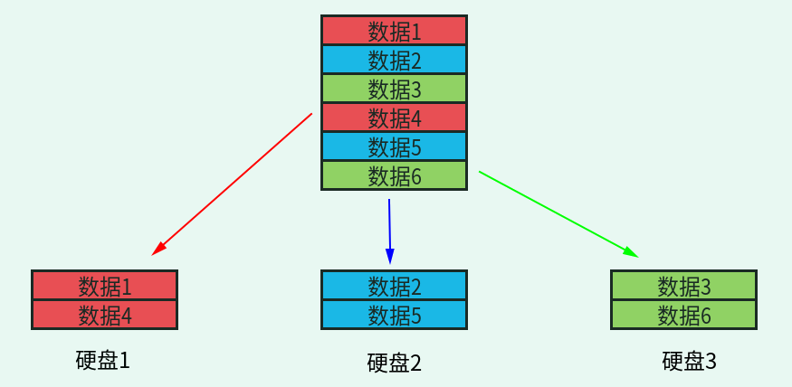
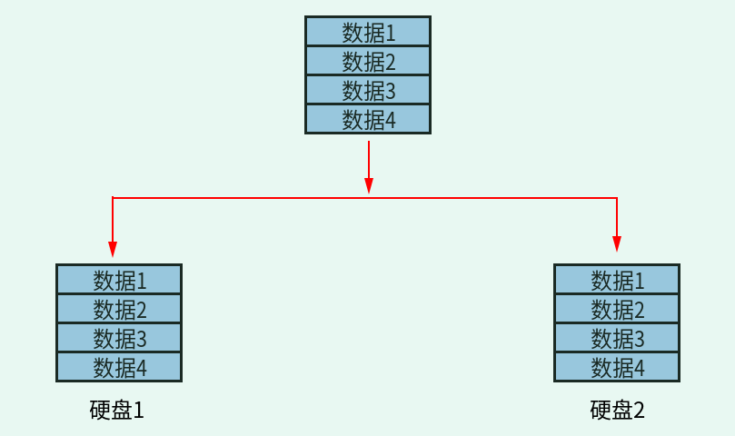
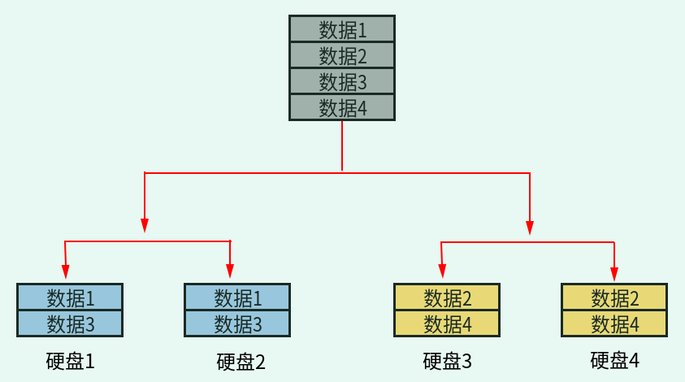
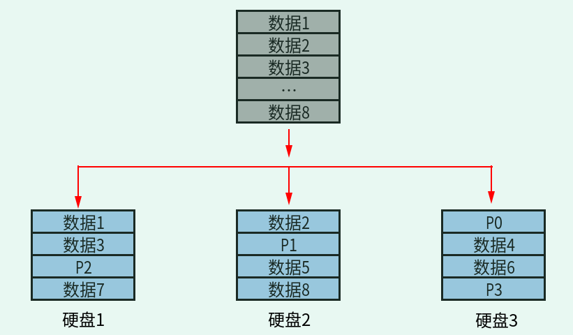

## 磁盘配额

### 什么是磁盘配额

**磁盘配额（Quota）就是 Linux 系统中用来限制特定的普通用户或用户组在指定的分区上占用的磁盘空间或文件个数的。**

在此概念中，有以下几个重点需要注意：

1. 磁盘配额限制的用户和用户组，只能是普通用户和用户组，也就是说超级用户 root 是不能做磁盘配额的；
2. 磁盘配额限制只能针对分区，而不能针对某个目录，换句话说，磁盘配额仅能针对文件系统进行限制，举个例子，如果你的 `/dev/sda5` 是挂载在 `/home` 底下，那么，在 `/home` 下的所有目录都会受到磁盘配额的限制；
3. 我们可以限制用户占用的磁盘容量大小（block），当然也能限制用户允许占用的文件个数（inode）。


磁盘配额在实际生活中其实是很常见的，比如，我们的邮箱不管多大，都是有限制的，而不可能无限制地存储邮件；我们可以上传文件的服务器也是有容量限制的；网页中的个人空间也不可能让我们无限制地使用。

磁盘配额就好像我们出租写字楼，虽然整栋楼的空间非常大，但是酬整栋楼的成本太高。我们可以分开出租，用户如果觉得不够用，则还可以租用更大的空间。不过租用是不能随便进行的，其中有几个规矩必须遵守：

- 我的楼是租给外来用户的（普通用户），可以租给一个人（用户），也可以租给一家公司（用户 组），但是这栋楼的所有权是我的，所以不能租给我自己（root 用户）；
- 如果要租用，则只能在每层租用一定大小的空间，而不能在一个房间中再划分出子空间来租用（配额只能针对分区，而不能限制某个目录）；
- 租户可以决定在某层租用多大的空间（磁盘容量限制），也可以在某层租用几个人员名额，这样只有这几个人员才能进入本层（文件个数限制）。

磁盘配额要想正常使用，有以下几个前提条件：

1. 内核必须支持磁盘配额。Centos 6.x 版本的 Linux 默认支持磁盘配额，不需要做任何修改。如果不放心，则可以查看内核配置文件，看是否支持磁盘配额。命令如下：

   ```shell
   [root@localhost ~]# grep CONFIG_QUOTA /boot/corrfig-2.6.32-279.el6.i686
    CONFIG_QUOTA=y
    CONFIG_QUOTA_NETLINK_INTERFACE=y
    # CONFIG_QUOTA_DEBUG is not set
    CONFIG_QUOTA_TREE=y
    CONFIG_QUOTACTL=y
   ```

   可以看到，内核已经支持磁盘配额。如果内核不支持，就需要重新编译内核，加入 quota supper 功能。

2. 系统中必须安装了 Quota 工具。我们的 Linux 中默认安装了 Quota 工具，查看命令如下：

   ```shell
   [root@localhost ~]# rpm -qa | grep quota
   quota-3.17-16.el6.i686
   ```

3. 要支持磁盘配额的分区必须开启磁盘配额功能。这项功能可以手动开启，不再是默认开启的。


磁盘配额可用于限制每个人可用网页空间、邮件空间以及网络硬盘空间的容量。除此之外，在 Linux 系统资源配置方面，使用磁盘配额，还可以限制某一群组或某一使用者所能使用的最大磁盘配额，以及以 Link 的方式，来使邮件可以作为限制的配额（更改 `/var/spool/mail` 这个路径）。

### 磁盘配额中的常见概念

1. **用户配额和组配额**

用户配额是指针对用户个人的配额，而组配额是指针对整个用户组的配额。如果我们需要限制的用户数量并不多，则可以给每个用户单独指定配额。如果用户比较多，那么单独限制太过麻烦，这时我们可以把用户加入某个用户组，然后给组指定配额，就会简单得多。

需要注意的是，组中的用户是共享空间或文件数的。也就是说，如果用户 lamp1、lamp2 和 lamp3 都属于 brother 用户组，我给  brother 用户组分配 100MB 的磁盘空间，那么，这三个用户不是平均分配这 100MB 空间的，而是先到先得，谁先占用，谁就有可能占满这 100MB 空间，后来的就没有空间可用了。

2. **磁盘容量限制和文件个数限制**

我们除了可以通过限制用户可用的 block 数量来限制用户可用的磁盘容量，也可以通过限制用户可用的 inode 数量来限制用户可以上传或新建的文件个数。

3. **软限制和硬限制**

软限制可理解为警告限制，硬限制就是真正的限制了。比如，规定软限制为 100MB，硬限制为 200MB，那么，当用户使用的磁盘空间为 100~200MB 时，用户还可以继续上传和新建文件，但是每次登录时都会收到一条警告消息，告诉用户磁盘将满。

4. **宽限时间**

如果用户的空间占用数处于软限制和硬限制之间，那么系统会在用户登录时警告用户磁盘将满，但是这个警告不会一直进行，而是有时间限制的，这个时间就是宽限时间，默认是 7 天。

如果到达宽限时间，用户的磁盘占用量还超过软限制，那么软限制就会升级为硬限制。也就是说，如果软限制是 100MB，硬限制是 200MB，宽限时间是 7天，此时用户占用了 120MB，那么今后 7 天用户每次登录时都会出现磁盘将满的警告，如果用户置之不理，7 天后这个用户的硬限制就会变成  100MB，而不是 200MB 了。

### 磁盘配额启动的前期准备

前面我们已经谈到，使用磁盘配额的前提，是必须要**内核**以及**文件系统**支持才行，这里假设大家使用的就是支持磁盘配额的内核，那么接下来就是要配置文件系统，使其支持配额限制。

由于 Quota 仅针对文件系统进行限制，因此我们有必要查一下，`/home` 是否是独立的文件系统，执行命令如下：

```shell
[root@localhost ~]# df -h /home
Filesystem   Size Used Avail Use% Mounted on
/dev/sda3   4.8G 740M 3.8G 17% /home			<-- /home 确实是独立的！
```

可以看到，`/home` 确实是独立的文件系统，因此可以直接对其进行限制。但如果你所用系统中，`/home` 不是独立的文件系统，则可能就要针对根目录做磁盘配额了，但不建议大家这样做。

另外，由于 VFAT 文件系统并不支持磁盘配额功能，因此，这里需要查看 `/home` 的文件系统，执行命令如下：

```shell
[root@localhost ~]# mount | grep home
/dev/hda3 on /home type ext4 (rw)
```

显然，`/home` 的文件系统为 ext4，是支持磁盘配额的。

在此基础上，如果想要获得文件系统的支持，还需要为执行的文件系统添加挂载参数，分别是 `usrquota`（启用用户限额）和 `grpquota`（启动用户组限额），添加的方式有以下 2 种：

1. 如果只是想在本次启动中试验磁盘配额，则只需使用如下的方式手动添加挂载参数：

   ```shell
   [root@localhost ~]# mount -o remount,usrquota,grpquota /home
   [root@localhost ~]# mount | grep home
   /dev/sda3 on /home type ext4 (rw,usrquota,grpquota)
   ```

2. 手动添加的方式，会在下次重新挂载时消失，因此我们可以直接修改 `/etc/fstab` 文件，将挂载参数写入到配置文件中，这样，即便重新挂载也不会消失，执行命令如下：

   ```shell
   [root@www ~]# vi /etc/fstab
   ......
   LABEL=/home  /home ext4  defaults,usrquota,grpquota 1 2
   [root@www ~]# umount /home
   [root@www ~]# mount -a
   [root@www ~]# mount | grep home
   /dev/sda3 on /home type ext4 (rw,usrquota,grpquota)
   ```

   注意，修改完 `/etc/fatab` 文件后，务必要亲自测试一下，有问题赶紧处理，因为此文件修改错误，将直接导致系统无法启动。


由此，我们就成功启用了文件系统对磁盘配额的支持，但此时还是不能立即使用磁盘配额，还需进一步检测相应的文件系统，并建立磁盘配额文件，这就需要使用 `quotacheck` 命令。

### quotacheck 命令

其实，磁盘配额（Quota）就是通过分析整个文件系统中每个用户和群组拥有的文件总数和总容量，再将这些数据记录在文件系统中的最顶层目录中，然后在此记录文件中使用各个用户和群组的配额限制值去规范磁盘使用量的。因此，建立 Quota 的记录文件是非常有必要的。

**扫描文件系统（必须含有挂载参数 usrquota 和 grpquota）并建立 Quota 记录文件，可以使用 `quotacheck` 命令**。此命令的基本格式为：

```shell
[root@localhost ~]# quotacheck [选项] 文件系统
选项：
	-a	：扫瞄所有在 /etc/mtab 中，含有 quota 支持的 filesystem，加上此参数后，后边的文件系统可以不写
	-u	：针对使用者扫瞄文件与目录的使用情况，会创建 aquota.user
	-g	：针对群组扫瞄文件与目录的使用情况，会创建 aquota.group
	-v	：显示扫瞄的详细过程
	-f	：强制扫瞄文件系统，并写入新的 quota 记录文件
	-M	：强制以读写的方式扫瞄文件系统，只有在特殊情况下才会使用。
```

在使用这些选项时，一般常用参数就是 “-avug” 。至于“ -f”和“-M”选项，是在文件系统以启动 `quota` 的情况下，还要重新扫描文件系统（担心有其他用户在使用 quota 中），才需要使用这两个选项。

::: tip 说明

这里需要注意，如果采用命令的方式开启磁盘配额功能，那么只在本次开机中生效，一旦系统重新启动，这个功能就会失效。如：

```shell
[root@localhost ~]# mount -o remount,usrquota,grpquota /home
```

使用上面命令临时挂载分区，系统会同步更新到 `/etc/mtab` 文件。

**`/etc/mtab` 和 `/etc/fstab` 的区别：**

其实 `/etc/mtab` 文件中记录的是操作系统已经挂载的文件系统（分区），包括操作系统建立的虚拟文件系统，所以，如果磁盘配额功能是临时生效的，那么使用命令修改的就是这个文件；而 `/etc/fistab` 文件中记录的是操作系统准备挂载的文件系统，也就是下次启动后系统会挂载的文件系统，所以，如果磁盘配额功能是永久生效的，就应该修改这个文件。

:::

例如，我们可以使用如下的命令，对整个系统中含有挂载参数（usrquota 和 grpquota）的文件系统进行扫描：

```shell
[root@localhost ~]# quotacheck -avug
quotacheck: Scanning /dev/hda3 [/home] quotacheck: Cannot stat old user quota
file: No such file or directory					<--有找到文件系统，但尚未制作记录文件！
quotacheck: Cannot stat old group quota file: No such file or directory
quotacheck: Cannot stat old user quota file: No such file or directory
quotacheck: Cannot stat old group quota file: No such file or directory
done 												<--上面三个错误只是说明记录文件尚未创建而已，可以忽略不理！
quotacheck: Checked 130 directories and 107 files	<--实际搜寻结果
quotacheck: Old file not found.
quotacheck: Old file not found.
# 若运行这个命令却出现如下的错误信息，表示你没有任何文件系统有启动 quota 支持！
# quotacheck: Can't find filesystem to check or filesystem not mounted with quota option.
 
[root@localhost ~]# ll -d /home/a*
-rw------- 1 root root 8192 Mar 6 11:58 /home/aquota.group
-rw------- 1 root root 9216 Mar 6 11:58 /home/aquota.user
# 可以看到，扫描的同时，会创建两个记录文件，放在 /home 底下
```

需要注意的是，此命令不要反复的执行，因为若启动 `Quota` 后还执行此命令，会破坏原有的记录文件，同时产生一些错误信息。

通过执行 `quotacheck` 命令，就可以成功创建支持配额的记录文件，千万不要去手动编辑这两个文件，一方面，这两个文件是 `Quota`  自己的数据文件，并不是纯文本文件；并且在你对该文件系统进行操作时，操作的结果会同步到这两个文件中，因此文件中的数据会发生变化。

通过学习，你只需要知道，要启动 `Quota`，需创建两个记录文件，分别为 aquota.group 和 aquota.user，而创建的工作，不是手动编辑的，需要使用 `quotacheck` 命令。

::: tip 补充

如果用 `quotacheck` 命令创建磁盘配额的配置文件时权限不够，这是由于 SELinux 造成的，把 SELinux 关闭即可。命令如下：

```shell
[root@localhost ~]# vi /etc/selinux/config
SELINUX=enforcing
#把这句话改改成下面这样
SELINUX=disabled
```

然后再重新启动 Linux 系统，再重新执行 `quotacheck` 命令。

:::

### quotaon 命令：开启磁盘配额限制

通过前面的学习，我们已经使用 `quotacheck` 命令创建好了磁盘配额（Quota）的记录文件，接下来就可以启动 `Quota` 了，启动方法也很简单，直接使用 `quotaon` 命令即可。

`quotaon` 命令的功能就是启动 `Quota` 服务，此命令的基本格式为：

```shell
[root@localhost ~]# quotaon [选项] 文件系统名称
选项：
	-a	：根据 /etc/mtab 文件中对文件系统的配置，启动相关的Quota服务，如果不使用 -a 选项，则此命令后面就需要明确写上特定的文件系统名称
	-u	：针对用户启动 Quota（根据记录文件 aquota.user）
	-g	：针对群组启动 Quota（根据记录文件 aquota.group）
	-v	：显示启动服务过程的详细信息
```


需要注意的是，`quotaon -auvg` 命令<u>只需要在第一次启动 Quota 服务时才需要进行，因为下次重新启动系统时，系统的 `/etc/rc.d/rc.sysinit` 初始化脚本会自动下达这个命令。</u>

 例 1：如果要同时启动针对用户和群组的 Quota 服务，可以使用如下命令：

```shell
[root@localhost ~]# quotaon -auvg
/dev/hda3 [/home]: group quotas turned on
/dev/hda3 [/home]: user quotas turned on
```

 例 2：如果只针对用户启动 `/var` 的 Quota 支持，可以使用如下命令：

```shell
[root@localhost ~]# quotaon -uv /var
```

### quotaoff 命令：关闭磁盘配额限制

磁盘配额（Quota）服务既然能使用 quotaon 命令手动开启，那么自然也能手动关闭，使用 quotaoff 命令即可。

 quotaoff 命令的功能就是关闭 Quota 服务，此命令的基本格式同 quotaon 命令一样，如下所示：

```shell
[root@localhost ~]# quotaoff [选项] 文件系统名称
选项：
	-a	：根据 /etc/mtab 文件，关闭已启动的 Quota 服务，如果不使用 -a 选项，则此命令后面就需要明确写上特定的文件系统名称
	-u	：关闭针对用户启动的 Quota 服务。
	-g	：关闭针对群组启动的 Quota 服务。
	-v	：显示服务过程的详细信息
```

例 1：如果要关闭所有已开启的Quota服务，可以使用如下命令：

```shell
[root@localhost ~]# quotaoff -auvg
```

例 2：如果只针对用户关闭 `/var` 启动的 Quota 支持，可以使用如下命令：

```shell
[root@localhost ~]# quotaoff -uv /var
```

### edquota 命令：修改用户和组的磁盘配额

针对用户和群组的配额限制（Quota），不仅可以手动控制开启和关闭，还可以手动修改配额参数，即使用 `edquota` 命令。

`edquota` 命令，是 edit quota 缩写，用于修改用户和群组的配额限制参数，包括磁盘容量和文件个数限制、软限制和硬限制值、宽限时间，该命令的基本格式有以下 3 种：

```shell
[root@localhost ~]# edquota [选项] [用户名或组名]
选项：
	-u 用户名	：进入配额的 Vi 编辑界面，修改针对用户的配置值
	-g 组名		：进入配额的 Vi 编辑界面，修改针对群组的配置值
	-t			：修改配额参数中的宽限时间
	-p			：将源用户（或群组）的磁盘配额设置，复制给其他用户（或群组）
```

例如，以用户 myquota 为例，通过如下命令配置此命令的 Quota：

```shell
[root@localhost ~]# edquota -u myquota
Disk quotas for user myquota (uid 710):
 Filesystem		blocks	soft	hard	inodes	soft	hard
 /dev/hda3		80		0		0		10		0		0
```

 此命令的输出信息共 3 行，第一行指明了针对哪个用户进行配额限制，第二行是各个配额值的表头，共分为 7 列，其每一列的含义如表1-1 所示。

**表1-1	 <u>edquota 命令配额限制信息</u>**

| 表头                     | 含义                                                         |
| ------------------------ | ------------------------------------------------------------ |
| 文件系统（filesystem）   | 说明该限制值是针对哪个文件系统（或分区）；                   |
| 磁盘容量（blocks）       | 此列的数值是 quota 自己算出来的，单位为 KB，不要手动修改；   |
| 磁盘容量的软限制（soft） | 当用户使用的磁盘空间超过此限制值，则用户在登陆时会收到警告信息，<br />告知用户磁盘已满，单位为 KB； |
| 磁盘容量的硬限制（hard） | 要求用户使用的磁盘空间最大不能超过此限制值，单位为 KB；      |
| 文件数量（inodes）       | 同 blocks 一样，此项也是 quota自己计算出来的，无需手动修改； |
| 文件数量的软限制（soft） | 当用户拥有的文件数量超过此值，系统会发出警告信息；           |
| 文件数量的硬限制（hard） | 用户拥有的文件数量不能超过此值。                             |

注意，当 soft/hard 为 0 时，表示没有限制。另外，在 Vi（或 Vim）中修改配额值时，填写的数据无法保证同表头对齐，只要保证此行数据分为 7 个栏目即可。

例 1：修改用户 myquota 的软限制值和硬限制值。

```shell
[root@localhost ~]# edquota -u myquota
Disk quotas for user myquota (uid 710):
 Filesystem		blocks	soft	hard	inodes	soft	hard
 /dev/hda3		80		250000	300000	10		0		0
```


例 2：修改群组 mygrpquota 的配额。

```shell
[root@localhost ~]# edquota -g mygrpquota
Disk quotas for group mygrpquota (gid 713):
 Filesystem		blocks	soft	hard	inodes	soft	hard
 /dev/hda3		400		900000	1000000	50		0		0
```

例 3：修改宽限天数。

```shell
[root@localhost ~]# edquota -t
Grace period before enforcing soft limits for users:
Time units may be: days, hours, minutes, or seconds
 Filesystem		Block grace period		Inode grace period
 /dev/hda3		14days					7days
```

例 4：配额复制。

```shell
[root@localhost ~]# edquota -p lamp1 -u lamp2
#命令 -p 源用户 -u 目标用户
```

### setquota 命令：非交互式设置磁盘配额

如果我们需要写脚本建立大量的用户，并给每个用户都自动进行磁盘配额，那么 `edquota` 命令就不能在脚本中使用了，因为这个命令的操作过程和 vi 类似，需要和管理员产生交互。

这种情况下就需要利用 `setquota` 命令进行设置，这个命令的好处是通过命令行设定配额，而不用和管理员交互设定。

`edquota` 命令格式如下：

```shell
[root@localhost ~]# setquota -u 用户名 容量软限制 容量硬限制 个数软限制 个数硬限制 分区名
```

举个例子，我们再建立用户 lamp4，并用 `setquota` 命令设定磁盘配额。

```shell
[root@localhost ~]# useradd lamp4
[root@localhost ~]# passwd lamp4
#建立用户
[root@localhost ~]# setquota -u lamp4 10000 20000 5 8 /disk
#设定用户在/disk分区中的容量软限制为10MB，硬限制为20MB；文件个数软限制为5个，硬限制为8个
[root@localhost ~]# quota -uvs lamp4
Disk quotas for user Iamp4 (uid 503):
 Filesystem		blocks	quota	limit	grace	files	quota	limit	grace
 /dev/sdbl		0		10000	20000 			0		5		8
#查看一下，配额生效了
```

这个命令在写脚本进行批量设置时更加方便。当然，在写脚本时也可以先建立一个模板用户，设定好磁盘配额，再进行配额复制。

### quota 和 repquota 命令：查询磁盘配额方法详解

对于建立好的磁盘配额，还需要有效的查询配额的手段，这样才能知道系统中到底有哪些分区设定了哪些配额。

 查询磁盘配额有两种方法：

- 使用 `quota` 命令查询用户或用户组的配额；
- 使用 `repquota` 命令查询整个分区的配额情况。

**`quota` 命令查询用户或用户组配额，命令格式如下：**

```shell
[root@localhost~] # quota [选项] [用户名或组名]
选项：
	-u 用户名	：查询用户配额
  	-g 组名		：查询组配额
  	-v			：显示详细信息
  	-s			：以习惯单位显示容量大小，如 M、G
```

  例子：

```shell
[root@localhost 〜]# quota -uvs lamp1
Disk quotas for user lamp1 (uid 500):
 Filesystem		blocks	quota	limit	grace	files	quota	limit	grace
 /dev/sda3		20		0		0				6		0		0
 /dev/sdbl		0		40000	50000			0		8		10
#查看lamp1用户的配额值
[root@localhost ~]# quota -uvs lamp2
Disk quotas for user lamp2 (uid 501):
 Filesystem		blocks	quota	limit	grace	files	quota	limit	grace
 /dev/sda3		36752	0		0				2672	0		0
 /dev/sdbl		0		245M	293M			0		0		0
#查看lamp2用户的配额值
```

lamp1 用户的配额值还不够大，所以没有换算成 MB 单位，但是 lamp2 用户已经换算了。在选项列当中多出了 grace 字段，这里是用来显示宽限时间的，我们现在还没有达到软限制，所以 grace 字段为空。

**`repquota` 命令查询文件系统配额**

```shell
[root@localhost ~] # repquota [选项] [分区名]
选项：
	-a：依据 /etc/mtab 文件查询配额。如果不加 -a 选项，就一定要加分区名
	-u：查询用户配额
	-g：查询组配额
	-v：显示详细信息
	-s：以习惯单位显示容量太小
```

例子：

```shell
[root@localhost ~] # repquota -augvs
*** Report for user quotas on device /dev/sdbl
#用户配额信息
Block grace time: 8days; Inode grace time: 8days
			Block limits					File limits
User		used	soft	hard	grace	used	soft	hard	grace
root	--	13		0		0				2		0		0
lampl	--	0		40000	50000			0		8		10
lamp2	--	0		245M	293M			0		0		0
lamp3	--	0		245M	293M			0		0		0
#用户的配额值
Statistics:
Total blocks: 7
Data blocks: 1
Entries: 4
Used average: 4.000000
*** Report for group quotas on device /dev/sdbl
#组配额信息
Block grace time: 7days; Inode grace time: 7days
 Block limits File limits
Group		used	soft	hard	grace	used	soft	hard	grace
root	-- 	13		0		0				2		0		0
brother	--	0		440M	489M			0		0		0
#组的配额值
Statistics:
Total blocks: 7
Data blocks: 1
Entries: 2
Used average: 2.000000
```

### 如何判断磁盘配额是否生效？

我们的磁盘配额已经生效，接下来测试一下是否会限制我们的用户。以 lamp1 用户为例，因为 lamp1 用户除容量被限制外，也限制了文件个数。先测试文件个数是否被限制了，命令如下：

```shell
[root@localhost ~ ]# chmod 777 /diak/
#给/disk 目录赋予权限，lanp1 用户要拥有写权限
[root@localhost ~ ]# su - lamp1
#切换成lamp1用户
[root@localhost ~ ]$ cd /disk/
#进入 /disk 目录
[lamp1@localhost disk] $ touch 11
#建立文件
[lamp@localhost disk] $ touch 22
[lamp@localhost disk] $ touch 33
[lamp@localhost disk] $ touch 44
[lamp@localhost disk] $ touch 55
[lamp@localhost disk] $ touch 66
[lamp@localhost disk] $ touch 77
[lamp@localhost disk] $ touch 88
[lamp@localhost disk] $ touch 99
sdb1:  warning, user file quota exceeded.
[lamp1@localhost disk]$ ls
11 22 33 44 55 66 77 88 99 aquota.group aquota.user lost+found
#虽然警告了，但是第 9 个文件依然建立
[lamp1@localhost disk]$ touch 10
[lamp1@localhost disk]$ touch 111
sdb1: write failed, user file limit reached.
touch: 无法创建 "111": 超出磁盘配額
[lamp1@localhost disk]$ ls
10 11 22 33 44 55 66 77 88 99 aquota.group aquota.user lost+found
#第 11 个文件没有建立
```

还记得吗？磁盘配额的概念是指定的普通用户在指定的分区中使用磁盘空间和文件个数的限制。所以一定要记得切换用户和建立文件的目录，否则默认全部写入 `/` 分区，而我们并没有在 `/` 分区上设定磁盘配额。我们切换到 root 身份，使用 `repquota` 命令查看一下。

```shell
[root@localhost ~]# repquota -uvs /disk/
*** Report for user quotas on device /dev/sdb1
Block grace time: Bdays; Inode grace time: 8days
		Block limits					File limits
User	used	soft	hard	grace	used	soft	hard	grace
-------------------------------------------------------------------------
root	--		13		0		0		2		0		0
lamp1	-+		0		40000	50000	10		8		10		7days
lamp2	--		0		245M	293M	0		0		0
lamp3	--		0		245M	293		0		0		0

statistics:
Total blocks: 7
Data blooks: 1
Entrles: 4
Used average： 4.000000
```

看到了吗？lamp1 用户的文件个数的 grace 字段开始倒数了。

删除一个文件，然后建立一个大于 50MB 的文件，看看磁盘容量是否被限制了。命令如下：

```shell
[lampl@localhost disk]$ rm -rf 10
#删除文件10。空出文件个数
[lamp1@localhost disk]$ dd if=/dev/zero of=/disk/testfile bs-1M count=60
#建立 testfile 文件，指定文件大小为 60MB
sdb1: warning, user block quota exceeded.
sdb1: write failed, user block limit reached.
dd：正在写人"/disk/111"：超出磁盘配额
#报错，超出磁盘配额
记录了 49+0 的读入
记录了 48+0 的写出
51200000 字节(51 MB)已复制，0.538582 秒, 95.1 MB/秒
[lamp1@localhost disk]$ ll -h testfile
-rw-rw-r-- 1 lamp1 lamp1 49M 4月 17 02:52 testfile
#查看一下 testfile 文件的大小，并沒有超出 50MB 的硬限制
```

::: tip 关于 dd 命令

在 `dd` 命令中，if 用于指定输入项，这里我们用 `/dev/zero` 作为输入项，会不停地向目标文件中写 0；of 用于指定输出项，这里用 `/disk/testfile` 作为目标文件；bs 指定每次复制 1MB 数据；count 指定复制 60 次。也就是建立一个大小为 60MB 的 testfile 文件，但是这个文件大小超出了磁盘容量硬限制，所以只建立了 49MB，证明容量限制也生效了。

:::

## LVM 逻辑卷管理

我们在实际使用 Linux 服务器的时候，总会有一个让人头疼的问题，随着业务的增加，文件系统负载会越来越大，当到了空间不足的情况时，如果我们还在使用传统的分区方式管理硬盘，就不得不将现有的所有分区全部删除，并重新规划新的存储方案。

不仅如此，分区到底应该分多大呢？分得太大，会浪费硬盘空间；分得太小，又会面临不够使用的情况。如果在安装系统时规划不合理，这种困扰就会经常出现。如果真出现了分区不够用的情况，应该怎么解决呢？

在以往（2.4 内核以前）要想调整分区大小，要么先新建立一个更大的分区，然后复制旧分区中的内容到新分区，最后使用软链接来替代旧分区；要么使用调整分区大小的工具（如 `parted`），`parted` 虽然可以调整分区大小，但是它需要卸载分区之后才可以进行，也就是说需要停止服务。

其实，从一开始，我们就需要有一种管理机制来帮助我们动态地管理存储，LVM 就提供了这种功能。LVM 最大的好处就是可以随时调整分区的大小，分区中的现有数据不会丟失，并且不需要卸载分区、停止服务。

### LVM 的概念

**LVM 是 Logical Volume Manager 的简称，译为中文就是逻辑卷管理**。它是 Linux 下对硬盘分区的一种管理机制。LVM 适合于管理大存储设备，并允许用户动态调整文件系统的大小。此外，LVM 的快照功能可以帮助我们快速备份数据。LVM 为我们提供了逻辑概念上的磁盘，使得文件系统不再关心底层物理磁盘的概念。

<u>LVM 允许我们在逻辑卷在线的状态下将其复制到另一设备上，此成功被称为快照功能</u>。快照允许我们在复制的同时，保证运行关键任务的 Web 服务器或数据库服务继续工作。

LVM 是在硬盘分区之上建立一个逻辑层，这个逻辑层让多个硬盘或分区看起来像一块逻辑硬盘，然后将这块逻辑硬盘分成逻辑卷之后使用，从而大大提高了分区的灵活性。我们把真实的物理硬盘或分区称作物理卷（PV）；由多个物理卷组成一块大的逻辑硬盘，叫作卷组（VG）；将卷组划分成多个可以使用的分区，叫作逻辑卷（LV）。而在 LVM 中最小的存储单位不再是 block，而是物理扩展块（Physical Extend，PE）。我们通过图1-1 看看这些概念之间的联系。

::: center


**图1-1	<u>LVM 示意图</u>**

:::


- **物理卷（Physical Volume，PV）**：就是真正的物理硬盘或分区。
- **卷组（Volume Group，VG）**：将多个物理卷合起来就组成了卷组。组成同一个卷组的物理卷可以是同一块硬盘的不同分区，也可以是不同硬盘上的不同分区。我们可以把卷组想象为一块逻辑硬盘。
- **逻辑卷（Logical Volume，LV）**：卷组是一块逻辑硬盘，硬盘必须分区之后才能使用，我们把这个分区称作逻辑卷。逻辑卷可以被格式化和写入数据。我们可以把逻辑卷想象为分区。
- **物理扩展（Physical Extend，PE）**：PE 是用来保存数据的最小单元，我们的数据实际上都是写入 PE 当中的。PE 的大小是可以配置的，默认是 4MB。


也就是说，我们在建立 LVM 的时候，需要按照以下步骤来进行：

1. 把物理硬盘分成分区，当然也可以是整块物理硬盘
2. 把物理分区建立为物理卷（PV），也可以直接把整块硬盘都建立为物理卷
3. 把物理卷整合为卷组（VG）。卷组就已经可以动态地调整大小了，可以把物理分区加入卷组，也可以把物理分区从卷组中删除
4. 把卷组再划分为逻辑卷（LV），当然逻辑卷也是可以直接调整大小的。我们说逻辑卷可以想象为分区，所以也需要格式化和挂载

创建 LVM 的过程，会按照以上步骤，后续会逐个讲解。

其实，在安装 Linux 系统时，我们采用的图形安装界面就可以直接把硬盘配置成 LVM（RAID  也可以在安装时直接配置），但当时我们只分配了基本分区。那是因为 LVM 最主要的作用是调整分区大小，所以就算在安装时已经安装了  LVM，我们还是需要学习 LVM 的命令（后续章节会详解介绍）。

### PV 物理卷管理

其实，我们在安装系统时，是采用图形界面安装的，也可以用图形界面建立 LVM 分区的，非常方便，图形分区过程此处省略。

虽然使用图形界面方式建立 LVM 更加方便，但是 LVM 最主要的作用是在不丢失数据合不停机的情况下调整分区大小，所以我们一定会在系统安装完成之后，使用命令模式进行 LVM 调整。我们一步一步在命令模式下实现 LVM 吧。

1. **硬盘分区**

首先建立所需的物理分区，创建方式就是使用 `fdisk` 交互命令。需要注意的是，分区的系统 ID 不再是 Linux 默认的分区 ID 83，而要改成 LVM 的 ID 8e。在  `/dev/sdb` 硬盘中还有空闲空间，在这块硬盘中新建立 3 个分区，每 个分区的大小为 1GB。命令如下：

```shell
[root@localhost ~]# fdisk /dev/sdb
#建立分区的命令省略
Command {m for help): p

Disk /dev/sdb: 21.5 GB, 21474836480 bytes 255 heads, 63 sectors/track, 2610 cylinders
Units = cylinders of 16065 * 512 = 8225280 bytes
Sector size (logical/physical): 512 bytes / 512 bytes
I/O size (minimum/optimal): 512 bytes / 512 bytes
Disk identifier: 0x00000ebd

Device Boot		Start	End		Blocks		Id	System
/dev/sdbl		1		65		522081		83	Linux
/dev/sdb2		66		2610	20442712+ 	5	Extended
/dev/sdb5		66		197		1060258+	83	Linux
/dev/sdb6		198		329		1060258+	83	Linux
/dev/sdb7		330		461		1060258+	83	Linux
#建立了 /dev/sdb5~7 三个分区

Command (m for help): t
Partition number (1-7): 5
Hex code (type L to list codes): 8e
Changed system type of partition 5 to 8e (Linux LVM)
#把 dev/sdb5 的分区 ID 改为 8e，其他两个分区照做，改好后，查询结果如下：

Command (m for help): p
Disk /dev/sdb: 21.5 GB, 21474836480 bytes 255 heads, 63 sectors/track, 2610 cylinders
Units = cylinders of 16065 * 512 = 8225280 bytes
Sector size (logical/physical): 512 bytes / 512 bytes
I/O size (minimum/optimal): 512 bytes / 512 bytes
Disk identifier: 0x00000ebd

Device Boot		Start	End		Blocks		Id	System
/dev/sdbl		1		65		522081		83	Linux
/dev/sdb2		66		2610	20442712+ 	5	Extended
/dev/sdb5		66		197		1060258+	8e	Linux
/dev/sdb6		198		329		1060258+	8e	Linux
/dev/sdb7		330		461		1060258+	8e	Linux
#保存退出
[root@localhost ~]# partprobe
#记得重新读取分区表，否则重启系统
```

2. **建立物理卷**

建立物理卷的命令如下：

```shell
[root@localhost ~]# pvcreate [设备文件名]
```

在建立物理卷时，我们既可以把整块硬盘都建立成物理卷，也可以把某个分区建立成物理卷。如果要把整块硬盘都建立成物理卷，则命令如下：

```shell
[root@localhost ~]# pvcreate /dev/sdb
```

在我们的使用中要把分区建立成物理卷，所以执行以下命令：

```shell
[root@localhost ~]# pvcreate /dev/sdb5
 Writing physical volume data to disk "/dev/sdb5"
 Physical volume "/dev/sdb5" successfully created
[root@localhost ~]# pvcreate /dev/sdb6
 Writing physical volume data to disk "/dev/sdb6"
 Physical volume "/dev/sdb6" successfully created
[root@localhost ~]# pvcreate /dev/sdb7
 Writing physical volume data to disk "/dev/sdb7"
 Physical volume 7dev/sdb7' successfully created
```

3. **查看物理卷**

查看物理卷的命令有两个，第一个是 `pvscan`，用来查询系统中哪些硬盘或分区是物理卷。命令如下：

```shell
[root@localhost ~]# pvscan
 PV /dev/sdb5 Ivm2 [1.01 GiB]
 PV /dev/sdb6 Ivm2 [1.01 GiB]
 PV /dev/sdb7 Ivm2 [1.01 GiB]
 Total: 3 [3.03 GiB] /in no VG: 0 [0 ] / in no VG: 3 [3.03 GiB]
```

可以看到，在我们的系统中，`/dev/sdb5~7` 这三个分区是物理卷。最后一行的意思是：共有 3 个物理卷 [大小] / 使用了 0 个卷 [大小] / 空闲 3 个卷 [大小] 。

第二个查询命令是 `pvdisplay`，它可以查看到更详细的物理卷状态，命令如下：

```shell
[root@localhost ~]# pvdisplay
 "/dev/sdb5" is a new physical volume of "1.01 GiB"
 ---NEW Physical volume ---
 PV Name		/dev/sdb5	<--PV名
 VG Name					<---属于的VG名，还没有分配，所以空白
 PV Size		1.01 GiB	<---PV 的大小
 Allocatable	NO			<---是否已经分配
 PE Size		0			<---PE大小，因为还没有分配，所以PE大小也没有指定
 Total PE		0			<---PE总数
 Free PE		0			<---空闲 PE数
 Allocated PE	0			<---可分配的PE数
 PV UUID		CEsVz3-t0sD-e1w0-wkHZ-iaLq-06aV-xtQNTB		<---PV的UUID
...其它两个PV省略...
```

4. **删除物理卷**

如果不再需要物理卷，则使用 `pvremove` 命令删除，命令如下：

```shell
[root@localhost ~]# pvremove /dev/sdb7
 Labels on physical volume "/dev/sdb7" successfully wiped
#当然,在我们的使中还要用到 /dev/sdb7 物理卷，所以实验完成后，记得把它再添加回来
```

在删除物理卷时，物理卷必须不属于任何卷组，也就是需要先将物理卷从卷组中删除，再删除物理卷。其实所有的删除就是把创建过程反过来，建立时不能少某个步骤，删除时也同样不能跳过某一步直接删除。

### VG 卷组管理

前面，物理分区已经建立，同时也把物理分区建立成了逻辑卷，按照步骤，接下来就建立卷组了。

前面说过，可以把卷组想象成基本分区中的硬盘，是由多个物理卷组成的。卷组就已经可以动态地调整空间大小了，当卷组空间不足时，可以向卷组中添加新的物理卷。

1. **建立卷组**

建立卷组使用的命令是 `vgcreate`，具体命令格式如下：

```shell
[root@localhost ~]# vgcreate [选项] 卷组名 物理卷名
选项：
-s PE 大小	：指定 PE 的大小，单位可以是 MB、GB、TB 等。如果不写，则默认 PE 大小是 4MB。
				#这里的卷组名指的就是要创建的卷组的名称，而物理卷名则指的是希望添加到此卷组的所有硬盘区分或者整个硬盘。
```

我们有三个物理卷 `/dev/sdb5~7`，先把 `/dev/sdb5` 和 `/dev/sdb6` 加入卷组，留着 `/dev/sdb7` 一会实验调整卷组大小，命令如下：

```shell
[root@localhost ~]# vgcreate -s 8MB scvg /dev/sdb5 /dev/sdb6
 Volume group "scvg" successfully created
```

我们把 `/dev/sdb5` 和 `/dev/sdb6` 两个物理卷加入了卷组 scvg，并指定了 PE 的大小是 8MB。

2. **激活卷组**

卷组创建完毕后，可以通过 `vgchange` 命令来激活卷组，而无法重启系统。

`vgchange` 命令的基本格式如下：

```shell
#激活卷组
[root@localhost ~]# vgchange -a y 卷组名
#停用卷组
[root@localhost ~]# vachange -a n 卷组名
```

通过使用 vgchange 命令，我们可以激活 scvg 卷组。

3. **查看卷组**

查看卷组的命令同样有两个：`vgscan` 命令主要用于查看系统中是否有卷组；而 `vgdisplay` 命令则用于查看卷组的详细状态。命令如下：

```shell
[root@1ocalhost ~]# vgscan
 Reading all physical volumes. This may take a while...
 Found volume group "scvg" using metadata type lvm2
#scvg卷组确实存在

[root@localhost ~]# vgdisplay
 ---Volume group ---
 VG Name				scvg			<---卷组名
 System					ID
 Format					lvm2
 Metadata Areas			2
 Metadata Sequence No	1
 VG Access				read/write		<---卷组访问状态
 VG Status				resizable		<---卷组状态
 MAX LV					0				<---最大逻辑卷数
 Cur LV					0
 Open LV				0
 Max PV					0				<---最大物理卷数
 Cur PV					2				<---当前物理卷数
 Act PV					2
 VG Size				2.02 GiB		<---卷组大小
 PE Size				8.00 MiB		<---PE大小
 Total PE				258				<---PE总数
 Alloc PE / Size		0/0				<---已用 PE 数量/大小
 Free PE / Size			258 / 2.02GiB	<---空闲PE数量/大小
 VG UUID				Fs0dPf-LV7H-0Ir3-rthA-3UxC-LX5c-FLFriJ
```

4. **增加卷组容量**

我们现在要把 `/dev/sdb7` 加入卷组，使用的命令是 `vgextend`。命令如下：

```shell
[root@localhost ~]# vgextend scvg /dev/sdb7
 Volume group "scvg" successfully extended
#把/dev/sdb7物理卷也加入scvg卷组

[root@localhost ~]# vgdisplay
 ---Volume group ---
 VG Name				scvg
 System					ID
 Format					lvm2
 Metadata Areas			3
 Metadata Sequence No	2
 VG Access				read/write
 VG Status				resizable
 MAX LV					0
 Cur LV					0
 Open LV				0
 Max PV					0
 Cur PV					3
 Act PV					3
 VG Size				3.02 GiB		<---卷组容量增加
 PE Size				8.00 MiB
 Total PE				387				<---PE 总数增加
 Alloc PE / Size		0/0
 Free PE / Size			387 / 3.02 GiB
 VG UUID				Fs0dPf-LV7H-0Ir3-rthA-3UxC-LX5c-FLFriJ
```

5. **减少卷组容量**

既然可以增加卷组容量，当然也可以减少卷组容量，我们使用 `vgreduce` 命令在卷组中删除物理卷。命令如下：

```shell
[root@localhost ~]# vgreduce scvg /dev/sdb7
 Removed "/dev/sdb7" from volume group "scvg"
#在卷组中删除/dev/sdb7物理卷

 [root@localhost ~]# vgreduce -a
#删除所有未使用的物理卷
```

当然，删除之后记得再添加回来，以便下面再用于实验。

6. **删除卷组**

删除卷组的命令是 `vgremove`。命令如下：

```shell
[root@localhost ~]# vgremove scvg
 Volume group "scvg" successfully removed
```

只有在删除卷组之后，才能删除物理卷。还要注意的是，scvg 卷组中还没有添加任何逻辑卷，如果拥有了逻辑卷，则记得先删除逻辑卷再删除卷组。再次强调，删除就是安装的反过程，每一步都不能跳过。

当然，删除之后记得再建立回来，否则逻辑卷的实验无法完成。命令如下：

```shell
[root@localhost ~]# vgcreate -s 8MB scvg /dev/sdb5 /dev/sdb6 /dev/sdb7
 Volume group "scvg" successfully created
#这次三个物理卷就一起加入卷组了
```

### LV 逻辑卷管理

那么，如何将卷组划分为逻辑卷，我们可以把逻辑卷想象成分区，那么这个逻辑卷当然也需要被格式化和挂载。另外，逻辑卷也是可以动态调整大小的，而且数据不会丟失，也不用卸载逻辑卷。

1. **建立逻辑卷**

我们现在已经建立了 3GB 大小的卷组 scvg，接下来需要在卷组中建立逻辑卷。命令格式如下：

```shell
[root@localhost ~]# lvcreate [选项] [-n 逻辑卷名] 卷组名
选项：
	-L 容量		：指定逻辑卷大小，单位为 MB、GB、TB 等
	-l 个数		：按照 PE 个数指定逻辑卷大小，这个参数需要换算容量，太麻烦
	-n 逻辑卷名	：指定逻辑卷名
```


我们建立一个 1.5GB 大小的 lamplv 逻辑卷，命令如下：

```shell
[root@localhost ~]# lvcreate -L 1.5G -n lamplv scvg
 Logical volume "lamplv" created
#在scvg卷组中建立一个1.5GB大小的lamplv逻辑卷
```

建立完逻辑卷，还要在格式化和挂载之后才能正常使用。格式化和挂载命令与操作普通分区时是一样的，不过需要注意的是，逻辑卷的设备文件名是 `/dev/卷组名/逻辑卷名`，如逻辑卷 lamplv 的设备文件名就是 `/dev/scvg/lamplv`。具体命令如下：

```shell
[root@localhost ~]# mkfs -t ext4 /dev/scvg/lamplv
#格式化
[root@localhost ~]# mkdir /disklvm
[root@localhost ~]# mount /dev/scvg/lamplv /disklvm/
#建立挂载点，并挂载
[root@localhost ~]# mount
...省略部分输出...
/dev/mapper/scvg-lamplv on /disklvm type ext4(rw)
#已经挂载了
```

当然，如果需要开机后自动挂载，则要修改 `/etc/fstab` 文件。

2. **查看逻辑卷**

查看命令同样有两个，第一个命令 `lvscan` 只能看到系统中是否拥有逻辑卷，命令如下：

```shell
[root@localhost ~]# lvscan
 ACTIVE '/dev/scvg/lamplv' [1.50 GiB] inherit
#能够看到激活的逻辑卷，大小是1.5GB
```

第二个命令 `lvdisplay` 可以看到逻辑卷的详细信息，命令如下：

```shell
[root@localhost ~]# lvdisplay
 ---Logical volume---
 LV Path					/dev/scvg/lamplv	<---逻辑卷的设备文件名
 LV Name					lamplv				<---逻辑卷名
 VG Name					scvg				<---所属的卷组名
 LV UUID					2kyKmn-Nupd-CldB-8ngY-NsI3-b8hV-QeUuna
 LV Write Access			read/write
 LV Creation host, time		localhost, 2013-04-18 03:36:39 +0800
 LV Status					available
 # open						1
 LV Size					1.50 GiB			<---逻辑卷大小
 Current LE					192
 Segments					2
 Allocation					inherit
 Read ahead sectors			auto
 -currently set to			256
 Block device				253:0
```

3. **调整逻辑卷大小**

我们可以使用 `lvresize` 命令调整逻辑卷的大小，不过我们一般不推荐减少逻辑卷的空间，因为这非常容易导致逻辑卷中的文件系统的数据丟失。所以，除非我们已经备份了逻辑卷中的数据，否则不要减少逻辑卷的空间。

 `lvresize` 命令格式如下：

```shell
[root@localhost ~]# lvresize [选项] 逻辑卷的设备文件名
选项：
	-L 容量	：安装容量调整大小，单位为 KB、GB、TB 等。使用 + 増加空间，- 代表减少空间。如果直接写容量，则代表设定逻辑卷大小为指定大小
	-l 个数	：按照 PE 个数调整逻辑卷大小
```

我们先在 `/disklvm` 分区中建立一些测试文件，一会儿调整完大小，再看看数据是否丟失了。

```shell
[root@localhost ~]# cd /disklvm/
[root@localhost disklvm]# touch testf
[root@localhost disklvm]# mkdir testd
[root@localhost disklvm]# ls
lost+found testd testf
```

lamplv 逻辑卷的大小是 1.5GB，而 scvg 卷组中还有 1.5GB 的空闲空间，那么增加 lamplv 逻辑卷的大小到 2.5GB。命令如下：

```shell
[root@localhost disklvm]# lvresize -L 2.5G /dev/scvg/lamplv
 Extending logical volume lamplv to 2.50 GiB Logical volume lamplv successfully resized
#增加 lamplv 逻辑卷的大小到2.5GB，当然命令也可以这样写
[roots localhost disklvm] # lvresize -L +1G /dev/scvg/lamplv
[root@localhost disklvm]# lvdisplay
 ---Logical volume ---
 LV Path					/dev/scvg/lamplv
 LV Name					lamplv
 VG Name					scvg
 LV UUID					2kyKmn-Nupd-CldB-8ngY-Ns13-b8hV-QeUuna
 LV Write Access			read/write
 LV Creation host, time		localhost, 2013-04-18 03:36:39 +0800 LV Status available
 \# open					1
 LV Size					2.50 GiB				<---大小改变了
 Current LE					320
 Segments					3
 Allocation					inherit
 Read ahead sectors			auto
 -currently set to			256
 Block device				253:0
```

逻辑卷的大小已经改变了，但是好像有如下一些问题：

```shell
[root@localhost disklvm]# df -h /disklvm/
文件系统					容量		已用		可用		已用%%		挂载点
/dev/mapper/scvg-lamplv		1.5G	35M		1.4G	3%		/disklvm
```

怎么 `/disklvm` 分区的大小还是 1.5GB 啊？刚刚只是逻辑卷的大小改变了，如果要让分区使用这个新逻辑卷，则还要**使用 `resize2fs` 命令来调整分区的大小**。不过这里就体现出了 **LVM 的优势：我们不需要卸载分区，直接就能调整分区的大小。**

**`resize2fs` 命令的格式**如下：

```shell
[root@localhost ~]# resize2fs [选项] [设备文件名] [调整的大小]
选项：
	-f			：强制调整
	设备文件名	：指定调整哪个分区的大小
	调整的大小	：指定把分区调整到多大，要加 M、G 等单位。如果不加大小，则会使用整个分区
```


我们已经把逻辑卷调整到 2.5GB，这时就需要把整个逻辑卷都加入 `/disklvm` 分区中，命令如下：

```shell
[root@localhost ~]# resize2fs /dev/scvg/lamplv
resize2fs 1.41.12(17-May-2010)
Filesystem at /dev/scvg/lamplv is mounted on/ disklvm; on-line resizing required
old desc_blocks = 1, new_desc_blocks = 1
Performing an on-line resize of/dev/scvg/lamplv to 655360 (4k) blocks.
The filesystem on /dev/scvg/lamplv is now 655360 blocks long.
#已经调整了分区大小
[root@localhost ~]# df -h /disklvm/
文件系统					容量	已用	可用	已用%%	挂载点
/dev/mapper/scvg-lamplv	2.5G	35M		2.4G	2%		/disklvm
#分区大小已经是2.5GB 了
[root@localhost ~]# ls /disklvm/
lost+found testd testf
#而且数据并没有丟失
```

如果要减少逻辑卷的容量，则只需把增加步骤反过来再做一遍就可以了。不过我们并不推荐减少逻辑卷的容量，因为这有可能导致数据丟失。

4. **删除逻辑卷**

删除了逻辑卷，其中的数据就会丟失，所以要确定你真的需要删除这个逻辑卷。命令格式如下：

```shell
[root@localhost ~]# lvremove 逻辑卷的设备文件名
```

我们删除 lamplv 逻辑卷，记得在删除时要先卸载。 命令如下：

```shell
[root@localhost ~]# umount /dev/scvg/lamplv
[root@localhost ~]# lvremove /dev/scvg/lamplv
Do you really want to remove active logical volume lamplv? [y/n]: y
Logical volume "lamplv" successfully removed 

```

## RAID 磁盘阵列

LVM 最大的优势在于可以在不卸载分区和不损坏数据的情况下进行分区容量的调整，但是万一硬盘损坏了，那么数据一定会丢失。我们现在要说的 RAID（磁盘阵列）的优势在于硬盘读写性能更好，而且具有一定的数据冗余功能。

### RAID 简介

RAID（Redundant Arrays of Inexpensive Disks，磁盘阵列），翻译过来就是廉价的、具有冗余功能的磁盘阵列。其原理是通过软件或硬件将多块较小的硬盘或分区组合成一个容量较大的磁盘组。这个较大的磁盘组读写性能更好，更重要的是具有数据冗余功能。那什么是数据冗余呢？从字面上理解，冗余就是多余的、重复的。在磁盘阵列中，冗余是指由多块硬盘组成一个磁盘组，在这个磁盘组中，数据存储在多块硬盘的不同地方，这样即使某块硬盘出现问题，数据也不会丢失，也就是磁盘数据具有了保护功能。RAID 的组成可以是几块硬盘，也可以是几个分区，而硬盘更加容易理解，所以我们在讲解原理时使用硬盘举例，但是大家要知道不同的分区也可以组成 RAID。

常见的 RAID 有这样几种级别。

### RAID 的级别

1. **RAID 0**

RAID 0 也叫 Stripe 或 Striping（带区卷）。是 RAID 级别中存储性能最好的一个，RAID 0 最好由相同容量的两块或两块以上的硬盘组成。如果组成 RAID 0 的两块硬盘大小不一致，则会影响 RAID 0 的性能。在这种模式下会先把硬盘分隔出大小相等的区块，当有数据需要写入硬盘时，会把数据也切割成相同大小的区块，然后分别写入各块硬盘。这样就相当于把一个文件分成几个部分同时向不同的硬盘中写入，数据的读/写速度当然就会非常快。从理论上讲，由几块硬盘组成 RAID 0，比如由 3 块硬盘组成 RAID 0，数据的写入速度就是同样的数据向块硬盘中写入速度的 3 倍。我们画一张 RAID 0 的示意图，如图1-2 所示。

::: center



**图1-2	<u>RAID 0 示意图</u>**

:::

解释一下这张示意图。我们准备了 3 块硬盘组成了 RAID 0，每块硬盘都划分了相等的区块。当有数据要写入 RAID 0 时，首先把数据按照区块大小进行分割，然后再把数据依次写入不同的硬盘。每块硬盘负责的数据写入量都是整体数据的 1/3，当然写入时间也只有原始时间的 1/3。所以，从理论上讲，由几块硬盘组成 RAID 0，数据的写入速度就是数据只写入一块硬盘速度的几倍。

**RAID 0 的优点如下：**

- 通过把多块硬盘合并成一块大的逻辑硬盘，实现了数据跨硬盘存储。

- 通过把数据分割成等大小的区块，分别存入不同的硬盘，加快了数据的读/写速度。数据的读/写性能是几种 RAID 中最好的。

- 多块硬盘合并成 RAID 0，几块小硬盘组成了更大容量的硬盘，而且没有容量损失。RAID 0 的总容量就是几块硬盘的容量之和。

**RAID 0 也有一个明显的缺点：**

- 那就是没有数据冗余功能，RAID 0 中的任何一块硬盘损坏，RAID 0 中所有的数据都将丢失。也就是说，由几块硬盘组成 RAID 0，数据的损毁概率就是只写入一块硬盘的几倍。

我们刚刚说了，组成 RAID 0 的硬盘的大小最好都是一样的。那有人说我只有两块不一样大小的硬盘，难道就不能组成 RAID 0 吗？答案是可以的。假设我有两块硬盘，一块大小是 100GB，另一块大小是 200GB。由这两块硬盘组成 RAID 0，那么当最初的 200GB 数据写入时，是分别存放在两块硬盘当中的；但是当数据大于 200GB 之后，第一块硬盘就写满了，以后的数据就只能写入第二块硬盘中，读/写性能也就随之下降了。

一般不建议企业用户使用 RIAD 0，因为数据损毁的概率更高。如果对数据的读/写性能要求非常高，但对数据安全要求不高时，RAID 0 就非常合适了。

2. **RAID 1**

RAID 1 也叫 Mirror 或 Mirroring（镜像卷），由两块硬盘组成。两块硬盘的大小最好一致，否则总容量以容量小的那块硬盘为主。RAID 1 就具备了数据冗余功能，因为这种模式是把同一份数据同时写入两块硬盘。比如我有两块硬盘，组成了 RAID 1，当有数据写入时，相同的数据既写入硬盘 1，也写入硬盘 2。这样相当于给数据做了备份，所以任何一块硬盘损坏，数据都可以在另一块硬盘中找回。RAID 1 的示意图如图1-3 所示。

::: center



**图1-3	<u>RAID 1 示意图</u>**

:::

RAID 1 具有了数据冗余功能，但是硬盘的容量却减少了 50%，因为两块硬盘当中保存的数据是一样的，所以两块硬盘实际上只保存了一块硬盘这么多的数据，这也是我们把 RAID 1 称作镜像卷的原因。

**RAID 1 的优点如下：**

- 具备了数据冗余功能，任何一块硬盘出现故障，数据都不会丢失。

- 数据的读取性能虽然不如 RAID 0，但是比单一硬盘要好，因为数据有两份备份在不同的硬盘上，当多个进程读取同一数据时，RAID 1 会自动分配读取进程。

RAID 1 的缺点也同样明显：

- RAID 1 的容量只有两块硬盘容量的 50%，因为每块硬盘中保存的数据都一样。
- 数据写入性能较差，因为相同的数据会写入两块硬盘当中，相当于写入数据的总容量变大了。虽然 CPU 的速度足够快，但是负责数据写入的南桥芯片只有一个。

3. **RAID 10 或 RAID 01**

我们发现，RAID 0 虽然数据读/写性能非常好，但是没有数据冗余功能；而 RAID 1 虽然具有了数据冗余功能，但是数据写入速度实在是太慢了（尤其是软 RAID 1）。那么，我们能不能把 RAID 0 和 RAID 1 组合起来使用？当然可以，这样我们就既拥有了 RAID 0 的性能，又拥有了 RAID 1 的数据冗余功能。

我们先用两块硬盘组成 RAID 1，再用两块硬盘组成另一个 RAID 1，最后把这两个 RAID 1 组成 RAID 0，这种 RAID 方法我们就称作 RAID 10。那先组成 RATD 0，再组成 RAID 1 的方法我们就称作 RAID 01。我们通过图1-4 来看看 RAID 10。

::: center



**图1-4	<u>RAID 10 示意图</u>**

:::

我们把硬盘1 和硬盘2 组成了第一个 RAID 1，把硬盘3 和硬盘4 组成了第二个 RAID 1，这两个 RAID 1 组成了 RAID 0。因为先组成 RAID 1，再组成 RAID 0，所以这个 RAID 是 RAID 10。当有数据写入时，首先写入的是 RAID 0（RAID 0 后组成，所以数据先写入），所以数据1 和数据3 写入了第一个 RAID 1，而数据2 和数据4 写入了第二个 RAID 1。当数据1 和数据 3 写入第一个 RAID 1时，因为写入的是 RAID 1，所以在硬盘1 和硬盘2 中各写入了一份。数据2 和数据4 也一样。这样的组成方式，既有了 RAID 0 的性能优点，也有了 RAID 1 的数据冗余优点。但是大家要注意，虽然我们有了 4 块硬盘，但是由于 RAID 1 的缺点，所以真正的容量只有 4 块硬盘的 50%，另外的一半是用来备份的。

4. **RAID 5**

RAID 5 最少需要由 3 块硬盘组成，当然硬盘的容量也应当一致。当组成 RAID 5时，同样需要把硬盘分隔成大小相同的区块。当有数据写入时，数据也被划分成等大小的区块，然后循环向 RAID 5 中写入。不过每次循环写入数据的过程中，在其中一块硬盘中加入一个奇偶校验值（Parity），这个奇偶校验值的内容是这次循环写入时其他硬盘数据的备份。当有一块硬盘损坏时，采用这个奇偶校验值进行数据恢复。通过示意图来看看 RAID 5 的存储过程，如图1-5 所示。

::: center



**图1-5	<u>RAID 5 示意图</u>**

:::

在这张示意图中，我们使用三块硬盘组成了 RAID 5。当有数据循环写入时，每次循环都会写入一个奇偶校验值（Parity），并且每次奇偶校验值都会写入不同的硬盘。这个奇偶校验值就是其他两块硬盘中的数据经过换算之后产生的。因为每次奇偶校验值都会写入不同的硬盘，所以任何一块硬盘损坏之后，都可以依赖其他两块硬盘中保存的数据恢复这块损坏的硬盘中的数据。

不过需要注意，每次数据循环写入时，都会有一块硬盘用来保存奇偶校验值，所以在 RAID 5 中可以使用的总容量是硬盘总数减去一块的容量之和。比如，在这张示意图中，由三块硬盘组成了 RAID 5，但是真正可用的容量是两块硬盘的容量之和，也就是说，越多的硬盘组成 RAID 5，损失的容量占比越小，因为不管由多少块硬盘组成 RAID 5，奇偶校验值加起来只占用一块硬盘。而且还要注意，RAID 5 不管是由几块硬盘组成的，只有损坏一块硬盘的情况才能恢复数据，因为奇偶校验值加起来只占用了一块硬盘，如果损坏的硬盘超过一块，那么数据就不能再恢复了。

**RAID 5 的优点如下：**

- 因为奇偶校验值的存在，RAID 5 具有了数据冗余功能。

- 硬盘容量损失比 RAID 1 小，而且组成 RAID 5 的硬盘数量越多，容量损失占比越小，因为奇偶校验值加起来只占用一块硬盘。

- RAID 5 的数据读/写性能要比 RAID 1 更好，但是在数据写入性能上比 RAID 0 差。

**RAID 5 的缺点如下:**

- 不管由多少块硬盘组成 RAID 5，只支持一块硬盘损坏之后的数据恢复。

- RAID 5 的实际容量是组成 RAID 5 的硬盘总数减去一块的容量之和。也就是有一块硬盘用来保存奇偶校验值，但不能保存数据。

从总体上来说，RAID 5 更像 RAID 0 和 RAID 1 的折中，性能比 RAID 1 好，但是不如 RAID 0；数据冗余比 RAID 0 好，而且不像 RAID 1 那样浪费了 50% 的硬盘容量。

5. **软 RAID 和硬 RAID** 

我们要想在服务器上实现 RAID，可以采用磁盘阵列卡（RAID 卡）来组成 RAID，也就是硬 RAID。RAID 卡上有专门的芯片负责 RAID 任务，因此性能要好得多，而且不占用系统性能，缺点是 RAID 卡比较昂贵。如果我们既不想花钱又想使用 RAID，那就只能使用软 RAID了。软 RAID 是指通过软件实现 RAID 功能，没有多余的费用，但是更加耗费服务器系统性能，而且数据的写入速度也较硬 RAID 慢。硬 RAID 是通过不同厂商的 RAID 卡实现的，每种 RAID 卡的系统都不太一样，需要参考各个 RAID 卡厂商的说明。我们接下来要讲解的是通过 Linux 系统实现的软 RAID。和 LVM 一样，软 RAID 可以在安装系统的同时配置，也可以在安装完成之后通过系统命令配置。

### 命令模式配置 RAID 5

图形界面确实方便，不过 RAID 和 LVM 一样，主要的应用还是在命令行当中，因为如果硬盘出现了数据损坏，总不能重新安装吧！那么我们学习在命令行界面中如何分配和使用 RAID，这次我们仍然使用相同大小的分区配置最为常见的 RAID 5。

1. **准备分区**

我们建立三个 2GB 大小的分区，构建 RAID 5。不过我们多建立了一个 2GB 大小的分区，这个分区用作备份分区。

这个备份分区的作用是什么呢？RAID 最大的好处就是具有数据冗余功能，当有一块硬盘或分区损坏时，数据不会丢失，只要插入新的硬盘或分区，依赖其他分区就会主动重建损坏的硬盘或分区中的数据。不过这仍然需要关闭服务器，手工插拔硬盘。如果在组成 RAID 的时候就加入了备份硬盘或备份分区，那么当硬盘或分区损坏时，RAID 会自动用备份硬盘或备份分区代替损坏的硬盘或分区，然后立即重建数据，而不需要人为手工参与。这样就避免了服务器停机和人为手工参与，非常方便，唯一的问题就是需要多余的硬盘或分区作为备份设备。

也就是说，我们在这个实验中需要 4 个 2GB 大小的分区，其中 3 个组成 RAID 5，1 个作为备份分区。建立分区的过程这里不再详细解释，建立完分区之后，可以使用 `fdisk -l` 命令查看。命令如下：

```
[root@localhost ~]# fdisk -l
...省略部中输出...
Disk /dev/sdb: 21.5 GB, 21474836480 bytes
255 heads, 63 sectora/track, 2610 cylinders
Units = cylinders of 16065 * 512 = 8225280 bytes
sector size (loglcal/physical): 512 bytes / 512 bytes
I/O size [minimum/optimal): 512 bytes / 512 bytes
Disk identifier: Oxba384969

Device Buot	start	End		Blocks		Id	System
/dev/sdb1	1		2610	20964793+	5	Extended 
/dev/sdb5	1		262		2104452		83	Linux
/dev/sdb6	263		524		2104483+	83	Linux
/dev/sab7	525		786		2104483+	83	Linux
/dev/sdb8	787		1048	2104483+	83	Linux
```

我们建立了 `/dev/sdb5`、`/dev/sdb6`、`/dev/sdb7` 和 `/dev/sdb8` 共 4 个 2GB 大小的分区。

2. **建立 RAID 5**

建立 RAID 使用 `mdadm` 命令，命令格式如下：

```shell
[root@localhost ~]# mdadm [模式] [RAID 设备文件名] [选项]
模式：
	Assemble	：加入一个已经存在的阵列
	Buiid		：创建一个没有超级块的阵列。
	Create		：创建一个阵列。每个设备都具有超级块
	Manage		：管理阵列，如添加设备和删除损坏设备
	Misc		：允许单独对阵列中的设备进行操作，如停止阵列
	Follow		：监控 RAID 状态
	(or Monitor)
	Grow		：改变 RAID 的容量或阵列中的数目
选项：
	~s,--scan				：扫描配置文件或 /proc/mdstat 文件，发现丢失的信息
	-D,--detail				：查看磁盘阵列详细信息
	-C,--create				：建立新的磁盘阵列，也就是调用 Create 模式
	-a,--auto-yes			：采用标准格式建立磁盘阵列
	-n,--raid-devices=数字	：使用几块硬盘或分区组成 RAID
	-l,--level=级别			：创建 RAID 的级别，可以是0,1,5
	-x,--spare-devices=数字	：使用几块硬盘或分区组成备份设备
	-a,--add 设备文件名		：在已经存在的 RAID 中加入设备
	-r,--remove 设备文件名	：在已经存在的 RAID 中移除设备
	-f,--fail 设备文件名		：把某个组成 RAID 的设备设置为错误状态
	-S,--stop				：停止 RAID 设备
	-A,--assemble			：按照配置文件加载 RAID
```

我们准备创建的是 RAID 5，所以使用以下命令创建：

```shell
[root@localhost ~]# mdadm --create --auto-yes /dev/md0 --level=5 --raid-devices=3 --spare-devices=1 /dev/sdb5 /dev/sdb6 /dev/sdb7 /dev/sdb8
```

其中，`/dev/md0` 是第一个 RAID 设备的设备文件名，如果还有 RAID 设备，则可以使用 `/dev/md[0一9]` 来代表。我们建立了 RAID 5，使用了三个分区，并建立了一个备份分区。先查看一下新建立的 `/dev/md0`，命令如下：

```shell
[root@localhost ~|# mdadm --detail /dev/md0
/dev/md0:											<---设备文件名
		Version : 1.2
  Creation Time : Tue Apr 23 23:13:48 2013			<---创建时间
	 Raid Level : raid5								<---RAID 级别
	 Array Size : 4206592 (4.01 GiB 4.31 GB)		<---RAID 总容量
  Used Dev Gize : 2103296 (2.01 GiB 2.15 GB)		<---每个分区的容量
   Raid Devices : 3									<---组成 RAID 的设备数
  Total Devices : 4									<---总设备数
	Persistence : Superblock is persistent
	Update Time : Tue Apr 23 23:14:52 2013
		  State ：clean
 Active Devices : 3									<---激活的设备数
Working Devices : 4									<---可用的设备数
 Failed Devicest: O									<---错误的设备数
  Spare Devices : 1									<---备份设备数
		 Layout : left-symmetric
	 Chunk size : 512K
		   Name : localhost.localdomain:0 (local to host localhost.localdomain)
		   UUID : 15026b78:126a4930:89d8cf54:5bcb7e95
		 Events : 18
Number	Major	Minor	RaidDevice	State
0		8		21		0			active sync	/dev/sdb5
1		8		22		1			active sync	/dev/sdb6
4		8		23		2			active sync	/dev/sdb7
#三个激活的分区
3		9		24		-			spare		/dev/sdb8		
#备份分区
```

再查看一下 `/proc/mdstat` 文件，这个文件中也保存了 RAID 的相关信息。命令如下：

```shell
[root@localhost ~]# cat /proc/mdstat
Personalities : [raid6] [raid5] [raid4]
md0 : active raid5 sdb9[4](S) sdb5[0] sdb8[3] sdb6[1]
#RAID名：	 级别	组成 RAID 的分区，[数字]是此分区在 RAID 中的顺序
#(S)代表备份分区
	4206592 blocks super 1.2 level 5, 512k chunk, algorithm 2 [3/3] [UUU]
	总block数				等级是5		区块大小	阵列算法[组成设备数/正常设备数]
unused devices: <none>
```

3. **格式化与挂载 RAID**

RAID 5 已经创建，但是要想正常使用，也需要格式化和挂载。格式化命令如下：

```shell
[root@localhost ~]# mkfs -t ext4 /dev/md0
```

挂载命令如下：

```shell
[root@localhost ~]# mkdir /raid
#建文桂截点
[root@localhost ~]# mount /dev/md0 /raid
#挂载/dev/md0
[root@localhost ~]# mount
...省略部分输出...
/dev/md0 on /raid type ext4 (rw)
#查看一下，已经正常挂载
```

4. **生成 mdadm 配置文件**

在 CentOS 6.x中，mdadm 配置文件并不存在，需要手工建立。我们使用以下命令建立 `/etc/mdadm.conf` 配置文件：

```shell
[root@localhost ~]# echo Device /dev/sab[5-8] >> /etc/mdadm.conf
#建立 /etc/mdadm.conf 配置文件，并把组成 RAID 的分区的设备文件名写入
#注意：如果有多个 RAID。则要把所有组成 RAID 的设备都放人配置文件中；否则 RAID 设备重启后会丢失
#比如组成 RAID 10，就既要把分区的设备文件名放入此文件中，也要把组成 RAID O 的 RAID 1 设备文件名放入
[root@localhost ~]# mdadm -Ds >> /etc/mdadm.conf
#查询和扫描 RAID 信息，并追加进 /etc/mdadm.conf 文件
[root@localhost ~]# cat /etc/mdadm.conf
Device	/dev/sdb5 /dev/sdb6 /dev/sdb7 /dev/sdb8
ARRAY	/dev/md0	metadata=1.2	spares=1	name=localhost.localdomain:0	uuip-dd821fe5:8597b126:460a3afd:857c7989
#查看文件内容
```

5. **设置开机后自动挂载**

自动挂载也要修改 `/etc/fstab` 配置文件，命令如下：

```shell
[root@localhost ~]# iv /etc/fstab
/dev/md0		/raid		ext4	dedaults	1 2
#加入此行
```

如果要重新启动，则一定要在这一步完成之后再进行，否则会报错。

6. **启动或停止 RAID**

RAID 设备生效后，不用手工启动或停止。但是，如果需要卸载 RAID 设备，就必须手了停止 RAID。这里我们学习下启动和停让 RAID 的方法。先看看停止命令：

```shell
[root@localhost ~]# mdadm -S /dev/md0
#停止 /dev/md0 设备
```

当然。如果要删除 RAID，则要非常小心，要把所有和 RAID 相关的内容全部删除，才能保证系統不报错。需要进行的步骤如下：

```shell
[root@localhost ~]# umount /dev/md0
#卸载 RAID
[root@localhost ~]# vi /etc/fstab
/dev/md0		/raid		ext4	dedaults	1 2
#删除此行
[root@localhost ~]# mdadm -S /dev/md0
mdadm: stopped dcv/md0
#停止 RAID
[root@localhost ~]# vi /etc/mdadm.conf
ARRAY	/dev/md0	metadata=1.2	spares=1	name=localhost.localdomain:0	uuip-dd821fe5:8597b126:460a3afd:857c7989
#删除或者注释此行
```

如果仅仅是停止，而不是删除，就没有这么麻烦了，只需先卸载。再停止即可。那停止完成之后，怎么再启动呢？启动 RAID 的命令如下：

```shell
[root@localhost ~]# mdadm -As /dev/md0
mdadm: /dev/md0 has been started with 3 drives and 1 spare.
#启动 /dev/md0

[root@localhost ~]# mount /dev/md0 /raid/
#启动 RAID 后，记得挂载
```

7. **模拟分区出现故障**

我们的 RAID 虽然配置完成了，但是它真的生效了吗？我们模拟磁盘报错，看看备份分区是否会自动代替错误分区。`mdadm` 命令有一个选项 “-f”。这个选项的作用就是把一块硬盘或分区变成错误状态，用来模拟 RAID 报错。命令如下：

```shell
[root@localhost ~]# mdadm /dev/md0 -f /dev/sdb7
mdadm: set /dev/sdb7 faulty in /dev/md0
#模拟/dev/sdb7 分区报错
[root@localhost ~]# mdadm -D /dev/md0
/dev/md0:
...省略部分输出...
 Active Devices : 2
Working Devices : 3
 Failed Devices : 1			<---一个设备报错了
  Spare Devices : 1

...省略部分输出...

	Number	Major	Minor	RaidDevice	State
	0		8		21		0			active sync  /dev/sdb5
	1		8		21		1			active sync  /dev/sdb6
	3		8		24		2			spare rebuilding  /dev/sdb8
	#/dev/sdb8 分区正在准备修复
	4		8		23		-			faulty spare  /dev/sdb7
	#/dev/sdb7已经报错了
```

要想看到上面的效果，查看时要快一点，否则修复就可能完成了。因为有备份分区的存在，所以分区损坏了，是不用管理员手工参与的。如果修复完成，再查看，就会出现下面的情况：

```shell
[root@localhost ]# mdadm -D /dev/md0
	Number	Major	Minor	RaidDevice	State
	0		8		21		0			active sync  /dev/sdb5
	1		8		21		1			active sync  /dev/sdb6
	3		8		24		2			active sync  /dev/sdb8
	
	4		8		23		2			faulty spare  /dev/sdb7
```

备份分区 `/dev/sdb8` 已经被激活，但是 `/dev/sdb7` 分区失效了。

8. **移除错误分区**

既然分区已经报错了，我们就把 `/dev/sdb7` 分区从 RAID 中删除。如果这是硬盘，就可以进行更换硬盘的处理了。移除命令如下：

```shell
[root@localhost ~]# mdadm /dev/md0 --remove /dev/sdb7
mdadm: hot removed /dev/sdb7 from /dev/md0
```

9.添加新的备份分区

既然分区已经报错，那么我们还需要加入一个新的备份分区，以备下次硬盘或分区出现向题。既然要加入新的备份分区，当然还需要再划分出一个 2GB 大小的分区出来，命令如下：

```shell
[root@localhost ~]# fdisk -l
Disk /dev/sdb: 21.5 GB, 21474836480 bytes
255 heads, 63 sectors/track, 2610 cylinders
Unita = cylinders of 16065 * 512 = 8225280 bytes
Sector size (logical/physical): 512 bytes / 512 bytes
I/0 size (minimum/optimal): 512 bytes / 512 bytes
Disk identifier： 0x151a68a9

Device Boot		start	End		Blocks		Id	System
/dev/sdb1		1		2610	20964793+	5	Extended 
/dev/sdb5		1		262		2104452		83	Linux
/dev/sdb6		263		524		2104483+	83	Linux
/dev/sdb7		525		786		2104483+	83	Linux
/dev/sdb8		787		1048	2104483+	83	Linux
/dev/sdb9		1049	1310	2104483+	83	Linux
```

我们新建了 `/dev/sdb9` 分区，然后把它加入 `/dev/md0` 作为备份分区，命令如下：

```shell
[root@localhost ~]# mdadm /dev/md0 --add /dev/sdb9
mdadm: added /dev/sdb9
#把 /dev/sdb9 加入/dev/md0
[root@localhost ~]# mdadm -D /dev/md0
...省略部分输出...

	Number	Major	Minor	RaidDevice	State
	0		8		21		0			active sync  /dev/sdb5
	1		8		21		1			active sync  /dev/sdb6
	3		8		24		2			active sync  /dev/sdb8
	
	4		8		25		-			spare  /dev/sdb9
#查看一下，/dev/sdb9 已经变成了备份分区
```

