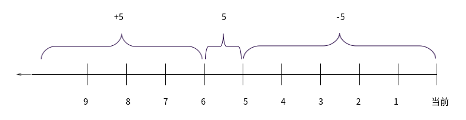

Linux 拥有强大的搜索功能，但是强大带来的缺点是相对比较复杂。但是大家不用担心，搜索命令只是选项较多，不容易记忆而已，并不难理解。 

在使用搜索命令的时候，大家还是需要注意，如果搜索的范围过大、搜索的内容过多，则会给系统造成巨大的压力，所以不要在服务器访问的高峰执行大范围的搜索命令。 

## whereis 命令

`whereis` 命令，用于搜索系统命令，也就是说，`whereis` 命令不能搜索普通文件，而只能搜索系统命令。

`whereis` 命令不仅可以搜索二进制命令，还可以找到命令的帮助文档的位置。

英文原意：locate the binary, source, and manual page files for a command

命令格式如下：

```shell
[root@localhost ~]# where [选项] 系统命令
选项：
	-b	：只查找二进制命令
	-m	：只查找帮助文档
```

常见用法：

`whereis` 命令的使用比较简单，我们来试试，例如：

```shell
[root@localhost ~]# whereis ls
ls：/bin/ls /usr/share/man/man1/ls.1.gz /usr/share/man/man1p/ls.1p.gz 
#既可以看到二进制命令的位置，也可以看到帮助文档的位置
```

但是，如果使用 `whereis` 命令查看普通文件，则无法查找到。例如：

```shell
[root@localhost ~]# touch cangls
[root@localhost ~]# whereis cangls
cangls:
#无法查找到普通文件的信息
```

如果需要查找普通文件的内容，则需要使用 `find` 命令，我们稍后会详细讲解 `find` 命令。

再看一下 `whereis` 命令的选项。如果我们只想查看二进制命令的位置，则可以使用“-b” 选项；而如果我们只想查看帮助文档的位置，则可以使用“-m”选项。

```shell
[root@localhost ~]# whereis -b ls
ls：/bin/ls
#只查看二进制命令的位置
[root@localhost ~]# whereis -m ls
ls：/usr/share/man/man1/ls.1.gz /usr/share/man/man1p/ls.1p.gz
#只查看帮助文档的位置
```

## which 命令

 `which` 命令，也是用于搜索系统命令。

和 `whereis` 命令的区别在于，`whereis` 命令可以在查找到二进制命令的同时，查找到帮助文档的位置；而 `which` 命令在查找到二进制命令的同时，如果这个命令有别名，则还可以找到别名命令。

英文原意：shows the full path of (shell) commands

命令格式如下：

```shell
[root@localhost ~]# which 系统命令
```

`which` 命令非常简单，可用选项也不多，我们直接举个例子：

```shell
[root@localhost ~]# which ls
alias ls='ls --color=auto'
/bin/ls
#which 命令可以查找到命令的别名和命令所在的位置
#alias这段就是别名，别名就是小名，也就是说，当我们输入 ls 命令时，实际上执行的是 ls --color=auto
```

## locate 命令

`locate` 命令，按照文件名搜索普通文件。

英文原意：find files by name

 `whereis` 和 `which` 都是只能搜索系统命令的命令，而 `locate` 命令才是可以按照文件名搜索普通文件的命令。 

但是 `locate` 命令的局限也很明显，它只能按照文件名来搜索文件，而不能执行更复杂的搜索，比如按照权限、大小、修改时间等搜索文件。如果要按照复杂条件执行搜索，则只能求助于功能更加强大的 `find` 命令。`locate` 命令的优点也非常明显，那就是搜索速度非常快，而且耗费系统资源非常小。这是因为 `locate` 命令不会直接搜索硬盘空间，而会先建立 `locate` 数据库，然后在数据库中按照文件名进行搜索，是快速的搜索命令。

命令格式如下：

```shell
[root@localhost ~]# locate [选项] 文件名
选项：
	-i	：忽略大小写
```

1. **基本用法**

 搜索 Linux 的安装日志。

```shell
[root@localhost ~]# locate install.log
/root/install.log
/root/install.log.syslog
#搜索文件名叫包含 install.log 的文件 
```

系统命令其实也是文件，也可以按照文件名来搜索系统命令。

```shell
[root@localhost ~]# locate mkdir
/bin/mkdir
/usr/bin/gnomevfs-mkdir 
/usr/lib/per15/auto/POSIX/mkdir.al 
...省略部分内容... 
#会搜索出所有含有 mkdir 字符串的文件名，当然也包含 mkdir 命令
```

2. **locate 命令的数据库** 

我们在使用 `locate` 命令的时候，可能会发现一个问题：如果我们新建立一个文件，那么 `locate` 命令找不到这个文件。

```shell
[root@localhost ~]# touch cangls
[root@localhost ~]# locate cangls
#新建立的文件，locate 命令找不到 
```

这是因为 `locate` 命令不会直接搜索硬盘空间，而会搜索 `locate` 数据库。这样做的好处是耗费系统资源小、搜索速度快；缺点是数据库不是实时更新的，而要等用户退出登录或重启系统时，`locate` 数据库才会更新，所以我们无法查找到新建立的文件。 既然如此，`locate` 命令的数据库在哪里呢？

```shell
[root@localhost ~]# ll /var/lib/mlocate/mlocate.db
-rw-r----- 1 root slocate 2328027 6月 14 02:08 /var/lib/mlocate/mlocate.db
#这是 locate 命令实际搜索的数据库的位置
```

这个数据库是二进制文件，不能直接使用 `Vim` 等编辑器查看，而只能使用对应的 `locate` 命令进行搜索。如果我们不想退出登录或重启系统，则也可以通过 `updatedb` 命令来手工更新这个数据。例如：

```shell
[root@localhost ~]# locate cangls
#没有更新数据库时，找不到 cangls 文件
[root@localhost ~]# updatedb
#更新数据库
[root@localhost ~]# locate cangls
/root/cangls
#新建立的文件已经可以搜索到了
```

3. **locate 配置文件**

我们再做一个实验，看看这是什么原因导致的。

```shell
[root@localhost ~]# touch /tmp/lmls
#在/tmp/目录下新建立一个文件
[root@localhost ~]# updatedb
#更新 locate 数据库
[root@localhost ~]# locate lmls
#依然查询不到 lmls 这个新建文件
```

新建立了 `/mp/lmls` 文件，而且也执行了 `updatedb` 命令，却依然无法找到这个文件，这是什么原因？这就要来看看 `locate` 的配置文件 `/etc/updatedb.conf` 了。

```shell
[root@localhost ~]# vi /etc/updatedb.conf
PRUNE_BIND_MOUNTS ="yes"
#开启搜索限制，也就是让这个配置文件生效
PRUNEFS ="9p afs anon_inodefs auto autofs bdev binfmt_misc cgroup cifs coda configts cpuset debugfs devpts ecryptfs exofs fuse fusectl gis gfs2 hugetibrs inotifyfs iso9660 jffs2 lustre mqueue nepfs nfs nfs4 nfsd pipefs proc ramfs rootta rpc_pipefs securityfs selinuxfs sfs sockfs sysfs tmpfs ubifs udf usbfs"
#在 locate 执行搜索时，禁止搜索这些文件系统类型
PRUNENAMES =".git .hg . svn"
#在 locate 执行搜索时，禁止搜索带有这些扩展名的文件
PRUNEPATHS ="/afs /media /net /sfs /tmp /udev /var/cache/ccache /var/spool/cupg /var/spool/squid /var/tmp"
#在 locate 执行搜索时，禁止搜索这些系统目录
```

在 `locate` 执行搜索时，系统认为某些文件系统、某些文件类型和某些目录是没有搜索必要的，比如光盘、网盘、临时目录等，这些内容要么不在 Linux 系统中（外来存储和网络存储），要么是系统的缓存和临时文件。刚好 `/tmp` 目录也在 `locate` 搜索的排除目录当中，所以在 `/tmp` 目录下新建的文件是无法被找到的。

## find 命令

`find` 命令，是 Linux 中强大的搜索命令。

`find` 不仅可以按照文件名搜索文件，还可以按照权限、大小、时间、inode号等来搜索文件。但是 `find` 命令是直接在硬盘中进行搜索的，如果指定的搜索范围过大，`find` 命令就会消耗较大的系统资源，导致服务器压力过大。所以，在使用 `find` 命令搜索时，不要指定过大的搜索范围。

英文原意：search for files in a directory hierarchy

命令格式如下：

```shell
[root@localhost ~]# find 搜索路径 [选项] 搜索内容
选项：
	按照文件名搜索
		-name	：按照文件名搜索
		-iname	：按照文件名搜索，不区分文件名大小写
		-inum	：按照 inode 号搜索
	按照文件大小搜索
		-size [+|-]大小	：按照指定大小搜索文件
						这里的“+”的意思是搜索比指定大小还要大的文件；
						这里的“-”的意思是搜索比指定大小还要 小的文件。
	按照修改时间搜索		
		-atime [+|-]时间	：按照文件访问时间搜索
    	-mtime [+|-]时间	：按照文件数据修改时间搜索
    	-ctime [+|-]时间	：按照文件状态修改时间搜索
    按照权限搜索
    	-perm 权限模式	：查找文件权限刚好等于“权限模式”的文件
    	-perm -权限模式	：查找文件权限全部包含“权限模式”的文件
    	-perm +权服模式	：查找文件权限包含“权限模式”的任意一个权限的文件
    按照所有者和所属组搜索	
 		-uid 用户ID		：按照用户 ID 查找所有者是指定 ID 的文件
		-gid 组ID		：按照用户组 ID 查找所属组是指定 ID 的文件
		-user 用户名		：按照用户名查找所有者是指定用户的文件
		-group 组名		：按照组名查找所属组是指定用户组的文件
		-nouser			：查找没有所有者的文件    	
    按照文件类型搜索
    	-type d	：查找目录
		-type f	：查找普通文件
		-type l	：查找软链接文件
	逻辑运算符
		-a		：and 逻辑与
    	-o		：or 逻辑或
    	-not	：not 逻辑非
    其他选项	
    	-exec
    	-ok
```

`find` 是比较特殊的命令，它有两个参数：第一个参数用来指定搜索路径；第二个参数用来指定搜索内容。而且 `find` 命令的选项比较复杂，我们分类来看。

### 按照文件名搜索

```shell
[root@localhost ~]# find 搜索路径 [选项] 搜索内容
选项：
	-name	：按照文件名搜索
	-iname	：按照文件名搜索，不区分文件名大小写
	-inum	：按照 inode 号搜索
```

这是 `find` 最常用的用法，我们来试试：

```shell
[rootelocalhost ~]# find / -name yum.conf
/etc/yum.conf
#在 /目录下查找文件名是 yum.conf 的文件
```

 但是 `find` 命令有一个小特性，就是搜索的文件名必须和你的搜索内容一致才能找到。如果只包含搜索内容，则不会找到。我们做一个实验：

```shell
[root@localhost ~]# touch yum.conf.bak
#在 /root/ 目录下建立一个文件 yum.conf.bak
[root@localhost ~]# find / -name yum.conf
/etc/yum.conf
#搜索只能找到 yum.conf 文件，而不能找到 yum.conf.bak 文件 
```

`find` 能够找到的是只有和搜索内容 yum.conf 一致的 `/etc/yum.conf` 文件，而  `/tootyum.conf.bak` 文件虽然含有搜索关键字，但是不会被找到。这种特性我们总结为：**`find` 命令是完全匹配的，必须和搜索关键字一模一样才会列出。**

 Linux 中的文件名是区分大小写的，也就是说，搜索小写文件，是找不到大写文件的。如果想要大小通吃，就要使用 -iname 来搜索文件。

```shell
[root@localhost ~]# touch CANGLS
[root@localhost ~]# touch cangls
#建立大写和小写文件
[root@localhost ~]# find . -iname cangls
./CANGLS ./cangls
#使用 -iname，大小写文件通吃
```

每个文件都有 inode 号，如果我们知道 inode 号，则也可以按照 inode 号来搜索文件。

```shell
[root@localhost ^]# ls -i install.log
262147 install.log
#如果知道文件名，则可以用"1s -i"来查找 inode 号
[root@localhost ~]# find . -inum 262147
./install.log
#如果知道 inode 号，则可以用 find 命令来查找文件名
```

 按照 inode 号搜索文件，也是区分硬链接文件的重要手段，因为硬链接文件的 inode 号是一致的。

```shell
[root@localhost ~]# ln /root/install.log /tmp/
#给 install.log 文件创建一个硬链接文件
[root@localhost ~]# ll -i /root/install.log /tmp/install.log
262147 -rw-r--r--. 2 root root 24772 1月 14 2014 /root/install.log
262147 -rw-r--r--. 2 root root 24772 1月 14 2014 /tmp/install.log
#可以看到这两个硬链接文件的 inode 号是一致的
[root@localhost ~]# find / -inum 262147
/root/install.log
/tmp/install.log 
#如果硬链接不是我们自己建立的，则可以通过 find 命令搜索 inode 号，来确定硬链接文件 
```

 ### 按照文件大小搜索

```shell
[root@localhost ~]# find 搜索路径 [选项] 搜索内容 
选项：
	-size [+|-]大小	：按照指定大小搜索文件
	
			这里的“+”的意思是搜索比指定大小还要大的文件；
			这里的“-”的意思是搜索比指定大小还要 小的文件。
```

我们来试试：

```shell
[root@localhost ~]# ll -h install.log
-rw-r--r--. 1 root root 25K 1月 14 2014 install.log
#在当前目录下有一个大小是 25KB 的文件
[root@localhost ~]# find . -size 25k
./install.log
#在当前目录下，查找大小刚好是 25KB 的文件，可以找到
[root@localhost ~]# find . -size -25k
.
./.bashrc
./.viminfo
./.tcshrc
...省略部分输出...
./install.log.syslog
./.cshrc
./cangls
#搜索小于 25KB 的文件，可以找到很多文件
[root@localhost ~]# find . -size +25k
#而当前目录下没有大于 25KB 的文件
```

其实 `find` 命令的 -size 选项是比较恶心的选项，为什么这样说？find 命令可以按照 KB 来搜索，应该也可以按照 MB 来搜索吧。

```shell
[root@localhost ~]# find . -size -25m
find：无效的 -size 类型“m”
#为什么会报错呢？其实是因为如果接照 MB 来搜索，则必须是大写的 M 
```

这就是纠结点，**千字节必须是小写的“k”，而兆字节必须是大写的“M”**。有些人会说： “你别那么执着啊，你就不能不写单位，直接按照字节搜索啊？”很傻、很天真，不写单位，你们就以为会按照字节来搜索吗？我们来试试：

```shell
[root@localhost ~]# ll anaconda-ks.cfg
-rw-------. 1 root root 1207 1月 14 2014 anaconda-ks.cfg
#anaconda-ks.cfg 文件有 1207 字节
[root@localhost ~]# find . -size 1207
#但用 find 查找 1207，是什么也找不到的 
```

也就是说，`find` 命令的默认单位不是字节。如果不写单位，那么 `find` 命令是按照 512 Byte 来进行查找的。我们看看 `find` 命令的帮助。

```shell
[root@localhost ~]# man find
...省略部分内容...
	-size n[cwbkMG]
    	File uses n units of space. The following suffixes can be used:
    	
	    'b' for 512-byte blocks (this is the default if no suffix is used)
        #这是默认单位，如果单位为 b 或不写单位，则按照 512 Byte 搜索
        'c' for bytes
        #搜索单位是 c，按照字节搜索
        ‘w’ for two-byte words
        #搜索单位是 w，按照双字节（中文）搜索
        ‘k’ for Kilobytes (units of 1024 bytes)
        #按照 KB 单位搜索，必须是小写的 k
        'M' for Megabytes (units of 1048576 bytes)
        #按照 MB 单位搜索，必须是大写的 M 
        ‘G’ for Gigabytes (units of 1073741824 bytes)
        #按照 GB 单位搜索，必须是大写的 G
        The size does not count indirect blocks, but it does count blocks in sparse files that are not actually allo‐cated.  Bear in mind that the `%k' and `%b' format specifiers of -printf  handle  sparse  files  differently. The  `b'  suffix always denotes 512-byte blocks and never 1 Kilobyte blocks, which is different to the behav‐iour of -ls.
...省略部分内容...
```

也就是说，如果想要按照字节搜索，则需要加搜索单位“c”。我们来试试：

```shell
[root@localhost ~]# find . -size 1207c
/anaconda-ks.cfg
#使用搜索单位 c，才会按照字节搜索
```

### 按照修改时间搜索

Linux 中的文件有访问时间（atime)、数据修改时间（mtime）、状态修改时间（ctime）这三个时间，我们也可以按照时间来搜索文件。

```shell
find 搜索路径 [选项] 搜索内容
选项：
	-atime [+|-]时间	：按照文件访问时间搜索
    -mtime [+|-]时间	：按照文件数据修改时间搜索
    -ctime [+|-]时间	：按照文件状态修改时间搜索 
```

这三个时间的区别我们在 `stat` 命令中已经解释过了，这里用 mtime 数据修改时间来举例， 重点说说“[+-]”时间的含义。

- -5：代表 5 天内修改的文件。 
- 5：代表前 5～6 天那一天修改的文件。
- +5：代表 6 天前修改的文件。

我们画一个时间轴，来解释一下，如图7-1 所示。

::: center



**图7-1	<u>find 命令时间轴</u>**

:::

讲到这里，“-5”代表 5 天内修改的文件，~~而“+5”总有人说代表 5 天后修改的文件~~。要是能知道 5 天后系统中能建立什么文件，早就去买彩票了，那是未卜先知啊！所以“-5”指的是 5 天内修改的文件，“5”指的是前 5～6 天那一天修改的文件，“+5”指 的是 6 天前修改的文件。我们来试试：

```shell
[root@localhost ~]# find . -mtime -5
#查找 5 天内修改的文件
```

大家可以在系统中把几个选项都试试，就可以明白各选项之间的差别了。 `find` 不仅可以按照 atime、mtime 和 ctime 来查找文件的时间，也可以按照 **amin、mmin 和 cmin** 来查找文件的时间，区别只是所有 time 选项的默认单位是天，而 min 选项的默认单位是分钟。

### 按照权限搜索 

在 `find` 中，也可以按照文件的权限来进行搜索。权限也支持 [+/-] 选项。我们先看一下命令格式：

```shell
find 搜索路径 [选项] 搜索內容
选项：
	-perm 权限模式	：查找文件权限刚好等于“权限模式”的文件
    -perm -权限模式	：查找文件权限全部包含“权限模式”的文件
    -perm +权服模式	：查找文件权限包含“权限模式”的任意一个权限的文件
```

为了便于理解，我们要举几个例子，先建立几个测试文件。

```shell
[root@localhost ~]# mkdir test
[rootelocalhost ~]# cd test/
[root@localhost test]# touch testl
[root@localhost test]# touch test2
[root@localhost test]# touch test3
[root@localhost test]# touch test4
#建立测试目录，以及测试文件
[root@localhost test]# chmod 755 test1
[root@localhost test]# chmod 444 test2
[root@localhost test]# chmod 600 test3
[root@localhost test]# chmod 200 test4
#设定实验权限。因为是实验权限，所以看起来比较别扭
[root@localhost test]# ll
总用量 0
-rwxr-xr-x 1 root root 0 6月 17 11:05 test1
-r--r--r-- 1 root root 0 6月 17 11:05 test2
-rw------- 1 root root 0 6月 17 11:05 test3
--w------- 1 root root 0 6月 17 11:05 test4
#查看权限 
```

- 例子 1：“-perm 权限模式” 

这种搜索比较简单，代表查找的权限必须和指定的权限模式一模一样，才可以找到。

```shell
[root@localhost test]# find . -perm 444
./test2
[root@localhost test]# find . -Perm 200
./test4
#按照指定权限搜索文件，文件的权限必须和搜索指定的权限一致，才能找到 
```

- 例子 2：“-perm -权限模式” 

如果使用“-权限模式”，代表的是文件的权限必须全部包含搜索命令指定的权限模式，才可以找到。 

```shell
[root@localhost test]# find . -perm -200
.
./test4			<---权限为 200，即 --w-------
./test3			<---权限为 600，即 -rw-------
./test1			<---权限为 755，即 -rwxr-xr-x
#搜索文件的权限包含 200 的文件，不会找到权限为 444 的 test2 文件
#因为权限 444（即-r--r--r--），不包含权限 200（即 --w-------）
```

- 例子 3：“-perm +权限模式”

包含任意一个指定权限，就可以找到。

```shell
[root@localhost test)# find . -perm +444
./test3			<---权限为 600，即 -rw-------
./test2 		<---权限为 444，即 -r--r--r--
./test1 		<---权限为 755，即 -rwxr-xr-x
```

这里的“+444”能找到 test1、test2 和 test3 文件，那是因为 test3 的权限是 600（-w-----），虽然所属组和其他人的权限不包含 4 权限，但是“+权限模式”只要有一个身份的权限包含任意一个指定权限，就可以找到。而 test3 的所有者权限是 6，包含 4 权限，所以依然能够找到。 而找不到 test4，是因为 test4 的权限是 200 （--w------），test4 的任意身份（所有者、所属组和其他人）都没有 4 权限，所以找不到。 再试试：

```shell
[root@localhost test]# find . -perm +777
./test4
./test3
./test2
./test1
```

如果搜索指定权限是“+777”，那么这 4 个测试文件的任意一个身份只要拥有读、写和执行任意一个权限都能找到。如果我们把 test4 的权限改为“000”，那“+777”还能找到吗？

```shell
[root@localhost test]# chmod 000 test4
[rootelocalhost test]# find . -perm +777
./test3
./test2
./test1 
```

如果 test4 的权限是“000”，则搜索“+777”就不能找到了。因为 test4 的所有身份都不拥有读、写和执行权限，而“+777”要求至少有一个身份拥有读、写和执行的任意一个权限才 能找到。

### 按照所有者和所属组搜索

```shell
[root@localhost ~]# find 搜索路径 [选项] 搜索内容
选项：
	-uid 用户ID		：按照用户 ID 查找所有者是指定 ID 的文件
    -gid 组ID		：按照用户组 ID 查找所属组是指定 ID 的文件
    -user 用户名		：按照用户名查找所有者是指定用户的文件
    -group 组名		：按照组名查找所属组是指定用户组的文件
    -nouser			：查找没有所有者的文件 
```

这组选项比较简单，就是按照文件的所有者和所属组来进行文件的查找。在 Linux 系统中，绝大多数文件都是使用 root 用户身份建立的，所以在默认情况下，绝大多数系统文件的所有者都是 root。例如：

```shell
[root@localhost ~]# find . -user root
#在当前目录中查找所有者是 root 的文件
```

 由于当前目录是 root 的家目录，所有文件的所有者都是 root 用户，所以这条搜索命令会找到当前目录下所有的文件。

按照所有者和所属组搜索时，“-nouser”选项比较常用，主要用于查找垃圾文件。在 Linux 中，所有的文件都有所有者，只有一种情况例外，那就是外来文件。比如光盘和 U盘中的文件如果是由 Windows 复制的，在 Linux 中查看就是没有所有者的文件；再比如手工源码包安装的文件，也有可能没有所有者。除这种外来文件外，如果系统中发现了没有所有者的文件，一般都是没有作用的垃圾文件（比如用户删除之后遗留的文件），这时需要用户手工处理。搜索没有所有者的文件，可以执行以下命令：

```shell
[root@localhost ~]# find . -nouser
```

### 按照文件类型搜索

```shell
[root@localhost ~]# find 搜索路径 [选项] 搜索内容
选项：
	-type d	：查找目录
	-type f	：查找普通文件
	-type l	：查找软链接文件
```

这个命令也很简单，主要按照文件类型进行搜索。在一些特殊情况下，比如需要把普通文件和目录文件区分开，使用这个选项就很方便。

```shell
[root@localhost ~]# find /etc -type d
#查找 /etc/ 目录下有哪些子目录 
```

### 逻辑运算符

```shell
[root@localhost ~]# find 搜索路径 [选项] 搜索内容
选项：
	-a		：and 逻辑与
    -o		：or 逻辑或
    -not	：not 逻辑非
```

- **-a：and 逻辑与**

`find` 命令也支持逻辑运算符选项，其中“-a”代表逻辑与运算，也就是“-a”的两个条件都成立，`find` 搜索的结果才成立。举个例子：

```shell
[root@localhost ~]# find . -size +2k -a -type f
#在当前目录下搜索大于 2KB，并且文件类型是普通文件的文件 
```

在这个例子中，文件既要大于 2KB，又必须是普通文件，`find` 命令才可以找到。再举个例子：

```shell
[root@localhost ~]# find . -mtime -3 -a -perm 644
#在当前目录下搜索 3 天以内修改过，并且权限是 644 的文件 
```

- **-o：or 逻辑或**

“-o”选项代表逻辑或运算，也就是“-o”两个条件只要其中一个成立，`find` 命令就可以找到结果。例如：

```shell
[root@localhost ~]# find . -name cangls -o -name bols
./cangls
./bols
#在当前目录下搜索文件名要么是 cangls 的文件，要么是 bols 的文件
# -o 选项的两个条件只要成立一个，find 命令就可以找到结果，所以这个命令既可以找到 cangls 文件，也可以找到 bols 文件。
```

- **-not：not 逻辑非**

“-not”是逻辑非，也就是取反的意思。举个例子：

```shell
[root@localhost ~]# find . -not -name cangls
#在当前目录下搜索文件名不是 cangls 的文件 
```

### 其他选项

这里我们主要讲解两个选项“-exec”和“-ok”，这两个选项的基本作用非常相似。

- **-exec 选项**

我们先来看看“-exec”选项的格式。

```shell
[root@localhost ~]# find 搜索路径 [选项] 搜索内容 -exec 命令2 {} \;
```

首先，请大家注意这里的“`{}`”和“`\;`”是标准格式，只要执行“-exec”选项，这两个符号必须完整输入。其次，这个选项的作用其实是把 `find` 命令的结果交给由“-exec”调用的命令2 来处理。 “`{}`”就代表 `find` 命令的查找结果。我们举个例子，刚刚在讲权限的时候，使用权限模式搜索只能看到文件名，例如：

```shell
[root@localhost test]# find . -perm 444 
./test2 
```

如果要看文件的具体权限，还要用“`ls -l`”命令查看。用“-exec”选项则可以一条命令搞定：

```shell
[root@localhost test]# find . -Perm 444 -exec ls -l {} \;
-r--r--r-- 1 root root 0 6月 17 11:05 ./test2
#使用“-exec”选项，把 find 命令的结果直接交给“1s -l”命令处理
```

 “-exec”选项的作用是把 `find` 命令的结果放入“{}”中，再由命令2 直接处理。在这个例 子中就是用“`ls -l`”命令直接处理，会使 `find` 命令更加方便。

- **-ok 选项**

“-ok”选项的格式和“-exec”选项的格式一样。

```shell
[root@localhost test]# find 搜索路径 [选项] 搜索内容 -ok 命令2 {} \; 
```

“-ok”选项和“-exec”选项的作用也基本一致，例如：

```shell
[root@localhost test]# find . -perm 444 -ok rm -rf {} \;
<rm ..../test2 >？ y 		<---需要用户输入 y，才会执行
#我们这次使用 rm 命令来删除 find 找到的结果，删除的动作最好确认一下
```

::: tip 区别

“-ok”选项和“-exec”选项的区别：

> “-exec”的命令2 会直接处理，而不询问；
>
> “-ok”的命令2 在处理前会先询问用户是否这样处理，在得到确认命令后，才会执 行。

:::

