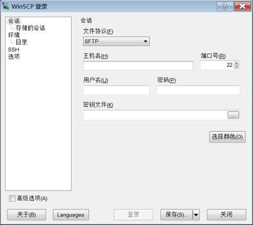
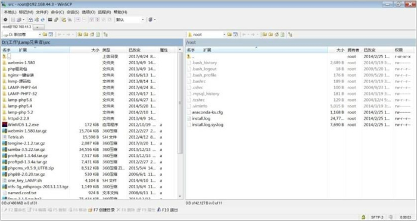
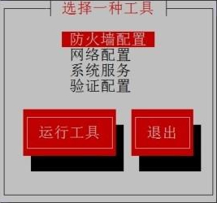
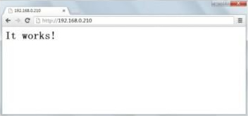
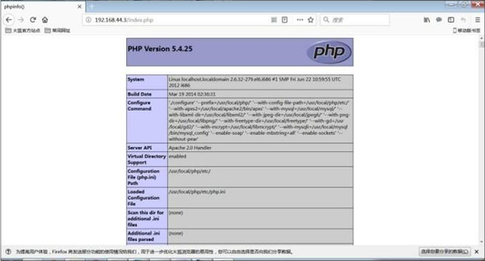
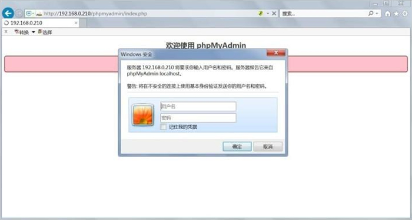

**LAMP 环境搭建**指的是在 Linux 操作系统中分别安装 Apache 网页服务器、MySQL 数据库服务器和 PHP 开发服务器，以及一些对应的扩展软件。

LAMP 环境是当前极为流行的搭建动态网站的开源软件系统，拥有良好的稳定性及兼容性。而且随着开源软件的蓬勃发展，越来越多的企业和个人选择在 LAMP 开发平台上搭建自己的网站。

**LNMP 环境搭建**指的是在 Linux 操作系统中分别安装 Nginx 网页服务器、MySQL 数据库服务器和 PHP 开发服务器，以及一些对应的扩展软件。

在 LNMP 环境中，使用 Nginx 网页服务器取代了 Apache 网页服务器。Nginx 是一款高性能的 HTTP 网页服务器和反向代理服务器，它的执行效率极高，配置相比 Apache 也较为简单，所以在短时间内被国内外很多大型公司所采用，大有取代 Apache 的势头（目前还是以 Apache 为主流的）。

::: tip 占比

[www.netcraft.com](http://www.netcraft.com) 网站的统计数据表明，采用 LAMP 环境搭建的网站数量占全球网站总数的 52.19％（2013 年 7 月数据），而其余的网站平台（如 Microsoft IIS 开发平台、Linux Nginx 开发平台、Google 开发平台等）占用了剩余的份额。

:::

## LAMP 环境搭建

我们知道，如果我们安装的是应用服务软件，这个软件是给外网用户访问和使用的，那么应该使用源码包安装，因为源码包安装的软件经过了本机编译，性能更好。所以我们的 LAMP 环境搭建，在生产服务器上一般采用源码包进行安装，而不会使用 RPM 包进行安装，接下来我们要讲的也是采用源码包方式搭建 LAMP 环境。

LAMP 环境搭建是较为复杂的 Linux 实验，在进行真正的环境安装之前，需要做一些细致的准备工作，以避免在安装过程中出现不必要的错误。我们需要进行的准备工作有以下几步。

### 安装前的准备

#### 获取源码包

我们已经知道 RPM 包是在 CentOS 的安装光盘中保存的，但是源码包需要去互联网下载。我们此次完成 LAMP 环境搭建需要 19 个软件包，这是目前较为完善和常用的 LAMP 环境搭建方式。这些软件包的下载地址如表7-1 所示。这些下载地址只是参考，如果有失效的，则请自行搜索。

**表7-1	<u>LAMP 环境搭建所需的软件包</u>**

| 软件包                                | 说 明                                             | 下载地址                                                     |
| ------------------------------------- | ------------------------------------------------- | ------------------------------------------------------------ |
| httpd-2.4.7.tar.gz                    | Apache 包                                         | http://www.apache.org/                                       |
| mysql-5.5.23.tar.gz                   | MySQL 数据库                                      | http://dev.mysql.com/downloads/                              |
| php-5.4.25.tar.gz                     | PHP 语言                                          | http://www.php.net/downloads.php                             |
| phpMyAdmin-4.1.4-all-languages.iar.gz | Web方式的 MySQL 管理工具                          | http://www.phpmyadmin.com/                                   |
| libxml2_2.9.1.tar.gz                  | 用来解析 XML文档的函数库                          | http://www.linuxfromscratch.org/blfs/view/svn/general/libxml2.html |
| libmerypt-2.5.8.tar.gz                | 加密算法扩展库                                    | http://prdownloads.sourceforge.net/mcrypt/libmcrypt-2.5.8.tar.gz?use_mirror=peterhost |
| mhash-0.9.9.9.tar.gz                  | 加密算法扩展库                                    | http://sourceforge.net/projects/mhash/files/mhash/0.9.9.9/   |
| mcrypt-2-6.8-tar.gz                   | 加密算法扩展库                                    | http://sourceforge.net/projects/mcrypt/files/MCrypt/2.6.8/   |
| zlib-1.2.3.tar.gz                     | 数据压缩函数库                                    | http://www.zlib.net/                                         |
| gd-2.0.35.tar.gz                      | PHP 处理用形的扩展库                              | https://bitbucket.org/libgd/gd-libgd/downloads               |
| freetype-2.3.5-tar-gz                 | 字体引擎库                                        | http://download.savannah.gnu.org/releases/freetype/          |
| libpng-1.2.31.tar.gz                  | 用于解码 .png 格式的图片                          | ftp://ftp.simplesystems.org/pub/libpng/png/src/              |
| jpegsrc.v6b.tar.gz                    | 用于解码.jpg和.jpeg格式的图片                     | http://www.ijg.org/files/jpegsrc.v6b.tar.gz                  |
| apr-1.4.6.tar.gz                      | Apache支持镆块                                    | http://archive.apache.org/dist/apr/                          |
| apr-util-1.4.1.tar.gz                 | Apache支持模块                                    | http://archive.apache.org/dist/apr/                          |
| pcre-8.34.tar.gz                      | Apache支持模块，使 Apache支持 pcre 正则表达式规则 | http://sourceforge.net/projects/pcre/files/pcre/8.34/pcre-8.34.tar.gz/stats/map |
| ncurses-5.9.tar.gz                    | 使应用程序直接控制终端屏幕显示的函数库            | http://ftp.gnu.org/pub/gnu/ncurses/                          |
| memcache-3.0.8.tgz                    | memcache 函数库（客户端）                         | http://pecl.php.net/package/memcache                         |
| memcached-1.4.17.tar.gz               | memcached 服务器端                                | http://memcached.org/                                        |

大家可能已经发现，我们下载的软件包不全是最新的版本，这主要是为了和 php-5.4.25.tar.gz 这个软件包进行匹配。当然，php-5.4.25.tar.gz 也已经不是最新版本的 PHP 了，不过在计算机领域永远不是最新版本的软件就是最好的，新软件虽然有了更多的功能，但是这个软件并没有经过实际工作的检验，它不一定稳定，也有可能会有 Bug；反而版本较低的、但是经过足够的实践检验的软件会更受开发者的欢迎。

Linux 就是这样的，CentOS 6.x 自 2011 年发布以来，经过多年的补充和完善，目前才逐渐得到个人使用者和企业使用者的认可。PHP 同样如此，目前 php-5.4.25.tar.gz 依然是使用最多的 PHP 版本，所以我们依然使用 php-5.4.25.tar.gz  来介绍 LAMP 环境的搭建。

#### 把软件包传送到 Linux 服务器上

我们可以直接把软件包下载到 Linux 服务器上，也可以先下载到本地 Windows 中，再上传到 Linux 服务器中。如果是先下载到本地 Windows 中，再上传到 Linux 服务器中，那么需要利用网络文件服务器来进行数据的传输。但是我们现在还没有学习 Linux 中的文件服务器（如 FTP、Samba 或 NFS），所以我们在这里介绍一款名为 WinSCP 的软件。

WinSCP 是在 Windows 中安装，使用 SFTP 协议向 Linux 服务器传递文件的工具。它的特点是使用简单、图形化操作，而且数据传递过程是加密的，较为安全，是 Windows 和 Linux 之间进行数据传递的常用软件。WinSCP 第一次启动的界面如图7-1 所示。

::: center



**图7-1	<u>WinSCP 启动界面</u>**

:::

在启动界面的“主机名”文本框中输入 Linux 服务器的 IP 地址，如 192.168.0.210，在“用户名”文本框中输入 Linux 的用户名，在“密码”文本框中输入正确的密码，单击“登录”按钮，就会见到如图7-2 所示的界面。

::: center



**图7-2	<u>WinSCP传输界面</u>**

:::


在这个工具中，左半部分是 Windows 系统中的文件，右半部分是 Linux 服务器上的文件。如果需要从 Windows 向 Linux  传递什么文件，则只需找到这个文件或目录，从左半部分拖拽到右半部分即可；反过来就是从 Linux 传递文件到 Windows 中，非常简单。

那么，我们应该把软件放置在 Linux 服务器的什么位置呢？Linux 中的 `/usr/local/src/` 目录是系统默认的放置下载软件源代码的位置，所以我们就把搭建  LAMP 环境所需的所有软件包都传递到这个位置，传递完成后查看一下，如下：

```shell
[root@localhost ~]# ls /usr/local/src/
apr-1.4.6.tar.gz jpegsrc.v6b.tar.gz memcache-3.0.8.tgz
pcre-8.34.tar.gz apr-util-1.4.1.tar.gz libmcrypt-2.5.8.tar.gz
memcached-1.4.17.tar.gz php-5.4.25.tar.gz freetype-2.3.5.tar.gz
libpng-1.2.31.tar.gz mhash-0.9.9.9.tar.gz phpMyAdmin-4.1.4-all-languages.tar.gz
gd-2.0.35.tar.gz libxml2-2.9.1.tar.gz mysql-5.5.23.tar.gz
zlib-1.2.3.tar.gz httpd-2.4.7.tar.gz mcrypt-2.6.8.tar.gz ncurses-5.9.tar.gz
[root@localhost ~]# ls /usr/local/src/ | wc -l
19
```

我们发现，19 个软件包全部传递到 Linux 服务器中。

#### 安装编译工具

源码包都是用 C 或 C++ 语言编写的，而且需要在本机编译之后才能正确安装。在 Linux 中，C 语言的编译器是 gcc，C++ 语言的编译器是 gcc-c++。

在安装源码包之前，需要确认这两个编译器是否存在。命令如下：

```shell
[root@localhost ~]# rpm -qa | grep gcc
libgcc-4.4.6-4.el6.i686
gcc-4.4.6-4.el6.i686
```

可以看到，我们已经安装了 gcc 编译器，但是还没有安装 gcc-c++ 编译器。使用 yum 安装 gcc-c++ 编译器，命令如下：

```shell
[root@localhost ~]# yum -y install gcc-c++
```

如果 Linux 服务器可以正常连接互联网，那么这条 yum 命令是可以直接使用的，不用进行任何配置与修改。只是 yum 会去连接 CentOS 的官方服务器，这台服务器在国外，速度可能较慢。如果 Linux 服务器不能正常连接互联网，则也可以使用本地光盘作为 yum 源。

安装完成后再查询一下，如下：

```shell
[root@localhost ~]# rpm -qa | grep gcc
gcc-4.4.7-3.el6.i686
libgcc-4.4.7-3.el6.i686
gcc-c++-4.4.7-3.el6.i686
```

gcc 和 gcc-c++ 编译器都已经安装了。大家可能发现这次查询的 gcc 是 4.4.7 版本，而上次查询的 gcc 是 4.4.6 版本，那是因为我们使用网络 yum 源去 CentOS 的官方服务器上安装 gcc-c++，但是在安装 gcc-c++ 的时候，是需要 gcc 已经安装完成的。在 CentOS 的官方服务器上，gcc 和 gcc-c++ 的版本更高，所以在安装 gcc-c++ 的时候，自动更新了 gcc 的版本。不管怎么说，编译工具已经安装完成，我们可以进行下一步的准备工作了。

#### 关闭 RPM 包安装的 apache 和 mysql

我们在生产服务器上是不会既安装 RPM 包的 apache，又安装源码包的 apache 的。但是为了教学需要，有时需要安装这两种包的 apache。我们现在需要停用 RPM包安装的 apache 和 mysql，命令如下：

```shell
[root@localhost ~]# service httpd stop
[root@localhost ~]# service mysqld stop
#停止apache和mysql服务
[root@localhost ~]# chkconfig httpd off
[root@localhost ~]# chkconfig mysqld off
#关闭apache和mysql的自启动
```

#### 关闭防火墙和 SELinux

在生产服务器上，防火墙是不能直接关闭的，而是需要设置防火墙允许 80 端口（apache）、3306 端口（mysql）和 11211（memcache）端口访问的。但是目前我们还没有学习防火墙，所以只能暂时关闭它了。关闭命令如下：

```shell
[root@localhost ~]# setup
```

在图7-3 所示的界面中选择“防火墙配置”，进入防火墙配置界面。

::: center



**图7-3	<u>setup界面</u>**

:::

 在图7-4 所示的界面中，把“启用”前面的“*”去掉，选择“确定”保存，默认防火墙规则就会被关闭。

::: center


**图7-4	<u>关闭防火墙</u>**

:::


再查询一下防火墙规则：

```shell
[root@localhost ~]# iptables -L
Chain INPUT (policy ACCEPT)
target prot opt source destination
Chain FORWARD (policy ACCEPT)
target prot opt source destination
Chain OUTPUT (policy ACCEPT)
target prot opt source destination
#默认filter表中的三条链中的规则都是空。防火墙已经被关闭了
```

除关闭防火墙之外，我们还需要关闭 SELinux 安全子系统。因为这个子系统会对我们的安装过程产生影响，所以先关闭它。关闭命令如下：

```shell
[root@localhost ~]# vi /etc/selinux/config
#把 SELINUX=enforcing改为 SELINUX=disabled
[root@localhost ~]# shutdown -r now
#重启Linux系统
```

关闭 SELinux 之后，必须重启 Linux 系统，修改才会生效。

#### 关闭不必要的服务

接下来需要关闭我们不需要的服务，这既是服务器的必须优化步骤，也会使我们在 LAMP 环境搭建过程中的报错可能性大大降低，所以建议大家进行这一步服务优化。具体方法就是使用 `ntsysv` 命令把不需要的服务前面的“*”去掉，然后重启 Linux 服务器。具体哪些服务是必须启动的，哪些服务是不必要的，大家可以参考[《Linux常见服务类别及功能》](http://localhost:8080/blog/project/Linux%E7%B3%BB%E7%BB%9F%E7%AE%A1%E7%90%86/02.linux%E6%9C%8D%E5%8A%A1%E7%AE%A1%E7%90%86/#%E5%B8%B8%E8%A7%81%E6%9C%8D%E5%8A%A1%E7%B1%BB%E5%88%AB%E5%8F%8A%E5%8A%9F%E8%83%BD)。

#### 批量解压源码包

我们需要安装 17 个源码包，如果一个一个地解压缩实在太麻烦了，那么我们写一个小的 Shell 脚本，批量进行解压缩。命令如下：

```shell
[root@localhost ~]# vi tar.sh
#建立解压缩脚本
#! /bin/bash
#标称是 Shell脚本
cd /usr/local/src/
#进入保存源妈包的目录
ls *.tar.gz > /usr/local/src/ls.log
#把所有以.tar.gz结尾的文件名覆盖写入ls.log文件
ls *.tgz >> /usr/local/src/ls.log
#把所有以.tgz结尾的文件名追加写入ls.log文件
file=$(cat /usr/local/src/ls.log)
#读取 ls.log 文件中的内容,赋子变量file
for i in $file
#for循环,每次德环把变量file中的一个文件名
	do
	tar -zxf $i
	#解压缩毎个压缩文件
	done
rm -rf /usr/local/src/ls.log
#删除临时文件ls.log
#以上是脚本的内容
[rootBlocalhost ~]# chmod 755 tar.sh
#赋予tar.sh文件执行权限
[root@localhost ~]# ./tar.sh
#执行这个脚本
```

这样，所有的压缩包就已经完成了解压缩过程。

#### 检查硬盘的剩余空间

LAMP 环境搭建大概需要 3GB 的空闲空间，所以确认一下硬盘的剩余空间，命令如下：

```shell
[root@localhost src]# df -h
文件系统	容量	已用	可用	已用%%	挂载点
/dev/sda3	20G		2.5G	16G		14%		/
tmpfs		306M	0		306M	0%		/dev/shm
/dev/sda1	194M	26M		158M	15%		/boot
```

 `/`分区还有 16GB 的可用空间，足够使用了。

### 安装过程

#### 1.安装 libxml2 源码包

**libxml2 是一个用来解析 XML 文档的函数库**。它用 C 语言写成，并且能被多种语言所调用，如 C、C++、XSH、C#、Python、Kylix、Delphi、Ruby、PHP 等。它最初是为 GNOME 开发的项目，但是现在可以用在各种各样的项目中。

libxml2 的代码可移植性非常好，因为它基于标准的 ANSI C 库，并采用了 MIT 许可证。安装步骤如下。

1. 安装python-devel

这个软件包是 libxml2 的依赖包，如果不安装，libxml2 安装就会报错。这个软件包只是一个底层依赖包，所以安装 RPM 包即可。命令如下：

```shell
[root@localhost ~]# yum -y install python-devel 
```

2. 进入解压缩之后的源码目录

这一步不能省略，因为 `./configure`、`make` 和 `make install` 操作的都是当前所在目录，所以一定要进入解压缩之后的源码目录。命令如下：

```shell
[root@localhost ~]# cd /usr/local/src/libxml2-2.9.1
```

3. 编译前的准备和配置

这一步主要检查安装需要的系统环境、配置软件需要的功能选项，并生成配置安装文件 `Makefile`，以后的编译与编译安装过程需要依赖 `Makefile` 文件。命令如下：

```shell
[root@localhost libxml2-2.9.1]# ./configure --prefix=/usr/local/libxml2/
# “--prefix=/usr/local/libxml2/”用于指定安装位置
```

有些人可能会有疑问：这个软件的安装位置和安装目录名称是可以随意指定的吗？我们一般会将源码包安装到 `/usr/local/` 目录中，这个目录是 Linux 的默认源码包安装目录，并不推荐大家随意更改。至于安装目录名称，如果只是单独安装这个软件，则目录名称可以随意指定，不一定非要叫“libxml2”。但是我们在搭建 LAMP 环境时，这个软件会被后面的软件所调用，如果修改了安装目录名称，那么后面一系列的安装命令都要进行修改，非常容易报错，所以不建议大家随意修改。

4. 编译

也就是依靠 gcc 把源码包翻译为二进制的机器语言包。命令如下：

```shell
[root@localhost libxml2-2.9.1]# make
```

以上的编译前配置和编译都不会在 `/usr/local/` 目录中写入任何数据，只会在源码目录中生成 `Makefile` 等临时文件。所以，如果报错了，则只需执行 `make clean` 命令清除缓存和临时文件，再进行安装即可。

5. 编译安装

这一步才会真正向 `/usr/local/` 目录中写入数据。命令如下：

```shell
[root@localhost libxml2-2.9.1]# make install
```

这条命令执行之后，就会建立 `/usr/local/libxml2/` 目录，并在目录下生成相应的文件。

#### 2.安装 libmcrypt 源码包

**libmcrypt 是加密算法扩展库**。支持 DES、3DES、RIJNDAEL、Twofish、IDEA、GOST、CAST-256、ARCFOUR、SERPENT、SAFER+ 等算法。安装步骤如下。

1. 进入解压缩目录

```shell
[root@localhost libxml2-2.9.1]# cd /usr/local/src/libmcrypt-2.5.8
```

2. 编译前配置，并指定安装位置

```shell
[root@localhost libmcrypt-2.5.8]# ./configure --prefix=/usr/local/libmcrypt
```

3. 编译

```shell
[root@localhost libmcrypt-2.5.8]# make
```

4. 编译安装

```shell
[root@localhost libmcrypt-2.5.8]# make install
```

5. 安装 libltdl 库

在安装完 libmcrypt 之后，有些 Linux 还需要安装 libltdl 库，这个库是 libmcrypt 的子软件，就在 libmcrypt 的源码包之中，所以要进入 `/usr/local/libmcrypt` 目录才能看到。命令如下：

```shell
[root@localhost root]# cd /usr/local/src/libmcrypt-2.5.8/libltdl
#进入软件源码目录
[root@localhost libltdl]# ./configure --enable-ltdl-install
#配置libltdl库的安装
[root@localhost libltdl]# make
#编译
[root@localhost libltdl]# make install
#编译安装
```

安装完成之后，记得确认安装目录是否生成。

#### 3.安装 mhash 源码包

**mhash 是基于离散数学原理的不可逆向的 PHP 加密方式扩展库**。mhash 可以用于创建校验数值，消息摘要，消息认证码，以及无须原文的关键信息保存（如密码）等。

安装步骤如下：

```shell
[root@localhost ~]# cd /usr/local/src/mhash-0.9.9.9
#进入解压缩目录
[root@localhost mhash-0.9.9.9]# ./configure
#没有指定安装位置。因为在mcrypt包安装时，会在默认位置查找mhash包，如果指定了安装位置，那么mcrypt包在安装时会报错
[root@localhost mhash-0.9.9.9]# make
#编译
[root@localhost mhash-0.9.9.9]# make install >> /root/mhash_install.log
#编译安装。把安装过程保存在mhash_install.log文件中，便于删除
```

#### 4.安装 mcrypt 源码包

**mcrypt 是 PHP  里面重要的加密支持扩展库**。mcrypt 库支持 20 多种加密算法和 8 种加密模式。mcrypt 要比 libmcrypt  更加先进，在很多项目中必须使用 mcrypt 加密方式。<u>请大家注意，在安装 mcrypt 之前，必须先正确安装 libmcrypt 和 mhash。</u>

安装步骤如下：

```shell
[root@localhost mhash-0.9.9.9]# cd /usr/local/src/mcrypt-2.6.8
#进入源码目录
[root@localhost mcrypt-2.6.8]# LD_LIBRARY_PATH=/usr/local/libmcrypt/lib:/usr/local/lib ./configure --with-libmcrypt-prefix=/usr/local/libmcrypt
#LD_LIBRARY_PATH用于指定libmcrypt和mhash库的位置
#./configure为编译前准备命令，--with-libmcrypt-prefix用于指定libmcrypt软件位置
[root@localhost mcrypt-2.6.8]# make
#编译
[root@localhost mcrypt-2.6.8]# make install
#编译安装
```

请大家注意，在这里 mcrypt 并没有安装完成。因为 mcrypt 是 PHP 的模块，所以需要等到 PHP 安装完成之后，再继续安装。

PHP 模块安装成功后，才能按照以下步骤继续安装 mcrypt。

:::tip

这里要先暂停一下，等 <u>**14.安装 PHP 源码包**</u> 安装完成后再继续安装。

:::

```shell
# 1)编译安装

[root@localhost memcache-3.0.8]# cd /lamp/php-5.4.25/ext/mcrypt/
#进入PDO模块的解压缩目录
[root@localhost mcrypt]# /usr/local/php/bin/phpize
#使用phpize加载PDO模块
[root@localhost mcrypt]# ./configure \ #编译前配置
--with-php-config=/usr/local/php/bin/php-config \#指定php-config文件的位置
--with-mcrypt=/usr/local/libmcrypt/ #调用libmcrypt
[root@localhost mcrypt]# make
#编译
[root@localhost mcrypt]# make install
#编译安装

# 2) 修改PHP配置文件

要让 PHP 可以识别和使用 memcache 和 mcrypt 模块，还需要修改一下 PHP 的配置文件，命令如下：

[root@localhost mcrypt]# vi /usr/local/php/etc/php.ini
#修改PHP配置文件
extension_dir = "./"
#在这个文件中找到这句话，把它改为以下这句话
extension_dir="/usr/local/php//lib/php/extensions/no-debug-non-zts-20060613/"
#新加入以下两句话
extension="memcache.so";
extension="mcrypt.so";

安装完成之后，重启 apache，就可以在 phpinfo 页面中看到这两个模块了。
```

#### 5.安装 zlib 源码包

**zlib 是提供数据压缩用的函数库**。使用 DEFLATE 算法，最初是为 libpng 函数库所写的，后来普遍被许多软件所使用。此函数库为自由软件，使用 zlib 授权。

安装步骤如下：

```shell
[root@localhost ~]# cd /usr/local/src/zlib-1.2.3
#进入zlib解压缩目录
[root@localhost zlib-1.2.3]# ./configure
#编译前配置，没有指定安装位置，zlib会安装到系统的默认位置。
#这是为了让libpng可以在默认位置中找到zlib。如果指定了zlib的安装位置，那么libpng在安装时可能会报错
[root@localhost zlib-1.2.3]# make
#编译
[root@localhost zlib-1.2.3]# make install >> /root/zlib_install.log
#编译安装。把编译安装过程保存到zlib_install.log文件中，以方便删除
```

#### 6.安装 libpng 源码包

**libpng 软件中包含 libpng 函数库**。这些库是用来解码 .png 格式的图片的。安装步骤如下：

```shell
[root@localhost zlib-1.2.3]# cd /usr/local/src/libpng-1.2.31
#进入libpng解压缩目录
[root@localhost libpng-1.2.31]# ./configure --prefix=/usr/local/libpng
#编译前配置，指定安装位置
[root@localhost libpng-1.2.31]# make
#编译
[root@localhost libpng-1.2.31]# makeinstall
#编译安装
```

#### 7.安装 jpeg6 源码包

**jpeg6 软件是用来解码 .jpg 和 .jpeg 格式的图片的**。安装步骤如下。

1. 手工建立必需的目录

```shell
[root@localhost root]# mkdir /usr/local/jpeg6
#建立jpeg6软件安装目录
[root@localhost root]# mkdir /usr/local/jpeg6/bin
#建立存放命令的目录
[root@localhost root]# mkdir /usr/local/jpeg6/lib
#创建jpeg6函数库文件所在目录
[root@localhost root]# mkdir /usr/local/jpeg6/include
#建立存放头文件的目录
[root@localhost root]# mkdir -p /usr/local/jpeg6/man/man1
#建立存放帮助手册的目录
```

请大家注意，这些目录必须手工建立，否则安装过程会报错

2. 编译与安装

```shell
[root@localhost libpng-1.2.31]# cd /usr/local/src/jpeg-6b/
#进入jpeg6解压缩目录
[root@localhost jpeg-6b]# ./configure \
--prefix=/usr/local/jpeg6/ \		#指定安装位置
--enable-shared \					#建立共享库使用的GNU的libtool
enable---static						#建立静态库使用的GNU的libtool
#编译前配置。
#“\”代表一条命令没有写完，换行继续输入
[root@localhost jpeg-6b]# make
#编译
[root@localhost jpeg-6b]# make install
#编译安装
```

#### 8.安装 FreeType 源码包

**FreeType 库是一个完全免费（开源）的、高质量的、可移植的字体引擎**。它提供统一的接口来访问多种字体格式文件，包括 TrueType、OpenType、Type1、CID、CFF、Windows FON/FNT、X11 PCF 等，支持单色位图、反走样位图的渲染。

FreeType 库是高度模块化的程序库，虽然它是使用 ANSI C 开发的，但是采用面向对象的思想，因此，FreeType 的用户可以灵活地对它进行裁剪。

FreeType 安装步骤如下：

```shell
[root@localhost jpeg-6b]# cd /usr/local/src/freetype-2.3.5
#进入freetype解压缩目录
[root@localhost freetype-2.3.5]# ./configure --prefix=/usr/local/freetype
#编译前配置，指定安装位置
[root@localhost freetype-2.3.5]# make
#编译
[root@localhost freetype-2.3.5]# make install
#编译安装
```

#### 9.安装 gd 库源码包

**gd 库是 PHP 处理图形的扩展库**。它提供了一系列用来处理图片的 API（应用程序编程接口），使用 gd 库可以处理图片或者生成图片。在网站上，gd 库通常用来生成缩略图，或者对图片加水印，或者生成汉字验证码，或者对网站数据生成报表等。

gd 库安装步骤如下。

1. 建立 gd 库安装目录，进入 gd 库解压缩目录

```shell
[root@localhost autoconf-2.61]# cd /usr/local/src/gd-2.0.35
```

2. 修改 gd_png.c 文件

```shell
[root@localhost gd-2.0.35]# vi gd_png.c
#把文件中 include "png.h" 改为 include "/usr/local/libpng/include/png.h"
```

如果不修改 gd_png.c 文件，则默认会在当前目录下搜索 png.h 文件。我们已知 libpng 安装在 `/usr/local/libpng/` 目录中，所以当然不能找到，就会报错。把 png.h 的正确路径 `/usr/local/libpng/include/png.h` 写入，报错就能解决。

3. 编译安装

```shell
[root@localhost gd-2.0.35]# ./configure \
--prefix=/usr/local/gd2/ \ 				#指定安装位置
--with-jpeg=/usr/local/jpeg6/ \ 		#指定jpeg6的位置
--with-freetype=/usr/local/freetype/ \	#指定freetype的位置
--with-png=/usr/local/libpng/			#指定libpng的位置
#编译前配置
#因为gd库需要调用前面安装的zlib、jpeg、freetype和libpng，所以需要指定它们的安装位置，才能正确调用这些软件。
#不过因为前面安装zlib时没有指定安装位置，所以不用指定--with-zlib=/usr/local/zlib/选项，gd会自动到默认安装位置中寻找zlib
#“\”代表一条命令没有写完，换行继续输入
[root@localhost gd-2.0.35]# make
#编译
[root@localhost gd-2.0.35]# make install
#编译安装
```

#### 10.安装 apache 源码包

Apache 其实是一个软件基金会组织的名字，早期他们开发的 Web Server 软件非常流行，当时的名称就叫做 Apache，不过后来改名字叫做 httpd 了，所以，现在大家常说的 Apache ，通常指的就是 httpd。

另外，Apache 就是 LAMP 环境中的“A”。前面做了这么多准备工作，就是为了正确安装 Apache+MySQL+PHP，现在可以安装 Apache 了。安装步骤如下。

1. 复制 apr 和 apr-util 库

这里是 Apache 2.4 自己的 Bug，我们必须手工复制 apr、apr-util 和 pcre 这三个库，才可以正确安装 Apache 2.4。

```shell
cp -r /usr/local/src/apr-1.4.6 /usr/local/src/httpd-2.4.7/srclib/apr
cp -r /usr/local/src/apr-util-1.4.1 /usr/local/src/httpd-2.4.7/srclib/apr-util
#这两个包先要解压缩，然后改名复制到指定位置
```

2. 安装 pcre 源码包

pcre 是一个用 C 语言编写的正则表达式函数库，Apache 和 PHP 默认使用的就是 pcre 正则表达式规则。

```shell
[root@localhost gd-2.0.35]# cd /usr/local/src/pcre-8.34
#进入解压缩目录
[root@localhost pcre-8.34]# ./configure
#编译前配置
[root@localhost pcre-8.34]# make
#编译
[root@localhost pcre-8.34]# make install
#编译安装
```

3. 进入 Apache 解压缩目录

```shell
[root@localhost pcre-8.34]# cd /usr/local/src/httpd-2.4.7
```

4. 编译前配置

```shell
[root@localhost httpd-2.4.7]# ./configure \	#编译前配置
--prefix=/usr/local/apache2/ \				#指定Apache安装目录
--sysconfdir=/usr/local/apache2/etc/ \		#指定Apache配置文件保存目录
--with-included-apr \						#使用捆绑APR/APR-Util 的副本
--enable-so \								#以动态共享对象(DSO)方式编译
--enable-deflate=shared \					#启用编小传输编玛支持的模块
--enable-expires=shared \					#根据用户的特别设定来生成失效和隐藏控制的HTTP头信息
--enable-rewrite-shared						#启动重写功能的模块
```

这里的 Apache 是使用动态方式编译的，那么是否有静态方式编译呢？当然有，静态方式编译就是直接将 Apache 的模块放入 Apache 中，如果 Apache 需要调用这个模块，则直接调用即可。这种方法安装的 Apache 性能更好、速度更快，但是如果需要加载新的模块，则是需要重新编译和安装 Apache 的。

如果采用动态的方式编译，则并没有直接把模块放入 Apache，而是把模块的所在位置放入了 Apache。如果 Apache 需要调用模块，则需要到指定位置自己查找，性能比静态方式稍差。但是如果需要加载新的模块，则不用重新安装 Apache，可以动态地加载新模块。更常用的编译方式是动态方式编译，所以在安装过程中我们采用动态方式编译。

5. 编译和编译安装

```shell
[root@localhost httpd-2.4.7]# make
[root@localhost httpd-2.4.7]# make install
```

6. 启动 Apache，并进行测试

```shell
[root@localhost httpd-2.4.7]# /usr/local/apache2/bin/apachectl start
#启动Apache
[root@localhost httpd-2.4.7]# netstat -tlun | grep 80
tcp 0 0::80 ::* LISTEN
#80端口已经启动，说明Apache已经启动了
```

接下来我们需要使用浏览器测试一下 Apache 服务器是否可以访问，只需在 URL（统一资源定位，就是地址栏）中输入“http://IP”即可，如图7-5 所示。

::: center



**图7-5	<u>Apache测试页</u>**

:::


如果看到了“It works！”，则说明 Apache 服务器正常工作了。

7. 设置 Apache 开机自启动

我们需要保证 Apache 每次开机都能正常启动，所以还要设置自启动，命令如下：

```shell
[root@localhost httpd-2.4.7]# vi /etc/rc.local
/usr/local/apache2/bin/apachectl start
#在rc.local文件中加入Apache启动命令
```

#### 11.安装 ncurses 源码包

**ncurses 提供字符终端处理库**，包括面板和菜单。它提供了一套控制光标、建立窗口、改变前景/背景颜色及处理鼠标操作的函数，使用户在字符终端编写应用程序时绕过了那些恼人的底层机制。简而言之，它是一个可以使应用程序直接控制终端屏幕显示的函数库。

这个软件既可以采用 RPM 包方式安装，也可以采用源码包方式安装。但是不用两种包都安装，只要安装一种即可。

1. 方法一：安装 RPM 的 ncurses 包

这里既可以使用手工 RPM 包命令安装，也可以使用 yum 命令安装，我们使用 RPM 包命令安装。安装命令如下：

```shell
[root@localhost ~]# rpm -ivh /mnt/cdrom/Packages/ncurses-5.7-3.20090208.el6.i686.rpm
[root@localhost ~]# rpm -ivh /mnt/cdrom/Packages/ncurses-devel-5.7-3.20090208.el6.i686.rpm
[root@localhost ~]# rpm -ivh /mnt/cdrom/Packages/ncurses-libs-5.7-3.20090208.el6.i686.rpm
[root@localhost ~]# rpm -ivh /mnt/cdrom/Packages/ncurses-base-5.7-3.20090208.el6.i686.rpm
[root@localhost ~]# rpm -ivh /mnt/cdrom/Packages/ncurses-term-5.7-3.20090208.el6.i686.rpm
[root@localhost ~]# rpm-ivh/mnt/cdrom/Packages/ncurses-static-5.7-3.20090208.el6.i686.rpm
```

2. 方法二：安装 ncurses 的源码包

安装步骤如下：

```shell
[root@localhost ~]# cd /usr/locai/src/ncurses-5.9
#进入ncurses解压缩目录
[root@localhost ncurses-5.9] # ./configure \	#编译前配置
--with-shared \									#生成共享库
--without-debug \								#不生成 debug 库
--without-ada \									#不编译为ada绑定，因为进入chroot环境不能便用ada
--enable-overwrite								#参数为定义把头文件安装到/tools/include目录下，而不是/tools/include/ncurses 目录下
[root@localhost ncurses-5.9]# make
#编译
[root@localhost ncurses-5.9)# make install
#编译安装
```

#### 12.安装 cmake 和 bison 源码包

MySQL 在 5.5 版本以后，不再使用 `./configure` 工具进行编译安装，而使用 cmake 工具替代了 `./configure` 工具。

bison 是一个自由软件，用于自动生成语法分析器程序，可用于所有常见的操作系统。

```shell
[root@localhost ~]# yum -y install cmake
[root@localhost ~]# yum -y install bison
```

#### 13.安装 MySQL 源码包

接下来，我们学习安装 MySQL 数据库，其安装步骤稍微复杂，我们逐步来进行解析。

1. 添加 mysql 用户和 mysql 用户组

命令如下：

```shell
[root@localhost ~]# groupadd mysql
#添加mysql用户组
[root@localhost ～]# useradd -g mysql mysql
#添加mysql用户，同时指定mysql用户的初始组是mysql组
```

这里添加的 mysql 用户和用户组是稍后用来给 MySQL 安装目录分配权限用的，所以并不需要设定密码，因为这个用户是不能直接登录 Linux 系统的。

2. 进入 MySQL 解压缩目录

```shell
[root@localhost ~]# cd /usr/local/src/mysql-5.5.23
```

3. 编译前配置

```shell
[root@localhost mysql-5.5.23]# cmake \		#命令
-DCMAKE_INSTALL_PREFIX=/usr/local/mysql \	#指定安装位置
-DMYSQL_UNIX_ADDR=/tmp/mysql.sock \			#指定[socket](http://c.biancheng.net/socket/)（套接字）文件位置
-DEXTRA_CHARSETS=all \						#支持所有的扩展字符集
-DDEFAULT_CHARSET=utf8 \					#指定默认字符集
-DDEFAULT_COLLATION=utf8_general_ci \		#指定默认字符校对
-DWITH_MYISAM_STORAGE_ENGINE=1 \			#安装myisam存储引擎
-DWITH_INNOBASE_STORAGE_ENGINE=1 \			#安装innodb存储引擎
-DWITH_MEMORY_STORAGE_ENGINE=1 \			#安装memory存储引擎
-DWITH_READLINE=1 \							#支持readline库
-DENABLED_LOCAL_INFILE=1 \					#启用加载本地数据
-DMYSQL_USER=mysql \						#指定MySQL运行用户
-DMYSQL_TCP_PORT=3306						#指定MySQL端口
```

4. 编译

```shell
[root@localhost mysql-5.5.23]# make
```

使用 cmake 进行编译。如果编译过程中出现了报错，则不再使用 `make clean` 命令清除缓存及临时文件，而是直接删除 `rm-rf CMakeCache.txt` 文件。

5. 编译安装

```shell
[root@localhost mysql-5.5.23]# make install
```

6. 生成 MySQL 的配置文件，并修改配置文件

这个配置文件不用手工建立，在 MySQL 安装目录中给我们准备了模板文件，只需把模板文件复制到指定位置并改名即可。命令如下：

```shell
[root@localhost mysql-5.5.23]# cp/usr/local/mysql/share/mysql/my-medium.cnf /etc/my.cnf
```

7. 修改 MySQL 安装目录的权限

```shell
[root@localhost mysql-5.5.23]# cd /usr/local/mysql/
#进入MySQL安装目录
[root@localhost mysql]# chown -R mysql .
#把当前目录下所有文件的所有者改为root用户
[root@localhost mysql]# chgrp -R mysql .
#把当前目录下所有文件的所属组改为mysql组
```

8. 初始化数据库

源码包安装的 MySQL 中所有的数据库默认都保存在 `/usr/local/mysql/data/` 目录中，MySQL 的初始数据库 mysql 库和 test 库也会保存在这个目录中。

但是，如果我们仔细查看 `/usr/local/mysql/data/` 目录，就会发现这个目录中只有两个空目录，并没有任何数据。也就是说，MySQL 中的所有数据库是不存在的，那么这个 MySQL 是不能使用的，因为 MySQL 的所有用户是要保存在 user 表中的，而 user 表保存在 mysql 库中，而 mysql 库是保存在  `/usr/local/mysql/data/` 目录中的。

那么，我们现在需要在 data 目录中建立 MySQL 的初始数据库。命令如下：

```shell
[root@localhost mysql]# /usr/local/mysql/bin/mysql_install_db --user=mysql
#初始化数据库
```

这条命令的 --user 选项表示使用 mysql 用户来初始化数据库，这个用户要和我们在步骤一中建立的用户一致。命令执行完成之后，`/usr/local/mysal/data/` 目录中应该会出现很多相应的数据，证明数据库初始化成功。

9. 继续修改 MySQL 安装目录的权限

```shell
[root@localhost mysql]# chown -R root .
#把当前目录下所有文件的所有者改为root用户
#注意：修改的目录依然是/usr/local/mysql/目录下的文件
[root@localhost mysql]# chown -R mysql data
#把data目录的所有者改为mysql用户
```

10. 启动 MySQL 服务器，并保证 mysql 服务开机自启动

MySQL 服务器的安装已经完成，我们可以尝试启动 MySQL 服务器，命令如下：

```shell
[root@localhost mysql]# /usr/local/mysql/bin/mysqld_safe --user=mysql &
#使用mysql用户启动MySQL服务器，并在后台持续运行
[root@localhost mysql]# netstat -tlun | grep 3306
tcp 0 0 0.0.0.0：3306 0.0.0.0：* LISTEN
#3306端口已经开启了
```

当然，我们还要保证 mysql 服务开机自启动，命令如下：

```shell
[root@localhost mysql]# vi /etc/rc.local
#修改自启动配置文件，加入如下的mysql服务标准启动命令
/usr/local/mysql/bin/mysqld_safe --user=mysql &
```

11. 设定 MySQL 中 root 用户的密码，并登录

MySQL 的管理员也是 root，不过这只是数据库的管理员，不要和 Linux 的 root 用户混淆了。我们需要给 MySQL 的本地用户设定一个密码。设定密码的方式有很多种，我们使用 Linux 的命令 `mysqladmin` 设定 MySQL 的 root 用户的密码。命令如下：

```shell
[root@localhost mysql]# /usr/local/mysql/bin/mysqladmin -u root password 123
#给MySQL的root用户设定密码为123
[root@localhost mysql]# /usr/local/mysql/bin/mysql -u root -p
#使用root用户登录mysql
Enter password：				#输入正确的密码
Welcome to the MySQL monitor． Commands end with ; or \g.
Your MySQL connection id is 2
Server version：5.1.59-community-log Source distribution
Copyright (c) 2000， 2011， Oracle and/or its affiliates．All rights reserved.
Oracle is a registered trademark of Oracle Corporation and/or its
affiliates．Other names may be trademarks of their respective owners.
Type 'help;' or '\h' for help．Type '\c' to clear the current input statement.

mysql>
#看到了MySQL的交互界面
mysql> \s					#查询服务器状态信息
...省略部分输出...
Server	characterset： utf8
Db		characterset： utf8
Client	characterset： utf8
Conn．	characterset： utf8
#编码格式已经修改为UTF-8
...省略部分输出...
mysql> exit
#退出MySQL
```

#### 14.安装 PHP 源码包

关于 PHP 的版本，目前大多数企业都会使用 5.4 及更高版本，甚至越来越多的企业使用 PHP 7 版本，要知道，这两个版本还是有很大差异的，PHP 7 有很大的性能提升。

虽然“新事物取代旧事物”是必然趋势，但就目前来说，PHP 7 版本还是太新了，很多企业的网站不一定兼容。因此，这里安装的 PHP 版本为 5.4。接下来，就一起来学习如何在 Linux 系统中安装 PHP 源码包，具体步骤如下。

1. 安装 libtool 和 libtool-ltdl

```shell
[root@localhost mysql]# yum -y install "libtool*"
[root@localhost mysql]# yum -y install "libtool-ltdl*"
```

2. 手工修改 gd 库文件

PHP 5.4 也有一些 Bug，在检测 gd 库时会报错，需要我们手工修改。命令如下：

```shell
[root@localhost mysql]# vi /usr/local/gd2/include/gd_io.h
#修改gd_io.h头文件
typedef struct gdIOCtx
{
	...
	void (*data);
	#在此程序段中加入此句
}
```

3. 编译安装 PHP 源码包

命令如下：

```shell
[root@localhost mysql]# cd /usr/local/src/ php-5.4.25
[root@localhost php-5.4.25]# ./configure \			#编译前配置
--prefix=/usr/local/php/ \							#指定安装位置
--with-config-file-path=/usr/local/php/etc/ \		#指定PHP配置文件位置
--with-apxs2=/usr/local/apache2/bin/apxs \			#调用apache2
--with-mysql=/usr/local/mysql/ \					#调用mysql
--with-libxml-dir=/usr/local/libxml2/ \				#调用libxml2库
--with-jpeg-dir=/usr/local/jpeg6/ \					#调用jpeg库
--with-png-dir=/usr/local/libpng/ \					#调用libpng库
--with-freetype-dir=/usr/local/freetype/ \			#调用freetype库
--with-gd=/usr/local/gd2/ \							#调用gd库
--with-mcrypt=/usr/local/libmcrypt/ \				#调用libmcrypt库
--with-mysqli=/usr/local/mysql/bin/mysql_config \	#增加MysqlLi功能
--enable-soap \										#支持SOAP和Web Services
--enable-mbstring=all \								#支持多字节字符串
--enable-sockets									#支持socket（套接字）通信
--with-pdo-mysql=/usr/local/mysql					#启用mysql的pdo模块支持
[root@localhost php-5.4.25]# make
#编译
[root@localhost php-5.4.25]# make install
#编译安装
```

4. 建立PHP配置文件

和 MySQL 一样，这个配置文件不用手工建立，也是有模板文件的，我们只需复制即可。命令如下：

```shell
[root@localhost php-5.4.25]# cp /usr/local/src/ php-5.4.25/php.ini-production
/usr/local/php/etc/php.ini
```

5. 让 apache 可以识别“.php”扩展名

在安装 PHP 时，在 `./configure` 命令中使用 --with-apxs2=/usr/local/apache2/bin/apxs 选项，已经把 PHP 作为模块被 apache 识别了。不过，apache 并不知道哪些扩展名的文件要调用 PHP 模块来解析（如果是 apache 不认识的扩展名，那么客户端在访问时，apache 不会尝试解析，而是提示客户端下载），所以我们需要修改 apache 的配置文件，让 apache 可以认识 PHP 脚本的扩展名。

比如，我们想让 apache 在遇到“.php”和“.phps”扩展名时，调用 PHP 模块来解析这些文件的内容，那么我们只需要执行如下命令：

```shell
[root@localhost php-5.4.25]# vi /usr/local/apache2/etc/httpd.conf
#修改apache配置文件，加入如下内容
AddType application/x-httpd-php.php.phps
#这句话的意思是：如果遇到.php和.phps扩展名，则调用PHP模块来解析这个文件的内容
```

这句话加载在 apache 配置文件中的任何位置都是可以的，不过系统中有类似的语句 AddType application/x-gzip.gz.tgz，那么我们一般将其加载到这句话后面。命令如下：

```shell
[root@localhost php-5.4.25]# vi /usr/local/apache2/etc/httpd.conf
...省略部分输出...
# If the AddEncoding directives above are commented-out， then you probably should define those extensions to indicate media types：
#
	AddType application/x-compress .Z
	AddType application/x-gzip .gz .tgz
	AddType application/x-httpd-php .php .phps
    #加载到此位置
...省略部分输出...
```

至于 PHP 文件的扩展名，可以自由定义。

6. 重启Apache服务器

我们修改了 apache 的配置文件，如果想让这个修改生效，那么必须重启 Apache 服务器。重启命令如下：

```shell
[root@localhost php-5.4.25]# /usr/local/apache2/bin/apachectl stop
[root@localhost php-5.4.25]# /usr/local/apache2/bin/apachectl start
```

这里最好不要使用 restart 参数，因为对于源码包的 apache 启动命令，restart 参数有时会不起作用。

7. 测试 PHP 环境是否正常

对源码包安装的 apache 来讲，网页的默认保存位置是 `/usr/local/apache2/htdocs/` 目录。为了测试 PHP 环境是否正常，我们需要在这个目录中建立一个 PHP 文件，看看这个文件是否可以正常显示。命令如下：

```shell
[root@localhost php-5.4.25]# vi /usr/local/apache2/htdocs/index.php
<?php
	phpinfo();
?>
```

这里我们使用了 phpinfo() 函数，这个函数的主要作用是显示 PHP 的相关信息，这些信息包括 PHP 的编译信息、PHP 的版本、服务器信息和环境、PHP 的环境、操作系统信息、路径、主要的配置选项、HTTP 头信息和 PHP 的许可等。我们一般使用这个函数来测试 PHP 是否安装成功，接下来在浏览器中输入“http://服务器IP/index.php”来执行该文件，如图7-6 所示。

::: center



**图7-6	<u>phpinfo测试页</u>**

:::

如果能看到图6，那么恭喜你，PHP 安装成功。

::: tip

PHP 安装完成了，但是别忘了上面 <u>**4.安装 mcrypt 源码包**</u> 部分还没有结束，回去继续安装后半部分。

:::

#### 15.安装 memcache 模块

memcache 是一个高性能的分布式的内存对象缓存系统，通过在内存中维护一张统一的、巨大的 Hash 表，它能够用来存储各种格式的数据，包括图像、视频、文件及数据库检索的结果等。简单地说就是将数据调用到内存中，然后从内存中读取，从而大大提高读取速度。

大家需要注意，memcache 有两个软件：

- memcache-3.0.8 是 memcache 模块，也就是客户端；

- memcached-1.4.17 是 memcache 服务器端。

1. memcache客户端安装

```shell
[root@localhost src]# yum -y install zlib-devel
#安装底层依赖包zlib-devel
[root@localhost src]# cd /usr/local/src/memcache-3.0.8
#进入memcache-3.0.8解压缩目录
[root@localhost memcache-3.0.8]# /usr/local/php/bin/phpize
#用phpize加载memcache模块。这条命令一定要进入memcache目录才能正确执行
[root@localhost memcache-3.0.8]# ./configure --with-php-config=/usr/local/php/bin/php-config
#编译前配置。指定php-config文件的位置
[root@localhost memcache-3.0.8]# make
#编译
[root@localhost memcache-3.0.8]# make install
#编译安装
```

2. memcache服务器端安装

接下来该安装 memcached-1.4.17 这个服务器端程序了，命令如下：

```shell
[root@localhost memcached-1.4.17]# yum -y install libevent-devel
#安装memcache，需要先安装libevent-devel包，yum安装它
#注意libevent-devel包在CentOS 6.x的第二张光盘中
[root@localhost memcached-1.4.17]# ./configure --prefix=/usr/local/memcache
#编译前配置
[root@localhost memcached-1.4.17]# make
#编译
[root@localhost memcached-1.4.17]# make install
#编译安装
[root@localhost memcached-1.4.17]# useradd memcache
#添加memcache用户，这个用户只是用来启动服务的，不用设置密码
[root@localhost memcached-1.4.17]# /usr/local/memcache/bin/memcached-u memcache &
#在后台启动memcache服务器
[root@localhost memcached-1.4.17]# netstat -tlun | grep 11211
tcp 0 0 0.0.0.0:11211 0.0.0.0:* LISTEN
tcp 0 0::11211 ::* LISTEN
udp 0 0 0.0.0.0:11211 0.0.0.0：*
udp 0 0::11211 ::*
#memcache的端口是11211，已经启动了
```

还要保证 memcache 开机自启动，命令如下：

```shell
[root@localhost memcached-1.4.17]# vi /etc/rc.local
#修改自启动文件
touch /var/lock/subsys/local
/usr/local/apache2/bin/apachectl start
/usr/local/mysql/bin/mysqld_safe --user=mysql &
/usr/local/memcache/bin/memcached -u memcache &
#加入memcache启动命令
```

最终，LAMP 环境需要自启动的服务是 apache、mysql 和 memcache。

#### 16.安装 phpMyAdmin

安装 phpMyAdmin，它是用 PHP 脚本写的 MySQL 数据库的管理软件，是使用 Web 图形模式直接管理 MySQL 数据库的工具。phpMyAdmin 可以用来创建、修改、删除数据库和数据表；可以用来创建、修改、删除数据记录；可以用来导入和导出整个数据库；还可以完成许多其他的 MySQL 系统管理任务。

对于不熟悉使用命令来进行数据库管理的管理者来说，phpMyAdmin 更加简单和方便。其实大家可以把 phpMyAdmin 当作使用 PHP 脚本写的一个项目，我们安装 phpMyAdmin 的方法可以套用到绝大多数 PHP 开源项目的安装上（其他 PHP 的开源项目在安装到 LAMP 环境中时，可能需要手工建立后台数据库结构和数据库表结构）。安装步骤如下。

1. 复制 phpMyAdmin 脚本文件

```shell
[root@localhost ~]# cp -r /usr/local/src/phpMyAdmin-4.1.4-all-languages /usr/local/apache2/htdocs/phpmyadmin
#改名复制phpMyAdmin到apache的默认网页目录中
[root@localhost ~]# cd /usr/local/apache2/htdocs/phpmyadmin/
#进入phpmyadmin目录
[root@localhost phpmyadmin]# cp config.sample.inc.php config.inc.php
#复制配置模板文件为真正的配置文件
```

phpMyAdmin 和前面章节中介绍安装的源码包都不太一样，不再是使用 C 语言编写的源码包程序，而是一个使用 PHP  脚本编写的、通过浏览器解释执行的网站项目。所以在安装时，只需把 phpMyAdmin 复制到 apache 的默认网页目录中，并通过浏览器来解释执行这个脚本即可。

2. 修改 phpMyAdmin 的验证方式

phpMyAdmin 默认识别 3 种验证方式：

- <u>HTTP 身份验证</u>：调用apache的加密目录模块，在用户登录时，弹出登录窗口，需要输入正确的用户名和密码才能正常登录；

- <u>cookie 身份验证</u>：是HTTP身份验证模式的补充，不能使用 HTTP 身份验证模式的场合都可以使用它，它要求用户必须允许来自 phpMyAdmin 的 cookie 进入自己的计算机，即用户需要在浏览器中开启客户端的 cookie 功能；

- <u>config 身份验证</u>：客户端在登录时不再需要输入用户名和密码，就可以直接登录，因为用户名和密码是用明文方式写入 config.inc.php 配置文件的，所以这种验证方式并不安全，不推荐使用；

1）HTTP身份验证配置

要想使用 HTTP 身份验证，只需要修改 PHP 的配置文件 config.inc.php，把验证方式改为“http”即可。命令如下：

```shell
[root@localhost phpmyadmin]# vi config.inc.php
把   $cfg['Servers'][$i]['auth_type'] = 'cookie';
改为 $cfg['Servers'][$i]['auth_type'] = 'http';
```

保存退出后，就可以在浏览器中输入“http://192.168.0.210/phpmyadmin/index.php”进行访问了，如图7-7 所示。

::: center



**图7-7	<u>phpMyAdmin 的 HTTP 身份验证</u>**

:::
在登录对话框中输入 MySQL 的管理员“root”和我们刚刚安装 MySQL 时设定的密码“123”就能登录 phpMyAdmin了。

2）cookie身份验证

如果想让 phpMyAdmin 使用 cookie 身份验证模式，除必须修改 config.inc.php 文件里的 auth_type  语句外，还必须向 blowfish_secret 参数提供一个字符串。这个字符串可以是任意的，目的是在把登录时使用的用户名和密码存储在客户端的  cookie 中之前，系统将使用这个字符串对它们进行加密。

在 config.inc.php 中修改的内容如下：

```shell
[root@localhost phpmyadmin]# vi config.inc.php
$cfg['blowfish_secret'] = 'c.baincheng.net'; /* YOU MUST FILL IN THIS FOR COOKIE AUTH！*/
#这里可以写任意字符串
#在PHP中，/* */代表注释一段话
$cfg['Servers'][$i]['auth_type'] = 'cookie';
#把验证方式改为cookie
```

保存退出后，就可以使用浏览器访问了，访问方式和 HTTP 身份验证是一样的，如图7-8 所示。同样，在登录对话框中输入 MySQL 的用户名和密码即可登录。

::: center


**图7-8	<u>phpMyAdmin的cookie身份验证</u>**

:::

至此，LAMP 环境搭建完成。这个实验正确完成的关键点在于细心，不要漏敲命令，不要敲错命令。而且源码包的编译时间也较长，比如 mysql 的编译安装时间大概需要 30 分钟，所以还要有足够的耐心。这个实验也是我们目前碰到的较为复杂的实验，所以在完成实验之后，会有巨大的满足感和成就感。当然。在出现报错时也不要沮丧，认真检查自己的安装过程，仔细排除错误，实验是一定可以成功的（多利用 `history` 命令）。

## LNMP 环境搭建

目前 Nginx 服务器较为流行，很多公司都采用了效率更高、配置更加简单、支持的并发连接数量更多的 Nginx 服务器作为网页服务器。虽然目前 Apache 服务器还是主流网页服务器，但是 Nginx 服务器的优势已经逐渐显现出来。那么，和 Apache 服务器相比，Nginx 服务器到底有哪些优势呢？

1. 支持更多的并发连接数量

官方测试的 Nginx 可以支持多达 5 万个并发连接数量，在实际的生产环境中可以轻松地支持 2 万~-4 万个并发连接数量，这远远多于 Apache 支持的并发连接数量。而且 Nginx 虽然支持的并发连接数量更多，但是占用的系统资源要比 Apache 小得多。

2. 内存资源消耗更少

经过实际测试，Nginx 服务器在支持 3 万个左右并发连接的情况下，服务器的总体内存消耗不超过 2GB，而且还可以通过减少 php-cgi 进程数量，进一步缩减 Nginx 占用的内存数量（当然会影响一部分性能）。

3. Nginx 可以方便地实现反向代理

Nginx 服务器自带反向代理功能，可以非常方便和简单地实现反向代理配置，这样可以节省购买昂贵的硬件负载均衡交互机的费用，非常经济（当然性能不如硬件负载均衡交换机)。

4. Nginx 配置简单

Nginx 的配置较为简单，配置文件要远小于 Apache 配置文件，而且语法简单，易于学习和掌握。

5. 其他优势

Nginx 服务器还支持 Rewrite 功能，更加节省带宽，稳定性更高。

### 安装前的准备

如果我们手工安装 LNMP 环境，那么同样需要安装大概 14 个源码包（根据版本和功能不同而不同）。不过，现在网上非常流行的 LNMP 环境的搭建过程是采用 LNMP 一键安装包直接安装。这个一键安装包实际上就是一个事先写好的安装脚本，按照这个安装脚本，只要指定一些基本的选项，就可以完全自动安装，所以安装过程会大大简化。

下面，我们就使用一键安装包来搭建 LNMP 环境。不过在安装之前还是要做一些准备工作的。

#### 是否可以和LAMP环境共存

在 Linux 中其实是可以搭建 LNMPA 环境的，也就是在 Linux 中安装 Nginx、MySQL、PHP 和 Apache 这样的网站服务器架构，这是结合了 LAMP 环境和 LNMP 环境各自的优点而产生的新的网站服务器架构。

不过，我们今天只是搭建 LNMP 架构，建议不要在 LAMP 环境中覆盖安装 LNMP 环境，而应该使用一个完全干净的环境重新搭建 LNMP 环境，避免出现不必要的麻烦。我的服务器因为使用的是虚拟机，所以我直接恢复了初始安装的快照，一切从头来过。

#### 下载 LNMP 一键安装包

既然是一键安装包，所以我们就不用去下载单个的源码包了，只要下载 LNMP 一键安装包即可。

http://soft.vpser.net/lnmp/lnmp1.0-full.tar.gz 

#### 其他准备工作

我们还需要做以下一些准备工作：

- 保证 yum 源可以使用。
- 上传 LNMP 一键安装包到 Linux 服务器。
- 安装 gcc 编译工具。如果没有安装 gcc 编译工具，那么 LNMP 一键安装包会尝试自动 yum 安装，但是要保证 yum 源是可用的。
- 停用 RPM 包安装的 apache 和 MySQL。
- 禁用防火墙和 SELinux。
- 关闭 Linux 中不必要的服务。


这些准备工作基本和 LAMP 环境一致，在此不再一一列举。

### 安装过程

利用下载好的 LNMP 一键安装包在 Linux 系统上安装 LNMP 环境。

#### 1.解压缩一键安装包

我们把 LNMP 一键安装包保存在 `/usr/local/src/` 目录下，第一步仍然是解压缩一键安装包。命令如下：

```shell
[root@localhost ~]# cd /usr/local/src/
[root@localhost src]# tar -zxvf lnmp1.0-full.tar.gz
```

#### 2.执行安装脚本安装 LNMP 一键安装包

既然是脚本安装包，那就不需要我们一个一个手工安装了，只要执行安装脚本 centos.sh 即可自动安装（Debian 中执行脚本为 debian.sh，Ubuntu 中执行脚本为 ubuntu.sh）。命令如下：

```shell
[root@localhost src]# cd lnmp1.0-full
[root@localhost lnmp1.0-full]# ./centos.sh
```

回车之后安装就会继续，会看到如下界面：

```shell
==========================================================
LUMP V1.0 for CentOS/RadHat Linux VPS Written by Licess
==========================================================
A tool to auto-compile & install Nginx+MySQL+PHP on Linux
For more information please visit http://www.lnmp.org/
==========================================================
Please input the root password of mysql:
(Default password: root) : 123 							<---设定MySQL 的密码，这里设为 123
==========================================================
Do you want to install the InnoDB Storage Engine?
(Default no,if you want please input: y , if not please press the enter button):y
														<---是否需要安装MySQL InnoDB，如果需要安装则输入y

Install PHP 5.3.17,Please input y
Install PHP 5.2.17,Please input n or press Enter
(Please input y or n) :y								<---选择安装PHP的版本,输入y安装的是5.3.17
Install MySQL 5.5.27,Please input y
Install MySQL 5.1.60,Please input n or press Enter
(Please input y or n) :y								<---选择安装MySQL的版本，输入y安装的是5.5.27

Press any key to start. . .or Press Ctrl+c to cancel	<---按任意鍵开始安装
```

如果在安装过程中输入错误，则可以按 <kbd>Ctrl</kbd>+<kbd>Backspace</kbd> 组合键来进行删除。这个安装过程完全是依赖 centos.sh 脚本自动执行的，所以比 LAMP 的手工安装过程简单得多，我们只要指定一些基本的选项，就可以完成安装了。

具体的安装时间要视 Linux 服务器的性能而定，可能会等待几十分钟。如果大家有兴趣，则可以查看一下 centos.sh 这个安装脚本，看看它是如何实现自动安装的。如果看到以下界面，则证明安装成功。

```shell
=========================================================
Manager for LNMP VI.0 , Written by Licess
=========================================================
LNMP is a tool to auto-compile & install Nginx+MySQL+PHP on Linux
This script is a tool to Manage status of lnmp
For more information please visit http://www.lnmp.org
Usage: /root/lnmp {start|stop|reload|restart|kill|status}
=========================================================
Nginx is runing!
php-fpm is runing!
MySQL running (12489)								[确定]
Active Internet connections (only servers)
Proto	Recv-Q	Send-Q	Local Address	Foreign	Address		State
tcp		0		0		0.0.0.0:53575	0.0.0.0:*			LISTEN
tcp		0		0		0.0.0.0:3306	0.0.0.0:*			LISTEN
tcp		0		0		0.0.0.0:111		0.0.0.0:*			LISTEN
tcp		0		0		0.0.0.0:80		0.0.0.0:*			LISTEN
tcp		0		0		0.0.0.0:22		0.0.0.0:*			LISTEN
tcp		0		0		127.0.0.1:631	0.0.0.0:*			LISTEN
tcp		0		0		127.0.0.1:25	0.0.0.0:*			LISTEN
tcp		0		0		:::57454		:::*				LISTEN
tcp		0		0		:::111			:::*				LISTEN
tcp		0		0		:::22			:::*				LISTEN
tcp		0		0		::1:631			:::*				LISTEN
tcp		0		0		::1:25			:::*				LISTEN
```

#### 3.LNMP 一键安装包安装的软件及具体位置

既然是一键安装，那么默认安装的软件和软件的安装位置都是事先设定好的，在安装过程中不能更改。具体安装了哪些软件及其位置如表7-2 所示。

**表7-2	<u>LNMP 一键安装包安装的软件及其位置</u>**

<table>
	<tr>
	    <th>默认安装软件</th>
	    <th>安装位置</th>
	    <th>相关配置文件名</th>  
	    <th>配置文件位置</th>
	</tr >
	<tr >
	    <td rowspan="3">Nginx</td>
	    <td rowspan="3">/usr/local/nginx/</td>
	    <td>Nginx配置文件</td>
	    <td>/usr/local/nginx/conf/nginx.conf</td>
	</tr>
	<tr>
	    <td>默认网站目录</td>
	    <td>/home/wwwroot/delault</td>
	</tr>
	<tr>
	    <td>日志文件</td>
	    <td>/home/wwwlogs/</td>
	</tr>
    <tr >
	    <td rowspan="2">MySQL</td>
	    <td rowspan="2">/usr/local/mysql/</td>
	    <td>MySQL配置文件</td>
	    <td>/etc/my.cnf</td>
	</tr>
	<tr>
	    <td>数据所在位置</td>
	    <td>/usr/local/mysql/var/</td>
	</tr>
    <tr >
	    <td rowspan="2">PHP</td>
	    <td rowspan="2">/usr/local/php/</td>
	    <td>PHP配置文件</td>
	    <td>/usr/local/php/etc/php.ini</td>
	</tr>
	<tr>
	    <td>php-fpm配置文件</td>
	    <td>/usr/local/php/etc/php-fpm.conf</td>
	</tr>
    <tr >
	    <td>phpMyAdmin</td>
	    <td>/home/wwwroot/dcfault/phpmyadmin/</td>
	    <td>无</td>
	    <td>无</td>
	</tr>
    <tr >
	    <td>Zend Optimizer</td>
	    <td>/usr/local/zend/</td>
	    <td>无</td>
	    <td>无</td>
	</tr>
</table>
也就是说，LNMP 一键安装只安装了基本的 Nginx、MySQL、PHP、phpMyAdmin 和 Zend Optimizer。

#### 3.安装 PHP 模块

我们已经知道 LNMP 一键安装包默认只安装了最基本的 Nginx+MySQL+PHP 环境，并没有安装扩展功能模块，如果需要安装扩展模块该怎么办？

不用担心，也有相应的安装脚本，我们一个一个来看。需要注意的是，以下 5 个模块并不是必须安装的，而是用到哪个模块才安装哪个模块。

1）安装 eAccelerator

eAccelerator 是一个开放源码的 PHP 加速器，提高了 PHP 脚本的缓存性能，使得 PHP 脚本在编译状态下对服务器的开销几乎完全消除。它还对脚本起到了优化作用，以加快其执行效率。安装过程如下：

```shell
[root@localhost ~]# cd /usr/local/src/lnmp1.0-full
#进入lnmp解压缩目录
[root@localhost lnmp1.0-full]# ./eaccelerator.sh
#执行ccelerator.sh 安装脚本
========================================================
Install eAcesselerator for LNMP VI.0 , Written by Licess
========================================================
LNMP is a tool to auto-compile S install Nginx+MySQL+PHP on Linux This script is a tool to install eAccelerator for lnmp

For more information please visit http://www.lnmp.org
========================================================
Which version do you want to install:
Install eaccelerator 0.9.5.3 please type: old
#0.9.5.3版本支持PHP 5.2,如需此版本请输入old
Install eaccelerator 0.9.6.1 please type: new
#0.9.6.1版本支持PHP 5.2和5.3,如需此版本请输入new
Install eaccelerator 1.0-dev please type： dev
#1.0版本支持PHP 5.2, 5.3和5.4，如需此版本请输入dev
Type old, new or dev (Default version old):dev
#输入 dev
Press any key to start. . .or Press Ctrl+c to
#按任意键开始安装
```

这里按回车键，eAccelerator 就会自动安装，也很方便。

2）安装 xCache

xCache 是一个又快又稳定的 PHP opcode 缓存器，经过良好的测试并可在大流量/高负载的生产机器上稳定运行，经过（在 Linux 上）测试并支持所有现行 PHP 分支的最新发布版本。安装过程如下：

```shell
[root@localhost ~]# cd /usr/local/src/lnmp1.0-full
#进入lnmp解压缩目录
[root@localhost lnmp1.0-full]# ./xcache.sh
#执行xcache.sh安装脚本
=======================================================================
Install XCache for LNMP V1.0 ， Written by Licess
=======================================================================
LNMP is a tool to auto-compile & install Nginx+MySQL+PHP on Linux
This script is a tool to install XCache for lnmp
more information please visit http://www.lnmp.org
=======================================================================
Which version do you want to install：
Install XCache 2.0.0 please type：old
Install XCache 3.0.1 please type：new
Type old or new (Default install XCache 3.0.1)：new
#安装较新的版本
```

同样，回车之后会让你确认，再次回车就可以安装了。

3）安装 memcached

memcached 的安装过程如下：

```shell
[root@localhost ~]# cd /usr/local/src/lnmp1.0-full
#进入lnmp解压缩目录
[root@localhost lnmp1.0-full]#./memcached.sh
#执行memcached.sh安装脚本
```

这个软件的安装不再有安装选项需要选择，回车就会自动安装 memcache php 扩展和 memcached。

4）安装 imageMagick

imageMagick 是一个用于查看、编辑位图文件以及进行图像格式转换的开放源码软件套装，它可以读取、编辑超过 100 种图像格式，可用来代替 gd 库。安装过程如下：

```shell
[root@localhost ~]# cd /usr/local/src/lnmp1.0-full
#进入lnmp解压缩目录
[root@localhost lnmp1.0-full]# ./imageMagick.sh
#执行imageMagick.sh安装脚本
```

这个软件也没有安装选项需要选择，回车就会自动安装 imageMagick。

5）安装 ionCube

ionCube loader 是用来解密 ionCube 加密的 PHP 脚本的，如 whmcs 就采用 ionCube 加密。安装过程如下：

```shell
[root@localhost ~]# cd /usr/local/src/lnmp1.0-full
#进入lnmp解压缩目录
[root@localhost lnmp1.0-full]# ./ionCube.sh
#执行ionCube.sh安装脚本
```

回车就会自动安装。

至此，LNMP 一键安装包就安装完成了，使用脚本安装的方法是不是比手工安装要简单的多呢？