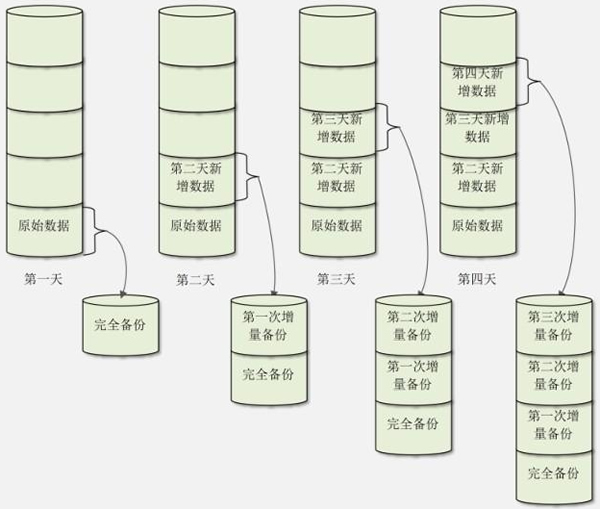
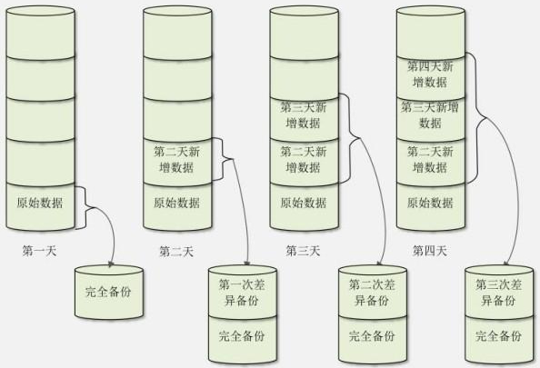

不知道大家有没有丢失过重要的数据呢？

丢失数据的理由是多种多样的，有人是因为重装系统时，没有把加密文件的密钥导出，重装系统后密钥丢失，导致所有的加密数据不能解密；也有人是因为在火车上笔记本电脑被别人调包，从而导致硬盘中的重要数据丢失；还有人是因为在系统中误执行了 `rm -rf` 命令，导致整个根目录被人为清空。但由此带来的后果是一样严重的。

保护重要数据的最有效的方法就是“不要把鸡蛋都放在一只篮子里”，这就是数据备份最主要的作用。

## 备份的重要性

前面我们已经学习了很多有关 Linux  系统的安全防范策略（例如用户管理、权限管理等），但安全永远是相对的，而不是绝对的。系统硬件的损坏，黑客的无孔不入，都是系统安全的大敌。在这种情况下，如果我们要保证系统安全和应用安全，备份是必不可少的一个步骤。

虽然 Linux 系统难免会因内部环境、底层硬件、外来黑客等因素的影响出现问题，但作为一名系统管理人员，自身的职责并不是要保证系统永远不出问题（事实上也是不可能做到的），而是要在系统出现故障或者崩溃时，能以最快的速度，用最短时间恢复系统的运行，保证数据的安全，从而将故障带来的损失降到最低。

要实现这样的目标，就要求系统管理人员对系统和业务应用有一个合理的备份恢复策略，完美的备份策略可以保证业务的 0 宕机时间和数据的完全恢复。有人说，既然数据备份非常重要，那我把重要数据在硬盘中保存一份，在移动硬盘中也保存一份，再刻录一张光盘，这样数据应该非常安全了吧？

对个人用户来讲，这样保存数据已经足够了；但是对企业用户来讲，还是有安全隐患的，因为这些数据还是放在同一个地方的。还记得美国的“9·11”事件吗？像美国纽约世贸中心那样的庞然大物也轰然倒塌。当然，相比这样的灾难来讲，数据的损失已经是微不足道的了，不过这仍然说明异地备份的重要性。所以，我们在备份数据的时候，不仅要把数据保存在多个存储介质中，还要考虑把重要数据异地保存。

至于在 Linux 系统中，有哪些数据应该被视为重要数据，又该如何备份？

## Linux 中的哪些数据需要备份

既然备份这么重要，那么对 Linux 服务器来讲，我们到底需要备份哪些数据呢？当然最理想的就是把整块硬盘中的数据都备份，甚至连分区和文件系统都备份，这样如果硬盘损坏，那么我们可以直接把备份硬盘中的数据导入损坏的硬盘，甚至可以直接用备份硬盘代替损坏的硬盘。从数据恢复角度来说，这样的整盘备份是最方便的（`dd` 命令就可以实现整盘备份，类似于 Windows 中的 GHOST 软件)。不过这种备份的备份时间比较长，占用的硬盘空间较大，不太适合经常进行。我们最常进行的备份还是把系统中的重要数据进行备份。那么，哪些数据是 Linux 服务器中较为重要的、需要定时备份的数据呢？

### Linux 服务器中的重要数据

Linux 服务器中的哪些数据需要备份，可能不同的管理员有不同的理解，不过有这样一些数据是大家公认的需要备份的数据。

- `/root/` 目录：`/toot/` 目录是管理员的家目录，很多管理员会习惯在这个目录中保存一些相关数据，那么，当进行数据备份时，需要备份此目录。
- `/home/` 目录：`/home/` 目录是普通用户的家目录。如果是生产服务器，那么这个目录中也会保存大量的重要数据，应该备份。

- `/var/spool/mail/` 目录：在默认情况下，所有的用户未读的邮件会保存在 `/var/spool/mail/` 目录下和用户名相同的邮箱文件中，已读的邮件会保存在用户家目录下的 `mbox` 文件中（`mail` 命令默认如此保存，不过如果使用了 `hold` 命令，那么不管邮件是否已读，都保存在 `/var/spool/mail/` 目录中。可以使用 `mbox` 命令恢复已读邮件保存在 `~/mbox` 文件中）。一般情况下，用户的邮件也是需要备份的重要数据。

- `/etc/` 目录：系统重要的配置文件保存目录，当然需要备份。

- 其他目录：根据系统的具体情况，备份你认为重要的目录。比如，我们的系统中有重要的日志，或者安装了 RPM 包的 MySQL 服务器（RPM 包安装的 mysql 服务，数据库保存在 `/var/lib/mysql/`目录中)，那么 `/var/` 目录就需要备份；如果我们的服务器中安装了多个操作系统，或编译过新的内核，那么 `/boot` 目录就需要备份。

### 安装服务的数据

我们的 Linux 服务器中会安装各种各样的应用程序，这些程序当然也有重要数据需要备份。不过应用程序是多种多样的，每种应用程序到底应该备份什么数据也不尽相同，要具体情况具体对待。这里拿最常见的 apache 服务和 mysql 服务来举例。

- apache 服务需要备份如下内容：
  - 配置文件。RPM 包安装的 apache 需要备份 `/etc/httpd/con/hpptd.conf`；源码包安装的 apache 则需要备份 `/usr/local/apache2/conf/httpd.conf`。
  - 网页主目录。RPM 包安装的 apache 需要备份 `/var/www/html/` 目录中所有的数据；源码包安装的 apache 需要备份 `/usr/local/apache2/htdocs/` 目录中所有的数据。
  - 日志文件。RPM 包安装的 apache 需要备份 `/var/log/httpd/` 目录中所有的日志；源码包安装的 apache 需要备份 `/usr/local/apache2/logs/` 目录中所有的日志。

其实，对源码包安装的 apache 来讲，只要备份 `/usr/ocal/apache2/` 目录中所有的数据即可，因为源码包安装的服务的所有数据都会保存到指定目录中。但如果是 RPM 包安装的服务，就需要单独记忆和指定了。

- mysql 服务需要备份如下内容：
  - 对于源码包安装的 mysql 服务，数据库默认安装到 `/usr/local/mysql/data/` 目录中，只需备份此目录即可。
  - 对于 RPM 包安装的 mysql 服务，数据库默认安装到 `/var/lib/mysql/` 目录中，只需备份此目录即可。

如果是源码包安装的服务，则可以直接备份 `/usr/local/` 目录，因为一般源码包服务都会安装到 `/usr/local/` 目录中。如果是 RPM 包安装的服务，则需要具体服务具体对待，备份正确的数据。

## 备份策略

常用的备份策略有**完全备份**和**增量备份**，而增量备份有可细分为累计增量备份和差异增量备份。下面来分别讲述不同备份策略以及之间的区别。

### 完全备份

完全备份是指把所有需要备份的数据全部备份。当然，完全备份可以备份整块硬盘、整个分区或某个具体的目录。对于 Linux 操作系统来说，完全备份指的就是将根目录下的所有文件进行备份。

完全备份的好处是，所有数据都进行了备份，系统中任何数据丢失都能恢复，且恢复效率较高。如果完全备份备份的是整块硬盘，那么甚至不需要数据恢复，只要把备份硬盘安装上，服务器就会恢复正常。

完全备份的缺点也很明显，那就是需要备份的数据量较大，备份时间较长，备份了很多无用数据，占用的空间较大，所以完全备份不可能每天执行。

我们一般会对关键服务器进行整盘完全备份，如果出现问题，则可以很快地使用备份硬盘进行替换，从而减少损失。我们甚至会对关键服务器搭设一台一模一样的服务器，这样只要远程几个命令（或使用 Shell 脚本自动检测，自动进行服务器替换），备份服务器就会接替原本的服务器，使故障响应时间大大缩短。

### 累计增量备份

在一个数据量很大的业务应用中，每天对 Linux 系统进行完全备份是不现实的，这就需要用到增量备份策略。

累计增量备份是指先进行一次完全备份，服务器运行一段时间之后，比较当前系统和完全备份的备份数据之间的差异，只备份有差异的数据。服务器继续运行，再经过一段时间，进行第二次增量备份。在进行第二次增量备份时，当前系统和第一次增量备份的数据进行比较，也是只备份有差异的数据。第三次增量备份是和第二次增量备份的数据进行比较，以此类推。

因此，累计增量备份就是只备份每天增加或者变化的数据，而不备份系统中没有变动的数据。我们画一张示意图，如图8-1 所示。

::: center



**图8-1 <u>累计增量备份</u>**

:::
假设我们在第一天进行一次完全备份。第二天增量备份时，只会备份第二天和第一天之间的差异数据，但是第二天的总备份数据是完全备份加第一次增量备份的数据。第三天增量备份时，只会备份第三天和第二天之间的差异数据，但是第三天的总备份数据是完全备份加第一次增量备份的数据，再加第二次增量备份的数据。当然，第四天增量备份时，只会备份第四天和第三天的差异数据，但是第四天的总备份数据是完全备份加第一次增量备份的数据，加第二次增量备份的数据，再加第三次增量备份的数据。

采用累计增量备份的好处是，每次备份需要备份的数据较少，耗时较短，占用的空间较小；坏处是数据恢复比较麻烦，如果是图1  的例子，那么当进行数据恢复时，就要先恢复完全备份的数据，再依次恢复第一次增量备份的数据、第二次增量备份的数据和第三次增量备份的数据，最终才能恢复所有的数据。

### 差异增量备份

差异增量备份（后续简称差异备份）也要先进行一次完全备份，但是和累计增量备份不同的是，每次差异备份都备份和原始的完全备份不同的数据。也就是说，差异备份每次备份的参照物都是原始的完全备份，而不是上一次的差异备份。我们也画一张示意图，如图8-2 所示。

::: center



**图8-2	<u>差异增量备份</u>**

:::
假设我们在第一天也进行一次完全备份。第二天差异备份时，会备份第二天和第一天之间的差异数据，而第二天的备份数据是完全备份加第一次差异备份的数据。第三天进行差异备份时，仍和第一天的原始数据进行对比，把第二天和第三天所有的数据都备份在第二次差异备份中，第三天的备份数据是完全备份加第二次差异备份的数据。第四天进行差异备份时，仍和第一天的原始数据进行对比，把第二天、第三天和第四天所有的不同数据都备份到第三次差异备份中，第四天的备份数据是完全备份加第三次差异备份的数据。

相比较而言，差异备份既不像完全备份一样把所有数据都进行备份，也不像增量备份在进行数据恢复时那么麻烦，只要先恢复完全备份的数据，再恢复差异备份的数据即可。不过，随着时间的增加，和完全备份相比，变动的数据越来越多，那么差异备份也可能会变得数据量庞大、备份速度缓慢、占用空间较大。

一个比较的备份策略是，对于数据量不大，并且每天数据量增加不多的系统，优先选择完全备份；对于数据量巨大，每天新增数据也很多的系统，视情况选择差异备份或者增量备份。

## 备份和恢复

其实数据备份就是把数据复制一份保存在其他位置，如果能够压缩一下，当然就更好了。那我们使用 `tar` 或 `cp` 命令可以实现数据的备份吗？当然可以，不过它们只能实现完全备份，如果要实现增量备份和差异备份，就必须写 Shell 脚本来实现了。

作为 Linux 系统管理员，最经常使用的备份工具就是 `tar` 和 `cpio` 命令。前面已经学过，此处不做说明。

::: tip tar 备份脚本示例

下面通过 `tar` 命令做的一个 Web 服务器的备份脚本，详细了解 `tar` 命令作为备份工具时的具体用法。

以下是一个有关 Web 服务器的备份脚本：

```shell
#!/bin/sh
BAKDATE=`date +%y%m%d`
DATA3=`date -d "3 days ago" +%y%m%d`
osdata=/disk1
userdata=/disk2
echo "backup OS data starting"
tar -zcvf /$osdata/etc.data/etc_$BAKDATE.tar.gz /etc
tar -zcvf /$osdata/boot.data/boot_$BAKDATE.tar.gz /boot
tar -zcvf /$osdata/home.data/home_$BAKDATE.tar.gz /home
tar -zcvf /$osdata/root.data/root_$BAKDATE.tar.gz /root
tar -zcvf /$userdata/usr_data/usrlocal_$BAKDATE.tar.gz /usr/local
tar -zcvf /$userdata/var_www/www_$BAKDATE.tar.gz /var/www
cp -r /$osdata/* /$userdata
cp -r /$userdata/* /$osdata
echo "Backup OS data complete!"

echo "delete OS data 3 days ago"
rm -rf /$osdata/etc.data/etc_$DATA3.tar.gz
rm -rf /$osdata/boot.data/boot_$DATA3.tar.gz
rm -rf /$osdata/home.data/home_$DATA3.tar.gz
rm -rf /$osdata/root.data/root_$DATA3.tar.gz
rm -rf /$osdata/usr_data/usrlocal_$DATA3.tar.gz
rm -rf /$osdata/var_www/www_$DATA3.tar.gz

rm -rf /$userdata/etc.data/etc_$DATA3.tar.gz
rm -rf /$userdata/boot.data/boot_$DATA3.tar.gz
rm -rf /$userdata/home.data/home_$DATA3.tar.gz
rm -rf /$userdata/root.data/root_$DATA3.tar.gz
rm -rf /$userdata/usr_data/usrlocal_$DATA3.tar.gz
rm -rf /$userdata/var_www/www_$DATA3.tar.gz
echo "delete cws ok!"
```

上面这段脚本完成的工作是，将系统和用户的备份数据分别保存在两个不同的本地磁盘 disk1 和 disk2 中，并且保留最近 3 天的数据，3 天前的数据自动删除。主要备份的数据有 `/etc` 目录、`/boot` 目录、`/home` 目录、`/root` 目录、`/usr/local` 目录和 `/var/www` 目录。当然这里只是举个例子，凡是存放数据的重要目录，都需要进行备份。

将此脚本放到系统守护进程（类似于 Windows 下的计划任务）crontab 下，设定备份时间，即可实现定时数据备份。有关 crontab 的详细介绍，请看前面的 Linux 工作管理。

:::

### dump 命令

在 Linux 中给我们准备了专用的备份和恢复命令，那就是 `dump` 和 `restore`，它们可以轻松地实现数据备份和数据恢复，而且它们是可以直接实现增量备份和差异备份的。

在系统学习 `dump` 命令之前，由于 CentOS 6.x 系统默认是没有安装此命令的，因此需要我们手动安装 `dump` 命令，安装命令如下：

```shell
[root@localhost ～]# yum -y install dump
```

`dump` 命令使用“备份级别”来实现增量备份，它支持 0～9 共 10 个备份级别。其中，0 级别指的就是完全备份，1～9 级别都是增量备份级别。

举个列子，当我们备份一份数据时，第一次备份应该使用 0 级别，会把所有数据完全备份一次；第二次备份就可以使用 1 级别了，它会和 0 级别进行比较，把 0 级别备份之后变化的数据进行备份；第三次备份使用 2 级别，2 级别会和 1 级别进行比较，把 1 级别备份之后变化的数据进行备份，以此类推。

<u>需要注意的是，只有在备份整个分区或整块硬盘时，才能支持 1～9 的增量备份级别；如果只是备份某个文件或不是分区的目录，则只能使用 0 级别进行完全备份。</u>

`dump` 命令的基本格式如下：

```shell
[root@localhost ~]# dump [选项] 备份之后的文件名 原文件或目录
选项：
	-level		：就是我们说的 0～9 共 10 个备份级别
	-f 文件名	：指定备份之后的文件名
	-u			：备份成功之后，把备份时间、备份级别以及实施备份的文件系统等信息，都记录在 /etc/dumpdates 文件中
	-v			：显示备份过程中更多的输出信息
	-j			：调用 bzlib 库压缩备份文件，其实就是把备份文件压缩为 .bz2 格式，默认压缩等级是 2
	-W			：显示允许被 dump 的分区的备份等级及备份时间
```

`dump` 命令是一个较为复杂的命令，如果我们只是想要实现数据的备份与恢复，那么掌握以上几个选项就足够了。

#### 备份分区

​	

```shell
[root@localhost ~]# df -h
文件系统	容量	已用	可用	已用%	挂载点
/dev/sda3	20G		3.0G	16G		17%		/
tmpfs		306M	0		306M	0%		/dev/shm
/dev/sda1	194M	26M		158M	15%		/boot
/dev/sr0	3.5G	3.5G	0		100%	/mnt/cdrom
#系统中我们就分了/分区和/boot分区。根分区太大,备份速度太慢,我们还是备份/boot分区吧
[rootSlocalhost ~]# dump -0uj -f /root/boot.bak.bz2 /boot/
#备份命令。先执行一次完全备份,并压缩和更新备份时间
DUMP: Date of this level 0 dump: Wed Jun 5 03:08:22 2013
#备份的级别和时间
DUMP: Dumping /dev/sdal (/boot) to /root/boot.bak.bz2
#备份源和目标
DUMP: Label: none
#分区没有卷标
DUMP: Writing 10 Kilobyte records
DUMP: Compressing output at compression level 2 (bzlib)
#备份时压缩
DUMP: mapping (Pass I) [regular files]
DUMP: mapping (Pass II) [directories]
DUMP: estimated 21846 blocks.
DUMP: Volume 1 started with block 1 at： Wed Jun 5 03:08:22 2013
DUMP: dumping (Pass III) [directories]
#开始dump 备份
DUMP: dumping (Pass XV) [regular files]
DUMP: Closing /root/boot.bak.bz2
#备份结朿，生成备份文件
DUMP: Volume 1 completed at: Wed Jun 5 03:08:30 2013
DUMP: Volume 1 took 0:00:08
DUMP: Volume 1 transfer rate: 2370 kB/s
DUMP: Volume 1 21930kB uncompressed, 18962kB compressed, 1.157:1
#数据容量
DUMP: 2X930 blocks (21.42MB) on 1 volume(s)
DUMP: finished in 7 seconds, throughput 3132 kBytes/sec
DUMP: Date of this level 0 dump: Wed Jun 5 03:08:22 2013
DUMP: Date this dump completed: Wed Jun 5 03:08:30 2013
DUMP: Average transfer rate: 2370 kB/s
DUMP: Wrote 21930kB uncompressed, 18962kB compressed, 1.157:1
[root@localhost ~]# cat /etc/dumpdates
#查看备份时间文件
/dev/sdal	0	Wed Jun 5 03:08:22 2013 +0800
#备份的分区	备份级别	备份曰期
[root@localhost @]# ll -h /root/boot.bak.bz2
-rw-r--r--. 1 root root 19M 6 月 5 03:08 /root/boot.bak.bz2
#备份文件生成了
```

如果 `/boot` 分区的内容发生了变化，则可以使用 1 级别进行增量备份。当然，如果数据会继续发生变化，则可以继续使用 2～9 级别增量备份。命令如下：

```shell
[root@localhost ~]# ll -h /root/install.log
-rw-r--r--.1 root root 25K 4月 10 21：49 /root/install.log
#查看安装软件包日志的大小为25KB
[root@localhost ~]# cp install.log /boot/
#复制日志文件到/boot分区
[root@localhost ~]# dump -1uj -f /root/boot.bak1.bz2 /boot/
#增量备份/boot分区，并压缩
[root@localhost ~]# ll -h boot.bak*
-rw-r--r--.1 root root 18K 6月 5 03：16 boot.bak1.bz2
-rw-r--r--.1 root root 19M 6月 5 03：08 boot.bak.bz2
#boot.bak1.bz2压缩文件只有18KB，证明增量备份只备份了0级别以后变化的数据
```

如果备份的是整个分区，那么是可以使用 `dump -W` 命令来查询分区的备份时间及备份级别的。不过要注意，如果备份时没有使用“-u”选项，那么 `dump -W` 命令是不会记录备份的时间和级别的。命令如下：

```shell
[root@localhost ~]# dump -W
Last dump(s) done (Dump '>' file systems)：
/dev/sda3 (		/) Last dump：Level 1， Date Wed Jun 5 02：31：50 2013
/dev/sda1 (	/boot) Last dump：Level 1， Date Wed Jun 5 03：16：27 2013
#/分区和/boot分区都进行过dump备份，/boot分区的最新备份级别是1
```

`dump` 命令可以非常方便地实现增量备份，但是如何实现差异备份呢？其实也很简单，先使用 0 级别完全备份一次，以后的每次备份都使用 1 级别进行备份。

#### 备份文件或目录

`dump` 命令也可以文件或目录，不过，只要不是备份分区，就只能使用 0 级别进行完全备份，而不再支持增量备份。同时，不能使用“-u”选项更新分区的备份时间，当然也不能使用 `dump -W` 命令查询到文件或目录的备份。

我们说 `/etc/` 目录是重要的配置文件目录，那么我们就备份这个目录来看看吧。命令如下：

```shell
[root@localhost ~]# dump -0j -f /root/etc.dump.bz2 /etc/
#完全备份/etc/目录
[root@localhost ~]# ll -h /root/etc.dump.bz2
-rw-r--r--.1 root root 8.6M 6月 5 03：26 /root/etc.dump.bz2
#查看备份文件
```

不过，如果使用增量备份会怎么样呢？命令如下：

```shell
[root@localhost ~]# dump -1j -f /root/etc.dump1.bz2 /etc/
DUMP：Only level 0 dumps are allowed on a subdirectory
DUMP：The ENTIRE dump is aborted.
#备份失败了，目录备份只能使用0级别
```

### restore 命令

`restore` 命令是 `dump` 命令的配套命令，`dump` 命令是用来备份分区和数据的，而 `restore` 命令是用来恢复数据的。

`restore` 命令的基本格式如下：

```shell
[root@localhost ~]# restore [模式选项] [-f]
模式选项：
	restore 命令常用的模式有以下 4 种，这 4 种模式不能混用：
	-C：比较备份数据和实际数据的变化。如果实际数据中的现有数据发生了变化，那么这个选项能够检测到这个变化。
		但是如果实际数据中新增了数据，那么这个选项是不能检测到变化的
	-i：进入交互模式，手工选择需要恢复的文件
	-t：查看模式，用于查看备份文件中拥有哪些数据
	-r：还原模式，用于数据还原
	
选项：	
	-f：选项用于指定备份文件的文件名
```

#### 比较备份数据和实际数据的变化

这里大家需要注意，数据比较只有在原有数据减少或发生变化时才能检测到变化，而新增的数据是不会被检测到的。命令如下：

```shell
[root@localhost ~]# touch /boot/abc
#在/boot/目录中新建abc文件
[root@localhost ~]# restore -C -f /root/boot.bak.bz2
Dump tape is compressed.
Dump date：Wed Jun 5 08：20：02 2013
Dumped from：the epoch
Level 0 dump of /boot on localhost：/dev/sda1
Label：none
filesys = /boot
#restore检测，没有发现任何变化（当然，因为备份数据在备份时没有abc文件，所以restore命令是不能识别新建文件的）
[root@localhost ~]# mv /boot/vmlinuz-2.6.32-279.el6.i686 /boot/vmlinuz-2.6.32-279.el6.i686.bak
#把/boot/目录中的内核镜像文件改一个名字
[root@localhost ~]# restore -C -f /root/boot.bak.bz2
Dump tape is compressed.
Dump date：Wed Jun 5 08：20：02 2013
Dumped from：the epoch
Level 0 dump of /boot on localhost：/dev/sda1
Label：none
filesys = /boot
restore：unable to stat ./vmlinuz-2.6.32-279.el6.i686：No such file or directory Some files were modified！ 1 compare errors
#restore发现内核镜像文件丢失
```

这个实验比较危险，一定要记得把内核镜像文件的名字改回来，否则一旦重启，系统就会无法正常启动。

```shell
[root@localhost ~]# mv /boot/vmlinuz-2.6.32-279.el6.i686.bak /boot/vmlinuz2.6.32-279.el6.i686
```

#### 查看模式

这种模式比较简单，就是查看备份文件中到底包含什么内容。命令如下：

```shell
[root@localhost ~]# restore -t -f boot.bak.bz2
Dump tape is compressed．
#备份数据是压缩的
Dump date：Wed Jun 5 08：20：02 2013
#数据备份时间
Dumped from：the epoch
Level 0 dump of /boot on localhost：/dev/sda1
#备份等级
Label：none
#分区的卷标，没有设定卷标
2.
11 ./lost+found
12 ./grub
24 ./grub/grub.conf
13 ./grub/splash.xpm.gz
...省略部分输出...
```

#### 还原模式

`restore` 命令的还原模式既可以用于还原整个分区，也可以用于还原文件或目录。命令格式是一样的，不过要注意，如果要还原增量备份的数据，则一定要先还原完全备份的数据。命令如下：

```shell
#还原boot.bak.bz2分区备份
#先还原完全备份的数据
[root@localhost ~]# mkdir boot.test
#建立准备解压缩的目录。当然，如果这个目录是我新建的分区，就可以直接把数据恢复到分区中
[root@localhost ~]# cd boot.test/
#进入解压缩目录
[root@localhost boot.test]# restore -r -f /root/boot.bak.bz2
Dump tape is compressed.
#备份数据是压缩数据
#解压缩
[root@localhost boot.test]# ll
#查看一下解压缩的文件
总用量21300
-rw-r--r--. 1 root root 106611 6月 22 20:12 config-2.6.32-279.el6.i686
drwxr-xr-x. 3 root root 4096 4 月 10 21:47 efi
drwxr-xr-x. 2 root root 4096 4 月 10 21:49 grub
-rw-r--r--. 1 root root 14708399 4 月 10 21:49 initrara£s-2.6.32-279.el6.i686.img
drwx------. 2 root root 4096 4 月 10 21:44 lost+found
-rw-------. 1 root root 47504 6 月 5 09:44 restoresymtable
-rw-r--r--. 1 root root 175903 6 月 22 20:12 symvers-2.6.32-279.el6.i686.gz
-rw-r--r--. 1 root root 1846041 6 月 22 20:12 System.map-2.6.32-279.el6.i686
-rw-r--r--. 1 root root 1048576 6 月 5 02:38 test
-rwxr-xr-x. 1 root root 3856608 6 月 22 20:12 vmlinuz-2.6.32-279.el6.i686
#再还原增量备份的数据
[root@localhost boot.test]# restore -r -f /root/boot.bakl.bz2
Dump tape is compressed.
#恢复增量备份的数据
[root@localhost boot.test]# ll
总用量21328
-rw-r--r--. 1 root root 106611 6 月 22 20:12 config-2.6.32-279.el6.i686
drwxr-xr-x. 3 root root 4096 4 月 10 21:47 efi
drwxr-xr-x. 2 root root 4096 4 月 10 21:49 grub
-rw-r--r--. 1 root root 14708399 4 月 10 21:49 initramfs-2.6.32-279.eX6.i686.img
-rw-r--r--. 1 root root 24772 6 月 5 08:20 install. log
#增量备份的install.log文件被恢复了
drwx------. 2 root root 4096 4 月 10 21:44 lost+found
-rw-------. 1 root root 47552 6 月 5 09:57 restoresymtable
-rw-r--r--. 1 root root 175903 6 月 22 20:12 symvers-2.6.32-279.el6.i686.gz
-rw-r--r--. 1 root root 1846041 6 月 22 20:12 System.map-2.6.32-279.el6.i686
-rw-r--r--. 1 root root 1048576 6 月 5 02:38 test
-rwxr-xr-x. 1 root root 3856608 6月 22 20:12 vmlinuz-2.6.32-279.el6.i686
```

我们再来还原 `/etc/` 目录的备份 `etc.dump.bz2`，其实还原的方法是完全一样的。命令如下：

```shell
[root@localhost ~]# restore -r -f etc.dump.bz2
Dump tape is compressed.
#还原etc.dump.bz2备份
[root@localhost ~]# ll -d /root/etc
drwxr-xr-x.103 root root 12288 6月 5 07:45 /root/etc
#在root下生成了etc目录，里面的数据和/etc/目录中的数据完全一致
```

### dd命令

`dd` 命令主要用来进行数据备份，并且可以在备份的过程中进行格式转换。其实 `dd` 命令可以把源数据复制成目标数据，而且不管源数据是文件、分区、磁盘还是光盘，都可以进行数据备份。

`dd` 命令的基本格式如下：

```shell
[root@localhost ~]# dd if="输入文件" of="输出文件" bs="数据块" count="数量"
参数：
	if			：定义输入数据的文件，也可以是输入设备；
	of			：定义输出数据的文件，也可以是输出设备；
	bs			：指定数据块的大小，也就是定义一次性读取或写入多少字节。模式数据块大小是 512 字节；
	count		：指定 bs 的数量；
	conv=标志	：依据标志转换文件。
	
		标志有以下这些：
		ascii	：由 EBCDIC 码转换至 ASCII 码；
		ebcdic	：由 ASCII 码转换至 EBCDIC 码；
		ibm		：由 ASCII 码转换至替换的 EBCDIC 码；
		block	：将结束字符块里的换行替换成等长的空格；
		unblock	：将 cbs 大小的块中尾部的空格替换为一个换行符；
		lcase	：将大写字符转换为小写；
		notrunc	：不截断输出文件；
		ucase	：将小写字符转换为大写；
		swab	：交换每一对输入数据字节；
		noerror	：读取数据发生错误后仍然继续；
		sync	：将每个输入数据块以 NUL 字符填满至 ibs 的大小；当配合 block 或 unblock 时，会以空格代替 NUL 字符填充；
```

#### 备份文件

```shell
[root@localhost ~]# dd if=/etc/httpd/conf/httpd.conf of=/tmp/httpd.bak
记录了67+1 的读入
#数据占了写满的67个数据块，以及1个没有写满的数据块
记录了67+1 的写出
#默认数据块大小是512字节
34439字节(34 kB)已复制，0.0524897 秒，656 kB/秒
#如果要备份文件，那么dd命令和cp命令非常类似
[root@localhost ~]# ll -h /tmp/httpd.bak
-rw-r--r--.1 root root 34K 6月 5 18：04 /tmp/httpd.bak
#查看一下生成的备份文件的大小
```

#### 备份分区为一个备份文件

```shell
[root@localhost ~]# df -h
文件系统	容量	已用	可用	已用%%	挂载点
/dev/sda3	20G		2.0G	17G		11%		/
tmpfs		306M	0		306M	0%		/dev/shm
/dev/sda1	194M	27M		157M	15%		/boot
/dev/sr0	3.5G	3.5G	0		100%	/mnt/cdrom
#查看一下分区容量，我们备份/boot分区
[root@localhost ~]# dd if=/dev/sda1 of=/tmp/boot.bak
#备份完成
[root@localhost ~]# ll -h /tmp/boot.bak
-rw-r--r--.1 root root 200M 6月 5 18：14 /tmp/boot.bak
#查看生成的备份文件

#如果需要恢复，则执行以下命令
[root@localhost ~]# dd if=/tmp/boot.bak of=/dev/sda1

#如果想要把分区直接备份成另一个分区，就需要生成一个新的分区，
#这个分区的大小不能比源分区小，只能和源分区大小一致或比它大。命令如下：
[root@localhost ~]# dd if=/dev/sda1 of=/dev/sdb1
#如果需要恢复，则只需把输入项和输出项反过来即可，命令如下：
[root@localhost ~]# dd if=/dev/sdb1 of=/dev/sda1
```

#### 整盘备份

```shell
[root@localhost ~]# dd if=/dev/sda of=/dev/sdb
#把磁盘a备份到磁盘b
[root@localhost ~]# dd if=/dev/sda of=/tmp/disk.bak
#把磁盘a备份成文件disk.bak
#备份恢复
#如果要备份到另一块硬盘上，那么，当源硬盘数据损坏时，只需用备份硬盘替换源硬盘即可
#如果要备份成文件，那么在恢复时需要把备份数据复制到其他Linux中，然后把新硬盘安装到这台Linux
#服务器上，再把磁盘备份数据复制到新硬盘中。命令如下
[root@localhost ~]# dd if=/tmp/disk.bak of=/dev/sdb
```

#### 复制软盘

```shell
[root@localhost ~]# dd if=/dev/fd0 of=/tmp/fd.bak
#在Linux中软盘的设备文件名是/dev/fd0
#这条命令先把软盘中的数据保存为临时数据文件
[root@localhost ~]# dd if=/tmp/fd.bak of=/dev/fd0
#然后更换新的软盘，把数据备份复制到新软盘中，就实现了软盘的复制
```

#### 复制光盘

如果需要备份的是光盘，那么在 Linux 中就是使用 `dd` 命令制作光盘的 ISO 镜像的。命令如下：

```shell
#制作光盘ISO镜像
[root@localhost ~]# dd if=/dev/cdrom of=/tmp/cd.iso
#把光盘中所有的数据制作成ISO镜像
[root@localhost ~J # mkdir /mnt/cd
#建立一个新的挂载点
[root@localhost ~]# mount -o loop /tmp/cd.iso /mnt/cd
#挂栽ISO文件到挂载点
[root@localhost ~]# cd /mnt/cd
#进入挂栽点
[root@localhost cd]# ls
CentOS_BuildTag images RELEASE-NOTES-en-tJS.html RPM-GPG-KEY-CentOS-Debug-6 TRANS.TBL
EULA    isolinux repodata   RPM-GPG-KEY-CentOS-Security-6
GPL Packages RPM-GPG-KEY-CentOS-6 RPM-GPG-KEY-CentOS-Testing-6
#数据是光盘当中的数据,这个ISO镜像是可以被当作真正的光盘使用的
```

#### 其他

我们有时需要制作指定大小的文件，比如，在增加 swap 分区时，就需要建立指定大小的文件，这时也使用 `dd` 命令。命令如下：

```shell
[root@localhost ~]# dd if=/dev/zero of=/tmp/testfile bs=1M count=10
#数据输入项是/dev/zero会向目标文件中不停地写入二进制的0
#指定数据块大小是1MB
#指定生成10个数据块。也就是定义输出的文件大小为10MB
记录了10+0 的读入
#显示数据占满了10个数据块
记录了10+0 的写出
#不过这里数据块的大小已经是1MB了
10485760字节(10 MB)已复制，0.00709902 秒，1.5 GB/秒
[root@localhost ~]# ll -h /tmp/testfile
-rw-r--r--.1 root root 10M 6月 5 18：46 /tmp/testfile
#生成的testfile文件的大小刚好是10MB
```

`dd` 命令在进行整盘复制时，类似于 GHOST 工具的功能，不过通过 `dd` 命令复制出来的硬盘数据要比 GHOST 复制出来的硬盘数据稳定得多。虽然 `dd` 命令功能强大，不过也有一个明显的缺点，就是复制的时间较长，复制 100GB 的数据需要 15～25 分钟（根据服务器的性能不同而不同）。

实现数据备份还有非常多的方法和工具，比如 `tar` 和 `cpio` 命令。至于网络复制工具，如 rsync 和 scp 等，需要较完善的网络知识才能够学习，这里不再介绍。

