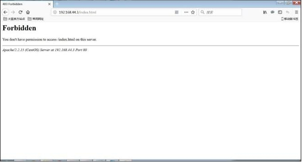

root 用户实在是一个超人，它在 Linux 系统当中就是无所不能的，而且读、写和执行权限对 root 用户完全没有作用。root 用户的存在极大地方便了 Linux 的管理，但是也造成了一定的安全隐患。

大家想象一下，如果 root 用户被盗用了，或者 root 用户本身对 Linux 并不熟悉，在管理 Linux 的过程中产生了误操作，则会造成什么样的后果？

其实绝大多数系统的严重错误都是由于 root 用户的误操作引起的，来自外部的攻击产生的影响反而不是那么严重。root 用户的权限过高了，一些看似简单、微小的操作，都很有可能对系统产生重大的影响。最常见的错误就是 root 用户为了管理方便，给重要的系统文件或系统目录设置了 777 权限，这会造成严重的安全隐患。

SELinux 是由美国国家安全局（NSA）开发的，整合在 Linux 内核当中，针对特定的进程与指定的文件资源进行权限控制的系统。即使你是 root 用户，也必须遵守 SELinux 的规则，才能正确访问正确的资源，这样可以有效地防止 root 用户的误操作（当然，root 用户可以修改 SELinux 的规则）。

需要注意的是，系统的默认权限还是会生效的，也就是说，用户既要符合系统的读、写、执行权限，又要符合 SELinux 的规则，才能正确地访问系统资源。

## SELinux 是什么

SELinux，Security Enhanced Linux 的缩写，也就是安全强化的 Linux，是由美国国家安全局（NSA）联合其他安全机构（比如 SCC 公司）共同开发的，旨在增强传统 Linux 操作系统的安全性，解决传统 Linux 系统中自主访问控制（DAC）系统中的各种权限问题（如 root 权限过高等）。

SELinux 项目在 2000 年以 GPL 协议的形式开源，当 Red Hat 在其 Linux 发行版本中包括了 SELinux 之后，SELinux 才逐步变得流行起来。现在，SELinux 已经被许多组织广泛使用，几乎所有的 Linux  内核 2.6 以上版本，都集成了 SELinux 功能。

**对于 SELinux，初学者可以这么理解，它是部署在 Linux 上用于增强系统安全的功能模块。**

我们知道，传统的 Linux 系统中，默认权限是对文件或目录的所有者、所属组和其他人的读、写和执行权限进行控制，这种控制方式称为自主访问控制（DAC）方式；而在 SELinux 中，采用的是强制访问控制（MAC）系统，也就是控制一个进程对具体文件系统上面的文件或目录是否拥有访问权限，而判断进程是否可以访问文件或目录的依据，取决于 SELinux 中设定的很多策略规则。

说到这里，就有必要详细地了解一下这两个访问控制系统的特点：

- 自主访问控制系统（Discretionary Access Control，DAC）是 Linux 的默认访问控制方式，也就是依据用户的身份和该身份对文件及目录的 rwx 权限来判断是否可以访问。不过，在 DAC 访问控制的实际使用中我们也发现了一些问题：
  - root 权限过高，rwx 权限对 root 用户并不生效，一旦 root 用户被窃取或者 root 用户本身的误操作，都是对 Linux 系统的致命威胁。
  - Linux 默认权限过于简单，只有所有者、所属组和其他人的身份，权限也只有读、写和执行权限，并不利于权限细分与设定。
  - 不合理权限的分配会导致严重后果，比如给系统敏感文件或目录设定 777 权限，或给敏感文件设定特殊权限——SetUID 权限等。
- 强制访问控制（Mandatory Access Control，MAC）是通过 SELinux 的默认策略规则来控制特定的进程对系统的文件资源的访问。也就是说，即使你是 root 用户，但是当你访问文件资源时，如果使用了不正确的进程，那么也是不能访问这个文件资源的。这样一来，SELinux 控制的就不单单只是用户及权限，还有进程。每个进程能够访问哪个文件资源，以及每个文件资源可以被哪些进程访问，都靠 SELinux 的规则策略来确定。注意，在 SELinux 中，Linux 的默认权限还是有作用的，也就是说，一个用户要能访问一个文件，既要求这个用户的权限符合 rwx 权限，也要求这个用户的进程符合 SELinux 的规定。
  不过，系统中有这么多的进程，也有这么多的文件，如果手工来进行分配和指定，那么工作量过大。所以 SELinux 提供了很多的默认策略规则，这些策略规则已经设定得比较完善，我们稍后再来学习如何查看和管理这些策略规则。

为了使读者清楚地了解 SELinux 所扮演的角色，这里举一个例子，假设 apache 上发现了一个漏洞，使得某个远程用户可以访问系统的敏感文件（如 `/etc/shadow`）。如果我们的 Linux 中启用了 SELinux，那么，因为 apache 服务的进程并不具备访问 `/etc/shadow` 的权限，所以这个远程用户通过 apache 访问 `/etc/shadow` 文件就会被 SELinux 所阻挡，起到保护 Linux 系统的作用。

通过以上的介绍，应该对 SELinux 有了初步的认识，下面我们再通过了解 SELinux 的工作模式，细致了解 SELinux。

## SELinux的主要作用

我们知道，传统的 Linux 系统安全，采用的是 DAC（自主访问控制方式），而 SELinux 是部署在 Linux 系统中的安全增强功能模块，它通过对进程和文件资源采用 MAC（强制访问控制方式）为 Linux 系统提供了改进的安全性。

需要注意的是，SELinux 的 MAC 并不会完全取代 DAC，恰恰相反，对于 Linux  系统安全来说，它是一个额外的安全层，换句话说，当使用 SELinux 时，DAC 仍然被使用，且会首先被使用，如果允许访问，再使用 SELinux 策略；反之，如果 DAC 规则拒绝访问，则根本无需使用 SELinux 策略。

例如，若用户尝试对没有执行权限（rw-）的文件进行执行操作，那么传统的 DAC 规则就会拒绝用户访问，因此，也就无需再使用 SELinux 策略。

相比传统的 Linux DAC 安全控制方式，SELinux 具有诸多好处，比如说：

- 它使用的是 MAC 控制方式，这被认为是最强的访问控制方式；
- 它赋予了主体（用户或进程）最小的访问特权，这也就意味着，每个主体仅被赋予了完成相关任务所必须的一组有限的权限。通过赋予最小访问特权，可以防止主体对其他用户或进程产生不利的影响；
- SELinux 管理过程中，每个进程都有自己的运行区域（称为域），各进程仅运行在自己的域内，无法访问其他进程和文件，除非被授予了特殊权限。
- SELinux 可以调整到 Permissive 模式，此模式允许查看在系统上执行 SELinux 后所产生的影响。在 Permissive 模式中，SELinux 仍然会记录它所认为的安全漏洞，但并不会阻止它们。

有关 SELinux 模式设置等内容，后面会详细介绍。

其实，想要了解 SELinux 的优点，最直接的办法就是查看当 Linux 系统上没有运行 SELinux 时会发生什么事情。

例如，Web 服务器守护进程（httpd）正在监听某一端口上所发生的事情，而后进来了一个请求查看主页的来自 Web 浏览器的简单请求。由于不会受到 SELinux 的约束，httpd 守护进程听到请求后，可以完成以下事情：

1. 根据相关的所有者和所属组的 rwx 权限，可以访问任何文件或目录；
2. 完成存在安全隐患的活动，比如允许上传文件或更改系统显示；
3. 可以监听任何端口的传入请求。

但在一个受 SELinux 约束的系统上，httpd 守护进程受到了更加严格的控制。仍然使用上面的示例，httpd仅能监听 SELinux  允许其监听的端口。SELinux 还可以防止 httpd 访问任何没有正确设置安全上下文的文件，并拒绝没有再 SELinux 中显式启用的不安全活动。

因此，从本质上讲，SELinux 最大程序上限制了 Linux 系统中的恶意代码活动。

## SELinux 的运行模式

通过对 SELinux 的介绍，初学者可以这样认为，在传统 Linux 系统使用访问控制方式的基础上，附加使用 SELinux 可增强系统安全。 那么，SELinux 是如何运行的呢？

在解释 SELinux 的工作模式之前，先解释几个概念。

1. 主体（Subject）：就是想要访问文件或目录资源的进程。想要得到资源，基本流程是这样的：由用户调用命令，由命令产生进程，由进程去访问文件或目录资源。在自主访问控制系统中（Linux 默认权限中），靠权限控制的主体是用户；而在强制访问控制系统中（SELinux 中），靠策略规则控制的主体则是进程。
2. 目标（Object）：这个概念比较明确，就是需要访问的文件或目录资源。
3. 策略（Policy）：Linux 系统中进程与文件的数量庞大，那么限制进程是否可以访问文件的 SELinux 规则数量就更加烦琐，如果每个规则都需要管理员手工设定，那么 SELinux 的可用性就会极低。还好我们不用手工定义规则，SELinux 默认定义了两个策略，规则都已经在这两个策略中写好了，默认只要调用策略就可以正常使用了。这两个默认策略如下：
   - -targeted：这是 SELinux 的默认策略，这个策略主要是限制网络服务的，对本机系统的限制极少。我们使用这个策略已经足够了。
   - -mls：多级安全保护策略，这个策略限制得更为严格。
4. 安全上下文（Security Context）：每个进程、文件和目录都有自己的安全上下文，进程具体是否能够访问文件或目录，就要看这个安全上下文是否匹配。如果进程的安全上下文和文件或目录的安全上下文能够匹配，则该进程可以访问这个文件或目录。当然，判断进程的安全上下文和文件或目录的安全上下文是否匹配，则需要依靠策略中的规则。举个例子，我们需要找对象，男人可以看作主体，女人就是目标了。而男人是否可以追到女人（主体是否可以访问目标），主要看两个人的性格是否合适（主体和目标的安全上下文是否匹配）。不过，两个人的性格是否合适，是需要靠生活习惯、为人处世、家庭环境等具体的条件来进行判断的（安全上下文是否匹配是需要通过策略中的规则来确定的）。

 我们画一张示意图，来表示一下这几个概念之间的关系，如图9-1 所示。

 ::: center


**图9-1	<u>SELinux 运行模式的相关概念</u>**

:::
解释一下这张示意图：当主体想要访问目标时，如果系统中启动了 SELinux，则主体的访问请求首先需要和 SELinux  中定义好的策略进行匹配。如果进程符合策略中定义好的规则，则允许访问，这时进程的安全上下文就可以和目标的安全上下文进行匹配；如果比较失败，则拒绝访问，并通过 AVC（Access Vector Cache，访问向量缓存，主要用于记录所有和 SELinux  相关的访问统计信息）生成拒绝访问信息。如果安全上下文匹配，则可以正常访问目标文件。当然，最终是否可以真正地访问到目标文件，还要匹配产生进程（主体）的用户是否对目标文件拥有合理的读、写、执行权限。

我们在进行 SELinux  管理的时候，一般只会修改文件或目录的安全上下文，使其和访问进程的安全上下文匹配或不匹配，用来控制进程是否可以访问文件或目录资源；而很少会去修改策略中的具体规则，因为规则实在太多了，修改起来过于复杂。不过，我们是可以人为定义规则是否生效，用以控制规则的启用与关闭的。

## SELinux 的工作模式

SELinux 提供了 3 种工作模式：Disabled、Permissive 和 Enforcing，而每种模式都为 Linux 系统安全提供了不同的好处。

### Disable 工作模式（关闭模式）

在 Disable 模式中，SELinux 被关闭，默认的 DAC 访问控制方式被使用。对于那些不需要增强安全性的环境来说，该模式是非常有用的。

例如，若从你的角度看正在运行的应用程序工作正常，但是却产生了大量的 SELinux AVC  拒绝消息，最终可能会填满日志文件，从而导致系统无法使用。在这种情况下，最直接的解决方法就是禁用 SELinux，当然，你也可以在应用程序所访问的文件上设置正确的安全上下文。

需要注意的是，在禁用 SELinux 之前，需要考虑一下是否可能会在系统上再次使用 SELinux，如果决定以后将其设置为 Enforcing 或 Permissive，那么当下次重启系统时，系统将会通过一个自动 SELinux 文件重新进程标记。

关闭 SELinux 的方式也很简单，只需编辑配置文件 `/etc/selinux/config`，并将文本中 SELINUX= 更改为 SELINUX=disabled 即可，重启系统后，SELinux 就被禁用了。

### Permissive 工作模式（宽容模式）

在 Permissive 模式中，SELinux 被启用，但安全策略规则并没有被强制执行。当安全策略规则应该拒绝访问时，访问仍然被允许。然而，此时会向日志文件发送一条消息，表示该访问应该被拒绝。

SELinux Permissive 模式主要用于以下几种情况：

- 审核当前的 SELinux 策略规则；
- 测试新应用程序，看看将 SELinux 策略规则应用到这些程序时会有什么效果；
- 解决某一特定服务或应用程序在 SELinux 下不再正常工作的故障。

某些情况下，可使用 `audit2allow` 命令来读取 SELinux 审核日志并生成新的 SELinux 规则，从而有选择性地允许被拒绝的行为，而这也是一种在不禁用 SELinux 的情况下，让应用程序在 Linux 系统上工作的快速方法。

### Enforcing 工作模式（强制模式）

从此模式的名称就可以看出，在 Enforcing 模式中， SELinux 被启动，并强制执行所有的安全策略规则。

## SELinux 配置文件

我们知道，SELinux 是预先配置的，可以在不进行任何手动配置的情况下使用 SELinux 功能。然而，一般来说，预先配置的 SELinux 设置很难满足所有的 Linux 系统安全需求。

SELinux 配置只能有 root 用户进行设置和修改。配置和策略文件位于 `/etc/selinux` 目录中，主配置文件位 `/etc/selinux/config` 文件，该文件中的内容如下：

```shell
[root@localhost ~]# vim /etc/selinux/config
# This file controls the state of SELinux on the system.
# SELINUX= can take one of these three values：
#	enforcing - SELinux security policy is enforced.
#	permissive - SELinux prints warnings instead of enforcing.
#	disabled - No SELinux policy is loaded.

SELINUX=enforcing
#指定SELinux的运行模式。有enforcing（强制模式）、permissive（宽容模式）、disabled（不生效）三种模式

# SELINUXTYPE= can take one of these two values：
#	targeted - Targeted processes are protected，
#	mls - Multi Level Security protection.
SELINUXTYPE=targeted
#指定SELinux的默认策略。有 targeted（针对性保护策略，是默认策略）和 mls（多级安全保护策略）两种策略
#主配置文件中，除去以‘#’符号开头的注释行，有效配置参数仅有 2 行。
其中，SELinux=enforcing 为 SELinux 默认的工作模式，有效值还可以是 permissive 和 disabled；
SELINUXTYPE=targeted 用于指定 SELinux 的默认策略。
```

这里需要注意，如果从强制模式（enforcing）、宽容模式（permissive）切换到关闭模式（disabled），或者从关闭模式切换到其他两种模式，则必须重启 Linux 系统才能生效，但是强制模式和宽容模式这两种模式互相切换不用重启 Linux 系统就可以生效。这是因为 SELinux 是整合到 Linux 内核中的，所以必须重启才能正确关闭和启动。而且，如果从关闭模式切换到启动模式，那么重启 Linux 系统的速度会比较慢，那是因为需要重新写入安全上下文信息。

## SELinux 工作模式设置

除了通过配置文件可以对 SELinux 进行工作模式的修改之外，还可以使用命令查看和修改 SELinux 工作模式。

首先，查看系统当前 SELinux 的工作模式，可以使用 `getenforce` 命令；而如果想要查看配置文件中的当前模式和模式设置，可以使用 `sestatus` 命令，下面的代码显示了这两个命令：

```shell
[root@localhost ~]# getenforce
#查询SELinux的运行模式
Enforcing
#当前的SELinux是强制模式
[root@localhost ~]# sestatus
SELinux status:				enabled
SELinuxfs mount:			/selinux
Current mode:				enforcing
Mode from config file:		enforcing
Policy version:				24
Policy from config file:	targeted
```

除可以查询 SELinux 的运行模式之外，也可以修改 SELinux 的运行模式，即使用 `setenforce` 命令。不过需要注意，`setenforce` 命令只能让 SELinux 在 enforcing 和 permissive  两种模式之间进行切换。如果从启动切换到关闭，或从关闭切换到启动，则只能修改配置文件，`setenforce` 命令就无能为力了。

`setenforce` 命令的基本格式如下：

```shell
[root@localhost ~]# setenforce 选项
选项：
	0： 切换成 permissive（宽容模式）；
	1： 切换成 enforcing（强制模式）；
```

例如：

```shell
[root@localhost ~]# setenforce 0
#切换成宽容模式
[root@localhost ~]# getenforce
Permissive
[root@localhost ~]# setenforce 1
#切换成强制模式
[root@localhost ~]# getenforce
Enforcing
```

## SELinux 安全上下文管理

SELinux 管理过程中，进程是否可以正确地访问文件资源，取决于它们的安全上下文。进程和文件都有自己的安全上下文，SELinux  会为进程和文件添加安全信息标签，比如 SELinux 用户、角色、类型、类别等，当运行 SELinux 后，所有这些信息都将作为访问控制的依据。

首先，通过一个实例看看如何查看文件和目录的安全上下文，执行命令如下：

```shell
[root@localhost ~]# ls -Z
#使用选项-Z查看文件和目录的安全上下文
-rw-------．root root system_u:object_r:admin_home_t:s0 anaconda-ks.cfg
-rw-r--r--．root root system_u:object_r:admin_home_t:s0 install.log
-rw-r--r--．root root system_u:object_r:admin_home_t:s0 install.log.syslog
```

可以看到，查看文件的安全上下文非常简单，就是使用 `ls -Z` 命令。而在此基础上，如果想要查看目录的安全上下文，需要添加“-d”选项，代表查看目录本身，而非目录下的子文件。举个例子：

```shell
[root@localhost ~]# ls -Zd /var/www/html/
drwxr-xr-x．root root system_u:object_r:httpd_sys_content_t:s0 /var/www/html/
```

那么，该如何查看进程的安全上下文呢？只需使用 `ps` 命令即可。命令如下：

```shell
[root@localhost ~]# service httpd start
#启动apache服务
[root@localhost ~]# ps auxZ | grep httpd
unconfined_u:system_r:httpd_t:s0 root 25620 0.0 0.5 11188 3304 ? Ss 03:44 0:02 /usr/sbin/httpd
...省略部分输出...
```

也就是说，只要进程和文件的安全上下文匹配，该进程就可以访问该文件资源。在上面的命令输出中，我们加粗的就是安全上下文。

安全上下文看起来比较复杂，它使用“:”分隔为 4 个字段，其实共有 5 个字段，只是最后一个“类别”字段是可选的，例如：

```shell
system_u:object_r:httpd_sys_content_t:s0:[类别]
#身份字段:角色:类型:灵敏度:[类别]
```

下面对这 5 个字段的作用进行说明。

### 1) 身份字段（user)

用于标识该数据被哪个身份所拥有，相当于权限中的用户身份。这个字段并没有特别的作用，知道就好。常见的身份类型有以下 3 种：

1. \- root：表示安全上下文的身份是 root。
2. \- system_u：表示系统用户身份，其中“_u”代表 user。
3. \- user_u：表示与一般用户账号相关的身份，其中“_u”代表 user。

user 字段只用于标识数据或进程被哪个身份所拥有，一般系统数据的 user 字段就是 system_u，而用户数据的 user 字段就是 user_u。

那么，SELinux 中到底可以识别多少用户身份字段呢？我们可以使用 `seinfo` 命令来进行查询。SELinux 的相关命令一般都是以“se”开头的，所以也较为好记。

`seinfo` 命令格式如下：

```shell
[root@localhost ~]# seinfo [选项]
 选项：
 	-u： 列出SELinux中所有的身份（user）；
 	-r： 列出SELinux中所有的角色（role）；
 	-t： 列出SELinux中所有的类型（type）；
 	-b： 列出所有的布尔值（也就是策略中的具体规则名称）；
 	-x： 显示更多的信息；
```

`seinfo` 命令的功能较多，我们在这里只想查询 SELinux 中的身份，那么只需执行如下命令：

```shell
[root@localhost ~]# seinfo -u
Users：9
	sysadm_u
	system_u
	xguest_u
	root
	guest_u
	staff_u
	user_u
	unconfined_u
	git_shell_u
```

就可以看到 SELinux 中能够识别的 user 身份共有 9 种。不过这个字段在实际使用中并没有太多的作用，了解一下即可。

### 2) 角色（role）

主要用来表示此数据是进程还是文件或目录。这个字段在实际使用中也不需要修改，所以了解就好。

 常见的角色有以下两种：

- \- object_r：代表该数据是文件或目录，这里的“_r”代表 role。
- \- system_r：代表该数据是进程，这里的“_r”代表 role。


那么，SELinux 中到底有多少种角色呢？使用 `seinfo` 命令也可以查询，命令如下：

```shell
[root@localhost ~]# seinfo -r
Roles：12
	guest_r
	staff_r
	user_r
	git_shell_r
	logadm_r
	object_r
	sysadm_r
	system_r
	webadm_r
	xguest_r
	nx_server_r
	unconfined_r
```

### 3) 类型（type）

类型字段是安全上下文中最重要的字段，进程是否可以访问文件，主要就是看进程的安全上下文类型字段是否和文件的安全上下文类型字段相匹配，如果匹配则可以访问。

注意，类型字段在文件或目录的安全上下文中被称作类型（type），但是在进程的安全上下文中被称作域（domain）。也就是说，在主体（Subject）的安全上下文中，这个字段被称为域；在目标（Object）的安全上下文中，这个字段被称为类型。域和类型需要匹配（进程的类型要和文件的类型相匹配），才能正确访问。

SELinux 中到底有多少类型也是通过 `seinfo` 命令查询的，命令如下：

```shell
[root@localhost ~]# seinfo -t | more
Types：3488
#共有3488个类型
	bluetooth_conf_t
	cmirrord_exec_t
	foghorn_exec_t
	jacorb_port_t
	sosreport_t
	etc_runtime_t
	...省略部分输出...
```

我们知道了类型的作用，可是我们怎么知道进程的域和文件的类型是否匹配呢？这就要查询具体的策略规则了，我们在后面再进行介绍。

不过，我们已知 apache 进程可以访问 `/var/www/html/`（此目录为 RPM 包安装的 apache 的默认网页主目录）目录中的网页文件，所以 apache 进程的域和 `/var/www/html/` 目录的类型应该是匹配的，我们查询一下，命令如下：

```shell
[root@localhost ~]# ps auxZ | grep httpd
unconfined_u：system_r：httpd_t：s0 root 25620 0.0 0.5 11188 3304 ? Ss
03：44 0：02 /usr/sbin/httpd
#apache进程的域是httpd_t
[root@localhost ~]# ls -dZ /var/www/html/
drwxr-xr-x．root root system_u：object_r：httpd_sys_content_t：s0 /var/www/html/
#/var/www/html/目录的类型是httpd_sys_content_t
```

apache 进程的域是 httpd_t，`/var/www/html/` 目录的类型是  httpd_sys_content_t，这个主体的安全上下文类型经过策略规则的比对，是和目标的安全上下文类型匹配的，所以 apache  进程可以访问 `/var/www/html/` 目录。

我们在 SELinux 中最常遇到的问题就是进程的域和文件的类型不匹配，所以我们一定要掌握如何修改类型字段。

### 4) 灵敏度

灵敏度一般是用 s0、s1、s2 来命名的，数字代表灵敏度的分级。数值越大，代表灵敏度越高。

### 5) 类别

类别字段不是必须有的，所以我们使用 `ls` 和 `ps` 命令查询的时候并没有看到类别字段。但是我们可以通过 `seinfo` 命令来查询，命令如下：

```shell
[root@localhost ~]# seinfo -u -x
#查询所有的user字段，并查看详细信息
system_u							#user字段名
	default level：s0				#默认灵敏度
	range：s0 - s0：c0.c1023		#灵敏度可以识别的类别
	roles：							#该user能够匹配的role（角色）
		object_r
		system_r
		unconfined_r
```

## 修改和设置安全上下文的

安全上下文的修改是我们必须掌握的，其实也并不难，主要是通过两个命令来实现的。

`chcon` 命令格式如下：

```shell
[root@localhost ~]# chcon [选项] 文件或目录
选项：
	-R： 递归，当前目录和目录下的所有子文件同时设置；
	-t： 修改安全上下文的类型字段，最常用；
	-u： 修改安全上下文的身份字段；
	-r： 修改安全上下文的角色字段；
```

举个例子：

```shell
[root@localhost ~]# echo'test page！！！' >> /var/www/html/index.html
#建立一个网页文件，并写入“test page！！！”
```

我们可以通过浏览器查看这个网页，只需在浏览器的 URL 中输入“http://ip”即可，如图9-2 所示。

::: center


**图9-2 <u>访问 apache 测试页</u>**

:::

```shell
[root@localhost ~]# ls -Z /var/www/html/index.html
-rw-r--r--. root root unconfined_u:object_r:httpd_sys_content_t:s0 /var/www/html/index.html
#这个网页文件的模式类别是httpd_sys_content_t
[root@localhost ~]# seinfo -t I grep var_t
#查询SELinun中所有的类型、发现有一个类型叫var_t
[root@localhost ~]# chcon -t var_t /var/www/html/index.html
#把网页文件的类型修改为var_t类型
[root@localhost ~]# ls -Z /var/www/html/index.html
-rw-r--r--. toot root unconfined_u:object_r:var_t:s0 /var/www/html/index.html
#这个网页的类型已经被修改了
```

我们把网页文件的类型修改了，这样 apache 进程的安全上下文一定不能匹配网页的安全上下文，就会出现如图9-3 所示的情况。

::: center



**图9-3	<u>拒绝访问</u>**

:::
这时网页就会提示权限拒绝，这里我们已经知道是安全上下文不匹配惹的祸！当然，我们可以通过 `chcon` 命令修改回来就可以修复。不过，我们还有一个命令 `restorecon`，这个命令的作用就是把文件的安全上下文恢复成默认的安全上下文。SELinux 的安全上下文设定非常完善，所以使用 `restorecon` 命令就可以修复安全上下文不匹配所引起的问题。

`restorecon` 命令格式如下：

```shell
[root@localhost ~] # restorecon [选项】 文件或目录
选项：
	-R：递归.当前目录和目录下所有的子文件同时恢复；
	-V：把恢复过程显示到屏幕上；
```

例如：

```shell
[root@1ocalhost ~]# restorecon -Rv /var/www/html/index.html
restorecon reset  /var/www/html/index.html  context
unconfined_u:object_r:var_t:s0->unconfined_u:object_r:httpd_sys_content_t:s0
#这里已经提示了安全上下文从var_t恢复成了httpd_sys_content_t
[root@1ocalhost ~]# ls -Z /var/www/html/index.html
-rw-r--r--. root root unconfined_u:object_r:httpd_sys_content_t:s0 /var/www/html/index.html
#查看一下，安全上下文已经恢复正常了.网页的访问也已经恢复正常了
```

## 查询和修改默认安全上下文

前面讲到，`restorecon` 命令可以将文件或目录恢复成默认的安全上下文，这就说明每个文件和目录都有自己的默认安全上下文，事实也是如此，为了管理的便捷，系统给所有的系统默认文件和目录都定义了默认的安全上下文。

那么，默认安全上下文该如何查询和修改呢？这就要使用 `semanage` 命令了。该命令的基本格式如下：

```shell
[root@localhost ~]# semanage fcontext -l
#其中，fcontext 主要用于安全上下文方面，-l 是查询的意思。

[root@localhost ~]# semanage fcontext [选项] [-first] file_spec
选项：
	-a：添加默认安全上下文配置
	-d：删除指定的默认安全上下文
	-m：修改指定的默认安全上下文
	-t：设定默认安全上下文的类型
```

### 查询默认安全上下文

```shell
[root@localhost ~]# semanage fcontext -l
#查询所有的默认安全上下文
...省略部分输出...
/var/www(/.*)? all files
system_u：object_r：httpd_sys_content_t：s0
...省略部分输出...
#能够看到/var/www/目录下所有内容的默认安全上下文都是httpd_sys_content_t
```

所以，一旦对 `/var/www/` 目录下文件的安全上下文进行了修改，就可以使用 `restorecon` 命令进行恢复，因为默认安全上下文已经明确定义了。

### 修改默认安全上下文

那么，可以修改目录的默认安全上下文吗？当然可以，举个例子：

```shell
[root@localhost ~]# mkdir /www
#新建/www/目录，打算用这个目录作为apache的网页主目录，而不再使用/var/www/html/目录
[root@localhost ~]# ls -Zd /www/
drwxr-xr-x．root root unconfined_u：object_r：default_t：s0 /www/
#而这个目录的安全上下文类型是default_t，那么apache进程当然就不能访问和使用/www/目录了
```

这时我们可以直接设置 `/www/` 目录的安全上下文类型为 httpd_sys_content_t，但是为了以后管理方便，我打算修改 `/www/` 目录的默认安全上下文类型。先查询一下 `/www/` 目录的默认安全上下文类型，命令如下：

```shell
[root@localhost ~]# semanage fcontext -l | grep "/www"
#查询/www/目录的默认安全上下文
```

查询出了一堆结果，但是并没有 `/www/` 目录的默认安全上下文，因为这个目录是手工建立的，并不是系统默认目录，所以并没有默认安全上下文，需要我们手工设定。命令如下：

```shell
[root@localhost ~]# semanage fcontext -a -t httpd_sys_content_t "/www(/.*)?"
#这条命令会给/www/目录及目录下的所有内容设定默认安全上下文类型是httpd_sys_content_t
[root@localhost ~# semanage fcontext -l | grep "/www"
...省略部分输出...
/www(/.*)? all files system_u：object_r：httpd_sys_content_t：s0
#/www/目录的默认安全上下文出现了
```

这时已经设定好了 `/www/` 目录的默认安全上下文。

```shell
[root@localhost ~]# ls -Zd /www/
drwxr-xr-x．root root unconfined_u：object_r：default_t：s0 /www/
#但是查询发现/www/目录的安全上下文并没有进行修改，那是因为我们只修改了默认安全上下文，而没有修改目录的当前安全上下文
[root@localhost ~]# restorecon -Rv /www/
restorecon reset /www context
unconfined_u：object_r：default_t：s0->unconfined_u：object_r：httpd_sys_content_t：s0
#恢复一下/www/目录的默认安全上下文，发现类型已经被修改为httpd_sys_content_t
```

默认安全上下文的设定就这么简单。

## SELinux 日志查看

在实际的生产服务器上，一旦 SELinux 出现了问题，我们该如何判断问题出现在哪里？又该如何修改呢？这时我们就要求助 SELinux 的日志系统了，在日志系统中详细地记录了 SELinux 中出现的问题，并提供了解决建议。

### auditd 的安装与启动

我们当前可以使用的日志系统只有 auditd，当然这个服务是需要安装的，在我们的系统中 auditd 服务是已经安装的。如果没有安装，则使用 yum 安装即可。命令如下：

```shell
[root@localhost ~]# yum -y install auditd
```

安装完成之后，只需启动 auditd 服务即可。命令如下：

```shell
[root@localhost ~]# service auditd start
```

当然，还要使 auditd 服务是开机自启动的。命令如下：

```shell
[root@localhost ~]# chkconfig auditd on
[root@localhost ~]# chkconfig --list | grep auditd
auditd 0:关闭 1:关闭 2:启用 3:启用 4:启用 5:启用 6:关闭
```

其实这些工作，系统都已经帮我们完成了，不过为了保险起见，最好还是检查一下。

### auditd 日志使用

auditd 会把 SELinux 的信息都记录在 `/var/log/auditd/auditd.log` 中。这个文件中记录的信息会非常多，如果手工查看，则效率将非常低下。

```shell
[root@localhost ~]# ll -h /var/log/audit/audit.log
-rw-------.1 root root 386K 6月 5 15：53 /var/log/audit/audit.log
```

而且我们这里的 Linux 只是实验用的虚拟机，如果是真正的生产服务器，那么这个日志的大小将更加恐怖（注意：audit.log 并没有自动加入  logrotate 日志轮替当中，需要手工让这个日志进行轮替）。所以，如果我们手工查看这个日志，那么效率会非常低下。

还好，Linux 较为人性化，给我们准备了几个工具，来帮助我们分析这个日志，下面分别来学习一下。

### audit2why 命令

`audit2why` 命令用来分析 audit.log 日志文件，并分析 SELinux 为什么会拒绝进程的访问。也就是说，这个命令显示的都是 SELinux 的拒绝访问信息，而正确的信息会被忽略。命令的格式也非常简单，如下：

```shell
[root@localhost ~]# audit2why < 日志文件名

例如：
[root@localhost ~]# audit2why < /var/log/audit/audit.log
type=AVC msg=audit(1370412789.400:858): avc: denied { getattr ) for  pid=25624
comm="httpd" path="/var/www/htirl/index.html"  dev=sda3   ino=918426
scontext=unconfined_u:system_r:httpd_t:s0
tcontext=unconfined_u:object_r:var_t:s0 tclass=file
#这条信息的意思是拒绝7 PID 是  25624的进程访间"/var/uww/html/Index.html",原因是主体的安全上下文和目标的安全上下文不匹配。
#其中，denied代表拒绝，path指定目标的文件名,scontext代表全体的安全上下文。tcontext代表目标的安全上下文，仔细看看，
#其实就是主体的安全上下文类型httpd_t和目标的安全上下文类型var_t不匹配导致的
	Was caused by:
		Missing type enforcement (TE) allow rule.
		You can use audit2allow to generate a loadable module to allow this access.
#给你的处理建议是使用audi t2allow命令来再次分析这个曰志文件
```

### audit2allow 命令

`audit2allow` 命令的作用是分析日志，并提供允许的建议规则或拒绝的建议规则。这么说很难理解，我们还是尝试一下吧，命令如下：

```shell
[root@localhost ~]# audit2allow -a /var/log/audit/audit.log
#选项-a：指定日志文件名
#============= httpd_t ==============
allow httpd_t var_t：file getattr;
#提示非常简单，我们只需定义一个规则，允许httpd_t类型对var_t类型拥有getattr权限，即可解决这个问题
```

可是我们到现在还没有学习如果修改策略规则，这该如何是好？其实像这种因为主体和目标安全上下文类型不匹配的问题，全部可以使用 `restorecon` 命令恢复目标（文件）的安全上下文为默认安全上下文，即可解决问题，简单方便，完全不用自己定义规则。但是 `audit2allow` 命令对其他类型的  SELinux 错误还是很有帮助的。

### sealert 命令

`sealert` 命令是 setroubleshoot 客户端工具，也就是 SELinux 信息诊断客户端工具。虽然 setroubleshoot 服务已经不存在了，但是 `sealert` 命令还是可以使用的。命令格式如下：

```shell
[root@localhost ~]# sealert [选项] 日志文件名
选项：
	-a：分析指定的日志文件
```

也使用这个工具分析一下我们的 audit.log 日志，命令如下：

```shell
[root@localhost ~]# sealert -a /var/log/audit/audit.log
100％ done'tuple' object has no attribute 'split'
100％ donefound 2 alerts in /var/log/audit/audit.log
———————————————————————————————————————————————————
SELinux is preventing /usr/sbin/httpd from getattr access on the 文 件 /var/www/html/index.html.
***插件 restorecon (94.8 置信度) 建议 *********************************
If 您想要修复标签。
/var/www/html/index.html 默认标签应为 httpd_sys_content_t。
Then 您可以运行 restorecon。
Do
# /sbin/restorecon -v /var/www/html/index.html
#提示非常明确，只要运行以上命令，即可修复index.html文件的问题
```

有了这些日志分析工具，我们就能够处理常见的 SELinux 错误了。这些工具非常好用，要熟练掌握。

## SELinux 策略规则

对于 SELinux 来说，所选择的策略类型直接决定了使用哪种策略规则来执行主体（进程）可以访问的目标（文件或目录资源）。不仅如此，策略类型还决定需要哪些特定的安全上下文属性。通过策略类型，读者可以更精确地了解 SELinux 所实现的访问控制。

SELinux 提供 3 种不同的策略可供选择，分别是 Targeted、MLS 以及 MiNimum。每个策略分别实现了可满足不同需求的访问控制，因此，为了正确地选择一个满足特定安全需求的策略，就不得不先了解这些策略类型。

### Target 策略

Target 策略主要对系统中的服务进程进程访问控制，同时，它还可以限制其他进程和用户。服务进程都被放入沙盒，在此环境中，服务进程会被严格限制，以便使通过此类进程所引发的恶意攻击不会影响到其他服务或 Linux 系统。

沙盒（sandbox）是一种环境，在此环境中的进程可以运行，但对其他进程或资源的访问会被严格控制。换句话说，位于沙盒中的各个进程，都只是运行在自己的域（进程所运行的区域被称为“域”）内，它们无法访问其他进程或资源（除非被授予特殊的权限）。

通过使用此策略，可以更加安全地共享打印服务器、文件服务器、Web 服务器或其他服务，同时降低因访问这些服务而对系统中其他资源造成不利影响的风险。

### MLS 策略

MLS，是 Multi-Level Security 的缩写，该策略会对系统中的所有进程进行控制。启用 MLS 之后，用户即便执行最简单的指令（如 ls），都会报错。

### Minimum 策略

Minimum 策略的意思是“最小限制”，该策略最初是针对低内存计算机或者设备（比如智能手机）而创建的。

从本质上来说，Minimun 和 Target 类似，不同之处在于，它仅使用基本的策略规则包。对于低内存设备来说，Minumun 策略允许 SELinux 在不消耗过多资源的情况下运行。

注意，你自己所使用的 Linux 发行版本中，可用的策略规则可能与以上所列出的策略规则不完全相同。比如说，在较早的 Linux  发行版本中，仍然可以使用 strict 策略，但在较新的发行版本中，strict 策略被合并在 Targeted  策略中，此策略也是默认使用的策略规则。

那么，我们如何查询当前系统中所使用的 SELinux 的策略是哪一种呢？这就要使用 `sestatus` 命令来查看了，命令如下：

```shell
[root@localhost ~]# sestatus
SELinux status： enabled
#SELinux启用
SELinuxfs mount： /selinux
#SELinux数据的挂载位置
Current mode： enforcing
#运行模式是强制模式
Mode from config file： enforcing
#配置文件所指定的模式也是强制模式
Policy version： 24
#策略版本
Policy from config file： targeted
#目前策略是针对性保护策略
```

### 策略规则查看

我们知道，当前 SELinux 的默认策略是 targeted，那么这个策略中到底包含有多少个规则呢？使用 `seinfo` 命令即可查询。命令如下：

```shell
[root@localhost ~]# seinfo -b
#还记得-b选项吗？就是查询布尔值，也就是查询规则名字
Conditional Booleans：187
#当前系统中有187个规则
allow_domain_fd_use
allow_ftpd_full_access
allow_sysadm_exec_content
allow_user_exec_content
allow_zebra_write_config
...省略部分输出...
```

`seinfo` 命令只能看到所有规则的名称，如果想要知道规则的具体内容，就需要使用 `sesearch` 命令了。

`sesearch` 命令格式如下：

```shell
[root@localhost ~]# sesearch [选项] [规则类型] [表达式]
选项：
	-h：显示帮助信息；

规则类型：
	--allow		：显示允许的规则；
	--neverallow：显示从不允许的规则；
	--all		：显示所有的规则；

表达式：
	-s 主体类型	：显示和指定主体的类型相关的规则（主体是访问的发起者，这个 s 是 source 的意思，也就是源类型）；
	-t 目标类型	：显示和指定目标的类型相关的规则（目标是被访问者，这个 t 是 target 的意思，也就是目标类型）；
	-b 规则名	：显示规则的具体内容（b 是 bool，也就是布尔值的意思，这里是指规则名）；
```


 下面举几个例子。首先我们演示一下，如果我们知道的是规则的名称，则应该如何查询具体的规则内容。命令如下：

```shell
[root@localhost ~]# seinfo -b | grep http
httpd_manage_ipa
...省略部分输出...
#查询和apache相关的规则，有httpd_manage_ipa规则
[root@localhost ~]# sesearch --all -b httpd_manage_ipa
# httpd_manage_ipa规则中具体定义了哪些规则内容呢？使用sesearch命令查询一下
Found 4 semantic av rules：
allow httpd_t var_run_t：dir { getattr search open } ;
allow httpd_t memcached_var_run_t：file { ioctl read write create getattr setattr lock append unlink link rename open } ;
allow httpd_t memcached_var_run_t：dir { ioctl read write getattr lock add_name remove_name search open } ;
allow httpd_t var_t：dir { getattr search open } ;
Found 20 role allow rules：
allow system_r sysadm_r;
allow sysadm_r system_r;
...省略部分输出...
```

每个规则中都定义了大量的具体规则内容，这些内容比较复杂，一般不需要修改，会查询即可。

可是我们有时知道的是安全上下文的类型，而不是规则的名称。比如，我们已知 apache 进程的域是 httpd_t，而 `/var/www/html/` 目录的类型是 httpd_sys_content_t。而 apache 之所以可以访问 `/var/www/html/` 目录，是因为 httpd_t 域和 httpd_sys_content_t 类型匹配。

那么，该如何查询这两个类型匹配的规则呢？命令如下：

```shell
[root@localhost ~]# ps auxZ | grep httpd
unconfined_u:system_r:httpd_t:s0 root 25620 0.0 0.5 11188 36X6 ? Ss
03:44 0:03 /usr/sbin/httpd
#apache进程的域是httpd_t
[root@localhost ~]# ls -Zd /var/www/html/
drwxr-xr-x. root root system_u:object_r:httpd_sys_content_t:s0 /var/www/html/
#/var/www/html/ 目录的类型是 httpd_sys_content_t
[root@localhost ~]# sesearch --all -s httpd_t -t httpd_sys_content_t Found 13 semantic av rules:
...省略部分输出...
allow httpd_t httpd_sys_content_t : file { ioctl read getattr lock open };
allow httpd_t httpd_sys_content_t : dir { ioctl read getattr lock search open };
allow httpd_t httpd_sys_content_t : lnk_file { read getattr };
allow httpd_t httpd_sys_content_t : file { ioctl read getattr lock open };
...省略部分输出...
#可以清楚地看到httpd_t域是允许访间和使用httpd_sys_content_t类型的
```

### 策略规则的开启和关闭

默认情况下，并不是所有的规则都处于开启状态，因此，虽然我们无需修改规则的具体内容，但学习如何开启和关闭规则，还是很有必要的。

规则的开启与关闭并不困难，使用 `getsebool` 命令来查询规则的开启和关闭状态，使用 `setsebool` 命令来修改规则的开启与关闭状态。

#### 查询策略规则是否开启

先来看看如何知道哪些规则是启用的，哪些规则是关闭的。这时需要使用 `getsebool` 命令，命令格式如下：

```shell
[root@localhost ~]# getsebool [-a] [规则名]

	-a ：选项的含义是列出所有规则的开启状态。

例如：

[root@localhost ~]# getsebool -a
abrt_anon_write --> off
abrt_handle_event --> off
allow_console_login --> on
allow_cvs_read_shadow --> off
allow_daemons_dump_core --> on
allow_daemons_use_tcp_wrapper --> off
...省略部分输出...
#getsebool命令明确地列出了规则的开启状态
```

除此之外，还可以使用 `semanage boolean -l` 命令（此命令需事先手动安装），此命令的输出结构同 `getsebool` 命令相比，输出信息中多了默认状态、当前状态以及相关描述等信息。感兴趣的读者，可以自己尝试运行，观看输出结果。

#### 修改规则的开启状态

能够查询到规则的开启状态，我们使用 `setsebool` 命令就可以开启和关闭某个规则。当然，我们先应该通过 `sesearch` 命令确认这个规则的作用。

`sesearch` 命令格式如下：

```shell
[root@localhost ~]# setsebool [-P] 规则名=[0|1]

	-P ：含义是将改变写入配置文件，永久生效。
		 规则名有 2 个值，分别是 0 和 1，0 代表将该规则关闭，1 代表将该规则开启。

举个例子：

[root@localhost ~]# getsebool -a | grep httpd
#查询和apache相关的规则
...省略部分输出...
httpd_enable_homedirs --> off
...省略部分输出...
#发现httpd_enable_homedirs规则是开启的，这个规则主要用于允许apache进程访问用户的家目录
#如果不开启这个规则，那么apache的userdir功能将不能使用
[root@localhost ~]# setsebool -P httpd_enable_homedirs=1
#开启httpd_enable_homedirs规则
[root@localhost ~]# getsebool httpd_enable_homedirs
httpd_enable_homedirs --> on
#查询规则状态是开启
[root@localhost ~]# setsebool -P httpd_enable_homedirs=0
#关闭规则
[root@localhost ~]# getsebool httpd_enable_homedirs
httpd_enable_homedirs --> off
#查询规则状态是关闭
```

#### SELinux 导致 vsftpd 不能正常登录

举个实际的例子，vsftpd 是 CentOS 默认的文件服务器，这个服务主要是用来进行文件的下载和上传的。不过，如果启动了 SELinux，则会发现 vsftpd 服务是不能登录的。我们来做一个实验，命令如下：

```shell
[root@localhost ~]# yum -y install vsftpd
#安装vsftpd服务器端
[root@localhost ~]# yum -y install ftp
#安装ftp命令，也就是ftp客户端
[root@localhost ~]# useradd user
[root@localhost ~]# passwd user
#添加测试用户，并配置密码
[root@localhost ~]# service vsftpd start
#启动vsftpd服务
[root@localhost ~]# ftp 192.168.4.210
#登录本机的ftp
Connected to 192.168.4.210 (192.168.4.210).2.0 (vsFTPd 2.2.2)
Name (192.168.4.210：root)：user			<---输入用户名
3.1 Please specify the password.
Password：									<---输入密码
5.0 OOPS：cannot change directory：/home/user
Login failed.
#登录报错，不能正常登录
```

这很奇怪，vsftpd 是只要安装并启动就可以正常使用的，不用修改任何配置文件，因为默认配置是非常完善而且正确的。这时我们考虑是 SELinux 引起的问题，可以使用前面章节中关于日志查看的三个命令中的任意一个，来看看是否有关于 vsftpd 的报错。命令如下：

```shell
[root@localhost ~]# audit2why < /var/log/audit/audit.log
#分析SELinux的日志
type-AVC msg-audit(1370428985.525:1146) : avc: denied {search } for  pid-28408
comm-"vsftpd" name="home" dev=sda3  ino=1046530
scontext=unconfined_u:system_r:ftpd_t:s0-s0:c0.ol023
tcontext=system_u:object_r:home_root_t:s0 tclass=dir
#有关于vsftpd的错.看来确实是SELinux引起的不能登陆
...省略部分输出...
	Was caused by:
	One of the following booleans was set incorrectly.
	Description:
	Allow ftp servers to login to local users and read/write all files on the system, governed by DAC.
	Allow access by executing:
	# setsebool -P allow_ftpd_full_access 1
	Description:
	Allow ftp to read and write files in the user home directories
	Allow access by executing:
	# setsebool -P ftp_home_dir 1
#建议执行此命令,运行ftp读取和写入用户的家目录
```

既然给出了建议命令，我们就试试吧：

```shell
[root@localhost ~]# setsebool -P ftp_home_dir 1
#开启ftp_home_dir规则
[root@localhost ~]# ftp 192.168.4.210
Connected to 192.168.4.210 (192.168.4.210).2.0 (vsFTPd 2.2.2)
Name (192.168.4.210：root)：user			<---输入用户名
3.1 Please specify the password.
Password：									<---输入密码
2.0 Login successful.						<---登录成功
```

通过这个例子，我们学习了如何通过日志来解决因为规则没有开启而导致的 SELinux 问题。
