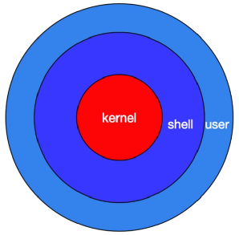

## 什么是 Shell

shell 是一个程序，采用 C 语言编写，是用户和 linux 内核沟通的桥梁。它既是一种命令语言，又是一种解释性的编程语言。通过一个图来查看一下 shell 的作用。

::: center

:::

- Kernel：为软件服务，接收用户或软件指令驱动硬件，完成工作；
- shell：命令解释器；
- user：用户接口，对接用户。

上图可以看出，shell 在操作系统中起到了承接用户和系统内核的作用。那为什么不直接用户对内核呢？

原因很简单，因为内核处理的都是二进制，而用户处理的都是高级语言。简而言之，如果没有 shell，你希望告诉妹子：我爱你。你需要经过以下步骤：

1. 将“我爱你”翻译成二进制
2. 告诉内核
3. 内核通过网卡发送给你的妹子
4. 妹子计算机网卡收到你发送的二进制信息
5. 网卡交给内核
6. 内核再交给妹子
7. 妹子看到的信息都是一串 01 组成的数字，什么鬼？

妹子的计算机没有 shell，就没有把二进制信息解释为高级语言，你的表白也就石沉大海了。为了让所有人都能快速，方便的使用计算机，我们的系统开发人员通过 shell 解决了这个问题。使任何一个希望通过计算机来工作，娱乐的人都能够快速操作计算机。

## Shell 功能

- 命令行解释功能
- 启动程序
- 输入输出重定向
- 管道连接
- 文件名替换
- 变量维护
- 环境控制
- shell编程

