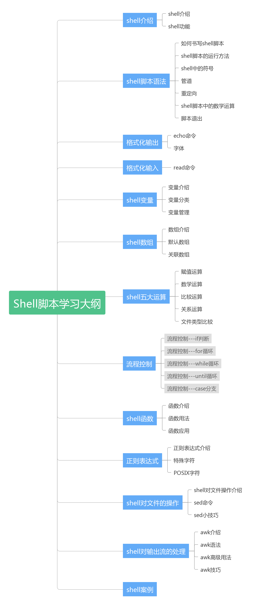

## Shell 脚本

日常运维工作大部分是一些繁琐的重复的工作，每天 80% 的工作就是重复昨天的事情，而且工作量还比较大，那么摆在运维面前的选择就是：

- 自己搞定一切

- 让机器搞定一切

当然，谁不愿意喝着茶水，逗着前台妹子过完愉快的一天呢！如何让机器搞定一切，得以解放自己，就是我们要学习的内容。Shell 脚本是入门最快、最高效的一个脚本语言。
学习 shell 可以分为以下几个阶段，大家逐步提升就好。

1. 能看懂 shell 脚本
2. 能修改 shell 脚本
3. 能自己写 shell 脚本
4. 能够优化 shell 脚本

好了，经过这几个阶段，你就是 shell 大神了。

## 学习大纲

